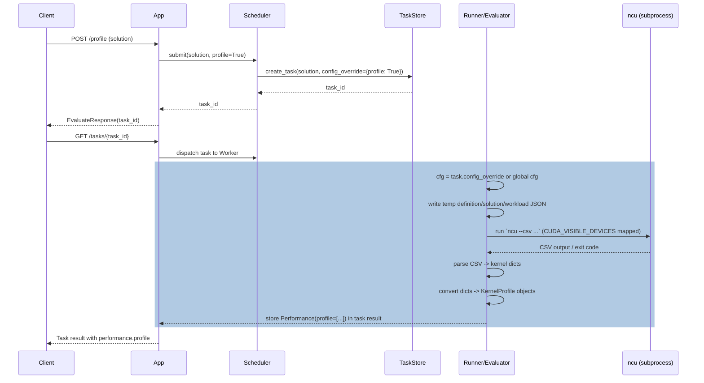

# [PR #299] Add detailed profiling to the HTTP server

source: https://github.com/flashinfer-ai/flashinfer-bench/pull/299
state: open | updated: 2026-05-30T01:02:46Z
labels: 

## 正文

* **New Features**
  * POST /profile returns per-kernel ncu metrics in performance results.
  * POST /sanitize returns sanitizer result
  * Profiling and sanitization are opt-in and configurable (enable, tool path, timeout).
  * Server root now reports build commit/upstream metadata.

* **Bug Fixes / Behavior**
  * Profiling failures are logged but do not fail evaluations.
  * Task/traces JSON now emits alias-based field names.

* **Tests**
  * Integration test added to submit /profile and validate kernel profile structure.


## 评论 (1)

### coderabbitai[bot] · 2026-03-31

<!-- This is an auto-generated comment: summarize by coderabbit.ai -->
<!-- This is an auto-generated comment: review paused by coderabbit.ai -->

> [!NOTE]
> ## Reviews paused
> 
> It looks like this branch is under active development. To avoid overwhelming you with review comments due to an influx of new commits, CodeRabbit has automatically paused this review. You can configure this behavior by changing the `reviews.auto_review.auto_pause_after_reviewed_commits` setting.
> 
> Use the following commands to manage reviews:
> - `@coderabbitai resume` to resume automatic reviews.
> - `@coderabbitai review` to trigger a single review.
> 
> Use the checkboxes below for quick actions:
> - [ ] <!-- {"checkboxId": "7f6cc2e2-2e4e-497a-8c31-c9e4573e93d1"} --> ▶️ Resume reviews
> - [ ] <!-- {"checkboxId": "e9bb8d72-00e8-4f67-9cb2-caf3b22574fe"} --> 🔍 Trigger review

<!-- end of auto-generated comment: review paused by coderabbit.ai -->
<!-- walkthrough_start -->

<details>
<summary>📝 Walkthrough</summary>

## Walkthrough

Adds Nsight Compute (NCU) profiling: new BenchmarkConfig flags, a profile_runnable that invokes `ncu` and parses CSV output, a KernelProfile model and Performance.profile field, a `/profile` API endpoint, and plumbing to pass per-task config plus solution/workload/trace_set_root through runners and evaluators.

## Changes

|Cohort / File(s)|Summary|
|---|---|
|**Configuration & Models** <br> `flashinfer_bench/bench/config.py`, `flashinfer_bench/data/__init__.py`, `flashinfer_bench/data/trace.py`|Added `profile: bool`, `ncu_path: str`, `ncu_timeout: int` to `BenchmarkConfig`; added `KernelProfile` Pydantic model; added `profile: Optional[List[KernelProfile]]` to `Performance`; re-exported `KernelProfile`.|
|**Profiling & Timing** <br> `flashinfer_bench/bench/timing.py`|Added `NCU_METRICS` and `profile_runnable(...)` to run `ncu` as subprocess, manage CUDA device mapping, parse CSV output into per-kernel dicts, and raise on timeout/non‑zero exit.|
|**Evaluation** <br> `flashinfer_bench/bench/evaluators/default.py`, `flashinfer_bench/bench/evaluators/evaluator.py`|Extended `eval_performance` / `Evaluator.evaluate` signatures to accept `solution`, `workload`, `trace_set_root`; `DefaultEvaluator` conditionally calls `profile_runnable` when `cfg.profile` and converts results to `KernelProfile`.|
|**Runners** <br> `flashinfer_bench/bench/runner/isolated_runner.py`, `flashinfer_bench/bench/runner/persistent_runner.py`|Propagated optional `workload` and `trace_set_root` through Subprocess/Persistent worker APIs and into evaluator invocation (process args/messages updated).|
|**Serving & Task Management** <br> `flashinfer_bench/serve/app.py`, `flashinfer_bench/serve/scheduler.py`, `flashinfer_bench/serve/task_store.py`|Added `POST /profile` endpoint; `Scheduler.submit(..., profile=True)` creates per-task `config_override` (`BenchmarkConfig` with profiling enabled) stored on `Task` and used during execution; task creation now carries config override.|
|**Serialization** <br> `flashinfer_bench/data/json_utils.py`, `flashinfer_bench/data/trace_set.py`|Changed JSON serialization to use `by_alias=True` for model dumps and trace serialization to emit alias-based field names.|
|**Tests** <br> `tests/serve/test_serve_api.py`|Added `test_profile_pass` that posts to `/profile`, polls task completion, asserts `evaluation["performance"]["profile"]` exists and validates kernel entry structure.|

## Sequence Diagram



## Estimated code review effort

🎯 4 (Complex) | ⏱️ ~50 minutes

## Possibly related PRs

- flashinfer-ai/flashinfer-bench#129: overlaps trace_set → trace_set_root renames and evaluator/runner parameter changes.  
- flashinfer-ai/flashinfer-bench#220: modifies runner entry points and worker function signatures touched here.  
- flashinfer-ai/flashinfer-bench#204: related changes to serve/scheduler/task_store plumbing for per-task config and profiling.

## Suggested reviewers

- Ubospica  
- yzh119  
- xslingcn

## Poem

> 🐰 I nudged the bench to spark and hum,  
> Launched `ncu` as kernels drum.  
> CSV crumbs of grids and time,  
> Metrics twinkle, kernels rhyme.  
> Hop — profile, collect the perfect sum.

</details>

<!-- walkthrough_end -->
<!-- pre_merge_checks_walkthrough_start -->

<details>
<summary>🚥 Pre-merge checks | ✅ 2 | ❌ 1</summary>

### ❌ Failed checks (1 warning)

|     Check name     | Status     | Explanation                                                                           | Resolution                                                                         |
| :----------------: | :--------- | :------------------------------------------------------------------------------------ | :--------------------------------------------------------------------------------- |
| Docstring Coverage | ⚠️ Warning | Docstring coverage is 61.11% which is insufficient. The required threshold is 80.00%. | Write docstrings for the functions missing them to satisfy the coverage threshold. |

<details>
<summary>✅ Passed checks (2 passed)</summary>

|     Check name    | Status   | Explanation                                                                                                                                                                                                                                           |
| :---------------: | :------- | :---------------------------------------------------------------------------------------------------------------------------------------------------------------------------------------------------------------------------------------------------- |
| Description Check | ✅ Passed | Check skipped - CodeRabbit’s high-level summary is enabled.                                                                                                                                                                                           |
|    Title check    | ✅ Passed | The title 'Add detailed profiling to the HTTP server' directly and specifically describes the main feature addition across all modified files, which collectively implement NCU profiling functionality exposed through a new /profile HTTP endpoint. |

</details>

<sub>✏️ Tip: You can configure your own custom pre-merge checks in the settings.</sub>

</details>

<!-- pre_merge_checks_walkthrough_end -->
<!-- finishing_touch_checkbox_start -->

<details>
<summary>✨ Finishing Touches</summary>

<details>
<summary>🧪 Generate unit tests (beta)</summary>

- [ ] <!-- {"checkboxId": "f47ac10b-58cc-4372-a567-0e02b2c3d479", "radioGroupId": "utg-output-choice-group-unknown_comment_id"} -->   Create PR with unit tests

</details>

</details>

<!-- finishing_touch_checkbox_end -->
<!-- tips_start -->

---

Thanks for using [CodeRabbit](https://coderabbit.ai?utm_source=oss&utm_medium=github&utm_campaign=flashinfer-ai/flashinfer-bench&utm_content=299)! It's free for OSS, and your support helps us grow. If you like it, consider giving us a shout-out.

<details>
<summary>❤️ Share</summary>

- [X](https://twitter.com/intent/tweet?text=I%20just%20used%20%40coderabbitai%20for%20my%20code%20review%2C%20and%20it%27s%20fantastic%21%20It%27s%20free%20for%20OSS%20and%20offers%20a%20free%20trial%20for%20the%20proprietary%20code.%20Check%20it%20out%3A&url=https%3A//coderabbit.ai)
- [Mastodon](https://mastodon.social/share?text=I%20just%20used%20%40coderabbitai%20for%20my%20code%20review%2C%20and%20it%27s%20fantastic%21%20It%27s%20free%20for%20OSS%20and%20offers%20a%20free%20trial%20for%20the%20proprietary%20code.%20Check%20it%20out%3A%20https%3A%2F%2Fcoderabbit.ai)
- [Reddit](https://www.reddit.com/submit?title=Great%20tool%20for%20code%20review%20-%20CodeRabbit&text=I%20just%20used%20CodeRabbit%20for%20my%20code%20review%2C%20and%20it%27s%20fantastic%21%20It%27s%20free%20for%20OSS%20and%20offers%20a%20free%20trial%20for%20proprietary%20code.%20Check%20it%20out%3A%20https%3A//coderabbit.ai)
- [LinkedIn](https://www.linkedin.com/sharing/share-offsite/?url=https%3A%2F%2Fcoderabbit.ai&mini=true&title=Great%20tool%20for%20code%20review%20-%20CodeRabbit&summary=I%20just%20used%20CodeRabbit%20for%20my%20code%20review%2C%20and%20it%27s%20fantastic%21%20It%27s%20free%20for%20OSS%20and%20offers%20a%20free%20trial%20for%20proprietary%20code)

</details>


<sub>Comment `@coderabbitai help` to get the list of available commands and usage tips.</sub>

<!-- tips_end -->
<!-- internal state start -->


<!-- DwQgtGAEAqAWCWBnSTIEMB26CuAXA9mAOYCmGJATmriQCaQDG+Ats2bgFyQAOFk+AIwBWJBrngA3EsgEBPRvlqU0AgfFwA6NPEgQAfACgjoCEejqANiS4BBWvSW5tV+r3wAzeBfgYikAv6wJJAAEtDQAAqQiJRSFAYActjMApRcAEwAnJkGAKoASgAyXLC4uNyIHAD0VUTqsNgCGkzMVe4WaIgIGO6UYNptHV0+vRRgqRgMsFXc2BYWVVk5uTEUXABesJhEAGwA7HsGAMr42BQMwQJUk7Bck9hgbp5WBtBoFKS4kFeYU1zM2gwxycuGwlX43DIBnyJAk8BIAHdKOCDIUVCQLCiAMIUEjUOjoTiQdIABnSOzAJIAzGAqQBGaDUjgAFgAHBwSZkAFpGfTGcBQMj0Dw4AjEMjKGj0FpsDBE3j8YSicRSGTyJhKKiqdRaHR8kxQOCoVCYUWEUjkKhShSsdhcKgI6LJAEUeRyBSalRqTTaXRgQz80wGdqdbqjAD6EymVSj0yYPXgRA03FkHAMACJMwYAMTZyA2ACS4st+PoiGd73kIqm22kBigdiU9FwsFxwXIjoABgAhMhTF0Aayx+ATRE7kFo1DQDCGyE8GNo4M7Ty81m++HwFkgAF5IAAxNCYkidgA0kE793D3Got2iuD4u/T93Tp/QGHoF4Y2HD4jYpyJPhfLuVIkiSnYaPWkAJPgCgULiiDcCOtA+H4EiHvAk7iCOkAWPgdQMJACKdOg9h0FUNa+ASPjnuGV74IguDhj46i0Z2ADcgTBGwLaKIAmATICQAAeSDiL4kCUBQ+B8Fs77eGJmDSiO96bpA7T4I6uIAtR2A3LW9DUS2wRdOpWDIe47gQUYOZ5jYFg0Fa8AjsgASGROogdA5Tn8O44mCYhFDWlJPCNN4BHsOo8KIJBjYEvOFiLv4MGdjOnTIL2NyDsOo7jtRnYhsMPSUJGfbTLG5Ejp4SYpp2aaQLo54rlYXACBuW67nFtAABRKO4aBzLg24HkeACUnYGHVUCft+14tlwDEPqp8Lxd1JC9f125Pl+6ajeN9VTT+8B/ngXCATui0Lita12duIEkjtqI+NIjAyaQtBcAA1FSVSUkYhSPcgFGvR9X0/QYACiDGHaWHrBLicKIuJ5lSUShTqRmWb1kG+VhkVZVlbCh7YNQUmIFUPV9XZyapuj6bWfmRYWpKBLlqwlbec9tZRZ2AAiq0U7gYNoRYRMEBQGgExYV6UO4UkApMx6QBg6mQFsyAdpAA4kLICJSbQYAjhY8jXlQ3HIueiCbngjkYK+nY6xQA64WgtCvgp573tOJDhjEjGSfguDgZABZfIeRGyMgbCdGcT0W8LWFYB0NCTPIcJoO7h1exQOkYCoVjjm7TDzMqEd4gn+LJ6pknMObm7honfaRfnMirVJJBngiCBWCgcqSbQ2AMChb4kch8eHpAESq8E6RcB3ZDngw7hVZJzwK6gZC5wSbstS2Ndx9b+fvue9uO/gzv57iPCSXCTZnuo3cSPgmvIMuy+ruGWcYDnAh54lkAf1BWJciXw8F4QeBcRxxFwM5IIf8SCggoOQVwr8u7sAoJFbuAROwAGlKDkAsBEZBCtBAiDEIgDQ49kGDwkiTdAF8GB9SIKUN89BcJEFeugZAaciIIMHgieod5pwDn8FQC4Z43auUaoPeC/UUDICsO4L4OkfaQE6p2TWCCMRXkIcgXc0FyCdmGoReo/50DmWVIPVyEsRbW34HgFoJByFwGCG4PuFwPwRGlrLX4RClRiEVsrHwM5sBKGfo1Eg251F4K0SAqwiBwJGFzPmOykprbORgq5JQKVPIYGQCKIS/lAp8FmN/eAYU5QRTrFAAAsnA2AihoiJhzvA4I2BuCYToFwPKQwcYUGKjcGMJUqhWOJhQUm5N+pUw4BwXmV0BZCxFlJcWQspYUBlhQOWFxOoaG2TtCa+ZSL0E1trXW+sMCGx4O8NAptRm1TqntWOVsRxcAAPLcFHhYAA2icPeI4AC6Z09HHl2nsu2UkT7OxeW862h4PkAHUwVO1oP83RI4gV3L2h7C43s4Hvw3ESV57yPkRBvMiqCqKxp7JhPArAuBZCQkgDpQGHTzzQFaVYIlnj1neLPAS6FnzBaE2oNbX5vyxoPXIADF6zL3rpFZN9OkRgIa/mhhqWGsJ4SOlWmsokIREywBpryLG3SRi40GWVX8KFJkGsSYWYsTMywVldOzJlUUGwHIAUAyRYlyzcAKb/LpoYTW9LxoMi1vgqbjndIBXu/cwGKwRvk5GBIX4xMztnDeWydnjncIy+OgRqB/yUTRB58d37Z0oOOHSmpzz3BylgNO5YBBuAuIgRAYiFGUEImg0SfhOw9WYvHDQQgLY2zPJ2Et1sh0jtdofUFDtEVTpHHWgIacaDMH8mzZCuIxBSVkBBKABZ11WFlNaBIgDIDcTQQwZAMQrBiBsandA8auxntyOGKpYNoD5ALFiI4454wMUwCHQ+AH7z92tKaKa/6WBy3oGCQev6ABqf80COn/LML4qiIDXokH6a8pAUOOggJe0pyBgDbI0HoP0uJuAdFkGAZgihghoF9aFIV2EIAYAkLgQSfouM8bAIE4WShIAUYMfu/ZTYnRNski2gGSlJIWDAGpR0btqHSQUnJIg/wWPQLVQAR2wNIa0gDuY2DcnCC4/qvyTg5JWxAg9OymZsOGRDBYjgFm7IUMG4ZuZgzc1iMGf6zw0Y6C2zihbP6UH4ueCAShLMK3eEQZI7B0AMCYBQZCvhDZiMPlQJAT1Oz5B0r+EgYM4JSXHNhcdjRm3SDIeYI6As/LwFxC7fgfBMDyCVhgMA6xKBJVrb5O+qqVFCeCRYj+9DrQMU1BQKos2TEGRgWwVtaBSDDQkzFVw7wHNiVYaU1SQVX2QCQ7Y8ox1FrJNGedy+eIUhdzktIM8YJCs4Y0NzUpuAYTOwrb/XEzsItIbPIgAc8AKgMowHfSSCIZCdAJNhVynYCzc2zUtWgIO0C9HOcbGIJd7yHfmU9TqMlaBafEuu2lVQfBCwwpAInnDD4YBS1eu8aDfDID4TvHiYIFI3pIMbEZiBhpnnjJA5ARA0G0BjLhBgQjAA4BJ1NAZ4BCi+GoAXAJzrxTSRgkgpA+DeAYm25hsDqWcJwiJdmkIxiRIxBOL70K0HSA4qw833CodiVnlgJWGtcF28wmnVALj+50Esja677Gcm/wye5S58dck+UTQFBHRSQqHfCuISpknmWdlfe+z937f3jk6obr4IoSMERzmwNnKFhfd3PNjINfTozmsOpa6qW2DmdLCWWz+Gb+1Q/jlwGZA7rYg8tkPyA3zHkYHbgi0+b1IDwvnQvs88XSlrnmmeTFXsfa4v9pCwlxKWyksBWeS8M1bzzTOptbA6Zt8Z3/CdOUZ06SkkMf6SAf0GIfM+2ID5W++YGAsgIqdaDexqhUwaZqoabe4aHev0/0HMlEi+MqAArCDAqpmLTJjGAEYI3pAc3tMAHlULRAOrRFalgXTLaozFaMzI6lWD5C6gYAGgVBGGVMQaQYPuQdVP4o6IdAUs/DghovgoQtmlXOeBoDvsXs7FJiulgPkqFHfMwP1PAGAE9igOusjBbgxIYmpn5MjMgHfI+p2LRIeJLOGNIe6p2OmEIXggQqmi+OgLhBzhhMEP7EEHwDvmALiPXM2HStIJtjADArwOqqcIYZoQFNoV8MhPQErF8ONiJtgn7iIamjOh+KYfMKxPbrEf7L5IhDECgJoFZFQRHvHtHjApkh5JHgnnkUmsKKniUmUuIJnq6pAGDPoZETITnjYckfYSvI4e4OISwT0oQWTFOFUDvhGioriGAEntaLlPgWwYMhwUxFweGFMY+vwVoe9DROGGYaxMNAgRKkgUDJAO9HSCSPKoqpDACNaKNnDBqojNqlwDUshMkAajgXgRAUsf0sQZMSmGmJQTagzBKLQQ6qzE6tWFKq0e0UnLIStooHMCQDFrStwIPFsQFDrgkcEJ2N/gHJ3lJmnOrHMQSBELIJOOUgRIxkoFuEkcIX0auOOC2AWvQm8tHMgNbmALbluAkA5owl8MOOungFxHAlesgJ1NyYrFcm3BOGcJHmeJLhhDLvgHLg0v1sbriHUAxGbNboEADhjnqacIwhhuRNOEEPQAgLgN4fiDwJQBcHKOts9pANzPkDYFUt8LIDQMgPqVUAiN2knGeCqV+NeBXNbvaU4KQMbm7PgFCiOGPJ2EJB7OGBXnEptpBLkG0tDJYh0daJ2B4qsl4vLOONSXbu6DIY5mEofnyh8niR8rYRiAyVYCKgCuSrfHKEKASAEPQnBEbH0JKV6n4AHkdnwJ2DMKIbAoZsZmQpBNBPwIZHwCSfQCWVuB1MbrTphCTIGXwPGMpEpipjhHhIdstqgGZD5EiHQlKrQJZAkjZKUakuUcEJUXHveXkjmSnsFI0eJOUi0ZBMMU3uweMf8bIBSvVNtrUcnkuUxhYJ0ilK2pAPWSkSvJ1N2PDlUlBbCvUNzCqfNLXrsnclAHuOjpUMCvhTWtKXNPeCBeipNH3NkuGDklwGpAWruIRRdOhJ0BtEQLMLRKVuGLRZHhoCzNtFRaRZ2IqYvrWYBKKiRSCt/CqQOFwJJXKNJeiiCpqSJMiCsj+K2HiIvqdCxejkrt4BxemB0IyrALROpdqaMlpS2PqcJTJfcswNpZJNgMaXgFeGIIxU7EBPuIZexYgBtIgM5S5UabABhloBIFVGIOGB4FLGgAON7GCE4I9LQOGBiLpnQA5apXtLQCbKFW5eFR5dwF5apD5WdKxctAFZxdxXxflXZWFRFWgFFcmDFXFZCAlUlYBqlelR0BUFlXhdReeHlVcpGJ6dIO/Lpd5afL5ZVV1NVemCNSFXIF6ZNc7IJckNlapTRflStRNX6eoEnNNcxX5WxcZYFYtflWNatQdTQBtcwFtUNZ2BYHSOGJae/PiJ5USExbNf5edRtC9TQIJDxdijur0u9bQa1bgI9aJRYOkG9SxLQV9cdb9WdfACZXZIgCDTEGDQjb7PiFDTDSCl0O8HQMmSQIxq6NddICjRVX9ejRdWZTcLRCTW1uTc5dbpGLLgOETXtGafCFIGlUGa0r8LIMjWVTNXTWjSZcFbRNwhUHsfelIJFdFYxO1XiIleWN1YgorSqCQLzZNIZK3OIPQpLMLSGQwGLSVd9eVQZdLRdbLcmWgMJMoc5fLVjZzdOHreGJbTOF7NbQbeeImVQOTQTtelWXGZ8n/rgAAfeGeD9c2SivortFABme0vQIuRelBTBbOOPJyhsiQMhahehZhdhQThzoNaBe6h1N3oQhHTnJ8rWQhY2SQInWSsneKk9EyigcyDsFceDDcSqkxrAvDJqkjAFC8XQPAO8ZQZ8cGN8aav0qsFIFUCxtwBQVmMCXamCU6BCQwScXWE4tELEJ2krHwREVAsPBFJHd8NgF4EuXAs7FOCoiYT7TBixBYWOrRK0vNPdgcSbomnjoUfXkjlUOOH7F8PBIhDks4mgLIAukHCHJiDBDIeburHmc8kcNAJAGOakX/P+MEMyV8NbmsswHptENKfTuhJhDYm7BOthLiFXmAs/EMvMviK+AIHgNJswOoOQ0IIIEYjvCmivNuNAFnArC5DAogFMHQEiZ1nlnAmcFHp2AKsLPiDCAhE5ArFzrAO7J0IlRhAfB+ErFyt4P1mlfQxgPRdKYHIRQ3TlueBMfo6TAINQFMP+tCcIp7JAAAFJHDPIJDH1oLoTrCR4enRBc5TCOaaDLl8XJDcCdQlkbTDojjCX+oxNQVxPrqJNMbJMjr34el7H/ViNGajTDniRmleNWZe53YxByhiLXYWIwIdRSmrbdxBJSa5RvCg4aPQMxCSEiLSDxJWTh72TVEPluRZLjOvkFLvnFKhRfnNGRTRTuo2ARAFj4PCltC5rWy12pqdS4j6ZcCqMiwkAwiTk6G6BUYnPqPSB9OrxYB/kEFlTL0kCr2+pTGAObzPwAACa9yY9EuAnU6YuD/RIWdzWjyZUF24NzNAvTWjo0Em+QeKX5tAiEp0UDWj0QWw9KrS6d9eTzPx0Yrz7z69PBqifzHznwwLVQwlw0XAqD8879AcJunYP99492aOC4OurkuI1KBIfjATThI4RADmiRVex4Y6cQDmS6Y6tA2FaRQd746LcocSlkf0xx3dH06QdI306Q1xyqdxw9DxCa49RIrx09zAHxEAuB89gazzgyJL0j5pcjG9tMW9NB0MLMLo+9TBbqhJDUdd64KkLFh4MQ44gu1y/qRwMjfcVgYsjaPDQLFGo0HENTwjq4oj4jr4rkzrsj8bjAAOXpT6nJTgoOCgo4/AcQUuwQxhAesFeOGgoWnsnUt6Fkb9o4Z4YSWbpTRjFyraT0d8gE6S+jhbeIg66ZmZ1oZbQiwyeaAQr2Q8Wq5iUgFblUcpeayUi8Z0M7zQFUiYsV1brhHWx9Fg7b8YlU8SUAWIl5EWAA4hEEApY75KIDPowGYb/Iu5YmYkrTiQvGON3NqYDiKKHHA8gPBmJOOhiOe/u2OLlvQF0R+MfIituMhwvn252Dvtir7HituG2xoD+IM9h023iufMliejriYVxd+MfJQE2zpN7BPtbJmhoIi8UaMykl5JI4+bHtkjUZnUFPM+nt+cs6nVOwSNxHUmWI0tQNHJ0jGy6/GxtQIEm629B+Pj8hgFwNPvHHPivs7OGNgHfYuPXTCrWfNG3YCh/lRvNOOIAEmE54Cn+bdHib6ganZ7GnM+2nTHI4en4KaVRnGE4IvKkdNZIksdFAlnqKXbQbLUIb+4YbJA1nbOYqGrXdl5H0dIcqtIBrUMRrImJrY9zxkAFrM9GMNrXx9rRL0wJLM73sosDiAJ1qNkIJJYM29Bzq0JvI2eCHz6GhfqIoPYJUmUsHfbiZHZzYMCnY3TA4449budOjT6yUsHh7Ekrhpnny6U/Y7wQ4sHoqWuV5k7+L03+jRwDXzQRbXsM7TJKD6WAuwGV97yEIT3kbcCnay3o4q3cE63kAIXDdHyW3sAI3o4p+rZJuZ9d4rc0CqARO/Aco6SMCDAl3H4M3dagG8sEms57hnaM7FuvQvtXckniguS25CmKk+555wQ3dIDFR8A5kKiQkIkg8gGoIpMO+QyFW824QhQB5+EsCWkUeub0paZIzt5YzZR3HkzVRZRMzdRJ7QnTRFSUUR30MRP0nRATScn4BVXi9UwglJ9kh+j9XrcGgM3Z3JvSP47V3+j7n7gnnk+OnY+hE8+BngXJnv3sZ/35n94UX5AouK3+AR7SgG3APw3O3WUlUoP5AyXtnKiiHTLn3gfa3SgEbly1yaZ/rsU6Ov8CvE4U4DbnSixuvsA+vFAytdXDEJvM3e7ifQfa4f3MKgPwPkfwzaXkqekH0mQ/dSqeXBI9x6qprxXpXVrs9FXBgXpUCC2J9Exxm2KZfXsLG8AbrVBrX9qu9PrnXnM3XYFRJCMnQsgkw/gxm77BRmHs/Pe14rala74nau/jo8uVIGgqBFCMSKEmuONE7hoMCE/3DvDT6GW26L4M+2MIRBMG2DUFoyTPDB0vaz8OroY3g6cQsAiEeYM/DvafocGM7UmAAG84BtAAAL7X9xAW4FoLRjgSTpIIwcDhKsEvquRce0iOyLIiZZHo3u7WcRM01awMQqmyJASGw03Ys8wQOUZ+BEBsBHAjgYMVHBJkoE5oAoHhKht4HaQcl4IfYZjEzhHCzFKc/0GogmV4HWwPk6YEhoWQuDphfkegsJMYMVYGD1kN6MDGIDlJbhUolAGXjSnYGjIvgkpVBKmAnJ302svucOC/Qla2x+KpaHJLbCsr2QPaRUOyrpVtgs9Sk3sLYGzTYCU1gKcrA/lcjiGs0yaSQ3dDEISFZCKau6dKoJFfZShbYsuQ8OzUKGc0ohZ8MdOUMljZCqaBAJwBYAMQm4iG54cShhzkpy5xwjPTgYtysC+Ad4QkL2uckf7scxenHQXgjx45TMZeieN8vUQ/ILMM8yzGcjBEXIzA08ivWlFL2fJeRu65CTqM8jOTyA7+R/TgTmkmCbsJ+0SFeFeFSidQZw8IOUGUyIicJ3UuUCfqTFq6z9XmexNEhGlY43kSumAOnsf0IpdwbADdWQP1niCd12+yBYGH3VBg99biffY1gPyK7IxJ6bxEfuVyNQ68oC/SfGLwJJisNBUosZfh61BJesOuUJLflAFhITcIsKjckRQHzgCB5oXtfMOs3CblkxIUQ9sAjCOT2w9YBsKsJ7zHivdwh/qCWCslIbeIaou8Lzh70JSO8/kLZfRGOjQ4Qp1R1ZZfP5yj6StWWWHPfBAxD7H5YAJoq9m0UEhwlOyU3WFosjnYKwFe5EWcGrz5EbMHMPDDyOcjLL2AmmRkShsKN8HijTk5yGMi9zT5vdRkEmNOtDHZFUjXRvAhWDuUUwS1HQAQNZNwg/CWNbYeol2AgMw5EcLRpHDBLMPniYglkFQywQXRY5lNTaFgDiEjhkZy436cEZUBKkQBNj/0H7TSICHA66RkCBJZNJqJtgTNqSSJfrgYV/g+o/UrkdWKiWCDLZggmdb0XyU17wRryJRcXveUl5Pk+O7MATg0VWEics8UItcIS2L4DJ+kc7CkY+LFjVQU6JXWpPUm3GycL4eLaGErm5GYpcA9Lc8C6LFgKiGx3iFjmvnVQXAKKFAM8AACp7euzA0aF0nEmi/OiKEPkaMRQYSuB2HffPimlGfJrRJo5LqylIEcoCyXKeWDymIkfJYWwqFSvVBqQ8R1eO4lpOJ0Xwpi1G1It0VBIswb44JiE5CU8lQn/d0J2omUsWOwku8kUUk7fOWJxSWjxJMKUiVJOS6MSl0oIqpOCN6CcDrxQBQ8HCMoBHF0uHfM4m/m+gkhcuGIxSAV2xFPFcR74/EdayJGsE7xZUD+JaGpyxxSwveS0DSJa7b16Re9TfpRGV7MiHRrIzsEcFqyyZ6sRoujh/EY6acbuaWC4G8n8A6w+uMYvlBchNjxjEAgAFAI50/nWSfp3klJ1Ess6c0cpLxRWiSUUkzsMVLdh5j3g8JCmhMwQioZEEzvB2J2jqxwVjC66DQPYTkwCSksgVASf+0wmr58JFY/2MNDY5idjuqUmfOGFo69IBe2aHZthC/HNJf42JI+HJIw51ScO/sKrMRIKnSlwhEmYlAOwLE+cMAeHZ6UWLkmodTppY86YRO3A/SIGy6JKM+J9q1j+JKbV2MGLEjqwfAGGHljAmfHvt5gFyHeJ1ASKDwQicIMIuch4atpHMhYjPiV0UB094QH4AsH5KlDFYosYsFKcWPSmX9n4xYz6ZVLOlKSLpA0AGVWPPDUyGOljfseUzxBTBogz08SDoP2mNAcZMrDAHuI44nijxvHaZosNmbLDc+awusCr2tBbiZOzSeTvFJVKJSwUyUnmc9Nt6iStOU+Z6SrnhxPYuAKFW9I9BCCaYZS/7G2WHwdgR9Ewc0/UQ30+Q4SF8eE/6Q1NUkkSmp1UzSaLJtjqzYoe0rAAdK14mFLGm0g2dtMBDPCRwZsijNBISzCS3IngQfChJHx5zfOQszTt5006i5F4LsjKOH1g6ezF83suFHJP9mszCJjUk/BpKubt0gUiIg+igXSDpBvoVIWyUPQcmj0nJE9UIHqjcm2si+JIlvIMm8mUAZgyIDSnKACl0cmuQJYKZ63a5hTGREU5gvmQczak5QcUmTHrNbRJTuZVjQsbwQyn3dnIOU8sk9zyk31ZRyIUqbTLNHNyAZrUw+NiT0zVx1xF6erI6WPov5Je1uI+UnC+BbTgEcmF+gqLIZjhAiR9WBQLwPIxkX6KyKBewETkDTk5PgNoW4Hwz4g9MBRdWKtkQCgLVynMyxByMRlbh3Q9MvGc9NelpTdRH0pBRoGpbphixwlb6d/Nw5cKeFAc/2Gk0wTAyZwZCMGVmkcQIABI0U98OQxGBeI80zVZwBvF/hzsbEB2AiDoxMSAwQxw2SGGJG0UjhyoPcTcMplwhoY7ELAJ6Gpk54qxNM6Mm8NOVF5JIDxXHasceIVngVCkKw4Tksyzy3jZ5pUeeeWnmyQKV5vsSJRGk6SHyYlp8oaYgEvn0dr5xs8GW+KTEzYtZccnqJFnWnxwTZxctUZOMtl2zyANsq2fbMdnlztMkAJvtXNHBhyqR+8N8Q5z7SrRClvMttqbNLkz4KlGIR6NUsqUkAHZskJ2RXMaWuzdunbfqeVKDkNzKpTcz2ARJUn1z1JocjuVpIjl0xdJUOfSV8EMkwjjJ8IsyUiNOLnFdWYABVAPUNaYiR5jxLVM5OH5TzKuHksJWMScBVAUmVjK2LWI3mb0t5dIneRvz3mRk8gXE3xv40CarB0aZjMJgsQXpfLiCfywzkQLIQ8EAgFNO+AFXGDw56ALTCVmqH7Z7Ze0cgIpgzR7YSMkotskgGhRpIaBYmfcddOGD+V8zpwkkOCh+1uqwMWwZCKfJCAHieAWxng8dM1S9joqV444CHnyufgsr4m7KkdKjJv5yhtw6QKAYJA6ZewlEcCGlSrjFrVUSmSXNHjQGA4+QWAh1RzJSoCrsRzYkq5VQbHDAyrb58KkJk9AFm6NiEyoQRro07CKq2VHKnwEoHVVn5Cmxq8RmUx8BAdhQPkANZk1ZXcAnVGAVVaGoGhWd7VnYNekKBTWSxXVa9bwE9CF7V5Owtq4ptmwPoTNOSPqvxIKwSA88nshhEOL6iFCCrZymSImb4CqCIpeeh2IKJmPJ42LCIxEI4ZMM8XTC4Zcw6Xi+UVly9BOOwxZkrw2HkBjhpw85IBFwRjx3ViKtRR8BSyqt/Uga5NRyvBmERKAVPS8hxB9yZ1rh96faXkvgjy9F1GeeQL4rKKU8s6ZkEmSCO7lasziIMQefct772S1Uo8l5ePNRgIh3ldrT5aMT+Ksygp9MEKWCrZgQq6wBYR5mI09hHA4EkhfAHxS+ydRRo2+KRpQARXwBQmeaPJD3HQRVoceU3dMDvkQCOEjkB9OcEMUmLHqcmSgPJqkzKaYIuNia+JjxvCTpg/lBTctdSpNUkanC9kIxbirKACtYVB3OcEFC9UspBmYBKDmewGaew4kKiDuKuBwh4g4QkHRaqtFHxOQXwY6dMJYxY2KtrCfC8cDuso1hNzKekEXqCNsheKZhEWd9bOv8VzMX1l41ooCnVaIF/15xbvoPXy5gbnlZrPEZaxg0zzRinBD+khuoKgq6Cu8xgl1wMBgU6gVpVxjEHoCcN76wCpwEOULh3o80yK4kWltWIZaeCxhcMJ8Da0sQVFxG18EZsFkfxn4RWkeo8F2zBAQgYMGwKjhNzwRNwqoCLOywBzVxNI/sYIAUB56dReo8wQeK41VKYJ0wUkRMD4EcJ08GUFQDllclgTPteoXgYXOQkw3KRXEEnRElYDUKwg7caEYJt/EKy0QZQH9DDt/VO0LbWIXbGMnMGhiDEWANEdrUVtWIyxutgHY9quldBDJtV93DiNhC6y+RMp87IIOcIvjKJMEgKQOCyJv7pEim5hdKXMV2I/bGIFhVlv9t/qjULC0sqYbLJ8XyyFhQW5WSFuCWRSeuX6pEi9qkBbg5ihhR5qlrKjpaad8St8a/Wp1ZE1OXwAIINrG0TabQSbZxV0BrxiQxZd3VtGjvnJ8JT+hOw4iCnp1naQqxefHTBEG1LaaAkAVbVrr8A665M+ujwobpxLG6LlPc4GJcTRGxbHl8Wwfq8qnpldsCfIAwAaFRbsw+oYobeZiNtByh7QqGdfmzHdCqotQ3oXUH6EMCR65dQXSaqPTJqAZIi4eyPSSB2B0gqQJAVkHSB2DpA9g5kA4LQD2BUhMgVe7IFSFZCsgdgtAVAukHoQkAqQ6QOgO4AECZBWQ2eiPQKEgBUg9grITIAID70kgSAqBVAnsEyBoA0AmQdIJOB2BoB19ZiBvQwF7ob7mQaAEkMyGZCoEJ9+oafXsFoBUgGAdIAQAvFQKchx9rIUkFSFoDuA9gY+z2JOAEA77aAAgbvXQHSCoFt9k+yPXsDpBKASQve1AhcXsA9669P+kCHSGZBUhUCAgTA+4Df2iBXGo+5kPYGZCT6p9EANXZ1sXAF6NUZNIUNAen0hFyaHwL2B2IHBY1i9XwcPVgN2jpgkAEQfIN2G5p0BBSJ6CIICyyqMVEuJ4Pg0gGeRB9Q16YaQ0eFkN1RFqZddnEQGHBxBHSd2rdRYDO74hlDkAXg+inTDi7oC/SC9omCpgmGzDqlJjf7EPB7ho5LGrgHSDUOOG718eDCi2CwrXpy6orEwzZPRR4CvD6hyw6SMGTPixkfMCZCmHsOOUnDLQ1wzcNSQmHPDyRnw6kj8OwAAjOFDnCEZIrhGSKFhlFaMVbw8M4CsgJIzlRSMuG3DJhvYBEbuQWG3DeRgo0EfcOQBDgYR1o+UYa0AUflQFOo44eaGNH0j1mjw60ciMdHS6gRrQz0dCN3JSj5hqI8S2n7/NEjXABw+YYmMWA0j96nJCYeZCzHIA7RqYzkk6OaHa8mRkowMY2M1dp+ebONuvNqO7HkjBxo4/HhMNUhzjlx446koWOFHgjHhh42UaeNT95+TjUHMb1xB2HPj9R7400YyAAmcjTkG44sbuPgn+jZRn4dCZXp3CARi/RE6Ya+POHDjqJ4kOifmP+HbjRRjIBCfWMVGQ0D4jkaTGfFkm9jbRlE1cZ6OarsjdJ/IwybBOQAVjdUNY20ahNeTIlvkzcP5IXkviPj5J5E5SZ+MZGuAZxoU/yaxOgmejg8vEyyaGNWHowSppeaMhiVrzlTYx/Y+qepP/GdTQJvU90ZMP6sjT0p1k8sXGLoqAVWKlUzyfUN8mgTpx2k7qZBOumtTzJz0yaf6SS7uCAZik6kepOCn6jGJ64xGaWP3Gwju0KU+mFVT5AvQ6gWFJJBoAEJzAuAKwCYY20xAvDdmupHMFoDCH5Kgh6szIb4MxFKZARs7ksZvaiAeaXAMDG3A7MYRKZFZqwH2blwmGhzdZzszpF5jSM0EnvScwOdUjtn1DckTWLQDJnlhpAPZkw5mDrNDBcAK5jRv1B6MfISKgZi4+wYSDSkDzC5pHuDjzQrn78yR/gT0ZnPJGFCmASPAeZXPRAwcra+gNeyYyFntQuAGLAgEYSC67c3rNmGvC/guANAb5+oyWQPPu4UIqFxw/trqAN0Vzd5tgAeZCRPnPetMD03VGvP5mggcuQi/rS4Dphxzl6/s9hfMMfnpz4jAEz+aaTWwDzR9Zol3AADkjYNyClRcDAJngFiasWEEiBBM4ggl+3IAPOR0NhVxMsVW5EXPwBUg5DdBb0G/HMZgxaipHvRE4RIzqSxMrPrEnbgIBBZNWldhiHkD8Fj0qWE7AOVUjRz0Iewr5pN1cqMIn06sCAV3BktRAhQKrTQKxbaPoWGLmF3wBFfUPbpYO0cNs6oeSO4WfAh4Ai/eYYsCX9a0Zyi8kdvNZWLjXRrQ6diT5UBSAcVi4+xZUO1nvzfkDoDxdSYMWSrg8JgLoYIyoAK9GgOkHSAACkhEGy7o2NA5JsA5kUpK8M0BBEDM3gp0fBDqTxRGBrIEkBoFAh9WULAJ6bZpwPMln1Aj5UU2ps8LNM3DF6JAOSs4jVwAgVC8QIgHcDyBXI7V5QARiiHGR4oG15I1FYuMxWiAVVvbWgjwsZWaLA4Oi8RYOvkXVju0X5Eec6C4BBDTFg8ySDgPL69gg+ofX/qpBoBO9qBBgGvoXhsh0Qs+hfVSFUDH6G9OwAQDsFEBKAe9j+5kIjbxsHB3ADAMkFjloC0w8BgYKAMwbYCsGfaQNrGgwdv2UGY9BG68K9nq6fUuD5BrAaZRhvEpXstAGwN9mxGiHmWw4ErModQIc2KDUAEW48PFss8vYgt/0EAA== -->

<!-- internal state end -->

## Review (6)

### gemini-code-assist[bot] · 2026-03-31 · COMMENTED

## Code Review

This pull request introduces kernel-level profiling capabilities using the CUPTI Activity API. It adds a new `/profile` endpoint to the benchmark server, allowing users to collect hardware-level metrics such as register usage, shared memory allocation, and execution duration for GPU kernels. The implementation includes a new `profile_runnable` utility in the timing module, updates to the data models to store profiling results, and integration into the evaluation scheduler. Feedback focuses on improving the robustness of the CUPTI integration, specifically ensuring proper cleanup of activities via `try...finally` blocks, correcting buffer alignment, and refining the logic for L2 cache flushing and median latency calculation to avoid skewed results.

### coderabbitai[bot] · 2026-03-31 · COMMENTED

**Actionable comments posted: 6**

<details>
<summary>🧹 Nitpick comments (1)</summary><blockquote>

<details>
<summary>flashinfer_bench/data/trace.py (1)</summary><blockquote>

`50-65`: **Constrain kernel profile shapes and metric ranges at the schema boundary.**

`grid`/`block` are documented as 3D vectors, but the model currently accepts any list length and negative numeric values. Adding validation here will prevent malformed profiling payloads from leaking into traces/API responses.


<details>
<summary>Suggested schema hardening</summary>

```diff
 class KernelProfile(BaseModelWithDocstrings):
@@
-    duration_ns: int
+    duration_ns: int = Field(ge=0)
@@
-    grid: List[int]
+    grid: List[int] = Field(min_length=3, max_length=3)
@@
-    block: List[int]
+    block: List[int] = Field(min_length=3, max_length=3)
@@
-    registers_per_thread: int
+    registers_per_thread: int = Field(ge=0)
@@
-    static_shared_memory: int
+    static_shared_memory: int = Field(ge=0)
@@
-    dynamic_shared_memory: int
+    dynamic_shared_memory: int = Field(ge=0)
@@
-    shared_memory_executed: int
+    shared_memory_executed: int = Field(ge=0)
@@
-    local_memory_per_thread: int
+    local_memory_per_thread: int = Field(ge=0)
@@
-    local_memory_total: int
+    local_memory_total: int = Field(ge=0)
```
</details>

<details>
<summary>🤖 Prompt for AI Agents</summary>

```
Verify each finding against the current code and only fix it if needed.

In `@flashinfer_bench/data/trace.py` around lines 50 - 65, The schema currently
allows malformed kernel profile shapes and metrics; add validation on the trace
model fields (grid, block, registers_per_thread, static_shared_memory,
dynamic_shared_memory, shared_memory_executed, local_memory_per_thread,
local_memory_total) to enforce that grid and block are lists/tuples of exactly
three non-negative integers and that all memory/metric fields are non-negative
integers (or ints >= 0); implement this in the model's constructor/validator
(e.g., in the Trace or KernelProfile class where these attributes are defined)
and raise a clear ValueError/TypeError when lengths/types/values are invalid so
malformed profiling payloads are rejected at the schema boundary.
```

</details>

</blockquote></details>

</blockquote></details>

<details>
<summary>🤖 Prompt for all review comments with AI agents</summary>

```
Verify each finding against the current code and only fix it if needed.

Inline comments:
In `@flashinfer_bench/bench/evaluators/default.py`:
- Around line 205-211: The profiling block in default.py overwrites
kernel_profiles on every input iteration (using profile_runnable ->
KernelProfile(**p)), so only the last trial's kernels survive; change this to
produce a single deterministic profile set instead: either initialize
kernel_profiles before the loop and populate it only once (e.g., set
kernel_profiles = [KernelProfile(**p) for p in profiles] only if kernel_profiles
is empty) or merge/append profiles across trials and then deterministically
reduce them (e.g., pick the first/median/aggregated profile) so sol_latencies
remains independent of iteration order; update the code around cfg.profile,
profile_runnable, sol_runnable, sol_latencies, and KernelProfile to implement
that behavior.

In `@flashinfer_bench/bench/timing.py`:
- Around line 141-143: Run the formatter and linter (pre-commit/black/ruff) on
this file and fix the flagged issues: run `pre-commit run --files
flashinfer_bench/bench/timing.py` (or run black and ruff) to apply the
formatting changes around the launches.append tuple (the block creating launches
via activity.start/activity.end/activity.correlation_id) and rename the
ambiguous variable named `l` (Ruff E741) to a clear identifier (e.g., `idx` or
`count`) where it is used on the lines flagged (around the loop using `l`), then
re-run the linters to ensure no remaining violations.
- Around line 206-224: The current code builds corr_ids using a set which loses
launch order; instead iterate sorted_launches[left:right] and collect
correlation IDs in order while deduplicating (e.g., maintain a seen set and
append each sorted_launches[i][2] only once), then walk that ordered list to
extend iter_kernels from corr_id_to_kernels (keep the existing checks for cid in
corr_id_to_kernels), so measured_times and iter_kernel_data remain deterministic
and in launch order.
- Around line 215-231: Don't turn empty iteration captures into a 0.0 latency
sample: when iter_kernels is empty do not append 0.0 to measured_times (or
append a sentinel like None) and still record the empty iter_kernel_data entry;
after the loop, filter out empty/sentinel entries before computing median_ms and
median_idx (use the filtered measured_times and keep mapping back to the
original iteration index via iter_kernel_data), and if the filtered list is
empty raise/return a clear failure (e.g., raise RuntimeError or return a
distinct failure value) so profiling misses are surfaced instead of reported as
0 ms.
- Around line 168-187: The CUPTI setup calls (cupti.activity_enable and
cupti.activity_register_callbacks) must always be torn down even if call_fn() or
torch.cuda.synchronize() raises; wrap the measurement loop in a try/finally so
that cupti.activity_flush_all(0), cupti.activity_disable(...) for
RUNTIME/CONCURRENT_KERNEL/DRIVER, and cupti.finalize() are executed in the
finally block to guarantee cleanup and avoid leaking enabled activities or
callbacks.

In `@flashinfer_bench/serve/scheduler.py`:
- Around line 59-64: The submit(...) function signature in scheduler.py is not
formatted to Black's style; run Black or reformat the submit method signature
(the def submit(self, solution: Solution, workload_uuids: Optional[List[str]] =
None, profile: bool = False,) -> str:) so parameters and trailing comma match
Black (wrap parameters across lines as Black expects or simply run the black
formatter on the file) to satisfy the lint check; locate the submit function and
apply Black formatting to its signature and surrounding whitespace.

---

Nitpick comments:
In `@flashinfer_bench/data/trace.py`:
- Around line 50-65: The schema currently allows malformed kernel profile shapes
and metrics; add validation on the trace model fields (grid, block,
registers_per_thread, static_shared_memory, dynamic_shared_memory,
shared_memory_executed, local_memory_per_thread, local_memory_total) to enforce
that grid and block are lists/tuples of exactly three non-negative integers and
that all memory/metric fields are non-negative integers (or ints >= 0);
implement this in the model's constructor/validator (e.g., in the Trace or
KernelProfile class where these attributes are defined) and raise a clear
ValueError/TypeError when lengths/types/values are invalid so malformed
profiling payloads are rejected at the schema boundary.
```

</details>

<details>
<summary>🪄 Autofix (Beta)</summary>

Fix all unresolved CodeRabbit comments on this PR:

- [ ] <!-- {"checkboxId": "4b0d0e0a-96d7-4f10-b296-3a18ea78f0b9"} --> Push a commit to this branch (recommended)
- [ ] <!-- {"checkboxId": "ff5b1114-7d8c-49e6-8ac1-43f82af23a33"} --> Create a new PR with the fixes

</details>

---

<details>
<summary>ℹ️ Review info</summary>

<details>
<summary>⚙️ Run configuration</summary>

**Configuration used**: defaults

**Review profile**: CHILL

**Plan**: Pro

**Run ID**: `a6f4161f-320d-447e-a9ae-652ef0451586`

</details>

<details>
<summary>📥 Commits</summary>

Reviewing files that changed from the base of the PR and between 64cab7d2eba664ac9c9a813263d6dc61e0529937 and 0613e81627ff77d7393e993886d52cae32edfb98.

</details>

<details>
<summary>📒 Files selected for processing (9)</summary>

* `flashinfer_bench/bench/config.py`
* `flashinfer_bench/bench/evaluators/default.py`
* `flashinfer_bench/bench/timing.py`
* `flashinfer_bench/data/__init__.py`
* `flashinfer_bench/data/trace.py`
* `flashinfer_bench/serve/app.py`
* `flashinfer_bench/serve/scheduler.py`
* `flashinfer_bench/serve/task_store.py`
* `tests/serve/test_serve_api.py`

</details>

</details>

<!-- This is an auto-generated comment by CodeRabbit for review status -->

### coderabbitai[bot] · 2026-03-31 · COMMENTED

**Actionable comments posted: 3**

<details>
<summary>🤖 Prompt for all review comments with AI agents</summary>

```
Verify each finding against the current code and only fix it if needed.

Inline comments:
In `@flashinfer_bench/bench/runner/persistent_runner.py`:
- Around line 264-269: PersistentRunner.run_workload is not forwarding the new
profiling args (workload and trace_set_root) to the worker, so calls like
worker.run_solution(solution, baseline_handle, config) should be updated to
include the optional workload and trace_set_root parameters; locate
PersistentRunner.run_workload and the other call sites around the indicated area
(also the similar call at the other spot) and change worker.run_solution(...) to
worker.run_solution(solution, baseline_handle, config, workload=workload,
trace_set_root=trace_set_root) (or the equivalent positional ordering used
elsewhere) so DefaultEvaluator.eval_performance() receives the workload and
profiling actually runs when cfg.profile is True.

In `@flashinfer_bench/bench/timing.py`:
- Around line 33-44: NCU_METRICS is missing the "launch__registers_per_thread"
metric so profiles report registers_per_thread=0; add
"launch__registers_per_thread" to the NCU_METRICS list (the same list constant
defined as NCU_METRICS) so the collector requests that counter and the reported
registers_per_thread value is populated.
- Around line 267-268: The NVTX include filter contains a stray trailing
bracket: replace the string literal "flashinfer_bench_ncu_profile]" used with
the "--nvtx-include" argument in timing.py with the correct range name
"flashinfer_bench_ncu_profile" so it matches the range emitted by
flashinfer_bench/agents/_solution_runner.py and ensures NCU profiles the
intended section.
```

</details>

<details>
<summary>🪄 Autofix (Beta)</summary>

Fix all unresolved CodeRabbit comments on this PR:

- [ ] <!-- {"checkboxId": "4b0d0e0a-96d7-4f10-b296-3a18ea78f0b9"} --> Push a commit to this branch (recommended)
- [ ] <!-- {"checkboxId": "ff5b1114-7d8c-49e6-8ac1-43f82af23a33"} --> Create a new PR with the fixes

</details>

---

<details>
<summary>ℹ️ Review info</summary>

<details>
<summary>⚙️ Run configuration</summary>

**Configuration used**: defaults

**Review profile**: CHILL

**Plan**: Pro

**Run ID**: `d5dcc603-cbbd-4622-958a-7ea6b68aa4e2`

</details>

<details>
<summary>📥 Commits</summary>

Reviewing files that changed from the base of the PR and between 0613e81627ff77d7393e993886d52cae32edfb98 and 3789b520e5579aa92da6a79ffe7fc469a4a04458.

</details>

<details>
<summary>📒 Files selected for processing (8)</summary>

* `flashinfer_bench/bench/config.py`
* `flashinfer_bench/bench/evaluators/default.py`
* `flashinfer_bench/bench/evaluators/evaluator.py`
* `flashinfer_bench/bench/runner/isolated_runner.py`
* `flashinfer_bench/bench/runner/persistent_runner.py`
* `flashinfer_bench/bench/timing.py`
* `flashinfer_bench/data/trace.py`
* `flashinfer_bench/serve/scheduler.py`

</details>

<details>
<summary>✅ Files skipped from review due to trivial changes (1)</summary>

* flashinfer_bench/bench/config.py

</details>

<details>
<summary>🚧 Files skipped from review as they are similar to previous changes (1)</summary>

* flashinfer_bench/data/trace.py

</details>

</details>

<!-- This is an auto-generated comment by CodeRabbit for review status -->

### coderabbitai[bot] · 2026-03-31 · COMMENTED

**Actionable comments posted: 1**

<details>
<summary>♻️ Duplicate comments (2)</summary><blockquote>

<details>
<summary>flashinfer_bench/bench/timing.py (2)</summary><blockquote>

`286-287`: _⚠️ Potential issue_ | _🔴 Critical_

**Remove the stray `]` from the NVTX filter.**

The NVTX range emitted by `_solution_runner.py` is `flashinfer_bench_ncu_profile`, but this filter specifies `flashinfer_bench_ncu_profile]`. The mismatch will cause NCU to skip profiling the intended section.

 

<details>
<summary>Proposed fix</summary>

```diff
-            "--nvtx-include", "flashinfer_bench_ncu_profile]",
+            "--nvtx-include", "flashinfer_bench_ncu_profile",
```
</details>

<details>
<summary>🤖 Prompt for AI Agents</summary>

```
Verify each finding against the current code and only fix it if needed.

In `@flashinfer_bench/bench/timing.py` around lines 286 - 287, The NVTX filter
value passed to the "--nvtx-include" flag contains an extra trailing bracket
("flashinfer_bench_ncu_profile]") so NCU will not match the actual NVTX range;
locate where the argument list is assembled (the entry with "--nvtx-include")
and change the value to "flashinfer_bench_ncu_profile" (remove the trailing ']')
so the NVTX filter exactly matches the range emitted by _solution_runner.py.
```

</details>

---

`33-45`: _⚠️ Potential issue_ | _🟠 Major_

**Add `launch__registers_per_thread` to `NCU_METRICS`.**

Line 190-192 extracts `launch__registers_per_thread` from the CSV, but this metric is not included in `NCU_METRICS`. NCU will not collect it, so `registers_per_thread` will always be `0`.

 

<details>
<summary>Proposed fix</summary>

```diff
 NCU_METRICS = [
     "gpu__time_duration.sum",
     "sm__throughput.avg.pct_of_peak_sustained_elapsed",
     "gpu__dram_throughput.avg.pct_of_peak_sustained_elapsed",
     "dram__bytes_read.sum",
     "dram__bytes_write.sum",
     "l1tex__t_sector_hit_rate.pct",
     "lts__t_sector_hit_rate.pct",
+    "launch__registers_per_thread",
     "launch__shared_mem_per_block",
     "sm__warps_active.avg.pct_of_peak_sustained_active",
     "sm__maximum_warps_per_active_cycle_pct",
 ]
```
</details>

<details>
<summary>🤖 Prompt for AI Agents</summary>

```
Verify each finding against the current code and only fix it if needed.

In `@flashinfer_bench/bench/timing.py` around lines 33 - 45, NCU_METRICS is
missing the "launch__registers_per_thread" metric, so the CSV extractor that
looks for "launch__registers_per_thread" (and sets registers_per_thread) never
sees data; add "launch__registers_per_thread" to the NCU_METRICS list so the
profiler collects it and registers_per_thread is populated. Update the
NCU_METRICS constant (the list defined at module scope in timing.py) to include
"launch__registers_per_thread".
```

</details>

</blockquote></details>

</blockquote></details>

<details>
<summary>🧹 Nitpick comments (2)</summary><blockquote>

<details>
<summary>flashinfer_bench/bench/evaluators/default.py (1)</summary><blockquote>

`198-198`: **Consider moving logger to module level.**

Creating the logger inside the method (`_logger = logging.getLogger(__name__)`) on each call is inefficient. A module-level logger is idiomatic and avoids repeated lookups.


<details>
<summary>Proposed change</summary>

```diff
+logger = logging.getLogger(__name__)
+
+
 class DefaultEvaluator(Evaluator):
     ...
     `@classmethod`
     def eval_performance(
         ...
     ) -> Tuple[Performance, Optional[Evaluation]]:
-        _logger = logging.getLogger(__name__)
         ...
-                    _logger.warning("NCU profiling failed (non-fatal)", exc_info=True)
+                    logger.warning("NCU profiling failed (non-fatal)", exc_info=True)
```
</details>

<details>
<summary>🤖 Prompt for AI Agents</summary>

```
Verify each finding against the current code and only fix it if needed.

In `@flashinfer_bench/bench/evaluators/default.py` at line 198, The logger is
created inside a function as `_logger = logging.getLogger(__name__)`; move that
call to the module level (define `_logger = logging.getLogger(__name__)` once at
the top of the file) and remove the in-method assignment so functions/classes
use the module-level `_logger`; update any references to the local `_logger` in
the method to use the module-level symbol instead.
```

</details>

</blockquote></details>
<details>
<summary>flashinfer_bench/bench/timing.py (1)</summary><blockquote>

`319-320`: **Chain the original exception for better debugging.**

When re-raising as `RuntimeError`, chain the original `TimeoutExpired` exception to preserve the traceback.


<details>
<summary>Proposed fix</summary>

```diff
         except subprocess.TimeoutExpired as exc:
-            raise RuntimeError(f"NCU profiling timed out after {timeout} seconds")
+            raise RuntimeError(f"NCU profiling timed out after {timeout} seconds") from exc
```
</details>

<details>
<summary>🤖 Prompt for AI Agents</summary>

```
Verify each finding against the current code and only fix it if needed.

In `@flashinfer_bench/bench/timing.py` around lines 319 - 320, The except block
catching subprocess.TimeoutExpired re-raises a RuntimeError without chaining the
original exception; update the handler that currently does "except
subprocess.TimeoutExpired:" to capture the exception (e.g., "except
subprocess.TimeoutExpired as e:") and re-raise the RuntimeError using exception
chaining (raise RuntimeError(f"NCU profiling timed out after {timeout} seconds")
from e) so the original TimeoutExpired traceback is preserved; locate this
change around the subprocess.TimeoutExpired handler in timing.py.
```

</details>

</blockquote></details>

</blockquote></details>

<details>
<summary>🤖 Prompt for all review comments with AI agents</summary>

```
Verify each finding against the current code and only fix it if needed.

Inline comments:
In `@flashinfer_bench/bench/evaluators/default.py`:
- Around line 9-10: The import ordering in
flashinfer_bench/bench/evaluators/default.py is incorrect for isort: move the
stdlib import "logging" so it sits with other standard-library imports (i.e.,
before third-party and local imports) and specifically place it before the
"typing" imports or reorder so that all stdlib imports (including logging)
appear together; update the import block where "logging" and "typing" are
imported so "logging" is grouped with stdlib imports to satisfy isort.

---

Duplicate comments:
In `@flashinfer_bench/bench/timing.py`:
- Around line 286-287: The NVTX filter value passed to the "--nvtx-include" flag
contains an extra trailing bracket ("flashinfer_bench_ncu_profile]") so NCU will
not match the actual NVTX range; locate where the argument list is assembled
(the entry with "--nvtx-include") and change the value to
"flashinfer_bench_ncu_profile" (remove the trailing ']') so the NVTX filter
exactly matches the range emitted by _solution_runner.py.
- Around line 33-45: NCU_METRICS is missing the "launch__registers_per_thread"
metric, so the CSV extractor that looks for "launch__registers_per_thread" (and
sets registers_per_thread) never sees data; add "launch__registers_per_thread"
to the NCU_METRICS list so the profiler collects it and registers_per_thread is
populated. Update the NCU_METRICS constant (the list defined at module scope in
timing.py) to include "launch__registers_per_thread".

---

Nitpick comments:
In `@flashinfer_bench/bench/evaluators/default.py`:
- Line 198: The logger is created inside a function as `_logger =
logging.getLogger(__name__)`; move that call to the module level (define
`_logger = logging.getLogger(__name__)` once at the top of the file) and remove
the in-method assignment so functions/classes use the module-level `_logger`;
update any references to the local `_logger` in the method to use the
module-level symbol instead.

In `@flashinfer_bench/bench/timing.py`:
- Around line 319-320: The except block catching subprocess.TimeoutExpired
re-raises a RuntimeError without chaining the original exception; update the
handler that currently does "except subprocess.TimeoutExpired:" to capture the
exception (e.g., "except subprocess.TimeoutExpired as e:") and re-raise the
RuntimeError using exception chaining (raise RuntimeError(f"NCU profiling timed
out after {timeout} seconds") from e) so the original TimeoutExpired traceback
is preserved; locate this change around the subprocess.TimeoutExpired handler in
timing.py.
```

</details>

<details>
<summary>🪄 Autofix (Beta)</summary>

Fix all unresolved CodeRabbit comments on this PR:

- [ ] <!-- {"checkboxId": "4b0d0e0a-96d7-4f10-b296-3a18ea78f0b9"} --> Push a commit to this branch (recommended)
- [ ] <!-- {"checkboxId": "ff5b1114-7d8c-49e6-8ac1-43f82af23a33"} --> Create a new PR with the fixes

</details>

---

<details>
<summary>ℹ️ Review info</summary>

<details>
<summary>⚙️ Run configuration</summary>

**Configuration used**: defaults

**Review profile**: CHILL

**Plan**: Pro

**Run ID**: `d067e9c6-6df9-4f2c-a709-a662dd962b4c`

</details>

<details>
<summary>📥 Commits</summary>

Reviewing files that changed from the base of the PR and between 3789b520e5579aa92da6a79ffe7fc469a4a04458 and 7d3c1bcf509988203df7b9acedab2ddb86ed2592.

</details>

<details>
<summary>📒 Files selected for processing (4)</summary>

* `flashinfer_bench/bench/config.py`
* `flashinfer_bench/bench/evaluators/default.py`
* `flashinfer_bench/bench/timing.py`
* `flashinfer_bench/data/trace.py`

</details>

<details>
<summary>✅ Files skipped from review due to trivial changes (1)</summary>

* flashinfer_bench/bench/config.py

</details>

<details>
<summary>🚧 Files skipped from review as they are similar to previous changes (1)</summary>

* flashinfer_bench/data/trace.py

</details>

</details>

<!-- This is an auto-generated comment by CodeRabbit for review status -->

### coderabbitai[bot] · 2026-03-31 · COMMENTED


> [!CAUTION]
> Some comments are outside the diff and can’t be posted inline due to platform limitations.
> 
> 
> 
> <details>
> <summary>⚠️ Outside diff range comments (1)</summary><blockquote>
> 
> <details>
> <summary>flashinfer_bench/data/trace_set.py (1)</summary><blockquote>
> 
> `218-235`: _⚠️ Potential issue_ | _🟡 Minor_
> 
> **Apply `by_alias=True` consistently in `to_dict()` serialization.**
> 
> The `traces` collection (line 232) now serializes with `by_alias=True`, but `workload` (line 228) does not. Both contain `Trace` objects that can have `KernelProfile` data with field aliases (e.g., `duration_ns` → `"gpu__time_duration.sum"`), so they should serialize consistently.
> 
> Apply the same `by_alias=True` treatment to workloads:
> 
> <details>
> <summary>Suggested fix</summary>
> 
> ```diff
>          "workload": {
> -            name: [workload.model_dump(mode="json") for workload in workloads]
> +            name: [workload.model_dump(mode="json", by_alias=True) for workload in workloads]
>              for name, workloads in self.workloads.items()
>          },
> ```
> </details>
> 
> <details>
> <summary>🤖 Prompt for AI Agents</summary>
> 
> ```
> Verify each finding against the current code and only fix it if needed.
> 
> In `@flashinfer_bench/data/trace_set.py` around lines 218 - 235, The to_dict()
> serialization uses by_alias=True for traces but not for workloads, causing
> inconsistent aliasing for Trace/KernelProfile fields; update the workloads
> serialization comprehension in the same return block to call
> workload.model_dump(mode="json", by_alias=True) for each workload in
> self.workloads.items() (referencing the workloads comprehension and
> self.workloads in the to_dict()/TraceSet serialization) so workloads serialize
> with field aliases consistently.
> ```
> 
> </details>
> 
> </blockquote></details>
> 
> </blockquote></details>

<details>
<summary>🤖 Prompt for all review comments with AI agents</summary>

```
Verify each finding against the current code and only fix it if needed.

Outside diff comments:
In `@flashinfer_bench/data/trace_set.py`:
- Around line 218-235: The to_dict() serialization uses by_alias=True for traces
but not for workloads, causing inconsistent aliasing for Trace/KernelProfile
fields; update the workloads serialization comprehension in the same return
block to call workload.model_dump(mode="json", by_alias=True) for each workload
in self.workloads.items() (referencing the workloads comprehension and
self.workloads in the to_dict()/TraceSet serialization) so workloads serialize
with field aliases consistently.
```

</details>

---

<details>
<summary>ℹ️ Review info</summary>

<details>
<summary>⚙️ Run configuration</summary>

**Configuration used**: defaults

**Review profile**: CHILL

**Plan**: Pro

**Run ID**: `f6c71cf9-a5ad-4b39-9bd1-6fd4bd0b2a6d`

</details>

<details>
<summary>📥 Commits</summary>

Reviewing files that changed from the base of the PR and between 7d3c1bcf509988203df7b9acedab2ddb86ed2592 and 71de0d5510dd6d62df301435b14f50ecbafb4dd4.

</details>

<details>
<summary>📒 Files selected for processing (4)</summary>

* `flashinfer_bench/data/json_utils.py`
* `flashinfer_bench/data/trace.py`
* `flashinfer_bench/data/trace_set.py`
* `flashinfer_bench/serve/app.py`

</details>

<details>
<summary>✅ Files skipped from review due to trivial changes (1)</summary>

* flashinfer_bench/data/json_utils.py

</details>

<details>
<summary>🚧 Files skipped from review as they are similar to previous changes (2)</summary>

* flashinfer_bench/serve/app.py
* flashinfer_bench/data/trace.py

</details>

</details>

<!-- This is an auto-generated comment by CodeRabbit for review status -->

### coderabbitai[bot] · 2026-04-01 · COMMENTED


<details>
<summary>🧹 Nitpick comments (1)</summary><blockquote>

<details>
<summary>flashinfer_bench/__init__.py (1)</summary><blockquote>

`44-62`: **Implementation is sound; consider independent fallbacks for resilience.**

The subprocess calls use only hardcoded arguments, so the S603 static analysis warning is a false positive. The broad exception catch at line 59 is intentional for fallback behavior.

One minor observation: if `git remote get-url` (line 61) fails after successfully retrieving the commit, both values become `None`. For slightly more resilient metadata capture, you could handle them independently.


<details>
<summary>♻️ Optional: Independent error handling</summary>

```diff
 def _get_git_info() -> tuple:
     """Return (commit_hash, remote_url) from git."""
     import subprocess

     def _run(*args):
         return (
             subprocess.check_output(args, stderr=subprocess.DEVNULL, cwd=__path__[0])
             .decode()
             .strip()
         )

-    commit = _run("git", "rev-parse", "HEAD")
+    try:
+        commit = _run("git", "rev-parse", "HEAD")
+    except Exception:
+        commit = None
     try:
         tracking = _run("git", "rev-parse", "--abbrev-ref", "--symbolic-full-name", "@{upstream}")
         remote_name = tracking.split("/")[0]
     except Exception:
         remote_name = "origin"
-    upstream = _run("git", "remote", "get-url", remote_name)
+    try:
+        upstream = _run("git", "remote", "get-url", remote_name)
+    except Exception:
+        upstream = None
     return commit, upstream
```

</details>

<details>
<summary>🤖 Prompt for AI Agents</summary>

```
Verify each finding against the current code and only fix it if needed.

In `@flashinfer_bench/__init__.py` around lines 44 - 62, In _get_git_info,
preserve commit even if remote URL lookup fails by isolating error handling:
call _run to get commit first (commit variable), then separately attempt to
determine tracking/remote_name and call _run for upstream inside its own
try/except so failures only set upstream (not commit) to a safe fallback (e.g.,
"origin" or None); reference the inner helper _run, the variables commit,
remote_name, and upstream, and ensure any exception from the remote/get-url step
is caught and handled without overwriting or discarding the already-resolved
commit.
```

</details>

</blockquote></details>

</blockquote></details>

<details>
<summary>🤖 Prompt for all review comments with AI agents</summary>

```
Verify each finding against the current code and only fix it if needed.

Nitpick comments:
In `@flashinfer_bench/__init__.py`:
- Around line 44-62: In _get_git_info, preserve commit even if remote URL lookup
fails by isolating error handling: call _run to get commit first (commit
variable), then separately attempt to determine tracking/remote_name and call
_run for upstream inside its own try/except so failures only set upstream (not
commit) to a safe fallback (e.g., "origin" or None); reference the inner helper
_run, the variables commit, remote_name, and upstream, and ensure any exception
from the remote/get-url step is caught and handled without overwriting or
discarding the already-resolved commit.
```

</details>

---

<details>
<summary>ℹ️ Review info</summary>

<details>
<summary>⚙️ Run configuration</summary>

**Configuration used**: defaults

**Review profile**: CHILL

**Plan**: Pro

**Run ID**: `37b4cf34-fe61-4aea-959b-877064459c1e`

</details>

<details>
<summary>📥 Commits</summary>

Reviewing files that changed from the base of the PR and between 71de0d5510dd6d62df301435b14f50ecbafb4dd4 and 64c8b454e593e70485d90f05ab53d3961f68ea13.

</details>

<details>
<summary>📒 Files selected for processing (2)</summary>

* `flashinfer_bench/__init__.py`
* `flashinfer_bench/serve/app.py`

</details>

<details>
<summary>🚧 Files skipped from review as they are similar to previous changes (1)</summary>

* flashinfer_bench/serve/app.py

</details>

</details>

<!-- This is an auto-generated comment by CodeRabbit for review status -->
