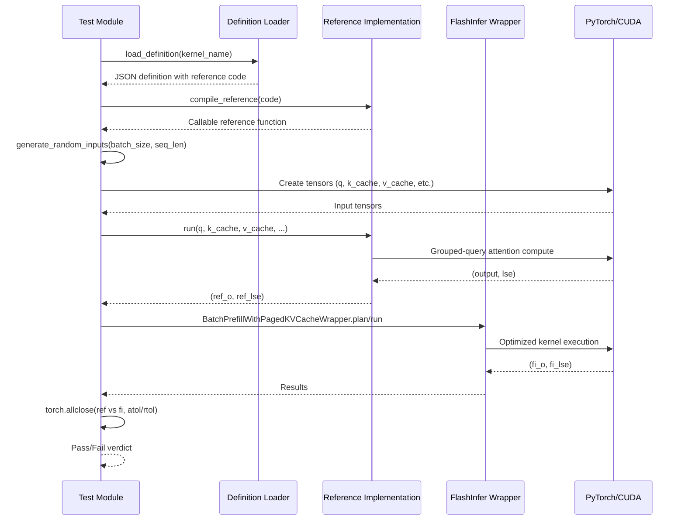

# [PR #341] feat: add gqa_paged_prefill_causal_h24_kv8_d128_ps1 definition and reference test

source: https://github.com/flashinfer-ai/flashinfer-bench/pull/341
state: closed | updated: 2026-04-13T23:33:54Z
labels: 

## 正文

## Summary

- Add \`gqa_paged_prefill_causal_h24_kv8_d128_ps1\` definition (Llama 3.2 3B, prefill causal, page_size=1)
- Add reference test validating against FlashInfer
- Update \`model_coverage.mdx\`: mark as ✅

🤖 Generated with [Claude Code](https://claude.com/claude-code)

## HuggingFace PR (workloads + traces)
https://huggingface.co/datasets/flashinfer-ai/flashinfer-trace/discussions/250 (merged)

<!-- This is an auto-generated comment: release notes by coderabbit.ai -->

## Summary by CodeRabbit

* **New Features**
  * Expanded Llama 3.2 3B model support with a new attention kernel variant.

* **Documentation**
  * Updated model coverage documentation to reflect the newly supported kernel configuration.

* **Tests**
  * Added validation tests to verify the new kernel variant operates correctly across different batch sizes and sequence lengths.

<!-- end of auto-generated comment: release notes by coderabbit.ai -->

## 评论 (1)

### coderabbitai[bot] · 2026-04-09

<!-- This is an auto-generated comment: summarize by coderabbit.ai -->
<!-- This is an auto-generated comment: rate limited by coderabbit.ai -->

> [!WARNING]
> ## Rate limit exceeded
> 
> `@yyihuang` has exceeded the limit for the number of commits that can be reviewed per hour. Please wait **11 minutes and 13 seconds** before requesting another review.
> 
> Your organization is not enrolled in usage-based pricing. Contact your admin to enable usage-based pricing to continue reviews beyond the rate limit, or try again in **11 minutes and 13 seconds**.
> 
> <details>
> <summary>⌛ How to resolve this issue?</summary>
> 
> After the wait time has elapsed, a review can be triggered using the `@coderabbitai review` command as a PR comment. Alternatively, push new commits to this PR.
> 
> We recommend that you space out your commits to avoid hitting the rate limit.
> 
> </details>
> 
> 
> <details>
> <summary>🚦 How do rate limits work?</summary>
> 
> CodeRabbit enforces hourly rate limits for each developer per organization.
> 
> Our paid plans have higher rate limits than the trial, open-source and free plans. In all cases, we re-allow further reviews after a brief timeout.
> 
> Please see our [FAQ](https://docs.coderabbit.ai/faq) for further information.
> 
> </details>
> 
> <details>
> <summary>ℹ️ Review info</summary>
> 
> <details>
> <summary>⚙️ Run configuration</summary>
> 
> **Configuration used**: defaults
> 
> **Review profile**: CHILL
> 
> **Plan**: Pro
> 
> **Run ID**: `39c9201c-568e-4111-aed8-7ba1e5426f76`
> 
> </details>
> 
> <details>
> <summary>📥 Commits</summary>
> 
> Reviewing files that changed from the base of the PR and between e7d8efbda437c243317dce851c6ca0e7cde54c76 and 601622df0295827ce551e883c3e79b5b4cbd8caa.
> 
> </details>
> 
> <details>
> <summary>📒 Files selected for processing (1)</summary>
> 
> * `docs/model_coverage.mdx`
> 
> </details>
> 
> </details>

<!-- end of auto-generated comment: rate limited by coderabbit.ai -->

<!-- walkthrough_start -->

<details>
<summary>📝 Walkthrough</summary>

## Walkthrough

A new attention kernel configuration (`gqa_paged_prefill_causal_h24_kv8_d128_ps1`) is added with its definition file containing tensor specifications and embedded PyTorch reference implementation, paired with a correctness test module. Documentation is updated to reflect the new kernel's coverage status.

## Changes

|Cohort / File(s)|Summary|
|---|---|
|**Documentation Update** <br> `docs/model_coverage.mdx`|Updated Llama 3.2 3B model coverage table, marking `gqa_paged_prefill_causal_h24_kv8_d128_ps1` kernel as covered (✅).|
|**Kernel Definition** <br> `flashinfer_trace/definitions/gqa_paged/gqa_paged_prefill_causal_h24_kv8_d128_ps1.json`|New kernel definition specifying grouped-query attention geometry (24 query heads, 8 KV heads, 128 dim, page size 1) with variable-length indexing, input/output tensor specs (bfloat16 queries/cache, float32 scaling factor), and embedded PyTorch reference implementation for paged KV-cache prefill with causal masking.|
|**Test Implementation** <br> `flashinfer_trace/tests/references/test_gqa_paged_prefill_causal_h24_kv8_d128_ps1.py`|New test module for correctness validation, including utilities to load kernel definition, compile embedded reference code, generate randomized paged-KV inputs, and compare reference implementation against flashinfer wrapper output within specified tolerances.|

## Sequence Diagram



## Estimated code review effort

🎯 2 (Simple) | ⏱️ ~12 minutes

## Suggested reviewers

- yzh119

## Poem

> 🐰 A kernel hops into place,  
> With heads grouped in grace,  
> Pages cached, tests compiled—  
> This attention config's beguiled!  
> Coverage grows, one hop at a time. ✨

</details>

<!-- walkthrough_end -->

<!-- pre_merge_checks_walkthrough_start -->

<details>
<summary>🚥 Pre-merge checks | ✅ 2 | ❌ 1</summary>

### ❌ Failed checks (1 warning)

|     Check name     | Status     | Explanation                                                                          | Resolution                                                                         |
| :----------------: | :--------- | :----------------------------------------------------------------------------------- | :--------------------------------------------------------------------------------- |
| Docstring Coverage | ⚠️ Warning | Docstring coverage is 0.00% which is insufficient. The required threshold is 80.00%. | Write docstrings for the functions missing them to satisfy the coverage threshold. |

<details>
<summary>✅ Passed checks (2 passed)</summary>

|     Check name    | Status   | Explanation                                                                                                                                         |
| :---------------: | :------- | :-------------------------------------------------------------------------------------------------------------------------------------------------- |
| Description Check | ✅ Passed | Check skipped - CodeRabbit’s high-level summary is enabled.                                                                                         |
|    Title check    | ✅ Passed | The title accurately describes the main changeset: adding a new kernel definition and reference test for gqa_paged_prefill_causal_h24_kv8_d128_ps1. |

</details>

<sub>✏️ Tip: You can configure your own custom pre-merge checks in the settings.</sub>

</details>

<!-- pre_merge_checks_walkthrough_end -->

<!-- finishing_touch_checkbox_start -->

<details>
<summary>✨ Finishing Touches</summary>

<details>
<summary>🧪 Generate unit tests (beta)</summary>

- [ ] <!-- {"checkboxId": "f47ac10b-58cc-4372-a567-0e02b2c3d479", "radioGroupId": "utg-output-choice-group-unknown_comment_id"} -->   Create PR with unit tests

</details>

</details>

<!-- finishing_touch_checkbox_end -->

<!-- tips_start -->

---

Thanks for using [CodeRabbit](https://coderabbit.ai?utm_source=oss&utm_medium=github&utm_campaign=flashinfer-ai/flashinfer-bench&utm_content=341)! It's free for OSS, and your support helps us grow. If you like it, consider giving us a shout-out.

<details>
<summary>❤️ Share</summary>

- [X](https://twitter.com/intent/tweet?text=I%20just%20used%20%40coderabbitai%20for%20my%20code%20review%2C%20and%20it%27s%20fantastic%21%20It%27s%20free%20for%20OSS%20and%20offers%20a%20free%20trial%20for%20the%20proprietary%20code.%20Check%20it%20out%3A&url=https%3A//coderabbit.ai)
- [Mastodon](https://mastodon.social/share?text=I%20just%20used%20%40coderabbitai%20for%20my%20code%20review%2C%20and%20it%27s%20fantastic%21%20It%27s%20free%20for%20OSS%20and%20offers%20a%20free%20trial%20for%20the%20proprietary%20code.%20Check%20it%20out%3A%20https%3A%2F%2Fcoderabbit.ai)
- [Reddit](https://www.reddit.com/submit?title=Great%20tool%20for%20code%20review%20-%20CodeRabbit&text=I%20just%20used%20CodeRabbit%20for%20my%20code%20review%2C%20and%20it%27s%20fantastic%21%20It%27s%20free%20for%20OSS%20and%20offers%20a%20free%20trial%20for%20proprietary%20code.%20Check%20it%20out%3A%20https%3A//coderabbit.ai)
- [LinkedIn](https://www.linkedin.com/sharing/share-offsite/?url=https%3A%2F%2Fcoderabbit.ai&mini=true&title=Great%20tool%20for%20code%20review%20-%20CodeRabbit&summary=I%20just%20used%20CodeRabbit%20for%20my%20code%20review%2C%20and%20it%27s%20fantastic%21%20It%27s%20free%20for%20OSS%20and%20offers%20a%20free%20trial%20for%20proprietary%20code)

</details>

<sub>Comment `@coderabbitai help` to get the list of available commands and usage tips.</sub>

<!-- tips_end -->

<!-- internal state start -->


<!-- DwQgtGAEAqAWCWBnSTIEMB26CuAXA9mAOYCmGJATmriQCaQDG+Ats2bgFyQAOFk+AIwBWJBrngA3EsgEBPRvlqU0AgfFwA6NPEgQAfACgjoCEYDEZyAAUASpETZWaCrI5Ho6gDYkuAMxLUXGi09EQAjmgA+txopLTRFCS+8J6ekQxo2IhoabAATAAskQDWEgAckbQAjHkV3IhVkAAUtpBmAMwFVQCUkJAGAMr42BQMJJACVBgMsH4BuAD0Sr7EEdGxdAlJKWkZWTmR+UWlFdW10Q2QgEmEMM6knJDM2lj9AIJ4sPgUXLKy8LDYTBESCAFAJIABhRLUOhcPIABjyADYwHCCiiAJzQKoAVg42LyHFRAC0+gYAKo2AAyXFguFw9Q4CwWRHUAIEGiYzAWvk8aEQCAw/goYG03N5/PggsoYAEZBmC242FSC06VSMABFpAwKPBuOJ8Bg3FBXiFkGhIOQAO6QYqUcieSDLSXqeAGrjhKIxOJbZKpdKZbK5QolcqVGp1S5NSm8p6QdoaPJxgBCABoeIlfQ69oG016SJFEPAAF4kAC8PQ0BmNpvQkAzlDl4xoiFwkFwsGokAkOXgtGhyHbqCdGBdBvQRGeLcgADFxbAAJJSiiVqBk7h95uPRQkXb4KRUUgaZi0AAebfwj2cxTbsHGVsd2xH+qwfMggFByFeQABy+GbXBmQLjJar6kOQVA0PQlqshCvLYEoELbhokCvIgiD4Aw8DQvQAAS2BECyGBENOaBjJAlpfMUnj4MEyAANRtlQYzILYSxIAwWSFm6kC0vSiCMgsAL4ZKRC+CRJAcvgSzUHyJC4IgYp8gKQoivACkSkuYC4IxJCsYg7Goa6GDyXk2Jws0bAUHE3SVgYFgIaw6iPNI2SkMgDhOC4zQGp48jwL4kBZEkSrdG4Vb2cwjlVFwi5aYo2BMTe4weuscQ2naO4PskT6GZAvhfJAADiACKrw8Bs9DUDQGDPum2ypJ+4IsBFrYEshNbtuMTAUIkiDcAatDCXWSQNtMTbSJoYWNQ5rbtFw07wCe0iJUNQqNm243ngo3WiLgPkBYg4yzopi5CshVjzmVVBsDQFB8ft4y3sElTwMwkRhMUabBPQebxKUkTirgKX5t4GBpl1iRiJAADSABq3EBPQTDYNVn0YBVtBCFkrYUMjTS9IWRAYNQIziZNTWOQUXAALJXgOt4WiQ1rDqOL7IG+KBYMw267vuGyOuhjjsNQhkNeTra4sh3DcJ48BLUmvIMNeeUUE8dKDQQy31oko3rS2Nn6MY4BQGQ9D4P5mQEMQZDKBBCisOwXC8Pwwg7ZIS1yAoShUKo6haDoBsmFAcCoKgmA4JboE23QdtsNVXBUNa7lPJ5HtMF7KhqJo2i6GAhiG6YBi0Oh8lc0oPPKIex4nm4ABEde2ZYrzzlbYFYfYjjJ/IZuMB2hHSAYcDjKXGVMLzpBtio3i5flABUM/Rmgsbxom7RJnPZGvtg65t8rtaFoRU+VewOW2hQ9qZc6z5cAABslP0+js/r7EGxyhmcEZVNfPeAfQvgUCw9hcDE2QHPQAMuTryaLwEgEhXRZD2hgX8Ch9x0F6BrOeb4IEIOtKPBstBrLfgvL+W8fB/6WmQPlA6YhDLIEtA2LcA1kh0BsuYRungbrCwNAOC8HUHwMF5OBah/B/IkBPH1Cgtt8qKgEDLBgkBj7iH7lAL8AB5L8ABRIwlJJRLQAn3WgXBaJVAWGANUBg1Ethem3NO4xEgwMZnI3wysHiUnwJaAwdca5GAgGAIwPJFKSiFJELSYkliPhZvJO+5VmRrHvlAzMT9AyHGDCcMM5x6hVA0EINChp3H1zsk3FuUd6BJ2cF3fyujXJGBNEoCqDNrQACkBiqIvtlMcvpxjXz8epQJwSxihKyuE6JnoomRO9HEx+2YDhHBDKccMFwMlZINF/JQekdRqEInvbgog/LwFkUdfkJ1KCQFvjE8qX8BDUBmNHcZqQ0pnxHgaZIRARgcIwEhQeLSWb2C2RhRhyAmBGSAdVdAdJj5jlICwWSnkmjXwwI4N6+BDgI0QKWQo180ywvhX9R6tAUVlHRccnFz1mDllqAS6+eYCzFjLJ/XoOQDREELPBbsOpJ4kDACDIg7YOZKBPINNAi1kC7y2cKA6YRsBrXFZQeQUxXLNGviDSIkpaB6goOSggQC0hhGvnStGZVUqw0gFRfAxQt7yrha9P6yrdnSHJRaoGiAdVIXnK2JQfDnBLUlIqVsVU0K3WnnwKVOolrX21egPVP1jnFH9Fc6+Cxr4SBjbeL+TQBA8morgKoiJui5mlGKiVOtrUQxqs4KgshkAwrCIi5VqryVWrRrW3V9Br71oGkxAlmBanX0QK9PSOQSBf3TdQdoeQkLKLwN69aRkvjIElHwuCHThj0jwCmtNVFqBZqbcczwB0U1DtwCO/BHzmY1TnZ4Bd/zOHBMlHJNsfwNnXw1QcMNnbjn2tbTax1m0eHg2kH1NGg0a1aXWirSUOQ5HVWDYgJCpVfBKgdFYWQ0AvgzBWiNUiL1pYkFjkA09yBsOyhCHQNMmHvA4cGkQf+W86BgCDfII+1UcpQW5eaSZDoniIGvHuI5kbDUZCufqpaTRmOwGOZSwsJZyxfx6h2bgwkc0oHYeIDZIqJiXNE/mtar6ZjI2KINOj55bRGU2gIYYeq2BcxcLmf+tB4qDVMyx0FjGxxLsna+i5B0wCJiokQMA7kwAiO4F2HIEroNGBYchNhNtBEax4W6/hrzyHCNEV8CRfApEyIg+IBRiAvFtRqXUuRKXxHRxPTldpN8ulKUoEE7S/TL7UKGUDWgTXYkZgmQGKZyS35zPSZk7JKb7zOHEKJSGAKgHOg2eae8JzhlxC/vgILAKnkvJLXq9Q+HmCEYK9fLWjYv6kew0LZ81kIs0xHP4Kc80p6vCJj5EsFBNHaP+b3OIBiah5GMXCIw5jxCq2jtYoadjrRJCcVwFxbiPFeILlVgJNXek6WbHJBYe3RrySR5EUZmwbm7E6y/GZqSP4aG4K4XJnj8nN0juBaOJTPLdwqf3ap0dpv2NR6RX9YhyCoV1q2UuSoOmw6XLVkJSP5Js+kAsDHWP4g44SV11+sy0kNGJ7Ia+7z6btJaUtPAKQXRLQ1k0HoRr0LQnDfQddFUsCLZtvlMrY5GnNN3rN5rD8/RsaSQrwn8yCVNDyL0Tkcmp5xbCc+QAmASbe29HcXntxge2viI0QX8NaCAmy+Y5OMMBfwyKkNlqN6BNHaL0KnpuphFwiiWb65UwCGpxxzb1FbQ11qTQOjFib+PJoxVWpVDatJ1sTUBtVGKP3toxT2gs2eB29BE7lBa0ccUKj5jEK6slKDQZgPTLqHSMcc9wFzr9B1vBiGQNfdifYv6WlvC+bsKQ2XNESLgEYxnr7ER3QO/gWBwRWDJApjPdNOosEDyj2Gm1lIg1l4DilImviaAzEiHwDTBgNf26AJQ6iwABRbBxiP1rE6TnDh2XCTHUysHa1SAAHVWQrBypYZwQSJbxiCqApZKAv4sh+VaocgqIMhbZsAb0ygyIKJeoxJcxeRjNHJp82NSwtIJUzdlpi9bYB8FhrUEprpghpI887ZvUQ0mhkhYC0xNDECv4YFzRr5LQ6CRUNAM8mgNALD4DZJH9/oDpSxoAcYSAkDnVsZrCz4aFbwOo+AHNRNXM8BkBVZUMRNJR0w9xexo4CBvApgEomCH0CBRhYAtBUg+F8Bd139jl8Av5X0FVd0YNjknhJQ8ZB1kYqExxf9lokcA02xyJjlU11MqUSw0wngTwCwSAwh/oyAkCFBBR4BnkBFOFJDeAb1j8YhUI6BJdfwcg1dSRwt8kot+jjNYt6Z4tnBEshEisxE0seBsBpFdkss9dctqwCt7w+cp5sD/EhcEdJdxoxdgDGx0dxpMdTkxkiDcdn4PcCd355kVdz9oJ7wMs9i4Nphnw+IDA+goAFVqJ4g7cMAmgiY2AuB0Dehc5IBNQBlnxr4wTdBjkA8Uh8xxdoC7jRp0htxEStIkCsSITpD8TO0WBu9686jcAZgGiSAmiBVWj2iQY0wlAYExhSwa5T80Aa4KTwTjlt8vhi099GTmSJMyw8g2SWixUOiMBSxEQChPpIjyx2V5S6xNTsRtSRTsTr4CjYSKSG5IBzs/INprtxhbschZAHsnsudv49F3tCgvsfsLF/tEZtwgdZYQdHFUtqY6B4BHAydoc85A4INTZzY8BCBqSfT7Y446w0BE4O5SkJh5BrFvZM4/Yc5DAozORmolVcVIhbF/TNgWxht8z85jYAB2WgMoJIAQPsAodoOshgQododoKoBssYMobEKoBgREDIOEEgDspQbEAoBgOsxEGsgwQssWEsxAMs6BCs+IE2GsqMqBSICyUgdIW8RWFcqs8RecgAbyxJriQFsHlnQltFoCmhwysFSIghrj8ByAOhTEvKQGUX3B1CIwwDfNyg/NZMvKLgYHQOEkajHhIBijtByAGFwxICAovL6D6BrkFx6Tq1FxRyJKYmuJbCeLm2x1eLl3xxSS+L6xJxQqxLQsgBrifU8GnBKJBKAuxC/LovQqBNKKMlIPbHVGLi0mEkQCAu+zooAF8sTxKOL6LrEbAM51BaDfwSBCCPBdpkL3zX8ZKa5+RhhPBaBbzFZbAgLRItKwLewbBkYBKGBEKdRCJEBwRDziggLxDQL0KBpaBLKMA1LvBHLRBnKuBXLtKPKvLNRVldRnw/LFYTKQLtKZYMB7z5xUJQtbKgK644q+RcAorigbBpAlQ5IgKABtWiyAVCzigUpyr8ReDS+isK7UCKnKbKmuGSuinS3DLIFyxwlqtCmuQLQQ15NK7K+wPTeg+gKARqJQeSn2XAcPbiXo2ADlaBDKWnXyfDImaRJhZqkq9C4eNK4CM+YSLazi+ir4XosDTwbKqqtgNKlZeqvUQyTxCS7qsq1qq5RWK6mqmuHyzqJyo68qqsh/ESwKrq7a+ivqzAAargL6+mbLQ+BgdianPaW6tZfXemE0l01yWSIIEIZg+8U+c+GEyQ6PSo3eaXV3N4xJaZCi3rZXP61qnqfAc9Z8ICuFVIbqna7cPa5wEcQiOmnqiGR5XokmGKsy46muU6giHIS66qtK2G5Ckq6Skql6nqt64oD6tK6yyCjZaCiuZC9m+igGjqzSz80G3q0Rfq5mqGzWoSjZHBA8cYVAOEDQOEOEAAUjIgQFQxDiMmwEcV2VlmqnVxsTaM4MSHoHbBk0ZvoFQDKCdpdtdo0D5vQoZqZoeqhtoPUHGHAq1sZSqJ4W4pBMeCQH3mBA6mYE2myHEEQF8HkB/W43tpvEjv0sTv1prl2qhv2p5qICTpOp1ElousqplqhuzptsZUerQskr6AAF0MqWxbA6qdR7qDQ0rER0R4bEQ6zfBaAeyCh4RRAGABzV60As0ygBy8g6yyg6z0Q4RRJaA6yGy0A6yBACgBAyhr6N6qhd6GBP66y0B0QChqhsQ+w6y/qa4AZbBvq0rsQyht7P6AgChEQyg8haB0Rr6r68gTID6EGygCh8QZz0Q8g16ZzaAGACgyhSGqhOgGBfA8gqhaBah2gN7v6agGBsQ6y4RPFJKFyjZapdzKB9zVaVzNyA4eGLZEUYhAoCwkKpHqyDYDAzywHMryDApaBXhcBcrgc6BHz1BGpkZcA3y4QuGoyxH1hJGAb8xhHc4gA=== -->

<!-- internal state end -->

## Review (2)

### gemini-code-assist[bot] · 2026-04-09 · COMMENTED

## Code Review

This pull request introduces a new definition for `gqa_paged_prefill_causal_h24_kv8_d128_ps1`, updates the model coverage documentation, and adds a corresponding reference test. The feedback suggests improving the test's robustness by expanding `generate_random_inputs` to cover prefill operations with existing KV cache contexts. Additionally, it recommends refactoring the CUDA availability check from `test_correctness` to the `main` function for better error handling and clearer test execution on different hardware.

### coderabbitai[bot] · 2026-04-12 · COMMENTED

**Actionable comments posted: 1**

<details>
<summary>🤖 Prompt for all review comments with AI agents</summary>

```
Verify each finding against the current code and only fix it if needed.

Inline comments:
In
`@flashinfer_trace/tests/references/test_gqa_paged_prefill_causal_h24_kv8_d128_ps1.py`:
- Around line 70-120: The test function test_correctness currently returns
booleans and early-returns False on CPU which prevents pytest from
failing—change the CPU branch to pytest.skip("requires CUDA") and replace the
final return of a boolean with explicit assertions (e.g., assert
torch.allclose(...) , with helpful messages) for both output and lse
comparisons; also remove or demote the ad-hoc main() reporting (or guard it
under if __name__ == "__main__") so pytest runs the assertions normally.
Reference: test_correctness (replace CPU return and final return) and main
(remove/guard).
```

</details>

<details>
<summary>🪄 Autofix (Beta)</summary>

Fix all unresolved CodeRabbit comments on this PR:

- [ ] <!-- {"checkboxId": "4b0d0e0a-96d7-4f10-b296-3a18ea78f0b9"} --> Push a commit to this branch (recommended)
- [ ] <!-- {"checkboxId": "ff5b1114-7d8c-49e6-8ac1-43f82af23a33"} --> Create a new PR with the fixes

</details>

---

<details>
<summary>ℹ️ Review info</summary>

<details>
<summary>⚙️ Run configuration</summary>

**Configuration used**: defaults

**Review profile**: CHILL

**Plan**: Pro

**Run ID**: `24159e23-ff33-46ff-bb0d-55f43bf1d6ba`

</details>

<details>
<summary>📥 Commits</summary>

Reviewing files that changed from the base of the PR and between e4bce54a53c0c1515a270d5dc670a5b77c3d01ae and e7d8efbda437c243317dce851c6ca0e7cde54c76.

</details>

<details>
<summary>📒 Files selected for processing (3)</summary>

* `docs/model_coverage.mdx`
* `flashinfer_trace/definitions/gqa_paged/gqa_paged_prefill_causal_h24_kv8_d128_ps1.json`
* `flashinfer_trace/tests/references/test_gqa_paged_prefill_causal_h24_kv8_d128_ps1.py`

</details>

</details>

<!-- This is an auto-generated comment by CodeRabbit for review status -->
