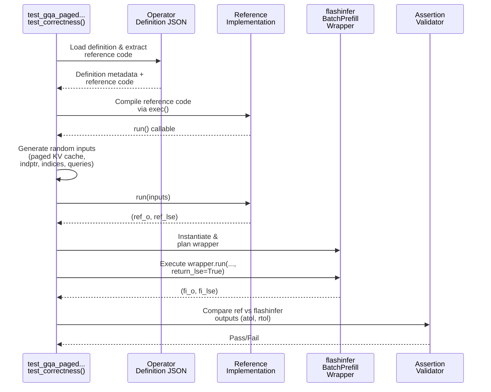

# [PR #343] feat: add gqa_paged_prefill_causal_h24_kv8_d128_ps64 definition and reference test

source: https://github.com/flashinfer-ai/flashinfer-bench/pull/343
state: closed | updated: 2026-04-13T23:35:09Z
labels: 

## 正文

## Summary

- Add \`gqa_paged_prefill_causal_h24_kv8_d128_ps64\` definition (Llama 3.2 3B, prefill causal, page_size=64)
- Add reference test validating against FlashInfer
- Update \`model_coverage.mdx\`: mark as ✅

🤖 Generated with [Claude Code](https://claude.com/claude-code)

## HuggingFace PR (workloads + traces)
https://huggingface.co/datasets/flashinfer-ai/flashinfer-trace/discussions/253 (merged)

19/19 PASSED

<!-- This is an auto-generated comment: release notes by coderabbit.ai -->

## Summary by CodeRabbit

## Release Notes

* **New Features**
  * Added a new GQA paged prefill operator definition optimized for Llama 3.2 3B models.

* **Tests**
  * Added test coverage for the new operator variant.

* **Documentation**
  * Updated model coverage table to reflect operator availability.

<!-- end of auto-generated comment: release notes by coderabbit.ai -->

## 评论 (1)

### coderabbitai[bot] · 2026-04-09

<!-- This is an auto-generated comment: summarize by coderabbit.ai -->
<!-- This is an auto-generated comment: rate limited by coderabbit.ai -->

> [!WARNING]
> ## Rate limit exceeded
> 
> `@yzh119` has exceeded the limit for the number of commits that can be reviewed per hour. Please wait **23 minutes and 16 seconds** before requesting another review.
> 
> Your organization is not enrolled in usage-based pricing. Contact your admin to enable usage-based pricing to continue reviews beyond the rate limit, or try again in **23 minutes and 16 seconds**.
> 
> 

> 
⌛ How to resolve this issue?

> 
> After the wait time has elapsed, a review can be triggered using the `@coderabbitai review` command as a PR comment. Alternatively, push new commits to this PR.
> 
> We recommend that you space out your commits to avoid hitting the rate limit.
> 
> 

> 
> 
> 

> 
🚦 How do rate limits work?

> 
> CodeRabbit enforces hourly rate limits for each developer per organization.
> 
> Our paid plans have higher rate limits than the trial, open-source and free plans. In all cases, we re-allow further reviews after a brief timeout.
> 
> Please see our [FAQ](https://docs.coderabbit.ai/faq) for further information.
> 
> 

> 
> 

> 
ℹ️ Review info

> 
> 

> 
⚙️ Run configuration

> 
> **Configuration used**: defaults
> 
> **Review profile**: CHILL
> 
> **Plan**: Pro
> 
> **Run ID**: `c70aa8b5-6e27-4f29-b8f0-7b409dbf1bde`
> 
> 

> 
> 

> 
📥 Commits

> 
> Reviewing files that changed from the base of the PR and between 4c4d71b99872a6195bdfba8f7126e98de5599c21 and abce8661146c6293feb524141b31b24164e09617.
> 
> 

> 
> 

> 
📒 Files selected for processing (3)

> 
> * `docs/model_coverage.mdx`
> * `flashinfer_trace/definitions/gqa_paged/gqa_paged_prefill_causal_h24_kv8_d128_ps64.json`
> * `flashinfer_trace/tests/references/test_gqa_paged_prefill_causal_h24_kv8_d128_ps64.py`
> 
> 

> 
> 

<!-- end of auto-generated comment: rate limited by coderabbit.ai -->

<!-- walkthrough_start -->

📝 Walkthrough

## Walkthrough

This PR adds a new GQA paged prefill operator definition for Llama 3.2 3B with specific parameters (24 query heads, 8 KV heads, head_dim=128, page_size=64), including its JSON metadata, Python reference implementation, and a comprehensive test module that validates the operator against the reference implementation.

## Changes

|Cohort / File(s)|Summary|
|---|---|
|**Documentation Update**   `docs/model_coverage.mdx`|Updated coverage status for `gqa_paged_prefill_causal_h24_kv8_d128_ps64` from ❌ to ✅ in the Llama 3.2 3B table entry.|
|**Operator Definition**   `flashinfer_trace/definitions/gqa_paged/gqa_paged_prefill_causal_h24_kv8_d128_ps64.json`|Added new GQA paged prefill operator definition with tensor metadata, constant parameters, input/output specifications, and embedded Python reference implementation for causal masked batched attention with paged KV cache.|
|**Reference Test**   `flashinfer_trace/tests/references/test_gqa_paged_prefill_causal_h24_kv8_d128_ps64.py`|Added test module that loads the operator definition, compiles its reference implementation, generates randomized paged KV-cache inputs, and validates flashinfer's batch prefill wrapper output against the reference using multiple batch/sequence configurations.|

## Sequence Diagram

## Estimated code review effort

🎯 3 (Moderate) | ⏱️ ~20 minutes

## Possibly related PRs

- **flashinfer-ai/flashinfer-bench#208**: Modifies the same model_coverage.mdx file and adds related GQA paged prefill definitions and tests in the same directory structure.

## Suggested reviewers

- yzh119
- Ubospica

## Poem

> 🐰 A new operator hops into place,
> With heads grouped, cached with grace,
> Tests compare, they dance in line,
> Reference and flashinfer align,
> Coverage marks the victory shine! ✨

<!-- walkthrough_end -->

<!-- pre_merge_checks_walkthrough_start -->

🚥 Pre-merge checks | ✅ 2 | ❌ 1

### ❌ Failed checks (1 warning)

|     Check name     | Status     | Explanation                                                                          | Resolution                                                                         |
| :----------------: | :--------- | :----------------------------------------------------------------------------------- | :--------------------------------------------------------------------------------- |
| Docstring Coverage | ⚠️ Warning | Docstring coverage is 0.00% which is insufficient. The required threshold is 80.00%. | Write docstrings for the functions missing them to satisfy the coverage threshold. |

✅ Passed checks (2 passed)

|     Check name    | Status   | Explanation                                                                                                                                                      |
| :---------------: | :------- | :--------------------------------------------------------------------------------------------------------------------------------------------------------------- |
| Description Check | ✅ Passed | Check skipped - CodeRabbit’s high-level summary is enabled.                                                                                                      |
|    Title check    | ✅ Passed | The title clearly and specifically describes the main changes: adding a new kernel definition and reference test for gqa_paged_prefill_causal_h24_kv8_d128_ps64. |

✏️ Tip: You can configure your own custom pre-merge checks in the settings.

<!-- pre_merge_checks_walkthrough_end -->

<!-- finishing_touch_checkbox_start -->

✨ Finishing Touches

🧪 Generate unit tests (beta)

- [ ] <!-- {"checkboxId": "f47ac10b-58cc-4372-a567-0e02b2c3d479", "radioGroupId": "utg-output-choice-group-unknown_comment_id"} -->   Create PR with unit tests

<!-- finishing_touch_checkbox_end -->

<!-- tips_start -->

---

Thanks for using [CodeRabbit](https://coderabbit.ai?utm_source=oss&utm_medium=github&utm_campaign=flashinfer-ai/flashinfer-bench&utm_content=343)! It's free for OSS, and your support helps us grow. If you like it, consider giving us a shout-out.

❤️ Share

- [X](https://twitter.com/intent/tweet?text=I%20just%20used%20%40coderabbitai%20for%20my%20code%20review%2C%20and%20it%27s%20fantastic%21%20It%27s%20free%20for%20OSS%20and%20offers%20a%20free%20trial%20for%20the%20proprietary%20code.%20Check%20it%20out%3A&url=https%3A//coderabbit.ai)
- [Mastodon](https://mastodon.social/share?text=I%20just%20used%20%40coderabbitai%20for%20my%20code%20review%2C%20and%20it%27s%20fantastic%21%20It%27s%20free%20for%20OSS%20and%20offers%20a%20free%20trial%20for%20the%20proprietary%20code.%20Check%20it%20out%3A%20https%3A%2F%2Fcoderabbit.ai)
- [Reddit](https://www.reddit.com/submit?title=Great%20tool%20for%20code%20review%20-%20CodeRabbit&text=I%20just%20used%20CodeRabbit%20for%20my%20code%20review%2C%20and%20it%27s%20fantastic%21%20It%27s%20free%20for%20OSS%20and%20offers%20a%20free%20trial%20for%20proprietary%20code.%20Check%20it%20out%3A%20https%3A//coderabbit.ai)
- [LinkedIn](https://www.linkedin.com/sharing/share-offsite/?url=https%3A%2F%2Fcoderabbit.ai&mini=true&title=Great%20tool%20for%20code%20review%20-%20CodeRabbit&summary=I%20just%20used%20CodeRabbit%20for%20my%20code%20review%2C%20and%20it%27s%20fantastic%21%20It%27s%20free%20for%20OSS%20and%20offers%20a%20free%20trial%20for%20proprietary%20code)

Comment `@coderabbitai help` to get the list of available commands and usage tips.

<!-- tips_end -->

<!-- internal state start -->

<!-- DwQgtGAEAqAWCWBnSTIEMB26CuAXA9mAOYCmGJATmriQCaQDG+Ats2bgFyQAOFk+AIwBWJBrngA3EsgEBPRvlqU0AgfFwA6NPEgQAfACgjoCEYDEZyAAUASpETZWaCrKPR1AGxJcAZiWpcaLT0RACOaAD63GiktFEUJD7wHh4RDGjYiGipsABMACwRANYSABwRtACMueXciABs+ZBKSRjq8PhYmPQJfgkYDCSQNIi4kAAUtpBmAMz5MwCURlAAgsHIaJDkAO6QRZTkHs2J8G3inVxhkdGx8ScpaRlZOQXFZRXVtQ1N4wAyHmhmJsZhpcpAZgAhAA0PF6ySO6Uy2RhNxIEUQ8AAXiQALyNBYaAyrdboSC9ShkQbDaRjXCwaiQCTZeC0ajSYawIb7CiHdBEbQYUaQABiAMQsAAkhg+gBualChIODy4RBcSoATgA9BrrCsAMp6gCiABFCVAAKrcVkjSDMRQkVJMKRUUgaZi0AAew3wtucRQ5Qx2ewODvQyEAoORmyBShgebBKDaQDynf0EANkh1s+gACWwRCIpyIwrQVNoSAYmQxnUgPnwfG2daKHnwQQ2GHouCog1VkFguFwdQ4ms1sDzBYwRB8JZIGiYmutaEQJBVmp8YoQ0soYG0q/Xpz6YE70/n5crHUFmtyAFYZkTrHYGAkszWKCxIAIqANYDX/Lh54liHCKIYjoO4kgeRFngiPJChKcoqhqKJvhQDA0yBU533kTJKEgWRZHgUdMCIfgsFyAAGXJ6jAMj8mo9VoEqK8OCvXIOBogAtDRID1XBqEyLh8G4MhCQMCxIAAYRYZh1FtaQslIZAHCcFxlkgNZ6FOdpskgK5gNuXh7kdJ5smg144I+RC6kaYMeVDFpNPODAo3U9B2wDLAmAoBIxHTcl+ipEZOBreAPXZU5Y3jIZnCIRx2H4CglD4cYSgiMVcD0tEvCwAREjrIZEGYdF0i8BYUUXDEJ0gUJqUFOtvRFdcpT6SBtiobghIoDQKGwDBxlKyBMkLb0KAYWANFGEt/VrPhUTiFL0lGoZpqBXAYSXfshoAOXNABZCIAGkADUImzQ0VmNPUcVKFCeABXr+u6AaKuIzkggqeBCtCf0OsYbAvLi0VF0lTc+BWKwJSjHa/XTINuV5RdIHDG67SUBF8GdEDmnwCs2FQ6hzxE/RjHAKAyHofAfBwAhiDIZQaHoJhWHYLheH4YRRHEKQZHkJhEpUNRNG0XQwEMEwoDgVBUEwKnCFIcgqHphQmdQrgqF2JSgRcTCFD51R1C0HQieJ0wDFobHEE1FGHTSdHlFdd0PQ4AwACJXdEywVglGn5efDXnHkCnGHpCdpAMS1rTodN/kBYFQXBCEFAx0hhhULxIHYLXpsgAADXTZrA+FHiRF5YPeBCvkabOuAm3BMiDojI58V9mEgQAZcnq8MYVOMt0nESq6VQeyznPFBkAwfBdk1/Z6ARgyl1QzUmBSDm6C4lYUn4OkcOTchkAwrf7D+18erLfvU6GBJ0KwHrRob2gRPMD3lTp89kDTA+lFjZx8c6ZBA5ID03A6yKzqtwbAAhkwMHTqhdoodNqdBnEYX4px2S3xDrQLgABqSomowCVCMIaUYH1ny8wviQCQ8ASC7ESNNIKvwJ4uzdkSE2a4gb7koBEI8gx/ytHaL/TUecQK0AEUBfOBlwJGWLqZUu8FPhIUaBoIQiALiMOdu7NSXs5Z00jn7LWgc0EKSMOpSOmwgwAHEACKKweBCNhIZfgHVqB1SHnwrAAApPUAB5TaXBs6sPFOwignCuwkB4Q5V+IjrhCMiRlOI4jC6QRMjBN4sjLLfEUcojA2cuJwCWskIYn8ASKlJIko4QJEDT3fNQRaM9+zsBHg2CgTYWz0CztHIE4I46Qhauob8SRQr0FegzToSQYoKxHuMAoVVsCUHkEMxAMJrpHV7P4WgCyVlvTLMwHEnwFiuXoLNSAyyFqchsVQNgNAKDIHGKidEWJcT4i4hKMYiAhIMHgEkdkNBap8DQB6VAFygjUE2FnJkFB4DnzAFlIgdJ7AkFCDMgYQxGZAPIKha52csoRG7twTs2cYTZwILxVIoR8U5wwI4N42L2zwG7GS7OFLCqokQNnPZj0mCCl4qhewnZsBiD+tpaI5zlyUEQDk05LjHLQNigrMKGAwG0jIMoq5Exs6koJUUR4i16USC1ZyeloR8DUtoLiig9KUo4rxRq3V3daXSHNbqtKGVUpkHpQVIq2QSCsv2fwPACqarKoxfgP1eB6UeCXKyp5YxsjKJQhFBMpIrCyDpNWPylIhgfW4F4XGvEpV0gZOobRf9nRVNwKNOFCL03IEGpVS1fBPwKRhOVEgzAIHsh8NgDeyyCD7EFC+N8B9DknKGDW4i2cLU0rpbdOu47HWLnSrcrKZK0DtWTOyTYpTfQVOOOCqQrTm6kmzqjXi2d+A+B8OtGEKK8DsmbAWFUPTYVEGPkJeglatZDPToAzAVYMAwi3lgDqy1FIU1wECL0j1WqFuQB1Q8+Be3oDqTA6swaBx4DbPQAQi4SBgDBHesASkwAAO4IybIMyxVGEfmpZ+4zf71Q/qIIpP8+3/0AcAyOoDwGQOgeIcQoc7ybSocFNOQQlAYJzv4jcfRgnHklREwRsQYliLhBBYyJcUkWQrvkDJnRT0uMqqYoTgk6Z1TTUiy2y4gW8RrHVbOglOGyCElwZ2Cm6DO2yVRqGbQ/BCmFPktSGBsiyGxBQJBKDkAGLoFg6oWpqIEKIStSOpCMwUKEzQ4BXB6HbFUcsFhe4QYye4YFC2ZnuyakChEVzcSVOSKgsk8y5d5Hae4LIJ2rs1FiU9t7bR9BdEB0ppFxABh1KJiDKVoYgVbSKE7UtWzVWC6qakfVsucirL5GyTAU54ECknF3goTlmAH1Z3fbITUyzP1MB6iqGEn6tlKvPE2tyqJ7D3LlM2Vs6ZPKKlRafYixmFbON264yAHjvH9pbpsDEEChpHqB45FlzR4DeQIC4OU7KWDcHyW/CVcPzyAEwCZALacrBEjuNnWQwKGbGzgA0Qp60yCF4hhKn3UsmMGyACNtUadK01lcgT8ZtpLYgObYo6YBh0oQVdc8KcZfs50Nca01DqFdWpzhOnu9rHv0Fnaledzql1srcvzt8J2A11j/lgcS5pjTWI+egJkyRz7iqGISmkNt/piF3gjjtAwpUs+x8ijH+SeiJApEi+qvBptUmzuMXoER8Awlj+GkgCwyUAZQhNGBbJEx+Py30DQEJqmwCsDVgA6r0qwQijriRLJyEvbUOpkqzT+9McNQxCsBCKlV4xSkwgBLIVDMIFy4Ec9INaxVR+I9xr+xA/UacVhtNnVqK6OpdR6uMDQG+E/Lj+hgVKS4cTQG6snunPoGcChzuMJIceYRX6TynzXYYlwUAfYyygtLtKxnwPPOSZ73z4FhahpLk9ENByqMgKm2jnE4h4NnJqNnM/vgNAWvDnFfH1Ket7mICPIWrzvwCWkuBjEcNHlhmWrAHctiDCOBhEKEC6n+r6B6FSllCnvtmAbRoKFesGuir2BPL6BgPINEIgOso9LwKcA+gfIqJ2poJtvlI+PALil+uoITs4B4AHBblYOaGAJ0EodAhQq+BgDmtzBmLXDyDDsWEnh5pRp1jRsxm/D6Axl/CwX/JTMRuxuTDNFxrSjxrAkNlAIJrsNtr4pJoEoVqEsVpqONhbBVvNvEotnVmZCtmkgoi1tnAYJALoJAD4TWDfI5L4u9nEHJp0OMIFmwNXJ2HsiLJAMaLjrpskakekegVkTnCivkhEONjHiHv5GiKQsURQCntUd4UJnUeeL4lorKs0d0CwNSpLuMEQaNKQSQOQX8pQdQfMXQSlFlMsRlOskoBQoMDiM7BWKyM7D0SkX0bsJNgMRcDnBVl9hzJ7lMYXrMTiPkOsVQVlDiDMLkOsasWQDsjUE2gQB4Dsjhh8WSP8TiFeECUcTUf0ZkYMcgQKKgZ5pgB8jSCKP5isIFkoSFmFntpFuJtgu8bgmRPFuIIlsMkoClpQtQuehlpADtHQPAI4DlswoYAYGLNAuTJTBkNTMMSQlJMzGSGgOrI4JrPIHIOTlQHrILIbCLEAA= -->

<!-- internal state end -->

## Review (1)

### gemini-code-assist[bot] · 2026-04-09 · COMMENTED

## Code Review

This pull request introduces a new `gqa_paged_prefill_causal_h24_kv8_d128_ps64` operation, including its definition, a Python reference implementation, and a corresponding correctness test. The documentation has been updated to reflect this new coverage. Feedback includes suggestions to refactor common test utilities into a shared module for better maintainability and to improve the test's behavior on CPU-only machines by explicitly skipping it using `pytest.skip` instead of silently returning `False`.
