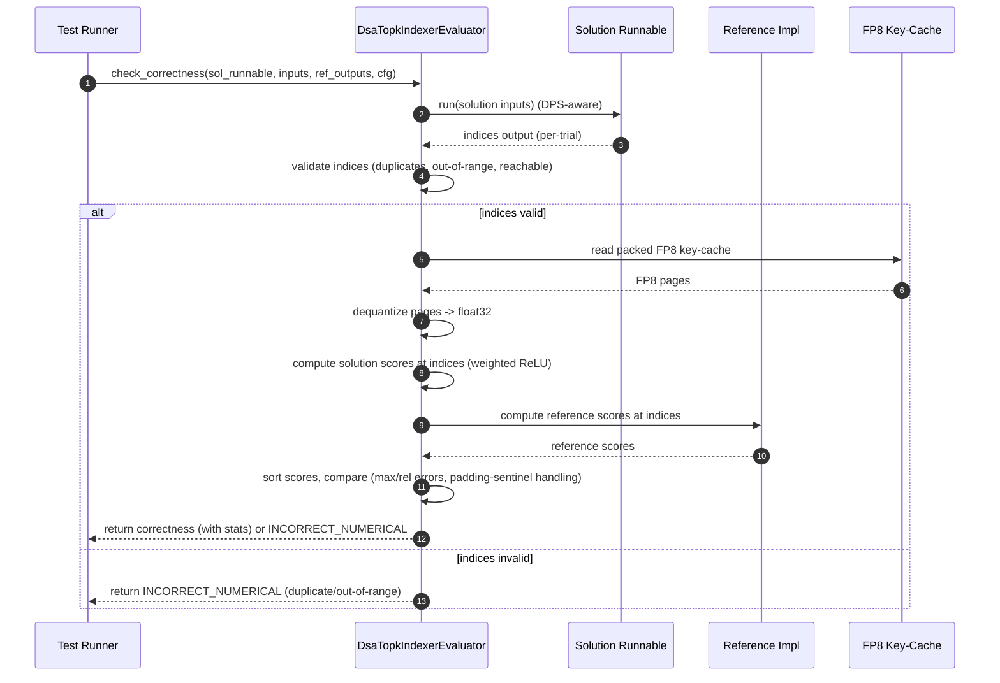

# [PR #354] feat: add DsaTopkIndexerEvaluator for DSA top-k indexer kernels

source: https://github.com/flashinfer-ai/flashinfer-bench/pull/354
state: closed | updated: 2026-04-10T06:26:07Z
labels: 

## 正文

## Summary
- Add `DsaTopkIndexerEvaluator` that compares sorted value vectors instead of raw indices to correctly handle tie-breaking and rounding differences across DSA top-k indexer kernel implementations
- Custom `build_baseline` that correctly packs random `k_index_cache_fp8` inputs into deep_gemm FP8 format (fixes false negatives where correct FlashInfer kernels were rejected)
- Vectorized index validation using `[B, K, M]` broadcasting instead of `[B, num_pages * page_size]` dense mask (~10x less intermediate memory)
- Move `safetensors` import to module level to avoid ~200ms cold-start cost per `load_safetensors()` call

<!-- This is an auto-generated comment: release notes by coderabbit.ai -->
## Summary by CodeRabbit

* **New Features**
  * Added a DSA Top‑K Indexer evaluator to benchmark FP8-packed key‑cache top‑k workloads with robust scoring, index validation, and tolerance-aware error comparison.

* **Tests**
  * Added end‑to‑end test suite covering evaluator resolution and multiple correctness scenarios (including duplicates, out‑of‑range, shuffled, and wrong outputs).

* **Chores**
  * Updated evaluator registry and adjusted safetensors import behavior.
<!-- end of auto-generated comment: release notes by coderabbit.ai -->

## 评论 (3)

### coderabbitai[bot] · 2026-04-10

<!-- This is an auto-generated comment: summarize by coderabbit.ai -->
<!-- walkthrough_start -->

<details>
<summary>📝 Walkthrough</summary>

## Walkthrough

Adds a new DsaTopkIndexerEvaluator for FP8 paged top-k indexer workloads (dequantization, weighted-ReLU scoring, index validation, numerical comparisons), registers and exports it, updates safetensors import to module-level, and adds/updates tests covering resolution and correctness edge cases.

## Changes

|Cohort / File(s)|Summary|
|---|---|
|**Evaluator Implementation** <br> `flashinfer_bench/bench/evaluators/dsa_topk_indexer.py`|New `DsaTopkIndexerEvaluator` implementing FP8 page dequantization, weighted-ReLU score computation at indices, vectorized index validation (duplicates/out-of-range/reachability), score-error statistics, `build_baseline`, and `check_correctness`.|
|**Evaluator Export & Registry** <br> `flashinfer_bench/bench/evaluators/__init__.py`, `flashinfer_bench/bench/evaluators/registry.py`|Exported `DsaTopkIndexerEvaluator` and added it to the evaluator registry for automatic resolution.|
|**Utilities** <br> `flashinfer_bench/bench/utils.py`|Moved `safetensors.torch as st` to module import time (removes lazy runtime import path).|
|**Tests** <br> `tests/bench/test_dsa_topk_indexer_evaluator.py`, `tests/bench/test_dsa_sparse_attention_evaluator.py`, `tests/bench/test_isolated_runner.py`|Added comprehensive tests for the new evaluator (resolution, correct/shuffled/wrong/duplicate/out-of-range/unreachable cases), updated resolver expectation, and adjusted safetensors import usage in tests.|

## Sequence Diagram(s)



## Estimated code review effort

🎯 4 (Complex) | ⏱️ ~60 minutes

## Possibly related PRs

- flashinfer-ai/flashinfer-bench#147 — Introduces DSA top-k indexer FP8 manifest and baseline references used by the new evaluator.
- flashinfer-ai/flashinfer-bench#125 — Destination-passing-style runnable/evaluator changes that the new evaluator relies on for DPS output handling.

## Suggested reviewers

- yzh119  
- xslingcn

## Poem

> 🐰 I hopped through pages of FP8 byte,  
> Dequantized dawn to a float32 light,  
> I scored and I sorted with ReLU delight,  
> Chased duplicates, out-of-range in sight,  
> A carrot for tests that pass tonight 🥕

</details>

<!-- walkthrough_end -->


<!-- pre_merge_checks_walkthrough_start -->

<details>
<summary>🚥 Pre-merge checks | ✅ 2 | ❌ 1</summary>

### ❌ Failed checks (1 warning)

|     Check name     | Status     | Explanation                                                                           | Resolution                                                                         |
| :----------------: | :--------- | :------------------------------------------------------------------------------------ | :--------------------------------------------------------------------------------- |
| Docstring Coverage | ⚠️ Warning | Docstring coverage is 28.00% which is insufficient. The required threshold is 80.00%. | Write docstrings for the functions missing them to satisfy the coverage threshold. |

<details>
<summary>✅ Passed checks (2 passed)</summary>

|     Check name    | Status   | Explanation                                                                                                                                                                                                                  |
| :---------------: | :------- | :--------------------------------------------------------------------------------------------------------------------------------------------------------------------------------------------------------------------------- |
| Description Check | ✅ Passed | Check skipped - CodeRabbit’s high-level summary is enabled.                                                                                                                                                                  |
|    Title check    | ✅ Passed | The pull request title accurately and specifically describes the main change: adding DsaTopkIndexerEvaluator for DSA top-k indexer kernels, which is the primary feature introduced across multiple files in this changeset. |

</details>

<sub>✏️ Tip: You can configure your own custom pre-merge checks in the settings.</sub>

</details>

<!-- pre_merge_checks_walkthrough_end -->

<!-- finishing_touch_checkbox_start -->

<details>
<summary>✨ Finishing Touches</summary>

<details>
<summary>📝 Generate docstrings</summary>

- [ ] <!-- {"checkboxId": "7962f53c-55bc-4827-bfbf-6a18da830691"} --> Create stacked PR
- [ ] <!-- {"checkboxId": "3e1879ae-f29b-4d0d-8e06-d12b7ba33d98"} --> Commit on current branch

</details>
<details>
<summary>🧪 Generate unit tests (beta)</summary>

- [ ] <!-- {"checkboxId": "f47ac10b-58cc-4372-a567-0e02b2c3d479", "radioGroupId": "utg-output-choice-group-unknown_comment_id"} -->   Create PR with unit tests
- [ ] <!-- {"checkboxId": "6ba7b810-9dad-11d1-80b4-00c04fd430c8", "radioGroupId": "utg-output-choice-group-unknown_comment_id"} -->   Commit unit tests in branch `main-dev/2026-04-08-dsa-topk-indexer-evaluator`

</details>

</details>

<!-- finishing_touch_checkbox_end -->

<!-- tips_start -->

---

Thanks for using [CodeRabbit](https://coderabbit.ai?utm_source=oss&utm_medium=github&utm_campaign=flashinfer-ai/flashinfer-bench&utm_content=354)! It's free for OSS, and your support helps us grow. If you like it, consider giving us a shout-out.

<details>
<summary>❤️ Share</summary>

- [X](https://twitter.com/intent/tweet?text=I%20just%20used%20%40coderabbitai%20for%20my%20code%20review%2C%20and%20it%27s%20fantastic%21%20It%27s%20free%20for%20OSS%20and%20offers%20a%20free%20trial%20for%20the%20proprietary%20code.%20Check%20it%20out%3A&url=https%3A//coderabbit.ai)
- [Mastodon](https://mastodon.social/share?text=I%20just%20used%20%40coderabbitai%20for%20my%20code%20review%2C%20and%20it%27s%20fantastic%21%20It%27s%20free%20for%20OSS%20and%20offers%20a%20free%20trial%20for%20the%20proprietary%20code.%20Check%20it%20out%3A%20https%3A%2F%2Fcoderabbit.ai)
- [Reddit](https://www.reddit.com/submit?title=Great%20tool%20for%20code%20review%20-%20CodeRabbit&text=I%20just%20used%20CodeRabbit%20for%20my%20code%20review%2C%20and%20it%27s%20fantastic%21%20It%27s%20free%20for%20OSS%20and%20offers%20a%20free%20trial%20for%20proprietary%20code.%20Check%20it%20out%3A%20https%3A//coderabbit.ai)
- [LinkedIn](https://www.linkedin.com/sharing/share-offsite/?url=https%3A%2F%2Fcoderabbit.ai&mini=true&title=Great%20tool%20for%20code%20review%20-%20CodeRabbit&summary=I%20just%20used%20CodeRabbit%20for%20my%20code%20review%2C%20and%20it%27s%20fantastic%21%20It%27s%20free%20for%20OSS%20and%20offers%20a%20free%20trial%20for%20proprietary%20code)

</details>

<sub>Comment `@coderabbitai help` to get the list of available commands and usage tips.</sub>

<!-- tips_end -->

<!-- internal state start -->


<!-- DwQgtGAEAqAWCWBnSTIEMB26CuAXA9mAOYCmGJATmriQCaQDG+Ats2bgFyQAOFk+AIwBWJBrngA3EsgEBPRvlqU0AgfFwA6NPEgQAfACgjoCEYDEZyAAUASpETZWaCrKPR1AGxJcAZiWpcaLT0ACKIaND43ADWAJIYSgAelACiEmge2NT4fD45kCEAygCCkATcYNEoCSTJfNGU5B7IkAYAco4ClFwAzACsACyQrQCqNgAyXLC4uNyIHAD0C0TqsNgCGkzMCz4eaIgIGH4UYNo7ewfwR5RgXRgMsAvc2B4eC/1Do4jdkCMC+IhuPAGGhhgZCvhsBQGCRIAIqPdYFxmNoMGAlBIFgAmAAMWIAbGAcQMiQAOdHhMDlaJgK5JG4kdKZbJ8QBJhDBnKRcHCEQ9kaiwYVcNRsPN+NwyGCAMIUfw0egBSC4glEkkARhx0BxfQ4fQAnBwcWqAFpGQqOFEufg+RiwTCkeYGKDFYIFcKRGLxekUNIZLIEPi4O3crbcZzSew5eWQJnYWFSMQ5ZBXRA0ILWyBUADu1VowIjBAUFFlYg88jtCS8ZXgJFusrQ0SuRHQCUzkISTcgeZ8xzIMOQaAYFAByCKpXKlVztUokAaFCaKGY3C8bAwwvE+AwiA0TsgsSXK/YjFFBGYcOw8A8tAA+gJ9iQPFdYUHqEWS7gyzxB9FkAjaCxZ2vOlamvEEHhIa8fG4UlqmeXBkzXfAuxIEhuGvUhWEgAAxKwYLyCgUVwAAaSAfHgRJOx8DJvkgcgiGoSQIyzWBKFhJhi1EbksIuWB4mOWdGgfZAs1YzMSBEMQ6B3KAbFQvYYWQrdYRRRAqiZeBaAYzdICzVYY04nJ4AALzoKdEhjDINK0rBRU7ABtAAhEiAGkSIAWQAXR5fAghBVMmxI2VaGwBhOyuGgCLoeBqGUkhmByeRRTQUg4XkNBuF4fAKMIh95A1AB16TIDc/ApHsNA/BoLck0XbgozKJD4uCqsvCkDwGvQCR8A0lt0Ay4dspipUcRxSBmGQJgrzAVNnBDAFuQlPgPB8m9wkqshECTAAKABKRgMg8HcnTAQwDBMKAyHofAbTQPBCFIcgqGjLZV04Hg+EECTxCkGR5CYJQqFUdQtB0fQzvAKA4FQVBMBwAhiDIZRnpYV6uGzewLWceQ5AUAGVDUTRtF0E6jHB0wDF2fZDmOW8+0eO4HgWRk/RZRAFmvICMHUDmNG4WQOAMAAiYWDAsSBiliBHHpi+gHCcK1rtte1pAMOBlMUF5YQwfAc3gJco2QAADMIIiiOIajqX1mQDQ3SOHM9DdocJr2pTnvVtzAFWCZNuULINYUNjmDo523ajqihuUfVMNBgBBkBRBojZNj1ze9K3/RyW3ngER8GE/Qd+0QeAc9hZjJT18PxAwZsfHtyBDcpy5rgoWnEQ0BnYA0ZnraTQ2jvMSxig8CLrOQP2WOQvPnFHjMw6jUz8mz3PIHYdQa0QXcUkSSv0GCOguGN90za9acfVjFlbauevG+pyhW8ZjumfPgM2Y5q5uevXnZFtraK/n+ha4AT7k7NALszZu1Ph7VsVw87YCUPQK+gdrzB2vIbHaR1xhPgmhWUgtAuAAGosQLCJEYFI/kcr0H+rCWUEgaw5hID2KMXBxg6yFiLY6YAjA3yuDTR+j9u4ZwoGzEBYCYgQLqF/AWwtBai0HpLB6SNTJy0tPIRWDxlYbwMC6J26BaIkBzIfU2noLapGfpnWqh41zWVIvkARDFq6QEADgEIjXbATqIAXAIdI5GiMtII249zcnCsOYK/ZIAsQ8ItUi2B7gbi3B1Laao9rRLDAwKoOEYJKFQuhOKZ4GiyDAGBCeYYHTVELLsHyuAehYkgFtQOSgACOWQ1zINeNeYp0g0EkS2liPaoY8ClxIPAIg0xTKyXGCMLs+BcBgEyiE7kiB2IRnwvYB8nFTIEAaFgOk+YEK6J8C8T8d5cDgXoCiDAj0amBz6TQa8CycjSGQbgN2OzOk1J6HtdSmkaCRkyLE3MOybF8HrOotQj5cCyAWJCaZ10wAIhSkwDssSBytmCsuYEQ1tmhNsg4hMAZjKmXhCtPyVciALE2hHTstTryfJis8/srytoDF6SwOCsI7mygKSy5wSBtKUGHHwGa4h/IMGEggKsuB6wkvsHaIKtFNxgDIlzb5YZgidm+GuJ8zR0Dx2oCcy5oEWX9Nuf/W5izrx8pyLc9ciBXmexqX0PaDgMr1TvN8R85BYJ4EgAop68BtI4xSY2BxAhynUDVPiAS+TCmwnCkhf2K9t5rPoOkr8qTTJ7FkFC/VgbILQWvNEUCg4WJoKOvEeuAgLxXlvPed1JBDYkXUOeS8OjQSyl7Pcah0SMAqC8CRKIsSDryF8TotaJAqrksQCRH1MUx4UGiu1K4cFJ0tgQTaeNeT9rgRQDqigDR6B/hYCRRAsg1wsSLiZAccJQ24HDZGzdE87WBp9qUpC6SY6xG5BQaJY8J5ttYh2ngM4JXzpqbpIMcriBUFoDtEi2sCKWQvfwPAS6SJ2v7X67trx5CZTIl4AcUgqApT2FVBg8haGgnEGwfd37ApjqhFzBxoJjaMnzA5GtT5bYIuFO/Bx8bp3RkXXgNmUKl2lqwIbcCqSDUcTEOQRANqG2fu/WUCem1fkYczF2ntsItoVloO65sSh/LdtiTM/YRdq7TXBVWETQmYNyvg4+RDf7ZQAds/BVDrYaU0GQGpvAGmDjpRIAsWg4KJToHoimT9DD/0whjlhWxRayhzoyCgSO+AiBjz1k2ZdkmfwqeoXR+cplMVLPyFCsAMK4XBeBXaUF6g0oouwGikEPmSINKaeIRD8aU0bujbRhFqYv1iF/DF1zMJ8F+b+eyiMr542ZVofA/5/Yj0GzhFM2AKz4IZgnFUGbyAjMwg7NXEi1yIwokSAsWUxHGIr2LDVMDm2VV5ks+qquD4wmewM55+gSgIrMCwV+eTOxtDtVdQvLAoJCInNhVpFTsoDj4CvHbIBDk6aWmiFKTcZEiB9wCWJXA9Gjbp2skKEU24bAjDaNAWIbkUjXhSDYGwAB5GwtteXJAYP5jnMJuBIpIobWIbQpSs5sCkKU0BryFAABLFCsCkQ2CxBfC9F+LyXIRoAAE15fs6wADxA0Oz0C6FyLpnavrxtBGHTmwsQpTFHGLbR7CaJVQ+kOEEpyyrifOWxGfIM2GpeF5LCKil4oTSB+/wf2FBdI0VlIT+cE0cjvjk8JPS2sV7Pw059TiR0xZDxHkijq8alBT19ZuZAis54RwXnwJewIV4avECrXc2jTLkBzLhgO3Dm733pnTJ+LMX4hedq4kxFAv6cc3NxhjzYp7yfrsnY+Y+ScBi2iEBht1h4r5yDtR3ek68MEYBceOY7YCKEdMMKAEnMDmufiQLaShFVr03FwdfT/Yl7ROutpHhsDCX/LZWjeODrWg/gwu/LEq/mAUqhhiRFmN4sOlwAAOrwErSnY+BEBcBo6IgY5Y5HBDLtYsYwhcBDYkQu4wi3JjrXjDhTJcDM584YYZB2RWDUCwAeQAC8bQm4JAn+egBQhBJAbGbqHGf+ug9ceW0myebuoB7+GGkBMhm4q2HgVBWmJcXANgKhvanq8EzCSAuAdkmCqYdkxQGAsgHkHktGPg147mYoBhehthdkAYDwGg0AG0OQZhaBGBkAWBDwOB2O+BkAy0RAbSLBxBEqBBtCRB9gEqPBMAzWXgdkdBA6HgdkWOMmuAKe5hkAiRDByRK+GGZhv+BgmCcmSs1c+8kA+CAw2oxCOIpC5CMsuMhWtC+iK8jCEcXA0uQysAbCMiHCXCPEPCd8fC/ediQ+soKwQ2sgkiPRsi4s8iiMT0SimMCsNo6iZRG8asGeg++Q4xuhVo2sus+sEcyK+6JAExEUScR8xiacZiFAl8kOqqfy48sItQuhnYhshQaAB4TY2+dxAuLCWYDk6gvx9aK6C+4QhQYYQiJAxQMwq8m4IJMcmxgcKQAAavbiMMUNAKzoULbFHIEsgLUFVEtgXDkC9kQGWLAQgA8OgD2JxD+mymOhmHPt8InluBpKxPQDjIbAjkjlILftsRQNIeARhrvjpCxFgCCK8O8XnNuCCBgAKdbPfo/iKZuLviRHVFVOIIOqUSsA4obmJA4MPMgL/PcJkOSQVmNC8OIMuLWAaRarXiwXtMsiqdAeXipnNhPO3lsT3HwPKZ9pWCQP3LMfnkjBhmPHGhPCXnsGXnEpXtvP/PwLXusMvKvE3hvFAJwQmpXHQE8CmfXmmfINGdPIXiJLKGNIoPAGRCVlgEGKgN2D4BgoDmsbggQgAOzEJqh1GUYNFUJiTNH0JtFvRuRRSOAzF9EUwDE97DGIgLD+bNDTHSIhnzHSzRjKJYzMk4IqwNxTm8L96Pzznbh8y2wHG1RraGyjrjpJgaCOGbb7BREezchNSaxnkRzVhsDVCpj+BXQ2j/idighEBZAUBLaGx/xvmXmuFCI3k5APD3FFxKD1zDq3IVRjqQU2pIlFI0J+qiiaYaofkOkBn6aUT5D64WbNgXkoVXlCI/xUBIDvHqF4UkApD3ZCmCwQXVRCLbpyrchoDpCXjabVCWlc4cRrgN60LDgYCvSCy757RZj3myjxRSC0AADcLY8gYF3IIemQ5Zukrw/ADAwlK8zgj4M4wUc6+pGsLUK0nYT0LEgYFY4pkohsSF7FE6l8E0B0UkpMIZw8YZ7pzxk8MZM88ZOZV0yZOcBZje68u4WZVe8oeZEVh+hZ9gQyJmYewkokLZXlRRzZW5eCFRaoxCfQ3ZesvZigTRdCrR+Ew5o5zA45EAnCBgPm8ECwj8zV14IigIzg3wjyWpGGipgii5IseeK5iissyxqiqxW5G8Iw3AXy6yE8oxOx0gSO3OWAYcnE1iiC7VvJHgUgtsyy8ajsI+4Cbid8UEpI14sA+IAwHVaoWIl11IuIAwl1cwN1tsrpz+GAXAjap5KIcwHUhiKcJ8lstxcFaYP5C+G+1piJscqAWVtJfgI2lpzVgAmAQDjyaUB/KKw8krV7UQRLVCmfUf6gkZARSdjxpcbDgeAKrLQ5hQpbDxiUBVk1hcnyDxrRKNrNXBl56+WxkRmWnFn82zwJnV5hU8D5lJVRUqyZlIRxW5kH4N7iDgqBUlnhm6k1kqb1lVk2hbSbj5xlDSDcgbViDWJyXIDNbzXQZNklFZX5WEKdklUUKNH9mVUMLVVcAjl5hjlLkTnNVsxtVG0dUnViJnUtyE1DUyIjVSxjUYzyyTUa2aKt4Kh6I5h8zNUVnNQBz+2tX97tUuKnVj4DUsgT4enciumzb2Anr+ziCH5jhfi4INQVBVBh2G2pjITyFYBbQpqCYeapp7qQDOSon3qlz743DtL2BSnh5gk5z4CpJUgCVBC0AI5kV7TLg4V/aUAA5czCpaHeoLHWJ2qtpjZ9gxoHhxTsDWQYXPhG0YzqAxpmlwLSACxQC/GGmrV/JMAEbJTxjRRfhUBsDAYmT0CGw7V437WoaY0UoOK41qb8mE27S2xx5E7glGKpynwgmApCUngAS7ZmSmVQFfVgmGKQndUwlwkaoIlg1YPH3EZKJQk0TUB9XaTLiDgkBn5XgEOd1FRSgjAhDFCVYYCfjsSSHz55bIDLJA1L43GCmbAsRSYiOcQp6GwCz/6gNB2KNiAqNNpXiXpTYabYrNjzbDiLamQuan0u1H1QPbbxqjEaaoCGycHkA/zp4OmIB7R2pnanJoDmQqBTY1YPgMRlRuPoDlnv6wh2pdB031xqi1g9B9wiFX7tUHDYA9heC0DaNk2UAMliTtoKSFiLTMD9IryNIZCw4YBVB4OlaiqXiwi8DSCUC0IOJuqcQBZMnnrBZkkzjDgVqpgp6QPfDQPNh2PaQONON1o7hqPtVZgSW45oxFZxJUTwjooCYdihIviBJEBwbPgTxeOT2GTVwLC7YDNY2dgjNbLIDazciONcFQL0B2i+brg4WGx5Gbhk6E7bgm6q4S4W5W6M62724JNTNB2oq5wxTaOgsrO+4eotOSQIIWw8AAhENXzxruYnNDPVCaPcgYCODM1SlRHk5gkbOWmBEKBWIphOKQutYkDuKTOiHqOphWF4BWGWHVbaPfA2MTxkRCKBIIuFiwxuJwgkCZqtjxqyj1NvYCVD2ZjKzotSowJJ6cS0S4tzr4uCo4V2qktcaojICOIVZVbKy0uJP1ztXRK1babiLaOlSUAzP33IpmQ6R6Swxmv+AgpVixg6ZdAiv0De7tISP5DEtHI0mrKvT2bmanMOIKtpHKtsCqupbqsnEBEZZkvT66v6s+DlOkBGuqwTzPlVjURIQwLmkRjhKRL7IxLq2FiDYSohTXNv6qkYCgmGzIG7rDqk2tgfEf0Ybtv0BVuGrfLmNubIZCbw6QjDL1wOSAGUCyTnEuAaBcicwzQdq7TtyAFUEn3LtilO5wYohOZX3eW80F6VuRmwhC3BU2jy3i2K1pnRUxVcExxbRQwHY638BCNpTey6LekZ15skCqWNr/gRhXOZ1VnyCvHGbDOi3xWK2PjwgblntIoaA7QDzFSYBVm31YS1PiyYayAmQUBGDFERh20EIDBYhEIkIGBkI9nIwIVYUtHu1MLFS1X1Xkw52B2Ms8p0M3hfrnKUCR3Lkx2LHjXx2bkaIt57wp0/tgCtQfYaX1yyeuXXm3naoPnoC+wTzlAZgMstVsdPIccyzKE8fj7HlFSySKULUP1Ui33LT4uyegVHHzKUVoXQXQh3mPMHV1xafXguWOccWIDIIJDZIKm91+cMDPCgleC8UU2LUUTgf1wAAC6dRtGgGOGgqk8AQIPgW0b89nHMW0bFPnE6gsGgxXkAe0qA4zJExXiHtsgFzg8LwoYgPNg8fNM8AV8H6tIViZi8ktSta8MtkA4zNthHeVBChVYAXZFH9R1HFVdHQ5zCrCvtYMZMF0rYist08M/GpkL07AaMaAOY65VoOMVCgMBMIMxMhg50CgrA3MGkfntHIkq0wob5S3l3eoAgDAHwPQVR+IPgeofgAgmkAPGoAwPg/Q+IsTPQaobZAgWIPQtAOIXQaAPQ53y36ApIbZSgbZaofQDAAweoPQpIWIsTDAfQaA+IqgOI+IaAaAaoAwd4wPIP+I8PeofQKPqPL0N3Ts67A5dA5qrYYMl39T14sbpAoE8jP4Vqs0bPAA3iIYLEgLYA5NZ3uljqwOwFYPNHQILL4NRCQERHL0gMzgRnOnvBgNr6RLr/r8MILP+CKsBtXFjt/aQPEBFJhu8yQOb7L8MNb93nubOQeeIAuXzJ7yId75AILAQMKB4FhNEmIOGeb2qFb2H+H+W3H+XogasCEHPUNjlub7UWHwAL5J/W+sd50gvOxdXQm9XwkKkR3B9cBe/J8R9TIZAx8Vvl4J/F/e+Cyp9IoZ9BhZ92/mWZZ5+h+QBF9j8R9G0B1l/sdqb6fcePRfwh/J/h+R+t+x9Iqd9j8++b/hn9+wCD85/VyICj+F9d9T+pgz+zn50h0Fph3F0BjL8N879r8t/R978d9cBqg9Bd+7/t9bgD+R/e3iPy4BYgx+E/MPj313JDF9yIxW4sIjv7iJeO9fSAI3ygHr8P+AA0/lwD1B/8U+n/QAZn2z4gCcBkAYqoXxEKQDw+VCGwPjHUCIFhwNAKwBQHcAfgPeOvZoHrzl6I4XgtAJXnPWiC2BzeVELgUnxt4aQGKg/IUMP0QBShxe5vGttwOt55haADFNgV4HkGiBogigr9MoPD6qCpB0gIcOl1iRaDUkIgy3nL3dR7pYg8mOMIgBkHm9hY4gi4LgHMHRBZIRpeCObzshj90B3fPLG0C+IcDw+6+BZHOnoLaQPBgsfAWxSeZkClBcQsOHsBMwYZnBHg+wI2AyimQoAWOJQHQKBi4B0aYSLolJ0ZAfYDu6lQkt2hLi0ANAsQ1/oLCaihDBYclecE2EaGr9BYhkPUhkA8HBC2Azgw7JENiQyJz+/gpoUEJCHOCNBbEBQXEITa6C4wyQ7eKkOsizCikByMSI0lvrK182BlKEDFHzithAQogFmlKU/AjDi4BYXNgKCyqBBVUDiRfNcQwa3EsG9dKpmPgEjFZmgVJYEJtlQDGNSqVoPwCKHLJBINYMIBUEOBHBWlh46XKsJ3l2R1lsEGiMdA0LiEtDnB7QmfF0Kb4lg/CgFWUJYLEFNDehVwfoeL0GGtD9hHvCAV3wCHW9phQwrgILGAHD9IAjvZQKQHxFQClhnA74KsNYZpDNwzgjkZ2C/o8iY0yAB6hoBGgABScUgCK4ophUmZEUKOwGvo7CLwsqIMAjg4YIJkApIHEPKJxAKjMRTQ3amtWcGMD76kyIfjliwbxpe+6tUilFzigdRwgQqHwOzV2bWtCMOzA0UjnqF8ju+2ItkbiM6FxCKRmGAYTMLZG29j+I/CASIXMLWD9guAWwOEJMFRCzebIgYLQDpJtksePQAQG2T1Awh8Q+PWgHqDVACA8Q+IEgHqGbECB8Q+IUkGgELFoA6xDAWgAIDrH48GAbZJnqSB8B49SQPQNACQD6Bli/ARY/EYLDcG2A5hzguHm2WnEw86xPQHENDxnFI89QtAUkGqDQBtkfAWIPoGqEJ4MAcQQQSHkTx8AVjQeF4voDiD1APisQDAAQAMA1BVI1QeoLHj+JkQF9jAEMd6BBBF4QRxGfPegALzAnrd8AwRUUBBEFQoSnu3IJbtLyXGZjmCyE2gLCVkg89aAqvAHO4PbC4BteOIECajwQlISeqqEmCedyAA= -->

<!-- internal state end -->

### claude[bot] · 2026-04-10

## PR Review: `DsaTopkIndexerEvaluator`

Overall this is a well-motivated, cleanly implemented change. The core design decision — comparing sorted scores instead of raw indices — is correct and the code is readable. A few things worth discussing:

---

### Potential Issue: `safetensors` promoted to required dependency

**`flashinfer_bench/bench/utils.py`**

```python
# Before (conditional/lazy import):
try:
    import safetensors.torch as st
except Exception as e:
    raise RuntimeError("safetensors is not available") from e

# After (module-level):
import safetensors.torch as st
```

This means any environment that `import`s `flashinfer_bench.bench.utils` will now fail at import time if `safetensors` isn't installed. Previously it only failed at call time. If `safetensors` is already a required dependency in `pyproject.toml`, this is fine and a clear improvement. If it was intentionally optional, this is a silent breaking change.

The skip condition in `test_isolated_runner.py` also had a latent bug pre-PR:
```python
@pytest.mark.skipif(
    __import__("safetensors", fromlist=["torch"]) is None, reason="..."
)
```
`__import__` raises `ImportError` rather than returning `None` when the module isn't found, so this skip marker never actually skips — it propagates an exception. Now that it's a required dep this is moot, but worth noting.

---

### Minor: `_pack_fp8_k_cache` scale shape could be more explicit

**`dsa_topk_indexer.py`, line 223**

```python
packed[:, page_size * head_dim :] = scale.view(num_pages, page_size).view(torch.uint8)
```

`scale` has shape `[num_pages, page_size, 1, 1]` (float32). The intermediate `.view(num_pages, page_size)` silently drops the trailing `1, 1` dims. While numerically correct (element count matches), using `.reshape(-1)` or `.squeeze()` would make the intent clearer and avoid a silent assumption about contiguity in edge cases. Consider:

```python
packed[:, page_size * head_dim :] = scale.squeeze().view(torch.uint8)
```

---

### Logic note: early return in `check_correctness` on structural failures

When `out_of_range` or `has_dup` is detected, the function returns immediately from that trial without processing remaining trials. This is a reasonable "fail fast" strategy for structural errors, but it means `max_abs`/`max_rel` may only reflect completed trials if failure occurs mid-loop. The current behavior is consistent and acceptable — just worth documenting if not already implied.

---

### Minor: Test helper duplication

`_make_dsa_sparse_attention_def()` appears in both `test_dsa_sparse_attention_evaluator.py` and `test_dsa_topk_indexer_evaluator.py`. Extracting it to `conftest.py` or a shared `_helpers.py` would keep the tests DRY, though the duplication is small enough to not be urgent.

---

### What's done well

- **Score-based comparison** is the right semantic check — it correctly handles tie-breaking and rounding differences between implementations.
- **`build_baseline` with proper FP8 packing** fixes a real correctness issue where randomly-initialized bytes were being treated as packed FP8, causing false negatives.
- **`[B, K, M]` broadcasting in `_validate_indices`** is a nice memory optimization over the dense `[B, num_pages * page_size]` mask.
- **Combined bmm pass** for ref+sol scores (via `torch.cat`) saves one full dequant+matmul cycle.
- **`_compute_sorted_score_error_stats`** correctly handles the `-inf` sentinel padding case.
- **Test coverage** is thorough: correct, shuffled-order, wrong-indices, duplicate, out-of-range, and unreachable cases are all exercised.

### claude[bot] · 2026-04-10

## Code Review: DsaTopkIndexerEvaluator

Overall this is a well-structured addition with clear motivation. The sorted-score comparison approach correctly handles tie-breaking across implementations. A few issues worth addressing:

### Bug / Correctness

**1. Misleading docstring in `_dequant_all_pages`**

The docstring says "per-token float32 scales, at the page level (not per-token)" - these two phrases contradict each other. The code reads one float32 per token position (`[num_pages, page_size, 1]` after the `view(torch.float32)` call), so the scale IS per-token.

**2. `_validate_indices` checks against padding entries in `block_table`**

`block_table` has shape `[B, M]` where M = max_num_pages. For a sequence that uses only `npb = ceil(seq_len / page_size)` pages, columns `block_table[b, npb:]` are uninitialized or garbage. The current comparison:

```python
page_match = index_page_id.unsqueeze(2) == block_table.long().unsqueeze(1)
```

matches against all M columns including unused ones. If a garbage page ID accidentally equals `index_page_id`, the index will appear "reachable" (false negative). Consider computing `num_valid_pages = (seq_lens + page_size - 1) // page_size` per batch entry and masking out padding columns in `block_table` before the comparison.

### Breaking Change

**3. Moving `safetensors` to module-level import removes graceful degradation**

The original `utils.py` caught `ImportError` at call-time so environments without `safetensors` could still import the module. Promoting it to module-level means the entire `utils.py` fails to import if the package is absent. The same issue applies to the new `import safetensors.torch as st` at module level in `test_isolated_runner.py` - the whole test file will fail to collect instead of just skipping one test. If `safetensors` is now a hard dependency in `pyproject.toml` this is fine; otherwise the guard is still needed.

### Design

**4. `build_baseline` duplicates ~50 lines from `DefaultEvaluator`**

The override copies the entire trial-loop and profiling logic just to inject one FP8-packing step. A cleaner option is extracting a `_prepare_inputs` hook in the base class, or calling `gen_inputs` then mutating the cache tensor before running the reference.

### Minor

**5.** `DefaultEvaluator` is imported in `test_dsa_topk_indexer_evaluator.py` but never referenced.

**6.** `_log` uses `print(..., file=sys.stderr)` which bypasses log-level filtering. Consider `logging.getLogger(__name__)` for consistency.

**7.** `test_duplicate` and `test_out_of_range` assert on `evaluation.log` text content. These pass only if `make_eval` stores `extra_msg` in the `log` field - worth verifying end-to-end.

### Summary

| Severity | Item |
|----------|------|
| Medium | `_validate_indices` false negatives from unmasked `block_table` padding |
| Medium | `safetensors` import promotion may break environments without the package |
| Low | Contradictory docstring in `_dequant_all_pages` |
| Low | `build_baseline` code duplication |
| Nit | Unused import, `_log` using stderr, test assertion fragility |

The core logic (sorted-score comparison, vectorized validity checks, FP8 pack/unpack symmetry) looks sound. Addressing the block-table masking and the import promotion would make this production-ready.


## Review (4)

### gemini-code-assist[bot] · 2026-04-10 · COMMENTED

## Code Review

This pull request introduces the DsaTopkIndexerEvaluator for benchmarking and validating DSA top-k indexer kernels, featuring FP8 K-cache dequantization and vectorized index validation. Feedback indicates that moving the safetensors import to the module level creates a mandatory dependency that should remain optional to avoid breaking environments where the package is not installed. Additionally, the evaluator's can_evaluate method should be strengthened by checking for required input keys to prevent runtime KeyErrors during execution.

### coderabbitai[bot] · 2026-04-10 · COMMENTED


<details>
<summary>🧹 Nitpick comments (5)</summary><blockquote>

<details>
<summary>flashinfer_bench/bench/evaluators/dsa_topk_indexer.py (2)</summary><blockquote>

`334-334`: **Add `strict=True` to `zip()` for safety.**

Per static analysis, `zip(input_names, inp)` lacks explicit `strict=` parameter. While these should always match in length, adding `strict=True` makes the expectation explicit and catches mismatches early.

<details>
<summary>♻️ Add strict parameter</summary>

```diff
-        inputs_by_name = dict(zip(input_names, inp))
+        inputs_by_name = dict(zip(input_names, inp, strict=True))
```
</details>

<details>
<summary>🤖 Prompt for AI Agents</summary>

```
Verify each finding against the current code and only fix it if needed.

In `@flashinfer_bench/bench/evaluators/dsa_topk_indexer.py` at line 334, The line
creating inputs_by_name uses zip(input_names, inp) without strict checking;
update this to use zip(input_names, inp, strict=True) so that mismatched lengths
raise an error early—modify the expression that builds inputs_by_name
(referencing variables input_names, inp and the zip call) to include
strict=True.
```

</details>

---

`312-316`: **Broad `Exception` catch is acceptable here but could be narrowed.**

Catching all exceptions ensures runtime errors are properly reported. However, if only specific exceptions are expected (e.g., `RuntimeError`, `torch.cuda.CudaError`), narrowing the catch could help distinguish between kernel failures and unexpected bugs.

This is acceptable as-is for a catch-all runtime error handler.

<details>
<summary>🤖 Prompt for AI Agents</summary>

```
Verify each finding against the current code and only fix it if needed.

In `@flashinfer_bench/bench/evaluators/dsa_topk_indexer.py` around lines 312 -
316, The broad "except Exception:" in the block that prints the traceback and
returns make_eval should be narrowed: import torch if not already, then replace
the single broad handler with specific handlers such as "except (RuntimeError,
torch.cuda.CudaError) as e:" to handle expected runtime/kernel errors (use the
same traceback.print_exc() and return None, make_eval(...) behavior), and
optionally add a final generic "except Exception as e:" that re-raises the
exception (or logs and re-raises) to avoid silently swallowing unexpected bugs;
update the exception variable usage accordingly around the existing
traceback.print_exc() and return None, make_eval(...) calls so the code in
dsa_topk_indexer.py uses these specific exception classes instead of a single
catch-all.
```

</details>

</blockquote></details>
<details>
<summary>tests/bench/test_dsa_topk_indexer_evaluator.py (2)</summary><blockquote>

`335-335`: **Unused `correctness` variables can be prefixed with underscore.**

Per static analysis, the `correctness` variable is unpacked but unused in `test_duplicate`, `test_out_of_range`, and `test_unreachable_index`. Prefixing with `_` clarifies intent.

<details>
<summary>🧹 Silence linter warnings</summary>

```diff
-    correctness, evaluation = DsaTopkIndexerEvaluator.check_correctness(
+    _correctness, evaluation = DsaTopkIndexerEvaluator.check_correctness(
```

Apply to lines 335, 373, and 411.
</details>


Also applies to: 373-373, 411-411

<details>
<summary>🤖 Prompt for AI Agents</summary>

```
Verify each finding against the current code and only fix it if needed.

In `@tests/bench/test_dsa_topk_indexer_evaluator.py` at line 335, The unpacked
variable correctness returned by DsaTopkIndexerEvaluator.check_correctness is
unused in test_duplicate, test_out_of_range, and test_unreachable_index; update
each call site to prefix correctness with an underscore (e.g., _correctness, or
_correctnessX) so the intent is clear and linter warnings are silenced while
leaving the call to DsaTopkIndexerEvaluator.check_correctness and the used
evaluation variable unchanged.
```

</details>

---

`8-8`: **Unused import `DefaultEvaluator`.**

`DefaultEvaluator` is imported but not used in this test file.

<details>
<summary>🧹 Remove unused import</summary>

```diff
 from flashinfer_bench.bench.evaluators import (
-    DefaultEvaluator,
     DsaSparseAttentionEvaluator,
     DsaTopkIndexerEvaluator,
     resolve_evaluator,
 )
```
</details>

<details>
<summary>🤖 Prompt for AI Agents</summary>

```
Verify each finding against the current code and only fix it if needed.

In `@tests/bench/test_dsa_topk_indexer_evaluator.py` at line 8, Remove the unused
import DefaultEvaluator from the imports in the test file (where
DefaultEvaluator is currently imported) so the test module no longer contains an
unused symbol; update the import line(s) that include DefaultEvaluator to
exclude it and run tests/lint to confirm no other references to DefaultEvaluator
remain.
```

</details>

</blockquote></details>
<details>
<summary>tests/bench/test_isolated_runner.py (1)</summary><blockquote>

`124-126`: **Redundant `skipif` decorator after module-level import.**

The `@pytest.mark.skipif(__import__("safetensors"...) is None, ...)` check is now ineffective. If `safetensors` is not installed, the module-level `import safetensors.torch as st` on line 7 will raise `ImportError` before pytest can collect and evaluate this skipif condition.

Either remove this skipif (if safetensors is now a required dependency) or use a try/except pattern for the module import.

<details>
<summary>♻️ Suggested fix: remove redundant skipif</summary>

```diff
-@pytest.mark.skipif(
-    __import__("safetensors", fromlist=["torch"]) is None, reason="safetensors not available"
-)
 def test_load_safetensors_and_gen_inputs_cpu(tmp_path: Path):
```
</details>

<details>
<summary>🤖 Prompt for AI Agents</summary>

```
Verify each finding against the current code and only fix it if needed.

In `@tests/bench/test_isolated_runner.py` around lines 124 - 126, The skip check
is redundant because the module-level import import safetensors.torch as st will
raise ImportError before pytest evaluates `@pytest.mark.skipif`(...); remove the
`@pytest.mark.skipif`(...) decorator from the test function(s) in
tests/bench/test_isolated_runner.py (the decorator using
__import__("safetensors"...)) so the code either fails at import time (if
safetensors is now required) or alternatively replace the module import with a
try/except around import safetensors.torch as st and skip via pytest.skip inside
the except—update either the decorator removal or the import to that try/except
pattern consistently for the file.
```

</details>

</blockquote></details>

</blockquote></details>

<details>
<summary>🤖 Prompt for all review comments with AI agents</summary>

```
Verify each finding against the current code and only fix it if needed.

Nitpick comments:
In `@flashinfer_bench/bench/evaluators/dsa_topk_indexer.py`:
- Line 334: The line creating inputs_by_name uses zip(input_names, inp) without
strict checking; update this to use zip(input_names, inp, strict=True) so that
mismatched lengths raise an error early—modify the expression that builds
inputs_by_name (referencing variables input_names, inp and the zip call) to
include strict=True.
- Around line 312-316: The broad "except Exception:" in the block that prints
the traceback and returns make_eval should be narrowed: import torch if not
already, then replace the single broad handler with specific handlers such as
"except (RuntimeError, torch.cuda.CudaError) as e:" to handle expected
runtime/kernel errors (use the same traceback.print_exc() and return None,
make_eval(...) behavior), and optionally add a final generic "except Exception
as e:" that re-raises the exception (or logs and re-raises) to avoid silently
swallowing unexpected bugs; update the exception variable usage accordingly
around the existing traceback.print_exc() and return None, make_eval(...) calls
so the code in dsa_topk_indexer.py uses these specific exception classes instead
of a single catch-all.

In `@tests/bench/test_dsa_topk_indexer_evaluator.py`:
- Line 335: The unpacked variable correctness returned by
DsaTopkIndexerEvaluator.check_correctness is unused in test_duplicate,
test_out_of_range, and test_unreachable_index; update each call site to prefix
correctness with an underscore (e.g., _correctness, or _correctnessX) so the
intent is clear and linter warnings are silenced while leaving the call to
DsaTopkIndexerEvaluator.check_correctness and the used evaluation variable
unchanged.
- Line 8: Remove the unused import DefaultEvaluator from the imports in the test
file (where DefaultEvaluator is currently imported) so the test module no longer
contains an unused symbol; update the import line(s) that include
DefaultEvaluator to exclude it and run tests/lint to confirm no other references
to DefaultEvaluator remain.

In `@tests/bench/test_isolated_runner.py`:
- Around line 124-126: The skip check is redundant because the module-level
import import safetensors.torch as st will raise ImportError before pytest
evaluates `@pytest.mark.skipif`(...); remove the `@pytest.mark.skipif`(...)
decorator from the test function(s) in tests/bench/test_isolated_runner.py (the
decorator using __import__("safetensors"...)) so the code either fails at import
time (if safetensors is now required) or alternatively replace the module import
with a try/except around import safetensors.torch as st and skip via pytest.skip
inside the except—update either the decorator removal or the import to that
try/except pattern consistently for the file.
```

</details>

---

<details>
<summary>ℹ️ Review info</summary>

<details>
<summary>⚙️ Run configuration</summary>

**Configuration used**: defaults

**Review profile**: CHILL

**Plan**: Pro

**Run ID**: `d33c765c-01cc-4b87-a3c1-e230220ec6ec`

</details>

<details>
<summary>📥 Commits</summary>

Reviewing files that changed from the base of the PR and between d2bd68c9d529e6e9467a57821d1867b393dd407f and 9bc3543406f9febdabd104f3561e317b23d0bea3.

</details>

<details>
<summary>📒 Files selected for processing (7)</summary>

* `flashinfer_bench/bench/evaluators/__init__.py`
* `flashinfer_bench/bench/evaluators/dsa_topk_indexer.py`
* `flashinfer_bench/bench/evaluators/registry.py`
* `flashinfer_bench/bench/utils.py`
* `tests/bench/test_dsa_sparse_attention_evaluator.py`
* `tests/bench/test_dsa_topk_indexer_evaluator.py`
* `tests/bench/test_isolated_runner.py`

</details>

</details>

<!-- This is an auto-generated comment by CodeRabbit for review status -->

### coderabbitai[bot] · 2026-04-10 · COMMENTED


<details>
<summary>🧹 Nitpick comments (1)</summary><blockquote>

<details>
<summary>flashinfer_bench/bench/evaluators/dsa_topk_indexer.py (1)</summary><blockquote>

`325-326`: **Consider adding `strict=True` to `zip()` for defensive validation.**

If `input_names` and `inp` have mismatched lengths due to a bug elsewhere, this would silently truncate rather than raising an error.

<details>
<summary>Suggested fix</summary>

```diff
         input_names = list(definition.inputs.keys())
-        inputs_by_name = dict(zip(input_names, inp))
+        inputs_by_name = dict(zip(input_names, inp, strict=True))
```
</details>

<details>
<summary>🤖 Prompt for AI Agents</summary>

```
Verify each finding against the current code and only fix it if needed.

In `@flashinfer_bench/bench/evaluators/dsa_topk_indexer.py` around lines 325 -
326, The pairing of input_names and inp into inputs_by_name is currently using
dict(zip(input_names, inp)) which will silently truncate if their lengths
differ; change the call to use zip(..., strict=True) so that
dict(zip(input_names, inp, strict=True)) raises a ValueError on mismatch,
ensuring defensive validation of inputs_by_name (refer to symbols input_names,
inp, inputs_by_name).
```

</details>

</blockquote></details>

</blockquote></details>

<details>
<summary>🤖 Prompt for all review comments with AI agents</summary>

```
Verify each finding against the current code and only fix it if needed.

Nitpick comments:
In `@flashinfer_bench/bench/evaluators/dsa_topk_indexer.py`:
- Around line 325-326: The pairing of input_names and inp into inputs_by_name is
currently using dict(zip(input_names, inp)) which will silently truncate if
their lengths differ; change the call to use zip(..., strict=True) so that
dict(zip(input_names, inp, strict=True)) raises a ValueError on mismatch,
ensuring defensive validation of inputs_by_name (refer to symbols input_names,
inp, inputs_by_name).
```

</details>

---

<details>
<summary>ℹ️ Review info</summary>

<details>
<summary>⚙️ Run configuration</summary>

**Configuration used**: defaults

**Review profile**: CHILL

**Plan**: Pro

**Run ID**: `118efbf1-008f-4e86-99dc-a35673f5e22a`

</details>

<details>
<summary>📥 Commits</summary>

Reviewing files that changed from the base of the PR and between 9bc3543406f9febdabd104f3561e317b23d0bea3 and a87de715c493821ec5a6bb06aa14ba1044f6d095.

</details>

<details>
<summary>📒 Files selected for processing (1)</summary>

* `flashinfer_bench/bench/evaluators/dsa_topk_indexer.py`

</details>

</details>

<!-- This is an auto-generated comment by CodeRabbit for review status -->

### yzh119 · 2026-04-10 · APPROVED

(no text)
