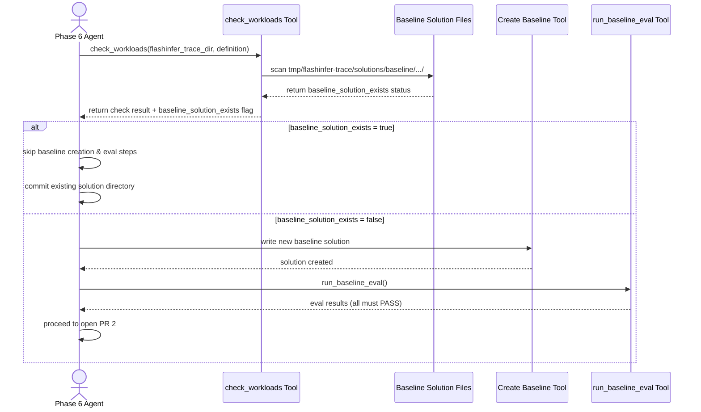

# [PR #355] fix: skip flashinfer-bench eval when baseline solution already exists

source: https://github.com/flashinfer-ai/flashinfer-bench/pull/355
state: closed | updated: 2026-04-14T00:00:45Z
labels: 

## 正文

## Summary

- When a baseline solution already exists in the trace repo, the agent was unnecessarily re-running \`flashinfer-bench run\` eval and overwriting correct existing traces. Observed in flashinfer-ai/flashinfer-trace#255.
- \`tool_check_workloads\` now reports \`baseline_solution_exists\` and \`baseline_solution_files\`
- \`run_baseline_eval\` tool description explicitly warns to skip if baseline exists
- SYSTEM_PROMPT Phase 6: check \`check_workloads\` result first; skip entire phase if \`baseline_solution_exists=true\`
- SKILL.md Phase 4 agent template and Phase 4b: same skip rule documented

## Files changed
- \`scripts/onboard_definition_agent.py\`
- \`.claude/skills/onboard-model/SKILL.md\`

🤖 Generated with [Claude Code](https://claude.com/claude-code)

<!-- This is an auto-generated comment: release notes by coderabbit.ai -->

## Summary by CodeRabbit

* **Documentation**
  * Updated Phase 4 workflow documentation to reflect conditional baseline solution handling.

* **Improvements**
  * Baseline solution creation now checks for existing solutions and skips regeneration when detected, reducing redundant processing.

<!-- end of auto-generated comment: release notes by coderabbit.ai -->

## 评论 (1)

### coderabbitai[bot] · 2026-04-10

<!-- This is an auto-generated comment: summarize by coderabbit.ai -->
<!-- This is an auto-generated comment: rate limited by coderabbit.ai -->

> [!WARNING]
> ## Rate limit exceeded
> 
> `@yzh119` has exceeded the limit for the number of commits that can be reviewed per hour. Please wait **22 minutes and 26 seconds** before requesting another review.
> 
> Your organization is not enrolled in usage-based pricing. Contact your admin to enable usage-based pricing to continue reviews beyond the rate limit, or try again in **22 minutes and 26 seconds**.
> 
> <details>
> <summary>⌛ How to resolve this issue?</summary>
> 
> After the wait time has elapsed, a review can be triggered using the `@coderabbitai review` command as a PR comment. Alternatively, push new commits to this PR.
> 
> We recommend that you space out your commits to avoid hitting the rate limit.
> 
> </details>
> 
> 
> <details>
> <summary>🚦 How do rate limits work?</summary>
> 
> CodeRabbit enforces hourly rate limits for each developer per organization.
> 
> Our paid plans have higher rate limits than the trial, open-source and free plans. In all cases, we re-allow further reviews after a brief timeout.
> 
> Please see our [FAQ](https://docs.coderabbit.ai/faq) for further information.
> 
> </details>
> 
> <details>
> <summary>ℹ️ Review info</summary>
> 
> <details>
> <summary>⚙️ Run configuration</summary>
> 
> **Configuration used**: defaults
> 
> **Review profile**: CHILL
> 
> **Plan**: Pro
> 
> **Run ID**: `c96ace8d-bdf9-41a4-9e7d-b3bb8279c780`
> 
> </details>
> 
> <details>
> <summary>📥 Commits</summary>
> 
> Reviewing files that changed from the base of the PR and between 8bdfd801a900ff2b8d1b2299128c0600944e3933 and 1297dcd62340e929849a9338c840db84b02b9420.
> 
> </details>
> 
> <details>
> <summary>📒 Files selected for processing (2)</summary>
> 
> * `.claude/skills/onboard-model/SKILL.md`
> * `scripts/onboard_definition_agent.py`
> 
> </details>
> 
> </details>

<!-- end of auto-generated comment: rate limited by coderabbit.ai -->

<!-- walkthrough_start -->

<details>
<summary>📝 Walkthrough</summary>

## Walkthrough

The workflow for baseline solution handling now implements conditional reuse logic. Before creating or evaluating a baseline solution, the system first checks if baseline JSON files already exist in the expected directory structure. If they exist, the creation and evaluation steps are skipped; otherwise, baseline creation and evaluation proceed as before.

## Changes

|Cohort / File(s)|Summary|
|---|---|
|**Documentation** <br> `.claude/skills/onboard-model/SKILL.md`|Updated Phase 4b section to document the new "check first / only create when missing" control flow for baseline solutions, reflecting conditional reuse behavior.|
|**Implementation** <br> `scripts/onboard_definition_agent.py`|Extended `tool_check_workloads` to scan for and report baseline solution file existence (`baseline_solution_exists` and `baseline_solution_files`). Updated `run_baseline_eval` tool description and rewrote Phase 6 workflow to conditionally skip baseline creation and evaluation when solutions already exist.|

## Sequence Diagram



## Estimated code review effort

🎯 3 (Moderate) | ⏱️ ~20 minutes

## Possibly related PRs

- **flashinfer-ai/flashinfer-bench#293**: Introduces baseline-eval gating and trace outputs in baseline evaluation workflows, complementing the conditional reuse logic added in this PR.

## Suggested reviewers

- yzh119
- Ubospica

## Poem

> 🐰 Check before you create, that's the way!  
> Reuse what exists, don't redo today.  
> Skip the unnecessary, keep what's there—  
> Efficiency whispered on the code-review air. ✨

</details>

<!-- walkthrough_end -->

<!-- pre_merge_checks_walkthrough_start -->

<details>
<summary>🚥 Pre-merge checks | ✅ 2 | ❌ 1</summary>

### ❌ Failed checks (1 warning)

|     Check name     | Status     | Explanation                                                                          | Resolution                                                                         |
| :----------------: | :--------- | :----------------------------------------------------------------------------------- | :--------------------------------------------------------------------------------- |
| Docstring Coverage | ⚠️ Warning | Docstring coverage is 0.00% which is insufficient. The required threshold is 80.00%. | Write docstrings for the functions missing them to satisfy the coverage threshold. |

<details>
<summary>✅ Passed checks (2 passed)</summary>

|     Check name    | Status   | Explanation                                                                                                                                                                |
| :---------------: | :------- | :------------------------------------------------------------------------------------------------------------------------------------------------------------------------- |
| Description Check | ✅ Passed | Check skipped - CodeRabbit’s high-level summary is enabled.                                                                                                                |
|    Title check    | ✅ Passed | The title accurately describes the main change: conditionally skipping flashinfer-bench eval when baseline solutions already exist, which is the core objective of the PR. |

</details>

<sub>✏️ Tip: You can configure your own custom pre-merge checks in the settings.</sub>

</details>

<!-- pre_merge_checks_walkthrough_end -->

<!-- finishing_touch_checkbox_start -->

<details>
<summary>✨ Finishing Touches</summary>

<details>
<summary>🧪 Generate unit tests (beta)</summary>

- [ ] <!-- {"checkboxId": "f47ac10b-58cc-4372-a567-0e02b2c3d479", "radioGroupId": "utg-output-choice-group-unknown_comment_id"} -->   Create PR with unit tests

</details>

</details>

<!-- finishing_touch_checkbox_end -->

<!-- tips_start -->

---

Thanks for using [CodeRabbit](https://coderabbit.ai?utm_source=oss&utm_medium=github&utm_campaign=flashinfer-ai/flashinfer-bench&utm_content=355)! It's free for OSS, and your support helps us grow. If you like it, consider giving us a shout-out.

<details>
<summary>❤️ Share</summary>

- [X](https://twitter.com/intent/tweet?text=I%20just%20used%20%40coderabbitai%20for%20my%20code%20review%2C%20and%20it%27s%20fantastic%21%20It%27s%20free%20for%20OSS%20and%20offers%20a%20free%20trial%20for%20the%20proprietary%20code.%20Check%20it%20out%3A&url=https%3A//coderabbit.ai)
- [Mastodon](https://mastodon.social/share?text=I%20just%20used%20%40coderabbitai%20for%20my%20code%20review%2C%20and%20it%27s%20fantastic%21%20It%27s%20free%20for%20OSS%20and%20offers%20a%20free%20trial%20for%20the%20proprietary%20code.%20Check%20it%20out%3A%20https%3A%2F%2Fcoderabbit.ai)
- [Reddit](https://www.reddit.com/submit?title=Great%20tool%20for%20code%20review%20-%20CodeRabbit&text=I%20just%20used%20CodeRabbit%20for%20my%20code%20review%2C%20and%20it%27s%20fantastic%21%20It%27s%20free%20for%20OSS%20and%20offers%20a%20free%20trial%20for%20proprietary%20code.%20Check%20it%20out%3A%20https%3A//coderabbit.ai)
- [LinkedIn](https://www.linkedin.com/sharing/share-offsite/?url=https%3A%2F%2Fcoderabbit.ai&mini=true&title=Great%20tool%20for%20code%20review%20-%20CodeRabbit&summary=I%20just%20used%20CodeRabbit%20for%20my%20code%20review%2C%20and%20it%27s%20fantastic%21%20It%27s%20free%20for%20OSS%20and%20offers%20a%20free%20trial%20for%20proprietary%20code)

</details>

<sub>Comment `@coderabbitai help` to get the list of available commands and usage tips.</sub>

<!-- tips_end -->

<!-- internal state start -->


<!-- DwQgtGAEAqAWCWBnSTIEMB26CuAXA9mAOYCmGJATmriQCaQDG+Ats2bgFyQAOFk+AIwBWJBrngA3EsgEBPRvlqU0AgfFwA6NPEgQAfACgjoCEYDEZyAAUASpETZWaCrKPR1AGxJcAZvAAeXIgA1vDckD4eaIgIGD6UYAJkDLCQJBJoHpAA7rBkkALRJB7w5Pb4Hnjw+FiZFCRotPIk/ki4yAAUZgDMAKy9AJSQkAYAqjYAMlywuLjciBwA9ItE6rDYAhpMzIuR0bHxFGDau1ExpYeJybCL3NgeHot9vcNjiJRcsrLw65hErwBlfDYCgMEgFKgYFK+AKLEJhMDpTJgXJkRJFErkRGtRDtSCAJMIYM5SLgIZhoZBmNosCMAbhqNgFvxuPkRgBherUOjoTiQABMAAY+QA2MACgAsYAAjALoFLehw+QAODi9AUALSMAMcVJcHAMUCs9SkGDx9TAFGwGAwpX+e3OcQSSShqSRWUw9HwUgo2Qo6ltaRx4gw/yYFHqYkguCoYOQqNqBQxpXBiAqVRq6A8nKagbayFKUbyUZj4Pq3HwkA6SAc4ME7woUnoBftBwSJxbFwS0bQYLMfP6Aw0Bqj+AqAH0UqJgmPsvgKMEPPhGsgMPhspAy3O8YV3piSGPU5VxDUxy08+gMPQd8Vkwe08eMGO/F5EEOoJbH9e96eMlkCBVICURAGD9bgH0gbBuFoLl6AIHJnCwOD4XCeAfHQRNd2TXNcVfYcAQATQBaAAFEAFkx1sAB5UirGgaxYCKSBhQgqCYJHRg8gYYIOKnGc5wXJdaGQeoHA8UkPXsUJwlwIt2HgeoeAY94UDQr9b0PdNHzPHDIAAXmLbASDfSAAQAaQASQmCYNGYegOisJTwXFdBSFNKMSGYbgohoC96AcxjxQEIZIOgmhYIrWh8AYRx2ELFM0DYSSwg3e4jKMAAxeAXw4v46H1KBgNA9pFhqAQlwoWgxyUPwbQfMc0FczRuFcKAtiibAlDhUIHkQEqMDK5xaDAZhFGKRYzMs6zbKMABxMhlDCnI1kgNl2qUFbRqHA0wEMAwTCgMhPTQtA8EIVyFu5bY2FNLheH4YRRHEKQZHkJglCoVR1C0HR9D28AoDgVBUEwHACGIeaqEWq72C4Kh1wcJwXAKV7Ro+tRNG0XQdqMP7TAMNqTs6+Eer6gaKuG0bHgmqybNofUACJGYMCxIAAQXM8HyEh7kEd1eR8DQlJcsQIx/OU5zbH5HJ+MiNdIFXdcmEvf0akyDx5HqRlpAvbDg3+NSyg0h8NEgcyMFxBojszbI0FkZAmGa20Vgh6gAzQeWSHXA2U3vapakvFLrQDAADDtHSOZ0UmDtJfwAGjingKCi6RkD8ChcR4rjU7nROSGxNoAwAKQBSiADkIiy7WrXeyBg9wTzTn2Tsjm7ME4V9mpeu9xYAG98G4MdcFkFkAF9e+q0oVcfDAEpIMeACoNCEVMMGDk3zLQmSSHkOpLeaIN4/UJL5gwm8yhAhpwIk5DkDdRZW9LEhzshv344kq71GQLfdYDI2/cA+Sj05w70QGAJA69N55HkJFeW+BSTaVwIfUkvBk50DjMtC+rsQwJ29r5QONpsGhzOK2CO1wY6ZGDvHbIy1v71AAI7YEAddUkMlqCZiyLOeci5lyUkZKSGIctg5WFZgCAExEAAi0ckg+DnOCSWfIUDIH7vNWgJs4DgkitFZhgBMAmQGLJyAh7CPX/jbZAIU2JwXqJER6hZUCABwCScXEK7p1JIsfgGB1aME5D5eMlJqy2kALgEChTRJyyLLbIW1zCWFZmJBafsv4Vm/koBgUQX6d34GhFo5YKCLRzncAQJQGBpFNP6aQRgoClzLsRIwExkz2wYiGPKkAADUMpFjSiMMRXE8AqRQ1GhudI8BPZpB8DInJXBSJ0HgI4AwjN6blLxoVMIxVSrlUqhPWqft6qNQ0M1BmTMWbs05hdegvNnD80Fg00gIsDB11HB4CcnFpycIEsuaOCt0C0FoFPNW8hgKYGQHXEsVV5LtyPPExY3dgD90HsPEgehFjAA2VPBFi9l41GjhJeouAQTm1rt7O84KTwIMQNHLyjJ8VJnIISzST5K6ksrM+Mgs9EADDfouEMiB4DrQQQGF53DaCQsXAIe+JZ7D0hxcJEg2S9ZqKLMHD8Y4CVumjv+LIQEQLLJMdEFioVuRIQleCI+Aj7ieg8fIJIKAMASHwMEbkaAfA0D4L6f02D3bkC9lSn2RL/bhWPjkPIWBg6OOefxAVDLNw5MBQSv+xKgyIF0tGQya8YBFn0UxaW85wlWtrgRIiZEKI2GorRaOpiBkutmGQLgR8PlJFWHiuQjA1YhxDXxLhglSXxyVt8h8vzj5f1kiUhS3swCxqwBWgMzTa6KuVb+aOFtwi+Pdrg3ejR955jfgHGoniWQUDGcwAd4JeCDOBDIL1xy0m+vIWExc65fHBxjR3LS8bdI+EyO8NeONmbRNiZehJCdkmpNdukgWgYZXcjyRsQpxTxDiDKcOO545W38o7R0MOhxB7Au+RQII0Z47IofLhigQwdriooNHDo2LcXcmLmXewk4qRgY9PqispQUkdXBA+r1NK6okq4GVComKA5ccwtSsddKXxcBKLiAA2riCgABdYOAwomQFIpgVC0hSSZS8GzGe6sABelAal1Jyo0umLSpTinacKTp3TemXX6caIZ64SCjK3BMqZMy5kLN2vtYpVsTpg2fmxaGN0NxoHhjqc5yMFDvRUOjb6WNDD+Y/rgMc3LEBjmc57OgB56Q5OS8Yf6kAlQCFoD4WgSoBRSjQAATgFAKUZfIBBKloFKAQfI+R1bq1KZUDABTCka3V8U4oSDdDq90boRXcZQDSxloS2XBm5cqodIr/nj1jjYBQUgjypxZdxM4Ukv0DA9wMMMemSBbAACFFxcToGyFgzCrD4AtrQemvh30kFjudyAl3ECUW9H6L5ZAPsRC+z9i7mj5O2ke96BqJAzZOv03SLkYOzvDAu0ssCvVVmDSqm5yedUEeml2bIdHv3Md/YIPSDw6UrRiHiWDqUkOqd/Z8Azh8iAADqaxxFRRh5ysHApKeQBHr9kerP6ZvRIDYBL6hudJxoEadwuAvBg7fR4d4UuTUeFoLdqKwRbAa4h79+m3zaA2CtPzhgdI/ScrZE8sHSbvtm4t1bjAquvCO6nM7y0ruofco9+I6QmqwJ+x91xE3WuA9/cxHa2g5lEA1kQHbsHjMpdnFwJH4INhpD3HaGDmTouMds+l080us908h+x+BHP9NWdU/podyVfvDKN8x/TLJUQZ4PnTzn4+LJ6BQEe0oOXn1cC6MgAgIgsAwBeCkFkM5SNUDMoKXQDQDfRcXZGkodPNsKAEKIFvtnf25zwHrZkHPle2Dp41UVP28yqeS5L9vv7Iab8kHT178EIaT9l5b0ZDb1jyb270wGAwwG/yLFg10x7Gim5k8Xv3gCSEPUpGpDM1IC4G7R+QeD+Skm4ADHQydDITdADXyFwTHWQFXRzAQSoQQBSEUQTjDFrAekZykAyQTlsE3w7wuxEifTBwwHuA8B4L+13y/y4HpgPyP3/ybwjBqD8CIBBHEPBxjxEPpnP0vw8GvyrwkJgK/1Fxfyp1Lybw/x0L+xt0F3+Dh2UFIBkM70AMQGj21zfy738C8nAL7wkIsOjADCYHh1IEYIFA0EawAFIA14AGCgZzZsBRkIihlSdU1H4GFAFYJYARJYAKgmxkBqtgiBQQjuCXC+CfV09Fd1ANEBcfDOUIgc5v4OcoQuc/Fk8Awt5mB2JEBXZEAfB5Bv4/CbDwQZJ0jMiCjT96YxD98EJbQ7CLsNDSgr8K8zDzcKj7ciBHCDDfsFNM9ohcBbAa8w9PC/sSA6sGBehxQlQpQlQlQ6thRaBeglRuhaBuhGtxRhQpQ6t+wlRhQGAythRWsGAutugZRBQBAAB2YE0QYEnwI4pUUQEgYEgQJ4vkUZHwcUf/emLPWwH/O/IbH4hgHwYE444UYEqUPoYEtACEw42gcURoboNAIbIkibboQKN9AQHwQUEUNANAKUYE8UGUYE/oQKUbS43oAQcUd7AwcXWbXOLbSgXbENLLNbX6fzILfAMcbgE6d4fLLkTUwrE7HuNErYqwdUugVmXAPPCQFzB7J7dQR7K0XAD7AUCUpU06VUo0zUmgU8AOfQIAA= -->

<!-- internal state end -->

## Review (3)

### coderabbitai[bot] · 2026-04-10 · COMMENTED

**Actionable comments posted: 3**

<details>
<summary>🤖 Prompt for all review comments with AI agents</summary>

```
Verify each finding against the current code and only fix it if needed.

Inline comments:
In @.claude/skills/onboard-model/SKILL.md:
- Around line 528-533: Update the skip rule so it not only checks for the
baseline dir but also verifies the corresponding trace file and that it contains
no failures: when considering "If baseline solution ALREADY EXISTS" add an
explicit check for traces/{op_type}/{definition_name}.jsonl existence and parse
that file to ensure there are no entries with failed statuses before skipping
regeneration and eval; if the trace file is missing or contains any failed
status, proceed to create the baseline and run flashinfer-bench eval as
described in Phase 4b.

In `@scripts/onboard_definition_agent.py`:
- Around line 508-517: The current skip logic after calling check_workloads only
checks baseline_solution_exists and can skip validation even when trace files
are stale; update the condition that short-circuits the baseline phase (the
block that currently checks baseline_solution_exists) to also require
trace_failed == 0 and trace_passed > 0 before skipping; specifically, in the
routine that calls check_workloads (look for variables baseline_solution_exists,
trace_failed, trace_passed and the code path that would "skip this entire phase"
and avoid run_baseline_eval), change the guard so the skip happens only when
baseline_solution_exists && trace_failed == 0 && trace_passed > 0, otherwise
proceed to read/write the baseline solution and call run_baseline_eval.
- Around line 256-259: The baseline detection currently uses baseline_dir =
trace_dir / "solutions" / "baseline" / op_type / definition and misses files
when op_type is "unknown"; change the lookup in the block that builds
baseline_files and sets
results["baseline_solution_exists"]/results["baseline_solution_files"] so that
if op_type is unresolved (e.g., "unknown") or baseline_dir doesn't exist you
instead search across all op_type subdirectories under
trace_dir/"solutions"/"baseline" (e.g., iterate
trace_dir/"solutions"/"baseline"/*/definition.glob("*.json")) and aggregate
matching files; then set results["baseline_solution_exists"] =
len(baseline_files) > 0 and results["baseline_solution_files"] = [f.name for f
in baseline_files] as before.
```

</details>

<details>
<summary>🪄 Autofix (Beta)</summary>

Fix all unresolved CodeRabbit comments on this PR:

- [ ] <!-- {"checkboxId": "4b0d0e0a-96d7-4f10-b296-3a18ea78f0b9"} --> Push a commit to this branch (recommended)
- [ ] <!-- {"checkboxId": "ff5b1114-7d8c-49e6-8ac1-43f82af23a33"} --> Create a new PR with the fixes

</details>

---

<details>
<summary>ℹ️ Review info</summary>

<details>
<summary>⚙️ Run configuration</summary>

**Configuration used**: defaults

**Review profile**: CHILL

**Plan**: Pro

**Run ID**: `19fddda1-5296-4088-a3b6-0186a2f15289`

</details>

<details>
<summary>📥 Commits</summary>

Reviewing files that changed from the base of the PR and between 80f40d45968c65840d05872516befd9691ec9fd8 and 8bdfd801a900ff2b8d1b2299128c0600944e3933.

</details>

<details>
<summary>📒 Files selected for processing (2)</summary>

* `.claude/skills/onboard-model/SKILL.md`
* `scripts/onboard_definition_agent.py`

</details>

</details>

<!-- This is an auto-generated comment by CodeRabbit for review status -->

### gemini-code-assist[bot] · 2026-04-10 · COMMENTED

## Code Review

This pull request modifies the flashinfer-trace onboarding workflow to skip baseline solution creation and evaluation if a solution already exists. Changes include updated instructions in SKILL.md and enhanced logic in onboard_definition_agent.py to track baseline files. Reviewers suggested removing a redundant directory existence check before globbing and correcting the run_baseline_eval instructions to remove a non-existent parameter.

### yongwww · 2026-04-10 · APPROVED

(no text)
