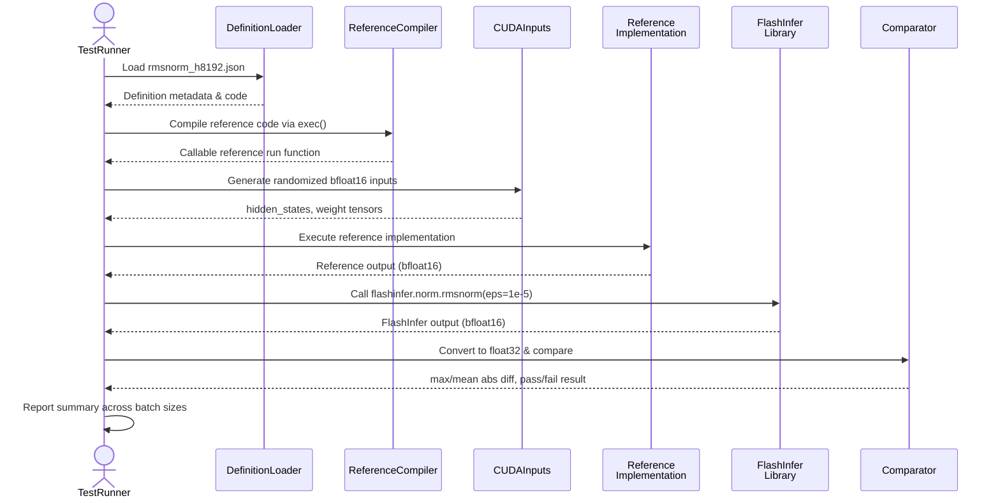

# [PR #357] feat: add rmsnorm_h8192 definition (Llama 3.1 70B)

source: https://github.com/flashinfer-ai/flashinfer-bench/pull/357
state: open | updated: 2026-04-16T03:54:01Z
labels: 

## 正文

## Summary
- Add `rmsnorm_h8192` definition (Llama 3.1 70B, Qwen2.5 72B)
- Update `model_coverage.mdx`: mark as 🟡

<!-- This is an auto-generated comment: release notes by coderabbit.ai -->

## Summary by CodeRabbit

* **New Features**
  * Added `rmsnorm_h8192` operator definition for Llama 3.1/3.3 70B language models, providing optimized support for this commonly-used hidden dimension size in production deployments.

* **Tests**
  * Added comprehensive reference correctness test for the new `rmsnorm_h8192` operator, including validation across multiple batch size configurations (1, 4, 8, 16, 32) to ensure numerical accuracy.

<!-- end of auto-generated comment: release notes by coderabbit.ai -->

## 评论 (1)

### coderabbitai[bot] · 2026-04-10

<!-- This is an auto-generated comment: summarize by coderabbit.ai -->
<!-- walkthrough_start -->

<details>
<summary>📝 Walkthrough</summary>

## Walkthrough

Introduces a new `rmsnorm_h8192` operator definition targeting Llama 3.1/3.3 70B models with fixed hidden size of 8192. Adds operator definition schema, reference implementation, and correctness test infrastructure. Updates documentation coverage status to reflect the new definition.

## Changes

|Cohort / File(s)|Summary|
|---|---|
|**Operator Definition** <br> `flashinfer_trace/definitions/rmsnorm/rmsnorm_h8192.json`|New operator definition for `rmsnorm_h8192` with `hidden_size` fixed to 8192 and epsilon at `1e-5`. Includes reference PyTorch implementation computing inverse RMS normalization via `rsqrt(mean(square(x)) + EPS)` with weight scaling.|
|**Reference Test** <br> `flashinfer_trace/tests/references/test_rmsnorm_h8192.py`|New correctness test for `rmsnorm_h8192`. Loads definition JSON, compiles reference implementation, generates bfloat16 inputs across batch sizes (1, 4, 8, 16, 32), compares outputs against `flashinfer.norm.rmsnorm` using configurable tolerances.|
|**Documentation** <br> `docs/model_coverage.mdx`|Updates coverage status for `rmsnorm_h8192` from ❌ to 🟡 in Llama 3.1/3.3 70B section, indicating definition JSON is available but workload collection pending.|

## Sequence Diagram



## Estimated code review effort

🎯 2 (Simple) | ⏱️ ~12 minutes

## Suggested reviewers

- yyihuang
- yzh119

## Poem

> 🐰 *A hidden size of eighty-ninety-two,*  
> *For Llama's layers, fresh and new!*  
> *Norm and RMS, in perfect dance,*  
> *Reference tests give workflows a chance,* 🌟  
> *Hop-hop, the coverage marks 🟡 today!*

</details>

<!-- walkthrough_end -->


<!-- pre_merge_checks_walkthrough_start -->

<details>
<summary>🚥 Pre-merge checks | ✅ 3</summary>

<details>
<summary>✅ Passed checks (3 passed)</summary>

|     Check name     | Status   | Explanation                                                                                                                                             |
| :----------------: | :------- | :------------------------------------------------------------------------------------------------------------------------------------------------------ |
| Docstring Coverage | ✅ Passed | No functions found in the changed files to evaluate docstring coverage. Skipping docstring coverage check.                                              |
|  Description Check | ✅ Passed | Check skipped - CodeRabbit’s high-level summary is enabled.                                                                                             |
|     Title check    | ✅ Passed | The title clearly summarizes the primary change: adding an rmsnorm_h8192 definition for Llama 3.1 70B, which aligns with the main objectives of the PR. |

</details>

<sub>✏️ Tip: You can configure your own custom pre-merge checks in the settings.</sub>

</details>

<!-- pre_merge_checks_walkthrough_end -->

<!-- finishing_touch_checkbox_start -->

<details>
<summary>✨ Finishing Touches</summary>

<details>
<summary>🧪 Generate unit tests (beta)</summary>

- [ ] <!-- {"checkboxId": "f47ac10b-58cc-4372-a567-0e02b2c3d479", "radioGroupId": "utg-output-choice-group-unknown_comment_id"} -->   Create PR with unit tests

</details>

</details>

<!-- finishing_touch_checkbox_end -->

<!-- tips_start -->

---

Thanks for using [CodeRabbit](https://coderabbit.ai?utm_source=oss&utm_medium=github&utm_campaign=flashinfer-ai/flashinfer-bench&utm_content=357)! It's free for OSS, and your support helps us grow. If you like it, consider giving us a shout-out.

<details>
<summary>❤️ Share</summary>

- [X](https://twitter.com/intent/tweet?text=I%20just%20used%20%40coderabbitai%20for%20my%20code%20review%2C%20and%20it%27s%20fantastic%21%20It%27s%20free%20for%20OSS%20and%20offers%20a%20free%20trial%20for%20the%20proprietary%20code.%20Check%20it%20out%3A&url=https%3A//coderabbit.ai)
- [Mastodon](https://mastodon.social/share?text=I%20just%20used%20%40coderabbitai%20for%20my%20code%20review%2C%20and%20it%27s%20fantastic%21%20It%27s%20free%20for%20OSS%20and%20offers%20a%20free%20trial%20for%20the%20proprietary%20code.%20Check%20it%20out%3A%20https%3A%2F%2Fcoderabbit.ai)
- [Reddit](https://www.reddit.com/submit?title=Great%20tool%20for%20code%20review%20-%20CodeRabbit&text=I%20just%20used%20CodeRabbit%20for%20my%20code%20review%2C%20and%20it%27s%20fantastic%21%20It%27s%20free%20for%20OSS%20and%20offers%20a%20free%20trial%20for%20proprietary%20code.%20Check%20it%20out%3A%20https%3A//coderabbit.ai)
- [LinkedIn](https://www.linkedin.com/sharing/share-offsite/?url=https%3A%2F%2Fcoderabbit.ai&mini=true&title=Great%20tool%20for%20code%20review%20-%20CodeRabbit&summary=I%20just%20used%20CodeRabbit%20for%20my%20code%20review%2C%20and%20it%27s%20fantastic%21%20It%27s%20free%20for%20OSS%20and%20offers%20a%20free%20trial%20for%20proprietary%20code)

</details>

<sub>Comment `@coderabbitai help` to get the list of available commands and usage tips.</sub>

<!-- tips_end -->

<!-- internal state start -->


<!-- DwQgtGAEAqAWCWBnSTIEMB26CuAXA9mAOYCmGJATmriQCaQDG+Ats2bgFyQAOFk+AIwBWJBrngA3EsgEBPRvlqU0AgfFwA6NPEgQAfACgjoCEYDEZyAAUASpETZWaCrKPR1AGxJcAZiWpcaLT0FMyIGPihAPqwABwAjACcAEyQSj7wGOrw+FiYISR+FGQMJJA0iLiQABQAMh5ozGiQAMwa8ZAA7AAMAEIAlJCQBgByjgKUXC0ArJ1DBgCqNrVcsLi43IgcAPTbROqw2AIaTMzbPg2ICBhFYNrnl9e3ExgMsNvc2B4e2zNzwwtEJNIEJckRYLJsK9YPgysMAMr4bAUUqQARUaG+fy4bbpMChcKRZgxBIpSCAJMIYM5SFV0Zg3lwmpl5vDcNRsFt+NwyPMAMLFah0dCcSDJbrJABsYG6ABYwPFutBkskODLOhx4tMAFpGXmwTCkLYGKAAQWCkAABgSItE4klkha0oVMtlcpAfJFIPVGs02h0er0NMbIGb6M1ikUSmUKlUJGgPPBaNRMkRLdaiST7Y60ERtBhKpAAGKPACSN0oQagC24SZoluYihIHiiTCkVFIGmYtAAHo6CJAmhQANblWBlBtKDzoZCAXg3AIf7QeNYEMBhMUDI9HwPhwBGIZGUNHopzYGBFvH4wlE4ikMnkTCUVFU6i0On0q/AUDgqFQmB3hFI5BUIeCisOwXBUAA7vYjiDvIcgKA+KhqJo2i6MuRjvqYBi0PgDCINsE5Ni2+BtjmJCdj2HAGAARLRBgWCGJZ7oBgr0A4TguPw25vAa0hGGWlo4XhBGNs2rbKB2Xa9gANKOZTie2ZSVOyyAenwuBjmmYQ2sSdopI66QuuIbpQg+cmQAAVBZ3pNK07SQNsdktF0fRWfYV45FgPEYIa7oUCwkCADLkNTMEgiApoM/bzjUhlZMZWAAFLwgA8iMkAkN2SC4DIeCQBBkRDh4+BBJAERVLIJBVEw3xXnQ/QaDAmkWj4HJ0FEQS0FE6a2qSDqQAm5CQMUTL5pAULeaQYbIIFsn5KV+D8BplBOhkcWecgnpsgIXjpaeFDwNI6DFAOijwBkdCLuYlgmh4NBAet5QLUtToMA0925Bt24ZdwkTAZ6nzbfADC7eI4h8cGIy5GU1RCY47DJrkYC5B4d76j5JD1UYtSZIdE10FwADU8TbPKRgAKKVPATTAfeZTFBIB1QYUakigAsnQ8CODRdFLmARgXGgVyZEUUS4FQpS4s6a0fds3VnHLmYpBoQiILkVG0dR9HXUxAEHkK7GwVxjBo4aRihkKzTkFB+DckBnqxa6WAZDtzWPMLlCi+LJCS6tjv4XLsvaRmenJMrqsYAZ0gMPtag+egWBWkHoSOnG+2YFUGCNEKieEj1WZ5QcloIMEZBROFABeJCOhk3ZCv2vXx/QJCbPARVO/AtdhlUFrxCQYDTBaDVwGUDvxfY3IMGdB3ILQsiZ6FwMWgI1BvGX8CV9mGBHh9bKnkXiZKBga8b+gteILJmSfFUND5pEyAWsXh9l2yFSOtUVxoNyloANrL7gq8VxILJR+pdAEAF0LSySXhcYquB4gSgtIMOaFoIIkHgOCXAb8P5fwtN/EBR9wGQMtAIGB1B4GINmlveO/A8BX3KGQVWfALRIg2HgR0EFC7PUQFnew+ov5zVoLgWQ/D774OfoKRAg9IAliqJkV62AlDIGaFaQolAoyOisLIaAkQ3goGYNwLwJ4X6eVHNQacQIKDZXMvg+w68yioF6rJU4V9DqZDbECSANhWbwnmqEeM68EZYAZsoigiAACOljqhsEwO/MJ2BnAkGqN2fogwCaQDJlYeE/QiGfwMdPdKhj2AcI8YgBg/i47wRQWgjBOSqHFFwMiUaz1igOFuowQWtI0AMBHP2Z6kR0GZHjGkIR3JLpaxDLdA8D1emaSUK9ZwgTPrpW7D9SxQp/pHATMDdg2RwamhLvQK2yzVl/VttQe2UtHZcFdoLJ4HsxZdO9qPdagdc7yyTrpXqYdcgWgMEMKAIwSBQXnus7gPsjKeWuSCrg1EFYh2ouwwuzDuCi2Ed4SAsKPkIsbu6Du2cxGAK4L1X54zWaYDOtIKohZW5lBNJnFGlcKBYxxsgPGtBCYyhlCTbo5NKbUyFLTIaJAGZAvSj4FmXBaj4AgtzTWvN+Zu3LBQT2jztgxn9qo4orxpBqspV1D5itQ7cFkOrOiDETQ633EBfWMFnDyC3MbXiiAzYHPQKVUVEY1HaoUBQYoYhyCIGQDGE6tAvhlDUlpN5hq+zUkqimL0DRbJ+l+BoZyAZIA2MATUXq9VGrRkpf1XCEicVFSCEorANsplumeW6JKqU/IBWUTW/MBl4B+oIJxeCpTMBZDjg4AQtA21Xn6YdCNzRqZvHjRaAA3iCgAvt8iODUZEgW4DSoNszLnxUAJgEyASDMAmK6lRkZtWOkFcEy0GVRB9gWoINkzJmhlO+CoF2FAoTV3GvFWSutrXIAxDhUKld6C8gWAAERNCgDAV9kDVAfgfUBL9pCOmZCQ0tcCJQ4qqegtYyGsCodgfA/olD6BLSwFehgeBDoCHwBpcynqtWoipgY/d8Mx7IIFkLJVGgdIaDlm/DhtGLTN0QAAXl7v3RBQ9NIsOg0deSuQ2zAX7KQ3ALRUhzWcQk+gHJ41NG7ARfweQBCqw8JRtIZ0T2lGQAYjkQqGjXhHhZr1VnZICdgDwQW+EfDaCnEoO6oVyD0EqR2t4WhvivXwECbMuZMgFiYDcdByIX1lAtOcjwFpthWgIOlhqEGLQjWqNkoaLCcZDShBu/NBYun+UDQOL44hmNohXu5wBMH4iyRlLJWIsl4GyTU0R9p/8xzWcoGAP+uiMqlG4PFINC14viAwNgMo5G8CeWIzwfap4lHQQ4nY+g3BPMKChJoaR24QPgZQMgKEaA4yt2S7JZ6wbeCZCsc0CCzhe2pjmhldQe7nAo3dJ6JgvqrwBqDZSlMYzzWTPek0p6m75mw6Wd9X66y+AAy2SDXZzrgzm0OaK52KWON3OVQ8iW6rZaaqjPhGM+qo0hw0MaxFtGMdA3oQWdgLgfova85+9aVF/mWlp8D9tYPqjjdgMfEgInuvCnwB4GXfcWiyUsfLsTfdkiDGXGifA8vfmC/y3mQrug9CQEhuQElDEyVZD8AWalO06XxlkIy5lAbHXo3ZZAImSRuW8vEPy7eSghUiqZuK36XB2aDq5hrIwb5MLrioQ6tAeB/xWtYiBIx4E0BQQNnatEd5GyPmQi+NChg1wZ/UFERMiAurCsZm1ZSljS/GA/GiGUAhEhoFmBKBgiQSDJAEC0boEpB/wIYDMBgEoSAyhILEEgSRYjTFiAweIYpUhx/L8eSv1fa8h7ahuZv5feAkCiGwCgpAWxjm6TXxvVQ4/Tr+RipAthehFW6XQXkLAjFWEi4eaivh4wgRpJH9qIkBko2x9oS4MB/93RACgEQChJKhNsiBP9SJSAyw7p6VWRBQYDp051gChhqJaYbAkJ1AAB1fyGgKwCgdwXALwGA7zDwIAkAy4XAPUUQIcGwaQerRAGA7+R/IYB/IYYQjFN4DgkYLOGA6iUDXCJA+NVAiSEgaiAgkQjFZSBpXgrgMWJbFQkQ6ib6BoTOeKKQyGd0PnD6QHUySDcyNlXFLwWbdKOMUzQUNIWQsWeNBSMiBqeEIceAbgNdOORA9wuOTw0gY2DgjQZQgQ4Q2FaQeXVbXIKQig9QEeNw5A1STaTSFqV4GbAcMKeNJaZgR6ewZMRAHweQZ6UI6MWAFpGEDwWgSI3QmIwiKQ97CgT7KI1QjFfpfYeldg7pCQtgKQoI9IzWEQ/A6IoQ1Qogq/IcQYpQmFUDKOfaabExfoocTo6Y9QjkGA7Q+Aro/QlZQwwJKQ9Y+wXw/woUKAT/JQEgp8XAXdDNbDMALwKQKcXPTiVAMgZLBozYvQlomFNojopowgnowZDwdY+Y4Y5Yvw4w6IiYkQqYvQsQgYyQmFWgnaFEjYkEtQl+HYrQt9fY6YgwzAE49EzSUGTErwf7eQD4uxCrDbKmPPPGQIYIeNX8OFBuZtQHPgGyX0eyAMVzBAXRfxIgUaNzcyEaC8EQMQSQQ6B1Z6WwRo6IwggEjFIElMP4mIv1XIDIIgZEBY2ApgokvQsEvo2YqEmFSkpQ+Ex/MBFQ6iVg2wJY0pFY4wmFAQaYGYNAEgFoNAeIBgboWIToZIToCUeIJQaYEgCUZIWIHwUfZUUQaYRIXvLpCUHwaYLpNTboRIGUZIaYHwcUUQVfeIGUWgToToFfTYx0jpWwDEw0/QlIBIHwYM6YWgZIbzGUWIAQToWYGUaYaYLszoWgboEc7oBgMUcUboeIHwHvToefCstARIaYHskgEM5IFoTvHMhgToGURIRIasq4JEeo1/XCIcWwBguAh0wdWgGwKEF06OWEzydYy84068xMO8jAesl8gknQhAj8+83CVkdIn88oQkgwOdFvCADbE/M/C/LEmvA/N8cvZPAgKIA7VqcRGgcRJve/GsyoKwZPIEWgE0XALgvfWgT/VgdQT/Y7f/boSC+PP8dCoik/dQk/JC5cIAA=== -->

<!-- internal state end -->

## Review (3)

### gemini-code-assist[bot] · 2026-04-10 · COMMENTED

## Code Review

This pull request adds the rmsnorm_h8192 operator definition for Llama 3.1/3.3 70B, updates the model coverage documentation, and includes a correctness test. Feedback suggests implementing a non-fused rmsnorm adapter to enable benchmarking and improving the reference implementation's robustness by using shape[-1] to handle potential 3D tensors.

### coderabbitai[bot] · 2026-04-10 · COMMENTED

**Actionable comments posted: 1**

> [!CAUTION]
> Some comments are outside the diff and can’t be posted inline due to platform limitations.
> 
> 
> 
> <details>
> <summary>⚠️ Outside diff range comments (1)</summary><blockquote>
> 
> <details>
> <summary>docs/model_coverage.mdx (1)</summary><blockquote>
> 
> `190-205`: _⚠️ Potential issue_ | _🟡 Minor_
> 
> **Coverage summary is stale after the status flip.**
> 
> After Line 190 changed to 🟡, the section summary at Line 205 is inconsistent: it still reports `8 / 14` and still lists `rmsnorm h8192` as missing. This should now be `9 / 14`, and `rmsnorm h8192` should be removed from the missing list.  
> 
> 
> <details>
> <summary>📝 Proposed doc fix</summary>
> 
> ```diff
> -**Coverage**: 8 / 14 definitions present. GQA kernels shared with Qwen3-32B (same h=16, kv=2, d=128 at TP=4). Missing: rmsnorm h8192, all GEMM definitions for hidden=8192.
> +**Coverage**: 9 / 14 definitions present. GQA kernels shared with Qwen3-32B (same h=16, kv=2, d=128 at TP=4). Missing: all GEMM definitions for hidden=8192, and fused_add_rmsnorm_h8192.
> ```
> </details>
> 
> <details>
> <summary>🤖 Prompt for AI Agents</summary>
> 
> ```
> Verify each finding against the current code and only fix it if needed.
> 
> In `@docs/model_coverage.mdx` around lines 190 - 205, Update the coverage summary
> to reflect the status flip for `rmsnorm_h8192`: change the "Coverage: 8 / 14
> definitions present." line to "Coverage: 9 / 14 definitions present." and remove
> `rmsnorm h8192` from the trailing "Missing:" sentence so it only lists the GEMM
> definitions still missing (e.g., "Missing: all GEMM definitions for
> hidden=8192."). Ensure the text references the same symbols (`rmsnorm_h8192`,
> gemm_n10240_k8192`, `gemm_n8192_k8192`, `gemm_n57344_k8192`,
> `gemm_n8192_k28672`) so the doc and summary stay consistent.
> ```
> 
> </details>
> 
> </blockquote></details>
> 
> </blockquote></details>

<details>
<summary>🤖 Prompt for all review comments with AI agents</summary>

```
Verify each finding against the current code and only fix it if needed.

Inline comments:
In `@flashinfer_trace/tests/references/test_rmsnorm_h8192.py`:
- Around line 41-116: The test function test_correctness currently returns a
bool which pytest treats as a normal return (silently passing); change it to use
assert statements (e.g., assert torch.allclose(ref_f32, fi_f32, atol=atol,
rtol=rtol), f"Outputs differ (max abs {abs_diff.max().item():.6e})") instead of
returning True/False, and remove the boolean return; in main(), ensure script
failures propagate a non-zero exit by re-raising caught exceptions or calling
sys.exit(1) in the except block (reference functions: test_correctness, main;
variables: ref_f32, fi_f32, abs_diff, atol, rtol).

---

Outside diff comments:
In `@docs/model_coverage.mdx`:
- Around line 190-205: Update the coverage summary to reflect the status flip
for `rmsnorm_h8192`: change the "Coverage: 8 / 14 definitions present." line to
"Coverage: 9 / 14 definitions present." and remove `rmsnorm h8192` from the
trailing "Missing:" sentence so it only lists the GEMM definitions still missing
(e.g., "Missing: all GEMM definitions for hidden=8192."). Ensure the text
references the same symbols (`rmsnorm_h8192`, gemm_n10240_k8192`,
`gemm_n8192_k8192`, `gemm_n57344_k8192`, `gemm_n8192_k28672`) so the doc and
summary stay consistent.
```

</details>

<details>
<summary>🪄 Autofix (Beta)</summary>

Fix all unresolved CodeRabbit comments on this PR:

- [ ] <!-- {"checkboxId": "4b0d0e0a-96d7-4f10-b296-3a18ea78f0b9"} --> Push a commit to this branch (recommended)
- [ ] <!-- {"checkboxId": "ff5b1114-7d8c-49e6-8ac1-43f82af23a33"} --> Create a new PR with the fixes

</details>

---

<details>
<summary>ℹ️ Review info</summary>

<details>
<summary>⚙️ Run configuration</summary>

**Configuration used**: defaults

**Review profile**: CHILL

**Plan**: Pro

**Run ID**: `14616a75-c77a-4302-be6b-5b7a6a27eb25`

</details>

<details>
<summary>📥 Commits</summary>

Reviewing files that changed from the base of the PR and between 534a6f6c9eb6382b08d2612bd58543fcac025f6e and b4b9a576c9e2b306b316c35c6e4e8e19858c1202.

</details>

<details>
<summary>📒 Files selected for processing (3)</summary>

* `docs/model_coverage.mdx`
* `flashinfer_trace/definitions/rmsnorm/rmsnorm_h8192.json`
* `flashinfer_trace/tests/references/test_rmsnorm_h8192.py`

</details>

</details>

<!-- This is an auto-generated comment by CodeRabbit for review status -->

### jonghyunchoe · 2026-04-16 · COMMENTED

(no text)
