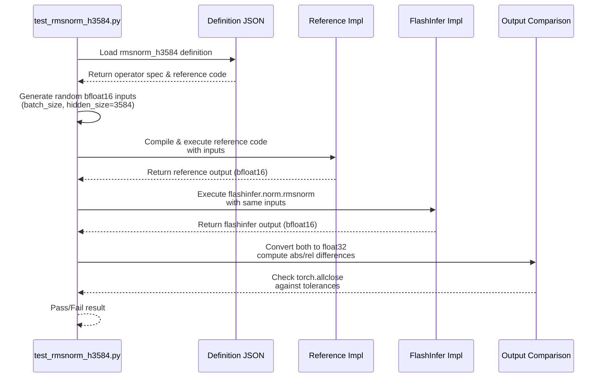

# [PR #360] feat: add rmsnorm_h3584 definition and reference test (Qwen2.5 7B)

source: https://github.com/flashinfer-ai/flashinfer-bench/pull/360
state: open | updated: 2026-04-16T04:13:47Z
labels: 

## 正文

## Summary
- Add `rmsnorm_h3584` definition (Qwen2.5 7B)
- Add reference test validating against FlashInfer
- Update `model_coverage.mdx`: mark as 🟡

<!-- This is an auto-generated comment: release notes by coderabbit.ai -->

## Summary by CodeRabbit

* **New Features**
  * Added operator definition for Qwen2.5 7B's RMSNorm with hidden size 3584, supporting variable batch sizes with bfloat16 precision.

* **Tests**
  * Added correctness validation test for the new operator across multiple batch sizes.

* **Documentation**
  * Updated model coverage status to reflect available operator definition.

<!-- end of auto-generated comment: release notes by coderabbit.ai -->

## 评论 (1)

### coderabbitai[bot] · 2026-04-11

<!-- This is an auto-generated comment: summarize by coderabbit.ai -->
<!-- This is an auto-generated comment: rate limited by coderabbit.ai -->

> [!WARNING]
> ## Rate limit exceeded
> 
> `@jonghyunchoe` has exceeded the limit for the number of commits that can be reviewed per hour. Please wait **8 minutes and 25 seconds** before requesting another review.
> 
> Your organization is not enrolled in usage-based pricing. Contact your admin to enable usage-based pricing to continue reviews beyond the rate limit, or try again in **8 minutes and 25 seconds**.
> 
> <details>
> <summary>⌛ How to resolve this issue?</summary>
> 
> After the wait time has elapsed, a review can be triggered using the `@coderabbitai review` command as a PR comment. Alternatively, push new commits to this PR.
> 
> We recommend that you space out your commits to avoid hitting the rate limit.
> 
> </details>
> 
> 
> <details>
> <summary>🚦 How do rate limits work?</summary>
> 
> CodeRabbit enforces hourly rate limits for each developer per organization.
> 
> Our paid plans have higher rate limits than the trial, open-source and free plans. In all cases, we re-allow further reviews after a brief timeout.
> 
> Please see our [FAQ](https://docs.coderabbit.ai/faq) for further information.
> 
> </details>
> 
> <details>
> <summary>ℹ️ Review info</summary>
> 
> <details>
> <summary>⚙️ Run configuration</summary>
> 
> **Configuration used**: defaults
> 
> **Review profile**: CHILL
> 
> **Plan**: Pro
> 
> **Run ID**: `9b5af72f-ec12-4f93-a57f-58e7aae574d3`
> 
> </details>
> 
> <details>
> <summary>📥 Commits</summary>
> 
> Reviewing files that changed from the base of the PR and between 4ff3a3521b61a3fc15f5103cdd1b08660eec3c20 and bbe080d65eb6ecd627e396d88d9334661187ce30.
> 
> </details>
> 
> <details>
> <summary>📒 Files selected for processing (2)</summary>
> 
> * `docs/model_coverage.mdx`
> * `flashinfer_trace/definitions/rmsnorm/rmsnorm_h3584.json`
> 
> </details>
> 
> </details>

<!-- end of auto-generated comment: rate limited by coderabbit.ai -->

<!-- walkthrough_start -->

<details>
<summary>📝 Walkthrough</summary>

## Walkthrough

This PR introduces support for the `rmsnorm_h3584` operator for Qwen2.5 7B, adding the operator definition specification with reference implementation, a correctness test suite, and updating the model coverage documentation to reflect the new definition status.

## Changes

|Cohort / File(s)|Summary|
|---|---|
|**Documentation** <br> `docs/model_coverage.mdx`|Updated `rmsnorm_h3584` entry for Qwen2.5 7B from ❌ (unsupported) to 🟡 (definition exists).|
|**Operator Definition** <br> `flashinfer_trace/definitions/rmsnorm/rmsnorm_h3584.json`|New RMSNorm operator definition specifying fixed `hidden_size=3584`, variable `batch_size`, bfloat16 inputs/outputs, and reference implementation using float32 computation with epsilon=1e-6.|
|**Test Suite** <br> `flashinfer_trace/tests/references/test_rmsnorm_h3584.py`|New reference correctness test that validates the FlashInfer implementation against the reference implementation across multiple batch sizes with configurable tolerances.|

## Sequence Diagram



## Estimated code review effort

🎯 3 (Moderate) | ⏱️ ~20 minutes

## Suggested reviewers

- yzh119

## Poem

> 🐰 A norm of thirty-five-eighty-four hops,
> Through definition files and reference tops,
> Qwen whispers softly, FlashInfer blazes bright,
> With tests comparing left and right,
> RMSNorm's verified—what a delight! ✨

</details>

<!-- walkthrough_end -->

<!-- pre_merge_checks_walkthrough_start -->

<details>
<summary>🚥 Pre-merge checks | ✅ 3</summary>

<details>
<summary>✅ Passed checks (3 passed)</summary>

|     Check name     | Status   | Explanation                                                                                                                                                                                                                             |
| :----------------: | :------- | :-------------------------------------------------------------------------------------------------------------------------------------------------------------------------------------------------------------------------------------- |
|  Description Check | ✅ Passed | Check skipped - CodeRabbit’s high-level summary is enabled.                                                                                                                                                                             |
|     Title check    | ✅ Passed | The title clearly and concisely summarizes the main changes: adding an rmsnorm_h3584 definition and reference test for Qwen2.5 7B, which aligns with all files modified (definition JSON, test file, and model coverage documentation). |
| Docstring Coverage | ✅ Passed | Docstring coverage is 80.00% which is sufficient. The required threshold is 80.00%.                                                                                                                                                     |

</details>

<sub>✏️ Tip: You can configure your own custom pre-merge checks in the settings.</sub>

</details>

<!-- pre_merge_checks_walkthrough_end -->

<!-- finishing_touch_checkbox_start -->

<details>
<summary>✨ Finishing Touches</summary>

<details>
<summary>🧪 Generate unit tests (beta)</summary>

- [ ] <!-- {"checkboxId": "f47ac10b-58cc-4372-a567-0e02b2c3d479", "radioGroupId": "utg-output-choice-group-unknown_comment_id"} -->   Create PR with unit tests

</details>

</details>

<!-- finishing_touch_checkbox_end -->

<!-- tips_start -->

---

Thanks for using [CodeRabbit](https://coderabbit.ai?utm_source=oss&utm_medium=github&utm_campaign=flashinfer-ai/flashinfer-bench&utm_content=360)! It's free for OSS, and your support helps us grow. If you like it, consider giving us a shout-out.

<details>
<summary>❤️ Share</summary>

- [X](https://twitter.com/intent/tweet?text=I%20just%20used%20%40coderabbitai%20for%20my%20code%20review%2C%20and%20it%27s%20fantastic%21%20It%27s%20free%20for%20OSS%20and%20offers%20a%20free%20trial%20for%20the%20proprietary%20code.%20Check%20it%20out%3A&url=https%3A//coderabbit.ai)
- [Mastodon](https://mastodon.social/share?text=I%20just%20used%20%40coderabbitai%20for%20my%20code%20review%2C%20and%20it%27s%20fantastic%21%20It%27s%20free%20for%20OSS%20and%20offers%20a%20free%20trial%20for%20the%20proprietary%20code.%20Check%20it%20out%3A%20https%3A%2F%2Fcoderabbit.ai)
- [Reddit](https://www.reddit.com/submit?title=Great%20tool%20for%20code%20review%20-%20CodeRabbit&text=I%20just%20used%20CodeRabbit%20for%20my%20code%20review%2C%20and%20it%27s%20fantastic%21%20It%27s%20free%20for%20OSS%20and%20offers%20a%20free%20trial%20for%20proprietary%20code.%20Check%20it%20out%3A%20https%3A//coderabbit.ai)
- [LinkedIn](https://www.linkedin.com/sharing/share-offsite/?url=https%3A%2F%2Fcoderabbit.ai&mini=true&title=Great%20tool%20for%20code%20review%20-%20CodeRabbit&summary=I%20just%20used%20CodeRabbit%20for%20my%20code%20review%2C%20and%20it%27s%20fantastic%21%20It%27s%20free%20for%20OSS%20and%20offers%20a%20free%20trial%20for%20proprietary%20code)

</details>

<sub>Comment `@coderabbitai help` to get the list of available commands and usage tips.</sub>

<!-- tips_end -->

<!-- internal state start -->


<!-- DwQgtGAEAqAWCWBnSTIEMB26CuAXA9mAOYCmGJATmriQCaQDG+Ats2bgFyQAOFk+AIwBWJBrngA3EsgEBPRvlqU0AgfFwA6NPEgQAfACgjoCEYDEZyAAUASpETZWaCrKPR1AGxJcAZiWpcaLT0FMyIGPihAPqwAMwArAAcACyQSj7wGOrw+FiYISR+FGQMJJA0iLiQABQAigDuZABMGvGQAOwAQgCUkJAGAHKOApRcsQBsAAx9BgCqNgAyXLC4uNyIHAD0m0TqsNgCGkzMmz4eaIgIGEVg2qfnl5k3IxgMsJvc2B4emxPT/bNEKNIEJckRYLJsK9YPgyv0AMr4bAUUqQARUaG+fy4TbpMChcKRZgxBIpSCAJMIYM5SFV0Zg3lxmNosAjcNRsBt+NwyDMbCQJPASI0KJyIuRIB4kDR6P0FioSB5RbkypLKnQZgBhYrUdUBSBNSZNcZgSbJMAARnN0Ca5o45vaHCa8QAWkYACLSBgUeDccS5DgGKAAQWCyDQkHI9UgAAMCRFonEkslo2lCplsrlID5IpAGs1Wh1OhoZsHQ+hIMUiiUyhUqrhYNRIBI0JLaDrkPWyvBmNwvGwMGy/XkiMzKpAAGIPWAASWulGL/Sgs24bYqMeYigVUSYUiopA0zFoAA8UwRIEyKABrcqwMobpQedDIQC8G4BD/Y0Rn0xnAUDI9HwPg4AQxBkMo0oKKw7BcLw/DCKI4hSDI8hMEoVCqOoWg6F+JhQHAqCoJgQGEKQ5BUOBxz9pwFZoFGDhOC4aLIZuaFqJo2i6GAhjfqYBi0PgDCIJs95bjuyj7oeR4BgARDJBgWJAQbTiBpE6vQdEXvIAGMA2GCkIgRizjGfECUJm4eNu+C7mg4nHtGAA0N5lLGYTxsSiYpCm7AMdmfAAFS+XmGAtG0XT+dpmB6fYg4clmFAsJAgAy5DUzBIIgmREJsUIONw3CRNKvRnm+NTpOmQ6QCQR5SjIeCQPUkSXh4+BBBG+BVLIJBVEw3zwXQ3TFgM+D8J2fBsgIXgVvg9TIDmjW7Aw6DFOeijwBkdAfkYcmWEGHg0GROQYB2g2dqmDDnHtuTTYBFW5RQ4E5p8Y3wPN7DZNIn6QAMADyAwAKJGAsmTSOFul0FwADU5qbBaRg/ZU3aqQoSgVvygpRoUPlUQAsnQ8COAYMlSZ+PFnBcVxFFEuBUKUuJplkQ6CXGRKbIzCakskGhCIg/r47J8mKcpYHqupziaYBbwRW9BghrQYYRkKkA2Jj8IDaEXJgTmJV0/tkAAFLwt9WbwON0Yk48c4UBTVMkDTGRaxdzMuUzLNuWzHNcxgKZKIgXrwGoukxs7JJJtGxZwGUmsZlgiDcgwK2Csg0b4NwFOyNyXBSc7UkpvUezlrucfqmyRD2B1DnSKNqq3gnCDBGQURpQAXiQKYXOWTAHWyA4xmzLcYPQ0YCNQbz1/ATct7Lzbeio41oJViAOfkJ1nUDuB1WiZxNbg5rjCgGCfLgyDVNGNdKBg9eDtI2e55caDcjGADag+4MPjckA5J916/AC6vf9408DglwFfes9gGx32jPfD+Z9v7Rj6pAacVRNZA3DAIDe1Bt78DwPvGMSI1h4GAbAUBt8nKPyHrAEeTd37wFrtA0eJAf6h1vLvU62AlD90rJQasKZuy9hIJRag2tuQUB8mEBWSsWqhBbKPARmY5CMAuOIf2Z40G4FiE0ByHJ0rlgyEedUJB1hG0zEfH6Vh4SQAALyQHNCQMA4xYEOWOPvLR0ZMgSCiASFMApwyxkQAAR1utUNgmBqhHgAHpNF6GDSAJj4TdHsueL44heyyC0XI6M/9AHxMXgwBRWjjrFAcDtNEaAGDXjPMdSIADMgthjFA8+7ZPa4FTiQAA3CgKoLYuZPiBLdau1DT4ULKOYyxPd1rmC2jtMC+1DqOSXs4GRB1+BXSPDdO6fAHqSmegOV6+lAwfXlhsp6mwk7qz4BHMqGQZ611oFwE2U4niUEtiU625zpkO0JKEd5rkg4pDdrkaMBg+hQAGPLE5ZEcwYDQGwG5AdHas2DjUROycmncmjLc52sDAW6H2WjFZeV1SvMzJkFhXtDa6PoO3SomAOlz1uXU1+FjIA9yxcC+WmR97HKwTVNKRBIW4GRNIAMfQgXwL3ngTkx9+mfwvpyVBjV0E71Ic/chr8qE0MGT/By6SSAAJWFwOVm8MGQKlbQpuP8sUis+lyqiidrX6pUUap+L86FqoGTA8ZkBMaYBWuXCcRsyhBkhR4WQTcKD/UBsgcWIMYVg2SMkKGkwYZwyZORTcyMBTy3RnlLgCxJo80JoGYm9zzZPOprWBmhROGvGkJsWs7i4UuyTBobgshpK8y2kpEigs1KOA0ks4GekjDS11HLKMHDijVoUBQYoYhyCIA7L6+8Xwyg+VhR8xtHkaiBWCoWOBYdDbjSQcgW8HghEzOqOaXojUck0HQH3CUTV6DHWcuun5yZUy20jrrfWAxYrxW8YSg6nt4AzoIC4By1QIkQW4P62ZgHACYBMgPhIxrnIyrJOlCXYByDUIhVUQeBp5OQoFCFMPgoRiG1l4mMeGGBZPvdUWIvQu1kTKBiPizB17yq3jvDUsw3RBhqDmDUVhZi9HZeK2qucdHqmjAACWnG6N0P0BhRHhNOZ0P1zGjJgEw6MdamDTvgnOxApHyNlSBF4MQCcGCsLQNnW8eRmxG0I4J4aOcgTI35RQRZ0ZxydObugHwu0eDem2f7cM9RnBZF0t0ByxHFn5MrRO1EsYoTVHpTKhyGSVhxLi1lWZk5SaziKCgHsfZ2ALJjKbMm85XIaGdulk19SKhZZ1YAsu6xzHWNsblhQGBdwHzRK1QhuD94zJUWohxLB97IIEFzDweBrbFHOAhcOK10OlHnneilt5SkJzA28LQ3xTr4CBC3EcmQxy8EstQwu+AvAYk28WAT0YmSZGqHE8qA4GK5UyFUeLHYmG1nQF6U7yBmCJJ9ONJ1hDX6HwgeaByyQHKJActvByaif6xYUFCQb3ALhAi2zk30Aqwz3t4H9pDR5Si+mmTwSgxTlX2BddtkLlPtHVMfMLFwbTjre29L6cquibNrle8yD79meTxbSCB+CwaxmbQUpM86CWjpMKUKdeZ9N+3XXxf+dZBxNlffEOISWpY2GjvKIuxQy6D3eCq8W8mlNnm1vLhWjbNa62B3cuzFtALzd6LxbddUgSbdeDAF4KQHheiUs7gfW58nFPKdU+pn6jKe5apiYy7rditVKfHNOAY05oDTm+vCKIbppx2EsRoWvNtSrTP9wpVDS7w+R4VFmMz0yhXYujPK2gURAPVEhWwLglQKC9E4pAD0n6hwApFdGRx/r3FJerNUcd1YLJKDH5TOJLKYzMZ1O4/ILAojiYPtUGHgyHJKAFKUcxUkbNtiknvhf+nIigeM5fshgzzGo/QAQB4H/jYrEHFoAV1jYhEvPr3m9hgBLh6l6lkH4GOOOLBoGi2CGpQOGnOgOqDJABDOaAAJwJpJriAprqiYbpqozlQ+AYxcDYy0C4zMD5pExcQ4Rfb/iARoB4DESgQsYUosCURcBUC0S9oiyMSIzKDoRsRYScQGDsEUTqBn4ywr4ZqNAD5Uq3QcRsE/iQDJC0GxBoAJA2gCDjDmhGE+AMDmjxA+DxDmiTCxAMDBDmgCCTCJDjBTAkCiCOEGjaHcRQCKG4DKGICqGox0BRB/h+HsG8AkBRBsAUCkDbi7aXghGaFVBfgGAADeWKUkSAtgnQ16l4dAGogh7AVgp20oUkvg/mdkORSAn0u43oNCVRWYNRORxk4+6UJRVkpAs4u0Qa8IF8LR2RwqkAUk1WDyFszuZabuzMq+1agkXuDab6zasgwxFqwqUkBAbIHg44XeF0LR8QtRoxfQ4x+xB0AA6nsG6PxJ0bpIgC0ckBsQAL5YrPHHFjGYY2AqCsQXFxQ0BWAUDuC4BeAtE+BtGnGXBIgeC0AFH8SXi2BgkQljGMG0A2BQg3EMCDGhZECIAajJEtGUzYBvztHULokYDAleD4miCXiEnEYkmnGonkkej84+hDjUmlJImKgMljGSgYBFG0DTjzrEmIDYktEyQfFSQPC4AcmXh8iFIHwtH3wbEjEnGP7JEDBQokDiksk+y06ZiylSQfGjFSRUr8oPFcBEk8kmnXTnB8r7Timyn2CXg+jcj0BQAlFKDfHSGIaQAIDggR78gd7c7yCoBkCEa0AaBGkbGnHCTimRbebpTRknFjGVK7BBqymalsDilex6lDiEyjHvEqkxmfEalanimUllBvA0nJlqlmkch0nEnGmbG2mYALIVlA6eBVleDODBqs7tyxwWbyDc50KA53jMi4GchBCMHhZYDe5swfoN6ZiLwb6TrA6rrboFhdBZYIBvDoCSi8rIA5wgItiPiXJAz3gFz0DVCAbfrfQOTrn+oLz3rCSPiiR7jhz8SOAVZDh9S1kmlxnpwJnRZED/mbEzq5AZBEACpclAjNmnFpmc6Znlnpwm6gkvHNmqkmnVmlJZnanpyYl3HFzdFiTanwVjH1kWnlD0nkVSStn2m5A6m3GUxaLvnWRdjICJCTAaCTCTAACktUu5hCqADgtBT0goA4jCrGJAvi2AsuT6sABSMIMJKAnF3FvFfFUZtFgFYxwFSZtFiFGZZZ2Z6cHRLF9xBZwqrxfQX8kp0ptgupAu+Z6c7QrhAghBTQJATQJS7QbhhBJAai4wPx4w8QaAkw7QDA8QThyQTQhBAg7QsQ4V4wsQhBaAiQ6VaA8QkwDADA7QhBoVTQCQ4wlh4w7QtA5otZUpCitglZ4paAhBDAiQAg28hB4VkwHhEV8QcVThiQsQsQyQYVai2Vnl8QIw8QA1vFPgrlPg7lyQkw41mVM1iQtA6VtAuVvlTQhMrx8huhMRcRlAiROFKRER962Euh3BBAUQ+OHIsRZpt1bIWhGRmRVVlQVg3BQItAQYuAfIahxRgh6gJRuOVRkw217BF1+AV17191R+kR+gQAA= -->

<!-- internal state end -->

## Review (2)

### gemini-code-assist[bot] · 2026-04-11 · COMMENTED

## Code Review

This pull request adds the rmsnorm_h3584 operator definition and reference tests for Qwen2.5-7B, and updates the model coverage documentation. Feedback indicates that an adapter for flashinfer.norm.rmsnorm is required for workload collection, and suggests several improvements to the test script, such as moving the traceback import to the top level and fixing the logic for reporting skipped tests when CUDA is unavailable.

### coderabbitai[bot] · 2026-04-11 · COMMENTED

**Actionable comments posted: 1**

> [!CAUTION]
> Some comments are outside the diff and can’t be posted inline due to platform limitations.
> 
> 
> 
> <details>
> <summary>⚠️ Outside diff range comments (1)</summary><blockquote>
> 
> <details>
> <summary>docs/model_coverage.mdx (1)</summary><blockquote>
> 
> `351-366`: _⚠️ Potential issue_ | _🟡 Minor_
> 
> **Update the Qwen2.5 7B coverage summary count/text to match the new status.**
> 
> Line 351 marks `rmsnorm_h3584` as present (🟡), but Line 366 still says `3 / 14` and “Missing: all rmsnorm…”. This section should now report `4 / 14`, and only `fused_add_rmsnorm_h3584` is missing for RMSNorm.
> 
> 
> 
> <details>
> <summary>📝 Suggested doc fix</summary>
> 
> ```diff
> -**Coverage**: 3 / 14 definitions present. Missing: all rmsnorm, GQA, and GEMM definitions for hidden=3584.
> +**Coverage**: 4 / 14 definitions present. Missing: `fused_add_rmsnorm_h3584`, all GQA, and all GEMM definitions for hidden=3584.
> ```
> </details>
> 
> <details>
> <summary>🤖 Prompt for AI Agents</summary>
> 
> ```
> Verify each finding against the current code and only fix it if needed.
> 
> In `@docs/model_coverage.mdx` around lines 351 - 366, Update the Qwen2.5 7B
> coverage summary to reflect that `rmsnorm_h3584` is present: change the coverage
> count from "3 / 14" to "4 / 14" and revise the "Missing" text so it no longer
> claims all RMSNorm are missing—only `fused_add_rmsnorm_h3584` should be listed
> as missing for RMSNorm; ensure the summary text and missing-list items
> referencing `rmsnorm_h3584` and `fused_add_rmsnorm_h3584` are updated
> consistently.
> ```
> 
> </details>
> 
> </blockquote></details>
> 
> </blockquote></details>

<details>
<summary>🤖 Prompt for all review comments with AI agents</summary>

```
Verify each finding against the current code and only fix it if needed.

Inline comments:
In `@flashinfer_trace/tests/references/test_rmsnorm_h3584.py`:
- Around line 47-50: The test currently swallows exceptions during the
batch-size checks and only prints failures without returning a non-zero status;
add failure/skipped counters (e.g., failed, skipped) in the test script,
increment failed inside the exception handler that currently swallows errors
during the batch-size checks and increment skipped when CUDA is not available
(where device is set via torch.cuda.is_available()); at the end of the script
replace the silent success return with a final summary that calls sys.exit(1) if
failed > 0 (use sys.exit(0) when no failures), and ensure exceptions are not
silently suppressed (record them to failed and continue or re-raise if desired)
so CI will fail when any correctness check fails.

---

Outside diff comments:
In `@docs/model_coverage.mdx`:
- Around line 351-366: Update the Qwen2.5 7B coverage summary to reflect that
`rmsnorm_h3584` is present: change the coverage count from "3 / 14" to "4 / 14"
and revise the "Missing" text so it no longer claims all RMSNorm are
missing—only `fused_add_rmsnorm_h3584` should be listed as missing for RMSNorm;
ensure the summary text and missing-list items referencing `rmsnorm_h3584` and
`fused_add_rmsnorm_h3584` are updated consistently.
```

</details>

<details>
<summary>🪄 Autofix (Beta)</summary>

Fix all unresolved CodeRabbit comments on this PR:

- [ ] <!-- {"checkboxId": "4b0d0e0a-96d7-4f10-b296-3a18ea78f0b9"} --> Push a commit to this branch (recommended)
- [ ] <!-- {"checkboxId": "ff5b1114-7d8c-49e6-8ac1-43f82af23a33"} --> Create a new PR with the fixes

</details>

---

<details>
<summary>ℹ️ Review info</summary>

<details>
<summary>⚙️ Run configuration</summary>

**Configuration used**: defaults

**Review profile**: CHILL

**Plan**: Pro

**Run ID**: `d9f39c98-9615-4f1d-8dc8-ccb47ab4dea1`

</details>

<details>
<summary>📥 Commits</summary>

Reviewing files that changed from the base of the PR and between 534a6f6c9eb6382b08d2612bd58543fcac025f6e and 4ff3a3521b61a3fc15f5103cdd1b08660eec3c20.

</details>

<details>
<summary>📒 Files selected for processing (3)</summary>

* `docs/model_coverage.mdx`
* `flashinfer_trace/definitions/rmsnorm/rmsnorm_h3584.json`
* `flashinfer_trace/tests/references/test_rmsnorm_h3584.py`

</details>

</details>

<!-- This is an auto-generated comment by CodeRabbit for review status -->
