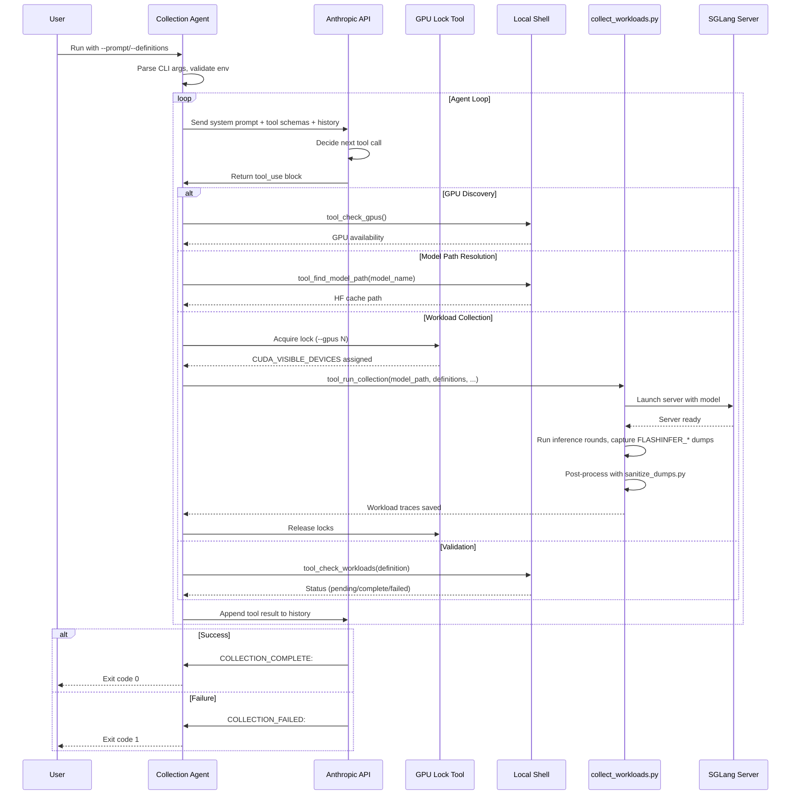
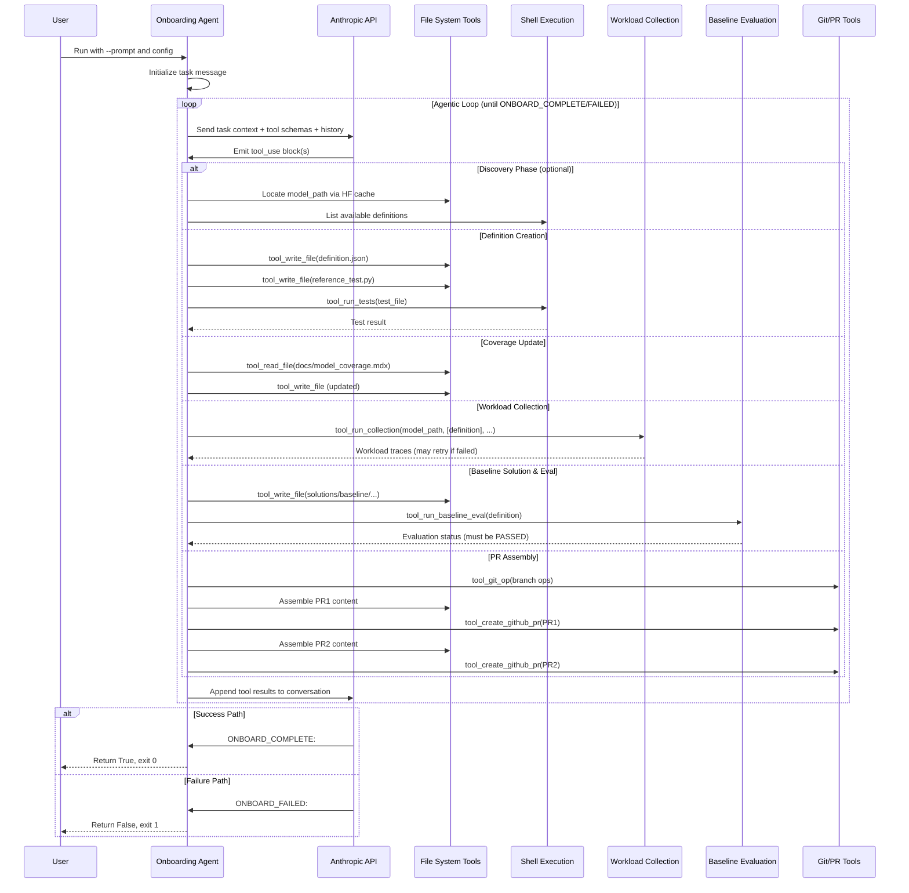

# [PR #362] feat: multi-node SGLang serving in bench_sharegpt.py

source: https://github.com/flashinfer-ai/flashinfer-bench/pull/362
state: closed | updated: 2026-04-12T03:06:10Z
labels: 

## 正文

## Summary

- Auto-detects peer nodes from SLURM allocation (`scontrol show job`) without any manual configuration
- Computes `needed_nodes = ceil(config_tp / local_gpus)` — TP=4 on a 4+4 GPU allocation stays single-node; TP=8 spans both nodes
- SSH-launches worker processes on peer nodes using the same conda env; FLASHINFER dump vars are only forwarded to rank 0 (head node)
- Config TP (`--tp-size` in `model_configs.json`) is always respected as-is and never overridden
- Falls back to `--peer-node-addr` for non-SLURM environments
- Updates `collect-workloads-bench` SKILL.md with multi-node usage docs

## Test plan

- [ ] Single-node: run with TP=4 model on 4+4 GPU SLURM allocation — verify only 1 node used
- [ ] Multi-node: run with TP=8 model on 4+4 GPU SLURM allocation — verify 2 nodes used, workers SSH-launched on peer
- [ ] `--no-multinode` flag forces single-node even with peers available
- [ ] `--peer-node-addr` manual override works without SLURM

🤖 Generated with [Claude Code](https://claude.com/claude-code)

<!-- This is an auto-generated comment: release notes by coderabbit.ai -->

## Summary by CodeRabbit

## Release Notes

* **New Features**
  * Added autonomous workload collection and model onboarding agents powered by AI.
  * Added multi-node distributed support for benchmarking workflows.
  * Added per-GPU resource locking for improved allocation management.
  * Added baseline evaluation during workload collection.
  * GPU-type aware model configuration support.

* **Documentation**
  * Added operational workflow guides for workload collection and model onboarding.
  * Added PR review checklist for contributors.
  * Updated model specifications.

* **Improvements**
  * Removed synthetic workload mode; now supports real inference datasets.
  * Enhanced prefill path detection and routing.

* **Chores**
  * Restructured model configuration for multi-GPU support.
  * Updated gitignore patterns.

<!-- end of auto-generated comment: release notes by coderabbit.ai -->

## 评论 (2)

### coderabbitai[bot] · 2026-04-12

<!-- This is an auto-generated comment: summarize by coderabbit.ai -->
<!-- walkthrough_start -->

<details>
<summary>📝 Walkthrough</summary>

## Walkthrough

The PR introduces autonomous workload collection and model onboarding agent scripts, restructures model configuration to be GPU-type-aware, removes synthetic workload generation, and adds baseline evaluation gating into the collection pipeline. It expands multi-node TP support in SGLang benchmarking and refactors the GPU locking tool to support per-GPU allocation.

## Changes

|Cohort / File(s)|Summary|
|---|---|
|**Documentation & Skills** <br> `.claude/skills/collect-workloads-bench/SKILL.md`, `.claude/skills/collect-workloads/SKILL.md`, `.claude/skills/onboard-model/SKILL.md`|New skill for real workload collection via `bench_sharegpt.py` with multi-node TP and environment variable controls; existing collect-workloads skill simplified (removed direct mode docs, detailed tables); onboard-model skill enhanced with PR review checklist and Agent TASK.md template.|
|**Model Configuration & Benchmarking** <br> `examples/sglang_bench/model_configs.json`, `examples/sglang_bench/bench_sharegpt.py`, `docs/model_coverage.mdx`|Model config restructured from flat to nested GPU-type→model mapping; `bench_sharegpt.py` now auto-detects GPU type, resolves config by GPU+model, handles multi-node TP via SSH peer workers, parses JSON string conversations, and supports deterministic-inference flags; Qwen3 model spec updated (head_dim 64→128).|
|**Workload Collection Refactor** <br> `scripts/collect_workloads.py`, `scripts/sanitize_dumps.py`|Removed direct (synthetic) mode entirely; added offline paged-prefill path, ShareGPT prompt loading, configurable memory/token limits, SGLang port flexibility; introduced baseline evaluation phase that gates completion on `PASSED` status; expanded sanitize_dumps wrapper method matching for ragged prefill (`.forward`, `.forward_return_lse`).|
|**Autonomous Agent Scripts** <br> `scripts/collect_workloads_agent.py`, `scripts/onboard_definition_agent.py`|Two new headless agents using Anthropic tool-calling: collection agent orchestrates workload gathering with GPU checks and multi-attempt retry; onboarding agent performs full definition creation, collection, baseline eval, and PR assembly workflows.|
|**Infrastructure & CLI** <br> `tools/gpu-lock`, `flashinfer_bench/cli/main.py`, `.gitignore`|GPU-lock rewritten for per-GPU lock-file pool with simultaneous multi-GPU acquisition and `--status` reporting; `run` command adds `--no-profile-baseline` flag; .gitignore extended for `flashinfer_dumps` and `sglang_*.jsonl` artifacts.|

## Sequence Diagram(s)





## Estimated code review effort

🎯 4 (Complex) | ⏱️ ~75 minutes

## Possibly related PRs

- PR `#298`: Directly extends the same `examples/sglang_bench/bench_sharegpt.py` and `model_configs.json` with GPU-type-aware config lookup and multi-node TP orchestration.
- PR `#236`: Modifies overlapping onboarding/collection surface (SKILL docs, agent infrastructure, GPU locking) with shared workflow components.
- PR `#234`: Extends the same workload-collection pipeline originally introduced there (`scripts/collect_workloads.py`, sanitization, skill docs).

## Suggested reviewers

- Ubospica
- yzh119
- xslingcn

---

> 🐰 *Hop, hop, hooray!* The workloads are racing,
> *No more synthetic traces to be facing,*
> Real GPUs multi-node aligned,
> Agents autonomous, clever and kind,
> *Benchmarks baseline-blessed, production-designed!* ✨

</details>

<!-- walkthrough_end -->


<!-- pre_merge_checks_walkthrough_start -->

<details>
<summary>🚥 Pre-merge checks | ✅ 2 | ❌ 1</summary>

### ❌ Failed checks (1 warning)

|     Check name     | Status     | Explanation                                                                           | Resolution                                                                         |
| :----------------: | :--------- | :------------------------------------------------------------------------------------ | :--------------------------------------------------------------------------------- |
| Docstring Coverage | ⚠️ Warning | Docstring coverage is 51.72% which is insufficient. The required threshold is 80.00%. | Write docstrings for the functions missing them to satisfy the coverage threshold. |

<details>
<summary>✅ Passed checks (2 passed)</summary>

|     Check name    | Status   | Explanation                                                                                                                                                                                       |
| :---------------: | :------- | :------------------------------------------------------------------------------------------------------------------------------------------------------------------------------------------------ |
| Description Check | ✅ Passed | Check skipped - CodeRabbit’s high-level summary is enabled.                                                                                                                                       |
|    Title check    | ✅ Passed | The title 'feat: multi-node SGLang serving in bench_sharegpt.py' accurately and specifically identifies the main change in the changeset, which introduces multi-node support for SGLang serving. |

</details>

<sub>✏️ Tip: You can configure your own custom pre-merge checks in the settings.</sub>

</details>

<!-- pre_merge_checks_walkthrough_end -->

<!-- finishing_touch_checkbox_start -->

<details>
<summary>✨ Finishing Touches</summary>

<details>
<summary>🧪 Generate unit tests (beta)</summary>

- [ ] <!-- {"checkboxId": "f47ac10b-58cc-4372-a567-0e02b2c3d479", "radioGroupId": "utg-output-choice-group-unknown_comment_id"} -->   Create PR with unit tests

</details>
<details open>
<summary>⚔️ Resolve merge conflicts</summary>

- [ ] <!-- {"checkboxId": "c3a5b2e1-4d7f-4a8c-b9d6-e1f2c3d4a5b6"} --> Resolve merge conflict in branch `feat/tooling-improvements`

</details>

</details>

<!-- finishing_touch_checkbox_end -->

<!-- tips_start -->

---

Thanks for using [CodeRabbit](https://coderabbit.ai?utm_source=oss&utm_medium=github&utm_campaign=flashinfer-ai/flashinfer-bench&utm_content=362)! It's free for OSS, and your support helps us grow. If you like it, consider giving us a shout-out.

<details>
<summary>❤️ Share</summary>

- [X](https://twitter.com/intent/tweet?text=I%20just%20used%20%40coderabbitai%20for%20my%20code%20review%2C%20and%20it%27s%20fantastic%21%20It%27s%20free%20for%20OSS%20and%20offers%20a%20free%20trial%20for%20the%20proprietary%20code.%20Check%20it%20out%3A&url=https%3A//coderabbit.ai)
- [Mastodon](https://mastodon.social/share?text=I%20just%20used%20%40coderabbitai%20for%20my%20code%20review%2C%20and%20it%27s%20fantastic%21%20It%27s%20free%20for%20OSS%20and%20offers%20a%20free%20trial%20for%20the%20proprietary%20code.%20Check%20it%20out%3A%20https%3A%2F%2Fcoderabbit.ai)
- [Reddit](https://www.reddit.com/submit?title=Great%20tool%20for%20code%20review%20-%20CodeRabbit&text=I%20just%20used%20CodeRabbit%20for%20my%20code%20review%2C%20and%20it%27s%20fantastic%21%20It%27s%20free%20for%20OSS%20and%20offers%20a%20free%20trial%20for%20proprietary%20code.%20Check%20it%20out%3A%20https%3A//coderabbit.ai)
- [LinkedIn](https://www.linkedin.com/sharing/share-offsite/?url=https%3A%2F%2Fcoderabbit.ai&mini=true&title=Great%20tool%20for%20code%20review%20-%20CodeRabbit&summary=I%20just%20used%20CodeRabbit%20for%20my%20code%20review%2C%20and%20it%27s%20fantastic%21%20It%27s%20free%20for%20OSS%20and%20offers%20a%20free%20trial%20for%20proprietary%20code)

</details>

<sub>Comment `@coderabbitai help` to get the list of available commands and usage tips.</sub>

<!-- tips_end -->

<!-- internal state start -->


<!-- DwQgtGAEAqAWCWBnSTIEMB26CuAXA9mAOYCmGJATmriQCaQDG+Ats2bgFyQAOFk+AIwBWJBrngA3EsgEBPRvlqU0AgfFwA6NPEgQAfACgjoCEYDEZyAAUASpETZWaCrKPR1AGxJcAZiWpczNge4mAYiiSQAMoA4gAymET2lBLwGElpkAJkDLAA+oiwziRE3Jrc8gAUtpBmAMwAbABMAJSQkAYAqoiUXLKy8LDYie0GUfjYFAyRAlQYub7+uAD0BPgeaURg8My8+FJsGLjIgEmEMM6kuFlzC5DM2lgdUbjU2Ihc+NxkkJUMFEt0SBNAAMTQaYGBABYwABGVpGAAi0j+8DK8HwGA4BigAEE8IQlDQxMgvpRIOElMgfBQWNE4p0bABZdAeDz4BjUdFYVJoSAAA0QTCONI89lg+AA7pAhII+ZAJbBvmgJNoPCovABuSA+NCsmRoBgAa0gBH5EFJFDCETAaFotAocp8+D44QwYCi9KZkDIqRpGEOxw02MgAGEWNw8NJySQ6ICKVG0MhpvAPL8MT54EQ8rhuJBlpA2RyPHlSm82oh8DArPZ4AAvTb2biYZDx5AYjzyBXff4AR2w8H+9EqJAAHmhdl4uNArABeSH8LCQgDU85iVk6LMLnIxkH+9zSyEQmy8VqUWunM4AHJA3lGBPhcLAWkGoFEogAJMBq7DzRXICXOoaZJ7NMiA9G2WAWuSETIG8DaPpEiDjpEQq0LyPoDhiAZagAYnEOIfgAkgAcjhACidi0I4uYqhQ8Dqgm/zas6ErOEo9DtvIppzMawI/IqtrQUoz7BjY0hfMSCgYBmRCTIC04/HyEA5mAR61iQcqZHyzARMWQoyYgGhCBWGB8m0ErqOKeD8FIFB0bQDbqC+kA4nayBKVaYBBCEaQRI6apJKaTpTIhx4kKekSjqIeBcs5nTcGhNBJusXhiGAAEUIabK2ogYDZL+0QANKEXEcQaMw9AWY+dzBKE8Y3khpCQLQ7KOOw24YEGBjQNIVzcGqWC/IqRobIguAtFir5hRFkC2fAGYcuIO7BVWc4LpAy6ruudIMsyupbktnXBoytXwDNc0LR1zF8Be147ptkBrhuHq7Zu7JXVVsDRB+X5oD+uSAhlQEUIZwYeeEXmnfGjrOqBNbpCe9WUtw6iRBaoNQB5FoRTadoOncmDDKK+yUPZkRA22eBHkoO1Ml11R2PetDyGkDmLVGuSJFGpDkFQNCVZZobfjTYZKBoLTmJYYasOodzSI1UYOE4LhuIqCgy1cPR0VGaQMB42CUgTGBcfg6wNpg9AtQwSZFOkUZeLaDbYLmpqPqgthcP8Eo0jQj3bYWhoNp9PCUGAT0FuyxoZl4yAW29i1ctqAWIFqtrsVkiYkBs5Deiq+tXXHo5Nhg6dMKyoi4HkQPZbQVJLHJyCVAI1C5KpdYoSTVCkAANNE8QjBciC92wzB5NSBqHQULziAwveEpQzBpEgM/LF3pD0LwJDR6Ktu0NnRAtFqOx7FI9B/QQ9yHegPPHNdkACXv8sKOXYhcssGL3mxmxat54j9ZEVtY4l3sIHVkN4ErUCjJUKIxVSrlVoL3ZwuRUZiFWImY0NAJyQKHpAd8OFrB2B8GyCUh90DAJ6LZXU2p4AjigSGToCIcTECoNwL6RC0BEBwUQdQmZwj/F7tXfAgkABSUQADyxEFB2QrlyRAz4YBqwzBgKhTANaxztH7Dc58CQkCJIdXuCltFgHnq/ZaNJmChgYTiPIAA1QiURCIACE4hkTyAiMidiQxkSiIg4BCEao+RmrEBI6RkgUFSKEhw3BuDOiuMfLwAZASZHyrkAoRR/ilHKLILq+hjDgCgGQDiPgcAEGIGQZQ/N1YBi4LwfgwgZFSBkPIJgSgqCqCctoXQYBDAmCgHAVAqBMAlMIDzCpgJVHVN3GgKUSt7guCyM0iIbS1CaE6bkvJpgDAaD1n9JQyxECgI8IgZYZdUq4HSoBGuuUUmwGWDAkqZUKpYgAESvIMBYFyhEym80gfQWZzh5D4GKZzO2iAjCuXTrycgUorZtSOFdaOkQ+TbOFiQfZhzjmnIrhczKVy8o5FufcuBFU5SPmoM1LeaQExYE+BUrkVCgZEMlHfLFr9Qn/CoThNUhRCLSTJIInKDUGx8lHOOf+xzEBEAGlmG5ywblpOKJkjQFRNIYDGv4Ip/JWWVwFbXZV8hJXSuRQogBrUAyNlEPNeAUZxRSlNJUGEbQMnLzJM6KSGYKAWP8LkO4ulvTChZlgEVY4JzSH2VKxIeRZU6SUHpdMmZDLGQxHyXuJBdhFDUg2CMrIGwxqzqpCSVqGD8i1rZMeyc5QOB9YmKsywyLVjjtQGgRxE7NyNIU3uut9YOVCU2deYBN7b13CQPsA403sEbh5BySEBAnioA5EcYAOQAzlHHDyZAGLGN0QvJeY14AMG2Hy/48wNLyMIlcBCkEaSpENryQoWdRQgToHJE0lYKA/nlJcoR9BtWJ11nudqrJ5ByAjp8BsndkhnMBM3XAPq1LSF7j0XA4hQl8jwgRd8JFyI2DyAAKjlFRXY/rfRYXYLNZw9FZ1QLZFKkgUgPBz2os1Acnb5jdrRaOPWBs0ZNsoGqxD7cTkTCOAWHY6gcF8OYMsWyR4dwAyNHIsh9A0gSHwIHVD8rCiKrKPquUwcYNwYlDGXMTYqBsBoCDDQJrP2ZSZVKLt3HkBFw2AwWWpbKDLCfWBUTfgGCyD1ihB2GBnazXovybghyYZ8D5Jp9JJQdMqqUyWiN6QNDfl/AUFIlAU3MVZJKaD8gYljQHTSUCR5QnBwFCiMoErMA8PUnkQj3BDKJbjrG3RDYmvMf+GIZ01qZC6KM98VGfNZGvqNhwgBSBjRvEm1ZuAkREXNTNROgJdUIhZBIEUVIbr7SSG+CBhSEhkBblFOHJgP4riVG0Wts69U829xekyPKmcN4xj4NOpgtlZBz2XsOkuJBayqbeDwWJvj6DsM4eNzuZMQ5klbPwD7SAGK3Yii0VjXGe1JHfTHE0RQrhofwkRUiFE8MEaYz6cjIN0BMU4ugaJGxAQ7n8Q/ISJArPnpZBWClLwUzIF7P2Qc/J0PE+w24zojIrB5BIiGek7i5RNmQ3xyd/VMD4cgEufk76MD4baCtPYXxotIQwPVkgjXqItdkAr7QdF0i9wuvuq6sl4BoRPeNsgDgmK6tjkxV0qlZBHEVDPeUgs0AjlQA5GT6hmnDUNLHIgDwxqQFGXzQEuAqDTEgKIiRcRwfoGoco0UzcejZ0innYYV8JlxxWnydhhQ0h+AoFGglu4fwwzy0Z+gIHuFXAmeoTzbwvrqua+Nu9haMyAjwQQpow6fDzbVrC81QpMdRmDuEJK6B7zWSbGBTr27PW7pnoexvORFvJyS/pAczBkBkovQv6iJX2TyyzaiLOVLFLG9N+b3YluzIoFgr+FzJVAgF4PyLFtplkqqoqHRLfIThhlhqTurhhH6OarRJRrjmkK7GrMEiMO5nwF5qDEYO8pYDiCEHShiDfpWP4koDsqNhQfwMUkXLEkzvgdgLOvuv6uIOINIEYMRBiOzpLJAIyHVn4EnjhCmJEDiIXrIOpBQEYHEFSjbEAVwEuE0GocsBCEYGRHupfOMhtv8KkCQFKFvMFJwJAHEJKAYK8s8kYBAGAEYCirsmigcimEckJi/Oct7ncrAo8rQC8m8h8jiF8inr8vYI4HMoCsCrbKQGCsGK5EIG8JUv4pgTSONnuCTHjpEIADgEnwh0+0BqbBi8VwvItggAuAQ8CwBUDlZJBxz3A0z+IuFgKUjVZXw6RMTL5IACFQBiSq7TD0D+JZFIhHhEBYBWC26ub/zlE9CmJYDBx3rigUAWaQBZF8EKA0wgoxGABkBFMdPOOkcM5FEPElaoCFkVEC0YgOUYvu1IdJ7GmiTP0WrLwOiHwIKHRGUOrKZkgBiMsLNk1C8FRjgoSKqICHyA5D1rgEpHmtqPtG2saM0W8foklv4v4BQIzkbnVuIA1k1r/vKLqIaI+DSNgEQLcpDschMDmNvtQLAIeDIhiFqP8LzuQBxBgB2PnrMNasUq8aiFcKNMUcAnemFFqilBXFXF+jlPqvYClkQHKKKqGnFBApUpfrJHQVgM7q7tMFwKhB7nQKvGmmgNEoCKZshBZlSG6iXjIqEkoEojwvQZUFOpSibodIgDlh5J8GALgLIF8C6RAPtGZL3OkafJkTwAYeiCDsgaRkcGAGgQxHKgHAwcLkTphiTjhgiBLlLgiIRDYHKBsEUTgo2naDqRsYCDRtwukMsD6LRBSjqLVE0igGxgbMKiLkmWLqmZLnkIyDiAABp5AhhiKdDETQCrrAJwGi6k6tlS4dndkOIABariMQjico5e0gzkYk3sD4kQyJtCDAMUO4rCmc7wBg7QUAVgGakQdQ0Exh6aiY7cyAUQcWa40AL2PQ9AHKooDelAp+Ie1Ud6AeCEweOorIsJFKXJaIGIiCbkGcsGsAbc6kkGtJWAccWRBJMY3oW5O5WAeaFxPwQKRC7+ZApZkQx2uC0ACkeBPAk29ARF74JF1YZFa8dAIkR5kAYkOkgZ/i6w9Azm+6ssWRYJFcvqSgUx8FSWKJaJlijCzC+pty06m625aEklrCw6o6AGRwN+o4uAqcBZ9AbRiE4+HB9FG8/wQ6apmAmeAuA4wqEAMlVGA61q0wFkPQS6BsaAClsAco12/J0Evs6+42SGZoYAG6Nl88B+Jue6B675x60wUWUyRA68Ik3RRhgEgIn+mJV0Vx8KNxkAQE7xCAxJX4dGWc9gNAI+Ag1k/wvRgIol1qH2uiwJlsHpXwBM0S5swCTYFlZZ7EIWOOq+gszsiUgI8J3JsiGO3aDYTK5KE8kgHUTmI4/U3FuArJdpPYLphoeQy6ioLpEga1BoG1bQcc6eOwi8HVz6uY2Q22zxzkIY0RxZkC+Bp5B5TFPRaofRQZTxbqWRNQM+uAAEYANQjKxClxyICJiccxyxjimcpekAZE5eHUOxJAuYjaRVHKzApe9ApxhRssn1QlMxQYTF8U/V9An1Ukzat8vJ7uV58GGcJe7+3s+phu9g6w6FjcP4rSJajNTpcqENVKywGgvNf+ccxeb+OcdGuoFeic6eBoUY5ltuSQIqMNh0GgY0rwyAM4M4kAzyVgBEUQZECIzyyKh5ug0Q6e+Fl6gItgYAM+g1oFWA0text8poDmNMPgwQoofI2qopuK36lukpRqRVLU1kLNZIfIHyOBoSYYHhicFh0pSJlYF08gkelAR4HpdZ/ITcLc+Q8GvchoW1Xg6Qj4LQ+tUA+NoR5JEYVw2exEcQqFYqoBY076YgcktxrFlVzgYlAo7NXIfIywctotHUjo1qHgtcKdm5NdkQccAZIJPY+AeQrMZQ+M1ItIDRo9dZZdKc6AWl/I2deQ3KlcfaZuudQ5Z8tACR6qnFIa/89gRYzg5G+si2zol8KGRAl1GISgaqlVdkbqu8+8Td9xyQlCooQJEhfybB0xTpPwZFStixzsvcNQ58ty3sqMIcB+u+YF69KoJ6P6NIYEYACkJlJ6e1wC5Vz1aeioFiwcuV0B+V9GWQLtuiOCjtDYiAelxaGYtCppfAWRfI2ulQBdXljA+puAcktApR/pHC68kAAwWcWOkAfE3ueeQoStkZYeqAi8iAl8uQXUowxBLkZBKplBQZNBaoej8ZTBixLBPAbBLmnBPCPBwYxEEiZE8hihjA11fhGuAA7JeBoXUHUDCFoToaES0pECGUYd6D4KYVwO+JmLAFYW8tiJso4dxuiq4WSRgJ/BQLQF5LpN4Q8vAv4TYYEcEeUqnsA8rJES41zGCieZnJAHUMWkKOnusEnMyqxIeEcRPv0ZWLqKxLICSH9D0NYKebU/KCAWPVgKHUkDUKgF8CXJsP6XcREoFI8XRG6qhDaYXuRdVLfgoMEIZU/kkqwHQPRDQKyZkLyKCWOmIHpmKZk7+juFCV2FgP4lyomLALyo3llXxoVa0/w6yCjoo2hGyOQPPqatuearqNzmnLHNGFKB9XYGJIYVKFdaIFlMvNjVfMHFxa5rgJ2pgu3JRZQEWldLbQGOwyaABAQo3HXggEevigVNXtyjS43u6RniQOjnWZjg2LbRDhITgl9soKQMsFbOAv1TgubVbZXhiCTY3GNP7XyfQNnHHuyy8EQPsgDPcKhRJNPGNitFaUvFfBXXnnXfulcCLfnIdKpNPCDiiBZmFv1CDkMhM8/GclyF+PgNjiOoLnbVZuIYXh2Li3WY01RHDEMlkTiDfDAARIVPAjAGmqrjQOi4nEw5aj4AMOyp62Oj+lK6tjXok3stAFG/Ajlgw6EoICIK/FICaOpfM8pWbXYA0xOr3HsEQP8N5uVbEmNffdQHnk9G60aA1JNsnv2OqSQHnn1dgkGdU45eeTQUgK68bZEOSaohuW+lvGcssQ4AIEUX3CEpMzYAItoFcCtGwBQD3JkVgNqjZllF7eUZkP4n7pgSUCUzuyMByD0F1IIaQRZtNeNtQaIEYz+0Cpq8wRxKwewcWuwDY2ClAPY8RI4wYAoeQEoXbG40uJeJCBoZeP4+ILoVmzTCE8YeE7ElwIyEc44LEzYfE/YVsj3rws6N4BR9o0Ed8mMqUxEfGUWbERCkkiMfR5sxZmqnfGnOs1Qk1ssDRjTuIDqMSFwLXoyxFd/s1ofcltKnhkZCZB4DlrqBiJwi7huWrKOMvMKrqop4gGTpwfMne2rMirR7x/8PrUQYEboz+1gQAv+84IB4wbNSB4jhY+B9Y9wbEXwcC040hxUyhyoU0BocCNhzsIE/oXRtaoRxE+YZYdYbYZsoAssHmnGpQqQPAiOPk0x0Uz8pUv8vMkB5x0YMXUkWrLhrhgAIpGYYDnlNB1AACsjiLkahji9XAlhVybxaD8ZIpoRZQZvGLaO49XD8jWOwfXC9Fi9XDQkIfXlQ8SabSQCABZGABQ7ckA9XkIwIAAnA0PV20KaPV3CJeKt+tw2Ft6/bt7BfV5eDCEd00GdwIqM58/DfBHV7hjEA1ziOgErpNzrrhr3PV0w84AM4yPgGRJADhDhJIg6k0NeEXJQMcL3AQNwGANeISY/S0PV3ng0bsX8ikA2EqZMFdJUPV7dL3PWjOO97hgQ/QAd5AIVDYvfBqogH1xMu1PMv9K41ZqsQ+NAVWfq8NSaAxDgqs53IO3MuplDlZ6gKAyDR+QJccbQB+0x852A65xSrQZ58B2Y6B351Y5B4F7YZAMF5EJUOldqxiGAHTmN1pFlzl2tXL/lxVCOGZF1IhxzK4yoTCBoX4wYNoTh/F/h4l6EyYcR6lxKIx1R0YLKeKuGqp7KuARkglrIEV4Uyx8++V+U1V10AqSCZn/FpAb5VnPxU62RaSVTUzlgPV5UOHA1aO/16KEBLIIT7hlMghHwGSghfDLRknOSjl589ki5Bvb2238MlunoonJUDyPyBgDevRKpIvHpoLFw+yMwBv/AI6DCQaIaCz4GzSMGyCRAKWKSpWDDnpygJoFDSOM2unNpLpB79JAmup8mhHI7KEqaPaE+BywXgiUXkF30PAvBFiQcbfnkC07AIiyWbT/kkDZBqYQspoPOC7kgQd9gy0gT8oHQH5qxW26wQMuHFV4Yguoq5JKi+U9a9RPM5iHKhbH3jjZsgw6I8IzhEymhoUZIO8sUAfLNRqAmcI9l21vhdgmIbtDEDJmmoylhQ/WAmMBkiAV0kamwd4EGQ9RJ4hQkgq+NX3NTTNoegMRUFgHICxgu8W8PjupQzyP1+QzyBbs8kgCq11aQwe4BgD1pJY+QzyJcnrS6jcdtKp0C+tClDBxBCI/Aa2kAkQGNNRQdmO+BA10TOxZOEAQKieGCpHUjO4VI9KfncpQt88TAaREwxfqMMssfAC4Oy1/h3YNspFZ2DEkWKhZeQuRelK7XNDvYcYacB0L3CnTLxD06gAdLEm9KeQSh0MPPB5FQguUfQxqQiKGkSRnx8Ql8DgqRTrBOxqi/IehIwlsT2InELiNxB4kIheIog7lACh4CAqmg+Qq/F3OvzUYH9NEOzI4MqwMEfFIw1A2tvQHqgXYRMNaN2iQBTDDhwmDSM3DmDzARwiwJYCMHImU5rM8iQGAsH9F/CGl3sV7YCKVnlhRgIMb4d8FZnfAaowktkCEYLxpxQ5igF5HATM3TiVYIAGAVsBoRxg8RyR06c5Pq1xj2g9MNwkoTNFQAJC6AVmbwYwCCxoCumRyKgjumUS+woIQMOEU/jAiIisAhQPAC1AlBHQde37PXlQQXzudjGQHUxpUjdQRh/OFvfrFbxwj/Qr447fmLJ0uB5B3eSpSoO7zb5cA66vDM4HyBNFmj40RAC0e/ytFI1e4pYbMJ6W8BI1eGWkFPjHDT6RoM+BKBVFn0gLBg9R8wK+GnDoCycTElcT0W3x4a6A9ASNVVPyADFhpDUwYglHKlDFaZwxumSMfqMTixi3GoJbdGIGzDcBHuJAFMd0kgBiJrauoAANqYEAAuhmODSj0JUUpZvL+HzEZZCxFfYsVACjEzF167EY0bogKD6xPUeQC0HkFbANi0xChMaK2OgDOwvArYuuohnTwdiuxKdHsaGj7Hp88x5fJVCqhLHRiyxWlGcZXBm7xgZ6tY4KIuPeyVAlxqIa0enjaCNi663YrMWeNzGDjLx2fPkDeMnHljZO6WVJEuOFEUBKgvNcWKmLCICACCGgKwLSlMjHigJQY9IAONyBDjUkI4q8Vbh+D+C1RgIRUB4HprBwjS5mROhy1GqoYlx4oMaMPHf6K5YAiGAoXkEHi9wZuqIX7GNEXFg5X0LwYsK2F7jPieIvcIYXkBGESxxxpYncNBP5AmjlQqoBiKaN0iIBKgSY70T+IoB/i1xy8XcQeMAnn1AxOYgiSGOHFxYyJEElSbeJ3CGi4x/IGuLpNjQf8DIq45jFc1wnWTsx/Y+ySRMcngSKJzKaOCaX4DWRwBm2UsibgqwwCzIkEg0aXwrFeS9guwY4GPHMRhiK+lQTEIG1MnmFzJddI8f6OCnAS7JF4gsRFMr7FTmUpmcCFJE0GJxFBxrdIP+BuFGD2IEsbRsIRNyiErg4hUAlIV1AyFKAoXAPsoQ1x1B3GUXC2u11i64c1iwTaPslzj5RNiSifOwsnxqn4SZUeYx0UgMTQmRc+JBErqxzCJlMOO11aDsxXhrEMHiZ+clHyAADeHfZcchC4DfS8C5aDhMgAAC+kAEGXKC6np5sADdL3KHmjCn1+Q30wyV8H+k/TlEbANGYDPr4gzcZcoe4M1TtwM0MRZIevniPCAzJq+YgArFkFF4XDZ+tRXSM5A5G8hseVDQqnyA96HMjglaA6paSBrwA1A//NWP4KegnBx+kORHAnhNy1gC45CbVqEmmCLEHgJoDPJsDAD/A1QlSMmb7gfBFV6OymJ5mrCVLOQyIs1C2ICDaz7YQYmvEtHxNJIK4yQOXLgCkUUAwz5IVgOtJ7IRANp+SdoETkXmP6FJyy6QKlAWhTYcFah9BFaErMZLqwhZP7YcBoCfq9wkQ8NKIDGGNASA6g0mOoBoBnycdmJSTT7F/FCT18NgQEKZAuiXQ7UxmR9aRrD3h7a5eYGcdtMAhWgCAQQwILUGnO4AZySAWcvOTPgplFzDYJQi+iPGdCyBPM0PTYEK33zJC1GGsrOKEXr4dyu58VBHm6ia7fA6g4FdOOPNALCcwR2A6MqpRvAA4+Anc4EHxCTkpz+QPYZrnUAtodcBANoNQm/OazLdvSBlb0jQWtBfzIQf+YOPXyrRfRXh5oSbDBQ0iuCrKyOGyijFEBGFOiTleSi2yko5YFQEhfgP33pneiIIrJBkirN5CDh3ZZPK7Oznvl8hH5ZAZ+W13a5vy0AH86KrAC7nLBYAMIG+dl3gB1Ab5I4TeVdSALA8SarrWEoUhvrYA7w8gVvt6KE4M5HcVGDvo3HXzqh5AcnV5hFWirXzgQ7CthRwpvmzR3Ih7bLHfEXi8LgQ/CvPLaBPqVJqRdEUqpUgYn75Y4DAbIVjkWqUKNAWPHHpTXLF3wjGpAPgOPzPnHARIjnEgrrzGz69DGHnMBqqO84m9fOmo83i2kt4wd+CPwRQZTxVKX1SGvIBAVqHCDG9+YA+fzkEwC6yDN4PQK4X72cYIDIuTQDDmAF8ZrTI+m0xFmExS67SYm6XJPgYGpYKdZUeseANlweD6orpnyfPqEUL4PTKm4KDelClCay4ghks8GIQD2CIonyQtGBZUCQzuQNlEhKNFzXIAzgcIELDSHPC3h/QfI//SsHyGgDvpT0d8fxFwzbxVILYILLXD+B4aOhVJhglqYmDal8gDlXgI5dTXICqpDhjiAlArzDBIDFyYWYFTSERRgrtlM4S4E2kQkCT1aIKs3ILVLzPIDEjyguqmmUTsEOq8CpgSCvAzFJ/ERlD8m7niR20PoX3B2IsyDKtsrgQHfxDcgV6oVooMY+Ac6HBJIcbYKLMasQgvkIDteTneUVEsVFudDecSrzpUPVFgcUlXBHUXYwyXNSze+6csgksqQW946yon9kZiYgxpNeWoQuXiMvxMlxsyynEXCiuAWQZaSWHfAsMWVShslCKAerQDCX+9kO68FQkd2i6tLFSCXDpbH0WIkcyOzAfaZshArHB3CZyD2te3FIVAJlzHEImV3CIApZloKK3ixV/rIkW0TEXipc1wDlEoS2zRAL+T/D4sEejLd5mSBxBWAghaQVej8BLZJBPgXor4CcGUa5RKyPqxEgowlqYFc4vdREjmudCqQ2CBBDaVJDrowzES+1BfJWvsAYk6wV0Pcj0E3lmyX+gIF5jyiPSjzwoiuATsnmKYIo3UtNA0nwDbWER9Gx8uoayQ5BlAX0NgMRnQA54hha5AAdRYSG5AAmATuQNAwUViBkx+WuCINLENiHkAZKTAduRyesbw3Mzigh62nHqff2RTcMC6K5RKplENJGVXCA6KkjzmErj1ySmwLEI9RemS0N4FFErJSlZBO8WSJqhfjuGDjyY48QnY2DgKHT3r6a0tX7pEGoqkUChmzHiTwH1g0kjSvsBMYnH1zMbB0rhH4MJtDiDci0p/Ayixu3i41DaLMmFgwVwrC00KV8bifyEQ0/gCg/YnCqXkXEUVFxpG1kDBpU39o1NYCR5lqgjB5AHN36EsAIEgBpjgQcA7SraEXbhNS8UZXKNEJdY7glAhI9aF2FwUkKf1tAOgaxo8DpRgNZIaZq2zIxxxUtYvBgBGFM01x/8/qBiFrziIb0fViiyeS4FWBqZvgDTEUA9SM0b0PII8MAOPBmKWtOQDAStBUNiRJYo5GzHrWHndIPhdQM2oCGqhlLP8LBym8xJmOW1oA7NqnQePrSYocjtIaafKZNQxBTwhtynbSGHmzCzbiwBABbc6Vk2OAhZGQI4AqpM0Ob38e9TJl5tFCbtF1+Fd/EhmdiEaKqmWhARVvfz/yaYuqa9aVy5B0autr/beoFtIllAXN4YY4DBtNCVaeB/wPgTlJqzag1tvIU7FnnESV1qEXgXuO+CJKlkiAZyzPHbwEF7L2WZpetR1hYZH8jQhmhKiDteohkJgbYaLRDtEDWgDMioegLOr4A0YOCoNX7fCO8xJq8c5KbXO5H+3Asc1aGuUBBkQAuZERxSGuCRvR2NwPVgIZfqzLjak6JEFOldugFUwu4XINgGIO2S7KiZcym8mroCFr5SbYJ4CwhjQKTxnVlQzxeHa+Ck2qqqtI8hraAWX4eRbJWwVVe5TdR8hgkOIYiE7qsBiIbAg5U/gJBCBfReNxyAXL1EgAMg4gsEAZts1VXc7ogUmtebtgXmH4OCEVT8uPQy38rtyMY3Wd6ryEnzuNCAH1N9vlB5bEJimcmTGHYjV79tEAFwj4oKHpRnAQQbgMpxN0PFCSxJdbRLS22Rodtv7NWHgUn3dabNO3OPTPTSEnokJvNYeJdtu0e5/NtkMmDOGQm8NucBlQTepo5BYBgomeC7SOCu13aZwMIG/vw0/W04ONb+pohbmr1mzi46ce9o70+0/BeKIummGLqXRSsRQpRU/p9v03qbCS5CAGFRFxwO16yNMAJWSDF1CZ5gkwSKs0n3I/BuRQIdrg0FP7WLEiyVZhruGEz9Ftxy5OrZChM34q8K8tROHuoY5MVeUQbMhV8p26CHyAikvOJjrfQfp1F9eI9IRK+ja4t+WzazrIZgUVh9YY6z4NPMvYS1M8pdKmHnkM5XA/cshSsPNDITyAzWYtHcErUEbIBUAPlPkJrTfA61dthtcGuCrLzTq/0TmMlV4C7wmrqyIQL8l9HXR5wtlpeckRDDNYJGqUDnWVeQUE7RLTVyq4peY2SUcFtRtjTGEmsxTClqx3uYsXto3rO1XJJU15TIeOVm4zWdvLeGPF5ZcBeSrYqwFSQ7FY9WWs3CgFwB6P51UJNvCCdUfTg0T6atRmYioM5m3gzO32zLOEkoAX7xYLpPIIsac3rwXN2WgoMw3yLrGSV1m7YwZT2Pbxjjmx+4L/oICSS/9t+hbopI238TT2+kp/Zse1xb6CJ72uQ59ouOuErjrQpHbaEKmZI0duU947zQLoG0oAsPByB021B/KawIxV4P8Fk5H7vjWYPNOseHiHb+tk8Vw/ul8DZQrgAAH2t4ZK1aNvVNC8ZP2DxOjFUg8ZAApM287BlJ8gGVPGOwmhCigW2bMavjDEBRjdazV8ZP2/G8V6dOgLif4EvAkMTmx8MZJZMcnIg1J/gnidHgEmuQp2meCSaETkmVT7Jm3lyf4ITHDa8J/k8iaFNomfRnMsU/2Ob3n7kJV+2461rVR37SYenF2SJlZNUmVTJpiFcGEdXXZT2rUtllOPWaF6FmELY8fuAwA/KQ9z05usAwEBV4S48YytWadxAb0Jt+jAUFKXxkRA4hXkNNH1pW2O8iTw21ofEI22qQpSNoN4z0JSO6GkjhAZs00Z6Fx6uhixCCQhzqWB8Nc7XdxjouaXtdVpYfAJhGqj5RqiOMa3BNEwTXUdSjKakUt7n4k3xxljHPPhrrY75rKuj0+ZenEokWb/mLREtOcRXMVGbmZnSbPsUSxMqAw5sLnraBjh5l8Q4QHSCDmh13MEKEbOCKEikIEkwMDAMDa+nWA1yc0AF9tZ8sV16swuh8lCPtBRxrAjk4DGiaKDTMvkfwvMXuKQKtbIAY9xwhyC5TOE5ZDkDYQznulQxx60skIkiQUJyy8kg4NzcXo6R1Zrb/EAys9aYamzgkp5vcA6BT1rn0BqdsVTYPTsiDj9EAyiZrOKD6hUk+WseZi57UEjOApOE8Y5DxbzKENsLwqZc+7UqOJZPoZzC1K5kRNDDiMmEf0OwDPS94KC0MySD+XVQWJ8dVwQak9vzzfV1lQzf6pKC4BDIJtonJAPy3mSiG0i0gYgZJaQALC3+Pk7iS6TguRnwt78aLDmByxOgO8NM/JeUcs1DNtmBei4VpJTAqAUw0ef0j+GSgR1UGGA0VqwKhhJBdUqwVlkVWVp54GS2sCCNCRTAvoGDU2xdLxkhPGoFs18MjCgNzDlUAQe8Wg3qCDKAXKiwFlyO2piNgWft6rRME23l1AqULWxnoHKFnSRxay06RXMgluVBlshrbGJLM1CQk6UL2ls+AaRLiUEmmrbGsq3ONCYFXtGgxOldEuwpgH+dSdzGpRCpUJrTqFu0r2VKhkQQw0AQiBIh7JiJJcLiaAGRA4Ba7osENlxNDdhvEQ8gOEIIi4gRCo22gbqO9NjykgOQr47IbcpZhcgBCgh7AFwDEknV2k4zwCsdD7lkiks74rl+edaQ5rj9uJM8qgOXFGhSY+wmAVKodFGUjhhFcbZNeYN5DYqarE7blivSpg/ByUDsJPFjHoEQlfO9pPm7In5p+6HhlllAmRmjKKK+Qqe6AO+BsBiJ21IYPIE+ryCFQyIAATRyyXpW8WRtWLeflaoVxMy11w9aw2x8QXDMMsrL5xhDrQdQ3V/4DKoiVyr6C2RpVWNniWqr8jljQo6kq1XZmjzoTAoxBxPOKLFdDNz0vgEwKyd9LOVtNVcnXPsAqjhtYiKEwFNw7+QcZmDZUEdXl2JYTFFu1KDbsYhZOXx/28cdQn3h1gGQiNrDD/AS1Dofd5u6ExQs/FxAGwZOkPbVTw6mKdp75QwCeTuiTQOwEgOSW9NXA1aDQYEGVLZgQkDaO97a2KfQtpgnA6Zw+zhxPt4BMsqEFQZOrVpwgr7qEgCXfcNp8htrvGwEW8H8lAP2g9902MWEORYmoH6eM07A/WCYmfzLouK1SWMmXLDbFBRkxuMqm9wuLjebMAMbBI4OTQ3AM++ycvC9xxbLaWWZlTrrKm2Tap8gKmmoeBt2TMIWk5voZOiZCHzJ30znHYfhn/xyD4B5jG2u8lGsDpSM5UBIeUAyHktQY5Q77CUAc+SNdk68jKnQOYH0juB+0ZLjeSs4Cp2AJg7McYyfRNowB5I5gcgOwHseOu17UUfyc1DPFtR4fcSvMPfxdjh0FI/5BHX06V29YMVL+mH3O1VMLgDfb0eSP87cYUJjGmCDhQvA1DcdRLc62YwbA9aMRHkHttiJByPJvkL2WIjLCyIxEGxFmf5DQAxEYiOIDsOKdRB3bUQZG4yDyC2AEbVgIp32bC71KNcDQGEF400ITmI+U59pUl06U7SFzvSg6QYGXMfwhEGTOR3g527+3Nz6XbczetzX3T9zcygwMZv8EPxXz1gWQI+BcNnmqsCJVJuk1oArOJeJ29Z/efGGQdQkQybRB+YF0Lhbn5sCNts0WMuRA8NIFGMWhQsQWmB4T8QJWzmvAuOCUQBEIVF87NiyAzHVRIrkFkTSlry/Sp4RAzJA8W1kVcTWwXO6VgNd42qYHPdTyo5h8nzCgOQAAbyPKbaTJZ1jhgtnm4LCYZIFytpVwOkTdRmVuhfb3oViH2CjlJloQY0BxOy8KnfgnWqSW/UVmlAYaGgbJ5ZYtKPRk2zOfF6ooHerkAIhYs/nqh55655eZ1TXndMvcXQ1OvNaJwY9SjpvDch9te3WWywaHZRebSZ5lba64BDUD+BLBlNbqe8NVBiDqBqdwWuOKJdp0SXZTgguRBzmKK8jz10LNF/8AMFHhK2da5y8GXR3AUUQHl0Q2EJFDNMJQHwFsQA2CudwfsjADlJTeKQ+POpZOpLPSsJdVsOJCgPLhuRRzuScE35nKyDUFg9ZK3m2c6s6BwRWv9D6Fat/67UnAInDTuTkETMbRijmA5KvdjPntaxxDg0jWwDHYbYvCfASxM1uRTFGGRmKv1tgBHG4TFpSqKYLDVLwORywwIg7BbnTbVuY9z2D/OlPRmmuoX/EpUZkMHH8QoXclepHBDq8jD85/dSROBzgj8B0AnrooF6yEH1D9sPrZ1iQd9cMOXZQhruoO4a4Gs1ZLD4eEQYLCrRlZlgcd+cTMFezrR/E4/NNOoEsF8gJEjiMRDiBsAIh4biNsiMjdRv62WPbHjj7jfxs60+PoNwgp+0iUp3XtMSlUSqp84ajs7EHXO8Uan4F3jCJd2ui0WrsXnFnCG+t4843OJZipSTt2aAXLtM2RMMezu7wzXT2G8gv0tgA57sFq1nkDnuMw5+eRE3mZG9fwWzLSeFVN77hoNAs+Zf6fGX2pp51bkTO734z+9txnuKPtsBT73Di+8CHkkSgEv6eVh36eNOoSb71TzmT4GYC4BKgSHswrE/8eFeH7tm+9G5swuUP375JL+y/R/siY/7IIOJwE9QfFgxX7RrwJ+Owe+iqvxT7axK7NyIpBvipw+3u7MK2OJH3Xxx0Y9keIp9JfFXrC4EoeXq+MSp1z7hmeRdfqvRjpRHc/d7cTLHUkiJ/N7TH6PDHaDnvP5u4CVB1XHUSh0DAXZKmRHqp/0yN56+YmkoGOgH/15sd+OFvR3tB18YwdnehviXgz1vcEe4ALJFAPo6P1UOkPPHFDt+1w9/uQBeHkABh5LfbssOvvRp9U96Gx/tfcffDqgK8c4QEPEflUnL6I5+9g/RvRjr47ofkO6hWjqzyh/a5UfTAvH139MWz7Qd+vIEJYSyGwRc2VAuCk4Q+0zC0eJfZgplWAJQ8Fq7f1acZg7796W9i+a3ZuWAD4Bl/tsZ6WXigFj08Ag+Lfub4GsPYV83A1fh997/8Gt+HfRfekZx97jccaKPH5DgcJQ7h/GT3fO94J1BVCephrHlDqJ8cBicmsQ/ID0ezfB99o/lHGPgP4fZuP8SlckJs+/JNRSmOPAW33W598NNiPcHDzkqcT7L8qnOJWD6b9X7Ye1/0ZV37LyT/L/3xjfpvl3KX6b80mqHND9v834J87rfHfAIf/3/ho0O/7iCFGKiq2Oole/uX/gmVMnuadinNnsY6acELDT5oxe8aZIWkKyFZpQajyWh0hDDOYuozuLuM+HQzmulMzuJnM+XMpV24pnDZwEWulTKdn7HPZ4WqA100ocDsjeYXWG1RuqbWBF6O8pSJvYEwUFA2AjyjtJEBOsWRAZTlEmmkEq6ImGqe68o4WJtbbUrIIpxe2jxANDukHuG6hpA5bJKyzMleI9KE6i9HRCxUhLKWxgGPmnSoi6GTICAwB1jv6hD0lWBoCaGv7AwGBKQcDcKywhSP+Ch4AmkBx4abeK0JwaFAFBq0AOWEnryBigYhoxCdLtvS7WHOCF7bqWJBbhEBSKBmD8SKMHx4qsTVCjChILIs/yFIHkqwFqw6AcAKYa5IMhDE0ieFYLfqjAbQB60WPHvpnmBMjfhqw4thsCImccD+DBBtsglKHCqgWxBd0yKJBoIaSGpoGoa7lAeA0AgkNIH8BbeOywe4kwA2BKuzsIeCR24+iyj7QJ2O6ziMNaOc4DMGGooAuBbAKe7DWjgarhYA63gQChWNuPkHusTerBCZSNYIvBGMHYC7LWGzKD0BIIf4EJzkUmbPyDKoA0DBpdYK0JgA/uIzPgADMXAa4HiBy1jIGmQcgQkEZMygdFgxByzkkEoau1jJJ6ydONsHGo0sFzZ4i7kp0yz467JuQwGgMMPphE4TDQhcuidjozJ2WRjJ45G6dvJ6JKinlqIqeT0mya6qVEplpF2fLpOK7YAgkjSrqL6NaaCMrbPKDq8lqh0wBq/ZvNJLgQzphzhqehNOaTO0amYTdKi5kYC3WywKWB9shoFmo3SBfHmoVcURPs5PUjGkGTVEoBFKiCAVCEEA0AMtnGR2kqwLsAUe7jsyw3IxABGBpYkcMbYcQZbssSsQ6gKUT7IkkuFAN4lYCHblBV7sta8ghuGHD+wkcKDjrAmpAb7lB/bKt53w3qF9DhwrMKOCKQwodwCihvvuKEEokodgBgAn0vAAgy0oUaB+k6AAwC1s7kE9BRAeQHBw60vhv8J8aR4L/CYAH9jrpVutRA8CMkRigGFesdzqWDOk3dAaAPCY8LXC8ykCOyLdaV/ECLW81uDbJvOfusmb+UioXraB6O2HwCQcmspPxjC/8BML+UmoUAYjYWAkBZEk4CmAhPQOHu2xVCOEDk5kQywHEBiIIYG7YIg2FGW6skhQJKBZoocDaHSQ+APIhiIF7CwBOCZ9AKp6uQ+qjAkgy4dtDqh1upOgaA6obKFcu7kEsLWIdiA4jOIriO4ieI3iEAb+I+0O9CVIK4WzBQIVeKpDw0sSgxQ6Bkhi9QBwy8lraEUYWOcwS041tXyZw/EmAhkQnZIRCDkTbHJr+ho6EnSJw7VtPJNe1kGNYjM3wD5T/mstCSKEANYcahmyu4czjH25JPfCMCXLHqQHgNDHEgtgzKHTSM4Z8Ae5Oyp0PqFaIeWAnAzu9ADeEUoqQJniAqvCAGDfBX7Jkb6Mf7Gnb0EGdgp7qqOdpqqqeHukJGBCgbJQDScd9KlYwe1IRGC0hfIImYciE2v5QZhkAMADEQegO5RWk1ymYR8ggBovZQAgiihz+UuEXrZ2RtUHQEWIfIJfZha42HyBLSN8u5QjyiwamHtUstMRBygA4c5GhgrjP5Q6u7pDRF4ABGFcreRL7o5GXgIUYFGNAIUXniPsFAJvAO8NtIxGCcfIHxBq01lOEbVOU+oNpuGe1lthB6bqFjp/YeoeHBxkrhrpGbgRoWdjrgYKPRpVhZkR5DkRPJupGasFcICC/ENulEjh69ooZFxkrYsWEg4xEB2JdIlkfF5pirYoPDISXYjv4iE+/tgqTSHYMf69Oc0hFwa4MIJCBNKR3OObh8N/kSETOMfLOZkhj/pRzrIvSDwHxkRiDuZVI7AJ7DTId0uxwgYQTMsgdIOgLkifRfeJXAu4ZnARx0Ap2lUIfR+SECB1AJ3HUC0ATQO4wNAJADCCeM7jJ3JHcwIFdG+MwIGgBoxJAGOY+Al4JeDuMkIO4ztcr3L4xdIhgAYBQxW4eoBm+cMVtIIx4ipDEoxm8KaKUApAGtSx4ZnJAxXA6yJ9IG0zyEgC2AjiAHB0ANwewBYSp9F57QkqGt3AyxSAGIj36LuK/TqxAFD0Bax7QM8iAIfMkQBhgHbhIZ8YuoM8CQI6sdLEOO1gmKHKOQyhsCjKaQPqiOxwDqbF3GuoBOJOk6sU0AmxDjurRBeAGpZAIg7IN1KcI6sX4wOOIMqHGmxeEifphSGdI1Lex/0r7Hq0/sR4CBxsiPHEhxOcdYJ/KiAJHGPg0cdbAWxiAPHExciccnHq0Ndh4QuOOUA3Z3msgD7FhxucddoFxFBPHG8OJcRHFRxMcTXHqxkIMA5JxwDs8ihetzvc5sWhno3YVAXcWHHPIecX3Fqo8ce4yNxpscPGVxo8TLS1xXAAnEwOU8c7Ev+egWbjYkWcZABOxq8evFlxwcTvHhxZcRXGwAVcbHFHxQIJPGNxM8ReYGW5rsvHZx3cWvG9xj8cfGQgz8aXH8ub8R/Fjxx8U0CTxBtGfHq0QTN+rtIuAEBrrkYxO4ALUJAIbHnKocTPFWQg9ArGRwtgAQmaxMsQ5C0ANgD+BVxzwIfHIsRoOrHQyo7NQku4dCRgC4JXgMwmGgrCY8pEJNCVwlDELRFyB8JlCcbEyxirHQDPqDgNICMJ6sa8hEJO9HwliQDgMh7qxrYsA53xzsbxrEQyEEomiJdvlgASJUCZqECJkilAnOYmAB1BKJfCSAiogXwPQAuREQOgkrIoFhQzsyP2kyEswoRjVoaAhKiXF5oSiVBrJSRAEEkgJfWKWS6gfCQYlsASiRKxcgNhA3E6JJcfomGJXAM8g8JKELHiRJq8RYlcAbCdYmzUA0HYlZJw1nL6RAAAOR+AAQKjj1QXuuEiOQWAGBJZI1Sf6HU2kCKyRxw2mpdDgienC2gT4gQZJYqyLvEbK5JlTLoifc+6F9CuyF/MgBMi9ULNFjaK0E0mLMgSVAkhJWSWEmbA+Sc7GDuSAnJCSJ7CVEkMBaQLEmx48SfglZJVSSkmnxjcbokwOzyBkkJJWSXAluqVsQKz4J5ifhYnJJSS0HlJ6tB8kU8nvJECoAjMRoBLSAAKQjMsyVVoHg2AB8GuYjdtZiq2yFAuGD0VWtlEaAN8tCmbJJcUQIGGySVklAaiDObGHxzyoohlxdwNFZiaFiKaBIQ4gIgCps6Hh2544rbOKCD0BKSAnbJ6tLsnpA+yc8nRJFyR4BxJmSerQUpygvcntAIMgbR9G0iYmC4AtgMYlDUGIEolHcl4CQCQgzQE0C0AnCiQCXgAgDqmNA4TE0A+AR3GgA0xDAMTG0ADAO1w6gPgMCAkAzcCdypmtAHUDoctAO4zuMDAO4w+MtMUdz0xPgAwCQgDAE0A/JiqWNC2AOSUolDmPgO4xvcTqfanEx6HEdw+pDCmgDtcwIImnHctoE0DTA2QAIA+AMIDCB1MGMc3DuMMIAIAncTQEGn0x7jD4CQgtAJfZvcBoN4EGAcqWzECx/wELGnsZuAXqKSwCPzEQAwyE5q3gOpmbgSxLMUYCfSzyDvQ9Gt4LQA4guAAixJcSsRzG4AYYJdheewIF2mfR2iOOk9Ak6UOkuJ3SEAA=== -->

<!-- internal state end -->

### yyihuang · 2026-04-12

Superseded by a clean branch based on upstream/main.

## Review (2)

### gemini-code-assist[bot] · 2026-04-12 · COMMENTED

## Code Review

This pull request introduces significant enhancements to the workload collection pipeline, including multi-node support for tensor parallelism, automated onboarding agents for kernel definitions, and improved handling of ragged prefill workloads. Feedback focuses on fixing invalid Bash substitution syntax in the GPU locking utility, addressing potential command injection vulnerabilities in the new agent scripts by using proper shell escaping, and refining argument parsing and redundant imports across the collection scripts.

### coderabbitai[bot] · 2026-04-12 · COMMENTED

**Actionable comments posted: 17**

<details>
<summary>🤖 Prompt for all review comments with AI agents</summary>

```
Verify each finding against the current code and only fix it if needed.

Inline comments:
In @.claude/skills/collect-workloads-bench/SKILL.md:
- Around line 134-141: The guidance in SKILL.md about FLASHINFER_DUMP_INCLUDE
still only mentions paged wrappers and forcing capture of plan* + run*, but
sanitize_dumps.py now also pairs ragged wrappers via .forward() and
.forward_return_lse(); update the section to say that for ragged collections you
must include the forward* and forward_return_lse* patterns (or the specific
wrapper names that expose those methods) so the sanitizer can pair dumps, and
note that if you only capture run*/forward* without plan* you must pass
--skip-const-axis-check to sanitize_dumps.py; reference FLASHINFER_DUMP_INCLUDE,
sanitize_dumps.py, .forward(), .forward_return_lse(), plan*, run*, and the
--skip-const-axis-check flag in the new text.
- Around line 59-78: Update the documentation in
.claude/skills/collect-workloads-bench/SKILL.md (and the similar block at lines
104-120) to clarify that the tools/gpu-lock --gpus <N> argument is a
local-per-node GPU request, not a global total across a TP/multi-node
allocation; mention the launcher uses needed_nodes = ceil(config_tp /
local_gpus) and give the concrete example that on a 4+4 allocation with
--tp-size 8 the head node should request 4 local GPUs (not 8) so the head can
lock its local GPUs and let bench_sharegpt.py launch peers over SSH, and update
the sample invocation comments/flags accordingly to avoid readers requesting the
global TP size per-node.

In @.claude/skills/onboard-model/SKILL.md:
- Around line 657-733: The checklist and TASK.md template conflict on test and
solution paths (one requires flashinfer_trace/tests/references/test_{name}.py
and solutions/baseline/{op_type}/{name}/flashinfer_wrapper_*.json while the
Phase 4 steps require tests/test_{op_type}_{definition_name}.py and
solutions/{op_type}/{definition_name}.py); pick the canonical layout and make
both sections consistent: either (A) adopt the new convention — update the Phase
4 steps, examples, and any references to use
flashinfer_trace/tests/references/test_{name}.py and
solutions/baseline/{op_type}/{name}/flashinfer_wrapper_*.json everywhere
(including the "PR 1 — GitHub flashinfer-bench", "PR 2 — HuggingFace
flashinfer-trace", and "Agent TASK.md Template" blocks), or (B) revert the
checklist/template to the Phase 4 concrete filenames — replace
flashinfer_trace/... entries with tests/test_{op_type}_{definition_name}.py and
solutions/{op_type}/{definition_name}.py throughout; ensure the chosen naming is
used consistently in the PR 1/PR 2 lists, Agent TASK.md Template, and examples
so an agent can satisfy the workflow unambiguously.

In `@docs/model_coverage.mdx`:
- Line 447: The Qwen3 235B A22B section has inconsistent dimensional references
(head_dim=128 vs head_dim=64 and hidden=8192 vs h4096/k4096); pick a single
canonical basis (either global model dims or per-rank dims) and update all
mentions to match that basis (e.g., if using global dims: head_dim=128,
hidden=8192, remove h4096/k4096; if using per-rank dims, convert hidden/head_dim
accordingly). Clearly label any remaining alternate values as "global dims" vs
"per-rank (per-device) dims" and annotate TP/EP implications (e.g., effective
per-device TP for attention = TP=4 shown as kv=1 per device) so readers can see
which numbers are global and which are sharded.

In `@examples/sglang_bench/bench_sharegpt.py`:
- Around line 71-98: The detect_gpu_type function should fail fast instead of
returning the silent default "b200": when neither nvidia-smi nor rocm-smi yield
a matching entry from _GPU_NAME_MAP, raise a descriptive exception (e.g.,
RuntimeError) that includes context about attempted probes (mention
nvidia-smi/rocm-smi) and the raw outputs if available, so callers know detection
failed and can fix the environment or mapping; update any callers if they expect
a string to handle the raised error accordingly.
- Around line 555-570: The check that raises RuntimeError when there aren't
enough peer nodes should be skipped when args.no_multinode is true; currently
args.no_multinode only controls computing available_peers but the final guard
still runs. Modify the logic around needed_nodes/peers/nnodes so that the
insufficient-peer guard (the RuntimeError using effective_tp and local_gpus)
only executes if not args.no_multinode (or change need_multinode to factor
args.no_multinode) and ensure peers/nnodes are computed consistently (inspect
variables available_peers, peers, needed_nodes, need_multinode) so
--no-multinode forces a single-node launch instead of aborting.

In `@examples/sglang_bench/model_configs.json`:
- Around line 2-229: The new GPU-keyed model_configs.json lacks entries for GPU
IDs that bench_sharegpt.detect_gpu_type() can return (e.g., a100, mi355x,
mi325x), causing get_model_config() to raise; fix by either adding explicit
config entries for those GPU keys (reuse appropriate existing configs such as
h100 or mi300x where applicable) or update get_model_config() to implement a
clear fallback mapping (map unknown GPU IDs -> a default key like "h100" or
"mi300x" or try nearest equivalent) so missing keys do not cause failures before
server launch.

In `@scripts/collect_workloads_agent.py`:
- Around line 75-83: The tool function tool_run_shell (which calls _run) grants
unrestricted shell execution and must be locked down for unattended CI use;
replace or restrict it by rejecting/whitelisting commands and inputs (e.g.,
implement a command whitelist or pattern validation, disallow dangerous verbs
like rm/ssh/git/push/network ops, and refuse commands containing redirects or
shell metacharacters) or remove the tool entirely in CI mode; ensure the
function validates the incoming command string and returns a safe error if the
command is not allowed, and centralize this check where tool_run_shell and any
sibling function (the other run_shell usage around lines 272-288) call _run so
no path can execute arbitrary repo-root operations.
- Around line 58-63: The shell-interpolated command in tool_run_collection (and
callers using model_path, definitions, flashinfer_trace_dir) is unsafe; change
to build an argv list instead of a single shell string and invoke subprocess.run
with shell=False. Update _run to accept either a List[str] or str (or add a new
helper) and when given a list call subprocess.run(cmd_list, shell=False,
capture_output=True, text=True, timeout=timeout, cwd=str(REPO_ROOT)); construct
the argv in tool_run_collection as ["python", "-m", "module", "--model-path",
model_path, "--definitions", definitions, "--trace-dir", flashinfer_trace_dir,
...] so paths with spaces/metacharacters are passed safely. Keep tool_run_shell
as the only place that uses shell=True for true shell features.

In `@scripts/collect_workloads.py`:
- Around line 628-635: Detect when both
_uses_paged_prefill_specifically(def_files) and _uses_ragged_prefill(def_files)
are true and fail fast instead of combining flags: inside the block that sets
force_prefill_server/force_paged_prefill/force_ragged_prefill, add a check for
force_paged_prefill && force_ragged_prefill and raise/print a clear error and
exit (or return) instructing the user to run paged and ragged prefill
definitions in separate runs; do not concatenate both
"--enable-deterministic-inference" and "--disable-piecewise-cuda-graph" in that
case so the CLI flags are never conflicted by the logic in
_uses_paged_prefill_specifically and _uses_ragged_prefill.
- Around line 397-405: The loop that extracts prompts fails when conversation
entries or message entries are JSON strings; update the code in
collect_workloads.py so you normalize string-encoded entries before calling
.get: detect if conv is a str and json.loads it to a dict (or skip malformed),
and likewise detect if each message m is a str and json.loads it before using
m.get(...); apply the same normalization logic inside the helper function
_format_conv() to ensure both offline collection and server modes handle newer
ShareGPT/datasets formats correctly (refer to the loop that builds prompts and
the _format_conv function names to locate where to add the json.loads checks).
- Around line 1154-1196: The code currently treats missing or empty baseline
traces as success; update the logic so missing or empty trace files mark the
evaluation failed. Specifically, when auto_trace does not exist set all_passed =
False (in the existing else branch) and include the existing stdout/result
output; when auto_trace exists but the read lines list is empty (lines == []
after reading auto_trace) treat that as a failure: print a clear warning, set
all_passed = False, and do not proceed to copy/write out_trace or report "All
... workloads PASSED". Use the existing symbols auto_trace, lines, passed,
failed, out_trace, stdout and result to implement these checks and messages.

In `@scripts/onboard_definition_agent.py`:
- Around line 164-191: tool_run_collection currently appends "--ep {ep}" when ep
> 1 but the downstream script scripts/collect_workloads.py sglang does not
accept an --ep argument; remove the code path that adds the --ep flag (and stop
relying on ep being passed through to the collector) so the constructed command
does not include "--ep". Keep the ep parameter if it's needed elsewhere in this
file, but do not add f"--ep {ep}" to cmd_parts in tool_run_collection (remove
the if ep > 1: cmd_parts.append(...) block) and instead handle EP-related
behavior locally or after the collector accepts the flag in
scripts/collect_workloads.py sglang.
- Around line 244-262: The function tool_check_workloads currently looks for
traces at traces/{op_type}/{definition}.jsonl but collect_workloads.py writes
baseline traces as traces/{definition}_baseline.jsonl at the trace root; update
tool_check_workloads (function name tool_check_workloads) to also look for the
root-level baseline file (e.g., trace_dir / "traces" /
f"{definition}_baseline.jsonl") when the op_type-specific file (tf) doesn't
exist, and use whichever file exists to read records and compute
trace_passed/trace_failed; ensure you update the tf resolution logic and
subsequent record parsing to handle either path.

In `@scripts/sanitize_dumps.py`:
- Around line 321-323: The wrapper-name check is only matching dotted suffixes
so unqualified names like "forward" bypass plan pairing; update the check used
around _WRAPPER_RUN_SUFFIXES and the other two call sites to either include the
bare names ("forward", "forward_return_lse") in _WRAPPER_RUN_SUFFIXES or
normalize func_name_in_dump before comparison (e.g., strip a leading dot or
compare both with and without the dot) so any(func_name_in_dump.endswith(s) for
s in _WRAPPER_RUN_SUFFIXES) correctly detects unqualified "forward" and
"forward_return_lse" and thus ensures plan_dir is set and process_call_dump
performs structural tensor injection.

In `@tools/gpu-lock`:
- Around line 41-46: Reject impossible --gpus values immediately after parsing
GPUS_NEEDED: ensure GPUS_NEEDED is a positive integer and is <= the known GPU
pool size (e.g., the constant or variable representing total GPUs in this
script) and > 0; if it is out of range (such as 0 or greater than the pool size)
print a clear error and exit non‑zero before entering the acquisition loop that
waits for GPUs. Make the check right after the --gpus parsing block so invalid
values never reach the acquisition logic.
- Around line 177-184: The script currently uses `timeout --signal=KILL "$@"`
(controlled by EXEC_TIMEOUT) which only kills the direct child and, combined
with `set -euo pipefail`, can cause the script to exit before post-timeout
handling and leave descendant processes running while `trap release_all EXIT`
releases GPU locks prematurely; change the execution to run the workload in its
own process group/session (e.g., via `setsid` or launching `bash -c` so the
entire process tree is in a separate PGID), capture the child's PID and the
`timeout`/exit status into `status`, and on timeout or exit explicitly kill the
whole group (e.g., `kill -TERM -$PGID` then `kill -KILL -$PGID`), then call
`release_all` and exit with the captured `status` so locks are only released
after the entire process tree is terminated; update references around
`EXEC_TIMEOUT`, the `timeout` invocation, and the `trap release_all EXIT`
handling to implement this behavior.
```

</details>

<details>
<summary>🪄 Autofix (Beta)</summary>

Fix all unresolved CodeRabbit comments on this PR:

- [ ] <!-- {"checkboxId": "4b0d0e0a-96d7-4f10-b296-3a18ea78f0b9"} --> Push a commit to this branch (recommended)
- [ ] <!-- {"checkboxId": "ff5b1114-7d8c-49e6-8ac1-43f82af23a33"} --> Create a new PR with the fixes

</details>

---

<details>
<summary>ℹ️ Review info</summary>

<details>
<summary>⚙️ Run configuration</summary>

**Configuration used**: defaults

**Review profile**: CHILL

**Plan**: Pro

**Run ID**: `46161bce-46f3-4db8-b3c5-791d25f1cb38`

</details>

<details>
<summary>📥 Commits</summary>

Reviewing files that changed from the base of the PR and between 534a6f6c9eb6382b08d2612bd58543fcac025f6e and 23963d276e1787b29014310a39e55f8874751931.

</details>

<details>
<summary>📒 Files selected for processing (13)</summary>

* `.claude/skills/collect-workloads-bench/SKILL.md`
* `.claude/skills/collect-workloads/SKILL.md`
* `.claude/skills/onboard-model/SKILL.md`
* `.gitignore`
* `docs/model_coverage.mdx`
* `examples/sglang_bench/bench_sharegpt.py`
* `examples/sglang_bench/model_configs.json`
* `flashinfer_bench/cli/main.py`
* `scripts/collect_workloads.py`
* `scripts/collect_workloads_agent.py`
* `scripts/onboard_definition_agent.py`
* `scripts/sanitize_dumps.py`
* `tools/gpu-lock`

</details>

</details>

<!-- This is an auto-generated comment by CodeRabbit for review status -->
