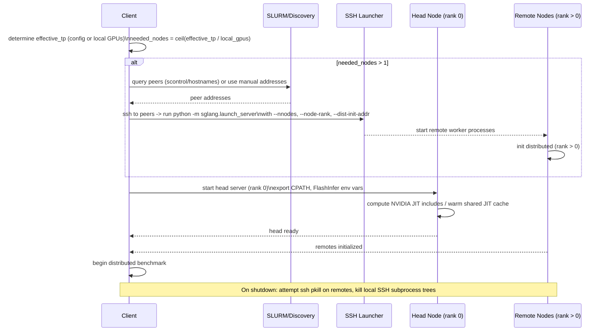

# [PR #364] docs: mark gqa_paged ps1 workloads collected for Llama 4 Scout/Maverick

source: https://github.com/flashinfer-ai/flashinfer-bench/pull/364
state: closed | updated: 2026-04-14T00:00:56Z
labels: 

## 正文

## Summary

- `gqa_paged_decode_h5_kv1_d128_ps1`: 🟡 → ✅ (20 workloads, all PASSED)
- `gqa_paged_prefill_causal_h5_kv1_d128_ps1`: 🟡 → ✅ (14 workloads, all PASSED)
- Updated coverage text for both Llama 4 Scout and Llama 4 Maverick sections (share the same TP=8, h=5, kv=1 definitions)

Workloads collected from Llama 4 Scout 17B-16E TP=8 on 2-node B200. Prefill reference was also vectorized (batched `torch.einsum` replacing per-token Python loops) to fix a 23-minute hang on large prefill workloads (total_q=14355).

Dataset PR: [flashinfer-ai/flashinfer-trace#259](https://huggingface.co/datasets/flashinfer-ai/flashinfer-trace/discussions/259) (merged)

## Test plan
- [x] All 20 decode workloads PASSED vs. mathematical reference (8–454x speedup)
- [x] All 14 prefill workloads PASSED vs. mathematical reference (4–112x speedup)

🤖 Generated with [Claude Code](https://claude.com/claude-code)

<!-- This is an auto-generated comment: release notes by coderabbit.ai -->
## Summary by CodeRabbit

* **New Features**
  * Multi-node tensor-parallel runs with automatic peer discovery and remote worker launching.
  * New CLI flags for multi-node control and environment selection.
  * Server runtime flags added to improve memory, concurrency, and warmup behavior.

* **Documentation**
  * Expanded multi-node benchmarking guidance (SSH env propagation, NFS/model path requirements, precompile warm-up).
  * Updated model coverage with additional Kimi K2 GQA workloads.

* **Bug Fixes**
  * Robust handling of JSON-formatted conversation entries.
  * Fixed configuration file structure.
<!-- end of auto-generated comment: release notes by coderabbit.ai -->

## 评论 (1)

### coderabbitai[bot] · 2026-04-12

<!-- This is an auto-generated comment: summarize by coderabbit.ai -->
<!-- This is an auto-generated comment: rate limited by coderabbit.ai -->

> [!WARNING]
> ## Rate limit exceeded
> 
> `@yzh119` has exceeded the limit for the number of commits that can be reviewed per hour. Please wait **18 minutes and 11 seconds** before requesting another review.
> 
> Your organization is not enrolled in usage-based pricing. Contact your admin to enable usage-based pricing to continue reviews beyond the rate limit, or try again in **18 minutes and 11 seconds**.
> 
> <details>
> <summary>⌛ How to resolve this issue?</summary>
> 
> After the wait time has elapsed, a review can be triggered using the `@coderabbitai review` command as a PR comment. Alternatively, push new commits to this PR.
> 
> We recommend that you space out your commits to avoid hitting the rate limit.
> 
> </details>
> 
> 
> <details>
> <summary>🚦 How do rate limits work?</summary>
> 
> CodeRabbit enforces hourly rate limits for each developer per organization.
> 
> Our paid plans have higher rate limits than the trial, open-source and free plans. In all cases, we re-allow further reviews after a brief timeout.
> 
> Please see our [FAQ](https://docs.coderabbit.ai/faq) for further information.
> 
> </details>
> 
> <details>
> <summary>ℹ️ Review info</summary>
> 
> <details>
> <summary>⚙️ Run configuration</summary>
> 
> **Configuration used**: defaults
> 
> **Review profile**: CHILL
> 
> **Plan**: Pro
> 
> **Run ID**: `26244e57-3c2a-42f0-b86c-be94c6c5c2c9`
> 
> </details>
> 
> <details>
> <summary>📥 Commits</summary>
> 
> Reviewing files that changed from the base of the PR and between 0e1752a60cd5af161fdf706d0d9a9e88da6de68a and 1660656371c6ebc5a33108ccf1aceb30d39cc60d.
> 
> </details>
> 
> <details>
> <summary>📒 Files selected for processing (1)</summary>
> 
> * `docs/model_coverage.mdx`
> 
> </details>
> 
> </details>

<!-- end of auto-generated comment: rate limited by coderabbit.ai -->

<!-- walkthrough_start -->

<details>
<summary>📝 Walkthrough</summary>

## Walkthrough

Adds multi-node tensor-parallel benchmark support and documentation: SLURM/manual peer discovery, SSH-based remote worker launch, revised TP selection, prompt JSON parsing, NVIDIA JIT include handling, updated model coverage entries, and enhanced multi-node cleanup.

## Changes

|Cohort / File(s)|Summary|
|---|---|
|**Documentation** <br> `​.claude/skills/collect-workloads-bench/SKILL.md`, `docs/model_coverage.mdx`|New multi-node usage docs, environment propagation and NFS notes; updated Kimi K2 model coverage statuses and counts.|
|**Multi-node Benchmark Script** <br> `examples/sglang_bench/bench_sharegpt.py`|Major multi-node TP implementation: new CLI flags (`--peer-node-addr`, `--dist-init-port`, `--no-multinode`, `--conda-env`), SLURM/manual peer discovery, SSH launch of remote `sglang.launch_server` workers, TP selection change (prefer model config), prompt JSON-string parsing, NVIDIA JIT include/CPATH handling, and remote cleanup via SSH/pkill.|
|**Model Configs** <br> `examples/sglang_bench/model_configs.json`|Added server CLI flags to the B200 Llama-4-Scout entry and fixed a missing JSON delimiter/comma.|

## Sequence Diagram(s)



## Estimated code review effort

🎯 4 (Complex) | ⏱️ ~45 minutes

## Possibly related PRs

- flashinfer-ai/flashinfer-bench#298: Extends the same benchmark scripts and model configs; initial implementation that this PR builds on.  
- flashinfer-ai/flashinfer-bench#335: Overlaps with prompt-loading and bench-args behavior changes in the same benchmark file.  
- flashinfer-ai/flashinfer-bench#349: Related changes to GQA paged decode/prefill definitions and model coverage updates.

## Suggested reviewers

- yzh119  
- Ubospica

## Poem

> 🐰 *twitches whiskers*  
> Peers found across the field at dawn,  
> SSH hops, then lights are on,  
> Ranks align, the tensors hum,  
> JIT warmed, the benchmark runs—hop! 🥕

</details>

<!-- walkthrough_end -->

<!-- pre_merge_checks_walkthrough_start -->

<details>
<summary>🚥 Pre-merge checks | ✅ 2 | ❌ 1</summary>

### ❌ Failed checks (1 warning)

|  Check name | Status     | Explanation                                                                                                                                                                                                                                                                       | Resolution                                                                                                                                                                                             |
| :---------: | :--------- | :-------------------------------------------------------------------------------------------------------------------------------------------------------------------------------------------------------------------------------------------------------------------------------- | :----------------------------------------------------------------------------------------------------------------------------------------------------------------------------------------------------- |
| Title check | ⚠️ Warning | The PR title references marking gqa_paged ps1 workloads as collected, but the actual changeset includes substantial multi-node TP support implementation in bench_sharegpt.py (+337/-57), model config updates, and documentation changes beyond just the workload status update. | Revise title to reflect the full scope of changes, such as 'feat: add multi-node TP support and mark gqa_paged ps1 workloads for Llama 4 Scout/Maverick' or list primary changes more comprehensively. |

<details>
<summary>✅ Passed checks (2 passed)</summary>

|     Check name     | Status   | Explanation                                                                         |
| :----------------: | :------- | :---------------------------------------------------------------------------------- |
| Docstring Coverage | ✅ Passed | Docstring coverage is 83.33% which is sufficient. The required threshold is 80.00%. |
|  Description Check | ✅ Passed | Check skipped - CodeRabbit’s high-level summary is enabled.                         |

</details>

<sub>✏️ Tip: You can configure your own custom pre-merge checks in the settings.</sub>

</details>

<!-- pre_merge_checks_walkthrough_end -->

<!-- finishing_touch_checkbox_start -->

<details>
<summary>✨ Finishing Touches</summary>

<details>
<summary>🧪 Generate unit tests (beta)</summary>

- [ ] <!-- {"checkboxId": "f47ac10b-58cc-4372-a567-0e02b2c3d479", "radioGroupId": "utg-output-choice-group-unknown_comment_id"} -->   Create PR with unit tests

</details>

</details>

<!-- finishing_touch_checkbox_end -->

<!-- tips_start -->

---

Thanks for using [CodeRabbit](https://coderabbit.ai?utm_source=oss&utm_medium=github&utm_campaign=flashinfer-ai/flashinfer-bench&utm_content=364)! It's free for OSS, and your support helps us grow. If you like it, consider giving us a shout-out.

<details>
<summary>❤️ Share</summary>

- [X](https://twitter.com/intent/tweet?text=I%20just%20used%20%40coderabbitai%20for%20my%20code%20review%2C%20and%20it%27s%20fantastic%21%20It%27s%20free%20for%20OSS%20and%20offers%20a%20free%20trial%20for%20the%20proprietary%20code.%20Check%20it%20out%3A&url=https%3A//coderabbit.ai)
- [Mastodon](https://mastodon.social/share?text=I%20just%20used%20%40coderabbitai%20for%20my%20code%20review%2C%20and%20it%27s%20fantastic%21%20It%27s%20free%20for%20OSS%20and%20offers%20a%20free%20trial%20for%20the%20proprietary%20code.%20Check%20it%20out%3A%20https%3A%2F%2Fcoderabbit.ai)
- [Reddit](https://www.reddit.com/submit?title=Great%20tool%20for%20code%20review%20-%20CodeRabbit&text=I%20just%20used%20CodeRabbit%20for%20my%20code%20review%2C%20and%20it%27s%20fantastic%21%20It%27s%20free%20for%20OSS%20and%20offers%20a%20free%20trial%20for%20proprietary%20code.%20Check%20it%20out%3A%20https%3A//coderabbit.ai)
- [LinkedIn](https://www.linkedin.com/sharing/share-offsite/?url=https%3A%2F%2Fcoderabbit.ai&mini=true&title=Great%20tool%20for%20code%20review%20-%20CodeRabbit&summary=I%20just%20used%20CodeRabbit%20for%20my%20code%20review%2C%20and%20it%27s%20fantastic%21%20It%27s%20free%20for%20OSS%20and%20offers%20a%20free%20trial%20for%20proprietary%20code)

</details>

<sub>Comment `@coderabbitai help` to get the list of available commands and usage tips.</sub>

<!-- tips_end -->

<!-- internal state start -->


<!-- DwQgtGAEAqAWCWBnSTIEMB26CuAXA9mAOYCmGJATmriQCaQDG+Ats2bgFyQAOFk+AIwBWJBrngA3EsgEBPRvlqU0AgfFwA6NPEgQAfACgjoCEYDEZyAAUASpETZWaCrKPR1AGxJda+Boi5mZwBrSCIARzQAfW40UnpuRABGSAB3fApgj3w0WmQmDy8xOkgAMwzIABkPNCDIABZIAGUmPAB6AFk0KQp4BlCACltIMwBmADZ6gEo3BGRh7G5aamlIXwZHdmp4fCwCSCDMyFx0sMiYuJLElPTM7Nz7ElxkNHz8QtEaenK+atq0BrNVq4dAYeh/OqNLo9PrBDSQADCsEwpGQSkQDF6AjoHAMUAi0Vi8SiSiYSiisAArFFghIkiSkgAmAAcMWSXEQuGo2HyyIw8TKFBYPGc4jQHkgA0AvBuAQ/2psd8AoPsV6ANAKDk8sAKASQRkABjSGSyOTyABp0IVrABBJpNACiABENHizoTLrQYhQSKV4IUogw0DzxRTqbT6bQmazrhyubgeYw+QLSkLmCKKGKJdK5QqlUUvpKNZBtUlGrcjblEGbxRKrNa7Y7nQj8D1LscSAAPEGLZZ5+BYAT4XCwKo1SFA/B4UHgkcAqHdSiwx5iHYYRAAbkg/cHkB5JBgVgAvMyzbB95SzbT9yklN6MOpl4gnQYAOqG+55NKUXcFXMlJPCiEzmOE5JAA7AAQmASTjLae6HvwWAAoyYAYIou5gXq+qIE8izwnAu68F6PoSp6pSfhgDC7vAzDcF4bAYDGy5pK8kBSGIGTwAAXiUAwCNQDCwCUBAUPxGgkL2Dgpp6NFoAwvZEDwlBgAQwRkNYsiDrskDZPgiTyvs3ptugOqjGAzC9ngu4JvBWnOKQPAkURBp3MayADAQXIeFE4SXvUoyUpSUzwva1CvE81h2CRZEUbQXClDUiAIBgpEUGA2htHFryJclSlUBRZiMpSACcj7QNIILSVgnoOB4zy4lAloWnqayiKhTllu+NY2g6LEPgc1ACUE4j+sRXpRbuAxSRkebMoAyAT1JS9QAOv2NwJB0IsgXOg1ErFvZhEWqWb7zLW3USL1g0Ddsw2QJFnrkeNk1piU9QzUkTLLYgq3rdwm0GAA4mQyh5qk6hDgiNTYEoiKoY++jGOAUBkPQ+ClDgBDEIDVB5kwrDsFwvD8MInySKscgKEoVCqOoWg6HDJhQHAqCoJgaOEKQ5BYyUON0ZwN1oKk9iOIc8hk2SyhU5o2i6GAhjw6YBgaAwENKG0iDBERiBtN+nxgIdLlgNi5GwG0TQANIAJKVJUGjMDFBgAESOwYFiQJa5sYxzKz0BJwv8Kj/EotIRj1bQSj0Osmz0dsmnopi8BqPykAAAaG/xUQJc4JBENwmjcLIScHNgNXwMhrUBujSg0EummpAJWDMKhEpMEl8DydAViQO2FF0Mg2TDR48gSEg8deJAf1WAAqgo2D0WavZK5DcnNJUE82B0BuhQka18LQSBMD0shmjaAASbWUDZM/8XJlZgmUGSpM4u+JwAYvFsDm0l5+0I43CdxgQ9CgwDzFizh4AqC8MgXYA9syDksiQB4KEoYTUwKEXUm0Q5hyMuQAWgAcAg6EXcQpcoYZSIK5VOsB07Ik9NnXOsgpiAFwCRc4gY5+EjuIROuRd7MIwOKNo2JkRDwyOKRElRzZlBqKQrgScIBfRSogkgqVQ4UCTmaaRYBd6cjAL2dQYBuBTRUcnCAKFTIEN7KhAxmB6BqObssMAZAJBJydFAW0bZYhghKEQbA8Blj3Wsp6BuNAFLnxPn/ABuxgG8B0nEaOWABgkA0EQDQqiEQT3tJaKIx8ADyHRbQGKTjWaAx88kIgKUU1Rz9KjWmPubAAcs/W0NgohPkyTYU2TQawIltFEMC1pclTErNkROIMtx1KaGAT6oh4DegYBuEgAidh8GoY/JeVh1KwE0gnZw8hYhbksQoMEAIZLiAkDEyA5Ae5ONdqHEo4lcAUGwNXFcd8+A6W4cIgiYAcbcB9EvaANhoBgCth0SAz8OjH0tNZWBkABIINatiH4u4oXegoJyG6M9swPwoCmDOnp6AAClzbQEYDJASlz7SsJ5oJASxx0jjK5HZUkw9NINyUBKH4kokjynbo8XMjE/wpmbt6eSZ0tJ+GEePKepQqy8X6JOSUjJ5QU0kEvT04QvG4rOa1Vo9FBTCiThRH0AxBWtyiLgX+bRRXDSiNnHkUwC7DKHMwUxRDdwQyNiUKB8ha6qQbp6Y4fJ4K7nkSgZA5yw6XInksL2/qvxeEwIsBQuMdW9hjRuPiQ5tK/32CRXM/rqDJ24OrQoBcgjyBoFi3sKwbokACbuUslBkApqdcXF1BwYZbWucjVaWNlzCJQjQZAqr1VL1GalBgFFECIBHruNRLKSAeF0f1AumkqyavRHKyJQ9MEs3bLUGiu52VBAwNgd529+A9F6EoR8kBIDmEsA1ctMTkD7ChaSGoPbdiQNRu2PRT1kZ8G4NgAQHg+h/3EOIIOBgamZJqbaIwlReyrADvyHEkAADUIFmRtEgkYW0nIqLRrFtWoeJABZeh+LzDodB4COAdk7PE8t1iaznZ5feyhSA21oG2XEjt7bO3ve7dmQMSg+y2X7eMgdEAGA/snJjbQWN+ibOx+Jts2wGKhabKiOhTaMklABQELRxy4E6HOXo/R5RYUeduKNA62pvnsDGOM7KTiKgmbJaZY8ACKEKiQlGvNo7hLwQRJ3boeJOUiCQXGJARb0vp/SBk8lSGkdIGQsjZEkAueyk6Rd8+6UkqFgzJbDBGdLBdkOJmTJAWU2Y1TwkbBQKqeiwRLxwY2ZspBGE0A7M8jcA4hxQv040QzwFwKQWgnKwbkBoTzllaBCCEYYIOAEJZwLTFB0kCHlhb4lWk6NAtUkXUBdbpkGis1G8d5P17Swjq/YSdmSQH26MCxt8oV4KQFO/kjCsIggfsgLs0b+WQBwauv63mzuuRPJSBSO8Nt9BIP0+we6QOJwkHqPU9RmSdcVDgxIkwvMQpOb0TAzxJQoTOwFvlPppAI8QEjpeqPdTo8x/CGpio+vnyFKkRAgBMAgc9yLCja9gCSwpATTZlRdIU9DUPMXJgOrFSJ+CTKHaCPjva7GqQN7wwOpW+5wT7xM/qmh6gDQGQMzPYHeIO0HYPwcQ7yQOMV0PjGw+MXD+HBpc1ap6EjZHSgUa4FR3etHePB3lru6iEDVZEBqPyKI5C+EnYoTirOOcNB5x407F2bsPbCe9kLMTKMleomDlczBzbCHBu5Q4bgv7ebYJEWIkhyA1GyJdYo2gyjVEQA0bgLRt5e+17yUYwg5ezFKGe1YiANi0B2P/gYmicZshEFA/sL5Flk5hroFEeRyB9yMDEh4OJfviZSFNeay1QYbWIDtZOM03rKokDVfAXFZoNFsYA9vVyTQV5rxYmA5OGIuwdy7wScbQSc6ynIPCbAiAy6fAR6J6EonCVUAu8oeybq/E1ataBaaymkpk9g0eKIGg6BSelAPQ9qhoDa56wSTQp8DqhiyEO+Q+beVAGAwQE+9BPefeOiSBjiDYCYJQVe86xMGycy3QCyXA/iSmCQvQFQ5chASmDW3iS8hexqniGqaiZq4ynEJA2GSk3ABcgOScKSaSUQAAaubE0ObGBJUF0vaLaOYZ0k0EnOuNyqgChALOKA/LIM+mgCpFgIDlCixvskKmkHXFduwGaOzhQCDCLt9rqimH3OKpPNPPRBGjZlcMmDnKKrkEvPsHyLQKPN2KFCCBiJdEXvLgJH6vqrsD0LToFiWmgPIM3FyCmnik0DBg5r0PyAEJqgLLECiqsEis/qis3LUacuwC4KEapOoCGkZJyF0fJPChkLuO2HckcrkdSknPbLAI4JgPbAXJEtRCCCch4NgPEh2pgjUuYfaObBCgSkSvPKcVDNXrXhuE0SwIBuwvJEYaUgYZVt8twH3pyFWCUEnP/EoWgFrNgAAFRtCPGQwkAFwwoUxBZ85pgJp7JkAOALGprImPAUA9CCwCCRITp/YC7JwlKWiFIFz/bAygz+r4Ai47KwAPjOjmzURChSDew7G4C+CpD+EVCj6tr3IrhcBrH9C9wBjupbzUGnwknSDkl7LUA0BHHrZYFKzwLHq/xDwAhJyTpDgaCGk8BFoShgCowADkiABB/IRBUpacWEBJlA5p6mYRJpz61KiREoISS28pk6xwno0gqu/G6uj6q2L6Ouog76+uhehuf6/AJuwGoGFuEGUmzorOncriRutAbQgGiZ5u9E6g8guuH6TyCufq5W3Eq6nCv4l8q2mcba38Xgfe5aPCEoDqKaUKGIvQOc64ZOuZZursVgYiU6RAPCsYVU6AfqhuW26ALwWk8cVAkxvY5aUqFEv0CG5A9uyuXAaGowowIE2GlIIEbu4gHu9ARG3u8ApGncfuU0XAx8rcsAdGfGDGYARg4e+6msVpMeRAceie8mjcimLcpCGgQgiAuwGefGWegmmM0aomkxKh/BUmlonahcxc+6+JhJCIoi4icQz6ioUKKcGERB04YA9Q4ywIGgDpPQUQTeBcExsgUiEAbAzAZpuU3CdKV0kAuoGgIElITBQQbYYAIpt4/Iwlj+ZxnIyAlITI7Baias8AgJ1FikmKTq+h8IDU4FZQ8AbYJQAI8xDy45wibRHR72ZxbxKAK4lAXxqaZkk6S83MkJzgVARZ86Wm5a6ApQHlUKBE0US8Sc4QCuGAJk5AHYYAzIuoAgwlcQ8Qy6RMYgko8l6sSlpBKlzgalScCOWJ2AOJnZOVQoM8T88kBAgJXgUgEoExV5rkScZkowuouoamncuADAGg8o/i2gWAJx3illqaJlNSQZWeGuJZ+FqaxZ0Z36mZcZFQ/ZSZBZKZaZuw40fVwRrcOVpytJu4nqvZiosZXwOZpuoGRGyZVVPVg4qAu8fu65du5RjuaGlI2GSQJ5BG2MXusO155Gd5U21Gwe9GcMBg9Mf8yMqMchOenM55LAPMEh/MgsTgkxosqElMagkstMMs/1CMiaZkuAUQ3iiAUQl5pGW+wJaY0sssANaAuodABUaAUqC0IEKgSQlIjItAhUDAoEjNIEJAAg9QDAhUtApQIEpQSQzILNJAIEJNaNEA3FJAbNjIaA4wuoDAtAlI1NUESQpQfNIEuo4wtAuozNaAhUJAzIzIyw2tJA4wzIAIf1AN3M6g2NeQeNb1Cu7oSM4tANBEUQbAFApAfoAkEp6cXIxNf1AA3gYDevbEgLYGBH3CpLQI2EmrgFYIyV8PbLFOKFhCaKHZAOHYgJkhet4koBgCnWUGnSQBnWHUxncnJG1sph/C2eKE0DGCQEXSHTemHR+ZHt+SiH+UbAnkbJQpnDQmnrIM3Zna3Vne5OKM/LWfeEXeMGXWPVnaUNPZ+k+KDOSv4JXd0UXZSKPZAAAL6Z173z32xiw2AqBI1PhCg0BWAUDuC4BeBF1SoeDp2Z32zxS4BIiiDBA2DSAEKIBF0ADau9LdC9J9vtwQNStQTdXA9sd9o8/EX99s89Y99swJsY/9qdz9pdu9bdriMeMSRdsD1Kww4Go8x290yAhw6sicOWboPAyQdmLks5OYnwdAZoAgE4UKRyCB5RcR8J66S2wJBZwiQpleHcLxU0KAEeNaWw3CPV5C/d1Cqeeckou5+5h5IECOQRqh1m3Y0gN84cFKsjjEFZMgJAsguw9AQgPIIIUKesDwaDcYG1GgSDODWdVU7weAy4hDP9m2iKngiKioOanwqaS9FogBq04mpjZoDgGBzE5ppE1AXAnCaFFerUVeiwrxeyVDLoUWVwDD9j747Kk2w2xm02ZmwQ5p8Z85qKvABGkxpjba5ZHxnodcU65VsgLjyDrd9sc6hDmKolRArjC97jLUwFOV0DxdWD3TYd7Ey+rZn9/QkDbAhDpDTdu9R9wDbjYDX9yzkz9s698xS81dVApAwzoDjjGD/pZxMzWdP6+D3ChDhzm98k7+LYqAzIowGge5AApKEX0EOKgA4H7n0FeakTANSkOs/lSlVOsh4PQB8zxfVT8109s30zAwM3JOcyg3M5Wh4IsxA1A4QxXQsf/Rs90yAygwg0s0SzA/aNIHHDnIxAS9iz05c0XXcjc9s/c5gAQzAwS/YMlatPQFAI2EoGfRLNzsgAgEQLAGAGVfOjDb7KgGQOAnQKiyM706hP084IM6y7M70PM+KAS3s8Swy92Y8xs5nQALrH3v22D0tdmKWPMwMkC6gM3YiUh+4gQgQCAMCkSK1JCqD62lCMilAMDjCa2jCFQW2lDjBhuFQG2lDG3+ijClACDK0CCjAMCMgxvjCUjM0U0gQMDnNv2vAJ3/IBOEMLTk0MC6jMiTCjDG2UjMiy2FShskD1DhiUis1oBG2i3ZvMheuFTk1tt82kS8T1ACBJC0BNtSr1W0BTtZsgSlsJTjjwtR1+DBC2CP0l3H27y0A2AzyOuMvcIsuYMv3l3eJHsYBwMkDnvXPYNXuHvHt+AN2ksPucskAGAH0S1QDu2e3e3UvBC40u10zo1yEXA7j+0rAweB2o0GBB1luchWABhbaWi4C+NXlO1x2Y2Ngzy4Ap26i/tk14D4BQdYQwc0BRBgcyxAA== -->

<!-- internal state end -->

## Review (2)

### gemini-code-assist[bot] · 2026-04-12 · COMMENTED

## Code Review

This pull request implements multi-node support for the bench_sharegpt.py script, enabling automatic peer node detection via SLURM and SSH-based worker launching for large tensor parallel configurations. It also updates documentation and model coverage for Llama 4 Scout. Feedback includes addressing a potential file descriptor leak when opening worker logs, restoring a removed local cache check for prompts to avoid unnecessary network dependencies, and removing a redundant JSON import within a loop.

### coderabbitai[bot] · 2026-04-12 · COMMENTED

**Actionable comments posted: 5**

<details>
<summary>🤖 Prompt for all review comments with AI agents</summary>

```
Verify each finding against the current code and only fix it if needed.

Inline comments:
In @.claude/skills/collect-workloads-bench/SKILL.md:
- Around line 144-149: Add a single blank line before the markdown table under
the "Examples" section in SKILL.md so the table is separated from the preceding
paragraph (this resolves MD058); update the block containing the table (the rows
starting with "| Config TP | needed_nodes | Launch mode |") to be preceded by
one empty line.

In `@docs/model_coverage.mdx`:
- Line 572: The coverage prose omits the remaining RMSNorm gaps: update the
summary to either explicitly mention that rmsnorm_h5120 and
fused_add_rmsnorm_h5120 remain uncollected (so they stay 🟡) or, if they are
covered via shared collection with Qwen3 14B, change those rows to ✅; locate the
coverage table/rows named rmsnorm_h5120 and fused_add_rmsnorm_h5120 and make the
corresponding change and mirror the same change at the other occurrence
referenced (the second instance around the later section).

In `@examples/sglang_bench/bench_sharegpt.py`:
- Around line 608-624: The --no-multinode flag is currently short-circuiting
peer discovery but not preventing the later needed_nodes check, making
distributed mode unachievable; update the logic around args.no_multinode,
available_peers, peers, need_multinode and nnodes so behavior is consistent:
either (A) treat --no-multinode as "don't auto-launch SSH only" by still
populating available_peers via args.peer_node_addr or get_slurm_peer_nodes when
needed_nodes > 1 (i.e., remove the early skip and only skip SSH/autolaunch
elsewhere), or (B) validate early and raise a clear error when args.no_multinode
is set while needed_nodes > 1 (e.g., check args.no_multinode && needed_nodes > 1
and raise RuntimeError explaining incompatibility), and keep peers =
available_peers[: needed_nodes - 1] thereafter; pick one approach and update the
block using get_slurm_peer_nodes, available_peers, peers, need_multinode and
nnodes accordingly.
- Around line 638-649: The code launches remote peer workers with
launch_peer_worker but never checks their Popen handles, so if a peer SSH worker
dies immediately you get a vague timeout later; fix by changing
launch_peer_worker to return both the Popen and the peer log path (or expose the
log path via an attribute), then after creating p = launch_peer_worker(...)
immediately call p.poll() (or check returned Popen) and if it has already
exited, abort/raise early and surface the returned peer log path so the caller
can print it and exit; otherwise append the Popen to peer_processes as before.
- Around line 677-682: The environment dict in the env= argument currently
places os.environ before the explicit flags so preexisting
SGLANG_RECORD_STEP_TIME and SGLANG_TEST_REQUEST_TIME_STATS values win; change
the order to put os.environ first, then apply the explicit flags
("SGLANG_RECORD_STEP_TIME": "1", "SGLANG_TEST_REQUEST_TIME_STATS": "1"), and
finally merge the CPATH conditional (i.e., **os.environ, then the two SGLANG_*
entries, then **({"CPATH": _server_cpath} if _server_cpath else {})) so the
stats flags override any ambient values.
```

</details>

<details>
<summary>🪄 Autofix (Beta)</summary>

Fix all unresolved CodeRabbit comments on this PR:

- [ ] <!-- {"checkboxId": "4b0d0e0a-96d7-4f10-b296-3a18ea78f0b9"} --> Push a commit to this branch (recommended)
- [ ] <!-- {"checkboxId": "ff5b1114-7d8c-49e6-8ac1-43f82af23a33"} --> Create a new PR with the fixes

</details>

---

<details>
<summary>ℹ️ Review info</summary>

<details>
<summary>⚙️ Run configuration</summary>

**Configuration used**: defaults

**Review profile**: CHILL

**Plan**: Pro

**Run ID**: `1e9bd331-45de-4096-900c-b378a50d1f24`

</details>

<details>
<summary>📥 Commits</summary>

Reviewing files that changed from the base of the PR and between 534a6f6c9eb6382b08d2612bd58543fcac025f6e and a0ed25afa547ab152d9c17527eb4c9df7f189ce7.

</details>

<details>
<summary>📒 Files selected for processing (4)</summary>

* `.claude/skills/collect-workloads-bench/SKILL.md`
* `docs/model_coverage.mdx`
* `examples/sglang_bench/bench_sharegpt.py`
* `examples/sglang_bench/model_configs.json`

</details>

</details>

<!-- This is an auto-generated comment by CodeRabbit for review status -->
