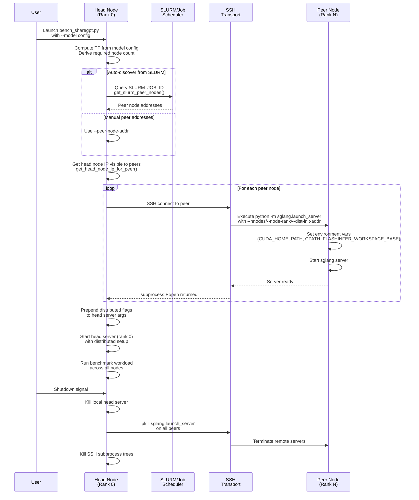

# [PR #365] feat: add MiniMax M2 full kernel coverage (17/17 definitions)

source: https://github.com/flashinfer-ai/flashinfer-bench/pull/365
state: closed | updated: 2026-04-12T21:58:25Z
labels: 

## 正文

## Summary

- **New MoE definition**: `moe_fp8_block_scale_ds_routing_topk8_ng1_kg1_e256_h3072_i8192` — MiniMax M2's 256-expert top-8 sigmoid FP8-block-scale MoE (EP=1, TP=8, `trtllm_fp8_block_scale_moe` with `routing_method_type=2`)
- **`models.ts`**: wire `moe_experts` for MiniMax M2 with the new MoE definition plus `gemm_n16384_k3072` (FC1/W13) and `gemm_n3072_k8192` (FC2/down)
- **`model_coverage.mdx`**: replace placeholder MoE row with 3 concrete definitions, bump coverage 14/15 → **17/17**

## Definitions covered (17 total)

| Definition | Notes |
|---|---|
| `rmsnorm_h3072`, `fused_add_rmsnorm_h3072` | Layer norm (already tracked) |
| `rope_with_cos_sin_cache_neox_style_d128_rd64` | NeoX RoPE, head=128, rot_dim=64 (already tracked) |
| `gqa_paged_decode_h6_kv1_d128_ps{1,64}` | GQA ratio=6 (non-PoT), decode (already tracked) |
| `gqa_paged_prefill_causal_h6_kv1_d128_ps{1,64}` | GQA ratio=6, prefill (already tracked) |
| `gqa_ragged_prefill_causal_h6_kv1_d128` | GQA ratio=6, ragged (already tracked) |
| `gemm_n8192_k3072`, `gemm_n3072_k6144`, `gemm_n256_k3072` | QKV/O/gate GEMMs (already tracked) |
| `moe_fp8_block_scale_ds_routing_topk8_ng1_kg1_e256_h3072_i8192` | **New** — MiniMax M2 MoE |
| `gemm_n16384_k3072`, `gemm_n3072_k8192` | MoE expert FC1/FC2 GEMMs (already tracked) |
| `top_k_sampling_from_probs_v200064`, etc. (3×) | Sampling v200064 (already tracked) |

## Baseline solutions (in `tmp/flashinfer-trace`, submitted separately via HF PR)

All 17 FlashInfer wrapper solutions created locally:
- 5× GQA h6_kv1: `repeat_interleave(6)` for non-PoT group_size; ps64 prefill uses native GQA; ps64 decode uses `BatchDecodeWithPagedKVCacheWrapper`
- 2× rmsnorm, 1× rope (`apply_rope_with_cos_sin_cache_inplace`), 5× gemm (`F.linear`), 3× sampling
- 1× MoE (`trtllm_fp8_block_scale_moe`, `routing_method_type=2`, `use_shuffled_weight=False`)

## Test plan
- [ ] Verify TypeScript types pass (`pnpm --filter web typecheck`)
- [ ] Confirm MiniMax M2 model page renders with all 17 definitions listed
- [ ] Collect real workloads once ≥8×H100-80GB or ≥2×B200 hardware available (TP=8, EP=1)

🤖 Generated with [Claude Code](https://claude.com/claude-code)

<!-- This is an auto-generated comment: release notes by coderabbit.ai -->

## Summary by CodeRabbit

## Release Notes

* **New Features**
  * Added multi-node distributed training support with automatic peer discovery and SSH worker launching.
  * Introduced new CLI flags (`--peer-node-addr`, `--dist-init-port`, `--no-multinode`, `--conda-env`) for distributed configuration.
  * Enhanced dataset handling for ShareGPT prompt variants.

* **Documentation**
  * Added comprehensive multi-node training documentation with peer discovery and SSH environment setup guidance.
  * Updated MiniMax M2 kernel coverage from 14/15 to 17/17 with newly mapped MoE kernels.

* **Bug Fixes**
  * Fixed JSON configuration structure and improved ShareGPT dataset parsing for newer format variants.

* **Chores**
  * Cleaned up unused test imports and updated B200 model server configuration flags.

<!-- end of auto-generated comment: release notes by coderabbit.ai -->

## 评论 (2)

### coderabbitai[bot] · 2026-04-12

<!-- This is an auto-generated comment: summarize by coderabbit.ai -->
<!-- walkthrough_start -->

<details>
<summary>📝 Walkthrough</summary>

## Walkthrough

This PR implements multi-node tensor-parallel (TP) support for the ShareGPT benchmarking script with automatic peer node discovery via SLURM and SSH-based remote worker launching. It also introduces new FP8 block-scale MoE kernel definitions for MiniMax M2 model, updates kernel coverage documentation, and removes obsolete test imports.

## Changes

|Cohort / File(s)|Summary|
|---|---|
|**Multi-node TP Support** <br> `.claude/skills/collect-workloads-bench/SKILL.md`, `examples/sglang_bench/bench_sharegpt.py`, `examples/sglang_bench/model_configs.json`|Adds multi-node distributed training: auto-derives node count from TP and local GPU count, discovers peer nodes via SLURM or manual addresses, launches remote workers over SSH with environment variable forwarding (CUDA_HOME, PATH, CPATH, FLASHINFER_WORKSPACE_BASE), and implements SSH-based process cleanup on shutdown. Changes TP override logic to respect model config values.|
|**MoE Kernel Definitions & Model Coverage** <br> `flashinfer_trace/definitions/moe/moe_fp8_block_scale_ds_routing_topk8_ng1_kg1_e256_h3072_i8192.json`, `docs/model_coverage.mdx`, `web/apps/web/data/models.ts`|Introduces new FP8 block-scale MoE routing topk8 kernel and two MoE GEMM kernels for MiniMax M2. Updates kernel coverage table from 14/15 to 17/17 and registers definitions in model configuration data.|
|**ShareGPT Data Handling & Test Cleanup** <br> `examples/sglang_bench/bench_sharegpt.py`, `tests/bench/test_dsa_sparse_attention_evaluator.py`, `tests/bench/test_dsa_topk_indexer_evaluator.py`|Updates ShareGPT prompt loading to parse JSON string conversations, removes unused `DefaultEvaluator` and `gen_inputs` imports from test files.|

## Sequence Diagram



## Estimated code review effort

🎯 4 (Complex) | ⏱️ ~60 minutes

## Possibly related PRs

- flashinfer-ai/flashinfer-bench#345: Adds the same GEMM operator definitions (`gemm_n16384_k3072`, `gemm_n3072_k8192`) and updates MiniMax M2 kernel coverage documentation.
- flashinfer-ai/flashinfer-bench#232: Adds FP8 block-scale MoE operator definitions and modifies the same kernel coverage documentation file.
- flashinfer-ai/flashinfer-bench#335: Modifies the same `load_prompts_from_sharegpt()` function in `bench_sharegpt.py` to handle ShareGPT dataset variants.

## Suggested reviewers

- yzh119
- Ubospica

## Poem

> 🐰 A multi-node TP tale unfolds,  
> Peer workers dance through SSH wolds,  
> MoE kernels shine with FP8 grace,  
> Distributed training finds its place!  
> From head to peer, the workload flows,  
> Where benchmarking magic grows. ✨

</details>

<!-- walkthrough_end -->


<!-- pre_merge_checks_walkthrough_start -->

<details>
<summary>🚥 Pre-merge checks | ✅ 3</summary>

<details>
<summary>✅ Passed checks (3 passed)</summary>

|     Check name     | Status   | Explanation                                                                                                                                                                 |
| :----------------: | :------- | :-------------------------------------------------------------------------------------------------------------------------------------------------------------------------- |
|  Description Check | ✅ Passed | Check skipped - CodeRabbit’s high-level summary is enabled.                                                                                                                 |
|     Title check    | ✅ Passed | The title accurately describes the main change: adding full kernel coverage (17/17 definitions) for the MiniMax M2 model, which is supported by all file changes in the PR. |
| Docstring Coverage | ✅ Passed | Docstring coverage is 83.33% which is sufficient. The required threshold is 80.00%.                                                                                         |

</details>

<sub>✏️ Tip: You can configure your own custom pre-merge checks in the settings.</sub>

</details>

<!-- pre_merge_checks_walkthrough_end -->

<!-- finishing_touch_checkbox_start -->

<details>
<summary>✨ Finishing Touches</summary>

<details>
<summary>🧪 Generate unit tests (beta)</summary>

- [ ] <!-- {"checkboxId": "f47ac10b-58cc-4372-a567-0e02b2c3d479", "radioGroupId": "utg-output-choice-group-unknown_comment_id"} -->   Create PR with unit tests

</details>

</details>

<!-- finishing_touch_checkbox_end -->

<!-- tips_start -->

---

Thanks for using [CodeRabbit](https://coderabbit.ai?utm_source=oss&utm_medium=github&utm_campaign=flashinfer-ai/flashinfer-bench&utm_content=365)! It's free for OSS, and your support helps us grow. If you like it, consider giving us a shout-out.

<details>
<summary>❤️ Share</summary>

- [X](https://twitter.com/intent/tweet?text=I%20just%20used%20%40coderabbitai%20for%20my%20code%20review%2C%20and%20it%27s%20fantastic%21%20It%27s%20free%20for%20OSS%20and%20offers%20a%20free%20trial%20for%20the%20proprietary%20code.%20Check%20it%20out%3A&url=https%3A//coderabbit.ai)
- [Mastodon](https://mastodon.social/share?text=I%20just%20used%20%40coderabbitai%20for%20my%20code%20review%2C%20and%20it%27s%20fantastic%21%20It%27s%20free%20for%20OSS%20and%20offers%20a%20free%20trial%20for%20the%20proprietary%20code.%20Check%20it%20out%3A%20https%3A%2F%2Fcoderabbit.ai)
- [Reddit](https://www.reddit.com/submit?title=Great%20tool%20for%20code%20review%20-%20CodeRabbit&text=I%20just%20used%20CodeRabbit%20for%20my%20code%20review%2C%20and%20it%27s%20fantastic%21%20It%27s%20free%20for%20OSS%20and%20offers%20a%20free%20trial%20for%20proprietary%20code.%20Check%20it%20out%3A%20https%3A//coderabbit.ai)
- [LinkedIn](https://www.linkedin.com/sharing/share-offsite/?url=https%3A%2F%2Fcoderabbit.ai&mini=true&title=Great%20tool%20for%20code%20review%20-%20CodeRabbit&summary=I%20just%20used%20CodeRabbit%20for%20my%20code%20review%2C%20and%20it%27s%20fantastic%21%20It%27s%20free%20for%20OSS%20and%20offers%20a%20free%20trial%20for%20proprietary%20code)

</details>

<sub>Comment `@coderabbitai help` to get the list of available commands and usage tips.</sub>

<!-- tips_end -->

<!-- internal state start -->


<!-- DwQgtGAEAqAWCWBnSTIEMB26CuAXA9mAOYCmGJATmriQCaQDG+Ats2bgFyQAOFk+AIwBWJBrngA3EsgEBPRvlqU0AgfFwA6NPEgQAfACgjoCEYDEZyAAUASpETZWaCrKPR1AGxJcAZiWpcaLT0ALLwGPAhaAAekCEATJA+2B4ekADWlORpTFJUpJAAFACMAOwA9GWQSj7h6vD4GIgAlJCAKATWdmYAzABsAKyQcpCysvCw2JhEbgjItujByMmpGVkkOfh5aAU++Hy4sCRxdVGxCZDMiutFZZWl1SS1EeKNLRqQAMKwU9IcBlAAORIAHc4vgAKIPJ71RpcS4kAD6Pm4AA4EQIPPgGOkEYgGGgvAjaIgERR8HhwkQEQRuOk0RgiMUEelGQiSPF+r0EbBugAGUrxBHwFHFACciUKHN6YBI0W4lFwABpIDSwCj7PAiJd4LRlQAxKzqjFY9JgPEEo4hCEAbkg4KsAF5isroI6UbbsIhpCqKLhUswkaj0Zjsbj8YT4ZBgepYJAyRSGQi2AdFNTZPKHfFmhp/hcrh5EBpcIguNGKEd4Wy5QqlntjhFTnF4srwgwPNhaJSVYdIORQVbITU6i8sNx28hSKwERhir1uiiACzMvkCop6j7FcoAdWK3VamHok4DGBXgrpYol6/i5Vo+GBGGzucuSg8CNyylIGmYtGiXHLY7QBgjgAoDYHwDwlD4Ac4zvKMY27csjiYDAGHLGgoWHBomnQDB6AERxuAULYdjJZhIGKBdKkGAhyIqMocwMAARR5MNeIjKDoG5SmaP9mEQDA9gDHl+WbJJPToBEgloUk+IEighNPW0yXlBFowON98BJRBwjfQDDmnEh8GiXFcFkQlaGKeI0QoWhegXW0iAARzQBFuG2CSlCYJRuS5dIJCZCyrNcxAAG9nTsgBfZUnJctzSGk3gWNSXTPQJHzmX8olLLRbhQvChcosgGLSW2eLXPLWpkvxVLX1gXzMsC90ipIKcMBFcVlxE6KWuPU9mV6CiF261qpU6gVbQOI4+zzRFkTRY1Q3NcySXjcRExpOlp1ZFkmXZTluT64ULwcnrp1necl3SU9ht6kTmXa+JbQPBCSCORA0GYMcuyHZ4sOQQoaWZXEPq+xMfFI8rBBJCR4l5OG7OVEhcAYDRHwMAAhNAvQ8cIjj1DwsdgABJDA/D4YEqG4eU+EQcCKTY4EOMYctqE4kMCQ8eRwhVT7yh8AnEAQUnKDAXAqCAopBgAcQARQAQWVeT+MExX8HlG7lXez6cYZKNKepxBlWe4owUhCm0CpyhsxgaRcB4AmsHUFqSxgdMSAAZVQ+BuDt0z5QYQ5sWVZDankvMXx4dy4zISCuw52iMN+14jdwhRUlEO2WbSYE9nSTEgmQRoJfLRzsHgct6G+GzgWcI5CkAUyIUQAdYACWKOG1V5KX0f4Ph6/iJv0dh3lWlQNAJG0AmMRIBj9GMcAoBj/gfBwAhiDIZQaHoJhWHYLheH4YQM8kb1hi85RVHULQdDnkwoDgVAx6wNA8EIUhyCoLeFF3jBODjNBQQOCcC4IY8hz5UEvpobQugwCGHnqYAwGg2wvyUOURA6R4CpEQOUJg6cxBgBzhQPO+AC5gAEGQAO5R3YAGkiYABk6FfloH8AARGwgwFhIByyJuvD+rN6BAOYM4eQ+AV4Bx+IgAwcAji3gYI4dg1AsK9lgkoPEFB4DkOQAAA3IShWAuIq4kCID7DQ3BZBaIuCkcQYABJKFXoQJQNAxBKPId8CQDRyaHCwJNcO1wQ6ahVGQWmfA3JUHTmkJQRBEJFC0a6LRrRZRAToMgHx7NUjyHcdpaekApZWAAKoKGwL/FsKF2ydl1vKSg1QkDvhAe4tAkAtHuzoXkmwIQEQACkADy6MERE0YhY567t3YtyjLnKpBMikB0pO8ImdtED+3gLUb0BxqCQHxoTEmZNqgEUgGQdxZIMBsF/pACe6iVBeGQLXJIewa42U4o0TmKp8DdiOIcIIyi7GFCoBgdIkAR5RgQF4MZRDKDIFvMou2tACKzLtgSWmkBsDcFoKzFJPYBDUADmATEatGBeEwEi7+xzfYvNlF9BgngualI7EcDBqQuzlkuOhQhmQKDIG5swKx8AbFXDjEUwsRg5a9hBJAQAOAQhC5Tyux/NtiIEALgE9hj6NCjFjBYShdQoF/mSaFFKGTlEYlieRv8uzTQ+HQom/AfZ/S4FoiAlSKBSpIGAKSFAtHKltWATsiBcBgGHGAbgexcBusaRAASYBOUeDWlcYNz0PXIRRTKDAEgY2Yl1mpWMjjJ6cXtZAYZoz9nl0aMSyA3xcI6yIDEj4eTGJywRC3LpIRwTBq0VYOW0AW7No+K29tza9R0LliMomAI9TghsAiLcXSbDUPdq2j44IETowHU2/cqcGkOCIKQb1DyrWNAJDwcsYAd7cEwYo5VdzmBgEJTvIRqdlU+PefQWxM8YA9lkWJX0hw+C7HkgSeAAAvFZOcHgUu0sqigKRvSFFdOgDwNdZBLFIr4jYpNNS2ifYUk5scpD0HBiwGAVhTnIDSTk/JLQcL0F4JsHU3pZQg2BXiMgzgGjIDHJ6dAFwCV7pzZsSg6i7H8W9vKOFq7o6l3Li1dg3Y1keufOsf11BYAWPIZAYd7tnUMCAogLJwLlXxyfQKjhlg5aRs3n9Z5rzgME0/mZ0Rey5SBoeSE7AGJ4AMD2ca8Q0hcwAkaHXWRRrcCnowGAR5YDS2bvM1opBkzUHoMwQWHB4EvD4JZfnYkZCKGwCobQhhTD4kMTobjZA4iGR0C4AAalKCicoYBihGHBN6+AQiv7n2ju4kVjxv1/zoXeAwbCWFGAgGAIwsjsGydfLU9yTDfx9fYZw7hvDN6cUEcI5ejBwteYMHk5F/CLMACo9thAbDEJsB3VgUGyOxfIRxAvZOGP+AmuqK0+O0gyYFRShGW3oAd8VEIiqs0gOUZ5tJAd2epsWOVZ32AgPTS9KaIInk4y3RqhZoglmuY5vIDAH1OKsuyC7TAkADsGiNCGU0S1LR/dWl2DaKIzt4/WMqVjKSgMHegssTmh7GjkDEHQcoIQ6EEaluCEIIR6drALDEo8Z05yLjGvEQZqctHS5PHdc84p8svqOAdybBRAJMCKWtIgZ3v31kiCd84NdkBIpRV/fXexylECebhsiB2KKg+KP0M7NE3f3CB2UA7ypgRAtpa9Y9usfECXQqsu2qWSHEhLePKa+A7ayCRkMV6WBcHJa3gxebJnrNsRoj4zyVmguFxXmShz9A6zcGczjNz7B6ibcBF0gEkJCj+eJUFkLGAnkldIM0IwhXyDFY28wyA5XKJgHiPVxrzXOKtfLO10EnXA1cBCHQeAjhZsDf+Ag2j2tpBoKd1MdEmXyi6IDgY2uxjNBmNYXNozPD35LYEY4IRIDbMD5b1w4InEI1rF0NoMHAqZ18LM1FvY7YBJQQj08AVkexOtj4pB8MkhENxsFAUMK1Cg6xiNckCkDcTlg8yBMDagK0WB1B2VcBmhlQsMECjgS4y4K5exHByE+BbN9MU56BChiCsAPUw1ADwho0UBkAo9FVqD7FPUakeM2UeBXo+B9M0C8NmlWkQgpckZcR2x5JXJ5DpwrhEB4le4lCyIPV7VHVnVghXV3hIBcwiYj9iVs15CQVWVIBJk9EuwZDc0RkYk3Dr97VVJxlXVWhwMMAIhdYtEzEUwsBw17BT8GQNBfD9EvQKA8gLEwMWoU9k9VE4IDgQ0bF9MatzCfl0hCivUfU/UXUY1U5Ep5RcI0UkI9hywFlGhHdqlvV1F8Iv4ZUiAUkXl71/ABFKA8hABMAm0WSLyEkgoB6Ki0gBsKgDln/0fRFTNQtWcCIACxdlMPkPMMqPdQgDKN9WeH9UDWbVDUIEEKfSqPoDjRaLQETWTWsNzC+B+HoGgxkL4yOFcXHg8T/AyOw33RIHcXJCI3wCIFcykztgNwgn4DyA+NIM1GwGYOg1hxfjXkcQzk4irRrTAEyQ0WBXwIw1wFtGg1QBgOFTyBhN4x1CUCwF4IBK9BOQ5XzHhKIC4JEP4D73kBqBfhM3oDpJUAZM0FmNzG21t04ndkMVyWgH3RYB9lcPjxpxeVLVoGBT7CqVtyxnTzOXgEwGLEBSZi0WQjyHehHAMPczFngG9CEXkGUw6Xdjb3sAtIZH+jJNCS9HqKSHLm9UwONKC31MdjtjHkdPUQZGtjmL/3VXcwOSLUk2VPLRuRpmc0o003dK4DgJoGQABAADV+kiYhVWwylgIFMEM8MfFAJxAUCrBZAoiozC0jlJNnpwgRAxBtEu020O1NVi8ewH1FUUiqkC1DliVbQc0WUwUYMEUvQ7YtEsTa161G1m1u0O1lQ1YRw91pzFyrjGk+0B0W4h0R0x0J0p0Z05Y50F0l0LF6kcIvDRktF9lIANAHyLFEpahohHioBwRogaBcJlsJhcBbx7wuBlVZR1BlQXsvY5SyTqAaBPo9Ti9KBmBwgAdGVMjGlEA4iiAEiX49FcQhjKAnyyQUzvRLy81GlaR4tFd6A6VJdiMc0SKHABBkzpAUlEJ2Vn5ggYRvE+juyBjey8gGJzAjMC9y9zMS9RAy9TS1sq9fRHMeB69wSm9PNJFcwFjIzkgUIRxGlSBcBNDESAx/D9NChWhYFIBCtvUABtaAJFLwMy9ozWMWAAXXsosW5lvOiDo2PzQodipCvyyx8pv3LDv1MXMRzHmMWLEnUqUWVw0IfT0O8m9iRD2B0MoEKH8O9i4HaKMr0GDOcr4MPzHA8vQvPz0Uv0y38qMRMTMSi2UrCrUucWVS0USKSooACNBQoEKAfNRmMvosYq0w0CsDVjIBysaTysuRPy8qKsoT8sFlvwquCqePH3Crqr4LS0hhgpJBdzKrv0KAwC4HCAkOMtMtwBsocqUxIDcQ8U1WGrcqP2wU8rPx8pKuwumoCtmosRSucFewrSNLBWEpjw4xtKODtIdPaMpDeGqsjOfAg2xUBL8VeEC1/m0QRGzNzNrSHTNWrXBHdi4EOuOooCcvI0aSRpzMYjzIRDbPbXSrFiGtcvctusKoeqmsMUCsqpCojMxPNUtQksKDWIC0s2cHL1Hj4KEXCEMosXTRcpGoKvGoZtKuevKvv3MRtTtW2KfQsNoFdT2KkO9UOPUGON9FOJ5XDS5UuM1vjTuP2SqoMBH29B/wn3K26G6AqDAH6FKDn3EAX23l5WX0tNXx8C6y4Bbk1FgF30GwP2uvyrpulov3Gw0iwMLCEFph2pDvmxfw3k/mWw/1W2/w20kVFN2x8R0WHgsUACTCRpVID6O4hcM0A3INVC3C5q7os0pHO2YYC2Wo1omTFqMAcGcsrCM0QLcQNzXkDQUofoA2oRaIMAEIsIogKekgUuW2ZAfoSyTcj1OLbgM0eughZwTlbgN64PTBBgpGbQGeizYCxrcIiAMWT0H1ZCmgLnJQA2qCpvRoMhQCTIVOGVQWcIMmVeq+je7SADSAFETXYzBFF8ziIGgEYM7AMQREz4+QKSOOC4JAT6vFTSLsLRCKQZHwGgfYHsLRRyRmE8GxWUH1FEXkAQKe0qOgCxaHWQIPBAAOGU6mJ5L0UJVFCE4HaGqQNIAkr0Ja4wizXYVIO8TBhCvkXkaICxARkcfiwzLhISiSrsmRMS/miS2zKSr+WvOSxvDzS0yRKAPOr+KBlkxEoLG1SWyO+66O/MWOsg+OxOrRAwWYqAQuuGEusugmIRMAKuvEckWu0urRcYygJEAmaYv4WY1xtmifTui9Hupa/uxRBgZtYe0e5xqJ3QGJpW8NGIKeopGeuehe71Aw91ZehXFxqJ0K9VHJ9ezevsh1c9JFZxqAUx9o2B3AeBhQCgcsJayJrJlSziBpBCrTLsNsDB3WAQcWI4NAXBqpHxVULwXhxpIhsgboUhz8zuKh/IeKJTMnewF5LRCRuGaRjPHeb0NdEgDh6PNWHh64TIWQArIrdbF4irfoGrOrAwBrd23bJfQEn2vZP28AzfTsHffrUO4bAwL+oWMmakaZm8FiJOJocoeEFF/AWaIMBaHECnIkFaAJykakNWTaBkJkHaNkUaYSAUIUB6DQBO2EZO5/RbdO9/YBERMRHOgwIVaaaCH6DiyAUxseRYm1SsOaYME0MMC0XF0kfF9aIl+kbaVkPaLkSlwUI6DXWFPmpoq8knIYMnaui0SAZiK592V6cnUyYFaCAawvLAQoLRNWNMeULgFheEFhQw2HPIdHTiQLHohMxpaFn+ygDQZIL0aSeEIsX0f0QMeaMnCViMdF4NT0TBq5jgYoCixpXAbgDgEB94aRewf2ROb0B59AaIY/ZCEp31slBUQkq5VOL84JapY5UDbCSUTkMHGsZUU8EtakkgwBkgZUB6Ts+CrfAHXtmgzVNsDsb6SgE+egUuXU/9TiLF6t31hAf/Z+VOPaodzsAHTsRtszNZJd3t8iKyDV1HClZZFJN2egcIOvPU03VaCZUEygy/HUw2dZQ0Lttdx0zh5nXVk0ewcMaQfUD9yt30KMEgIOvUwodcE2Z6K8VoX9yacuP97EADi0N956JB1ctIanBkOegmL+JaD68oURHwScwsSAOZAtq5DUN7I4AJ29wJJoOsO1vAW9sW+Caa+URpGy+ehELwDAZUVdmk3EBd/GlygQfmEhXAWcGYoVCqDiFCI4JrfK7vDS1AFqchMKv66mb9PiG4VoHVrF/V4FJQOd41P9P02zLRYTsgEyVFYNSUVoI17gE1kgP5bSLUfAHUGCBMCtRN8Izz7UWgb5GVqkTEME4sVocrXzo3dEV94NbGY+cIwGdIB0EBtt30FjeZ/AD+5UQoPcZRH9HGSzjS7/FgNQbHDSxmSD63NB0LAEshV9jULznz/xrV56QQscMYSZ+QLRB96SJaAlnwcsvYTcwoBcBDkWUDyE2UvAP02Hd2aMKWFpAm4zinB4cz8QUrpRWzGrogWAYsI2DTRwFIRRCPXLkg5CC0zoszS8rRcIJQYyKSBEGYvURCtIBjvAdk/Eb0miHRKT6gWT+R/PPB36ri1R5Ba1ivMHavIwuvFzPR8QRS8GziaaUx3ljSyqbwP1gWGF0JsWQCEgBF6EU0tF4nkVzFmNnF4kaVvzwl2keV0lxVilw6GluljAN6rRmj6abHNgUIP7THrCYV9FqNsVxaQDqV3DqkWnLaZn3aVnu6NVhXHI2MTTugSM/ropdqh85oCxBT8sJTxajSzzqrrp8IbSOxAug3ihEgCxZZCCNGThKICIPwb0974FOWbHTmADCgYfZ522irT3UUGrXkN2prX5r2/5jrIF30DfLfMF9hffSFjM4sR6yhVP3FlyBZD6xEZ+41RoNkCedsagPYIKx/AbFOpl3bFbL/dliRIwGwP4ziLRZiEbqxcEYvyYAgV1IRnxFTwNVwpAQMvg1P7BB6zP4kbPt0vP3AL8kcIvgkbvsvyqiaHsbH5RUEAfrLjkp5Vv96d2GfuWOfl+jATvpf0vjWxpRid6aAIlkmJ7ygc/kvnv1epo8CKQRfl/sboRrRf14WZqj5Q0BADASF/HvgYXeA+Z+Ak0PgBF1czBxGgYscCEkExDAhlyX6KZCOBwQCw6uUcbmAs1tielgUqAW2pdR8SUZ3EkZTsH7RB6CUweyjCHpq2EqaN7M0lGvE5kR7mlm8SlQEL5ieaj4XmpWO2ryA+bh8PaCgOxN7Rj7+0TKvWcFsnyMBj90+WWSfu9AZ44hHusoUJqAO/4UBy+DLLhKnT4SEdM6dfQQZukb7N96ARScSNe0+iBptEbfHkrgGf7L9e+LuXHoTADaADMswA3wToLcFmlY078IUBgFvZmkPBf/PHt4ImqwA/BeiDQBSALAzEoBKeT9BIKLIHA32qfeUmCQYAICtUyAqTmgPQBaYFQf0dAXsi76X9o4tMdsFgKYA9MM4o+MfKIHSDIBGY5YcOJ61oC0DFG9AszCoyYEaNK8rA7RhwIbxcCUeBgHzOQH4E21x8FWEQTPjEGR9JB0fX2jIJ6zAgQ6CggwIzAEDlA262CA4TeGoBoA0WL4QsMWAr4KMFsr+ZlvYFMFstzBm2PUHWALoIUIgE9cNCr3GygUCGlYGbmaUhrApCgRSSCI0ixa4gZ+SYeNq0B/xUFtEQvV4Pb0tLQkPBhOFqD7HkDN1zMa6RZLUDcyTk1sBwaJCiKwAg1nSIvDFtG3FY088W9PWXiS2ZAs99oKralheGbQq5zocuK6CJFXoq4+o6uBXJAJeRpCqkoI70HWGu5kg0gxQ9AF0OfA9C+hxmAYUXkYGl51GNmUYQGjYHw9dGUwgxoNhUykoxhfOBHpMIUryBTe1AeBmPheKXUtEpw44eUFOEalLh6wa4RANzBdJOSFma7uwBh6fD8wZpDUkPzB7yi6wUoxpF8Ij6T1mAKvIJkCOrBZdPGWiCkWaVIGFBsRpkRUVQHkCl1nABY0kbAGiRUieiaMa2g6KEFvNRBXzefGsKPor5AWMgkFtvmYC7C54BgO+O5hrwrxUSb8NOpHx/h/wqAgCZ4aAgyEQI1AUCG+LAh7ELwiU6gIULTykGMxBugWMDt2N7GigfAC4XkP0AxSlAGA8QUUJQ16A+AKGvIWgN0H6C0BTxtAfoLyHPELgNMgEYoD4HiBoBFwMCOBL2OvQridQK0DYRJCXi3wlxiUJMJQFIBvhA47Q+ztuIXEGAQolTFhEgFsDowycdAD4CwGJT9VkcLCXwPCj7ZoSkAXSWEt2wwBESkgJExUGhNGxOkiAuE4iCQBJh4Nve7sAeiQBomoTMmLCKxmNRsbFVGaM1BWrxMqb8SCAgWDwHqEwF/QaJvQeiZk1mIsJaqppLcDGANQMAKxiAGif0EkmQAIolTKKGhPPg2AVAs4rcGSBoBWAKA7gP0DxOIkFhSJqkwWOSAghYSTQtgGiSNxcnKTIALCTsLQBsBFJtJXEkMj0S+BtCaJ19VyYFOCmhSMADkrwNFOxCxTwM8UoKTqCSnMRICO6DAGlPSC+S6JaEnWJkFoBEwtM2AaQBFJolsIApLCAWLgCKlN8HAkaPSVwDMqGS+JKklhAHDaEAgcc9UvKeBQ0pFSWEAU/id6jtGdSfQNUqaVEwElygHYQWeqUVPsAYIvsWTXCUoAsmQJRiXbA7nczSC18uYyARjNPF6GTTDJqk2TPVLuQz0bpKkwKXsE1AfcipQ0tgPVNURjSsIA2TJqZMya9T+JA07EF9KcmBSUpSEeCc9L6kzTOmc0uKYtNUlkpVpI4eqbm2R7Ap9c5jGgE8l+kdF6CHGbmD/kCDsVdYHOc7Jdl1x1xbgVQTMa0FNw+Ijs5uM4IkH+GApXMsYVAKAT1FfxW6KwDfoiLIE9hbAGgOGfxPulOtHplISWUtN6aNAyC8DEqf5NumvT1EYJb3p9OGlOtsZPEwyUDKiYgylpYM9IBDJGlYgKxnwGQu5HlluSB6noDKQtPVnLSAIVXf6U620nWzaZ7JFEN0A0AO0AApFzOYa8zsAftVzJaV/g5sewjBcTPQDJHSAwI0JVABQw0Bwwg5EslGYFOlmBTZZDIe2RrPenaz4JFsp1oxMil6TDZlTeyo1Oam2BRp6iAqfVIXAkABAZ4juQIBdoLhRQJAUoBRAfEMBugC4fccUBIDFAUQjwXoCiBFCUMR5PgB8aPOKAMBignuBcPEHbgjddwvQNAP0DQBniqsaAOGU1Kxi4BbA0M+qS7V5B0BRQC4foHyFoC8gUQ54hgD4FFAoh+gDABcLQAXBoBRQqgA+SNwXDdASAb43cN0AAU+Bd5SgfoD4AdqlBugDAfoAuGKAoo/an84+QYGMmLiIAAJaCVMURBmySQ4Ehcb2MHGuQX4XoezjQEQl2xuxIUU+d6isBUK6Ax/Jvivhwl4T1AuEw3ERN5A4LyFr8SheJBoWIhSFegIAA=== -->

<!-- internal state end -->

### yyihuang · 2026-04-12

Closing: splitting into per-definition PRs with proper checklist (reference tests, branched from main).

## Review (2)

### gemini-code-assist[bot] · 2026-04-12 · COMMENTED

## Code Review

This pull request introduces multi-node support for the `bench_sharegpt.py` script, enabling automatic peer node detection in SLURM environments and worker launching via SSH. It also updates model coverage documentation and adds specific MoE and GEMM definitions for MiniMax M2. Review feedback identifies a resource leak regarding an unclosed log file handle and suggests improving the robustness of remote worker management by storing hostnames explicitly and refining the process cleanup logic to avoid affecting other users on shared nodes.

### coderabbitai[bot] · 2026-04-12 · COMMENTED

**Actionable comments posted: 3**

> [!CAUTION]
> Some comments are outside the diff and can’t be posted inline due to platform limitations.
> 
> 
> 
> <details>
> <summary>⚠️ Outside diff range comments (1)</summary><blockquote>
> 
> <details>
> <summary>examples/sglang_bench/model_configs.json (1)</summary><blockquote>
> 
> `209-223`: _⚠️ Potential issue_ | _🟠 Major_
> 
> **These model entries are still in the wrong level of the JSON tree.**
> 
> `load_model_configs()` / `get_model_config()` treat the root object as GPU types, so keeping `qwen3-30b`, `gemma-3-27b`, and `qwen3-next-80b-ragged` beside `"b200"`, `"h200"`, `"h100"`, and `"mi300x"` makes them unreachable through the normal lookup path. They need to be nested under the intended GPU key instead of the root object.
> 
> <details>
> <summary>🤖 Prompt for AI Agents</summary>
> 
> ```
> Verify each finding against the current code and only fix it if needed.
> 
> In `@examples/sglang_bench/model_configs.json` around lines 209 - 223, The JSON
> has model entries (qwen3-30b, gemma-3-27b, qwen3-next-80b-ragged) placed at the
> root, but load_model_configs() / get_model_config() expect the root to map GPU
> types to model maps, so move those model objects under the correct GPU key
> (e.g., nest them inside the appropriate GPU entry like "h100"/"h200"/"mi300x" as
> intended) so they are reachable by the lookup path used by get_model_config();
> update the JSON structure so each of the listed model names appears as a child
> of the correct GPU entry rather than as top-level keys.
> ```
> 
> </details>
> 
> </blockquote></details>
> 
> </blockquote></details>

<details>
<summary>🤖 Prompt for all review comments with AI agents</summary>

```
Verify each finding against the current code and only fix it if needed.

Inline comments:
In `@examples/sglang_bench/bench_sharegpt.py`:
- Around line 579-606: The code uses detect_tp_size() to set local_gpus (used
for TP fallback and needed_nodes) but detect_tp_size() only checks CUDA/NVIDIA;
update the GPU detection so local_gpus becomes ROCm-aware before computing
needed_nodes: either extend detect_tp_size() to also probe ROCm (e.g., check
ROCR_VISIBLE_DEVICES/ROCM_VISIBLE_DEVICES or call rocminfo/hip APIs) or add a
new helper that falls back to ROCm device count and return that value to
local_gpus; ensure effective_tp, server_args, and needed_nodes calculation
remain unchanged but now use the corrected local_gpus so TP fallback and
multi-node sizing are correct on MI300x hosts.
- Around line 695-708: The current teardown uses subprocess.run with "pkill -f
'sglang.launch_server'" which will kill all matching servers on the peer;
instead capture and use the specific remote PID for each worker: when you spawn
the remote process, have the launcher echo or write the remote PID (e.g., save
to p.args or attach as p.remote_pid) and on shutdown SSH to the peer_host and
run "kill -TERM <PID>" (or "kill -9" as fallback) using that PID; update the
code that reads peer_processes (referenced symbols: peer_processes, p.args[5],
subprocess.run, and the pkill invocation) to prefer killing the stored PID, and
only fall back to a scoped pkill if no PID is available.
- Around line 233-261: The SSH remote_cmd construction currently only sets
CUDA_HOME, PATH, CPATH and FLASHINFER_WORKSPACE_BASE and drops caller env vars;
update the block that builds env_vars so it merges relevant caller environment
entries from os.environ into the env string (e.g., include all keys matching the
project's runtime knobs like those starting with "SGLANG_" and any other
non-sensitive, non-dump vars), quoting values with shlex.quote, skipping any
secret/dump keys, then use that combined env_vars when composing remote_cmd;
modify the code around env_vars/remote_cmd (refer to env_vars, remote_cmd,
python_bin, conda_env, _NVIDIA_CPATH and os.environ) to forward the caller's
non-dump env to peer workers.

---

Outside diff comments:
In `@examples/sglang_bench/model_configs.json`:
- Around line 209-223: The JSON has model entries (qwen3-30b, gemma-3-27b,
qwen3-next-80b-ragged) placed at the root, but load_model_configs() /
get_model_config() expect the root to map GPU types to model maps, so move those
model objects under the correct GPU key (e.g., nest them inside the appropriate
GPU entry like "h100"/"h200"/"mi300x" as intended) so they are reachable by the
lookup path used by get_model_config(); update the JSON structure so each of the
listed model names appears as a child of the correct GPU entry rather than as
top-level keys.
```

</details>

<details>
<summary>🪄 Autofix (Beta)</summary>

Fix all unresolved CodeRabbit comments on this PR:

- [ ] <!-- {"checkboxId": "4b0d0e0a-96d7-4f10-b296-3a18ea78f0b9"} --> Push a commit to this branch (recommended)
- [ ] <!-- {"checkboxId": "ff5b1114-7d8c-49e6-8ac1-43f82af23a33"} --> Create a new PR with the fixes

</details>

---

<details>
<summary>ℹ️ Review info</summary>

<details>
<summary>⚙️ Run configuration</summary>

**Configuration used**: defaults

**Review profile**: CHILL

**Plan**: Pro

**Run ID**: `2518ab31-a4d2-4fbe-b9e8-4312cc2ee61f`

</details>

<details>
<summary>📥 Commits</summary>

Reviewing files that changed from the base of the PR and between 534a6f6c9eb6382b08d2612bd58543fcac025f6e and 9f405ba7c290b6f800d35dc2d50904ccac1f2a84.

</details>

<details>
<summary>📒 Files selected for processing (8)</summary>

* `.claude/skills/collect-workloads-bench/SKILL.md`
* `docs/model_coverage.mdx`
* `examples/sglang_bench/bench_sharegpt.py`
* `examples/sglang_bench/model_configs.json`
* `flashinfer_trace/definitions/moe/moe_fp8_block_scale_ds_routing_topk8_ng1_kg1_e256_h3072_i8192.json`
* `tests/bench/test_dsa_sparse_attention_evaluator.py`
* `tests/bench/test_dsa_topk_indexer_evaluator.py`
* `web/apps/web/data/models.ts`

</details>

<details>
<summary>💤 Files with no reviewable changes (2)</summary>

* tests/bench/test_dsa_topk_indexer_evaluator.py
* tests/bench/test_dsa_sparse_attention_evaluator.py

</details>

</details>

<!-- This is an auto-generated comment by CodeRabbit for review status -->
