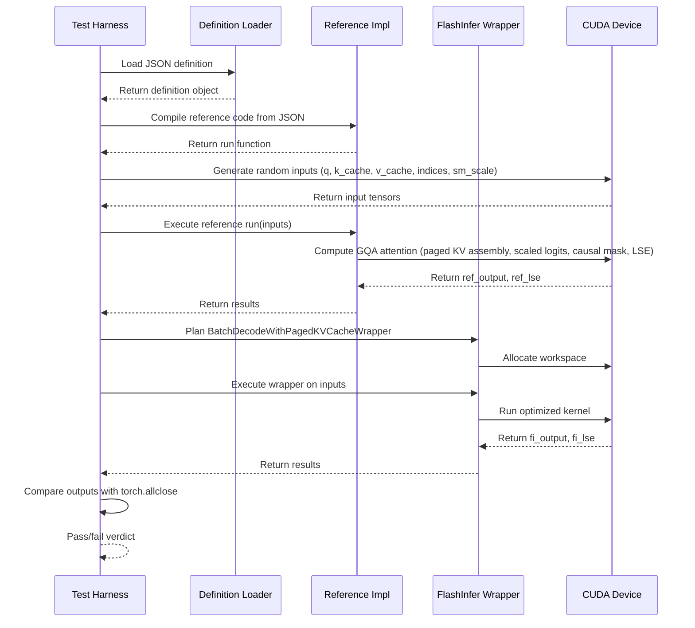

# [PR #380] feat: add gqa_paged ps64 definitions for Llama 4 Scout/Maverick (TP=8)

source: https://github.com/flashinfer-ai/flashinfer-bench/pull/380
state: closed | updated: 2026-04-13T15:17:59Z
labels: 

## 正文

## Summary

Adds `page_size=64` GQA paged attention definitions for Llama 4 Scout and Maverick (TP=8: h=5 q-heads, kv=1 kv-head). These complement the `ps1` variants already merged (#349, #350) and cover real-world SGLang KV cache page sizes.

**New definitions:**
- `gqa_paged_decode_h5_kv1_d128_ps64`: paged decode, page_size=64, handles partial last pages via `kv_last_page_len`. Since FlashInfer decode only supports power-of-2 group sizes, KV heads are expanded 1→5 via `repeat_interleave` (mathematically equivalent to GQA with group_size=5).
- `gqa_paged_prefill_causal_h5_kv1_d128_ps64`: paged prefill, page_size=64, supports GQA natively (no KV expansion needed).

**Also:**
- Updates `web/apps/web/data/models.ts`: adds ps64 variants to Scout's `attn_local` and `attn_global` modules
- Updates `docs/model_coverage.mdx`: marks ps64 rows as 🟡 for both Scout and Maverick

Tags: `status:unverified` (GPU validation pending), `model:llama-4-scout`, `tp:8`

## Test plan

- [ ] GPU validation: run `flashinfer_trace/tests/references/test_gqa_paged_decode_h5_kv1_d128_ps64.py` on CUDA hardware
- [ ] GPU validation: run `flashinfer_trace/tests/references/test_gqa_paged_prefill_causal_h5_kv1_d128_ps64.py` on CUDA hardware
- [ ] Status can be upgraded from `status:unverified` to `status:reference` after GPU tests pass

🤖 Generated with [Claude Code](https://claude.com/claude-code)

<!-- This is an auto-generated comment: release notes by coderabbit.ai -->

## Summary by CodeRabbit

## Release Notes

* **New Features**
  * Added support for new Grouped Query Attention (GQA) paged kernels with optimized page size configurations for improved performance.
  * Integrated new kernels into model definitions for enhanced compatibility.

* **Tests**
  * Added reference correctness tests for newly supported GQA paged operations.

* **Documentation**
  * Updated model coverage status to reflect partial support for new GQA kernel variants.

<!-- end of auto-generated comment: release notes by coderabbit.ai -->

## 评论 (2)

### coderabbitai[bot] · 2026-04-13

<!-- This is an auto-generated comment: summarize by coderabbit.ai -->
No actionable comments were generated in the recent review. 🎉

ℹ️ Recent review info

⚙️ Run configuration

**Configuration used**: defaults

**Review profile**: CHILL

**Plan**: Pro

**Run ID**: `89cb0168-efd2-41ba-b4fa-88e84fc10b95`

📥 Commits

Reviewing files that changed from the base of the PR and between d3f798c3afd0e23797c13647120123ac2a5279c4 and d083b1810aa409a0bbb2fa04bf5f69c388303448.

📒 Files selected for processing (6)

* `docs/model_coverage.mdx`
* `flashinfer_trace/definitions/gqa_paged/gqa_paged_decode_h5_kv1_d128_ps64.json`
* `flashinfer_trace/definitions/gqa_paged/gqa_paged_prefill_causal_h5_kv1_d128_ps64.json`
* `flashinfer_trace/tests/references/test_gqa_paged_decode_h5_kv1_d128_ps64.py`
* `flashinfer_trace/tests/references/test_gqa_paged_prefill_causal_h5_kv1_d128_ps64.py`
* `web/apps/web/data/models.ts`

---

<!-- walkthrough_start -->

📝 Walkthrough

## Walkthrough

This PR introduces two new GQA paged attention kernel definitions with page_size=64, adds corresponding reference tests for correctness validation, updates model coverage documentation to reflect partial support, and registers the new kernels in web configuration.

## Changes

|Cohort / File(s)|Summary|
|---|---|
|**Documentation & Coverage**   `docs/model_coverage.mdx`|Updated coverage status from ❌ to 🟡 for `gqa_paged_prefill_causal_h5_kv1_d128_ps64` and `gqa_paged_decode_h5_kv1_d128_ps64` operations in model coverage table.|
|**Operation Definitions**   `flashinfer_trace/definitions/gqa_paged/gqa_paged_decode_h5_kv1_d128_ps64.json`, `flashinfer_trace/definitions/gqa_paged/gqa_paged_prefill_causal_h5_kv1_d128_ps64.json`|Added two new JSON operation definition files specifying GQA decode and prefill variants with fixed dimensions (5 query heads, 1 KV head, 128 head dimension, 64 page size), tensor I/O specifications (BF16 inputs, float32 LSE outputs), and reference implementations with paged KV cache assembly and attention computation logic.|
|**Reference Tests**   `flashinfer_trace/tests/references/test_gqa_paged_decode_h5_kv1_d128_ps64.py`, `flashinfer_trace/tests/references/test_gqa_paged_prefill_causal_h5_kv1_d128_ps64.py`|Added two reference correctness test modules that validate against JSON-embedded reference implementations, generate randomized CUDA inputs, execute both reference and FlashInfer wrappers, and compare outputs using `torch.allclose` with configurable tolerances.|
|**Web Configuration**   `web/apps/web/data/models.ts`|Registered new `ps64` kernel variants in attention definition arrays for `llama-4-scout-17b-16e` model, adding `gqa_paged_prefill_causal_h5_kv1_d128_ps64` and `gqa_paged_decode_h5_kv1_d128_ps64` to both local and global attention configurations.|

## Sequence Diagram(s)

## Estimated code review effort

🎯 3 (Moderate) | ⏱️ ~30 minutes

## Possibly related PRs

- **flashinfer-ai/flashinfer-bench#157** — Both PRs enable page_size=64 variants; the related PR updates adapters and name resolution to select kernels by `_ps{page_size}` parameter.
- **flashinfer-ai/flashinfer-bench#208** — Both PRs update `docs/model_coverage.mdx`, add GQA paged operation definitions, and create reference tests under `flashinfer_trace/`.

## Suggested reviewers

- yzh119
- Ubospica

## Poem

> 🐰 *A paged cache tale of page size sixty-four,*  
> *GQA kernels bloom where they weren't before,*  
> *With prefill and decode in bfloat sixteen's glow,*  
> *Reference tests verify—"Let's go, let's go!"* ✨

<!-- walkthrough_end -->

<!-- pre_merge_checks_walkthrough_start -->

🚥 Pre-merge checks | ✅ 2 | ❌ 1

### ❌ Failed checks (1 warning)

|     Check name     | Status     | Explanation                                                                          | Resolution                                                                         |
| :----------------: | :--------- | :----------------------------------------------------------------------------------- | :--------------------------------------------------------------------------------- |
| Docstring Coverage | ⚠️ Warning | Docstring coverage is 0.00% which is insufficient. The required threshold is 80.00%. | Write docstrings for the functions missing them to satisfy the coverage threshold. |

✅ Passed checks (2 passed)

|     Check name    | Status   | Explanation                                                                                                                                                                                     |
| :---------------: | :------- | :---------------------------------------------------------------------------------------------------------------------------------------------------------------------------------------------- |
| Description Check | ✅ Passed | Check skipped - CodeRabbit’s high-level summary is enabled.                                                                                                                                     |
|    Title check    | ✅ Passed | The title accurately summarizes the main change: adding GQA paged page_size=64 definitions for Llama 4 Scout/Maverick with TP=8, which aligns with all the file modifications in the changeset. |

✏️ Tip: You can configure your own custom pre-merge checks in the settings.

<!-- pre_merge_checks_walkthrough_end -->

<!-- finishing_touch_checkbox_start -->

✨ Finishing Touches

🧪 Generate unit tests (beta)

- [ ] <!-- {"checkboxId": "f47ac10b-58cc-4372-a567-0e02b2c3d479", "radioGroupId": "utg-output-choice-group-unknown_comment_id"} -->   Create PR with unit tests

<!-- finishing_touch_checkbox_end -->

<!-- tips_start -->

---

Thanks for using [CodeRabbit](https://coderabbit.ai?utm_source=oss&utm_medium=github&utm_campaign=flashinfer-ai/flashinfer-bench&utm_content=380)! It's free for OSS, and your support helps us grow. If you like it, consider giving us a shout-out.

❤️ Share

- [X](https://twitter.com/intent/tweet?text=I%20just%20used%20%40coderabbitai%20for%20my%20code%20review%2C%20and%20it%27s%20fantastic%21%20It%27s%20free%20for%20OSS%20and%20offers%20a%20free%20trial%20for%20the%20proprietary%20code.%20Check%20it%20out%3A&url=https%3A//coderabbit.ai)
- [Mastodon](https://mastodon.social/share?text=I%20just%20used%20%40coderabbitai%20for%20my%20code%20review%2C%20and%20it%27s%20fantastic%21%20It%27s%20free%20for%20OSS%20and%20offers%20a%20free%20trial%20for%20the%20proprietary%20code.%20Check%20it%20out%3A%20https%3A%2F%2Fcoderabbit.ai)
- [Reddit](https://www.reddit.com/submit?title=Great%20tool%20for%20code%20review%20-%20CodeRabbit&text=I%20just%20used%20CodeRabbit%20for%20my%20code%20review%2C%20and%20it%27s%20fantastic%21%20It%27s%20free%20for%20OSS%20and%20offers%20a%20free%20trial%20for%20proprietary%20code.%20Check%20it%20out%3A%20https%3A//coderabbit.ai)
- [LinkedIn](https://www.linkedin.com/sharing/share-offsite/?url=https%3A%2F%2Fcoderabbit.ai&mini=true&title=Great%20tool%20for%20code%20review%20-%20CodeRabbit&summary=I%20just%20used%20CodeRabbit%20for%20my%20code%20review%2C%20and%20it%27s%20fantastic%21%20It%27s%20free%20for%20OSS%20and%20offers%20a%20free%20trial%20for%20proprietary%20code)

Comment `@coderabbitai help` to get the list of available commands and usage tips.

<!-- tips_end -->

<!-- internal state start -->

<!-- DwQgtGAEAqAWCWBnSTIEMB26CuAXA9mAOYCmGJATmriQCaQDG+Ats2bgFyQAOFk+AIwBWJBrngA3EsgEBPRvlqU0AgfFwA6NPEgQAfACgjoCEYDEZyAAUASpETZWaCrKPR1AGxJcAZiWpcaLT0RACOaAD63Gik9NyIAGwALJBKPvAY6vD4GMg++HwAMh5ozGiQKQDKTHgA9ACyaFIU8AwA1pAAFNBWALwAHACUkIAoBNZ2ZgDM/QAMkHKQsrLwsNiYRAA09vjYFAzekH7UtR4lZUnE4WDRsdeJKYBJhJBlGW4IyLbowcg3JBGI8AAXiReslIABxACKAEEeDE6OhcDQMOIcqkSOlMqjcocCpBiqVylUarh0Bh6I1mq0OgB3dSwSDIxAFa7ONCnEgeJDMGB9fpdUJgWD+WjIWC9ACsWzaEiFIsQvQAjIMNJAAHIkGnozFZHKIDgGKBhSK/WgRJRMJQRWASiIyxXmxUAJn6UXuXFN6MtJEgdNwDN+/yBIOSAG5ILBMLQvD9nOJ2ZASohSb9kBJ4OUZREk7govDs2RVQAhURobCIH0AMSTsAAkhg/HwLYofTkPPIHNxuAVcD98DTKGB8D4wE7IEQKDtuPZg4gtgBpABqEfl6AoPpIAA9ouSEYqHhLIOnyuvuP5cxkaBQvE0fZ0SKFsJJ2exGfgITDffTx5PsNwg8Ckoqoa47hHmsRROu6SnBEDBlog7LWra9qOi6brJB68JxFB8CnF+/pwqQAEhkk4adt2FC9h+sIYNQkicvInQYO+S6QFuO4AjkwEGAA8v6lCMJGGCkPqIEAKrcLQ1DSL6JACLUaBdogtQDvJUm4GgtTMC2HiIBoVEEF8cT3EezgZiiyCGdUOy4IAmATINQuAYNm+BwR4ZL0I5zlEB4ggJtptDYDGGjiZJ0nILQrnKQFnKwfgzTwhozC0Jub7PM4HTxGCk40g5yCALwbgCH+7ifDWXgHmQJSlDUiFBjQDE+r2BpuDlhw2AYFS6QIp04JWGJplcup2RYGe5IZEQgxbDFHgcKchJgBciAklsuDcBw/RuNIKYlFgnSjbQ40Qn1A3wENXEGlANjtYcNYZI2ES4FQ+y1DQybKVBlBkPsymvbmxrgXQ5qiC2SF2hIDq0M6rpZUkGjcPIaIAMJiQAItCIFXVgPi3Q2lAPU9JAvVt70Yp9GDfUTyYRP9pqQRiuEeLB8GITaYMQ1D6Gw/D/BYMjaPmJYiMsMw6jPNICEifYjhlC4RiVG08BdgiYxMKwotsIgEsySLFCTnw/HjOiS0tNw2IVUE9DMUZuq0e5l6vnivD4BO4vDbV+jGOAUBkPQw44AQxBkMoND0KrbAoh6fCCCIYj0TI8jelQqjqFoOgeyYUBwKgqCYP7hCkOQVAhworDsFwVBag4TguPMCctknaiaNouhgIYnumAYkUMNFOlxQlpBJSlBoAESjwYFiQNCtaB4X0n0FXMsIz4gnrNIBj1pAAAGXc90ojNMP3JCD5um8rcKCiH011DliVjLn5vNNYXT0H78zjOsyhkNoTDm8VQ/YG02bFaD+4NULQ3uL/NIGQbbIFQAwISsRDiTh5IAGXI0pFRQFgAQ+ACLcBKN9O+JB5CKTPM4LoCE2CQBRvTLEw1ag8WnNAWQZ5ag9AGJAHKbEUQtGkCqdU74cHCj4DlOcA1sDSC2HiA+yhSAKHalRZwPoArwC6vQDId9UAHR8D4WqAtJ4eCvHRPUaUDYWhKEXYayA/bsR7AiR22ABBcgYFw8Q4g15QDVDxNUABRLoXdHDsCMRgIcGB2wr2EtIcMVsbGUToLUbgDinEKCUF6cxQSHLaNECHQYRhCgZBkvA1etAuAAGoki1AWkYbxyZ4BlGLt6DhJB0yajYtonsXB6h0HgI4Awo9h5GAgGAIw2M0CIAQLjCg+M0DPSgbQvUtRH6xAWQAp+QC/ggPZt/e4GghDMgwCPMeE8p4z2DgiBezgl7hJEkYaE3x0CQHIFqfAZ4LFolmTbSAAApSoXjb7/xNKs4GwDkKgK/uA5Ip8jYMBaGoYS9yBDUHgQicEv4zz0EhOImu0IkTsGGl6Fsd9qCQHLDJconpWJwSRfhBk6RNwIk3hgRwERQj4GtPKSUkKGVMqzMKIICpFSct5WaA6zAlQukhVGLegYASAQhaqOAPp3lm0vJOQKBCJBmRUF4dAdK8h4k3gi3A8DiKcsZcwAGiBOVeGchkWgpsKASvJFvM1YMIi2taNIR19AvotjTOyU6QSFC5EetoCyiYMgKzhZva1bryT2t/oZA1iLYDEUgCUyAAq/4uqzO676Cb3wGyvCLW2bEvDh1JH7TeOa42PU3qqWspJEBngYCo+AMkiyVkVAkTBCSqKb1CJytoTMkVeq3hIYdwpIWXkmGOU0YBKXn1tVuHteBkBVvHba+NWx12xoOnmrYkqXlgArI+L6Pod05gBgWDAkK8E32xvgagM6t6IHNUtF8daYDnxsr2hy65IAdq7VvH9eBf5+gZGMxS56ADahrjUypIFsF1LK2V8q2EK80tSAC6v9JUPqfWOaNFYwPfkg2eLesHk3ESQ0ylDQrEA4flYu8mHhsBKHoB9dc5MfS1LwSQctgbZkyQNkwbh+B3IPq1PkPg6hg6HRPeI7jojRkVmYI4w6R6FNnqDeIIg2AdjIHnLUZcBA2hkHmL5doeRkGER9LWFGyBOhCWjIdfjpsOwPkUwQw9cYMzuRzLZtMGYt5ZkvYGa1m9Jol17Rpwcp6XByiCIiZEZtfJEHUMgcD1EVxJbKF2caB6uztkOpvV9/w3IkFvaq7ALao26Uq+gGQoySCjkTM7Y9jgwDsQPU6mkLRxBwoNoB7tjlcVohA5oIwejoQGLk8YwypjRBpOxFY5eMTi72PU843FbjEADMnsEBEjyvk/LVPwF5gmaEfOggcTeIyxl3TxiGmZV2VvLIBUsxZgM1mg0/hzGGOy9m/06EJhyPBEmtHO/YZtDzSj0q+8KoF6yQWbPBUkEjBF/HloRBkXttQJuMjIMyPgZHSVOtoLgZhvDaoT0aJkPwyZICVlwj6aEttZDAgoLk/JyBCkROKWm505SwAzCqTUupCIGnrmaVqDE0nOCVS6T0vpAyO73fGfdZ7hMlWWPewDWgevaa8HpjBOC5YWYo7AZzQHOQDn9KOdPAupz57SwufwZefPrkGFuex+5x3nnBzxDrtEN2t7q8e5MrXtRg+5EN1hOPEFjcvyZub9+luwXW92TkSB0hoXwFhUQeFybkWooRBiyg8hsUpbxT1GEwwk8MxQMwPjAmzblkOmSrCkAKXTPPll2l9LpXBlBOj82jA37JbG1gMoiA2hMcVa9vFZjFG871BpFEOqZLSedbR1l9GOXbuzeO/fArt0YZFWK/oo7N5D9lejnr9ANUtC1T6NAuq/lwZTQhq1ZBd1bq3gQBpIzAOoftyhumNPulmkyqmJ+g2tDqIK2jJLjuVEyAUI5v2oOhOpVtuuOgutgVvChpurWtutWnasQSFuAXup6iQeOmFvmBFtumVu+l4JFtSmxNuE4qLKTspBTlTg5E6gTqgRQOgRNr/OogavhrgF2tfvVrhj8HFpivIGlh1swF1tuPYBVvQIZAihWK1uIZITOpFvWqSOyMyJggwKxkoMgJxtpmlpDv6ESuuKJsmBQDVlRJpp5tpqJrpvpjfKxKZuZi4f4MwNZiwLZqHL3j6MeBQX/o9LUKQR6pan/KFqMrmOFmQJCqrL2jJMwQiKNiiHinYX2qEAAO1tAAB60AkAAAVPYG+hVhKkVm2rzhPs4SGpeLXOGiLANoXgbOmACI4j6KxFQBEjwAJPFvIN2ACNiFsH1rJmuqIWMXwBMbUEKg/o0kwBQKKFvLIcSgCHCsoVXGodwLouPJYDNoYitiYufMvq8jiNYtuLYr7HwAklti4lkGvCBGqO+OtnEq8Ukg0jtvILceklct1MdhbB8jnCdr8gHkXEHoviHizjpqGodFbG5CUIMZPFYLWLUD4O1LHGiACEQLRC1P+p7tTnonTioltEzsiWzuyBzpQNzuQLzggnQKUoqJMBKBUqLgYNUuIBLqHAStLm2rLm0pRFwIUP2L0mPIaGrjjJrgTJTL2LUDYUpiqdTCshBD9hslbgDvDHbmcZPI7kHEXGcq7jXH7BSXtt7odp5A8i0uqfsAoLrFkqyZZLSQFEFOeuHhMlMs9L9CTI2Gej9FtFqR9t9kjr9qCv9tsvDAmpGKSBqoNOFFvAjkDN6DGajpzL/AICQJGOmHiDEKGozieKTFxi6bxmWoEmbMmAUDjlgN8r8oADgEMeiAgAuATz6E6M6WZpkGx1LwKHQx4wlnbtRKB8DbyImx6Qq+R8ooCkiXjvjlCbzUI6jYi/zRxZLrG0CyC0QiwYl1zN4s6wJUT8b5n2lbzOkNYNLRGbxbiiD5r8ACAaTqLlAYkv5XntS/z4nkzYjGHjhmlpkjGRQizAj0BQiwjkqLjzqRErpURIyoywidCSrrhkk4ibyVimENa1JsAHTSRhJIx9RRYZAWFsYlYgEhZYGcq4GRG3pd5LqbjyaPRuG7AySdA7pEEOo0G7qJGDq0GpFXoRZRaSqlb1EfpbDt5woD70AipE6WJdBqhiT1ARCQg8QRAAAS3i0IKMlQkoWwSlKlS4ml2lulSoWwWlOlEQKMtY9Ql+WwVg0I4I3iEQlQtYAAWt4iPnwgqj2aSFkXgDJNefwHgL+l0JvFBBEPgJypFbIVFvxFgG0a4WIGDtWKMnWBMlvEWMmtQt6AAOr0hWBYRLiIyRF5VUBKwOqdHsh9k9H3LmKyJPgoj8g0gFBtBNrTKIY8A7SZBwpZYXpoCyA2S9DDxqgaUozDyjoVhIgaZshsBXiwIsbkVRpTERA+oHTCQRAxQjWeI+KTUVQCCSFAbqTlCU5nh6QAalgkqEI/hTgzjAgoDIDMQmE8D9gCR+y4CtVbCizsRRiWTnw95Ur0ZpSDkMiQg5bbF3mnjnixpXg3hSCwGkiuE4gGxpVjL1iNi+gVUvJpSCCvlYB3bwBRW4ZOqE3ZjEYVRZEr7zCCKE65BoFsGbwEB7CwBaCnAWH4AU1SWF6ibpB6ZJzaqbzUDiaby1ARUEAeCfqwibwvAYCdCDC/y/gDY+jI3/U+i/ToDQqc3IDMBBTiB8ZbydCf7UbpSbj/APjXoK1Bp827CgmHotBhqd6axSzVyyCnFHKzZ3GWQFo3FLZshXEPEUQbYvEQ7bYFG7b7Y+4Iih53aKlPbKlBlqkVmhmakZm6np5xnJBwyyAY4MjHb/GQ6/mEm5AGiQC6A7GPqI7rnDRMRw5cAuHDCtxULTmbwGBl1QCbxZEs4RDXmdDXlxRKD12PQK1t3l0PxAU0A91RgsCxq/pG1UYIZTRv7m2hDXpbBKDpj7AjUMBsZoDDwj3t0AHhmbFOFOTizz1Gpf7D5JBL1m0nrXq9BOgSgJAHoS1KgtZOhbCUTiaSgf0H1j2y3y2t3GnUkM6kjM7aoMntic4skFLskC4lKKhdq8li6ClzzJIq1NJimtLy4dJK7MCyn9LylDIGB+lKmdUqnBlkwUy/QRn67PwMwp4IRp5sz6nxmyBGkO4nLmku6u3u5gm2lR0OnHbXlgA6GS4FCn0el+UaEmykjb7/L0MN6m5vzZlsNypfo+jGyKykig5BrJiYBUTb7lBNoIHpDOKQXxJYRgAUo5A213FdCHgTEQ2iKKjd7LhrEQ2pC1IZouhbC/D3U+jJBRZznbHvmSPSDdhjRwrNlnYjk+A2YGynic3qAFCyD2RbztmQLwCn1pPrFd0xg3Ux4ZPnl0C+7BUNILAPk711WiyGRbjPYvURXfmHAEn/mQBwFO7mnWHT1gUIh8ywjIFGOOxd7KPuSdDONCELjLh4GiLuqn14rOBUCyBrqEE1oOpi2kH/6cUQHUFLHHqeHcaJipG2aJhkBED+jrFiXlYfo+X3y0Mn3uniw/ltN4qq03XBXNM3q40vmhpXkYjE1i2xXEZnzmZ4KYD8Hep0o1Okph5x0UAaDZWX1WA4SnAFX+hFWxAlVlXY2UC/y83wD815EtGp5sEGwULq1E54jcEVRnUSI8DVa1aF5k3RVi3pDk2VYAVU3rgyC00TaQv4iVC+Lc0AEFDwJs0eAc0U1ZYEv82fkS3KBKZf0kDoUd403ib+AYCqjS2ANW1F1mzvOFq0nb6fXvjG7TWG3G2L2m0r2W34t2OEu21XH22Xhg7RDO3nIuDdnaOmzsEZZsTOCEW8x9QhJhJkDpiTgYDlrxyNKqtRpYWyHu3nGe2gkLa+0WH+0KWB1PH8Ah1vE7bNGR2XnHbeleBgBeBSASavPGL6HwsBmEyJ3XlhlUwZljNMMW6sMZ4Gk52l1j2hNAzV05C11sBD0UCN16DN2Ds3qj0d0FN/C9393eijv/0d1dPSRT3kgz1DOIAX3wbBi322vWrr1YNb3Dw71ST72t2H1M3H0RNiAem7tX2ASf02v33WqP3P2v0/2Kgf1f1v0Sh/1XsAOhpANUmYA0mM4QOs7s4wMGB5KslgkIPOg8ki6oO1LoNS5YMtJy7tKK4HTK5ymDJGCqQKRKQqRyTR7UCaTTR6S9icPnGmmzzFyeuXI2nrwE0kckLKQkcnVaQ6S0eWorStWT4FFvLTlrjLNii3jzAkDmYNM+wIgLCQlwrHaQXhGQBmYUDkB2xKAFFdTCGM0/y3zYK4KovuSSprJwj+gXWVDNqtqHnbqttmftssN/ZbKZrMRaiRhg5U2ZBoiKNG7Odm7MNqNdsQJXNp3Rl6lhcef9gRijL3K+d4oBeApZnReZ2j7qImcMjKKqL2BZIKWdDiFeQuRuQk30BC1IjeS+QIqS1/JzRlALTHokhgCKgADsAgrXCQlWfC3x/A/EfA00LiPCViJOLFYgbFsk5J8DSb+ilxClabC+GbXt/Dvxzx4O+b4dhbHiPxjxsSBuBdYdriHYhLpJbFbJRSmCW8nHZHPHVHfHe8AnwObYxCwQMCaULhrm3CzR1K6iBsMt/HkCVH3EtO4HYDdJkDMHzJcHPOiHpSwufJAp6H9SIpWH4puDeH3SBDKu8pbcGcXCvsy8ZYAca7KPpcEcHCaAlclp8gCwicKgjcqcLchg+PYc6gbqooPdaPgMBjlEzP7cUAtAMw/QkwAgio/QioMwaAaASQMwAAnGgDMKoAIE6D4Ir0kIdRKD4AkHLwwNMCLzMJMEkEkPyB7AYKz8LOz6dIgFzzLoDD7Pz/j8bltZQEREilZv8BpHz2bwAN6j3DxIC2BFiWZma0BCzk+4BWCc0hzDy+DYUbD+9IA8TNAtCHYYCx+HDx/+87yPTjRCyHz1hXi2yVDNQkAZ9+9l1l3DxkPx0UONvJ0am0ORdpcZ1bJZ3wzl+j2V+QDDyAHsiVjVu5AZ9Shd+V/V+D+IDouwAoxRS5/CSIAZ+i7d8AC+Cf3f1fdbUe9fIZjf4ZTnJur8qeoXGX2dnf3fVfffHgA/f5liw/a/5/4/N/eoU/M/3cc/RAC/XAS/lfy/o9q//v3oGwAz3UDlUcEJAFFu4FwBeAM+averPf2HhjIdgHgWgMH1chtBbAMArPlXwOi0BMYr/Evg7Q/6IxhQ7QDPixUQzZ9TomMSAV4GIGiA2gZA1whQOwFUD2o1CH1tiDoGkC4+cA/3lyAwCh9awmscRIgAIEZ9R48AnMFwLaA2BpAetT/pAGgyj8K+D/d3m0DVBw5xB7AvPKbDxTSDh49/dfgYxagKDyBhgsfuxB2hBJxB0g+wArCVj0AoAQsJQEAOTh2QxQhLWAOWyaScgXai8R6lwhfy0ANABg0flXxijiCaQzgXqkQFCHn8e+BQQlhkHZDSCNBbAcQVYR0HYh+kK/cwSoPX5qC0hZfLgMPBoE+g1BcQh/sYPLCMDxE5gqvpYMwDWCShvlVxNqmmQ71zSYST1rOBuqy0wSgQN7nCjU6ehb8JEbUNAiuLb4CQZQCoJADKi4AGgt4FoO0DYJsJ+gsxBAPAnQBcgSSmWb8DVRuqh5curQUEn93Pg2kVWIQ+oT3wiElCohWncaJUPX5OEHWRLTAbwPiHDxEh6WW2KkM0ElC2hZfUfv/2775Cx+hQgET31f6fc4U+fGRGXxuEIDmoNQngRWCRGNDSSw0LQbP0IEXwERAQmYBoBmAzAAApL6C2EMhs4uQbANolaBtoUQ3ZdcI+ByYIh/QPLWAOJjUTIBZgxIskdcLCE98eW4mPANiJKHlVZMqQXEeND1T6xz4+rBSiLE1iHR+IPIQyAhHECIAfA8gETPFAJHsjpAnI5AQKK+F3Ce+DwmIc8LH4/DkhHgf4ekJKE59CBC/EEaPSwySDUitgbQXIzFE98BAEof0dLx8Bi8Ze3JCUDLwYACB+gaACUJLza77AGAJI7Xm1zl79AGAQvJ+tGKSBOhFQDANrlJBmDBjteToOXkkDl7aIBAcvGYG1wSCVDh4OYWwGUIyECBDetABgHmMmBoA2uJAJIJMFoBOgEgwQCUP0AA4JAZgSgJ0JMBmAuhaAovHwJDEmBwRkOz9HwBKDa7i9DqToFXsOJ7FlMJQ/SX/uby9gMs/gbACgG7xIHtU1qTqdOMeOJ6spogJKT3uu156khfe9Yz0fBDoDYpZBdvMPpb1wBCx5EsfGYIePx73i8wT44wX8Ad76AgAA== -->

<!-- internal state end -->

### yyihuang · 2026-04-13

Closing in favor of per-kernel PRs: #389 (gqa_paged_decode_h5_kv1_d128_ps64) and #390 (gqa_paged_prefill_causal_h5_kv1_d128_ps64). Per the repository convention, one PR per kernel definition.

## Review (1)

### gemini-code-assist[bot] · 2026-04-13 · COMMENTED

## Code Review

This pull request introduces new JSON definitions and reference tests for paged Grouped Query Attention (GQA) decode and prefill operations with a page size of 64, specifically for Llama 4 Scout/Maverick models. It also updates the model coverage documentation and the web application's model metadata to reflect these additions. Feedback was provided to include a missing assertion in the prefill reference implementation to ensure it strictly validates the input shapes as defined in the operation's constraints.
