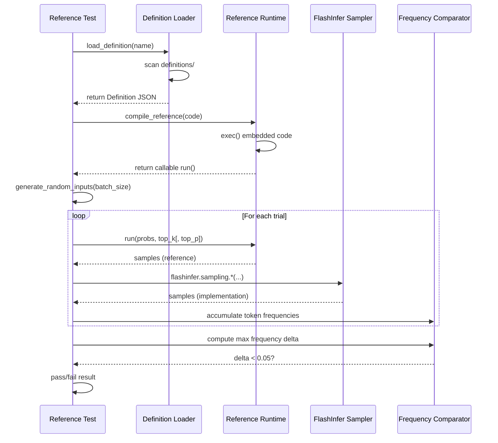

# [PR #381] feat: add sampling v202048 definitions for Llama 4 Scout/Maverick

source: https://github.com/flashinfer-ai/flashinfer-bench/pull/381
state: closed | updated: 2026-04-13T15:18:04Z
labels: 

## 正文

## Summary

Adds three sampling kernel definitions for `vocab_size=202048` (Llama 4 Scout/Maverick). Llama 4 uses a distinct vocab size from other models (202048 vs 151936 for Qwen3, 200064 for MiniMax M2), requiring separate definition files.

**New definitions:**
- `top_k_sampling_from_probs_v202048`: top-k filtering + multinomial sample
- `top_p_sampling_from_probs_v202048`: top-p (nucleus) filtering + multinomial sample
- `top_k_top_p_sampling_from_probs_v202048`: combined top-k then top-p filtering + sample

Each definition includes a pure-PyTorch reference `run()` and reference test using frequency-counting correctness validation (5000 trials, max frequency diff < 5%). Shared by both Scout (16 experts) and Maverick (128 experts).

**Also:**
- Updates `docs/model_coverage.mdx`: marks sampling rows as 🟡 for both Scout and Maverick sections

Tags: `status:unverified` (GPU validation pending), `model:llama-4-scout`

## Test plan

- [ ] GPU validation: run all three reference tests in `flashinfer_trace/tests/references/test_*_v202048.py`
- [ ] Verify frequency distributions match FlashInfer sampling API within tolerance
- [ ] Status can be upgraded from `status:unverified` to `status:reference` after GPU tests pass

🤖 Generated with [Claude Code](https://claude.com/claude-code)

<!-- This is an auto-generated comment: release notes by coderabbit.ai -->

## Summary by CodeRabbit

* **New Features**
  * Added three new sampling operators for Llama 4 models with fixed vocabulary size 202048: top-k sampling, top-k+nucleus (top-p) sampling, and nucleus sampling.

* **Documentation**
  * Updated model coverage documentation for Llama 4 Scout and Maverick models, now reflecting availability of sampling kernel definitions (4/10 → 7/10 coverage).

* **Tests**
  * Added reference validation tests for the three new sampling operators.

<!-- end of auto-generated comment: release notes by coderabbit.ai -->

## 评论 (2)

### coderabbitai[bot] · 2026-04-13

<!-- This is an auto-generated comment: summarize by coderabbit.ai -->
<!-- walkthrough_start -->

<details>
<summary>📝 Walkthrough</summary>

## Walkthrough

The PR introduces three new fixed-vocabulary-size sampling kernel operator definitions (vocab\_size = 202048) for top-k, combined top-k/top-p, and top-p sampling operations, along with corresponding reference test implementations to validate correctness against the FlashInfer library. Documentation is updated to reflect the new kernel coverage for model support.

## Changes

|Cohort / File(s)|Summary|
|---|---|
|**Documentation** <br> `docs/model_coverage.mdx`|Updated model coverage table to reflect the addition of three sampling kernels (top-k, top-k/top-p, and top-p v202048), raising coverage from 4/10 to 7/10 for Llama 4 Scout and Maverick models.|
|**Operator Definitions** <br> `flashinfer_trace/definitions/sampling/top_k_sampling_from_probs_v202048.json`, `top_k_top_p_sampling_from_probs_v202048.json`, `top_p_sampling_from_probs_v202048.json`|Three new sampling operator definitions with fixed vocabulary size of 202048, each specifying input/output tensor shapes, axes constraints, and embedded reference implementations for per-sequence probability filtering and multinomial sampling.|
|**Reference Tests** <br> `flashinfer_trace/tests/references/test_top_k_sampling_from_probs_v202048.py`, `test_top_k_top_p_sampling_from_probs_v202048.py`, `test_top_p_sampling_from_probs_v202048.py`|Three test modules that dynamically load operator definitions, compile embedded reference implementations, generate randomized probability distributions, and validate FlashInfer samplers against reference implementations using frequency-based statistical comparisons with a 0.05 tolerance threshold.|

## Sequence Diagram



## Estimated code review effort

🎯 3 (Moderate) | ⏱️ ~20 minutes

## Suggested reviewers

- yzh119

## Poem

> 🐰 Three kernels bloom with vocab fixed at 202K,
> Top-k, top-p, and blended filters at their peak,
> Reference tests now verify each gentle multinomial draw,
> Probability distributions filtered without a flaw! 🎲✨

</details>

<!-- walkthrough_end -->


<!-- pre_merge_checks_walkthrough_start -->

<details>
<summary>🚥 Pre-merge checks | ✅ 2 | ❌ 1</summary>

### ❌ Failed checks (1 warning)

|     Check name     | Status     | Explanation                                                                          | Resolution                                                                         |
| :----------------: | :--------- | :----------------------------------------------------------------------------------- | :--------------------------------------------------------------------------------- |
| Docstring Coverage | ⚠️ Warning | Docstring coverage is 0.00% which is insufficient. The required threshold is 80.00%. | Write docstrings for the functions missing them to satisfy the coverage threshold. |

<details>
<summary>✅ Passed checks (2 passed)</summary>

|     Check name    | Status   | Explanation                                                                                                                                                                                              |
| :---------------: | :------- | :------------------------------------------------------------------------------------------------------------------------------------------------------------------------------------------------------- |
| Description Check | ✅ Passed | Check skipped - CodeRabbit’s high-level summary is enabled.                                                                                                                                              |
|    Title check    | ✅ Passed | The title clearly and concisely summarizes the main change: adding three sampling kernel definitions (v202048) for Llama 4 Scout and Maverick models, which is the primary purpose of this pull request. |

</details>

<sub>✏️ Tip: You can configure your own custom pre-merge checks in the settings.</sub>

</details>

<!-- pre_merge_checks_walkthrough_end -->

<!-- finishing_touch_checkbox_start -->

<details>
<summary>✨ Finishing Touches</summary>

<details>
<summary>🧪 Generate unit tests (beta)</summary>

- [ ] <!-- {"checkboxId": "f47ac10b-58cc-4372-a567-0e02b2c3d479", "radioGroupId": "utg-output-choice-group-unknown_comment_id"} -->   Create PR with unit tests

</details>

</details>

<!-- finishing_touch_checkbox_end -->

<!-- tips_start -->

---

Thanks for using [CodeRabbit](https://coderabbit.ai?utm_source=oss&utm_medium=github&utm_campaign=flashinfer-ai/flashinfer-bench&utm_content=381)! It's free for OSS, and your support helps us grow. If you like it, consider giving us a shout-out.

<details>
<summary>❤️ Share</summary>

- [X](https://twitter.com/intent/tweet?text=I%20just%20used%20%40coderabbitai%20for%20my%20code%20review%2C%20and%20it%27s%20fantastic%21%20It%27s%20free%20for%20OSS%20and%20offers%20a%20free%20trial%20for%20the%20proprietary%20code.%20Check%20it%20out%3A&url=https%3A//coderabbit.ai)
- [Mastodon](https://mastodon.social/share?text=I%20just%20used%20%40coderabbitai%20for%20my%20code%20review%2C%20and%20it%27s%20fantastic%21%20It%27s%20free%20for%20OSS%20and%20offers%20a%20free%20trial%20for%20the%20proprietary%20code.%20Check%20it%20out%3A%20https%3A%2F%2Fcoderabbit.ai)
- [Reddit](https://www.reddit.com/submit?title=Great%20tool%20for%20code%20review%20-%20CodeRabbit&text=I%20just%20used%20CodeRabbit%20for%20my%20code%20review%2C%20and%20it%27s%20fantastic%21%20It%27s%20free%20for%20OSS%20and%20offers%20a%20free%20trial%20for%20proprietary%20code.%20Check%20it%20out%3A%20https%3A//coderabbit.ai)
- [LinkedIn](https://www.linkedin.com/sharing/share-offsite/?url=https%3A%2F%2Fcoderabbit.ai&mini=true&title=Great%20tool%20for%20code%20review%20-%20CodeRabbit&summary=I%20just%20used%20CodeRabbit%20for%20my%20code%20review%2C%20and%20it%27s%20fantastic%21%20It%27s%20free%20for%20OSS%20and%20offers%20a%20free%20trial%20for%20proprietary%20code)

</details>

<sub>Comment `@coderabbitai help` to get the list of available commands and usage tips.</sub>

<!-- tips_end -->

<!-- internal state start -->


<!-- DwQgtGAEAqAWCWBnSTIEMB26CuAXA9mAOYCmGJATmriQCaQDG+Ats2bgFyQAOFk+AIwBWJBrngA3EsgEBPRvlqU0AgfFwA6NPEgQAfACgjoCEYDEZyAAUASpETZWaCrKPR1AGxJcAZiWpcaLT0iGjM3B7wGESQEgBMAAyJACwAHJBKPlHq8PgYyD74fAAyHmFokMmQAMpMeAD0ALJoUhTwDADWkAAUtpBmAMypAIwAlEZQAILByLiwFCQk9mERUTEdlOQeGSRZGDl5s86k4tGx+AwqAPqI8ABeJAC8iSnp3aXllTV1uE0tlO0OqMOAZILpIARuFcOjcVpFolcfBQWFdeIJEFd4kkEmlIIAUAgh+G4YC6WQ8NDaZwA1JBmNhyVEWPA0NtQuF4URQeDIajYey1ojkcxUciBBisa98YTidwehhsAwvNhEKNIGSKWtIDS6QyMEyWct+dEuVAeTCeVC2asEUiUWixZiXjj0gSmMw1OR6JCSRDYGRpWBZeqAdTDdbOVAAKJoBiwHZ7A5YKKK7BKZAVbjYBZgKyyaBFWOQBZ+BYYBhLCjYDDdVWYegVYuUMjliHSXC+6ixFnwWjUaQKCgLMTkRAyeRIkgAR2wzdkYDqGFOMXwrUgAFYEpuIW0WcgAO7qOMVZhoAAe8DpzDVC2ns4y8B8JebSwIXioZaW+B8kGAa4ApBoBhQAAIrs2TiIc6ALCgi5kEoXr4JAAhLIgsDOHQSHyAI+BzN8+B4D0wwAGyQCQp7cJQuAqugGD0M0rSAoRcTpGRFEUFRoyASBFyOOw1C5Fg2DcL2NBcLQFyIPUzCKCQHhXEwrRoKQGjMLQp5SlaHJFvge7ICeFAbPWyCALwbgCH+2qRRIThca1Ph7Z1pA9EAp09iiBB+RcdYdhsLgQTUGgXCIPhFAtgI76Fn41D1B4ZQnskYCaWsYASs6kCAEmEELHCQ7YnlEADcOBzJZsiyPAsDYJgRAFQwCx9vQLxEWAOJgMMAzQEkHBrsMHAJMMABaBWIL5uDKvwFEYJ50BKem3CrHQgXDcqHBVgxWQYd0ADiVgAKpdpEIkCTwcFrKMAA0tIyR4HAxeUYDxYgPyAQY0BtjwZRYN0kRDRhURecCQGQFtu0SN2B15FwlZYHML7zIsRa7E2H6tkNyC/T4ZSoVEJZXLgVDlvUNAo/UjaluWkmE7gVwAFSOtiaQaNwsieQAagCPjjjeM5lvItBILj8ACHgAl6dQhYAGIY7AACSGAlmGWmTFYUuQAecy/a+ygfp523cEQVBKPYi0FEKhvUEtK1s/AGEEKbI2IBwJPPugPgUoDO3I1RPBoKOT36MY4BQHB/DfmgeCEKQ5BUDQ9Bumwi5cLw/DCG5kj9nIChKFQqjqFoOh+yYUBwKgqCYIV4dkMo0cKKw7AQ2ge72I4+lYfITCZyoaiaNouhgIY/umAY4kMJJ0lKHJCnKMpqmniCABE88GBYkCTFLxAV1HGEOE4LjB4waHRNIRgy76SxU1THwnl8tkEcMADsABCLVEZGZ80fQZ8XxUVROW0Ll34/wxmIvypq5MQwtzrQ19AsFCcJNQbAoFseM4FhY9AAAZmj5OGQUdpRTiidGkVB510FEmhDjEhlpYE2iFCKdEtNXiEMgMQqEFCjREGwcKe0eC6apFQaqWMlUUJG2vCwSAZ8VCIHYFJJAtwzjdFQYAGXJeGvxtmfXg0hJFMBim5daqCzJKKphoSAABhIoCxEDcDyLzaIHhZAQL9LbDCE8qCkEgEJES/ZbRXjPlUeokBhgJGUYhM+t9IC+P8a/R2H56CZGQZBQofBsK4VHrJRA51VZxkgcwaRmovrtjcXVQkkA9SQA8HkUgfBkweFTEsQAOASJTOClNIgBcAjfoUqI30giMBZNsOyoiqbjSsTEDaABFSYXtSD0G4IgIiVQQY7kXIgM+hiAByiFrKUEygILw2ldL8D4ESCEsgKLpmgvwg+9B1b2NQjpLAvNHxPXMJYSY5JK4oJtpApQipnD8Ugl+Ui5EihV0spmLZ7RSKLhyIfAGyyADyyzIw9CHrxRcPyMBgDyDYveAjxgGGKFEfsZyJlcCpKkeoYBUhGEjENC8BS24VhIBIK2DddjxM4I5Og8BHAGHnrPCYA90bewQLLSgOM8YkHqDE/Y7lJL1KIATEhMJZXsJoQ6RpqQNBCCChgOeC8l4rzXpHApW9m670JYfaY8F0BFJIA3IkldLKSsTJAAAUtUOFap4DbKYaQpVniVVcPoa42iGzUECsxsKigoqYzisddK+osr6ioMMVLdskr+wVFlWNNBJDcBHO8JAWesrZ68I7O2XyGxkCoM4ag+waEKL0FQQAbQEKLWANx7gkHOhIC41xbgPAALo1rkejfA1ABhxBLQ5b1HQa2oTQPWxhzbW3toHUO1BURcDjt4edBydlMye1QZpaQs660YSbS23AsYV0kEHWgjdMzeGGLgJ+Ni1BLJZFPP2VB3bLgCGvTW72VqmD5F8ouPaM5GH4J4edSp1T0xYFYpEBg6h4ZPiRheCIJA47DQEgnSgCUpxc3LDB9sRJ3LdPkBsEgUz+AYExZA1BM7IAICIH6IagZRQqE9eoeQBANhJlou0aQ51SxFBPJEB4sx7HBgWNEvmbRBbuR3bRDIVBdl5BfPgfjMElDqUZRUYhIVYAqXpKcfUHga3pPhhEaN2Hk32Q8EFGCKY0w0XQKOSih05idkgVEfdjCf29o7TWwju5IPcIYQ5Ni8TmDIGKTJzUe4/RYEYzW1Aep2zpN+qg7oCQu09r/X2kgowk1GEecvF5Uc3mIQ+aIMoVXfnflYoCjCwLsCgoYOC8Q4hD5QGWTasa9q+CxsOkEeCXBQ2SyxiK3G0aJVgSlcLeNlC5UYN9dQzhdDnQaq1ZZw8WaMBhCWNOzBHJlWbbVUO5r7EML6aQYtvItJsp+V8owrIVx53wA4GGoVJYNCyo0Gtlb53cGPoBjC19BA+C3CIIdka0FuggqQ/YWMWG0Cqg3ciWgCp5omkgDLfd9tGGcN8KUsdcQl2XrbUV86UHB1ELNFwDd47KdXqK4OvHMK8CE4m0eon97kis+px2jnYIpifqJ6gi9bPgs9DmWdALBX/09GA0NcL9CcVL2aPsPwauxaeqWJMQ7NiHgUCMHikcWLznErSGShIlLqUnirnS+GjKBsssBVwYoOluULyAvyqbEao34xG4cZbrD5VQnNOQ07Ao/UXagzt8GvveV6tXhHSum8m7OHkH8s1iADAWowhUcgtrIcOoW06117r4mMIwRaWPVCcG0Muz0WVGOUs/em5G2bIfK9xoTUmmA9jQ9YHMaIB8Vt0wes/Q2wLhXZdnlQN0KDtYVPNYkZW6XwuHgAen3M5kWylhL8QPZnYXyzEwUJxZPgVbQdoJHeTvbuE50UUXdv69+Xf3XsHQr6da7mcJ0VZ9tX9jshcf9t1WlvVuA11H9N0gCrNQD39l12dICHJS490CJD04Rj071FwH1gCX9T1kCqcIDOJh8lgsNkJggMJIkWxSkiAwU0waoBZ+w2IwBt8CNbwkYEszg/lIF7QuNIhc1Yg3JLJlRNRvQuhVdZsN0Ch8AYodIMJ05vRZRuh5RFQSBlQ+FDhZCFlzp95aAtJoCfxHhIAEga104JEvAwEzhUFjgTxTxIsVM9gKN5ZNQJCzgdQzMskDRPET54Y9QKBxMO16AZMMJeYhoFMhY8gHlF4nlKtUVZgasR86tvlpVd5rsgU+AkcwV2BIUC8+sBs7Uo4K8Ex3J0AaDaAJt68Y91tm9VUoMh0yRjsu8g9e8Y1+8lsE1ajmFG82F49cEtt6ZNU8gS0rNcjOsN1KAfBo0QQxdl4JcJsP8ish15ciF59ldugZDIAzDV88cCc8B7YuQFi790RUEJs4Ct0SCZcHgv8gtV0TjwR/8JtACa1z0UCRdUEnioBoCLi3syd4D3jwDUDOduc8B5iwRni+d/j118DkhgSVivjyttcHxXp9dtkjcWRZBTdzd8VkAzVqitQ1w1w7cHdxAndHEZJXcmVSJHxPdIBvc9wU8+UwAjA2jsYOj5tyjuiVtI9eR6iOEhi1Uk9tUWS08DVM8Qhs8d48995SAC9C9rUy8ht7snUWiUB0wqib8686jgdBiW8mjzpx9kN2ZNQM0Vss1vN2xosxNkB2CJFuCWwNClRkBuhVDVRM1Hs/MCJBC1BhCeZ5MBYYj8hCCjwZ8z1NjVjd5E8KDBtSjhs0jL8zixQ98rUPjSCadzhv9UCATR0gTWx8hLIp0LQ0yDMQSvi8yn9CygoKBlNJksccdK0YT3N0yKzV1GEBca0aAiyKAn17E0RGVLU6ClgGCwUZNkB/BCw/TuMRDkQG504KgGBHB6R+IpAeBON/SeMoFpBYAFD6A5FSzgQVZktdTmFTDzCGEUMlAM8N5kjGEHCzxUECokt/QTDgA/Erz2xazPYZzhCp8dgHpjpohzo3R9101jFgIxZzoTxEAOhkBek+MyB9w9yJFGAVyyhxB1zYLJzTxyw6BK1SyTyDcNz1EKBGUzhIEsgKA1ckKoY0J2wap8APMpMYYzE9yPBaARMyAxNuxJMAiFhcp9gzg/yCj6yT4x8cCELyBCRtMohdNYhmRaRTNGRfDWRLSrMFgbNyw7Nl4ENyIkMUMZDMBGK/QXJkKsx+xfMMB/N59Vyd5eY45bhHsndUdkBE8yt4iKsKQkjClasL9fK/ksjWscj2tkd8ietFSphtTS94y31EyeTwYATBVu9g9OjEr8hw9wx+SWEsEDTGjuFRTviFjQIL9+wDlUFDs2BYSG9BT/VhieFOdZQYc4dLKehAM00Ll6KlgWj/ooTwRDiqJIT+rfiSc1RASWckS7jIA6dir+rniLRSd8zJrPjHiRrIAudcB91hqoTfi+cmd4T2yb1vivLUTdd2wMTDdjccTKA8TLdCSbdSUmpySaVndqSFg3dmV6T2IvcfceVWT2TA9OSxUCY2xJIRzyY2wyEo9+iQdDTCrGYdVU8nl0914jUZTc9vx88jALVp9YrcwiosARyPYLpscvUOSZsQaKZwaEZSZpBQahpoafV9SNthTE9GZuyGK9oew+xK0Ka+yAcgdWE4bUz0AiBtAQMrViaMMvBsNUUdT597AO11dnQh9n0SaydaB4M4qoc1SKjq9llhErwKhSlLhthUFR9EAa1eYhwodbFq5uADdWK9aBJABMAknPdDoEtVQRHJrRd07EhgpKWDu1QTIlEG7LWQEF8l+iXO6RUC9UhmcPoFvN5qLDrCZAeC6v81EpEJ7NrPgwbTNG7OQqKGkrdl2m6DgvgFmkkPsQplaQWHh2EpiFQTFl3BIDS2/CMW2mAjGVQCrBaG0DKCP3ILFksinIyR3A8BIyLCrBkGsgEtpqdiPT4AcgY35tnRwLrPQAYGXJ1H4hEvwzovlh6s5mbAAtrwnqQlbVIllvYB3uRFHF9HwlCFogQu/HUFeUOEMUmBdg2UgX5l3BnrArwCsvsUcIvEcHQDFAUNAfvEfERlCmyj3EWCJqXqRgcn5tkv9AnCdIAu6DMX5jEGthqy02QrDKKTyDAHICIEiEYKPw3MECEO3JwoVzAvQlRnsnFvaXsh3OuU4rQQ/ISA0ASDXEgN4DkKOgoHnDyCyCICzHlu4G9kklmM9VtmVHEqUj1hIHFsJnhgcHJHTCYqfu8Oru2U4KKwJinpkarEYtkfgHkYa1DJjsYSEprBC0XB3gsQ3TiL1USIyPeVSICoyKCoBRu3oDaw6y6wKImEgH6wbg1LG3mmSvDWBrm2puJnQbJgZspiFrytZvhteAZlkDmqKISarDAUeySaJNQU1quFH3UKOwWgoFVF7kgFAgytKbiYGx8AqYqOqYmzAoNyuBHIIayZIHkhkmaZKzx3ibVD6dGyqImxTpoBGfTuFB9Kom6Cms7XvCiODPckeFngojQEMlnnOiUEZXLCOeXN7FnhmYWLmd6bLH6aWbryhqYEHDchHEQG2dWqeGSHOnlGFEAcc0eA3E3AefBCeYWaqbedQTcZmdOswDRL1xIqxJN1utxXxKtyJS1AAE5hgySDAqUKTaV3qGVaSPcfr2VeYuV/r/c2SDB+a0qcmaa0NsmKYmbo8+i6qE8EbZAkavL9UVms9t5MbcWoUi96xlTUNEGXxXoHo2huB2xJsUr2iqawbMmOX6auXeiBSWaGiA1tsObS1ub3FkAJZBUZYSx3bGFBaFUmbcqzt8qraxaJa1cKhaBZAqr2g3ChmvB6Bpb2QsM+IKjNaMJ/CKgDaXbvTurGFLbrb4BbaigmY4z67NbnaSj4rY2sArDLgMBm7G4BAbaxC2gPFLJMlW1NRUFgAqqSA9AirQKWBHavBnaqCvbaDxmM5g6lLQ7P0GAI6k5o6sADNE75mXmBJxLRXkBEAfXoZxBOt2Dt9GGW0tyRDIj+ZFMUE5EgoXZHCa0VwNl3xxIrwxzPYrMyMBIDQakTnDIWlsJmKlwFcWQykKGT2RF/8oCiKlGqAfJKBT9IAx6+Ar7QWZ7IZ57cJIFiaV7WlIErXUIbWNlYPHtIE2QlhNnUkd697Vy9Hj7rCU5HtcGiMAKN1EJ2C7L6tW58JYIaLNG/7V6YptxmRHMHbQHnaIHLxoGgoqkaBrxCM7w7kdWkJkHUG5W6bWkEPpYI1+BVx2By2UKmwAjNnV3mGRD0sqGaG6GBYvAz9Pl6swGKwqwvYPN6BXz6LUBOOoGhP5XNSRPSkG5UFhHRGGEJGFkpGZHZYHGFGKilHRx6hVHtgsZ8BxLByewILjUc8H7mK9IVLMNr6qclbJMrGWOFBbHAOpYu6e6+7kAB6QZPV47dmUM3PPYKg9xnAi2HIq6aMAHXp05G6swi3W727Ssys/GfKAmUilh9P0iUFQmLFwm9keAwq8iIVIrYnpXZXvQvApBthnnKnnHO8gbKb0mtWIacnuWnXYbXWGrimLi8danR1aB6mui8hGm2BpndA9B2nTuMAunUEA2JnRmRzJmlBpn7vRW1naIURMO/nMyO0Lmgzt28gjm726BzmdgrmnhZ5bm0B7n7uuXPnbafm/vbiAWgXHBRUWPEBwXNwEgoXfjEWTqtcUXzqgP0XrrcTsX7r5TkmqR8W4hiXSXXqqSDYPqqXvq2UAAJBx2AFkxlwG9VtJ/GDJ9bvVvU4WnbkUxG8UlGyUjeaU8V01WnxUybkvAbYm+u0eekVo5bnvTVomMXqG2qw1oUwpk1kp/shVtXU21O6Nt1Q27Nio0fIpI7QuiX/Jo1hqmtKsTOReixW4O2u1i227t10tsQVNi5n1sIP1mKeQft8O520fYP32ntwpQQEd9M8d+bpTVpGd4xbL9FOjeQD9rJTO1T9d+QTD2tedM9I62nbhW9TwmIPd3ARwjCc9+0qpe0/DectO77q8P48DfsbLRtYR4Yc6YR/FwdQxYD0iGMSeljmevnI2xe4TmW0NlFfplwk2NV1Jygf7FbQHD3l1gp1MmDMsQS9gHv6R4+4ju8BcCkLD6GLAEBvRrDR23+A0O/s+7mPZrdkMhlzsbhAOGARKzsbRga8dT6AnP/jZwk7IRcAKDf0MTQcgb85aFRI9nwDor7h9seoNFFpwcY6clgOdeQHIk4SQBruwwEgGACIiQF9IHQWutb3sj2llGGEczmALPDwN1+MgWSDpEYTOcxGP9VxhLXcYTsFus9UMqY3i45YdmGPEFlPRVB+17GjjJIudBK439POcjfRqZiw5RZKQpXD1MbhM4SIY4NHTQPjiy6907OeXIeoVzsRMCNykjMrhV3NIqYGuCCStG3Ucwd02kgmS4Hx2q6O1ogvjBIh12qwBEeuTjd+v8gG7ZFhuUTCKlPgm4xUBs2vcmnr1Zai9xmkNRmib0l5n9jW9MU1lZmhhoVJiXSG6EfmOKnE6mDTetpdzaYdNYkd3A7o9xGbjMxmOrV7vmiiIE9GEn3UvlcF+6yD/+0RQ5sc38BnMLmlLa5jD1TBw8+h6CD5qYm+bSBfmOzR4ICyKSY9QWOPCFvj3u5E8USpPdEhT2xJU8LcBKWnkSRJT4smejuclmz0pbu5OeXAHnqxn55+wDABccFBExDhhx5e5LGuPHDToNxIuO8dOHSizidxc4PcQwD8NjjqAhhWtdoZ9ToA3BfI7EOEf3CgCpAEguwfFrQH8Q+AGAa4FlGuFoA4gqB+LWYgkCIgMABAwwAQD4DpFEQfAtANcERBID4sqgXwhESwCySUwewGIdnjanRFBx84AcUilcDYAUBSA8kMyvBQxHOB2wXwgAN5chZ4SAWwPfFNqGQTEwI3AFYCfbg9fA7dU6JqKQAwpWgbQGghgFnhmjvBFosELPCHj7NogJiRSKQBlgUhjc1QYaCQAdGQANR/VWeCyy5JZCdWOQ3Jo6z5Zs0BWQYkMfNVngEBfIHgMWLC3yBBi1wzo5MTn2FgAB1Q8MBAkj8xogiAIMfbn6oABfXMS6PDEG8qI2reVtGM255DPeZvAqkU0ZiJiniLo1MSyAzGTtDg2YusVCTDGZjEARYuYCWOHhliiAFYrgFWKhK1iniYYjIRGLW7ZCNu7Y0/l72l6yBex81AtAOPTGTjRxfYgtPmMODTjYAs490QuMrFPFqxXIVcS6LpQ2AO46gAsciBoBWAKA7gXAF4CDGzEnRmo65PSFoC6iLgHQWwCBPNGajeYtAGwFWFnH+jKQC4oxIqKDG4wZwuY10T2BQkYBAJXgLCaIA6A4TKwnaRCYRNQnSAWCKrASGRM6DwSwJLo+EIZClijgZwiAdCUGPnj4SMYuAZiR0BsDSAdBQYxtE8STGhjUcnQZZEdn4mgQlW1dCoiJPOaXjC0RsSiXhM0mIZMAqKfiSJPsAMDZoGEKACYiUCfjs4uAO1ixlgBgAZuskRuEr1QBkBCutADQBpOPGzxkk/E8rggjWDeTkxRQQgcbhEkKS2A/E5gsq3ci8oaxY4mSeOLkkdBIpgYrgLPBIlLAUpwU0MUNDNiLjtwuknyfpLhwCR+J6tbrNsk0LOBMUDkYDMhmsLyBwRHaDjhLUlaBBggtdaBO4TODwJEEltOXKvh1Kfwr4PwVpD/EYjJJHMaSBAIWFQACE2gJqTMBQAD6fhvwase0vSG2Bn0hoXkscS6L8kZSApzdXKeOKHDKDLKrEiRAdILShTGC4UxUWlP4lVTAxz4xKZpJSnPSMp94+ccYkwFKRAxt0rSQVOunUSSpBlAyXFJ+mliMJCgL0Rh2QDOcEgf4YivNNRj5BsAj4doFbEXBW94Y04ZNtbFhj8MLkyAPESIxRn7TNJZiWBtDILQ/jP6GQWGWsHkJYDpMk42kNkkop+grwNsUIOIEQDswAiTiQGXww4qeSzph0mSP5JcHRApZd0toA9JZARTFJGUt0fOIrHPiuQ/aQSd7CNE2BlJDE+mbPFSADBGRqQC2YsDSBUCfAcQNAPiwYBEQ4gELAYL2BmScj8WQQZILQB8DJAeRHcAYAwHxYCAiItAAQAMGGD4s6RwwBgKkFoBEQiIaAAYERGCmzwhJtgLKfxMfA8iiIqQOIAIFvjJABADAW+HfFoC70i5/iEgHEHxaEs0At8BngkD9kMAEgKgOIB3JICpBkgcctcCW3xYDBb4ojIeSQCIj4siIVAu+LyhfHfCpRaiGUZQHlEpSMQEo3uLPIgBlxUQocCRMqNWb5SsR6o9OfrKsDby6AkwXAGJLRG0ADRgokxLYwdEJAZ5Pw0OAQC3nKgJm+U1ZqvL0BAA -->

<!-- internal state end -->

### yyihuang · 2026-04-13

Closing in favor of per-kernel PRs: #391 (top_k_sampling_from_probs_v202048), #392 (top_p_sampling_from_probs_v202048), #393 (top_k_top_p_sampling_from_probs_v202048). Per the repository convention, one PR per kernel definition.

## Review (2)

### gemini-code-assist[bot] · 2026-04-13 · COMMENTED

## Code Review

This pull request adds support for sampling operations with a vocabulary size of 202,048, targeting Llama 4 Scout/Maverick models. It introduces new JSON definitions and reference tests for top-k, top-p, and combined sampling, and updates model coverage documentation. Feedback focuses on optimizing the reference implementations in the JSON files to use more efficient operations like torch.topk and to avoid large memory allocations, which is critical for performance given the vocabulary size.

### coderabbitai[bot] · 2026-04-13 · COMMENTED

**Actionable comments posted: 7**

<details>
<summary>🤖 Prompt for all review comments with AI agents</summary>

```
Verify each finding against the current code and only fix it if needed.

Inline comments:
In `@docs/model_coverage.mdx`:
- Around line 568-572: The coverage totals for the Llama 4 rows are inconsistent
with the listed definitions: the rows for top_k_sampling_from_probs_v202048,
top_k_top_p_sampling_from_probs_v202048, and top_p_sampling_from_probs_v202048
(and their related GQA and rmsnorm rows) show eight non-MoE definitions, so
update the Coverage summary text that currently reads "7 / 10" to the correct
count (either "8 / 10" if excluding MoE rows or "11 / 13" if including MoE rows)
and make the same correction for the repeated summary near the other Llama 4
block; ensure both occurrences of the Llama 4 coverage summary match the chosen
interpretation.

In `@flashinfer_trace/tests/references/test_top_k_sampling_from_probs_v202048.py`:
- Around line 41-44: The test only generates 10 <= top_k < 500, so extend the
generator around the return of probs, top_k to also emit degenerate/invalid
cases: create additional top_k tensors covering k <= 0 (e.g., zeros and negative
values), k == 1 (ones), and k >= VOCAB_SIZE (e.g., torch.full(..., VOCAB_SIZE)
and torch.full(..., VOCAB_SIZE + 1)), and include a case where top_k equals
VOCAB_SIZE // 2 and extreme large values; ensure these tensors match
device/dtype and are returned or parametrized alongside the normal random top_k
so downstream tests exercise all semantics of top_k (refer to the variable top_k
and VOCAB_SIZE in the existing function).
- Around line 47-81: The test_correctness function currently returns a bool and
returns False on CPU which pytest ignores; import pytest, replace the device CPU
early return with pytest.skip("CUDA not available") (or add the appropriate
marker), and replace the final boolean return with an assertion such as assert
freq_diff < 0.05 (or assert passed, f"max_freq_diff={freq_diff:.4f}") so
failures fail the test; keep references to generate_random_inputs, VOCAB_SIZE,
run (compiled reference) and flashinfer.sampling.top_k_sampling_from_probs when
locating where to change the control flow and assertion.

In
`@flashinfer_trace/tests/references/test_top_k_top_p_sampling_from_probs_v202048.py`:
- Around line 41-45: The current test input generator only returns happy-path
top_k and top_p; update it to also yield degenerate and boundary cases so the
combined sampler’s edge branches run: generate additional variants where top_k
is 0, 1, equals or exceeds VOCAB_SIZE (and a negative or very large value if
supported) and where top_p is <= 0 (e.g., 0.0 or -0.1) and >= 1 (e.g., 1.0 or
1.1), keeping dtype/device consistent, and produce these as separate test cases
(or parameterize the generator) alongside the existing random happy-path values
so the sampler code handling invalid/degenerate top_k and top_p branches is
exercised.
- Around line 48-82: Update the test_correctness function to use pytest
conventions: replace the CUDA guard's "return False" with pytest.skip("CUDA not
available, skipping test") and replace the final "return passed" with an
assertion like assert passed, f"batch_size={batch_size}:
max_freq_diff={freq_diff:.4f} FAILED" (or similar message using freq_diff and
batch_size). Ensure pytest is imported at the top if not already and keep the
existing computation of freq_diff and passed; only swap the return-based flow
for pytest.skip and an assert on passed.

In `@flashinfer_trace/tests/references/test_top_p_sampling_from_probs_v202048.py`:
- Around line 41-42: The test currently generates top_p only in (0.1,0.9) so it
never hits the special branches; add explicit test cases that set top_p <= 0
(e.g., 0 and a negative value) and top_p >= 1 (e.g., 1 and >1) to validate the
argmax and no-filter behaviors respectively. Locate the top_p variable in this
test (the line that returns probs, top_p) and extend the test to call the
sampling function with these boundary top_p values, asserting that for top_p <=
0 the sampler returns argmax indices and for top_p >= 1 the sampler performs no
filtering (i.e., behaves like sampling from the original probs or preserves all
tokens). Ensure you include both boundary and slightly-outside-boundary values
to cover edge semantics.
- Around line 45-79: The test_correctness function currently returns booleans
instead of signaling test outcomes to pytest; change the CPU path to call
pytest.skip(...) instead of returning False and replace the final "return
passed" with "assert passed" so assertion failures fail the test; if the boolean
behavior is needed elsewhere, extract the sampling/count/frequency logic into a
helper (e.g., compute_top_p_freqs or helper_test_correctness) that returns the
bool and have test_correctness call that helper and assert its result.
```

</details>

<details>
<summary>🪄 Autofix (Beta)</summary>

Fix all unresolved CodeRabbit comments on this PR:

- [ ] <!-- {"checkboxId": "4b0d0e0a-96d7-4f10-b296-3a18ea78f0b9"} --> Push a commit to this branch (recommended)
- [ ] <!-- {"checkboxId": "ff5b1114-7d8c-49e6-8ac1-43f82af23a33"} --> Create a new PR with the fixes

</details>

---

<details>
<summary>ℹ️ Review info</summary>

<details>
<summary>⚙️ Run configuration</summary>

**Configuration used**: defaults

**Review profile**: CHILL

**Plan**: Pro

**Run ID**: `8689cf6a-6f09-4385-851c-80c393d84d96`

</details>

<details>
<summary>📥 Commits</summary>

Reviewing files that changed from the base of the PR and between d3f798c3afd0e23797c13647120123ac2a5279c4 and 80ef9d10fc5eff5d041e9fa06cb1bf066fd56e94.

</details>

<details>
<summary>📒 Files selected for processing (7)</summary>

* `docs/model_coverage.mdx`
* `flashinfer_trace/definitions/sampling/top_k_sampling_from_probs_v202048.json`
* `flashinfer_trace/definitions/sampling/top_k_top_p_sampling_from_probs_v202048.json`
* `flashinfer_trace/definitions/sampling/top_p_sampling_from_probs_v202048.json`
* `flashinfer_trace/tests/references/test_top_k_sampling_from_probs_v202048.py`
* `flashinfer_trace/tests/references/test_top_k_top_p_sampling_from_probs_v202048.py`
* `flashinfer_trace/tests/references/test_top_p_sampling_from_probs_v202048.py`

</details>

</details>

<!-- This is an auto-generated comment by CodeRabbit for review status -->
