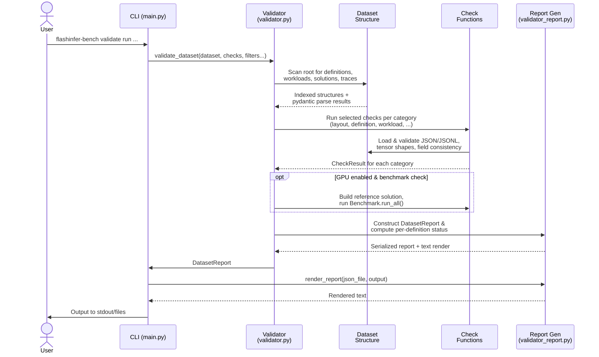

# [PR #385] feat: add dataset validation CLI (`flashinfer-bench validate`)

source: https://github.com/flashinfer-ai/flashinfer-bench/pull/385
state: closed | updated: 2026-04-13T04:53:12Z
labels: 

## 正文

## Summary

- Add dataset validator with 7 check categories (layout, definition, workload, solution, trace, baseline, benchmark) covering structural correctness, schema compliance, and coverage completeness
- Two new modules: `flashinfer_bench/data/validator.py` (core logic) and `flashinfer_bench/data/validator_report.py` (Pydantic report models + text rendering)
- Integrated as `flashinfer-bench validate` CLI subcommand with `--op-types`/`--definitions` filtering, `--disable-gpu` mode, and `--outputs stdout,json,text` targets

<!-- This is an auto-generated comment: release notes by coderabbit.ai -->

## Summary by CodeRabbit

## Release Notes

* **New Features**
  * Added dataset validation system with CLI commands (`validate run` and `validate render`)
  * Seven independent validation check categories: layout, definition, workload, solution, trace, baseline, and benchmark
  * Report generation in JSON and text formats with timestamped filenames

* **Documentation**
  * Added comprehensive validation system documentation with CLI usage, check definitions, and report format specifications

<!-- end of auto-generated comment: release notes by coderabbit.ai -->

## 评论 (2)

### coderabbitai[bot] · 2026-04-13

<!-- This is an auto-generated comment: summarize by coderabbit.ai -->
<!-- This is an auto-generated comment: failure by coderabbit.ai -->

> [!CAUTION]
> ## Review failed
> 
> The pull request is closed.

<!-- end of auto-generated comment: failure by coderabbit.ai -->

<details>
<summary>ℹ️ Recent review info</summary>

<details>
<summary>⚙️ Run configuration</summary>

**Configuration used**: defaults

**Review profile**: CHILL

**Plan**: Pro

**Run ID**: `721289e5-f1c7-4429-aa6d-fd3bdea7324b`

</details>

<details>
<summary>📥 Commits</summary>

Reviewing files that changed from the base of the PR and between 8f8b808874f1bc0da8a099125fc4494f7413761f and a25b77241533877bb99822e4a64225a560be3be8.

</details>

<details>
<summary>📒 Files selected for processing (4)</summary>

* `docs/flashinfer-trace/validate.mdx`
* `flashinfer_bench/cli/main.py`
* `flashinfer_bench/data/validator.py`
* `flashinfer_bench/data/validator_report.py`

</details>

</details>

---


<!-- walkthrough_start -->

<details>
<summary>📝 Walkthrough</summary>

## Walkthrough

Added a comprehensive dataset validation system for FlashInfer Trace, including a core validator module that scans dataset structures, performs multi-category checks (layout, definition, workload, solution, trace, baseline, benchmark), generates structured validation reports, CLI commands for validation and report rendering, and documentation describing capabilities and output formats.

## Changes

|Cohort / File(s)|Summary|
|---|---|
|**Documentation** <br> `docs/flashinfer-trace/validate.mdx`|New page documenting the validation system: CLI subcommands, check categories (seven selectable types), validation rules per category, CLI options, filtering semantics, output targets, report JSON structure, and example text report format.|
|**CLI Integration** <br> `flashinfer_bench/cli/main.py`|Added top-level `validate` command with `run` and `render` subcommands. Implemented argument parsing for dataset, checks, filtering (`--op-types`, `--definitions`), output settings (`--outputs`, `--output-folder`), and GPU control. Routes to validator and report renderer functions.|
|**Core Validator** <br> `flashinfer_bench/data/validator.py`|Implemented end-to-end validator with dataset scanning/indexing, definition/workload/solution/trace loading, selectable check functions (layout, definition, workload, solution, trace, baseline, benchmark), optional GPU benchmark execution, and report generation with timestamped file output under `reports/` folder.|
|**Report Models & Rendering** <br> `flashinfer_bench/data/validator_report.py`|Added Pydantic models for validation results (`CheckMessage`, `CheckResult`, `DefinitionReport`, `ReportConfig`, `DatasetReport`), utility to compute definition status aggregation, text report rendering with metadata and per-definition check summaries, and JSON report loader with stdout/file output options.|

## Sequence Diagram



## Estimated code review effort

🎯 4 (Complex) | ⏱️ ~50 minutes

## Poem

> 🐰 A validator hops through datasets with care,  
> Checking layouts, definitions, traces everywhere!  
> Workloads and baselines, each rule held tight,  
> Reports rendered swift, validation shines bright! ✨

</details>

<!-- walkthrough_end -->


<!-- finishing_touch_checkbox_start -->

<details>
<summary>✨ Finishing Touches</summary>

<details>
<summary>📝 Generate docstrings</summary>

- [ ] <!-- {"checkboxId": "7962f53c-55bc-4827-bfbf-6a18da830691"} --> Create stacked PR
- [ ] <!-- {"checkboxId": "3e1879ae-f29b-4d0d-8e06-d12b7ba33d98"} --> Commit on current branch

</details>
<details>
<summary>🧪 Generate unit tests (beta)</summary>

- [ ] <!-- {"checkboxId": "f47ac10b-58cc-4372-a567-0e02b2c3d479", "radioGroupId": "utg-output-choice-group-unknown_comment_id"} -->   Create PR with unit tests
- [ ] <!-- {"checkboxId": "6ba7b810-9dad-11d1-80b4-00c04fd430c8", "radioGroupId": "utg-output-choice-group-unknown_comment_id"} -->   Commit unit tests in branch `feat/dataset-validator`

</details>

</details>

<!-- finishing_touch_checkbox_end -->

<!-- tips_start -->

---

Thanks for using [CodeRabbit](https://coderabbit.ai?utm_source=oss&utm_medium=github&utm_campaign=flashinfer-ai/flashinfer-bench&utm_content=385)! It's free for OSS, and your support helps us grow. If you like it, consider giving us a shout-out.

<details>
<summary>❤️ Share</summary>

- [X](https://twitter.com/intent/tweet?text=I%20just%20used%20%40coderabbitai%20for%20my%20code%20review%2C%20and%20it%27s%20fantastic%21%20It%27s%20free%20for%20OSS%20and%20offers%20a%20free%20trial%20for%20the%20proprietary%20code.%20Check%20it%20out%3A&url=https%3A//coderabbit.ai)
- [Mastodon](https://mastodon.social/share?text=I%20just%20used%20%40coderabbitai%20for%20my%20code%20review%2C%20and%20it%27s%20fantastic%21%20It%27s%20free%20for%20OSS%20and%20offers%20a%20free%20trial%20for%20the%20proprietary%20code.%20Check%20it%20out%3A%20https%3A%2F%2Fcoderabbit.ai)
- [Reddit](https://www.reddit.com/submit?title=Great%20tool%20for%20code%20review%20-%20CodeRabbit&text=I%20just%20used%20CodeRabbit%20for%20my%20code%20review%2C%20and%20it%27s%20fantastic%21%20It%27s%20free%20for%20OSS%20and%20offers%20a%20free%20trial%20for%20proprietary%20code.%20Check%20it%20out%3A%20https%3A//coderabbit.ai)
- [LinkedIn](https://www.linkedin.com/sharing/share-offsite/?url=https%3A%2F%2Fcoderabbit.ai&mini=true&title=Great%20tool%20for%20code%20review%20-%20CodeRabbit&summary=I%20just%20used%20CodeRabbit%20for%20my%20code%20review%2C%20and%20it%27s%20fantastic%21%20It%27s%20free%20for%20OSS%20and%20offers%20a%20free%20trial%20for%20proprietary%20code)

</details>

<sub>Comment `@coderabbitai help` to get the list of available commands and usage tips.</sub>

<!-- tips_end -->

<!-- internal state start -->


<!-- DwQgtGAEAqAWCWBnSTIEMB26CuAXA9mAOYCmGJATmriQCaQDG+Ats2bgFyQAOFk+AIwBWJBrngA3EsgEBPRvlqU0AgfFwA6NPEgQAfACgjoCEYDEZyAAUASpETZWaCrKPR1AGxJcAZiWpcaLT0tNRoiCS4kBJoHvCh4vhYAMIAMgCSkAAUAAY+HuEIGH4UYAJkDLDRsfHUJDkAlJCQBgByjuUUXADMABwArM0GAKoRXZDDAviI3PAMaEMAyvjYFAwkkAJUGJW+/rgA9AnhkWAxcQn4fIBJhDDOpFFbmLuQzNpYLYu41NiIXPjcMiQQAoBIwKPs6JAAEwABihADYwDCACxgACM3WgKI4/RhOKhAC0jItHG8XBwDFAAILBZALY4RKLnWoEPg+K6QABiBUQsHSxUoMCo60gDMiyFwsGoPEo7IozGQESkWHmNCIV3g0n4PkYsFEAGs/pACrIVrgADSikg+eAYdTwJKWgDuV31HnwQUtiHwHjwDowltwwpIloEJzi5EtmHo5R2sDJ+o0kGSeoYhoUUj4iCD2DEq1iCgo4LE5EQiC9lRIbwUzG4cWeIfQGHoTEzaFINbrkTI0kQGkpkH5QcUua1uBdkHITteI68fwMzSg+UKtpKAH1Y5UjmEDszLhQNNx5KCmODqhdqP7jfgiHMULWvGwMOIMERIJKNkqgZW04w6uqKE1PsF10SBl15VdKA3CpYG3b5dxqfc13Bbgrk0I8QWsWRQmfO9mEUEgPGQOVzxZK8ULQulm3fEgAA8onBZtKFtN98B1cEHA8XBgKgIcSCIKgaAlPVSP3FBn3wd8RLSTJwnQScSGnBwBCYJxm18HkihKMoYNEup+0XZMMnsbBuFQihuLA+AuOY19NnkAFlESLBcFkQFkFyCAATAVz3MaJsQmtW17SSDycggJQbTtZzEEaAzQJpWg6UgcKwFoJAVC8YhuGwHIZyUd9JIobAsD3S8knE5MrGGMAkg8eR8KUeKoBJMzKNebAuPgLt+DwHKom+CgHmQCR4AWVKzX62LICddQqgBGKuGzWgzUtIRvQDGj6P7SkwEMAwTCgMh6DYnACGIHtBMhVSn04Hg+EEEQxEkLU5AUJQqFUdQtB0fQDvAKA4FQVBMDOwhSHIK6WxYW6uCoJTSWceQ3qYD6VDUTRtF0PajH+0wDBWhhEAOcCtMoHzgwQi8aA0ZhaFoikACJmYMCxICpdILshup6AcJwXG1XVMFIRAjESyEFinUV8AYRx2HKrBuHbDYckJ4nScg0ogzQdYqZZEhafpvKlEQBhALUOyP0gQAcAm5Qp+RKIUdZIQBcAlFMJGT05z7FkbMqyTOANkJq0oq1MrWT/JW1DicQtWjfghsweAAC8Fa4dRxOHWhRwlCcZJMlSYejZASo+lKNYFUpNyqcP6myHJa7ygh7HmLB494EcRQoizywClLa8gRiPqbySmAwTMolBuikBfN8AClFgAeVaQeSHMqJbWb8EgkyjYaHohok3SKIZlEeAbTHKUBpE08NngB8q3l73UA70alBjeQrasWRJQqxrOq1HkTSmtoJxg0McDQ4crh5XjkAlcldQGVHAWESBiFqBXGQmvNCORLS2gYL6dKdkFi8jQlhX+WAqRWEyHRNAD97CwHwLNOyDc0E0DXGKXAWQNDcIaDA6iOQh5QW7pw7hGheEBxEkrDsZA5ZXUVCQZU4klCAiYs+eq9hCKiG+AILwuoDR/jVBqaQwIcgmjNDglKkVgrOQsTkF0FA3QeloLY70vobGWhyNrdYtiwwRAjPUKM/Dq4JhyMCeOcRszCQ2GPM23YvbkQAcgfwlQDH8SuPIMgcp1geTwQQliLc9TVjHnKN4OwNijQWEeHC4gGCWiVpKA4GBaHRNCjPCosgoy0RBtRXkaBATxNCs6V07oggZmUKQUM4ZbSfm+LgX4g9EmBPoAAcWqpsGCCZ1lSlGlcQ+g4oiEzls+ZA+cFr+l7jaGygE7IRFKTU4iHIJrcB8m5aQOQDipSsdFc5FjJp4HfPccU9dlqrXWo6feuBGhLPfPfaQ3xayQmEVZLwTS2DIFmpKBQHgIlXnKNsh0B4uS2liPVXBByZZHMslbJFC9l72BzHmM8WRinwCIPmb2ABqGUpQvkhSwBxTqlkMVVB/PqVJAF5DKTAAKriyAOQYE6h4Jo8dcnYBNk2SANC6EQtXuvMCVw3iaFxqzSwVIrkKwlJJK2Sh8HOAtYLOi69IQchyjou87B7TSCMFAVoy8ACi2RDm3QVrVDA6jKjCxIA0IwqRpnIAja+OgXAOVQjRAAdgOEiIwfrsz3x5u9DY4JRqKU1T4OUd1UiMIMMzRm3r8YV3XNXA4+D4AHDeLaQ8sgmYszZhzLmTlIR8zJA5HUCaRYGHFvQSWJaCDPK8FIDw/dWF13zjdeOwr3wTmUmu5sRoBElT4fQARx1KA5CPs+CgndB1SnBFOoalKQ7WPOfqvgLDqaFoPR8xu2QDZEA0B4iKHtIi2IgKK2KAG0oZR0SQbKuUIPeV8m8iDvKYogdqn1PAYB2QeGHvBjD3E0PuiIGAedhE4qDgfrdSEOQ1y12Qgewqf5sXl2AQg6uyDvioOplcLj+t2FAchZAX4+SlYUAiPQfOlyaBib7n8k+kRZ691VYQt8MwY6zxSqB1MhpD2afQ7gKaeUUZFyPpR9g1HaPLswUxCgI8mOLrgRBNjMEONoF40hYRGhBEUEwevPKG7j3rzXGCjAumzlJALBNfDZ6JjcASJCK2q6i7UVE2MGa8Brlvi3maPeeoIgFx3UlRjVspZSmbF4NkJVnqhR2uYU15qYrFZEjagogln2nUdWhZ1fBXVxAYJq3CsdRY+qSBsZlZWRboDPCy8g9Bm6b0oE0xd+c9QeEBJVnYjX45S3ztu5LRXhW2hY/AxtMFm1xDbe8TtOQADck5JKdYsnQA4vW7yUMyIgVlTS5kcRmpQDYjVz6aloIfOrkAACySc/DZiJboqkS3ZDJ0oDGuNQtE20GTQATl6JmmE2bc2GuugRVexbpzWnLVwcHdB4COGrSzXaYAjANqgk244et9ydu7bW3tnMIYDt5ojAWp0x1eoncEajzOfOs53FAg8R4LH3y7LdfJU9mw+UIMdd23xPay6ktKU2mBkocMHvgfAG8JIattEoWikJbRgDYPhAWjVCKCxQ+coZDiRlJS9D6P0gy+5eI2Jc6QR8ohe+QLS1oBxI+pAUM+dg0Qxo8GwpgGp+VCIeXmNwH7InnARHZwrTVRYriIGVT0zRz0F3yCk5QdFCAUlu9CoxgewmiFYABGuRDRwgrfKSGAVFGwSpXhrweNwIl/66K+VqUVYEquNdbLZN8zBBXdUnwJ8VRi91mLwHlLI9TYBnEQGASPVlCLQwwJ9v2Ox5A60vWWR9veL8HHsY4oIxNXF+6f4H5AdZ5mIDQH4DQBfiXpsO6AIJql0lfusA0B4o3qFtkGBjwHnoOpWNWF7n3FWOoOis4HaK+A8nwMwEgJ9nZCbGbN1Ftgcj3nygcGgJAQcLaP1AcHJsaAohnjASlC/l7rvpmEDlqMklUIHgNkGPIKgJwU4qGqSugDbsTOcNgC0hftrJvL3DQmIOJP1P3s0holEIapULghgP1O+K8nHpfkAQwDfkQO8DDtalQc5F6FKP0prBUOUkntYVFHyhgbRICGIHQIfmADrHMgWEAd6FmPYeUqwsPhyP/oAWQMEcgAwXgL3PHEwCVJZOtmAGIaMnuOoLIOwTkB/jYtkLXIqL7t7MHkgWJjMj8FRC2NpnSHgAwhQN3m4c5I0poRfDhsYW0tfulpih+BlkgZiqpKhOQMcrkYHrvjEasGOMGEIYBHHGeBgGbjNMMuIXVB0tEMxBfMgHAZOJobaJ9gVIIewHMRcgUEQCXBgPqIsU6PytaP9mUrzCUe7n3E6DgXKlgHgiwF2DQNyn4fURyBkdDG2KQLkb4oRNMrvq8RQE/pQJejJn/EQfkmCf4vYE8UkAcIHpaIgcidMu+DMeCCUE4TIFMuQKiW4u1mGusVCRfjNHqFgDiaSQorENgIXtmFUfMRsIsVEErGWHQNCtSXXkCAyXvDMQvlQB2MDDsF8V4DQOwfHKDOFktilMEs4PqLvgINgNZEVgsASfcSKNwBEGqoQPkcPpeswClAACI2H+heZ3GMTeKWjFQ0nCkcq6n2nOHjQABCGyqpXmJUa4JKWQvC0KwiP+4Q6s2gi6YJJ0WAJUDgDA2SiAPgnUeJzsmqshFqd2KpDiKAio+o3UgIH8ooUGEYb4qywwoOE6PA2Abq/Wxx8gqEm8S676/G2ukQXCPCeUVwlY2YciLcmAuBRAWJ2mGiXg1WWAWQkUaAgqlq6AzGYGoY/ydE+CaqgC2ZaptJQIqsJZJAa4RAOUAAvNAMVPUOwWkTsUimPL2bmN7AFkMXgLuXAWuGyXMuBrJvhpqoQWWFeM3CCv8tGEwXwHzlDJAJHgcNAAABrQC6qkLB4XFlw5DAAcJ6AHChkfLZDiBorwqFl7LHxeyAJgZhYfmDQPBTZsq3S9xUBIBagInfmvj0HjyIRa4nAMSm7cTQq8CsHHL8CZhOiAQabTy5p2RIpwW1YmrswNbPrNzWG2ptZN4daeFdYnQ9Y1l9ZCGeqiwDiToKTTivb9bJmbb+hcBvp8YcKTkCZcCLzZ7+ixAADavZAAupAAeZAK0KNpaB3ohkaFZc5HZRErgPZUGA5U5S5W5ZGA/nyt5dZRFh4LZf5YFRQMFc5a5e5XommFFb5bFfFbGtJnZYzNvrgIzOaIzHAUVYzICWVSaUkGVYHmVcKXVT6Q4ozMFSFSleFelP/tBnuTlFwFMD6MlZyLEBEB5fhmuNhh9JZdFUtgla1WFY2HJhlTZVlTPLZTlcoLFYzH+YVcVSFjVXRIVS1clXNU0HtJABaQJjYFghZHlEdo5mTFLmdmzrLtdmDpDnaNDlEJyNZBsPDrEIjsjgYLGqWGjqQBjpABymiFCMiP0LjvjphfmqjIWgopqGTmWmhFwAABKsqwB061oM5M6sanZxhwRoAF6si+ZoSc643iV9rAX5pDpIyCwi6aXaV3UgLS7wSy4U0WTXaZyXrZwMD5LfzVJzBlAnAhBhDp5ET1wpgGhU5ljKy2Ky1piXWcSQoeJWnNH+iXV+YeI61oTJBJA2hEC2LnVtm4D63XVNBbxrwcQJ7G7hzkTSAzmmZK7mZHr3lsJPkvm/BZDCK8KMYfQvQar4BtjMY7E+0yCSqtyDm/Ez6R1ah+2RCrCx05CMywlXCMw3U6iYDyAz6oBp0Z0UBZ0eUfgUCzT5Zp3UksRZ0oA50YAiHIBV04E10WIZ4qyMz4D6hZ1ynURT5HrJAY1+rJAADSa4nI6QfqqQFpiwdmMibAV0aVYqEQ45fY7M4uR63mne+13NnC/tdmdNPxxCDKP2kIy+XUJGuJsAjgmA0q/goQ0GJk/MIhOweSJBAmzaRtrKrwkQO83wUYRAAk/EdQCgKRcqOoEdsyvw0gHF5McBL25M8dUDyA/i6Kc0/AU1BYiA+ZZkg6Wiz68caK/+HYGp2KkQPA+AShSYrNW9wiSdQWIWI1BmeAB5x1dm6BCwJ+IlZp8kt4ii++2QVFxBb4OQX1XgbluAnIKwzYfqxetmddrwiJr47BtcL2yBKA5uzcOQZtLFlt6tq8NmGjie40W9EKu9Fi8cJAc0gofF6guWSNatjGCpH5ZRLq1yA0kkW1jpyd0J+S1KJ6t6W0RquMvaklTe0lzWogrW9qClTqyl1ZtZ6lQ23qrlJaZRbNzmxNT1rCGCnm8uIEPqJatq9+OQyt+o8txDJAWQnpJw4OBESqOQIEhkX1Z+W+rBHgXAa1VAG1q4+ARVkA5VLdr4/T6dcjzVtiRDysS0QYjThkrQRTPITdZTqtgq1TtT9TvCTToELTOGe6kdnTdj3Ttlnd3dlogzvjwzZzRd4zHikzIsXA8VZTFTysrVtlDlszoE8z04xTTdmtT6SQejazEQdTSgDTWzUAOzSUxl+zkAXTeVXdIz1dlzAz1zrVJzJdKUBVk1mVtlyzztXE7zsB1pSQ2LS1uL2mKzBLtigJpLMV5LBolLuAhLKUVVGAtL01eLatzLniwY7LdlnLgq3LwpfLsVArVLHi65Ir9LKt+LTLHzhT3zizKUejhtxQrKQLJAILhEmzzQzTmouzxlHC0ztmHiYGDzK1jltiHVu83V2AvVpuHgtinlryRo8VlrRLWtoU5r2YM18rqTir4ZlpF1V1nCNTwLGzHzerrTxlLKRAXAKrX9JtHr/zF+XA6UYgCVlofzj+ej7zBT/rxh3wz4KUg9w9Y9E9U9M93rAVjlyVxzBVIzpVZzFVZzrLIztVZz9VnbjV3debczaTc+V4OQntj5xLGAz5yD9D6NZ1Y7ejJ1egsLhz8LpzAzSLRAIzqLfrXzs+hlFUx6Nm299Eu9U7FkXAOjjIc7ugC7vZW7A7u7WA+7H0x7wiwWG0xrTD/UUrtboVo2879Ktmr1UOcKsOP1COSOFAKOwNIuYNENyIGaWaBgOa8NNA0MBURaKNpaFOEO1OtONada+0h0A2J0OdeA4Ml0CNMM7AcMaACMz99kBan0GMP02MegQAA= -->

<!-- internal state end -->

### claude[bot] · 2026-04-13

## Code Review: `flashinfer-bench validate` dataset validation CLI

Overall this is a solid, well-structured addition. The layered architecture (scan → filter → check per category → report) is clean and the Pydantic models for the report are a good fit. A few concrete issues worth addressing before merge:

---

### Bugs

**1. `_load_jsonl`: `line_number` is undefined when the file-read itself throws**

```python
# validator.py – _load_jsonl
items = []
try:
    for line_number, line in enumerate(path.read_text().splitlines(), 1):
        ...
    return items, None
except (ValidationError, Exception) as exc:
    return None, f"line {line_number}: {exc}"   # NameError if read_text() fails
```

If `path.read_text()` raises (permission error, encoding error, etc.) `line_number` hasn't been bound yet and the except branch itself will raise `NameError`. Fix by initialising `line_number = 0` (or `"<file>"`) before the loop.

---

**2. `check_benchmark_content`: `benchmark.close()` is not called when `run_all()` raises**

```python
try:
    benchmark = Benchmark(trace_set, config)
    result_trace_set = benchmark.run_all(dump_traces=False)
    benchmark.close()   # skipped if run_all raises
except Exception as exc:
    messages.append(...)
    return make_result(messages)
```

GPU resources held by `Benchmark` will not be released. Use a `try/finally`:

```python
benchmark = Benchmark(trace_set, config)
try:
    result_trace_set = benchmark.run_all(dump_traces=False)
finally:
    benchmark.close()
```

---

**3. `validate_dataset`: dead `if not outputs` guard**

```python
outputs = outputs or ["stdout", "json", "text"]   # guarantees non-empty
...
if not outputs:                                    # never True
    raise ValueError("outputs cannot be empty")
```

The guard is unreachable and should be removed (or moved before the `or` fallback).

---

### Quality / Correctness

**4. `except (ValidationError, Exception)` is just `except Exception`**

`pydantic.ValidationError` is a subclass of `Exception`, so listing it first in the tuple adds no value. Either use `except Exception` or, if you want to document the pydantic case, keep it as a comment.

---

**5. `zip(input_names_ordered, expected_shapes)` silently truncates on length mismatch**

```python
# check_workload_content
for input_name, expected_shape in zip(input_names_ordered, expected_shapes):
```

If `definition.get_input_shapes()` returns a list whose length differs from `input_names_ordered`, mismatches will be silently skipped. Consider `zip(input_names_ordered, expected_shapes, strict=True)` (Python 3.10+) or an explicit length assertion.

---

**6. TOCTOU race on report file existence check**

```python
if "json" in outputs and json_path.exists():
    raise FileExistsError(...)
if "text" in outputs and text_path.exists():
    raise FileExistsError(...)
# ... later ...
report_output_folder.mkdir(parents=True, exist_ok=True)
json_path.write_text(...)
```

The exists-check and the subsequent write are not atomic. On shared filesystems (or with concurrent validator runs) two processes can both pass the exists-check and then one will silently overwrite the other. Use `open(json_path, 'x')` (exclusive creation) or `Path.write_text` after opening with `'x'` mode to make this atomic.

---

### CLI Design

**7. Undocumented `run` subcommand**

The `validate run` subcommand is wired up in `main.py` but never mentioned in the docs (`validate.mdx`) or the `--help` Quick Start. All examples use `flashinfer-bench validate <options>` (no `run`). Since the docs only show the bare form, consider dropping the `run` subcommand entirely to keep the interface simpler, or explicitly document it.

---

### Test Coverage

No tests accompany the new `validator.py` / `validator_report.py` modules. Given the number of edge cases (mismatched paths, malformed JSONL, missing blobs, partial baseline coverage), a small pytest suite with mocked dataset directories would be very valuable. The `flashinfer_trace/tests/` directory is the natural home.

At minimum, the following cases are worth covering:
- `_load_jsonl` with a file that cannot be read (error path)
- `check_layout` with a definition/workload path mismatch
- `filter_definitions` with both `op_types` and `definitions` filters
- `render_text_report` with a mix of ok/warning/error statuses

---

### Minor Nits

- `scan_dataset` eagerly loads all JSONL files into memory via `path.read_text().splitlines()`. For large datasets this may be expensive; lazy/streaming reads would help, but it's fine for now.
- The `--log-level` arg is added inside `_add_validate_run_args`, so it appears on both `validate` and `validate run`. Since `cli_config_logging(args)` uses `args.log_level`, this works, but `render_parser` also gets a separate `--log-level` via a direct `add_argument` call, making three registrations of the same flag. Consider factoring log-level into a shared helper at the top of `cli()` setup.

## Review (1)

### gemini-code-assist[bot] · 2026-04-13 · COMMENTED

## Code Review

This pull request introduces a comprehensive dataset validation suite for FlashInfer Trace, including a new CLI interface and detailed check categories for layout, definitions, workloads, and benchmarks. The feedback highlights opportunities to improve memory efficiency when processing large trace files and ensures robust resource cleanup for the benchmark runner.
