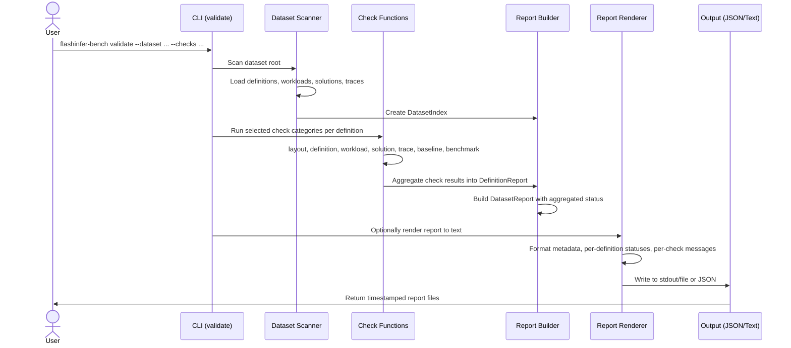

# [PR #386] feat: add dataset validation CLI (`flashinfer-bench validate`)

source: https://github.com/flashinfer-ai/flashinfer-bench/pull/386
state: closed | updated: 2026-04-24T14:36:48Z
labels: 

## 正文

## Summary

- Add dataset validator with 7 check categories (layout, definition, workload, solution, trace, baseline, benchmark) covering structural correctness, schema compliance, and coverage completeness
- Two new modules: `flashinfer_bench/data/validator.py` (core logic) and `flashinfer_bench/data/validator_report.py` (Pydantic report models + text rendering)
- Integrated as `flashinfer-bench validate` CLI subcommand with `--op-types`/`--definitions` filtering, `--disable-gpu` mode, and `--outputs stdout,json,text` targets

<!-- This is an auto-generated comment: release notes by coderabbit.ai -->
## Summary by CodeRabbit

## Release Notes

* **New Features**
  * Added `flashinfer-bench validate` command to scan and validate FlashInfer Trace datasets with selectable check categories (layout, definition, workload, solution, trace, baseline, benchmark).
  * Added `flashinfer-bench validate-render` command to convert validation reports into human-readable text.
  * Dataset validation supports filtering by operation types and definitions, GPU-optional execution, and JSON/text report generation.

* **Documentation**
  * Added comprehensive validation workflow documentation and CLI reference.
<!-- end of auto-generated comment: release notes by coderabbit.ai -->

## 评论 (5)

### coderabbitai[bot] · 2026-04-13

<!-- This is an auto-generated comment: summarize by coderabbit.ai -->
<!-- walkthrough_start -->

<details>
<summary>📝 Walkthrough</summary>

## Walkthrough

This pull request introduces a comprehensive dataset validation system for FlashInfer Trace datasets. It adds a `validate` CLI command that scans datasets, runs selectable validation check categories (layout, definition, workload, solution, trace, baseline, benchmark), and generates timestamped JSON and text reports. A complementary `validate-render` command converts existing JSON reports to readable text. The implementation includes core validation logic with seven check categories, Pydantic-based report models, CLI integration, and supporting documentation.

## Changes

|Cohort / File(s)|Summary|
|---|---|
|**Documentation & Skills** <br> `docs/flashinfer-trace/validate.mdx`, `.claude/skills/validate-dataset/SKILL.md`|Comprehensive documentation of the validation tooling, including CLI workflow, check categories, report structure, and Python API usage.|
|**CLI Commands** <br> `flashinfer_bench/cli/main.py`|Added `validate` and `validate-render` top-level commands with argument parsing, option validation, and routing to core validation functions.|
|**Core Validation Logic** <br> `flashinfer_bench/data/validate.py`|Implemented full dataset validation pipeline with dataset scanning, index building, and seven check categories: layout (path/blob consistency), definition (schema + optional GPU build), workload (axis/input validation), solution (field matching), trace (entry validation + coverage), baseline (reference solution checks), and benchmark (GPU execution).|
|**Report Models & Rendering** <br> `flashinfer_bench/data/validate_render.py`|Defined Pydantic report schema (`DatasetReport`, `DefinitionReport`, `CheckResult`, etc.) and rendering utilities to convert JSON reports to formatted text output.|

## Sequence Diagram



## Estimated code review effort

🎯 4 (Complex) | ⏱️ ~50 minutes

## Suggested reviewers

- yzh119

## Poem

> 🐰 *A dataset checked from end to end,*  
> *With seven checks to comprehend,*  
> *From layout paths to benchmarks run,*  
> *The validation work is done!*  
> *Reports rendered, issues clear—*  
> *FlashInfer's datasets crystal here!* ✨

</details>

<!-- walkthrough_end -->


<!-- pre_merge_checks_walkthrough_start -->

<details>
<summary>🚥 Pre-merge checks | ✅ 3</summary>

<details>
<summary>✅ Passed checks (3 passed)</summary>

|     Check name     | Status   | Explanation                                                                                                                                                                                       |
| :----------------: | :------- | :------------------------------------------------------------------------------------------------------------------------------------------------------------------------------------------------ |
|  Description Check | ✅ Passed | Check skipped - CodeRabbit’s high-level summary is enabled.                                                                                                                                       |
|     Title check    | ✅ Passed | The title clearly and specifically describes the main change: adding a dataset validation CLI command called 'flashinfer-bench validate', which is the primary feature across all modified files. |
| Docstring Coverage | ✅ Passed | Docstring coverage is 89.19% which is sufficient. The required threshold is 80.00%.                                                                                                               |

</details>

<sub>✏️ Tip: You can configure your own custom pre-merge checks in the settings.</sub>

</details>

<!-- pre_merge_checks_walkthrough_end -->

<!-- finishing_touch_checkbox_start -->

<details>
<summary>✨ Finishing Touches</summary>

<details>
<summary>📝 Generate docstrings</summary>

- [ ] <!-- {"checkboxId": "7962f53c-55bc-4827-bfbf-6a18da830691"} --> Create stacked PR
- [ ] <!-- {"checkboxId": "3e1879ae-f29b-4d0d-8e06-d12b7ba33d98"} --> Commit on current branch

</details>
<details>
<summary>🧪 Generate unit tests (beta)</summary>

- [ ] <!-- {"checkboxId": "f47ac10b-58cc-4372-a567-0e02b2c3d479", "radioGroupId": "utg-output-choice-group-unknown_comment_id"} -->   Create PR with unit tests
- [ ] <!-- {"checkboxId": "6ba7b810-9dad-11d1-80b4-00c04fd430c8", "radioGroupId": "utg-output-choice-group-unknown_comment_id"} -->   Commit unit tests in branch `main-dev/2026-04-13-dataset-validator`

</details>

</details>

<!-- finishing_touch_checkbox_end -->

<!-- tips_start -->

---

Thanks for using [CodeRabbit](https://coderabbit.ai?utm_source=oss&utm_medium=github&utm_campaign=flashinfer-ai/flashinfer-bench&utm_content=386)! It's free for OSS, and your support helps us grow. If you like it, consider giving us a shout-out.

<details>
<summary>❤️ Share</summary>

- [X](https://twitter.com/intent/tweet?text=I%20just%20used%20%40coderabbitai%20for%20my%20code%20review%2C%20and%20it%27s%20fantastic%21%20It%27s%20free%20for%20OSS%20and%20offers%20a%20free%20trial%20for%20the%20proprietary%20code.%20Check%20it%20out%3A&url=https%3A//coderabbit.ai)
- [Mastodon](https://mastodon.social/share?text=I%20just%20used%20%40coderabbitai%20for%20my%20code%20review%2C%20and%20it%27s%20fantastic%21%20It%27s%20free%20for%20OSS%20and%20offers%20a%20free%20trial%20for%20the%20proprietary%20code.%20Check%20it%20out%3A%20https%3A%2F%2Fcoderabbit.ai)
- [Reddit](https://www.reddit.com/submit?title=Great%20tool%20for%20code%20review%20-%20CodeRabbit&text=I%20just%20used%20CodeRabbit%20for%20my%20code%20review%2C%20and%20it%27s%20fantastic%21%20It%27s%20free%20for%20OSS%20and%20offers%20a%20free%20trial%20for%20proprietary%20code.%20Check%20it%20out%3A%20https%3A//coderabbit.ai)
- [LinkedIn](https://www.linkedin.com/sharing/share-offsite/?url=https%3A%2F%2Fcoderabbit.ai&mini=true&title=Great%20tool%20for%20code%20review%20-%20CodeRabbit&summary=I%20just%20used%20CodeRabbit%20for%20my%20code%20review%2C%20and%20it%27s%20fantastic%21%20It%27s%20free%20for%20OSS%20and%20offers%20a%20free%20trial%20for%20proprietary%20code)

</details>

<sub>Comment `@coderabbitai help` to get the list of available commands and usage tips.</sub>

<!-- tips_end -->

<!-- internal state start -->


<!-- DwQgtGAEAqAWCWBnSTIEMB26CuAXA9mAOYCmGJATmriQCaQDG+Ats2bgFyQAOFk+AIwBWJBrngA3EsgEBPRvlqU0AgfFwA6NPEgQAfACgjoCEYDEZyAAUASpETZWaCrKPR1AGxJcAZiWpcaLT0tNRoiCS4kBJoHvCh4vhYAMIAMgCSkAAUAAY+HuEIGH4UYAJkDLDRsfHUJDkAlJCQBgByjuUUXADMABwAbJCAKASQsLi43IgcAPTTROqw2AIaTMzT+YXwxZRg2usFiEUlZRWw09zYHh7TfYMtAKoRXZD3AviI3PAMaMOQAMr4bAUBjeSDMbQYMBKCTTABMAAZYf0wPCACxgACM3ShYQiuDAMTiCXwfEASYQwZykThgiHNAx/XDUbBTfjcMi/ZIUfw0WhcBFIlHorHQNEcACsGI4sIAnAAtNwIZC2dDBZA/BLhSLVInUEmQHx6gBiB1g6W2fGgVBBkA1eLVGHoJAAHtx3tIUFEJPAfrhYCRIGl0hpIABpEjyV1bXBTIxQABqNWJfHgzG4XjYGGj9hIUiwlVEAGtGHUiCT4NIuAVZIDcAAaG0kHxbdTwJL1gDuJILHnwQXriHwHjwrYw9dwVpI9YEmri5HrmHo5QwlXBFAL9aYUgoWyI9nH2DEQNiCgoXLE5EQiH7+fBClTcUwIPnDoUW7QpDvaciZGkiA0BigVoSHbMFFEud0sibDBj2gtg1R8Gg+C5Hw0DEEkGg4AxmigDZDi2EoAH0l0qaYNWmQlahoDRuHkEYmC5bVKJHSAe3mBgUHvEgM3EDBd19f0IlzRg/QYItvhoUtt2kf9sP1E18MoIjTlIsJyMTOoCK5B1KGo2jrFkUJMy+SAuVdCgomYRQSA8e16BoJ0oi0pRt14/U9QohJmK5BwPGjf8oEDFBMxIIgqESDBMNkvJ5PNE5lyqDy6hybJeBTZx5FWcEHSaBdIByRKaDAJzKGSyCCnGH87PwbgwC8KQPBMshnJ3O8stoBoZN0SAAHluHClkm18yhIDkVllHCyBcFkNlkFyCBqrAKaZsadAXyUKCWySWacggdbm36xp6x2qEkBULxiAuZKCDc4F/WSKx7mfehjprC5oyu/Bsy8MQ91oGt6yEAdR1W2hpj1eyokZCgqT/ADIAAIWweAPHofNROQA0+D2jBNqwZDKAqd1cunCJZwEwdhy29AGLZChMbYegvR+RHkecmwQqQcd5AEPATOwLAkg8eR2z9LAAHEHpQNUYmRs7/SyeANBIDR+wLeBuDZeh4B8PLdtOgRzqIS6pezXAOrhv4c2UBqKEEZlcAvDH4CdCsON4fApHoAApP5utaVIWN7WgWsoW2+FgBdZyIetaGwNMvjqBsNom2D/SUGgxGY8J0BYtBq150OSSnU5VyLbzAVuxgvEwOOnvsNWNZaiHGu0lzdxF9kMHwRySAAR2waQeX/AwLADFhmHUMFf3fd0HCcFwjGScf1GQQ58BAqN2BBnhbdC39mPKasX346w7CURAGG3PqR0wuH2ZQtDni0tA2EYpNQNjrxkGumoiCwdsFgBgyPYJYmUFyzQKiSXSkByQFWVjRAA3G/XUFBNIkDMpoGiMDkE0DQa3XSOUXwbAqikYB118rqRoMlaYeU4FFSaiVJBKZ3ZSBtPgBgyBnQvy/LDKAhpuRAlBEERcSMUaLRTP6NGBYMZ6mxrjRqJRCbbxJtZLY5MhwTR5qzFqTMEaiLZhzRAXMkH8QiMJQsaoGJMAdLjY8SRIAS3uOgGWBQ1BxCmv5SAhpnauwjg6LwkAfZ+wDlyIIkBC4UG/p9NAEh8DxBeBgN4/NaCpHYbEAAoqeIujVLKsK5LHB0mAojOhBNfex4l8xXgbBnKIsd47iTTo2fazFU5VLIA4BixFYClxWD2CIWQmhbEmi4dYWxYhC0mtE2J8Tq7SLrogBuLdnIEQhmgjBkAO5YHIAsYazcu58CMX9XmqAuT90HnQYe+hjDgCgE1fgOs0B4EIKQcgYU6CtXYFwXg/BhCiHEFIGQGUrJUFUOoLQOgrkmCgHAVAqBMA4AIMQH8bzUbj0+SZNAIE56rm5kC5yKg1CaG0LoMAhhrmmAMH9Dh+xNixXHKhEgakdRUWYLQJ0mEABEXKR6WAAILpCRa8uo9BsXpXucJTApBEBGF5cEd5PxyAgSpY4dg1BmLcBnnlKliAaV4TpROJllFlasqdFdCOtT2EqszN/P0XiTRmhKDACcNpcRagKsxAgg4dzBjgP6DVH5z6X3gOUNUeVcJHB2F0nB9QNldnyOvSa5r7DfAwKG20kR6wUH5qvayfy5Y4OYg0yS5Yqm5S4ivSaEijHcPeUE1oIMwZ8GbqZEk0Z6xpmZDnaKtLjhRrocVCgyUwHHyTdYrcWZ4XOk5joyhXl0GtsCb7etUZPqhNCAbf0zcAG+lZOFY8g1/SvTwMGdIxSMAqreTmoSUjiwSTLNIIYOQqw1hyEdOR4VX15U7GuHsQRP05AHBokc/76Ugn/Sosmn7co5C6aXHIQxcofFENrEtGyk3+EqLekKJJ5BwKqVsBgQ5g6uQ1b6MATZrKotTZzCoshrx+lvKseOj5/S6JooZcQ7EsjKyICrPKAARJpOMP1HQBEBpI/7LQMsOgogmy5GVMCUCNfRe50HICIMKka8hHHOO0K45G6g6OvmUB+U5SMuTcVLS+CDajpiwecEWatuBO3OjZGINVVMFbLiIy1HTtBZCwWMu6+x5QI5ej1LlE+x1g6IDlhdbAyUFnqw6jAW1yruIeawLEAcLFObIECtVfqN0vp/Jaumxy+Bu71kGohFqo0Xo1SWtIZK0HdpCdxogUq/NmIRCypx5AmyRrdyqM4P1tsvRKHahuWAlXEAtSLfe5AujjpSM6xuJI45BxRwcZLZ0ohKbA1ytYpsRAgQtSPbUweYz+rBm8dBK4RnJ7pfYDagS+5DwMXwDrE+Lzxq1qXY1dZXnCPYGI7uH4ORjvwCIMlA27Ciy5VplCdrE0nOdvfHvDTE1UK20vFh4t0hCH0BYfEd0XDOL8DwG9WyOcrCyF9PY3lVhMiIBxhrLU+MtIMBahQ5lJACLlZay+HIA61mtpyMPVIajkCVElXQLgABqWE3R4TTBREYdJRi0o8gUEprkXpgLhJ8JjakqT2wGC5Ry2MFLw0KVQV06YhH4DTHBFsXSnLuWj35YKv7IrHA4vFbL3i0gZVyvoIqyZNU6rWSAZkYdtBkC86NUL56/aGGDp9bapPCQY3x8gF3ECqFSlZkOKNxms77GFZHEt70eUCLCIInAzS/N6/Q069kHjfHouutwP+iAq2+8nVixu+Lg+FpNbW7rZHydq9j6p3gcjg5nJz4mHgSfx1WK1Sth4GTuVbZ4DJy7BgB3Jl16b1mjAn6RZfCqBqyJ7oVsiWkSnqfF328+FtswVqaAwARDv5poxNuGnb4K4RPW3c0JSeKDQDUDQOBWAyhfncrLIDQFAhoZKbdKoBnMxZqT2amU7SzHgIcRPGLOWAiI2BLbeHIC7AiA0FGEqTPf0CPbPOoehVuIdceSLNAAsImHgd4WxBqEXedcyAiQGCTbeKvJIY8F6efXvbIVrWqfAIgLfeqFaPfGsd0chRvBAvBZfDsBATDEAmyMNGKQiLpaAsIeAvnHQnSUXFtcyLIOw3AEQoGAAXhQL4wuzcNQIl1S39EhziAGXYKcBfC5HmEAMy0dw21tganjRAnbGzjjhzyqiChByU1MUYMNwcAEDvyeBp2uhi1I0w2WzxAF0bEeV8kQEgn5gYC8I0DQOHnMD5SGjCmr1PxPiUEI2cEy2QC+3CRdFbXeT1AuANmMnYBbBDzhlaE+lcwGNBmGLiHYjGKmnsGh2gmc28g2QJglWDy1iwF9FQGDmN0l2l22NIF5EgAV2lFV3VwME13EHBB10U39H13LBAkbBNy4AAFk6B4BHALduUAIKVelHklBpgktQDDUc8cRGQ8Rpg/gQx0hUhUgNBWUPcrcvcBVfsUUQF555Beig8pVQ9Jsc4I9wSGpntMxMt9RkY/DphgTQdGUySdU6Fys4SESkSUTaBkooxbZY5udXIosWSe9Es1YrhitwgIhLwWofhjRCgHVhopNrRysGC2Fj9uIk4TiZsQJroL8XUYS3UK8sBdFApchISWDBdKDwDe1Tho0VoMDd1Wj8j9YAkdN7M1wdxqtkZEItM8pqoVlppmtKD31Z9+xc0fokNucmx2Ib0FspIrMqNNsbYhCog39xCZC3I6CKAT0ohstPoKSJ0BYyl7sbR4Azwog6cGcsAmdMhmRNVSMqhcgm8kD3C0Cicc4/8uiaBAcF0uRWDnJv8XxcgrTI0bS082CUtfVTiBI3MUMNDbVgssAL5qp/Qcd3gZcn98dFtH1n08B/1gyJMjpv1uwg5/1AMDsQMJxwMZw1EoNhc3SCx4Nco4gjEBt0NUIqhYzcNKBZz8NvNQcWoL4GMfhVt+x3t1jjxrE5sjFaN6wp1oL5NxVOdCZ6AD0dU4cBAqlNwTNni+5zMuIXs64JDiydM9tj8Jplt4YS4HMNAL968rhAjbsxkHt6wntpAg0Q1uzzJKdV8ohQsYlWw+Ash7jB4a1vYl1phm5UKgo8pgBys9BphHCdVVCXxIxrVT9nREJiz8yqS99rIADRSjDMY9TNQoheB0FOys4QjGw5NrQaAjEVRg4bsjBGjIBeVmjui2i0tRACgWiqZeiZjzJBi+B5jRijJxAJipjyBjiLwpzziFdehUQ1d4QNctcHj3knjGoDc3jjdW0uAzd/irdASwAjBhz7dlIyI4CaI0SeVXLMTkUAD/cxV8S/FCSDAzRNs+SH9SrICSIKqEDdIoN9RLhySe8cE9QjLZTDh5SLRnVys/xIBT0NSYr4VN4KBiyL5MAcZeJpgtglAnQWoqxhpcgNqMABdhSmhfRqASylytxiCUdq9pgAAqDQUQy/Q8rsX9BPJ6l6oGHfI6M8/qJ676162856UDaQIG5616nfSAZJYadUUa22KrQOIIEOd86kgJFdE8byV0GxVyOnDjYySyJQIwrIb4PqM7EjZwMxCJZAWmcJTMFwNskkDTHGAALybgYyCh/gEx7zND2p8ITGZWYlQFpnpneXpv3KNNr2YNwUFz0JvwxsQm/kpG/BCHuq2nW2KGh0EVfMVpjJLEW1PwvzrnUD+xtX3yIBGzFIeMqDKw1tTVP3dk6q7X4x73ZgwWSnBCU16JyEExnySA9vFxAQEHoR8j8iMCAhAhvWYXTFVSKwIyI28DhkhyfwIh3N7y4DwwUGo3goYG5kiHbBIHZHrM/CSBe23jrWpMozVEvjXKWo62mCPM+p1QBoevBvjOiG/IowGw+qDlky53eViz8BoFTRJBkB7AEAxsP05m3lHoHD4G4NkEsTG2kC3kG2bv7o7pSKTryj+DQBHvaXHrNDeglxTqkVKIDtOusVHszujWQClsXT9h4Gpo9PCQnizHiLWp3BkT4AnilNckDSvgmgoxRk7qyH5i/mIOdP53IJcMtAHlUIqlTCzGui0RRkTRwsUQQtjvwspPIplpZkzPZjCK5k/THUoB4l3HQZQr011u5umKyUiU8VTsLAIk3qCAIhvvYByCzoQN7p/X7rrQDhyLfrIExhBAEePKCDAEFnkHYDjOyC7nsApnCmmBzFiGwEywaGmwsUTSuo4foDQBdmQFtswK8qvsAEwCJbZwb0DddAExvo1CXACZSLJNEnYk4x1AQkAeFe3gubf5SccxdGIKN6fPF+VeiIeTdRp0EHObL0ZYiQB+h20JtfesLcH85NWIZwAkRARaI+vgSCmjZcIzXKIynIfew+seyJE+3chmjpd0dCvo4pp8SaApsAJeneNe+TOueevUUvNkGkXATDd8CEeyx+gZ/0O3QmFhi+tupILhjbHhvhvnVeVR5iKu0R1yI7J/O6q+/9R5BnQdOuHIVOZKUBhPIZzDes5HbcXApjcu61WZtO8GxZ4KTMXh++4ZBlJ+/2F+yJMR4oEkSRhm8cVDROhklR8TLLF8DRocKkrILuKIQx2RjAIWHR4J6RcJdG8G0FlwaxrVB2r26gSpTBvotzHXR+1OWCphnovGayweqJWGjAAsAvRc9ZzW7eL+x2+xJHQ5mbPgQx4zKgD8DTSYLuyJTtE+Vl9ef+PusJe4e4dIfjU2Z5thmzcgN52+z51bEaa88gKFk/OC0e1prIIi8ZWQJoGhmQfV9RA7GvCHIhgxUhlwT9DJnuvV0mNRb560Y1mnJC+TOliZDVu1/qDsZwHlrZJIMADVAB3cOFrRsNrliNullIlgL8LsoVrCkV5Wc+tO+8rV5Z7IRxJoSCsC0NSYEgUHQgAN60Cpjly/fUT/Qlq+mihlwmT9a1rtRUkgS2XvTNbNPKSi+KHpWi8ZUGxqeiS5qwXlP4P4aYQ0flAOIykN6IZAWt/0FRegexBNqkhwBgSRnVFCZGQRYeSci+YBhy0NAgKPbfWhbQpAtA1y5nfRqIG+6Ih+xGyrKIUmUrNsTFsAT8krTOexLIe6e4VFiZQbHIEgjdMgi4eBrNeoDFi7BsLXNY1o463AI5XvaYHIEGvDiGGTYS6tVMd5Rw6e8JieXiT086D2SgdsbcLs92GpEcOuRjs29d9Pcj5MmQRsEkHC9YraviW1JjA/Z6N2/U3AIO8yM+mqtyxCDy66do7yiyvynWAKnXIYpYBY0F8Y6VOGWVYkiPEK9iHwao8KLgWWxAnvZA1A3QPQSASTkymT2QoZbtPVUw8q1SSq2QHILCLqKwLotgZWhyugUiITeXLVYUo6P0ifPch29fAfN9GB+DhLWLmQmgpfEqDLnizrFyz4zAbWQeLxGk1y+7WQNmygIwKXGKgkqLhXDEGUaUJKgq63Yqgwbqh3Pqqwgdd3NrjEn3bE0VFwQPFqkPIz+VfPQ3Ym8CYwntRSbrnz7Qvrmidgyk5sfGgyIpImqyIw3S1uFqYcdxVDIy8rAtexRSlU2bgJbGWeMCwRegCjwCribOXIZIJ/b4y8Gef9D7wsdmcO/9f25pQO5M/9VzpebWmHI6ZzvEVzu0wBMtqgNREVRkZzHVaPGI8sMB7M7m3kg8B/ZIAACXSWSBDAIkNHSHSVSH4z+BfwhzE7lodoIjR0qKfb9A8Hpsusu0Qmo54KloJfo6oDFNZ59JOuE/z2jfPTFJvW8kuALKe8iCBAl5Pm/XssEm/OWNyAiWSkc5yG5Z3F199IfJS0WtzKvbylF1WUcMCNPwoa4p+DgQk/drB4YZznpmoB12YHl/gFqm9ebhG8ez/LB2MrxCnkZA1HbR2Efox1CIALR87SYH5jbW3iR0fqRxvVZ4hrgliylWyD1EABwCSK+WJLdndqQAXAI0N2QVAomzZGL7shYWKczVRLf08xd7Cn3r8ij+HphPrpTfnOKogP8WAc5S7ltYfIhXOUS9utCrCQbM109kBJ5lONKOwmONDolCy90GpUOD16whiXJUHPpDl/pt4uQhPXslkCZUe24mFHJtBJS8pvEvApjcBDRAQHRMkw5uTvtbUtgwmKOpdP6O6CRbNMjEDReTu5SKzKcvKnRXyjyw079FAq27YKjp1CriBwq0qQCIbgPTzdPOi3bzoyDNK4JVufnPHmBBBYmc0BixMKiWkiiBdtuRkdiMTRjydFLwrsHIH91Ehfdc+9QI6FwILAA95eQPB2vDyOgQ8kgJ2IHi709oBcAoW0RkJmCs7E9Se5PSntT1p7+dZIhoCzjfDyiM9ECzPVng4WTJcBgewmEcK5yaCkpIAUuRTh4AADaHKfAAWA5T1gOUBvXiG4MgAcoIkHKAALpaCuoOg5cJZ1b6twVkGldvrgBMEYIzBMg1tNYMc6AEghfCXQUkCs62FkysQ1tM4QyF7gKA+/GQlwF6jb8HBgBfwZABcKQBi+SQgof5xqqFccYfgeys/39C8oKuVXCgDVxOL1c4qGIVEAAHZWutxVKppgyovFDc7xXKpAG+LBw/ilua3GSihQM1t2DyJ5EN3GFoolBGKLFI1VG6jQniIKQlOChJSGAVhmUdQARHiCIA0EWVOgCzyhhRArkBgFYeUDQBihUQDAMUD4AxBoAhhJAaUAwGlCDC0A/QfoCQHhBXEsQqIMUAIHBHwg0QQw6UH0HhBnDXhNyYsD8NhCDDegvQQYSQFhC9BYQaAK4r0B8CqAfAtAboCQEGHgi0A8IBgLCCGHEjYQCIaUL0HREYiIArUK4TcLuGvEHhdySFJiLMoEQ2A0MfnKtkeHOBnhpKIwAAG8AuHKJALYHhg9hRIdAJeKwHYBWB3gPIDlL4GyyThlRSAbqFuG3ByoMAho/UMaNrDKjtUYLXiEvDfCkB2qlAe7AyDqA2ilRzQZoByi67KQncLuCELpB9EBc/RPgggIyA8AhCQOqaG0WKHtGRj/R5nUIdXgADqCwfjOwkAI/0bRGICMZAAAC+yYv0QGJMIED4oKkIgZAlQSOEwxXAX0SmI5TRjYgcY/qDaO6BljIxAY9IamizG+gcxHCJ0UQEQBdiixpYosRWIW5lVqxPXSiFAhojhiUxUY7uO2P7HjiuAWIHseWLTHxjEAg42AMOLzG8QtxkALEJON3Ezj8Bc43qst167p5GxkAZsb2LbGxjNxXY3camM3FHiTxo488d0CvHTjAx84h8UamfGvjyx74jsdXgLHdiixP49MVtD/G5iAJ8EycQFynH+iniNgAlOoAzG2waAVgCgO4BcYkAbRKEGyCaP9FrxLgtAdUfDlsCUS7RDo+IDYH5jDiGQQBAQTaP3A0SfBwcWgBxIwBkSvAvErgPxLLEcohJIkwTBe3VjhQJJto6idJNnDcFaA6QS8L424k2iuUak8ILgAEFCCKiNohwUWKgk4Sn8rQCJnpPklBoiyAYJ/G4MQk+DWefEpDt+J8GuYCgGHJIHpIEH1x1YmsLqEvCUB4TQUuAAlggCtrKEY8gfE2GQDli0ANALk1cRyhYF6TPBRANKS2LLDzB7sAgmyWwD0lANFJI4K3JGOwl+jLJPgqRMVIolcAOUYkyRM5K8kcp3Jkkzya5N8EuhfJmWPSZOQwEBJCM/gCgK4xfARkUMhheQGVI4onxXceYcboEGCD99zuC5WPAOVRjjJ3kAAclKpxRu+fOXaQrUwyoAT4qUAPH4CZAMRVyeOcZB/FnIoUaSf4XKb2MylNTspb08sWeEkE60uQLE1ST1PylMUiptkpqcNIonATIxtUjlPVPBk+D/xbcMeK6IontTOpwyAeO1J8mYABpTUpGfNiF6apUAvQaUBoAxDSgAApGhkVqoAHAxuL4OWEzAqkzMpZd5L6G8gzYMGJM+EBoERGUzUp7Uj6T4K+ntSQZhU6yQjJkloSgClUv0cWIC7+CDJRiWwPZOAYVSmpYoXoBiFoCDCGAeI+EFrKCAIhugqIaUGCIxA+BYQYoWgAwG6Aq4LZSIEgAIDtkDABAsIEgKiG1kezjcGIUmdKAxD9AxQ/QXoMHOlD9BaAuUjlAcFwC2AWpekjEMCIxCDDjcNsjkX8LQDdAsQvQW2bQDFAMBaAzIhEKiAGHwgEqFI/OSQF6BZzugqgVEKiAECwj+gQw2EBnPKC9AVAaAWEFbgVncioAYoiUaQC4a7MCIwo+USsMOb4ACIGqZkPzicxzynhXIhUdHMMlBdZ5tAXlNJxzCCjaA2oj+kvGT6Gj4QvcieU8mnmPIIgMo3BGPL0BAA=== -->

<!-- internal state end -->

### claude[bot] · 2026-04-13

## Code Review: `flashinfer-bench validate` CLI

Overall this is well-structured work — the 7-check taxonomy is clear, the report model is clean, and the CLI design is solid. A few issues are worth addressing before merge.

---

### Bug: Resource leak in `check_benchmark_content`

**`flashinfer_bench/data/validator.py` ~line 1374**

```python
try:
    benchmark = Benchmark(trace_set, config)
    result_trace_set = benchmark.run_all(dump_traces=False)
    benchmark.close()          # ← never called if run_all() raises
except Exception as exc:
    messages.append(...)
    return make_result(messages)
```

If `run_all()` raises, `benchmark.close()` is skipped. Use `try/finally`:

```python
benchmark = Benchmark(trace_set, config)
try:
    result_trace_set = benchmark.run_all(dump_traces=False)
finally:
    benchmark.close()
```

---

### Redundant exception catch in `_load_json` / `_load_jsonl`

**`validator.py` ~line 520**

```python
except (ValidationError, Exception) as exc:
```

`Exception` is the parent of `ValidationError`, so listing both is redundant. Just use `except Exception as exc:`.

---

### Wasted `render_text_report` call

**`validator.py` ~line 1581**

```python
text_output = render_text_report(dataset_report)   # always runs

if "text" in outputs:
    text_path.write_text(text_output)
if "stdout" in outputs:
    print(text_output)
```

`render_text_report` is called unconditionally, even when the user requests `--outputs json` only. Guard it:

```python
if "text" in outputs or "stdout" in outputs:
    text_output = render_text_report(dataset_report)
    if "text" in outputs:
        text_path.write_text(text_output)
    if "stdout" in outputs:
        print(text_output)
```

---

### O(n²) trace lookup in `validate_dataset`

**`validator.py` ~line 1508**

```python
trace_entries = [
    entry for key, entry in index.trace_files.items() if key[1] == definition_name
]
```

This is a full linear scan of `index.trace_files` for every definition, so the total cost is O(definitions × trace_files). Pre-group once after scanning:

```python
from collections import defaultdict
traces_by_definition: dict[str, list[ScannedTrace]] = defaultdict(list)
for (author, def_name), entry in index.trace_files.items():
    traces_by_definition[def_name].append(entry)
```

Then replace the list comprehension with `traces_by_definition.get(definition_name, [])`.

---

### `outputs` validation order is inverted

**`validator.py` ~line 1471**

```python
for target in outputs:
    if target not in ("stdout", "json", "text"):
        raise ValueError(...)
if not outputs:
    raise ValueError("outputs cannot be empty")
```

The empty-list guard comes after the loop that would be a no-op on an empty list. Put it first so the intent is clear.

---

### Missing tests

The PR adds ~1,400 lines of validation logic but no unit tests. Even a small `tests/test_validator.py` covering:
- `make_result` status derivation
- `_load_json` / `_load_jsonl` error paths
- `filter_definitions` with op_type / name filters
- `compute_definition_status` aggregation

…would catch regressions early and make reviewing future changes easier.

---

### Nit: potential `line_number` unbound in `_load_jsonl`

**`validator.py` ~line 534**

```python
for line_number, line in enumerate(path.read_text().splitlines(), 1):
    ...
    items.append(model_class.model_validate_json(line))
return items, None
except (ValidationError, Exception) as exc:
    return None, f"line {line_number}: {exc}"
```

If `path.read_text()` itself raises (e.g. permission error), `line_number` is never assigned, causing an `UnboundLocalError` inside the except handler. Initialize `line_number = 0` before the loop.

---

**Minor positive notes:**
- The `--disable-gpu` toggle cleanly drops the `benchmark` check — good default for CI.
- `scan_dataset` building a full index before running checks keeps check functions pure and testable.
- Report file naming with timestamps prevents accidental overwrites.

### claude[bot] · 2026-04-13

## Code Review

Overall this is a well-structured addition — the separation between core validation logic (`validate.py`) and report models/rendering (`validate_render.py`) is clean, the seven check categories are clearly delineated, and the CLI integration follows the existing pattern. A few issues worth addressing before merge:

---

### Bugs / Correctness

**1. `UnboundLocalError` in `_load_jsonl` when `read_text()` fails**

```python
def _load_jsonl(model_class, path: Path):
    items = []
    try:
        for line_number, line in enumerate(path.read_text().splitlines(), 1):
            ...
    except (ValidationError, Exception) as exc:
        return None, f"line {line_number}: {exc}"   # line_number may be undefined
```

If `path.read_text()` raises (e.g. permission error, file deleted between scan and read), `line_number` is never assigned and the `except` block will itself raise `UnboundLocalError`. Fix:

```python
line_number = 0
try:
    for line_number, line in enumerate(path.read_text().splitlines(), 1):
        ...
except Exception as exc:
    suffix = f" (line {line_number})" if line_number else ""
    return None, f"{exc}{suffix}"
```

**2. `(ValidationError, Exception)` is redundant** — `ValidationError` is a subclass of `Exception`, so the tuple just catches `Exception`. Use the narrower catch if intentional, or drop `ValidationError` from the tuple.

**3. Silent definition-name collision in `scan_dataset`**

```python
index.definitions[definition_name] = ScannedDefinition(...)   # keyed by stem only
```

If two op_types happen to share a definition stem (e.g. `mla_paged/norm.json` and `gqa/norm.json`), the second silently overwrites the first. The key should be `(op_type, definition_name)` — or at least emit a warning when a collision is detected.

**4. Resource leak in `check_benchmark_content`**

```python
try:
    benchmark = Benchmark(trace_set, config)
    result_trace_set = benchmark.run_all(dump_traces=False)
    benchmark.close()         # skipped if run_all raises
except Exception as exc:
    ...
```

`benchmark.close()` is not called if `run_all` raises. Use `try/finally`:

```python
benchmark = Benchmark(trace_set, config)
try:
    result_trace_set = benchmark.run_all(dump_traces=False)
finally:
    benchmark.close()
```

**5. Silent truncation in `check_workload_content` shape loop**

```python
for input_name, expected_shape in zip(input_names_ordered, expected_shapes):
```

If `get_input_shapes` returns fewer elements than `input_names_ordered`, the remaining inputs are silently skipped with no validation. Add a length assertion or use `itertools.zip_longest`.

---

### Duplicate Checks

**6. Blob existence checked twice** — `check_layout` and `check_workload_content` both verify that safetensors blob files exist. A missing blob will appear as an error in both the `layout` section and the `workload` section of the same definition report, creating confusing duplication. Consider removing it from `check_layout` since `check_workload_content` performs the more thorough validation (key presence + shape).

---

### CLI Inconsistency

**7. `--checks` is comma-separated, `--op-types`/`--definitions` are space-separated**

```
flashinfer-bench validate --checks layout,definition --op-types mla_paged gqa_decode
```

Mixing these two styles in the same command is surprising. Standardize on one convention. `nargs="+"` (space-separated) is more idiomatic for argparse and consistent with the other two flags.

---

### Reporting Quirks

**8. Early `break` hides multiple mismatches**

In `check_layout` and `check_trace_content`, the code breaks after the first definition-field mismatch in a JSONL file. If a file has many mismatched entries (e.g. wrong definition name throughout), only one error is reported. This may be intentional to avoid noise, but it should be a documented choice — or use a counter (`N entries have wrong definition`) rather than a bare `break`.

---

### No Tests

**9. 1700+ lines of new logic, no test coverage**

The validator has complex branching (7 check categories × multiple error conditions). There are no tests under `tests/`. Even a small set of unit tests against fixture data — a valid definition directory, a deliberately malformed one — would catch regressions and make the logic easier to trust. The existing `flashinfer_trace/tests/` structure is a natural home for fixtures.

---

### Minor

- **`validate_dataset` output consistency**: `render_text_report` is called unconditionally even when `"text"` and `"stdout"` are both absent from `outputs` (e.g. `--outputs json`). The rendered string is built but never used. Not a correctness issue, just wasteful.
- **Timestamp race**: The check `if json_path.exists(): raise` and the actual `write_text` are not atomic. Unlikely in practice but worth a comment.
- **Module path in docs**: `flashinfer_bench.data.validate_render` — confirm this is importable (i.e. `__init__.py` exports or the module path is correct).

### claude[bot] · 2026-04-13

## Code Review: `feat: add dataset validation CLI (flashinfer-bench validate)`

Good addition — the overall structure (scan → index → per-check functions → report) is clean and the documentation is thorough. A few issues worth fixing before merge, ranging from a crash-level bug to minor style points.

---

### 1. `UnboundLocalError` in `_load_jsonl` (crash-level bug)

`validate.py` — `_load_jsonl`:

```python
def _load_jsonl(model_class, path: Path):
    items = []
    try:
        for line_number, line in enumerate(path.read_text().splitlines(), 1):
            ...
        return items, None
    except (ValidationError, Exception) as exc:
        return None, f"line {line_number}: {exc}"   # ← NameError if read_text() raises
```

If `path.read_text()` raises (permission error, I/O error), the loop body never executes, so `line_number` is never assigned. The `except` handler then hits `NameError: name 'line_number' is not defined`.

**Fix:** initialize `line_number = 0` (or `"unknown"`) before the `try`.

---

### 2. Resource leak in `check_benchmark_content`

```python
try:
    benchmark = Benchmark(trace_set, config)
    result_trace_set = benchmark.run_all(dump_traces=False)
    benchmark.close()   # ← not reached if run_all() raises
except Exception as exc:
    ...
```

If `run_all()` raises, `benchmark.close()` is skipped. Should use `finally`:

```python
benchmark = Benchmark(trace_set, config)
try:
    result_trace_set = benchmark.run_all(dump_traces=False)
finally:
    benchmark.close()
```

---

### 3. Silent definition-name collision in `scan_dataset`

```python
index.definitions[definition_name] = ScannedDefinition(op_type=op_type, ...)
```

The key is only `definition_name` (the file stem). Two different op_types with a file of the same name (e.g. `mla/custom.json` and `rmsnorm/custom.json`) will silently overwrite each other. The key should be `(op_type, definition_name)` — same as `trace_files` already does with `(author, definition_name)`. The same issue exists for `index.workloads`.

---

### 4. `zip()` silently truncates shape validation in `check_workload_content`

```python
for input_name, expected_shape in zip(input_names_ordered, expected_shapes):
```

If `get_input_shapes` returns fewer shapes than `input_names_ordered`, the trailing inputs are never shape-checked. An assertion or explicit length check would surface the bug rather than silently accepting incomplete validation.

---

### 5. Early `break` hides multiple mismatches

In `check_layout`, `check_trace_content`, and `check_baseline_content`, the pattern:

```python
for trace in workload_entry.traces:
    if trace.definition != definition_name:
        messages.append(...)
        break   # ← only first mismatch reported
```

stops at the first mismatch. If many traces have the wrong definition field, the report shows only one error and the user may think it's an isolated case. Remove the `break` or, if the intent is to de-noise, add a count: `"definition mismatch in N/M trace entries"`.

---

### 6. `render_text_report` called even when output goes nowhere

```python
text_output = render_text_report(dataset_report)   # always runs

if "text" in outputs:
    text_path.write_text(text_output)
if "stdout" in outputs:
    print(text_output)
```

When `outputs=["json"]`, the render is computed and immediately discarded. Guard it:

```python
if "text" in outputs or "stdout" in outputs:
    text_output = render_text_report(dataset_report)
    ...
```

---

### 7. Redundant exception types in `except` clauses

`(ValidationError, Exception)` appears in `_load_json`, `_load_jsonl`, `check_definition_content`, and `check_baseline_content`. Since `ValidationError` is a subclass of `Exception`, the `ValidationError` branch is dead code. Use `except Exception`.

---

### 8. Inconsistent CLI argument style

`--checks` is `type=str` and split on comma in `_validate_run`, while `--op-types` and `--definitions` use `nargs="+"` (space-separated on the command line). Pick one convention and use it throughout. `nargs="+"` is more idiomatic for argparse and produces cleaner shell usage; comma-splitting is fine too if you prefer it, but it should be consistent.

---

### 9. O(n) trace lookup per definition

```python
trace_entries = [
    entry for key, entry in index.trace_files.items() if key[1] == definition_name
]
```

This iterates the entire `trace_files` dict for every definition. Pre-group once before the loop:

```python
from collections import defaultdict
traces_by_def: dict[str, list[ScannedTrace]] = defaultdict(list)
for (author, def_name), entry in index.trace_files.items():
    traces_by_def[def_name].append(entry)
```

With a large dataset this is a straightforward O(n²) → O(n) win.

---

### 10. No test coverage

1,400+ lines of new logic with zero tests. At a minimum, unit tests for `_load_jsonl`, `scan_dataset` (collision behavior), `filter_definitions`, and a happy-path call to `validate_dataset` with a minimal fixture dataset would catch the bugs above before they reach users. The existing `flashinfer_trace/tests/` pattern is a good template.

---

**Summary of severity:**

| # | Issue | Severity |
|---|-------|----------|
| 1 | `UnboundLocalError` in `_load_jsonl` | **Critical** |
| 2 | Resource leak in `check_benchmark_content` | **High** |
| 3 | Definition-name collision in `scan_dataset` | **High** |
| 4 | `zip()` truncation in shape check | **Medium** |
| 5 | Early `break` hides multiple mismatches | **Medium** |
| 6 | Wasted render call | Low |
| 7 | Redundant `ValidationError` in `except` | Low |
| 8 | CLI argument style inconsistency | Low |
| 9 | O(n²) trace lookup | Low |
| 10 | No test coverage | **High** |

### claude[bot] · 2026-04-13

## PR Review: Dataset Validation CLI

This is a solid, well-structured addition. The 7-category check design maps cleanly onto the dataset layout, the Pydantic report models are a good fit, and the CLI surface is clean. A few issues worth addressing before merge.

---

### Bugs

**1. `_load_jsonl` aborts on first parse error, discarding all subsequent lines**

`validate.py` ~lines 196-208: a single bad line returns `(None, error_str)`, throwing away every line parsed before (and after) it. For large workload/trace JSONL files, one corrupt entry at line 500 out of 1000 silently invalidates the entire file. Consider collecting per-line errors and returning partial results, or at minimum continuing to parse after the first error.

```python
# current — all-or-nothing
try:
    for line_number, line in enumerate(path.read_text().splitlines(), 1):
        items.append(model_class.model_validate_json(line))
    return items, None
except Exception as exc:
    return None, f"{exc} (line {line_number})"
```

**2. Empty `outputs=[]` is silently replaced by defaults**

In `validate_dataset`:
```python
outputs = outputs or ["stdout", "json", "text"]
...
if not outputs:
    raise ValueError("outputs cannot be empty")  # unreachable — always truthy after the `or`
```
`[]` is falsy, so an explicit `outputs=[]` call is silently coerced to the full default list instead of raising. The guard is dead code. Fix:
```python
if outputs is None:
    outputs = ["stdout", "json", "text"]
elif not outputs:
    raise ValueError("outputs cannot be empty")
```

**3. Redundant exception type in `except (BuildError, Exception)`**

Two locations (`check_definition_content`, `check_baseline_content`):
```python
except (BuildError, Exception) as exc:
```
`BuildError` is a subclass of `Exception`, so the first branch is dead. Use `except Exception` directly, or split into two `except` clauses if the intent is to distinguish build errors from unexpected ones.

**4. Duplicate definition tracking overwrites the first entry**

In `scan_dataset`:
```python
if definition_name in index.definitions:
    existing = index.definitions[definition_name]
    error = f"duplicate definition name: {existing.path} and {path}"
index.definitions[definition_name] = ScannedDefinition(...)  # first entry silently gone
```
With 3+ duplicates only the last collision is recorded. Subsequent checks (`check_workload_content`, etc.) proceed against the overwritten second entry. Consider emitting duplicate errors at the dataset level before per-definition checks run, rather than encoding it as a per-entry error.

---

### Design / Quality Issues

**5. No tests added**

The validator has non-trivial logic — axis/shape inference, coverage gap detection, blob existence. At minimum, unit tests for `check_workload_content`, `check_layout`, and the `_load_jsonl` failure path would protect against regressions. The existing structure under `tests/` is a good reference.

**6. Safetensors blob existence checked twice**

`check_layout` calls `blob_path.exists()` on `SafetensorsInput` entries. `check_workload_content` does the same check before also opening the file. A missing blob emits two separate errors. Consider restricting the layout check to structural path/field consistency and leaving blob validation entirely to the workload check.

**7. Unknown `--definitions` names are silently ignored**

`filter_definitions` silently drops requested names that don't exist in the scanned index. A user who typos a definition name gets an empty report with no indication of the mistake.

---

### Minor

**8. Reference solution author `"__reference__"` is fragile** — if any real author registers under that name, benchmark failures will be misclassified. A UUID or a named constant would be safer.

**9. PR description names don't match file names** — description says `validator.py` / `validator_report.py`; actual files are `validate.py` / `validate_render.py`.

**10. Check-name validation runs after `checks` is mutated** — `disable_gpu` strips `"benchmark"` before the unknown-check loop runs, so `--checks benchmark,bogus --disable-gpu` only catches `bogus`. Validate the original input before mutating.

---

Overall the structure is clean and the report model / text rendering separation is well done. Main asks: fix `_load_jsonl` all-or-nothing, the `outputs=[]` dead code, the redundant exception catch, and add at least basic tests.


## Review (3)

### gemini-code-assist[bot] · 2026-04-13 · COMMENTED

## Code Review

This pull request introduces a dataset validation framework for FlashInfer Trace, including a core validator, report generation, and CLI subcommands for running and rendering reports. The validator covers structural correctness, schema compliance, and coverage completeness across definitions, workloads, solutions, and traces. Feedback highlights opportunities to improve memory efficiency by iterating over JSONL files line-by-line and to optimize performance by reducing redundant blob existence checks during layout validation.

### coderabbitai[bot] · 2026-04-13 · COMMENTED

**Actionable comments posted: 6**

<details>
<summary>🤖 Prompt for all review comments with AI agents</summary>

```
Verify each finding against the current code and only fix it if needed.

Inline comments:
In `@docs/flashinfer-trace/validate.mdx`:
- Around line 155-160: The example uses
validate_dataset(dataset="/path/to/flashinfer-trace", ...) which writes its JSON
under the dataset's reports directory, but render_report is pointed at
"./reports/..."; update the example so render_report targets the generated
report inside the dataset path (e.g.,
"/path/to/flashinfer-trace/reports/report-YYYYMMDD-HHMMSS.json" or build the
path from the same dataset value) so render_report() reads the actual file
produced by validate_dataset; reference validate_dataset and render_report to
locate where to change the paths.

In `@flashinfer_bench/cli/main.py`:
- Around line 385-386: The parsing of CLI comma-separated options leaves
whitespace and empty tokens (e.g., args.checks and args.outputs), causing
invalid values downstream; update the logic that builds checks and outputs
(where checks = args.checks.split(",") and outputs = args.outputs.split(",")) to
normalize by splitting on commas, trimming whitespace from each token, and
filtering out any empty strings, while preserving the existing defaults when
args.checks or args.outputs is None so the validator receives clean values
(e.g., use args.checks -> list(filter(None, [s.strip() for s in
args.checks.split(",")])) and similarly for args.outputs).

In `@flashinfer_bench/data/validator.py`:
- Around line 287-318: filter_definitions currently only iterates
index.definitions so any orphaned entries (workloads/solutions/traces that
reference a missing definition) are never considered; update filter_definitions
to also collect referenced definition names from index.workloads,
index.solutions, and index.traces (e.g., extract their definition_name/reference
fields) and include those names in the result set before applying the
union/filter logic with requested_op_types and requested_definitions, while
preserving existing checks of entry.op_type on index.definitions, ensuring
uniqueness and returning a sorted list; refer to filter_definitions,
index.definitions, index.workloads, index.solutions, index.traces,
entry.op_type, requested_op_types, and requested_definitions to locate and
implement the change.
- Around line 180-191: The except block in _load_jsonl uses line_number but if
path.read_text() fails before the loop line_number is undefined; change the
implementation to separate file reading from parsing: first call
path.read_text() in its own try/except (or assign its result to a variable
before enumerating) and on read failure return an error that does not reference
line_number; keep the existing ValidationError handling for
model_class.model_validate_json(line) and when catching validation errors
include the current line_number as before.
- Around line 1029-1035: The Benchmark instance created with
Benchmark(trace_set, config) must always be closed; move the run_all() call into
a try/except but ensure benchmark.close() executes in a finally block so
resources are released even if run_all() raises. Specifically, keep creating
benchmark with Benchmark(...), then use try: result_trace_set =
benchmark.run_all(...); except Exception as exc:
messages.append(CheckMessage(...)); return make_result(messages); finally:
benchmark.close(); reference the Benchmark class and its run_all and close
methods when applying the change.
- Around line 913-935: The current block can report "trace: all passed" even
when individual Trace objects are malformed (trace.solution is None or
trace.evaluation is None); in the loop over baseline_trace.traces (and when
building failed) explicitly check for missing fields: for each trace if
trace.solution is None append a CheckMessage (level="error", message="trace
missing solution") and if trace.evaluation is None append a CheckMessage
(level="error" or "warning" as appropriate, message="trace missing evaluation")
and treat these cases as non-passing so you do not reach the else that emits
CheckMessage(level="info", message="trace: all passed"); update the code paths
around baseline_trace.traces, the failed list calculation, and the final info
message so "all passed" is only added when every trace has a non-None evaluation
with status == EvaluationStatus.PASSED and every trace.solution is present and
in baseline_solution_names.
```

</details>

<details>
<summary>🪄 Autofix (Beta)</summary>

Fix all unresolved CodeRabbit comments on this PR:

- [ ] <!-- {"checkboxId": "4b0d0e0a-96d7-4f10-b296-3a18ea78f0b9"} --> Push a commit to this branch (recommended)
- [ ] <!-- {"checkboxId": "ff5b1114-7d8c-49e6-8ac1-43f82af23a33"} --> Create a new PR with the fixes

</details>

---

<details>
<summary>ℹ️ Review info</summary>

<details>
<summary>⚙️ Run configuration</summary>

**Configuration used**: defaults

**Review profile**: CHILL

**Plan**: Pro

**Run ID**: `38cf1184-58c5-4b8e-aad9-7ad96841ec1b`

</details>

<details>
<summary>📥 Commits</summary>

Reviewing files that changed from the base of the PR and between 8f8b808874f1bc0da8a099125fc4494f7413761f and bea54c5f1a47e9c97a66e0901345b66004479380.

</details>

<details>
<summary>📒 Files selected for processing (4)</summary>

* `docs/flashinfer-trace/validate.mdx`
* `flashinfer_bench/cli/main.py`
* `flashinfer_bench/data/validator.py`
* `flashinfer_bench/data/validator_report.py`

</details>

</details>

<!-- This is an auto-generated comment by CodeRabbit for review status -->

### coderabbitai[bot] · 2026-04-13 · COMMENTED


<details>
<summary>♻️ Duplicate comments (3)</summary><blockquote>

<details>
<summary>flashinfer_bench/cli/main.py (1)</summary><blockquote>

`385-386`: _⚠️ Potential issue_ | _🟡 Minor_

**Normalize comma-separated CLI values before passing them downstream.**

Raw `split(",")` keeps whitespace/empty tokens, so inputs like `--checks layout, definition` or `--outputs stdout,json,` can fail validation unexpectedly.

 

<details>
<summary>Proposed fix</summary>

```diff
-    checks = args.checks.split(",") if args.checks else None
-    outputs = args.outputs.split(",") if args.outputs else ["stdout", "json", "text"]
+    checks = [item.strip() for item in args.checks.split(",") if item.strip()] if args.checks else None
+    outputs = (
+        [item.strip() for item in args.outputs.split(",") if item.strip()]
+        if args.outputs
+        else ["stdout", "json", "text"]
+    )
```
</details>

<details>
<summary>🤖 Prompt for AI Agents</summary>

```
Verify each finding against the current code and only fix it if needed.

In `@flashinfer_bench/cli/main.py` around lines 385 - 386, The CLI currently uses
raw split(",") which preserves whitespace and empty tokens for the variables
checks and outputs in main.py; change the parsing to normalize values by
splitting on ",", trimming whitespace from each token, and dropping empty tokens
before assigning to checks (from args.checks) and outputs (from args.outputs),
while preserving the existing default outputs ["stdout","json","text"] when
args.outputs is not provided; update the handling around the checks and outputs
assignments to use this normalized list comprehension logic so downstream
validation receives clean tokens.
```

</details>

</blockquote></details>
<details>
<summary>flashinfer_bench/data/validate.py (2)</summary><blockquote>

`318-327`: _⚠️ Potential issue_ | _🟠 Major_

**Include orphaned workload/solution/trace definitions in the target set.**

Selection only iterates `index.definitions`, so orphan entries under `workloads/`, `solutions/`, or `traces/` are silently skipped instead of being reported as layout/consistency problems.

 

<details>
<summary>Proposed direction</summary>

```diff
 def filter_definitions(
     index: DatasetIndex, requested_op_types: list[str], requested_definitions: list[str]
 ) -> list[str]:
@@
-    if not requested_op_types and not requested_definitions:
-        return sorted(index.definitions.keys())
+    all_definition_names = set(index.definitions.keys())
+    all_definition_names.update(index.workloads.keys())
+    all_definition_names.update(index.solutions.keys())
+    all_definition_names.update(def_name for _, def_name in index.trace_files.keys())
+
+    if not requested_op_types and not requested_definitions:
+        return sorted(all_definition_names)
 
     result = set()
-    for definition_name, entry in index.definitions.items():
-        if requested_op_types and entry.op_type in requested_op_types:
+    for definition_name in all_definition_names:
+        entry = index.definitions.get(definition_name)
+        if requested_op_types and entry and entry.op_type in requested_op_types:
             result.add(definition_name)
         if requested_definitions and definition_name in requested_definitions:
             result.add(definition_name)
     return sorted(result)
```

Also ensure the `validate_dataset` loop handles names missing in `index.definitions` without key access failure.
</details>

<details>
<summary>🤖 Prompt for AI Agents</summary>

```
Verify each finding against the current code and only fix it if needed.

In `@flashinfer_bench/data/validate.py` around lines 318 - 327, The selection
currently iterates only index.definitions so orphaned entries under
index.workloads, index.solutions and index.traces are omitted; update the logic
that builds result (the block referencing index.definitions, requested_op_types
and requested_definitions) to also scan index.workloads, index.solutions and
index.traces and add their names to result when they match requested filters (or
always include them when no filters provided) so they appear in the returned
sorted list; additionally update the validate_dataset loop that looks up names
in index.definitions to defensively handle missing keys (e.g., skip or report
them without raising KeyError) so orphan names are reported as
layout/consistency problems rather than causing a crash.
```

</details>

---

`959-973`: _⚠️ Potential issue_ | _🟠 Major_

**Treat missing baseline `solution`/`evaluation` as non-passing.**

Current logic can still emit `trace: all passed` when baseline trace rows are malformed (`solution is None` or `evaluation is None`).

 

<details>
<summary>Proposed fix</summary>

```diff
         baseline_solution_names = {e.solution_name for e in baseline_solutions}
         for trace in baseline_trace.traces:
-            if trace.solution and trace.solution not in baseline_solution_names:
+            if trace.solution is None or trace.evaluation is None:
+                messages.append(
+                    CheckMessage(
+                        level="error",
+                        message=f"trace entry {trace.workload.uuid} missing solution or evaluation",
+                    )
+                )
+                break
+            if trace.solution not in baseline_solution_names:
                 messages.append(
                     CheckMessage(
                         level="error",
                         message=f"trace references non-baseline solution '{trace.solution}'",
                     )
                 )
                 break
 
         failed = [
             t
             for t in baseline_trace.traces
-            if t.evaluation and t.evaluation.status != EvaluationStatus.PASSED
+            if t.evaluation is None or t.evaluation.status != EvaluationStatus.PASSED
         ]
```
</details>

<details>
<summary>🤖 Prompt for AI Agents</summary>

```
Verify each finding against the current code and only fix it if needed.

In `@flashinfer_bench/data/validate.py` around lines 959 - 973, The baseline trace
checks treat missing solution/evaluation as valid; update the two places that
inspect trace.solution and trace.evaluation to treat None as non-passing: in the
loop over baseline_trace.traces change the condition to "if not trace.solution
or trace.solution not in baseline_solution_names" so missing solution triggers
the CheckMessage, and change the failed comprehension to "for t in
baseline_trace.traces if not t.evaluation or t.evaluation.status !=
EvaluationStatus.PASSED" so traces with missing evaluation count as failures;
refer to baseline_trace.traces, baseline_solution_names, CheckMessage, and
EvaluationStatus.PASSED.
```

</details>

</blockquote></details>

</blockquote></details>

<details>
<summary>🤖 Prompt for all review comments with AI agents</summary>

```
Verify each finding against the current code and only fix it if needed.

Duplicate comments:
In `@flashinfer_bench/cli/main.py`:
- Around line 385-386: The CLI currently uses raw split(",") which preserves
whitespace and empty tokens for the variables checks and outputs in main.py;
change the parsing to normalize values by splitting on ",", trimming whitespace
from each token, and dropping empty tokens before assigning to checks (from
args.checks) and outputs (from args.outputs), while preserving the existing
default outputs ["stdout","json","text"] when args.outputs is not provided;
update the handling around the checks and outputs assignments to use this
normalized list comprehension logic so downstream validation receives clean
tokens.

In `@flashinfer_bench/data/validate.py`:
- Around line 318-327: The selection currently iterates only index.definitions
so orphaned entries under index.workloads, index.solutions and index.traces are
omitted; update the logic that builds result (the block referencing
index.definitions, requested_op_types and requested_definitions) to also scan
index.workloads, index.solutions and index.traces and add their names to result
when they match requested filters (or always include them when no filters
provided) so they appear in the returned sorted list; additionally update the
validate_dataset loop that looks up names in index.definitions to defensively
handle missing keys (e.g., skip or report them without raising KeyError) so
orphan names are reported as layout/consistency problems rather than causing a
crash.
- Around line 959-973: The baseline trace checks treat missing
solution/evaluation as valid; update the two places that inspect trace.solution
and trace.evaluation to treat None as non-passing: in the loop over
baseline_trace.traces change the condition to "if not trace.solution or
trace.solution not in baseline_solution_names" so missing solution triggers the
CheckMessage, and change the failed comprehension to "for t in
baseline_trace.traces if not t.evaluation or t.evaluation.status !=
EvaluationStatus.PASSED" so traces with missing evaluation count as failures;
refer to baseline_trace.traces, baseline_solution_names, CheckMessage, and
EvaluationStatus.PASSED.
```

</details>

---

<details>
<summary>ℹ️ Review info</summary>

<details>
<summary>⚙️ Run configuration</summary>

**Configuration used**: defaults

**Review profile**: CHILL

**Plan**: Pro

**Run ID**: `42d15579-8ebc-496d-a7e8-ac4d43a9fd56`

</details>

<details>
<summary>📥 Commits</summary>

Reviewing files that changed from the base of the PR and between bea54c5f1a47e9c97a66e0901345b66004479380 and ca5f27887e282a908fbbfd3e766a0c2478222098.

</details>

<details>
<summary>📒 Files selected for processing (5)</summary>

* `.claude/skills/validate-dataset/SKILL.md`
* `docs/flashinfer-trace/validate.mdx`
* `flashinfer_bench/cli/main.py`
* `flashinfer_bench/data/validate.py`
* `flashinfer_bench/data/validate_render.py`

</details>

<details>
<summary>✅ Files skipped from review due to trivial changes (2)</summary>

* docs/flashinfer-trace/validate.mdx
* .claude/skills/validate-dataset/SKILL.md

</details>

</details>

<!-- This is an auto-generated comment by CodeRabbit for review status -->
