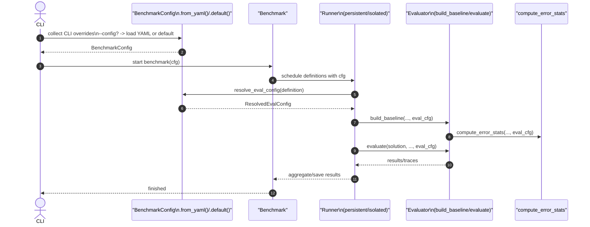

# [PR #388] feat: support per-definition benchmark config via YAML

source: https://github.com/flashinfer-ai/flashinfer-bench/pull/388
state: closed | updated: 2026-04-13T19:54:18Z
labels: 

## 正文

## Summary

- Refactor `BenchmarkConfig` into a Pydantic model to support fine-grained configuration.
- Introduce `EvalConfig` and `ResolvedEvalConfig` to handle fallback and resolution logic for evaluators.
- Support a multi-layer merge strategy: Global defaults -> Per-op-type overrides (`op_type_config`) -> Per-definition overrides (`definition_config`).
- Enable configuration loading from a bundled or custom YAML file (with CLI `--config` support).
- Abstract evaluator-specific parameters (e.g., `sampling_validation_trials` and `sampling_tvd_threshold`) into an `extra` dictionary.
- Update `PersistentRunner`, `IsolatedRunner`, and all standard Evaluators to consume the fully resolved configuration.
- Restructure the documentation by adding a dedicated "Run Benchmark" tutorial that details the config schema, merge priority, runners, and evaluators.

<!-- This is an auto-generated comment: release notes by coderabbit.ai -->
## Summary by CodeRabbit

* **New Features**
  * YAML-based benchmark config with hierarchical overrides (definition > op-type > global) and CLI --config; improved default config loading and run workflow.

* **Documentation**
  * Reorganized docs navigation; added "Run Benchmark" tutorial and updated quickstart and CLI guides with config and run examples.

* **Public API**
  * Expanded configuration models and evaluator interfaces to consume resolved, evaluation-scoped configs.

* **Tests**
  * Added validation and YAML-loading tests for new config behavior.
<!-- end of auto-generated comment: release notes by coderabbit.ai -->

## 评论 (10)

### coderabbitai[bot] · 2026-04-13

<!-- This is an auto-generated comment: summarize by coderabbit.ai -->
<!-- This is an auto-generated comment: rate limited by coderabbit.ai -->

> [!WARNING]
> ## Rate limit exceeded
> 
> `@Ubospica` has exceeded the limit for the number of commits that can be reviewed per hour. Please wait **9 minutes and 6 seconds** before requesting another review.
> 
> Your organization is not enrolled in usage-based pricing. Contact your admin to enable usage-based pricing to continue reviews beyond the rate limit, or try again in **9 minutes and 6 seconds**.
> 
> <details>
> <summary>⌛ How to resolve this issue?</summary>
> 
> After the wait time has elapsed, a review can be triggered using the `@coderabbitai review` command as a PR comment. Alternatively, push new commits to this PR.
> 
> We recommend that you space out your commits to avoid hitting the rate limit.
> 
> </details>
> 
> 
> <details>
> <summary>🚦 How do rate limits work?</summary>
> 
> CodeRabbit enforces hourly rate limits for each developer per organization.
> 
> Our paid plans have higher rate limits than the trial, open-source and free plans. In all cases, we re-allow further reviews after a brief timeout.
> 
> Please see our [FAQ](https://docs.coderabbit.ai/faq) for further information.
> 
> </details>
> 
> <details>
> <summary>ℹ️ Review info</summary>
> 
> <details>
> <summary>⚙️ Run configuration</summary>
> 
> **Configuration used**: defaults
> 
> **Review profile**: CHILL
> 
> **Plan**: Pro
> 
> **Run ID**: `b4fcbcc3-f8aa-4112-812e-5981b0c65c19`
> 
> </details>
> 
> <details>
> <summary>📥 Commits</summary>
> 
> Reviewing files that changed from the base of the PR and between 4e2a9fe4ec7d4cf31dd5058202fe9c1b80e1fe4a and 77105d240b5b9e015c5f87243f7287a7b55de428.
> 
> </details>
> 
> <details>
> <summary>📒 Files selected for processing (3)</summary>
> 
> * `flashinfer_bench/bench/evaluators/lowbit.py`
> * `flashinfer_bench/cli/main.py`
> * `tests/bench/test_evaluator.py`
> 
> </details>
> 
> </details>

<!-- end of auto-generated comment: rate limited by coderabbit.ai -->

<!-- walkthrough_start -->

<details>
<summary>📝 Walkthrough</summary>

## Walkthrough

Reworks benchmark configuration to Pydantic models (BenchmarkConfig, EvalConfig, ResolvedEvalConfig) with YAML/default loaders and a resolve_eval_config merge; threads per-definition ResolvedEvalConfig through CLI, Benchmark, Runners, and Evaluators. Adds eval_config.yaml, docs, and tests; updates evaluator signatures and CLI --config handling.

## Changes

|Cohort / File(s)|Summary|
|---|---|
|**Documentation & Navigation** <br> `CLAUDE.md`, `docs/docs.json`, `docs/start/quickstart.mdx`|Added docs/ layout note; reorganized Docs navigation and quickstart examples to show `BenchmarkConfig.default(...)` and `from_yaml(...)`.|
|**Tutorials** <br> `docs/tutorials/run-benchmark.mdx`, `docs/tutorials/cli.mdx`|New Run Benchmark guide and CLI tutorial; documents BenchmarkConfig schema, loading modes, runner/evaluator behaviors, and `--config` usage.|
|**Core Config API** <br> `flashinfer_bench/bench/config.py`, `flashinfer_bench/bench/eval_config.yaml`, `flashinfer_bench/bench/__init__.py`|Replaced dataclass BenchmarkConfig with Pydantic model; added `EvalConfig` and `ResolvedEvalConfig`; added `from_yaml()` and `default()` loaders and `resolve_eval_config()` merge logic; bundled `eval_config.yaml`; re-exported new types.|
|**Benchmark Construction** <br> `flashinfer_bench/bench/benchmark.py`|Default construction now uses `BenchmarkConfig.default()` when no config provided.|
|**Runner Integration** <br> `flashinfer_bench/bench/runner/isolated_runner.py`, `flashinfer_bench/bench/runner/persistent_runner.py`|Runners derive `eval_cfg = cfg.resolve_eval_config(definition)` and pass ResolvedEvalConfig into evaluator calls (baseline and evaluation paths).|
|**Evaluator API & Implementations** <br> `flashinfer_bench/bench/evaluators/...` (`evaluator.py`, `default.py`, `sampling.py`, `lowbit.py`, `dsa_sparse_attention.py`, `dsa_topk_indexer.py`)|Evaluator abstract/concrete signatures changed to accept `ResolvedEvalConfig`; sampling moved legacy defaults into class constants and reads thresholds from `cfg.extra`; LowBit removed inline cfg mutation.|
|**Utilities** <br> `flashinfer_bench/bench/utils.py`|`compute_error_stats()` now accepts `ResolvedEvalConfig`.|
|**CLI & Dependencies** <br> `flashinfer_bench/cli/main.py`, `pyproject.toml`|Added `--config` CLI flag; CLI builds `cli_overrides` and loads config via `from_yaml()` or `default()`; added `pyyaml>=6.0` dependency.|
|**Tests** <br> `tests/bench/test_benchmark_config.py`, other tests|Added/updated tests for EvalConfig validation, `from_yaml()` loading, and `resolve_eval_config()` merge priority; removed unused imports in several tests.|
|**Docs-only** <br> `CLAUDE.md`|Documentation section added describing docs/ structure.|

## Sequence Diagram(s)



## Estimated code review effort

🎯 4 (Complex) | ⏱️ ~45 minutes

## Possibly related PRs

- flashinfer-ai/flashinfer-bench#294: Overlaps CLI run command changes and flags—touches the same CLI config-loading area.  
- flashinfer-ai/flashinfer-bench#354: Modifies or extends evaluator implementations; related to evaluator signature/type changes.  
- flashinfer-ai/flashinfer-bench#135: Prior changes to BenchmarkConfig defaults/profile handling—overlaps with config refactor and default loading.

## Suggested reviewers

- yzh119  
- xslingcn

## Poem

> 🐰  
> I hopped through YAML, soft and bright,  
> Layered defaults tucked in tight.  
> From CLI to runner configs flow—  
> Resolved, merged, the traces grow.  
> A happy rabbit cheered below! 🥕

</details>

<!-- walkthrough_end -->

<!-- pre_merge_checks_walkthrough_start -->

<details>
<summary>🚥 Pre-merge checks | ✅ 2 | ❌ 1</summary>

### ❌ Failed checks (1 warning)

|     Check name     | Status     | Explanation                                                                           | Resolution                                                                         |
| :----------------: | :--------- | :------------------------------------------------------------------------------------ | :--------------------------------------------------------------------------------- |
| Docstring Coverage | ⚠️ Warning | Docstring coverage is 25.81% which is insufficient. The required threshold is 80.00%. | Write docstrings for the functions missing them to satisfy the coverage threshold. |

<details>
<summary>✅ Passed checks (2 passed)</summary>

|     Check name    | Status   | Explanation                                                                                                                                                 |
| :---------------: | :------- | :---------------------------------------------------------------------------------------------------------------------------------------------------------- |
| Description Check | ✅ Passed | Check skipped - CodeRabbit’s high-level summary is enabled.                                                                                                 |
|    Title check    | ✅ Passed | The title accurately describes the main feature change: introducing YAML-based configuration support with per-definition overrides in the benchmark system. |

</details>

<sub>✏️ Tip: You can configure your own custom pre-merge checks in the settings.</sub>

</details>

<!-- pre_merge_checks_walkthrough_end -->

<!-- finishing_touch_checkbox_start -->

<details>
<summary>✨ Finishing Touches</summary>

<details>
<summary>🧪 Generate unit tests (beta)</summary>

- [ ] <!-- {"checkboxId": "f47ac10b-58cc-4372-a567-0e02b2c3d479", "radioGroupId": "utg-output-choice-group-unknown_comment_id"} -->   Create PR with unit tests
- [ ] <!-- {"checkboxId": "6ba7b810-9dad-11d1-80b4-00c04fd430c8", "radioGroupId": "utg-output-choice-group-unknown_comment_id"} -->   Commit unit tests in branch `main-dev/2026-04-13-eval-config`

</details>

</details>

<!-- finishing_touch_checkbox_end -->

<!-- tips_start -->

---

Thanks for using [CodeRabbit](https://coderabbit.ai?utm_source=oss&utm_medium=github&utm_campaign=flashinfer-ai/flashinfer-bench&utm_content=388)! It's free for OSS, and your support helps us grow. If you like it, consider giving us a shout-out.

<details>
<summary>❤️ Share</summary>

- [X](https://twitter.com/intent/tweet?text=I%20just%20used%20%40coderabbitai%20for%20my%20code%20review%2C%20and%20it%27s%20fantastic%21%20It%27s%20free%20for%20OSS%20and%20offers%20a%20free%20trial%20for%20the%20proprietary%20code.%20Check%20it%20out%3A&url=https%3A//coderabbit.ai)
- [Mastodon](https://mastodon.social/share?text=I%20just%20used%20%40coderabbitai%20for%20my%20code%20review%2C%20and%20it%27s%20fantastic%21%20It%27s%20free%20for%20OSS%20and%20offers%20a%20free%20trial%20for%20the%20proprietary%20code.%20Check%20it%20out%3A%20https%3A%2F%2Fcoderabbit.ai)
- [Reddit](https://www.reddit.com/submit?title=Great%20tool%20for%20code%20review%20-%20CodeRabbit&text=I%20just%20used%20CodeRabbit%20for%20my%20code%20review%2C%20and%20it%27s%20fantastic%21%20It%27s%20free%20for%20OSS%20and%20offers%20a%20free%20trial%20for%20proprietary%20code.%20Check%20it%20out%3A%20https%3A//coderabbit.ai)
- [LinkedIn](https://www.linkedin.com/sharing/share-offsite/?url=https%3A%2F%2Fcoderabbit.ai&mini=true&title=Great%20tool%20for%20code%20review%20-%20CodeRabbit&summary=I%20just%20used%20CodeRabbit%20for%20my%20code%20review%2C%20and%20it%27s%20fantastic%21%20It%27s%20free%20for%20OSS%20and%20offers%20a%20free%20trial%20for%20proprietary%20code)

</details>

<sub>Comment `@coderabbitai help` to get the list of available commands and usage tips.</sub>

<!-- tips_end -->

<!-- internal state start -->


<!-- DwQgtGAEAqAWCWBnSTIEMB26CuAXA9mAOYCmGJATmriQCaQDG+Ats2bgFyQAOFk+AIwBWJBrngA3EsgEBPRvlqU0AgfFwA6NPEgQAfACgjoCEYDEZyAAUASpETZWaCrKPR1AGxJcAZiWpcDtzc+BS4PJRgSj7wGOrw+FgCZAywzM4A1goYMUSQEvBokACaAIIAsgAykAAUtpBmAMwAHM0AlJCQBqV4sKFcAKoC+Ijc8AxFXQDK+NgUDCSQAlQYqVzpsVEkEgD0AEwADHsAbGAHACxgAIyNYNtoHmBMOfB5gEmEkLjOpJyQG1jTL64bCILj4bhkWoMCj+Gj0Q4nM6XG7QA7HDjnACsHBOAC0Ol0BjZKlxYLhcNxQTsdkR1LBsAINExmDsfB40IgEDlItpWezObE/BQwMlVrAdtxsB4PDsWs0jABhWCYUjIWK4CiKbALWgcAxQGwkHxoMShSAAIRSaUyCsSuRQGAI6GsslomHEDD+ihIHk++Hs2GCoXCMXIxCosTo2Vyc2oCQwGn1kAAko7NbRtYsAKISB62l55TD0Q2IfAeKS0HN5u2vP2QZUYWheSD3DzYahm43SgQmrJFyAw0tt8SJSAefC0z39p0w3jSdgt3Ntjt8fBSCgUeBKZD9nxSjzyQdliuLh7tgh8bjONBsGgURCJqDJ5jcLxsR3O5hS8RgdmySh/JQpD2Bq1AkEQ8g+GazwxlQI5YEew7xlwRDjj2vrRGg37IB8ELCuCYC4LIEL8Oum7brU4IAPpERCVEwa8HS4ZE0SxPEo5rpQ5HSLUrFxPB9E1kQbSPpAWYYCozYMUQsbwWO+BoLQsR5D4mrMM6AjYI2Xj0NBIIEOpZRVJAMTNv2in0AqlTJgGQZhPkhS6E8QmiaUAiIKBYinsuF5gKMojwDEnpXlQt6UMgNQkBoRAaAANPYN6vspVFLlucaJDRm4PIg8WIIlHjJbgEi0DRsCDn0Hi0B06r+pgLYAB6gZASliPGzjyKOrbntBQkPkmAzcG6NDWOFSA0I6NhaeQFDxcmQ5gbQk0YNN8XmdKIFFs49BdSuyBOs8DhsJ8sCLHu0qHtIx5RtJsnxqJJYatqwIws1+AMI47DpUk8gWcpzoAERLRaVrpBQGT/Z8eChIUGEkF88AFRgeS4Cd0a1ogqQkOk8VsBQwG8Akm5EfFFBTeFq2Nt53X3omBgWJAtqsOogGIHlqoBk4LhGFAUzKVJLDMOoXCpKE3joMEB5juqJnwPVPGACgEjBeJgyCBpAk0+D4MuNspMgXQA7kTf0MAVVGcRuW48RyzoteEBV3g86CUzCzBrn9WkglGNAeSgL7Bn1+pgIYBgmFAZC6VrWEEMQZDKHCCisOwXC8PwwiiOIUh6woShUKo6haDo+gh+AUBwKgqB1VHhCkNNC0J++vxUPrHOg/IcjZ8oeeaNoTnB8XpgGFZpQDAAIlmGjMLqBj/TPdOWKUyYx7X8eHa3/Ba6kKrSN0tBKPQRTkM3gA4BCPb0fY6X2QFMj1iHMiw1AABrQb2IDsD9tIAuAT2On8Z1g/Q+j3HpPB+x1qCvXeg3PaqMn4vzfs1eAMJTQuDHGgWQsxwg1AAOJw3EEjK+Xwwh0HitAKGWUPA5UgAAMX5LAVMQoYBUAWPFEe1AORw3igAeW4DAYiixDRChSCQDo/YPJgSgWAiSBQiCX1QDdGE9BYiQBgQwV+z8VEaCEKWDAID9Z0myONcIV52bjgmPHLSOclFqNfqIsIb94rKNfsCC8MNX4P3sVYvkHIuRCkIowkgdinb0AcTsAitFpBvw0JAAAcv6Pcqx4KOyYEoeK45JzxR6mmMsJlxzN03kjHi+tKCLHVOmTMtBabmHnh4B28E9r+hRosJQJtry1PXg1EIhDdKXgZAVT07B4jbygDE8gvEz4Ny+mARIks8nAUUf/Sow8x4T1oO/WmlRIzIBmXQLgABqK45wdhnCMFmDy8B0jxySYsGEBQSDNyNFBMIXBKj4H1tPWegcwBGA8VYjRWi9Qz3+nPSAC8l5xyjKvdqbStmICMIaUI0i4gAC8vao1PioyAR9MHYEtogL+XwBCQEka8L6XAYQSTYPQBpGLsHkj+jYuEX8iCajVk6TFOC/rX2cAywJA46BlJQLgZARieJOimfIB+9KdgAEdsUMAyPSkBNQXZuzwRKghuAdgm3gG4pRkrECUHXGANAYwdX9gfq7JQHhBLrjQKQEBqkWCgPCEy2Y3ARJiXqleRsUYj4kOcdlL+7dfqqqcdDbKOxSYYBFCDTIOqH6hrIa/LVprKbxtIS4nY+qKCGuNdq2oGQSAkDGCG9N4bljKTAGguYkz9ZRoLRQcgHhVnqyLeyHUx1FhzgKLMZAR8uE8IhLiyALq1a6JRp8fW/oR2Ui4CfVh+rcBfxqM8eGcRVUWp9Na5QdrhGUz7dw6AvCW0CNWCQJdK7tBruRqjEg9Uxp/QfqE3hr8ABUIDhXIAcKkdAyBH3cEIs+mkWNmBxqfYOmkUq0BgGFSs+KcMGAaHdaUWgQh9JRgeec3BRAdixCUBfOS+AtZUofiu29wIHgaHBLUkBzgqDyDHX0PAjAGy0jwVSgqHkoxUd/kubA0gKlAtKNUuO8Y6kduaqIdkcFRNtNvR0+OZpJQCF6S2R0AyYVJmGffNR58gS/yJdIuScjL5ioANyEv9HJ4MdAJQ9PGB3VT4hxDSHdV0IF5RMCBWkOEShCNFilAkgeZFFAjDrPIJslj2zIB7OaIcq4exjmnPOddb0vKbl3M1sGLg5Q6DwEcG8wFHyvmwMlTK8Y8r1XLPqv82e9MQU1zBfQCFyDCPMa3hp1M4mrCyBRqOMrcr6UNXyiQeKVLRSpFBlkYzck2QvLa/k+gDr1IHRvlhpRloxSTfzLkGoGg9ttBAUpRBuBJZOhBA+jbE2bQuUwt+Xb+2dUMfE7e4b7TemeHkKItbzMYQFR4qOTS2kowP1bIJAsGhZA3ibRJ402FID6wQM2U561zbkQffrZwX5uBUUjYgON6gROJDx/YjAjhMouLjWEMsKagkdibZEuAiwXsvjMuQ2qu8oxFH1c8fewmG1xikGjGS0nRxXhRvYy71owbbdeBoJbVFIfMA8DUf6zBZBg9yBDqH/14oE5FxgRAABeQ4BwDsU3oBgObnIXl7UnQGBgCxWaSEWCRoSkBDeQD2xoGjTuiAYEgUsI0otGAwjjKqyXk2aieRIFRBd8VpIHZ5ZGq9SjxtS4yBoSNVEHjK7ylIHH0hsKG+gKTIRD9aZ1b519MTVKmlSer7Jz11muk8Ds30tTzmNNabWRs+bpBdTRcxIchLBgTniGS/QS5aX4C3JbJlx5kBnmvIBdzAeHiE0Zq1VVmrgK6uLwa3BcFjg16tehTvWgyAdPjLkrEDypNWpE4dBqLUDA/pFCMtUaSMtmzcdHA88TVkNkj8bIXigokQaeA4Wknue2TkX+auGusuiuTaHQToOeVu7KeCrYPA14YU949gTAEI9A7c4InwR6ZofE7ECYwKbOkAgYQ0VsIeIwiAYAMIJ6CwUsGAWQ/+aek2382aAE4cIQ6oEaJAMq3mIhowROjScM2g5CJkakSiOwHieqBqPIJqf8ShsCG+4aWaOaJqAmleNSMmTotekmLSMmrWVmnS/A3Sym9m/SnemmiQ2mYyn08EkyGA0ykWaoWAwS2h5CmqBUVWqyoWveWyA+OyAA7HFoluPnXFPtcjPhlg8r8EvgVqvp8gYOvqWgEZGtGptpkNvukXvqCofk1sfpCqft4UYMhnvM6IfOArppfMKpYloTka/HkTwYUZPPVCAiUi/n9FSkfEDBHpkF/JOmDLNs3P/tQl4nQpEJLgzqjC0duNCPAMkOIuEEUJGqph9IfsgNsJQPIC+i+hQXJAAOv2Blh4C/yXETEZDjiKQnEJxqASTwTxR4QYabKhDHbhYRaiDyroDSK35bG8psHFIs5YxuHxjm68pMAUAX6QD1qNoRAUAYaYDsE1Q8ClLtrR78B4CSiCqRLJiGKagFAUTDDjpFCAGObIJCEfjAE0JgHCgQE7EQAmKOxe7vw8pFDda9ZYClBWA2TM6viLDW66J4J9DNxOiPH7xYCxCElKIl4mgkBTBww6orb36gkPyjHS5CQ6o7FjYxpgwORFA6nGkZD3aIaZ5aTZ7Sg1B54x6DhF4l58Zm48qCCrr1Gz4PzKkLBqm4AgIXpsR4IH51zR4ByM7YHARX7sC/q6kZAy5EA+7OjdZuhqYMAihsKT5CS3Sjgbq+hPZfjVLwCinySKR/Qbqgi0GIB/SA5NhRi3bVIRTmkFF6ng5Nm4BWkHZtApIKRKR4Lv4VDVCmSLBPa/6BakRcSWzoB4y6YtkJlJly5qQK5Q7dnvzpJ8CalPSDGoxf5HbpySyKJ8l9BYCPyLlCTrnuokn2AQiv4xAirKjhCAHQZkmWz0AhQ3hwzhTiyvg/TICo44r8BYAEDcKtYf61DThPnOjvQeSOo0kPwQDSQgKzhto8T1k6Qw5YTNnXkhhzANJ8B8SPmLDTbxiACYBJ+kWuYQDnDIUpCMnpQJmrIJxswL+Icb6A+ZVBFFFDFLrvNPHBIEKqNJxh+AxXwAQEQKhCNqiWAPcbKZ8GciQOgiTEaEUqetiYRgjH9CAUQLCaZHeH9AUGaWcaJg/G/EODcUTtyf2DtDNjPlxbUDxXFPDpjoGDhkYUTjsBqC4jyvCb8dIHUl4CsI7kolTk2m/HTjqq+CCJAOUPgFmDsDkmoLgCwT6HXA/DCGVvIlROcpjCVCLjRpTHVCDo1FQIduMCGGaLZaEH5HeYFPZp+bgYgO6lGbGR+F9sRYBHjP4ohJZVgATNDERCZGaFSqGI7LZb/KRYkMnCxEaGxARmREBXoDJWBosIBRRMtaBWxVILDLDs2bCc0puA+ZsUomRmVfAg/hJJuFbC9LjP3jWQ+rbBoHQWBDUAdrTL5oFgeLruEG1YKugLmAjJJFcmTHwFWbUHhLWSJeEIJSgPxXQL2VLB5AcbxiuIwGBEQNDFbJTAjuMLAPwNwmElAiQPIA2A2bUCPEaNhbgPFFMPlMpPFEvslcwlMKUIjXJuyLfk6lfPTZgajReMdOVGWIic4GKbMPMOhgoSVaBDTviSdr3pxpSHWGcqKQ3EnuBGNABLBQZFTLtA6M9vzWaD2PqkrByDuM7BrXfrILrqsG2AOdeosGwHkkgOpP/vql4K1GxqjDEPeOELlVyHkNVRQAYVUh5QbnWKYYdQ3pYU3tYYpm3o5upkYFpqMhAtCYkB4V4VvCJKEeFn3lFjFscIcgcLEWcvEalokbPvcllovi8ukUVgYCAQKNyBQFRGnjsO3VRFRPNV3RoNwLIDvoJvvrHGUS3JURvNUQ/E3d4pQG3VaB3fPV3T3VRH3bICApbs3Crf7EolWB4EmYVUEiWFdJWEuPvfIY6uXshTylYf9Q0upEZUol3Tnl3TRuOEjLWUoOthaQfV/W2YmfqXBo1OHLuY7VqF4BRa3nYZ6IKTZA4GiSqSHdQWHTXqjHXtReHTHfJlxrYSpg4TPjClAHFRmM2FPUyS3XPWKAvZQ0vfxL3f3Q/FwA/E/dKC/bQYNHXEtkogANr/QJk66QC8MWlJn/QAC6ICToD8PDfD8Ugjf9wjMju98jAjR95YdAijQkoj5eSYVgCdMIdwsd/1FkUYcy09zJFDqQVDFjND6gdDa9jD6jBYcaKjFYDjuQiqW91hnDl9+pOdBgYWPE4Ruyeww+pdE+DmldyRNdaRK+Ddpj5D7dCTFpq9g9JRYZK8FRLWE97Wg8kWlK0CCZQZROq25BVN34QueZ8p/EMM8AiKl8XjF5BYb14j/orZV27ZmunZTT8OJ0vhV9qAlupJbse8SxVy3mbSVKK6moHFOS8sZtrw/uC4rWTDyFJMoN38HtckxtXGvh7tPgGgCBMUns3d8N+VoNstXRJpt6ogfV8kk48sLsl6qsYoW85SRglSSDhO4dJhqDZh+uAFWsN92DkDuDHe+DThIyNQYqT+lAk525SCWFZTvGJFuT5mlu7SzetmUDidQ1tZfu1Ad8AF4lR6Jlj+Fq9VCNPeedgT0WVwMRo+SW5dn9ETc+KR2WuW+WMTEAmRcTQo5j4o7d0kyTxR88w9y8R+nMHUWT+SGmhor4KpQSDTbjEDQ0Jo/IzBWzCikJ1+v8NQT2dUHN4wzMTDVEIQHk3dtDVEICqUQ0v8ymb0GQHQT2aZ7o9mOpbCRDPoQZar2N+8SiAAAgWSlA8GlBeDUBuobv9GgD4HeP9InijGAlC3OLoZ1Q/KklREdodkWogpfBjg2m/pTPgARboibb9vg8BTLD6LQNtT6NkHfpekSSmJkhmO2g0YC/QAWb+q468Iqjnryl4LmB+HhHcEuBWw5ROY7P/rECdETBif4utcpLuofZdKoyfdWI47UGdJLCEJKOyHCHBobcKAdI4MDaO4idFb+rwJpV4G3WwojCQM2rUVGB/pqkJL+P2X9OwHSfgOqPGUIy5PLkgTUGLrAPFCcetS5j/a0+nkuZ02B4tduInsuokEpAkudOWYiSDkuAc1rkrvagoVSleHKrao0ggunKELIEhhzgq3++DohPnqDtJDUCSxgHG/6HdSRbmfrigv+HgYoqEDnPLFszJcxwi/tR2r4dRGEgc1w8x5RtjmEmI6Nj05YnNVUxlNJDJ6p5QRoOSiQCI/LAjkUsBZLJblGg/Fpla2eP9vB0zs4H9nwJxSLammdWgOVZdc4GW6LV1fdRAlKALj6PIFiQ/M42o6fS5C5+XpAJTXOKYo2aU82bqrzUQEGwVDaxlN5dlJB3lCzoVMVKVELZVDokZ67CeJw8kIZcG/QbQF5aHvHNbATGvI5z4U6OV3grECIGIMY46PUqjHR8DhF9gbILKZElmJ6kWCip2gnRjCdOkEsBdHK6/ngiAYYpEFgU1/Dnon+jRLwgc5B8x7txdQktdcgAWv+EQeKpJ7wmZQ/Lpzqv4N+hVPbTvWF+u+BwHO80JsgxHT81Ha0pg83jYcC/YaC9vEmI+5Pmq0ojy7PWnhoLD4K128mRt+Og0Upipk13qJ0FAA/Lm1jjjlpNWVwqh1w+qGIwYFj0onrtXlwET21B4CT46GTxTzd2Thl+QjT9wMT6Tw/OT7oKFQQB4Bz8T7NtQEz3zw/HTkL3T1wyL7gGL9j5lditlf7XQDjulFL4kA8DL48XLzz8zy51wCPBVVw3fvFAFrIGT1AOD6bazFD2Q7y7D/Dy5CF6u3vfqcj/jajwnRj7z9j7j4GPjwblwOqHr+L1T7UsH46KH9j6TswOTtlJH4Gb7/z2WL4Dr9H0opL9kgpEn8z4r6RyVCr/ler5ALT5r/T7L/L0ope6OTe+7ZGFwMMNTsn9LVQIb8b6b8ChgBbzz1AEqC8zb7+tD63Y71aEyC5Iq927xKws0rbx8M6xmetu696MgTyi9fHOoEKt7/ZRfpmvM/izCJj3z1MMxTQKxf2zW+tzCKujZvIqp1Fg/Ec0gGWAtIH9NI3/gNTu4lpxH6X5z9L+sg8gm8NQIjRTrqmuK/8y+gWLhoANwDACKAoAuNOPiUp4BY8ogZDtWRD72Ia+fmOvj6Ab5LBP+TaexGmyOwa9oBd+KvlYFmqhhKConEMDv2QB39QwUYJ7JqXrbVkcerlbHLjkT745kGfAknKz0TSCCU+gvbPtQDjRZ9ZelOUQkr1V5F81eI4cgVr0r4Z9ou2beOJ2SYEyFIwRBJjDCHVCUA5wcIRhtlyShIwUuIbeMPH3Z5P4405gxGMlyKglQUYBXAfDIOT7W9wOfwY1MWiICcDLudEaSO3zEDwD4oiPMAU/B/42CQhUXDvhqAiEvdcglvYFFRyB6ehbwfQREqOCg5bZ9SR/bHgBzXImwKEwHQIIkMgBwdpy24LgObw6BBxgYcjfUi306alDQOL6N7nUO74NDlqk/ZMi3z65UQGOl5XZvFGY7dCKOugZai70R488/GYRXJrshuCxYwAmISIqE0ZajN0sLLGugAAlXgsAeulyyMDD8+WljcUCMPBxIEUmIrUonXGaySt86MKUoISlnwQUJqo4KalgFHJw10A6QsBKQ1ALxN567dK4ZriQKRcbyRFX9EEJjxX03u+BcEFGHbhbcwkOqWICbGwBPczSrse9t/Eurc0F0v6fPsr2oB5UlBCQZpkogOAaAAAnJiFlpmlHBykEBNzjkhPZW+rnbAqFG/J4F424QBdIlxy6WDrWX0WwXjj/hXADgBwLLklxoh5c3B0gR7tSIfi0i9gkXKMr8MxF20AmAsOMmCTUqLcHa7SdOOCkxizcTG9vGHqCPnqCt6GPKXDOMDETiYjBH4J0Je3JKdpIgaIq7jyiHYidPhWAN7og0+6fMUG0hX7hYQBYGMgWaPYHk5jBZDJnCtQBor8IsjfECwFTZqKwmM6yBUW/oeMZ6EuQ7AYGEmKMY/nCJtB3mHmOIH4B9i+ZmwAWB4LIGCy50AmSwmlgcGLqbCLkFdbYEkV2EL5om7yE4Y3WtEj9bRlDIOqoni6aB+6tw4FKK0axj1MmzwgwLKzQp5MmcB7cplxzCQ1kUUzKIgIxnCAPxKae1XALvWph4cL6/Q1UbMOSHdsliqAdfp1SLGD8shigewPv2eg8R/8D8TSAjBKhbM72caTGHKkEgbh04fxWWphweAmtKA6JU9LLT8rSAQgOsJGFnWlbPZPUZooJAwB8BI8DxV4VmF12+bzhAIvWREqWG5q9sjB/OX0F/hNCO59ULZQiTFFj4SjwJREvupqFr6gTIwPEmKP7x4EE9hJGgcPqZVhKu4XweAGPFxFCCx4gQiAK0vHiIk9kLMzcZEYfnLbBdl2LjJ8cmVDFV5WkFE8sfXj+4xisGLeD8Xg0GR29gRDvKcRYxnFKE5xq9DPueLnHXiVwcPbFJVDwF3s1JjAIiVwH6HxQvcieD4N5MvG+SLw/k4CUFMjAhSOJXAR8Wu1yCRSHsLfC8dTXimhAmQJ0SCWhLEB/FUpYUpoW03/oFhspiGEBDFLynfgCpwdCCRkCgn+VWYFUogOlIMmhdMprwOqQdlyk+SD2GgUHJ8VCDpBT03U8KTRyynQF6pkARqaNLPB+SJpSEqabO1mktohwhkgabpUWnDSFhVLTsTsgORgBzgvYlLEywHFV158vwHLEpA5ajiB4ZwxJtOIPaqI8oseEKPqmzzkh+kiQIVivlSYj0HhGTJ4WfgGhVcDaa0i8BA2+GkESI7cVCiaBAZKIOJ76HAnyIgaYABmdTKWveL/gZS3e67OZCPDyhTA/pJAUoIDLUyJAWpRUgEh1JgkBV1ykSGJPwAIq3Nxg8eRIM/mmYvJNyLYDcDVTJpODA8yobtHwEUSjUtIhI4YLQHozWxwi5mKFlSg8Z9iCwyMxYFBTFK/i74EDA8fjMLY5tiuigclq8zeaGFwx33SMZZOjHos46ODBMUnSKETjzhYIr6UoR+mjBnA/06gAYjuj0NGGlMtANTIDm0z6Z8EJmW1NZllT2ZXudST1KqnQchIQ0hqUonDmRz7w0c4OYzLGnxzSpuAcqcnNCmpzSZSZTOe2IiwvMgmITelnET7G3Sdh1dBfE9LyzMBjhb0z2R9Nck+yL8aAGiOCHam4YrmwdBccKyXH3D0mErKFNUSjJB0tJEmCEI2AAq+Eq57vEEv4Aji/1qpZ9f/IpOFBfZ706KZkISUvg2VdxkzLJFMUiTUyAoQUHPNbUfoXz5JseZvLHnhIKSxZrdL7HjggYkYiJ2M3kXeF1n51KULTLeY41hIEcE6y8r8Rh3DnQBR5qYJQHLAoBMygJgUwSeQEg4oK0F3qTBXHOKntSS5sEqWAWmLZ6yHcRaM8WlN2nH05hkSITL6AYmTlWCRoniA8zlmoxsues8IBM17a1lvYNtLEU9xBDEc2kwCmKKSIUHkiToxfEcBJMir2IOJmeAXhJK4ls9icmM3iTgOvZ4L726i3iaJMD56KzUGiqSVZXiiaQhFJ0H6C9A3pXE5g7aThlSgaJf4wkJkr7uZLQZ/NG8NkwHnZJB4ENHJzdZyZQ29nwzQg304eaBTHnELKAnk3KXlFQXcAMg6CiedgoCkgTb2KU8uYwoilHSs5549JUQowWUBclSU4xTtJgULSopXkwhZkuyUkKi5ZChOaXKTl7YU5c05obVNKXLTs5FS1pckqwUdKWZFCnpc5UYUNLBppSlvoJDkk0BP5nSb+aLGGF/zlJ1AVSegkJJcALwqQDQNADIClgZohoslAsEOWhBjlpyg3KED6Vpz8hBYaKW/JYCEkY85yuEBsphBbLNQ/8lSZCwJJ4Abl8wWACcrOWPLLlgiMFXcqhUXK5lfU13kmWOn0xaxXmBsX5i74ti2xJ0jsfXOiwXSrpTcsui3O2GDj25j09lt3M5a9ynJNo6JfPTclB0QZtWO4Wk3FYn4pWqoAwEvN3FliXFSgNeTkM3nIq5hDoTjIpBkX3iH5dVZ+edCU56z3InkP2nDGyE/i8Wf439DgvyX198F6izpdMtZhxoNpaJLaShLgV7lEg0Ib8qdX5r4ikF8OIzm+Kaw9cSACCfRUj0ap8iIF0Kc+upDyHXZ12MU+ZcmStWUTXVusncC9CVGKQjxswE8a6MdAwtEkOeMTCRiNU/E2ZJqnlPBKtSTSKA00hYFoxtmh07Z/i35tHWskA946WLeyeEsbFiwgRkSxlRYxiU+Q4lOwVlfQxb41LcFBS8gDtJKVNLhlD8ftXqvwFDqillUsNTXOZ6kKpl2axOV1JnWpyR1D2MdYupKnLrulq63pRXN6l7T+pZMxpTlIXVjSzVyEhYMOvmkLLR1MUpmVeotU3q11R65hUZPnXi8n1Dq29QMrPVLTH1l639W+qYUrtEeNc/FXXIWy7Ih8aw66TmVbmUqHpbLZ6bStencs+5Lky4T7KSr5wp5oMjleDLnncr1xUAGGelWLm7rKFqBOhZzy9XvrwNRkvogbhoDSqlmxSu9cZKTCGgSuUYVJPZgFHZAUOdPSWF+CBDA4sZppUKq2hVLrlumkIWRZnjkEF8cqii1XiLj+EWdxhc4h9PIsL7qblFVIv+LSIZGajvaCsuSEKtI5iBJYnsYmhpS9EESQFw1PgLJM+X/KlJAC+TQxnQROxIIOeHsHKgdDxBg2tTeCL4orXuqLJ6Df5s7IUyuz28iYhyS2pnqTimVn02JfeESovJkqnkxhkvnNDqBt15C6jTMsTw+rwFB4rZIw043/qp+MUpFcepRX6kK8lgDFfWJ8zYrmxQWSgLXMgUNywAxwBDeEzumRMO5NKnuZhoZXpb21zKn2SyKRhsrd8RGsVuUXnlVFsmPMMdHlV1oC0kZRNANfvPTnrsJGYaljUojpoiiiAE65KdOs3VmortFgm7ZMp3XQSV1qkppa5HSG4A7cs/Zghf12rU1OBAANVKDWQR4pQaAMmA4RRIqI0AGwMmHB1TAqIY8ShMPEqDQB3ckAaUbKLzXQAQdI8eHXsJsBZgpgewjhJUCJ1o6MdWOj3OqK0bkb2GfY97XuuQBiijMAsqZtn2lL+hQ8QSRbclw502DdFt4wNRooG41AuwHgILVkAkZg6IdUOmHXDoR1I7KgKOmnQMEx3ckd57GrWOdlVQaLBdVgtLhgG4miQKN8cWPpQGdFMSyttvJUdbkqiDE+du84Uc9oVGuCyoyo4WmLq9XjTSq3IqXYFt7B/wCdRO6ACTrJ0U6qdqOrMOjq13QAddrGt3a1gN15AlNxulwflx92FdaYnQD7qZOMLRaAl1a+LXGIQVhKkwD8J7U4Nu11KmlycHGeAtkX9KD57vRrbOvFXMb9aqWsxv3Jw1ZbrESXVJdj1r3KQStXSsuQ9ib1gKAIre55cGrcZjqmtH6g6Rdr70giMtA8ofZmhH29qx9SXFqQw3+F1F/t6AckJuHsU8QH4Cu5MJDuh2w74diO5HXHoT2Y7E+2O3HZB3D3E7Sd5OyndTvj2060+OfbHQzt73vTsN3ahbfvrXo1jPMnWqhN1sCyti+tUGgbTS1pbwbSVYTBImNqHHUq0NU204Vhu33igxKOGE5m/xSUEb2VM8zlettI1n4+VvXNZkKpt2ZwnYe2+MLVSfn2YkZD9JTUMPBGvAmOMQxIInn7CkS2Jx0VAH1xzI6ysSy8nSQ3l117yqU0MVjI7FkXmbUAb0d6LxySCFt8aVKLhVcsWDGLa2q2X+MB1qD5rqY9EchIlIHX6qSAV5HlFSgspyQgx2BcdI/CDpOGHwtldw00sRo6jsRf0W/DOS8NXha0R+AQJe1Ynw5Qg9aEZnmP0RTMwAUxX2IR3CCoAqUv0AjFrHzX0QXNczP3A3HMy9sTDAENgKzFtQM0FKbAdBBQn7DJgrACoeuEWB0H/BaCzzBbJFsCWVqKxGDGtS7IyHYswW4LKKLUC5lttMW6PSzb/BGpHpcWbxAls6pejhF9aKMVAEpE1iIYEDdYsZk2pxW9aQsGB6ludMblj4yVN0ilfdNZaxVJtdK6ba2tm38t56lByGprUdA0HJ5A9aefVmI1crx664y3VGF+PQ0lgg6jjqxq1K/wREEA3+L4bOwm19W/NXg/5HvICHOOl8HOM7kWz4dUYFzKbC5EbahVbSrBHVBM1SwuKJg0oX9BopENYdGOzHKQ5TBkOdVnSJZVVAxxc1BdAjpQlw5OrAmSq2Ne8mQw+ik0HlbNsgB+WciBoUBvqvexCfeD+O4AqI9xWev8FpOowdTfADg5uC4OlGpNQhlk31OGFsnLyHJn+tyd/QCmkeQpg9kEfGkOqWNUqqU3My9pXI0AzcXQ0doI6i0Pw9RtmLMa5m1GtyXOssNkZyQ4wAqjRpGCLOPlgAJZdZEgNLMJguVoN/eIYw3hGOOzH8/3CY6EuS0wpu8xxzFV1qbGoG8V/jXMwXQukj47jeB/sW3JQ0vHiDbx0gzNq9nz0bizhugytoYOgmmD4J6Gczsk0fKP5x8nZYKmpEsT6FDGsDftNPVT91DMiure3tgX2AEA0bDGQdqPSexFsZofnR+yxOjhHdj3bitFGcoZUVNZI3ABSIKr2I1FYg7krjWbDKwCgvp6FoxNFkArM0emU5OfJnN6ZRw/Ya/nMCwBIsnm4RfM2ZJL1VqrJ5e2yZXvLP9Qpzi2ZY6Lmb0AQwktW8C7/IBXzm9lIK34EcohX3LzlKlcEnCuosIqnl/Qt5e5tnPbLvN+y0FX6HBWQqHlFy8w7Cp4vwr+LTysNYnitF9mB9OwQcw+HoaUsCVMG6LMEzAAtmGW5K6fE8ZrqdyXphWMcVAcoZaodg/wZbUPVnlgm1xZ+KMhlS0iFMnAjYCBmSb3GXw4WRmXJkdoeAY5mKEpl1mHgz39D5N6ejIy+U9HvkeRX5O8GJl1Vv5MZpsN7m5y2KUwGkWAd2j/D/Nf5SwbisWIFCURIVt5QqN8nvB+rodf29WmKMUKVxIcCwJragCByqEvotUZsGzs1R1RRmaFAqQ8aVZ3MdM5xNQE4o1be7vUYAqMGkjTIc4jVoEkaNkQyGZDTT6AGOA4kA29TzW9EdUcdr6EQrOQdZwACCsBz0A0Y5yatWiZ7DwITBgxNncTJ2R4NfD8TEWt5oJiL2P5CzsWoJbWsS1TGHJ8x2MdVzLPqB5Ape1pIUluqWyHyCiECggEvyBQ9m/W643sAuk3ARt+Bjs88Z0voa9LA8fupew66aADIgvYE8uNHqPCF52Ta3g/H7pIE9AhuY4BoDx3mTJGWN9OCIw0DCrw4KQfBiAg4w012kRYDGUKNaz6bICamI6IRwyDEcHw0Sf0FGdXms3Vg8gTmxQgxibhOeFCXVX5FP5Yxv4tKd+iLIIBZIkZQN0BgcZnzWzC9fi5C6Mbi1tsQlGF92RLYhZQsybxETUNjY0C43M2IqlIHLbGiQKCxaFxY3ic/oNr0AmsfCb4wbOYG9kPY3A1sM0vjbUiddHswYG9iCoLhXlbzHy0mzYdhzZlxg6uKhnVEkwvMHLqDaUTJ2M7mQA5ibq+jUiZDp7Pg7ic9CxBrW+QKzpDeOySwhDAVk4gAG9HOXAJFgAF93SyqX8yaIYkUpCgw0B+BkFzYBCQE4mr6N9rqLxp07ohoXZV2rt1gzalAM8RKphDY2fCzdh81lQUXPmlFlI/AD/SlvW7NwnodbpFDvP2JzFuOfgeGLjQ6LE0lOLRW+a0UdB24lWm3Yij+jmwHQzdhUngHNrbQ8JntDPSDqs5Zg/5jOtIcvbLsVXocToTlc6DP4dJIUEFdMZTHXCBRxU/Q5ciwFXKVXR1JcyWLKTqT/pAdp7W87xVLuKV0EaAnnHooyq/2eU4WeOEO3BASgaB81Sardd/hBcNFcIg7lYt4n7cVmDoCRX9B4fA4JVQcq/fJL6hW90hK9s1kMPY4mtNwg1NenWFcvOgg17TKfpyOUfhBKS+NX0cEPd5moZHADdGutGENWm17gV2soOWDFpwvIoVp7rY/xFmpbusJbe/ZCpTscl2zWiVfZphxCOM69Dzh9Tm6bYqk2BqOlMqHkQMOqFLufTWprPsab0opqN+nkCexyZ8JmfLRTyiutcCi1AfF+21o+bDHzbRZsY2hetv1qq9Mx2oMnY3kHgw7iwwlTskxCrCSVrZmO8yypWoau5JBpO95lfjt0y7Q836VHIBkFyzdPaoE4RtHNra87xN6VhuKxicQgkTU6pMfqDOowtZ4KWQMwGGByE5kPT1O4s79k0zVnQM9Z2NIdHiGvA8cO9rsegScMDLxy2HjONyPBhago6zm+6kjM8zLk/MzJELP1giyBNjd8G4sGTvf5ikjZk2w9bNuXWULTsq23WpBaYXkx9tzwj9E+DeYwAFqKUBCXkz51fbCx3653j+f7Gob/T06YM+7HXBEb7Z5Dc8ZHHo3MiDzhZ+naWeJLzWVS1uhs8XEgmdnRNzbfs542HOTwHsfVJq3kzIAvGIr+ek84SWjzJXE8601lvy0SZvnwOE51eIPZ+7N9USoF2PxnE/1LU35IJDXHNaElJRXjQFxCth6yWkH0L6dg5j4WnRsVC1n25S59jIvVoZEsIKJn3ZZbeU3hmEr5Xt3ME2pmRu+Tkl5R9GvDX5RC8XrxcW3XrpZm244QMCVmrjZ07l2pebkPHY7hBp5AnYw1GAHnKrNO2a2jxoD5xmz+g3K5XEKueVoPSE9uIjd+0wGdL7eqjJVcPpZSVETRFMioijkbXALsg8cpVagv7IHMiW9zMDdT5g3o7jF38PCK5Rao60SNMgKlloAZZHvfd+KSwAHGtYr4iSCHc677wP6p0BQvgMFhvF82/Rk8xu80D3XbZTTwty08tvfX2nxLpOl08hbkvuDWsnM9m6Oe97W3rCdt1qc7cLpPJHLxS/3l2TcurgvLpDVpeHFNv0bwcUOKpj3lVxzLOZROI6FJT+ndn7cS5LnDy09wi4lH2azYy3CIAC86WVXoNiLj9woA5wSIscHOACBjgkRA4CoExBieSAewK4LQDpGRFGgtAY4Jp6uAMADgtAfZAcAEDnA6RxwTEIpDpF7Be4InyAOp72B7BIiaAOkWiFoAyirgmIA4HSJ8DNBjgaIPYAIH2SqfGgPgZIJrFaBGhzgewRoJZ8o/nBFPDnvwDF4YCRFaA5wQiY0GU+0A3PwzhEH4DpEMArgAgZoAcBIBXB4vRQYT1x4Fg8eL8/HpIqr3DhReS42JGPLo7al8ehPQcIwN3d57/QkAtgc0CYgLS0BGYDcKwCMDhD/RfA2UEbN16QAcJ4OeGCbyZCm+xRuvVibykjFtA2pSAqYO8IFk5Q0BFvXXzoJ0H+jevU7ZJ1eod957HeBGBAL4B4EoS4WDci3q4Ct5u8ne4kl1RAAAHU6QaKO/LrBe/XfIAA9t78d9O+ruvjhllyP3Su/vfbvZsh7098QCLfzgYPm76d+R+/eUY/39bwEMW+NBgfoP4HxD6kvQG3JSz/2XnNecMyEwsPrgEd/e//Q7vDwR7/ElEwvf0f4Pz77Umx+wBcfm4d+ot5Lo3fifGPs7x2upizjLxl3hn8D5O8s+kf7PonAT658fesff3l+Hj5R9cARfx3sX9z8h+p2WVHz2QHD6Z+K+2fX31H2r4EY8/RMfPgX4D919E+ufpPj4/2cy2drsteG7t+b4x+W/kfnP+X3b4184+tfgv/Hy79F9u+Jf823feK4NfjzMFsvyAIz4D+I+rftSVXyH8x/K+DcjviP875x2u+Sfcfr31L733XbU/6f8H4H/z86/IAewW33n6++F+VE2v4X6X/F9G/26lB5/ruw02g0a/uf+v9b64DN/c/9vonO34B9C+uAhHmP2X978DnxAQ5s33L/h/M/M/Qfhfy3+n8F/NfHfyP4371+dADfH3lf5Qx+PCUDEAJkf1v7H/Z+J/+/sP/z6L/z+S/S/gP3M8efp2yTWdhv5p+o/jv4N+i3piCv+DfrP6d+0fvr6x+RvkZYmW9PsAGP+oAeP5N+kAW35H+c/lH5f++vrzwG+/0Jcg2AKgMlTfemoDQBWAFAO4AnYJAIt5dg+qGD7/Q1uFKC0A/Xvay2A9Act6reW4EtBoo18Cf5KgAJIt6PQ03id5KQi0FpA0BXgEIFyoIgaXhMBEgXwHSAaxP/yJAsgeDCTe5CGIECMiMIN5zQDgNIACBi3jPBMB/ILgAaBJYNhCLeXDMD61+J3m1JRIX5CYGU0itqWRyQGgTri5+X2CCDyBfGC34c0mAF9AmBGgfYAZApZIQR88toEoAkBXcBAwIAJ4tWy+gRNqgBkAwNOUheBW/hugmBubFeiZBTPloaxAeYGQpOBbACYGrEStvBCAo3/sd72BAjI4HOBXAP9DSByLMIEt+PgY36iBAQZ6jsgP7okAmBUZE5hmQDuLJABcEmG4EbE4mH0Z+AB/MixbwifDiR/QH+FmTquzlnJBBA9Lk9gBiEhudY1CPEPu5OWiAOrbMAGgPkEY+2QU0G5BykGcHg+iCJxx0BWgYwG5+hQYFgaBpQQ8G3engHQHd+tQbn4NBZQU0FO+eCJt7bodAe0FAgvgY8E6BGPoEF9BGAC4Ef+eQEwBbemLk36YgGgM0BXAAAKTJO36OXAG42AJrCGs7AOkYC215sLR/ChXjTYHAWIacEt+vVFUFNB5AQTjgIOAVq4TWp0Mj5/ASAJ44O06kE6B5Q4gIgA+A8gHSYohgtLnoZBLfhcECMVwUjA3BJ3i8HFBAJO8HlBiISj5E+vPCIxmBHILgC2ArgaoGMhAjGgDnAjQAICNAsngcCREPgIF7nAtAD4AnADAMcAkALQNaEuhtAAIAehJAMM5XArQM0B7ADAIV5YgkRIV6YgynusLNA5wD4B0ijQE6F0izQJESYgDALQD5B/0OYG2ALQSYGGeboMcAMAjQMcA+A8WDJ4MAmIMcACAewM0AqAaAO557AznrQCREogD2B0iGXtp6YgYYZERXADYcM4kAxnsmHNAmILvBFejQLZ57AdAICgD2xgI15zgOVEBDwiZCnx71enHo15VwNVkcwdUOyvZDCe3dmmG6hVgFhDqudMoaACeQ3pV4WBswI6ATeBwBOFWeK4VeBrhEmsMKUw+gEAA= -->

<!-- internal state end -->

### claude[bot] · 2026-04-13

## Code Review

Overall this is a clean refactor that makes the config system much more flexible. The three-layer merge strategy (global → op_type → definition) is well-designed, and the Pydantic migration makes validation declarative. A few things worth addressing before merging:

---

### Bug: `lowbit` evaluator loses its `required_matched_ratio` default

`lowbit.py` previously had a hardcoded fallback:
```python
if cfg.required_matched_ratio is None:
    cfg = replace(cfg, required_matched_ratio=0.95)
```
This line is removed in the PR, but `eval_config.yaml` only adds a `required_matched_ratio` entry for `moe` — not for `lowbit`. Without a YAML entry or a class-level default, `cfg.required_matched_ratio` will be `None` at runtime for lowbit workloads, which is likely to cause an error or silent misbehavior in the evaluator's correctness check.

**Fix:** Either add `lowbit` to `eval_config.yaml`:
```yaml
op_type_config:
  lowbit:
    required_matched_ratio: 0.95
```
…or keep the default as a class constant in `LowbitEvaluator` (similar to how `SamplingEvaluator` exposes `VALIDATION_TRIALS_DEFAULT` / `TVD_THRESHOLD_DEFAULT`).

---

### Bug: `--config` + argparse defaults always clobber YAML global fields

In `cli/main.py`, `cli_overrides` is built unconditionally from all argparse values:
```python
cli_overrides = dict(
    warmup_runs=args.warmup_runs,   # argparse default = 10
    iterations=args.iterations,     # argparse default = 50
    ...
)
config = BenchmarkConfig.from_yaml(config_path, **cli_overrides)
```

Since argparse sets defaults for every flag, `cli_overrides` always contains every key — even when the user didn't pass that flag. Calling `data.update(overrides)` inside `from_yaml` means a YAML file with `warmup_runs: 100` will be silently overridden back to `10` if the user didn't explicitly type `--warmup_runs 100`.

The docs say "CLI flags are applied as overrides on top of the YAML", which is the right intent, but argparse doesn't let you distinguish user-supplied values from defaults.

**Fix:** Only include CLI args in `cli_overrides` when they were explicitly provided, e.g.:
```python
cli_overrides = {k: v for k, v in vars(args).items()
                 if k in BenchmarkConfig.model_fields and args.__dict__[k] is not None}
```
Or use `parser.set_defaults(...)` to set sentinel values (e.g. `None`) so you can detect "not specified".

---

### Nit: mutable default for `extra` field

```python
# EvalConfig and ResolvedEvalConfig
extra: Dict[str, Any] = {}
```

Pydantic v2 handles `= {}` correctly internally (creates a new dict per instance), but the conventional Pydantic idiom is:
```python
extra: Dict[str, Any] = Field(default_factory=dict)
```
This avoids confusion for contributors who might copy this pattern into non-Pydantic code.

---

### Nit: ambiguous comment in `resolve_eval_config`

```python
def resolve_eval_config(self, definition: Any) -> ResolvedEvalConfig:
    """Merge: per-def defaults -> op_type_config -> definition_config."""
```

The arrow `->` implies priority direction, but it's the opposite of what you'd expect (definition_config has *highest* priority, not lowest). Consider:
```python
"""Merge priority (lowest → highest): global defaults → op_type_config → definition_config."""
```

---

### Nit: doc typo

In `docs/tutorials/run-benchmark.mdx` (line ~177):
> "`run_all` returns a new `TraceSet` that **contrains** all the definitions…"

Should be **contains**.

---

### Minor: deprecation path could be clearer

`sampling_validation_trials` and `sampling_tvd_threshold` are kept on `BenchmarkConfig` with a comment "Deprecated: use op_type_config/definition_config extra instead", and they're unconditionally seeded into `resolved.extra`. This means users who set them at the top level still get the right behavior, which is good backward compat.

However, there's no `DeprecationWarning` emitted. If you want people to migrate, adding a warning in `_validate_fields` when those fields are set to non-default values would make the deprecation visible:
```python
if self.sampling_validation_trials != 100 or self.sampling_tvd_threshold != 0.2:
    warnings.warn("sampling_validation_trials/sampling_tvd_threshold are deprecated; ...")
```

---

Good overall design — the layered config with YAML loading is a significant UX improvement. The lowbit regression and CLI override issue are the two things I'd want confirmed fixed before merging.

### claude[bot] · 2026-04-13

## PR Review: feat: support per-definition benchmark config via YAML

Overall this is a solid refactor — the three-layer merge strategy is well-designed, the Pydantic migration is clean, and the new tutorial doc covers the API thoroughly. A few issues worth addressing before merge.

---

### Bugs / Potential Regressions

#### 1. CLI overrides always shadow YAML values (significant)

In `flashinfer_bench/cli/main.py`, `cli_overrides` is built from **all** `args.*` fields unconditionally:

```python
cli_overrides = dict(
    warmup_runs=args.warmup_runs,
    iterations=args.iterations,
    ...
)
config = BenchmarkConfig.from_yaml(config_path, **cli_overrides)
```

`from_yaml` calls `data.update(overrides)`, so argparse **default** values (e.g. `iterations=50`) will overwrite whatever the YAML specified. If a user sets `iterations: 200` in their YAML and runs `flashinfer-bench run --config my.yaml` without `--iterations`, they'll silently get 50 — defeating the purpose of the YAML.

The fix is to only forward values the user explicitly provided. The standard argparse pattern is to filter out `None` sentinel defaults:

```python
# Use default=None for optional eval args in add_argument, then:
cli_overrides = {k: v for k, v in raw_overrides.items() if v is not None}
```

Boolean flags need special handling (e.g. `store_true`/`store_false` with explicit defaults).

#### 2. Behavior change: `required_matched_ratio` default tightened from 0.95 → 1.0 for non-MoE ops

`default.py` previously set `required_matched_ratio=0.95` as a fallback when the field was `None`. That line has been removed. `utils.py` now falls back to `1.0` when `required_matched_ratio is None`:

```python
# utils.py (unchanged logic)
required_matched_ratio = (
    cfg.required_matched_ratio if cfg.required_matched_ratio is not None else 1.0
)
```

This means **all definitions handled by `DefaultEvaluator` now require 100% element-wise match**, up from 95%. The bundled `eval_config.yaml` only restores 0.95 for MoE, so ops like `gqa`, `mla`, `gemm`, etc. silently got stricter. If any of those ever had 1–2% of elements slightly outside tolerance (floating-point edge cases), they will now fail where they previously passed.

Please either add explicit `required_matched_ratio` entries to the bundled YAML for affected op types, or document this intentional tightening in the PR description.

---

### Code Quality Issues

#### 3. `setattr` bypasses Pydantic validation in `resolve_eval_config`

```python
# config.py:156
setattr(resolved, field_name, value)
```

In Pydantic v2, direct attribute assignment bypasses field validators. Use `model_copy(update=...)` instead, which triggers validation:

```python
updates = {}
for field_name, value in layer.model_dump(exclude={"extra"}).items():
    if value is not None:
        updates[field_name] = value
resolved = resolved.model_copy(update=updates)
resolved = resolved.model_copy(update={"extra": {**resolved.extra, **layer.extra}})
```

#### 4. Unused import: `Field`

```python
# config.py:9
from pydantic import BaseModel, Field, model_validator
```

`Field` is imported but never used. Either remove it, or use it for the mutable defaults below.

#### 5. Mutable defaults should use `Field(default_factory=dict)`

```python
# EvalConfig and ResolvedEvalConfig
extra: Dict[str, Any] = {}
```

Pydantic v2 handles mutable defaults safely internally, but `Field(default_factory=dict)` is the idiomatic form and also makes the intent explicit:

```python
extra: Dict[str, Any] = Field(default_factory=dict)
```

This also resolves the unused `Field` import.

#### 6. Dead code: isinstance checks in `_validate_fields`

Pydantic v2 coerces field types before validators run, so `isinstance(self.rtol, float)` after `rtol: float` is always `True`. Lines 82–101 contain several such checks (`isinstance(self.rtol, float)`, `isinstance(self.atol, float)`, etc.) that can never fire. Remove them or replace with domain-logic guards only (which the adjacent value-range checks already handle).

#### 7. No validation on `EvalConfig` fields

`EvalConfig` accepts any value without range checks — e.g. `EvalConfig(rtol=-1.0)` or `EvalConfig(warmup_runs=-5)` will silently produce an invalid `ResolvedEvalConfig`. Consider adding a `@model_validator` to `EvalConfig` mirroring the checks in `BenchmarkConfig._validate_fields` for non-None values.

---

### Documentation

#### 8. Typo in `docs/tutorials/run-benchmark.mdx`

> `run_all` returns a new `TraceSet` that **contrains** all the definitions...

Should be "**contains**".

#### 9. `profile_baseline` absent from Eval Config Fields table

The table in "Eval Config Fields" does not list `profile_baseline`, but `ResolvedEvalConfig` includes it and it can be overridden per op_type / per definition via `op_type_config`. If this is intentional (system-only), `profile_baseline` should be removed from `ResolvedEvalConfig` to keep the abstraction clean. If it's overridable, it should appear in the table.

---

### Minor Nits

- The `sampling_validation_trials` / `sampling_tvd_threshold` deprecated top-level fields are seeded into `extra` in `resolve_eval_config`, and the bundled YAML also sets them under `sampling.extra`. This means a user configuring sampling via `op_type_config.sampling.extra` will see them applied twice (second wins, so functionally OK), but it's confusing. Consider removing the deprecated field seeding once the fields are confirmed unused.
- The docstring on `resolve_eval_config` says "per-def defaults -> op_type_config -> definition_config" (correct, ascending priority), but the tutorial lists them top-down as "1. Per-definition, 2. Per-op-type, 3. Global" (descending priority). Both are accurate descriptions of the same thing — worth making sure they use consistent framing.

### claude[bot] · 2026-04-13

## Code Review

Overall this is a clean, well-structured refactor. The three-class design (EvalConfig -> ResolvedEvalConfig via BenchmarkConfig.resolve_eval_config) makes the merge semantics explicit, and the YAML-first loading approach is a good ergonomic improvement. A few things to address before merging:

---

### Bug: lowbit evaluator loses its required_matched_ratio default

In flashinfer_bench/bench/evaluators/lowbit.py, the old code had a fallback for when required_matched_ratio was None. This PR removes that fallback without adding a corresponding entry to eval_config.yaml. The bundled YAML only sets this for the moe op_type; lowbit is not covered.

When BenchmarkConfig.default() is used (the new default path), lowbit definitions will receive required_matched_ratio=None. If the downstream comparison in lowbit.py does min_matched_ratio >= cfg.required_matched_ratio with a None value, this will raise a TypeError at runtime.

Fix: add lowbit: required_matched_ratio: 0.95 to eval_config.yaml, restoring the previous implicit default.

---

### Minor: Unused import in config.py

Field is imported from pydantic but never used in the new code. Remove it.

---

### Minor: Mutable default for extra dict

Both EvalConfig and ResolvedEvalConfig declare extra: Dict[str, Any] = {}. Pydantic v2 handles this transparently, but the idiomatic form is Field(default_factory=dict). This makes intent explicit and avoids subtle aliasing issues.

---

### Minor: setattr on a Pydantic model in resolve_eval_config

Mutating a constructed Pydantic model via setattr bypasses validation. A cleaner pattern is to collect the merged values into a plain dict and call ResolvedEvalConfig.model_validate(merged) once at the end, rather than mutating in place.

---

### Minor: No DeprecationWarning for deprecated top-level fields

sampling_validation_trials and sampling_tvd_threshold in BenchmarkConfig carry a comment saying they are deprecated, but setting them produces no runtime warning. Users who pass these directly won't know to migrate to op_type_config["sampling"].extra. Consider emitting a DeprecationWarning in _validate_fields when either is set to a non-default value.

---

### Documentation: Typo in run-benchmark.mdx

"run_all returns a new TraceSet that contrains all the definitions..."

Should be "contains".

---

### Test coverage gap: extra dict merge not tested

test_resolve_merge_priority verifies scalar field priority correctly, but does not cover the extra dict merge path. A test that sets extra at both op_type_config and definition_config layers and checks that keys merge correctly (with definition_config winning on conflicts) would close this gap.


### claude[bot] · 2026-04-13

## PR Review: feat: support per-definition benchmark config via YAML

Overall this is a solid, well-structured refactor. The migration from a flat `dataclass` to a Pydantic-based three-layer config (`BenchmarkConfig` → `EvalConfig` → `ResolvedEvalConfig`) is clean and the test coverage for the new merge logic is a good start. A few issues worth addressing before merging:

---

### Bug: Regression in `LowbitEvaluator` — `required_matched_ratio` no longer has a fallback

**`flashinfer_bench/bench/evaluators/lowbit.py`**

The old code explicitly handled the `None` case:
```python
if cfg.required_matched_ratio is None:
    cfg = replace(cfg, required_matched_ratio=0.95)
```

This was removed, but `eval_config.yaml` only sets `required_matched_ratio` for `moe`, not `lowbit`:
```yaml
op_type_config:
  moe:
    required_matched_ratio: 0.95
  # lowbit is missing!
```

`ResolvedEvalConfig.required_matched_ratio` defaults to `None`, so any lowbit evaluation run without an explicit YAML override will now receive `None` where a float is expected — likely causing a `TypeError` at runtime.

**Fix**: Add `lowbit` to `eval_config.yaml`:
```yaml
op_type_config:
  moe:
    required_matched_ratio: 0.95
  lowbit:
    required_matched_ratio: 0.95
```

---

### Bug: CLI defaults silently override YAML config values

**`flashinfer_bench/cli/main.py`** (~line 875)

`cli_overrides` is always fully populated from `args.*` — including fields where the user did not pass an explicit flag. When `--config my_config.yaml` is used, the argparse defaults (e.g. `warmup_runs=10`, `iterations=50`) will override anything specified at the top level of the YAML, making the YAML's global defaults effectively invisible.

Example: a YAML with `iterations: 200` + CLI without `--iterations` → resolved `iterations` will be `50` (argparse default), not `200`.

**Fix**: set argparse defaults to `None` for these overrideable fields and filter before passing to `from_yaml`:
```python
cli_overrides = {k: v for k, v in raw_overrides.items() if v is not None}
```

---

### Minor: `resolve_eval_config` uses `setattr` to mutate a freshly-constructed Pydantic model

**`flashinfer_bench/bench/config.py`** (`resolve_eval_config`)

```python
resolved = ResolvedEvalConfig(...)
for layer in layers:
    for field_name, value in layer.model_dump(exclude={"extra"}).items():
        if value is not None:
            setattr(resolved, field_name, value)   # bypasses Pydantic validation
```

Pydantic v2 models allow `setattr` by default (not frozen), but doing so bypasses validation. Prefer building the final `kwargs` dict first and constructing `ResolvedEvalConfig` once:

```python
kwargs = { "warmup_runs": self.warmup_runs, ... }
extra = { ... }
for layer in layers:
    if layer is None:
        continue
    for k, v in layer.model_dump(exclude={"extra"}).items():
        if v is not None:
            kwargs[k] = v
    extra.update(layer.extra)
kwargs["extra"] = extra
return ResolvedEvalConfig(**kwargs)
```

---

### Nit: mutable `{}` defaults in Pydantic models

```python
class EvalConfig(BaseModel):
    extra: Dict[str, Any] = {}   # line ~391

class BenchmarkConfig(BaseModel):
    op_type_config: Dict[str, EvalConfig] = {}   # line ~449
    definition_config: Dict[str, EvalConfig] = {}
```

Pydantic v2 deep-copies these correctly, but the idiomatic form makes intent explicit:
```python
extra: Dict[str, Any] = Field(default_factory=dict)
```

---

### Nit: Typo in new tutorial doc

**`docs/tutorials/run-benchmark.mdx`** line 177:

> `run_all` returns a new `TraceSet` that **contrains** all the definitions...

Should be **contains**.

---

### Positive notes

- The three-class design (`EvalConfig` / `ResolvedEvalConfig` / `BenchmarkConfig`) is clean and maps directly to the YAML structure.
- `resolve_eval_config` correctly merges `extra` dicts via `dict.update` rather than replacement — consistent with the documented semantics.
- The `SamplingEvaluator` constants (`VALIDATION_TRIALS_DEFAULT`, `TVD_THRESHOLD_DEFAULT`) are a good addition.
- New tests cover the YAML round-trip and merge priority correctly.
- The `pyyaml` dependency addition in `pyproject.toml` is appropriate.

### claude[bot] · 2026-04-13

## PR Review: feat: support per-definition benchmark config via YAML

Overall this is a well-structured refactor. The three-layer merge strategy (global -> op_type -> definition) is clean, the Pydantic migration is a good fit for config validation, and the new tutorial docs are thorough. A few issues worth addressing before merge:

---

### 1. Behavioral regression: Lowbit evaluator loses its required_matched_ratio fallback (Bug)

**flashinfer_bench/bench/evaluators/lowbit.py**

The old code contained an explicit fallback that was removed in this PR:

    if cfg.required_matched_ratio is None:
        cfg = replace(cfg, required_matched_ratio=0.95)

The bundled eval_config.yaml adds the 0.95 default for moe but has no entry for lowbit:

    op_type_config:
      moe:
        required_matched_ratio: 0.95   # covered
      sampling:                        # covered
        extra: ...
      # lowbit: missing!

Any call path that reaches LowbitEvaluator.check_correctness with a config built via BenchmarkConfig.default() will now have resolved.required_matched_ratio == None. Depending on how the evaluator uses that value downstream, this is either a silent correctness change or a crash. Fix: add lowbit: { required_matched_ratio: 0.95 } to eval_config.yaml.

---

### 2. setattr on a Pydantic model bypasses field validation (Bug risk)

**flashinfer_bench/bench/config.py, resolve_eval_config**

    for field_name, value in layer.model_dump(exclude={"extra"}).items():
        if value is not None:
            setattr(resolved, field_name, value)

In Pydantic v2, setattr on a non-frozen model skips validators. If a definition_config entry contains warmup_runs: -1, it will be written into ResolvedEvalConfig without the range check. Prefer:

    updates = {k: v for k, v in layer.model_dump(exclude={"extra"}).items() if v is not None}
    resolved = resolved.model_copy(update=updates)

---

### 3. Mutable default extra = {} (Style / latent risk)

**config.py, EvalConfig and ResolvedEvalConfig**

Pydantic v2 handles bare {} defaults safely, but the idiomatic form is:

    extra: Dict[str, Any] = Field(default_factory=dict)

Same applies to op_type_config and definition_config in BenchmarkConfig.

---

### 4. pydantic not listed in pyproject.toml (Packaging)

pyyaml was correctly added, but pydantic is now a direct first-class dependency. It should be pinned explicitly: "pydantic>=2.0"

---

### 5. Custom --config silently drops bundled op-type defaults (UX concern)

**flashinfer_bench/cli/main.py**

When a user passes --config my_config.yaml, the bundled eval_config.yaml is completely ignored. If their YAML only sets iterations: 200, they silently lose moe.required_matched_ratio: 0.95. The docs mention this, but a log warning at runtime would prevent hard-to-diagnose correctness regressions.

---

### 6. Deprecated fields have no DeprecationWarning (Minor)

**config.py**

sampling_validation_trials and sampling_tvd_threshold are marked deprecated in a comment but accessed silently. Emitting a DeprecationWarning in _validate_fields when these fields differ from their defaults would guide users toward the new op_type_config["sampling"].extra pattern.

---

### 7. Typo in docs

**docs/tutorials/run-benchmark.mdx, line 179**

"run_all returns a new TraceSet that contrains all the definitions" -- "contrains" should be "contains".

---

### Minor: resolve_eval_config called twice per definition in both runners

In isolated_runner.py and persistent_runner.py, cfg.resolve_eval_config(definition) is called once in run_ref and again in the evaluate path. The call is lightweight so it is not a correctness issue, but passing the resolved config through would avoid redundant work on large workload sweeps.

---

**Summary**

| # | Severity | File | Issue |
|---|---|---|---|
| 1 | Bug | evaluators/lowbit.py + eval_config.yaml | Lowbit required_matched_ratio fallback lost |
| 2 | Bug risk | config.py | setattr bypasses Pydantic validation in resolve_eval_config |
| 3 | Style | config.py | Mutable defaults should use Field(default_factory=dict) |
| 4 | Packaging | pyproject.toml | pydantic missing from explicit deps |
| 5 | UX | cli/main.py | Custom --config silently drops bundled defaults |
| 6 | Minor | config.py | No DeprecationWarning for deprecated fields |
| 7 | Docs | run-benchmark.mdx | Typo: "contrains" -> "contains" |

### claude[bot] · 2026-04-13

## PR Review: feat: support per-definition benchmark config via YAML

Overall this is a well-structured refactor. The three-layer merge strategy (global → op_type → definition) is clean and the Pydantic migration makes the config schema self-documenting. A few issues worth addressing before merge:

---

### Bug: CLI overrides unconditionally shadow YAML per-op-type values

**`flashinfer_bench/cli/main.py`** — `run()` function

```python
cli_overrides = dict(
    warmup_runs=args.warmup_runs,    # always set, even if user never passed this flag
    iterations=args.iterations,      # same
    ...
)
config = BenchmarkConfig.from_yaml(config_path, **cli_overrides)
```

Every CLI field (including argparse defaults like `warmup_runs=10`) is always included in `cli_overrides`. `BenchmarkConfig.from_yaml` then calls `data.update(overrides)`, which means top-level defaults from the CLI unconditionally override the global defaults that would have been inherited by op_type/definition layers.

Concretely: if `my_config.yaml` sets `op_type_config.moe.warmup_runs: 20` and the global default is `warmup_runs: 10`, but the user runs `flashinfer-bench run --local ... --config my_config.yaml` _without_ passing `--warmup-runs`, the CLI default of `10` will replace the YAML's global and the op_type override won't see the right baseline.

**Fix:** Only include CLI args in overrides when they were explicitly set:

```python
cli_overrides = {}
if args.warmup_runs != parser_default_warmup_runs:
    cli_overrides["warmup_runs"] = args.warmup_runs
# ...
```

Or use `argparse`'s `None` as the sentinel for "not set" by not providing `default=` for those args, and filter out `None` values before passing.

---

### Mutable default arguments in Pydantic models

**`flashinfer_bench/bench/config.py`**

```python
class EvalConfig(BaseModel):
    extra: Dict[str, Any] = {}          # mutable default

class BenchmarkConfig(BaseModel):
    op_type_config: Dict[str, EvalConfig] = {}    # mutable default
    definition_config: Dict[str, EvalConfig] = {}  # mutable default
```

While Pydantic copies mutable defaults for each instance, the Pydantic convention (and explicit best practice) is to use `Field(default_factory=dict)`:

```python
from pydantic import BaseModel, Field

class EvalConfig(BaseModel):
    extra: Dict[str, Any] = Field(default_factory=dict)
```

This avoids subtle issues if the class is used outside Pydantic contexts and makes the intent explicit.

---

### `setattr` on a Pydantic model is an anti-pattern

**`flashinfer_bench/bench/config.py`** — `resolve_eval_config()`

```python
for field_name, value in layer.model_dump(exclude={"extra"}).items():
    if value is not None:
        setattr(resolved, field_name, value)
resolved.extra.update(layer.extra)
```

Mutating a Pydantic model via `setattr` bypasses validation and breaks if `frozen=True` is ever added. Prefer building a dict of merged values and constructing `ResolvedEvalConfig` in one shot, or using `model_copy(update=...)`:

```python
updates = {k: v for k, v in layer.model_dump(exclude={"extra"}).items() if v is not None}
merged_extra = {**resolved.extra, **layer.extra}
resolved = resolved.model_copy(update={**updates, "extra": merged_extra})
```

---

### Missing deprecation warnings for `sampling_validation_trials` / `sampling_tvd_threshold`

**`flashinfer_bench/bench/config.py`**

The PR description marks these fields as deprecated and the comment says `# Deprecated: use op_type_config/definition_config extra instead`, but unlike `log_dir` there is no `warnings.warn(...)` when users set them. Anyone still passing these to `BenchmarkConfig(...)` will get no indication they should migrate.

---

### `EvalConfig` missing `profile_baseline`

**`flashinfer_bench/bench/config.py`**

`profile_baseline` lives in `BenchmarkConfig` as a system field and gets copied into `ResolvedEvalConfig`, but `EvalConfig` has no `profile_baseline` field. This means per-op-type or per-definition profiling cannot be disabled independently. If this is intentional, it's worth a comment explaining why it's system-only.

---

### Typo in documentation

**`docs/tutorials/run-benchmark.mdx`, line 179**

> `run_all` returns a new `TraceSet` that **contrains** all the definitions...

Should be **"contains"**.

---

### Minor: test coverage gap for deprecated field warning path

`tests/bench/test_benchmark_config.py` tests YAML loading and merge priority well, but there's no test that setting `sampling_validation_trials` / `sampling_tvd_threshold` on `BenchmarkConfig` is correctly seeded into `resolved.extra` via `resolve_eval_config`. Worth adding given the backward-compat promise.

---

**Summary of priority:**
- 🔴 Bug: CLI defaults always override YAML global config
- 🟡 Code quality: mutable defaults, `setattr` mutation
- 🟡 Missing deprecation warnings
- 🟢 Doc typo, test gap, missing `profile_baseline` in `EvalConfig`

### claude[bot] · 2026-04-13

## PR Review: feat: support per-definition benchmark config via YAML

The overall direction of this PR is solid — migrating from a flat `dataclass` to a layered Pydantic model with YAML support is a meaningful improvement. Here are my findings:

---

### Critical: CLI args always override YAML, even when not explicitly specified

**File:** `flashinfer_bench/cli/main.py:944-956`

```python
cli_overrides = dict(
    warmup_runs=args.warmup_runs,   # argparse default: 10
    iterations=args.iterations,       # argparse default: 50
    ...
)
config = BenchmarkConfig.from_yaml(config_path, **cli_overrides)
```

`argparse` fills in defaults for unspecified flags, so `cli_overrides` always contains values (e.g., `warmup_runs=10`) whether or not the user passed `--warmup-runs`. This means **YAML config values are always shadowed by argparse defaults**, not just by flags the user explicitly specified.

The documentation even says _"CLI flags like `--rtol` or `--iterations` are applied as overrides on top of the YAML"_ — implying they should only kick in when actually specified.

**Fix:** Set `default=None` for all overrideable argparse args, then strip `None` values before passing:
```python
cli_overrides = {k: v for k, v in dict(
    warmup_runs=args.warmup_runs,
    iterations=args.iterations,
    ...
).items() if v is not None}
```
This requires adjusting the argparse defaults to `None` for the numeric/flag args that should be YAML-overrideable.

---

### Critical: `LowbitEvaluator` fallback for `required_matched_ratio` was removed without a YAML default

**File:** `flashinfer_bench/bench/evaluators/lowbit.py:779-781`

```diff
-        if cfg.required_matched_ratio is None:
-            cfg = replace(cfg, required_matched_ratio=0.95)
```

This guard is removed, but `ResolvedEvalConfig.required_matched_ratio` defaults to `None`. The bundled `eval_config.yaml` only adds `required_matched_ratio: 0.95` under `op_type_config.moe` — there is no entry for `lowbit`.

Any user who constructs `BenchmarkConfig()` directly (without `.default()`) and runs a `lowbit` benchmark will get `None` passed to the comparison logic, which will likely raise a `TypeError` at runtime.

**Fix:** Either add `lowbit` to `eval_config.yaml`:
```yaml
op_type_config:
  lowbit:
    required_matched_ratio: 0.95
  moe:
    required_matched_ratio: 0.95
```
Or restore a safe fallback inside `LowbitEvaluator.check_correctness` (e.g., `min_ratio = cfg.required_matched_ratio or 0.95`).

---

### Design: `from_yaml` keyword overrides don't deep-merge nested dicts

**File:** `flashinfer_bench/bench/config.py:533-538`

```python
@classmethod
def from_yaml(cls, path: str, **overrides: Any) -> BenchmarkConfig:
    with open(path) as f:
        data = yaml.safe_load(f) or {}
    data.update(overrides)   # top-level replacement, no deep merge
    return cls.model_validate(data)
```

If a caller passes `op_type_config={"sampling": EvalConfig(...)}` as a kwarg, it replaces the entire `op_type_config` from the YAML rather than merging into it. This is potentially surprising and should be documented, or the override semantics should be restricted to scalar/system fields only.

---

### Minor: `resolve_eval_config` docstring is misleading

**File:** `flashinfer_bench/bench/config.py:548`

```python
def resolve_eval_config(self, definition: Any) -> ResolvedEvalConfig:
    """Merge: per-def defaults -> op_type_config -> definition_config."""
```

"per-def defaults" reads like per-definition defaults, but it means the global top-level defaults of `BenchmarkConfig`. Suggest: _"Merge: global defaults → op_type_config → definition_config"_.

---

### Minor: `EvalConfig.required_matched_ratio` constraint allows 0.0 being rejected but 1.1 passes

**File:** `flashinfer_bench/bench/config.py:398`

```python
required_matched_ratio: Optional[float] = Field(default=None, gt=0, le=1)
```

A value like `1.1` would be rejected by `le=1`. A value of `0.0` would be rejected by `gt=0`. But the test parametrize list in `test_eval_config_validation` includes `("required_matched_ratio", 1.1)` — confirming `le=1` is correct — however `0.0` is not tested for `EvalConfig`. Worth adding as it mirrors the existing `BenchmarkConfig` test.

---

### Minor: `from_yaml` doesn't give a user-friendly error for missing files

**File:** `flashinfer_bench/bench/config.py:534-535`

```python
with open(path) as f:
```

A `FileNotFoundError` with the raw path is reasonable, but since this is a user-facing entry point, wrapping with a clearer message (e.g., `"Config file not found: {path}"`) would improve the CLI experience.

---

### Positive observations

- The Pydantic migration is clean — the field-level `ge`/`gt`/`le` constraints replace the verbose `__post_init__` checks nicely.
- Seeding deprecated `sampling_validation_trials`/`sampling_tvd_threshold` into `extra` in `resolve_eval_config` provides smooth backward compatibility.
- The `SamplingEvaluator` class-level defaults (`VALIDATION_TRIALS_DEFAULT`, `TVD_THRESHOLD_DEFAULT`) are a good pattern since they serve as fallbacks if `extra` is empty.
- Test coverage for YAML loading and merge priority is solid. The `SimpleNamespace` trick to avoid needing a real `Definition` object is clean.
- Documentation in `run-benchmark.mdx` is thorough and well-structured.

### claude[bot] · 2026-04-13

## PR Review: feat: support per-definition benchmark config via YAML

Overall this is a well-structured refactor — migrating `BenchmarkConfig` to Pydantic, introducing the `EvalConfig`/`ResolvedEvalConfig` split, and the three-layer merge strategy all make sense. The documentation in `run-benchmark.mdx` is thorough and the test additions are a good start. A few issues worth addressing before merge:

---

### Bug: `None` CLI args clobber YAML settings (`cli/main.py`)

`cli_overrides` is built from every `args.*` field unconditionally, including fields that are `None` when the user didn't pass them (e.g. `definitions`, `solutions`, `required_matched_ratio`). This dict is then passed to `from_yaml(..., **cli_overrides)`, which does `data.update(overrides)` — so a YAML value like `definitions: [my_def]` would be silently overwritten by `None` from the CLI defaults.

```python
# current — None values clobber YAML settings
cli_overrides = {
    "definitions": args.definitions,   # None when not provided by user
    ...
}
config = BenchmarkConfig.from_yaml(config_path, **cli_overrides)
```

Fix: strip `None` overrides before passing them in, or (better) only populate `cli_overrides` for args the user explicitly set:

```python
cli_overrides = {k: v for k, v in cli_overrides.items() if v is not None}
```

---

### Regression: `LowbitEvaluator` default `required_matched_ratio` removed (`evaluators/lowbit.py`)

The old evaluator had an explicit fallback:

```python
if cfg.required_matched_ratio is None:
    cfg = replace(cfg, required_matched_ratio=0.95)
```

This is removed in the PR, but `lowbit` is not added to `eval_config.yaml`. Because `ResolvedEvalConfig.required_matched_ratio` defaults to `None`, any run against a `lowbit` definition will now have `required_matched_ratio=None` where it previously had `0.95`. Depending on how the evaluator uses this value downstream this could silently change pass/fail behaviour or raise an error.

Either add `lowbit` to `eval_config.yaml`:

```yaml
op_type_config:
  lowbit:
    required_matched_ratio: 0.95
```

…or restore the in-evaluator fallback (`cfg.extra.get("required_matched_ratio", 0.95)` pattern). The `moe` op_type was correctly added to the YAML; `lowbit` needs the same treatment.

---

### Test gap: `extra` dict merge order is not exercised (`tests/bench/test_benchmark_config.py`)

`test_resolve_merge_priority` covers scalar-field merging well but doesn't test the `extra` dict merging (which uses `dict.update()` rather than replacement). A case like op_type_config sets `extra={a: 1, b: 2}` and definition_config sets `extra={b: 3, c: 4}` — the resolved extra should be `{a: 1, b: 3, c: 4}` — is worth pinning with a test since the logic is subtly different from the scalar fields.

---

### Minor: deprecated fields don't emit runtime warnings

`sampling_validation_trials` and `sampling_tvd_threshold` are marked deprecated in docstrings and comments, but users who pass them directly to `BenchmarkConfig(...)` get no runtime signal. The `_validate_fields` model validator already fires; adding a `warnings.warn(..., DeprecationWarning)` there for non-default values would complete the deprecation story and help users migrate to the `extra` dict pattern.

---

### Minor: `profile_baseline` placement is inconsistent

`profile_baseline` is a system-level field on `BenchmarkConfig` and is wired into `ResolvedEvalConfig` via `resolve_eval_config`, but it's absent from `EvalConfig`. This means it can't be overridden per-op-type or per-definition even though it ends up in the per-definition resolved config. The inconsistency is harmless today but worth noting in a comment or the doc table (it's not listed under "System Fields" in the tutorial).

---

The YAML loading, Pydantic migration, and multi-layer merge logic look correct. The documentation additions are clear and well-structured. Addressing the `None`-clobber bug and the lowbit regression would make this safe to merge.

### claude[bot] · 2026-04-13

## PR Review: feat: support per-definition benchmark config via YAML

Overall this is a well-structured refactor. The three-layer merge strategy (global → op_type → definition) is clean, the migration to Pydantic is a clear improvement over the manual validation in the old `__post_init__`, and the YAML loading uses `safe_load` correctly. A few issues worth addressing before merge:

### Bug: Test passes wrong config type to evaluator

In `tests/bench/test_evaluator.py`, the new test `test_lowbit_uses_default_required_matched_ratio_dps` constructs a `BenchmarkConfig` and passes it directly to `LowBitEvaluator.evaluate()`, but all evaluators now expect `cfg: ResolvedEvalConfig`. This type mismatch works at runtime only because both Pydantic models happen to share the required attributes. It will silently break if `ResolvedEvalConfig` adds required validators or changes field names. The test should resolve the config first:

    resolved_cfg = BenchmarkConfig(num_trials=1, warmup_runs=0, ...).resolve_eval_config(definition)
    evaluation = LowBitEvaluator.evaluate(..., cfg=resolved_cfg, ...)

The same issue may exist in `test_dsa_sparse_attention_evaluator.py` and `test_dsa_topk_indexer_evaluator.py` — both still import `BenchmarkConfig` and likely pass it to evaluator methods that now expect `ResolvedEvalConfig`. Worth auditing.

### Code quality: duplicated default for `required_matched_ratio`

`LowBitEvaluator.DEFAULT_REQUIRED_MATCHED_RATIO = 0.95` in `lowbit.py` and the bundled `eval_config.yaml` both set 0.95 for MoE. These are two sources of truth that can diverge silently. Options:
- Remove the class constant and require the config to always supply it for lowbit op types.
- Keep the class constant as authoritative and remove the YAML entry, since the evaluator already falls back when `required_matched_ratio is None`.

### Minor: unhelpful error on missing YAML file

`BenchmarkConfig.from_yaml` surfaces a raw `FileNotFoundError` with no context if the path is wrong. A small guard with a descriptive message would improve the experience:

    p = Path(path).resolve()
    if not p.exists():
        raise FileNotFoundError(f"Benchmark config YAML not found: {p}")

### Minor: deprecated field seeding in `resolve_eval_config`

The method always pre-populates `extra` with the deprecated top-level fields (`sampling_validation_trials`, `sampling_tvd_threshold`). This means every `ResolvedEvalConfig` — even for non-sampling op types — carries these two keys. The final values are correct because `merged["extra"].update(layer.extra)` overwrites them, but a comment clarifying "backward-compat seeding for sampling evaluator" would reduce confusion for future readers.

### Missing test coverage

1. No test passes `extra: {sampling_tvd_threshold: X}` through `op_type_config` and verifies `SamplingEvaluator` uses it instead of the class default.
2. No integration test exercises `flashinfer-bench run --config my.yaml --iterations 200` and verifies CLI flags override YAML values.

### Nits

- The `log_dir` deprecation warning uses `stacklevel=2` inside a Pydantic `model_validator`. The actual call site is deeper in Pydantic's validation machinery so the warning points to Pydantic internals rather than user code. `stacklevel` likely needs to be higher.
- `BenchmarkConfig.default()` silently falls back to hardcoded Python defaults when the bundled YAML is absent (e.g. editable install without data file). Worth documenting in the docstring.


## Review (4)

### gemini-code-assist[bot] · 2026-04-13 · COMMENTED

## Code Review

This pull request refactors the benchmarking configuration system by introducing a hierarchical Pydantic-based model consisting of BenchmarkConfig, EvalConfig, and ResolvedEvalConfig. This change enables loading configurations from YAML files with support for global, per-op-type, and per-definition overrides. The update includes a new --config CLI argument, expanded documentation, and a migration of all evaluators to the new configuration resolution logic. Feedback focuses on improving the overridability of the profile_baseline field, optimizing import placement for the new pyyaml dependency, and ensuring backward compatibility for lowbit op-type defaults within the provided YAML configuration.

### coderabbitai[bot] · 2026-04-13 · COMMENTED

**Actionable comments posted: 2**

> [!CAUTION]
> Some comments are outside the diff and can’t be posted inline due to platform limitations.
> 
> 
> 
> <details>
> <summary>⚠️ Outside diff range comments (3)</summary><blockquote>
> 
> <details>
> <summary>flashinfer_bench/bench/benchmark.py (1)</summary><blockquote>
> 
> `26-35`: _⚠️ Potential issue_ | _🟡 Minor_
> 
> **Update constructor docstring default to match runtime behavior.**
> 
> Line 34 still says `BenchmarkConfig()`, but Line 43 now defaults to `BenchmarkConfig.default()`.
> 
> 
> <details>
> <summary>Proposed doc fix</summary>
> 
> ```diff
> -        config : BenchmarkConfig, optional
> -            Configuration parameters for benchmark execution, by default BenchmarkConfig().
> +        config : BenchmarkConfig, optional
> +            Configuration parameters for benchmark execution, by default BenchmarkConfig.default().
> ```
> </details>
> 
> 
> Also applies to: 43-43
> 
> <details>
> <summary>🤖 Prompt for AI Agents</summary>
> 
> ```
> Verify each finding against the current code and only fix it if needed.
> 
> In `@flashinfer_bench/bench/benchmark.py` around lines 26 - 35, The __init__
> docstring for Benchmark incorrectly documents the default config as
> BenchmarkConfig() while the constructor uses BenchmarkConfig.default(); update
> the parameter description in Benchmark.__init__ to state the default is
> BenchmarkConfig.default(), referencing the TraceSet type and
> BenchmarkConfig.default() method to locate the code to change.
> ```
> 
> </details>
> 
> </blockquote></details>
> <details>
> <summary>flashinfer_bench/bench/evaluators/lowbit.py (1)</summary><blockquote>
> 
> `28-35`: _⚠️ Potential issue_ | _🟠 Major_
> 
> **Lowbit now defaults to strictest tolerance due to missing eval config.**
> 
> Lowbit is not configured in `eval_config.yaml` op_type_config or definition_config. Since `BenchmarkConfig.required_matched_ratio` defaults to `None`, the lowbit evaluator will pass `None` through the resolved config, causing `compute_error_stats` (lines 110–111 in `utils.py`) to default to `required_matched_ratio = 1.0`—the strictest setting. This represents a behavior change from the prior local fallback.
> 
> **Action:** Add lowbit configuration to `flashinfer_bench/bench/eval_config.yaml` with an appropriate `required_matched_ratio` (e.g., `0.95` for consistency with moe), or document that stricter tolerance for lowbit is intentional.
> 
> Also applies to: 92-94
> 
> <details>
> <summary>🤖 Prompt for AI Agents</summary>
> 
> ```
> Verify each finding against the current code and only fix it if needed.
> 
> In `@flashinfer_bench/bench/evaluators/lowbit.py` around lines 28 - 35, The lowbit
> evaluator ends up using the strictest tolerance because
> BenchmarkConfig.required_matched_ratio is None in the resolved config; update
> the project's eval config so lowbit has an explicit tolerance: add a lowbit
> entry in flashinfer_bench/bench/eval_config.yaml (or the relevant
> op_type/definition config) that sets required_matched_ratio (e.g., 0.95), so
> when check_correctness (method check_correctness in lowbit evaluator) receives
> the ResolvedEvalConfig it will pass a concrete required_matched_ratio into
> compute_error_stats instead of None-defaulting to 1.0; alternatively document
> this change if stricter behavior is intended.
> ```
> 
> </details>
> 
> </blockquote></details>
> <details>
> <summary>flashinfer_bench/cli/main.py (1)</summary><blockquote>
> 
> `287-305`: _⚠️ Potential issue_ | _🟠 Major_
> 
> **CLI defaults override YAML config values, breaking expected precedence.**
> 
> At line 287, `cli_overrides` is constructed from argparse-provided defaults, so `BenchmarkConfig.from_yaml(...)` at line 302 will overwrite YAML values even when CLI flags weren't explicitly passed. Since argparse sets defaults for every argument (e.g., `warmup_runs=10`, `iterations=50`), these defaults unconditionally override any YAML configuration.
> 
> The precedence should be: explicit CLI flag > YAML > hardcoded defaults. The current code produces: argparse default > YAML > hardcoded defaults.
> 
> Additionally, the `dict(...)` constructor at line 287 triggers Ruff C408 (unnecessary `dict` call—should use literal syntax `{...}`).
> 
> <details>
> <summary>Suggested fix</summary>
> 
> ```diff
> -        cli_overrides = dict(
> +        raw_cli_overrides = {
>              warmup_runs=args.warmup_runs,
>              iterations=args.iterations,
>              num_trials=args.num_trials,
>              rtol=args.rtol,
>              atol=args.atol,
>              use_isolated_runner=args.use_isolated_runner,
>              definitions=args.definitions,
>              solutions=args.solutions,
>              timeout_seconds=args.timeout,
>              required_matched_ratio=args.required_matched_ratio,
>              profile_baseline=getattr(args, "profile_baseline", True),
> -        )
> +        }
> +        # Keep only explicit/non-default-like overrides to avoid clobbering YAML.
> +        default_cfg = BenchmarkConfig()
> +        cli_overrides = {
> +            k: v
> +            for k, v in raw_cli_overrides.items()
> +            if v is not None and v != getattr(default_cfg, k, object())
> +        }
> +        # Preserve explicit False from --no-profile-baseline.
> +        if getattr(args, "profile_baseline", True) is False:
> +            cli_overrides["profile_baseline"] = False
> ```
> </details>
> 
> <details>
> <summary>🤖 Prompt for AI Agents</summary>
> 
> ```
> Verify each finding against the current code and only fix it if needed.
> 
> In `@flashinfer_bench/cli/main.py` around lines 287 - 305, The CLI is currently
> building cli_overrides from argparse defaults which always override YAML; change
> the logic so only explicitly-provided CLI flags are applied: construct
> cli_overrides as a literal dict (avoid dict(...)) and only add keys when the
> corresponding args attribute is not None (or adjust the argument parser to use
> default=None for options that should respect YAML), then pass that filtered dict
> into BenchmarkConfig.from_yaml(trace_set, config_path) or
> BenchmarkConfig.default(...) as currently done; update code around
> cli_overrides, BenchmarkConfig.from_yaml, and the use of args (e.g.,
> warmup_runs, iterations, num_trials, rtol, atol, use_isolated_runner,
> definitions, solutions, timeout, required_matched_ratio, profile_baseline) to
> implement this conditional inclusion and remove the unnecessary dict(...) call.
> ```
> 
> </details>
> 
> </blockquote></details>
> 
> </blockquote></details>

<details>
<summary>🧹 Nitpick comments (1)</summary><blockquote>

<details>
<summary>docs/start/quickstart.mdx (1)</summary><blockquote>

`68-79`: **Clarify these as alternative config paths, not sequential steps.**

In the current snippet, Line 78 overwrites the `config` built at Line 69. Consider splitting into explicit “Option A / Option B” blocks to avoid copy-paste confusion.

<details>
<summary>🤖 Prompt for AI Agents</summary>

```
Verify each finding against the current code and only fix it if needed.

In `@docs/start/quickstart.mdx` around lines 68 - 79, The snippet currently shows
two ways to produce a BenchmarkConfig but the second line
(BenchmarkConfig.from_yaml) overwrites the first; update the docs to present
these as two distinct alternatives (Option A: create config with
BenchmarkConfig.default(...) and Option B: load config with
BenchmarkConfig.from_yaml("my_config.yaml", ...)) and make this explicit with
headings or comments and/or use different variable names (e.g., config_default
vs config_from_yaml) so readers know they are mutually exclusive rather than
sequential steps.
```

</details>

</blockquote></details>

</blockquote></details>

<details>
<summary>🤖 Prompt for all review comments with AI agents</summary>

````
Verify each finding against the current code and only fix it if needed.

Inline comments:
In `@CLAUDE.md`:
- Around line 114-121: The fenced code block containing the repository tree (the
block that starts with ``` and lists "docs/ ├── Getting Started ...") should
have an explicit language to satisfy markdown lint MD040; change the opening
fence from ``` to ```text so the block becomes a text code block (leave the
contents and closing fence unchanged).

In `@docs/tutorials/run-benchmark.mdx`:
- Line 31: Fix the typo in the documentation sentence referencing run_all and
TraceSet: change "contrains" to "contains" in the line that reads "`run_all`
returns a new `TraceSet` that contrains all the definitions..."; ensure the
updated sentence reads "contains" and preserves the surrounding backticks and
punctuation for `run_all` and `TraceSet`.

---

Outside diff comments:
In `@flashinfer_bench/bench/benchmark.py`:
- Around line 26-35: The __init__ docstring for Benchmark incorrectly documents
the default config as BenchmarkConfig() while the constructor uses
BenchmarkConfig.default(); update the parameter description in
Benchmark.__init__ to state the default is BenchmarkConfig.default(),
referencing the TraceSet type and BenchmarkConfig.default() method to locate the
code to change.

In `@flashinfer_bench/bench/evaluators/lowbit.py`:
- Around line 28-35: The lowbit evaluator ends up using the strictest tolerance
because BenchmarkConfig.required_matched_ratio is None in the resolved config;
update the project's eval config so lowbit has an explicit tolerance: add a
lowbit entry in flashinfer_bench/bench/eval_config.yaml (or the relevant
op_type/definition config) that sets required_matched_ratio (e.g., 0.95), so
when check_correctness (method check_correctness in lowbit evaluator) receives
the ResolvedEvalConfig it will pass a concrete required_matched_ratio into
compute_error_stats instead of None-defaulting to 1.0; alternatively document
this change if stricter behavior is intended.

In `@flashinfer_bench/cli/main.py`:
- Around line 287-305: The CLI is currently building cli_overrides from argparse
defaults which always override YAML; change the logic so only
explicitly-provided CLI flags are applied: construct cli_overrides as a literal
dict (avoid dict(...)) and only add keys when the corresponding args attribute
is not None (or adjust the argument parser to use default=None for options that
should respect YAML), then pass that filtered dict into
BenchmarkConfig.from_yaml(trace_set, config_path) or
BenchmarkConfig.default(...) as currently done; update code around
cli_overrides, BenchmarkConfig.from_yaml, and the use of args (e.g.,
warmup_runs, iterations, num_trials, rtol, atol, use_isolated_runner,
definitions, solutions, timeout, required_matched_ratio, profile_baseline) to
implement this conditional inclusion and remove the unnecessary dict(...) call.

---

Nitpick comments:
In `@docs/start/quickstart.mdx`:
- Around line 68-79: The snippet currently shows two ways to produce a
BenchmarkConfig but the second line (BenchmarkConfig.from_yaml) overwrites the
first; update the docs to present these as two distinct alternatives (Option A:
create config with BenchmarkConfig.default(...) and Option B: load config with
BenchmarkConfig.from_yaml("my_config.yaml", ...)) and make this explicit with
headings or comments and/or use different variable names (e.g., config_default
vs config_from_yaml) so readers know they are mutually exclusive rather than
sequential steps.
````

</details>

<details>
<summary>🪄 Autofix (Beta)</summary>

Fix all unresolved CodeRabbit comments on this PR:

- [ ] <!-- {"checkboxId": "4b0d0e0a-96d7-4f10-b296-3a18ea78f0b9"} --> Push a commit to this branch (recommended)
- [ ] <!-- {"checkboxId": "ff5b1114-7d8c-49e6-8ac1-43f82af23a33"} --> Create a new PR with the fixes

</details>

---

<details>
<summary>ℹ️ Review info</summary>

<details>
<summary>⚙️ Run configuration</summary>

**Configuration used**: defaults

**Review profile**: CHILL

**Plan**: Pro

**Run ID**: `5e264a6a-6823-4f21-ae0c-d526cd45fe45`

</details>

<details>
<summary>📥 Commits</summary>

Reviewing files that changed from the base of the PR and between 8f8b808874f1bc0da8a099125fc4494f7413761f and 4764b670ab547e21d973d6661c0d140b4965ad92.

</details>

<details>
<summary>📒 Files selected for processing (22)</summary>

* `CLAUDE.md`
* `docs/docs.json`
* `docs/start/quickstart.mdx`
* `docs/tutorials/cli.mdx`
* `docs/tutorials/run-benchmark.mdx`
* `docs/tutorials/server-api.mdx`
* `flashinfer_bench/bench/__init__.py`
* `flashinfer_bench/bench/benchmark.py`
* `flashinfer_bench/bench/config.py`
* `flashinfer_bench/bench/eval_config.yaml`
* `flashinfer_bench/bench/evaluators/default.py`
* `flashinfer_bench/bench/evaluators/dsa_sparse_attention.py`
* `flashinfer_bench/bench/evaluators/dsa_topk_indexer.py`
* `flashinfer_bench/bench/evaluators/evaluator.py`
* `flashinfer_bench/bench/evaluators/lowbit.py`
* `flashinfer_bench/bench/evaluators/sampling.py`
* `flashinfer_bench/bench/runner/isolated_runner.py`
* `flashinfer_bench/bench/runner/persistent_runner.py`
* `flashinfer_bench/bench/utils.py`
* `flashinfer_bench/cli/main.py`
* `pyproject.toml`
* `tests/bench/test_benchmark_config.py`

</details>

</details>

<!-- This is an auto-generated comment by CodeRabbit for review status -->

### coderabbitai[bot] · 2026-04-13 · COMMENTED


<details>
<summary>♻️ Duplicate comments (1)</summary><blockquote>

<details>
<summary>CLAUDE.md (1)</summary><blockquote>

`114-114`: _⚠️ Potential issue_ | _🟡 Minor_

**Add language identifier to the fenced code block.**

The fenced code block is missing a language identifier, which triggers the MD040 markdown lint warning. This issue was previously flagged.


<details>
<summary>📝 Proposed fix</summary>

```diff
-```
+```text
 docs/
 ├── Getting Started        # index, installation, quickstart
 ├── Tutorials              # run-benchmark, cli, server-api, bring-your-own-kernel
```
</details>

<details>
<summary>🤖 Prompt for AI Agents</summary>

````
Verify each finding against the current code and only fix it if needed.

In `@CLAUDE.md` at line 114, The fenced code block in CLAUDE.md is missing a
language identifier (causing MD040); update the block opening fence to include a
language such as "text" or "markdown" (e.g., change ``` to ```text) so the
linter recognizes the code block and the MD040 warning is resolved; locate the
fenced block in CLAUDE.md around the docs tree snippet and add the language
token to the opening fence.
````

</details>

</blockquote></details>

</blockquote></details>

<details>
<summary>🧹 Nitpick comments (4)</summary><blockquote>

<details>
<summary>flashinfer_bench/bench/config.py (4)</summary><blockquote>

`124-125`: **Consider adding a type hint or Protocol for `definition` parameter.**

The `Any` type loses type safety and IDE support. If importing the `Definition` type would create circular dependencies, a `Protocol` can document the expected interface:

```python
from typing import Protocol

class DefinitionLike(Protocol):
    op_type: str
    name: str
```

Then: `def resolve_eval_config(self, definition: DefinitionLike) -> ResolvedEvalConfig:`

<details>
<summary>🤖 Prompt for AI Agents</summary>

```
Verify each finding against the current code and only fix it if needed.

In `@flashinfer_bench/bench/config.py` around lines 124 - 125, The parameter
typing for resolve_eval_config currently uses Any; replace it with a specific
type or Protocol to restore type safety. If you can import the existing
Definition model without circular imports, change the signature to use that
(e.g., definition: Definition); otherwise define a small Protocol (e.g.,
DefinitionLike with attributes op_type: str and name: str) and annotate the
parameter as definition: DefinitionLike; update any related imports and add the
Protocol near the top of the module to document the expected interface used by
resolve_eval_config.
```

</details>

---

`111-112`: **Specify explicit encoding for file operations.**

`open(path)` uses the system default encoding, which can vary across platforms and cause `UnicodeDecodeError` on systems with non-UTF-8 defaults. YAML files are typically UTF-8:

```diff
-        with open(path) as f:
+        with open(path, encoding="utf-8") as f:
```

<details>
<summary>🤖 Prompt for AI Agents</summary>

```
Verify each finding against the current code and only fix it if needed.

In `@flashinfer_bench/bench/config.py` around lines 111 - 112, The file-open call
uses the system default encoding (open(path)) which can cause UnicodeDecodeError
on non-UTF-8 systems; update the code that reads YAML (the with open(path) as f:
/ data = yaml.safe_load(f) block) to open the file with an explicit UTF-8
encoding (e.g., open(path, encoding='utf-8')) so YAML parsing is consistent
across platforms.
```

</details>

---

`13-30`: **`profile_baseline` cannot be overridden per-op or per-definition.**

`EvalConfig` lacks a `profile_baseline` field, so the hierarchical merge in `resolve_eval_config` always uses the global value from `BenchmarkConfig`. If per-definition override was intended for all eval parameters, consider adding:

```diff
     extra: Dict[str, Any] = Field(default_factory=dict)
     """Evaluator-specific parameters that do not belong in the shared schema."""
+    profile_baseline: Optional[bool] = None
+    """Whether to profile baseline. `None` means inherit."""
```

If the current behavior (global-only) is intentional, this can be ignored.

<details>
<summary>🤖 Prompt for AI Agents</summary>

```
Verify each finding against the current code and only fix it if needed.

In `@flashinfer_bench/bench/config.py` around lines 13 - 30, EvalConfig currently
lacks a profile_baseline field, so resolve_eval_config always falls back to the
global BenchmarkConfig value; add an Optional[bool] profile_baseline =
Field(default=None) to EvalConfig (with matching docstring "Whether to profile
baseline; None means inherit") and update any validation/schema comments, then
ensure resolve_eval_config checks EvalConfig.profile_baseline (and respects None
as "inherit") when merging per-definition/per-op settings into the final
evaluated config to allow per-definition overrides.
```

</details>

---

`45-46`: **Missing validation constraint on `required_matched_ratio`.**

Unlike `EvalConfig` and `BenchmarkConfig` which enforce `gt=0, le=1`, `ResolvedEvalConfig.required_matched_ratio` has no constraints. While this model is typically constructed internally, adding constraints ensures defensive validation:

```diff
-    required_matched_ratio: Optional[float] = None
+    required_matched_ratio: Optional[float] = Field(default=None, gt=0, le=1)
```

<details>
<summary>🤖 Prompt for AI Agents</summary>

```
Verify each finding against the current code and only fix it if needed.

In `@flashinfer_bench/bench/config.py` around lines 45 - 46,
ResolvedEvalConfig.required_matched_ratio lacks validation; update the field to
enforce the same constraints as EvalConfig/BenchmarkConfig by using pydantic
Field with gt=0 and le=1 (keep it Optional). Modify
ResolvedEvalConfig.required_matched_ratio to Optional[float] = Field(None, gt=0,
le=1) and add the necessary Field import if missing so the value is validated
defensively when the model is constructed.
```

</details>

</blockquote></details>

</blockquote></details>

<details>
<summary>🤖 Prompt for all review comments with AI agents</summary>

````
Verify each finding against the current code and only fix it if needed.

Duplicate comments:
In `@CLAUDE.md`:
- Line 114: The fenced code block in CLAUDE.md is missing a language identifier
(causing MD040); update the block opening fence to include a language such as
"text" or "markdown" (e.g., change ``` to ```text) so the linter recognizes the
code block and the MD040 warning is resolved; locate the fenced block in
CLAUDE.md around the docs tree snippet and add the language token to the opening
fence.

---

Nitpick comments:
In `@flashinfer_bench/bench/config.py`:
- Around line 124-125: The parameter typing for resolve_eval_config currently
uses Any; replace it with a specific type or Protocol to restore type safety. If
you can import the existing Definition model without circular imports, change
the signature to use that (e.g., definition: Definition); otherwise define a
small Protocol (e.g., DefinitionLike with attributes op_type: str and name: str)
and annotate the parameter as definition: DefinitionLike; update any related
imports and add the Protocol near the top of the module to document the expected
interface used by resolve_eval_config.
- Around line 111-112: The file-open call uses the system default encoding
(open(path)) which can cause UnicodeDecodeError on non-UTF-8 systems; update the
code that reads YAML (the with open(path) as f: / data = yaml.safe_load(f)
block) to open the file with an explicit UTF-8 encoding (e.g., open(path,
encoding='utf-8')) so YAML parsing is consistent across platforms.
- Around line 13-30: EvalConfig currently lacks a profile_baseline field, so
resolve_eval_config always falls back to the global BenchmarkConfig value; add
an Optional[bool] profile_baseline = Field(default=None) to EvalConfig (with
matching docstring "Whether to profile baseline; None means inherit") and update
any validation/schema comments, then ensure resolve_eval_config checks
EvalConfig.profile_baseline (and respects None as "inherit") when merging
per-definition/per-op settings into the final evaluated config to allow
per-definition overrides.
- Around line 45-46: ResolvedEvalConfig.required_matched_ratio lacks validation;
update the field to enforce the same constraints as EvalConfig/BenchmarkConfig
by using pydantic Field with gt=0 and le=1 (keep it Optional). Modify
ResolvedEvalConfig.required_matched_ratio to Optional[float] = Field(None, gt=0,
le=1) and add the necessary Field import if missing so the value is validated
defensively when the model is constructed.
````

</details>

---

<details>
<summary>ℹ️ Review info</summary>

<details>
<summary>⚙️ Run configuration</summary>

**Configuration used**: defaults

**Review profile**: CHILL

**Plan**: Pro

**Run ID**: `b90b72ac-7888-477c-ab4a-b72270f38a33`

</details>

<details>
<summary>📥 Commits</summary>

Reviewing files that changed from the base of the PR and between 4764b670ab547e21d973d6661c0d140b4965ad92 and 3d227a906d001509f86062b14973fbeff88ef423.

</details>

<details>
<summary>📒 Files selected for processing (6)</summary>

* `CLAUDE.md`
* `docs/docs.json`
* `docs/start/quickstart.mdx`
* `docs/tutorials/run-benchmark.mdx`
* `flashinfer_bench/bench/config.py`
* `tests/bench/test_benchmark_config.py`

</details>

<details>
<summary>✅ Files skipped from review due to trivial changes (2)</summary>

* docs/start/quickstart.mdx
* docs/tutorials/run-benchmark.mdx

</details>

<details>
<summary>🚧 Files skipped from review as they are similar to previous changes (2)</summary>

* docs/docs.json
* tests/bench/test_benchmark_config.py

</details>

</details>

<!-- This is an auto-generated comment by CodeRabbit for review status -->

### coderabbitai[bot] · 2026-04-13 · COMMENTED

**Actionable comments posted: 1**

<details>
<summary>🤖 Prompt for all review comments with AI agents</summary>

```
Verify each finding against the current code and only fix it if needed.

Inline comments:
In `@flashinfer_bench/cli/main.py`:
- Around line 287-305: The current cli_overrides object unconditionally includes
all argparse attributes (including defaults), causing BenchmarkConfig.from_yaml
and BenchmarkConfig.default to overwrite YAML values with parser defaults;
change construction of cli_overrides so it only contains attributes the user
explicitly set (i.e., non-default/was-provided flags) before passing to
BenchmarkConfig.from_yaml/config.default — inspect argparse Namespace or use
argparse's set_defaults/argparse.ArgumentParser.parse_args bookkeeping (or
compare to parser defaults) to filter out values that were not provided, and
pass only those explicit overrides to BenchmarkConfig.from_yaml and
BenchmarkConfig.default so YAML values are preserved unless the user explicitly
overrides them.
```

</details>

<details>
<summary>🪄 Autofix (Beta)</summary>

Fix all unresolved CodeRabbit comments on this PR:

- [ ] <!-- {"checkboxId": "4b0d0e0a-96d7-4f10-b296-3a18ea78f0b9"} --> Push a commit to this branch (recommended)
- [ ] <!-- {"checkboxId": "ff5b1114-7d8c-49e6-8ac1-43f82af23a33"} --> Create a new PR with the fixes

</details>

---

<details>
<summary>ℹ️ Review info</summary>

<details>
<summary>⚙️ Run configuration</summary>

**Configuration used**: defaults

**Review profile**: CHILL

**Plan**: Pro

**Run ID**: `583447cd-c39b-408d-b897-5f6ef2d303b9`

</details>

<details>
<summary>📥 Commits</summary>

Reviewing files that changed from the base of the PR and between 3d227a906d001509f86062b14973fbeff88ef423 and 4e2a9fe4ec7d4cf31dd5058202fe9c1b80e1fe4a.

</details>

<details>
<summary>📒 Files selected for processing (4)</summary>

* `flashinfer_bench/cli/main.py`
* `tests/bench/test_dsa_sparse_attention_evaluator.py`
* `tests/bench/test_dsa_topk_indexer_evaluator.py`
* `tests/data/test_trace_set.py`

</details>

<details>
<summary>💤 Files with no reviewable changes (3)</summary>

* tests/data/test_trace_set.py
* tests/bench/test_dsa_topk_indexer_evaluator.py
* tests/bench/test_dsa_sparse_attention_evaluator.py

</details>

</details>

<!-- This is an auto-generated comment by CodeRabbit for review status -->
