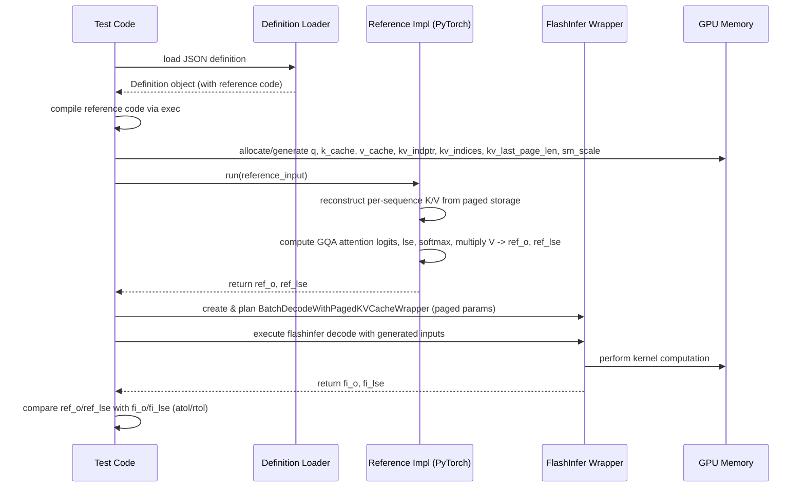

# [PR #389] feat: add gqa_paged_decode_h5_kv1_d128_ps64 definition (Llama 4 Scout/Maverick, TP=8)

source: https://github.com/flashinfer-ai/flashinfer-bench/pull/389
state: open | updated: 2026-04-14T15:48:40Z
labels: 

## 正文

## Summary

Adds the `page_size=64` GQA paged decode definition for Llama 4 Scout and Maverick (TP=8).

| Field | Value |
|-------|-------|
| Definition | `gqa_paged_decode_h5_kv1_d128_ps64` |
| Op type | `gqa_paged` |
| q-heads (TP=8) | 5 (40/8) |
| kv-heads (TP=8) | 1 (8/8) |
| head_dim | 128 |
| page_size | 64 |
| Hardware | NVIDIA B200, TP=8 |

**Note on KV expansion**: FlashInfer paged decode requires power-of-2 group sizes. With group_size=5 (non-power-of-2), KV heads are expanded 1→5 via `repeat_interleave` before calling the FlashInfer API. This is mathematically equivalent.

Complements the `ps1` variant merged in #349.

## Changes
- `flashinfer_trace/definitions/gqa_paged/gqa_paged_decode_h5_kv1_d128_ps64.json`: kernel definition with axes and PyTorch reference `run()`
- `flashinfer_trace/tests/references/test_gqa_paged_decode_h5_kv1_d128_ps64.py`: reference correctness test
- `docs/model_coverage.mdx`: marks definition as 🟡 for Scout and Maverick
- `web/apps/web/data/models.ts`: adds ps64 to Scout/Maverick attn module

## Test plan
- [ ] GPU validation: run `flashinfer_trace/tests/references/test_gqa_paged_decode_h5_kv1_d128_ps64.py` on CUDA hardware
- [ ] Status can be upgraded from `status:unverified` to `status:reference` after GPU tests pass

## Related
- Paired HuggingFace PR: https://huggingface.co/datasets/flashinfer-ai/flashinfer-trace/discussions/263 (workloads + baseline solution)
- Complements: #349 (ps1 variant)

🤖 Generated with [Claude Code](https://claude.com/claude-code)

<!-- This is an auto-generated comment: release notes by coderabbit.ai -->
## Summary by CodeRabbit

* **New Features**
  * Added support for an additional paged GQA decode operation for batch inference.
* **Documentation**
  * Updated model coverage to mark the new operation as available.
* **Tests**
  * Added reference tests validating correctness across multiple batch/sequence scenarios.
* **UI**
  * Surface updated operation in model configuration listings.
<!-- end of auto-generated comment: release notes by coderabbit.ai -->

## 评论 (2)

### coderabbitai[bot] · 2026-04-13

<!-- This is an auto-generated comment: summarize by coderabbit.ai -->
No actionable comments were generated in the recent review. 🎉

<details>
<summary>ℹ️ Recent review info</summary>

<details>
<summary>⚙️ Run configuration</summary>

**Configuration used**: defaults

**Review profile**: CHILL

**Plan**: Pro

**Run ID**: `b357c097-58a2-4576-a359-fc42bb61d8eb`

</details>

<details>
<summary>📥 Commits</summary>

Reviewing files that changed from the base of the PR and between a261b85fc0b3a9a9f6653b32346034b971cf227a and 9bbd944dd37e4e90a5d4d4964bf41316a4aa11dc.

</details>

<details>
<summary>📒 Files selected for processing (2)</summary>

* `docs/model_coverage.mdx`
* `web/apps/web/data/models.ts`

</details>

<details>
<summary>🚧 Files skipped from review as they are similar to previous changes (1)</summary>

* docs/model_coverage.mdx

</details>

</details>

---


<!-- walkthrough_start -->

<details>
<summary>📝 Walkthrough</summary>

## Walkthrough

This PR adds a new GQA paged decode op definition (`gqa_paged_decode_h5_kv1_d128_ps64`), a reference test for that op, registers the definition in web model configs, and updates model coverage docs (two Kimi K2 entries updated from 🟡 to ✅).

## Changes

|Cohort / File(s)|Summary|
|---|---|
|**Documentation & Model Registry** <br> `docs/model_coverage.mdx`, `web/apps/web/data/models.ts`|Updated model coverage markers (two Kimi K2 GQA paged entries moved from 🟡 to ✅) and registered the new `gqa_paged_decode_h5_kv1_d128_ps64` attention definition in model configs.|
|**Operation Definition** <br> `flashinfer_trace/definitions/gqa_paged/gqa_paged_decode_h5_kv1_d128_ps64.json`|Added new GQA paged decode op definition with fixed compile-time params (num_qo_heads=5, num_kv_heads=1, head_dim=128, page_size=64), declared inputs/outputs, constraints, and embedded PyTorch reference `run(...)`.|
|**Reference Test** <br> `flashinfer_trace/tests/references/test_gqa_paged_decode_h5_kv1_d128_ps64.py`|Added test harness that loads the definition, compiles the embedded reference, generates randomized paged-KV inputs, runs both reference and FlashInfer BatchDecodeWithPagedKVCacheWrapper, and compares outputs across multiple batch/seq configurations (GPU-gated).|

## Sequence Diagram



## Estimated code review effort

🎯 3 (Moderate) | ⏱️ ~25 minutes

## Possibly related PRs

- flashinfer-ai/flashinfer-bench#203 — Related documentation updates to `docs/model_coverage.mdx` tracking GQA paged kernel coverage.
- flashinfer-ai/flashinfer-bench#208 — Adds similar gqa_paged op definitions and reference tests exercising the same GQA paged codepaths.

## Suggested reviewers

- yzh119
- Ubospica

## Poem

> 🐰 A tiny kernel hops to play,  
> Five heads query, one KV stays,  
> Pages whisper tokens back in line,  
> Tests confirm the outputs align,  
> Coverage now smiles—two checks shine! ✨

</details>

<!-- walkthrough_end -->


<!-- pre_merge_checks_walkthrough_start -->

<details>
<summary>🚥 Pre-merge checks | ✅ 2 | ❌ 1</summary>

### ❌ Failed checks (1 warning)

|     Check name     | Status     | Explanation                                                                          | Resolution                                                                         |
| :----------------: | :--------- | :----------------------------------------------------------------------------------- | :--------------------------------------------------------------------------------- |
| Docstring Coverage | ⚠️ Warning | Docstring coverage is 0.00% which is insufficient. The required threshold is 80.00%. | Write docstrings for the functions missing them to satisfy the coverage threshold. |

<details>
<summary>✅ Passed checks (2 passed)</summary>

|     Check name    | Status   | Explanation                                                                                                                                                                                                                                  |
| :---------------: | :------- | :------------------------------------------------------------------------------------------------------------------------------------------------------------------------------------------------------------------------------------------- |
| Description Check | ✅ Passed | Check skipped - CodeRabbit’s high-level summary is enabled.                                                                                                                                                                                  |
|    Title check    | ✅ Passed | The title clearly and specifically describes the main change: adding a new GQA paged decode kernel definition (gqa_paged_decode_h5_kv1_d128_ps64) with explicit parameter values and target hardware context (Llama 4 Scout/Maverick, TP=8). |

</details>

<sub>✏️ Tip: You can configure your own custom pre-merge checks in the settings.</sub>

</details>

<!-- pre_merge_checks_walkthrough_end -->

<!-- finishing_touch_checkbox_start -->

<details>
<summary>✨ Finishing Touches</summary>

<details>
<summary>🧪 Generate unit tests (beta)</summary>

- [ ] <!-- {"checkboxId": "f47ac10b-58cc-4372-a567-0e02b2c3d479", "radioGroupId": "utg-output-choice-group-unknown_comment_id"} -->   Create PR with unit tests

</details>

</details>

<!-- finishing_touch_checkbox_end -->

<!-- tips_start -->

---

Thanks for using [CodeRabbit](https://coderabbit.ai?utm_source=oss&utm_medium=github&utm_campaign=flashinfer-ai/flashinfer-bench&utm_content=389)! It's free for OSS, and your support helps us grow. If you like it, consider giving us a shout-out.

<details>
<summary>❤️ Share</summary>

- [X](https://twitter.com/intent/tweet?text=I%20just%20used%20%40coderabbitai%20for%20my%20code%20review%2C%20and%20it%27s%20fantastic%21%20It%27s%20free%20for%20OSS%20and%20offers%20a%20free%20trial%20for%20the%20proprietary%20code.%20Check%20it%20out%3A&url=https%3A//coderabbit.ai)
- [Mastodon](https://mastodon.social/share?text=I%20just%20used%20%40coderabbitai%20for%20my%20code%20review%2C%20and%20it%27s%20fantastic%21%20It%27s%20free%20for%20OSS%20and%20offers%20a%20free%20trial%20for%20the%20proprietary%20code.%20Check%20it%20out%3A%20https%3A%2F%2Fcoderabbit.ai)
- [Reddit](https://www.reddit.com/submit?title=Great%20tool%20for%20code%20review%20-%20CodeRabbit&text=I%20just%20used%20CodeRabbit%20for%20my%20code%20review%2C%20and%20it%27s%20fantastic%21%20It%27s%20free%20for%20OSS%20and%20offers%20a%20free%20trial%20for%20proprietary%20code.%20Check%20it%20out%3A%20https%3A//coderabbit.ai)
- [LinkedIn](https://www.linkedin.com/sharing/share-offsite/?url=https%3A%2F%2Fcoderabbit.ai&mini=true&title=Great%20tool%20for%20code%20review%20-%20CodeRabbit&summary=I%20just%20used%20CodeRabbit%20for%20my%20code%20review%2C%20and%20it%27s%20fantastic%21%20It%27s%20free%20for%20OSS%20and%20offers%20a%20free%20trial%20for%20proprietary%20code)

</details>

<sub>Comment `@coderabbitai help` to get the list of available commands and usage tips.</sub>

<!-- tips_end -->

<!-- internal state start -->


<!-- DwQgtGAEAqAWCWBnSTIEMB26CuAXA9mAOYCmGJATmriQCaQDG+Ats2bgFyQAOFk+AIwBWJBrngA3EsgEBPRvlqU0AgfFwA6NPEgQAfACgjoCEYDEZyAAUASpETZWaCrKPR1AGxJcAZiWpcaLT0RACOaAD63GiktBFKTEoRsACsEQDWEgCM8VkATAAcUYgAbAAskEo+8Bjq8PhYABQAMh5ozGiQFQDKTHgA9ACyaFIU8AzpADQwVgC8BQCUkIAoBNZ2ZgDMBQCckHKQsrLwsNiYRG4IyLbowcid5ADukABibYiwAJIYfnzplOQeSokaq1cQNdAYeg0RC4ZA+fB8ToAcQAigBBHgxOhAxIkSASZzwTC4SAPdSwTGkCKIeAALxIs3KkFwzlINHo1EgrXanR6fRJmHow1G43SkEaNAwiARYGiVA8Xg8SGYM3mCw0kAA0iR5IhuKJ4NUGNR6lgCR5sNIuFUanVwRh2niAAZhSLRWLxUSKEjJNKZHK0fJFbilMpO6b4bjM2T6yAu8JRLG0cOQUJgWD+WjIWaQFLisoABn6i2mmXTmezkCy4oKxYW0wzQXi8BVOaD03dPpp9MgOfKDectAezjxADkAGofAAiHwxACE8gWC9NoHMChq56I0NhEHjXmh3l8fpTsQlvZAKCRQth4JfkNx8A9KGB8D4wHlIEQKPhsFHu9Jpk1cdIEbLN0EvSASAAD2iSFsR8b8VSyQAkwjzHcaiIONL31agIhqGgKC8EYSCdPZgQRPFjQVDDmQzF43k+b5KEgNErA+cUMHwdl0GQDpcAzPjxjQBV5CvG9zXYdUYDohhYDOPFdxJGoGAtJREA4AwoD+CgASBEE7SwAApboAHlR18Biah+CJcCoBgSH6G1QVNRB+ldRNYjchNOziM8klSDJslyQpinKDQhGlJo0Cg6RIAAamsWRoARWSL2BSgyHsi9sAwRoFgWTS0p+TK8WhThIB8SymIoGy7IcsrXMvYqMHs1yyoidyfM9XFfUCgMg1CsoNG4VwoFofAGEcdgTXBX9aGobxKgm1zmG9DwIiYUYsQ0ZhaCg8UOgodJkCcgyeMgQBeDcAQ/2KoRSBeh/AVIUgYVKFFAqoCfARIAAVXYuaFq4L7+jQbgQ36YH5pZfpVqUDxEA0WFxSCMCQyZAh7v5IZiLGCZ0FwSUwSwWHsC8AqDGgaQSW4NoMC4JErB+/FhPgKHTTS69b2xVYKBy2i8V4fAJFZ7EmoylrSqp/gsAAYR+qcMTkighxHABuewWVwHc0o6GpkCdGFqB3DgcpFao6FInLxEBBmmYazFEARyAbBINpuPUEhmHUzEufoAAJbAiCIDDnjQLLrkqg8EGqsBtH6SP3is59bLDkgzDyEoNghegmGYGnPfYZACTGYlIDYChYhQLBNjKbYNHMSwZZYNgMCRhwnBcIwTPIBRWHYPZ5EOY5TgwTClQwdIaP4gXtEvf3A+D0fQ/DmxHKQSbHfZ+E+AeBF0g8fAgjuZ6BAPV2agU/ALSJrhYAJkMOH6foTiDjCfFTjQmEc6gz9heOqp+LHeA/8o5JwoGAFO9k16IA3jSBorkM4bHrppMAhgDAmCgGQegr4cAEGIGQZQ3Fc4t3KrwfgwhRDiCkDIeQuIqCqHUFoHQ+h0HgCgHAVAqBMC4MIKQcgVAiHN3YFwKgTx26HXkPsOhKg1CaG0LoVBRhWGmAMONBgK01obSFsoUgO09oaQAERGIMBYFiHx8H8IWvQcRzh5A4NkvJRARgvhxjURouGWitq6N2lBFM08tQth0JqD8u4xCmkAJgEyBUQYh8jwJq8AFSQG0rpeMbokxRHiQqDa25EDCV6v6YKwZQykTksgdQyBNo6IUprbWDjR7Yk5LgXezIVBeEgq3MYsUEIsDjNdUijRTpE0gMZMykEoJICRgIPApI94HyCJATiJJZAkBJEwBUlC6BLAxk6QAoOT9MGezEZo4xkTOPvQXeR05n0FKWRMgCh1liE2RqUc+B+DTz4N+B4iBpiw1dt88CskPZiGwHeCMfBDZa14s4bSdwIKw0NPAbENRaKoFoIaHwyCG4sQ8ARGaUpmSvP8QkNoAiXL8B8GMh8FBuJ3W4NgAQSoGDtPEOIaQRgoCjjMgAUXFGoqarc8UvgwB4Whcl6nk2aBfCpYrYhcDinkfo74jBcphC2KxCglBpWFiQJ4wJt7lUGHQeAjgjCSvINK+StA5UKqVQYFV4g+LYlxFqxFuqfD6q4IatFJqjEGPZSohO0drKQIcgc+BXk0meU6ukvyPoAoFMDCFNGQ0IoNEMcY0xaJzF8MIdiGxLhyWMBlWygwaJggNIWTq4ZpljmRj0raIZqSPJ0G6t6fJQVE1FPKKRNSDAxhqFHugPY1BZLYmiTic8kZCHs0aE6SMNkYyLQMdG2IBinRbNZCsmiTpqgRFBvADggawEaFjRoOcI7YBTi9EoAA6uSKwSYgIyzDhmG9VAwaUCdBqOAeIw1YGqDFCpLBuAJJIBAlsM8qBsAIsgbZGBHARFCPgZIFZZgpBTE6eDzBAooaPrMLIGHQLNmYPhwoKZBRxk7NSOkDJu3TAeAgNptl/DiEHU6U+uBZLUfpBhrDzbEAYa8BgPCkJuC2XI89TDCHMgibRa1UiB5mYlwZXiaK0gNQfBJHqA05sykYDpSSSU0pwVyX1K5WguBF1wjuk6UIpEaba1iUBRgL7YqzvSNk0dGGJCeYzKRZFToADafHOz/Ko/+aYfGZOgX+URtFzAAC6Cn9YCEqofXAWQSjrumBRmoSh9rOCoLIZA7mfN5bExQDDMm8vjGkFVnzbxcDNoiEJ9dGmSTEpHMgR6BnmRkGM/rHreB+nsbS9QTLGHAsca4xFhZCGkO4azA2TMxGktLAo06eGJFxQ7rmbgDYeRJvTdgNxkgkX5vIZi2tjUGIxaXglolZKFBUotnziQvFKBkCewEHQJQUI5IkkvEwKUtlsBiHvM+Xc14SoEr+FgTU/RgLdJVLEmECIsSQHQmx6ronbL9Bx3J6Q+OGsHia1R1r0xc4GditQQm7MD7ByRmSfikBx2gTLqDEDg7SuLd7CBSAT8OIXcW65KLPmYsLGy+gMGSpYoG2wzA4SJEOzfloGDuXW3kvDt3O+SADOwDtzANBbgOWZeIuQNKHwuAOj7QxmyfGdPwRPngEQO+/zmCk3EDTc3A9IDAQxoLNXWV9TgPZ0N2EOXnoPDGNCSA9JvzWfBWJEqrlQuknJAs155pWZan9/gOHTsm4g6oPhL73wUrOiE7JirvYczHdO/FKsCnJNi9k7V7MOYCcVcC2ALICWNAe2YHlL9SiTGWDRDi6d8CCX8xxCSvF3WKXG4RDSvgdKGXjGZXUEtUAy1/crU8Otf6Kqga4Lt0B1Vaqp0csCBtLkI3NtoA/rqsb239STaGcKkUnQGEgLoSAo4Vay+1KTqDQ1QRAIKeK/QkYZ+BiDobABiXAy63kMa16cafoHaA0yaa64oU6pK4IlmsYToyBkadAa69Y6eLOnWc8VcBmrk4eFupmNOz0FmVm2ckEzAP25a9ATod2JUpEPgOUYS4IvBOUjQGgEhkuyCpiwwtQfgMILwoGLEDoIq8epqUqRalqcq+QZQiqBYyqqqjqOc54l42qbqHqL0RqPqxiKCYARgR6l+Ia/QDU/QfBEsbUVMHUKBHor+8amBH+YUI06afqma2aBCAieajgEihadSpATipa3BQ6jwRU4sWUZU9gfa8AYmt0fATaL+aBb+hSg0X60kCkmR2RB8xose/iTAFAd4D4kINEeBH2x+RymOcEiIrit+zk8CPaXMYgCIsg0wVyZSSkrcrynQToV6+kRMEm9AtAsg8BQkIkvcIGXgsGdEf6kSHBXB++bhWUohGApEzqwskx0EogJRmmn44RC0yAVAkILANG9APkYAzmNQdBORrO6IlBFIAG2IToo4P0gwEQKIJkEQfsXKaIU43QaGGGgJwJQE4JkJ0J+GGGEJUJEQM4gwpGBQcxcYVgaISIXKEQ3QHwAAWlyoyGGJTvAqDmEmxnZtME6B5saF5kyT5qyX5pHs8UmGXCskED/H1lKAiCVsyWVrjpVkyQTu3vVi1qTs1q1ksA5sfHGIgArlRCRN+nRE6O1LUUDrgOagJhVEIUMrzPijUcBqBvQPsaVK8vbrwcCBEPgM3jwU1C1ruH4hmFgFMgkmBJMQ4T8GeheleriHevxA+rEE+q5m+pzp+h2LTKMT8SeDnK5piFBispQP8sboKMgM5jFjPnxKlCiCBBWJ8f4pxBgLKI+M+K+BAs0l+D+H+DRviESFhCQDhE1vhJQERFICmOcZNNUXRAGcxNHrGXwBjIICyAFrus6ewTuvAO6cruwVTl1nsFxBSAwUmcDuAZASpugAINKNfA5JeG7JILaV4Pca1BqFyjFAOezKgLbMQFYlwIaJAHLArJ9u0SMNoG0CptMOoGlFrDpPrKHJrjdnGLrLlJLheI9BfNlPijqZ4XqZQoaQpn2vgI7LdCCnGI0PXrNjbtSFeC1mQNBduS7pAUTGcnEqXkOtEI7PHD+fYFEbYpimPtiripRTPkSqIPPpxTgsAavjwPSoylvqyvEbvokckSTG0ufonI4XVM4VTI1OlPdq1IpTCF4aQb5AUX4e/l2kNCNKRMzhSMkeviJYIS1JRRpH/lAJtofNpTMaaI0PAYtDCBQEsKgpANMXfg0D/jZXGFTqBhEDaY0DaVokoFwG5ZLr/v/i6DcTQMFYKCwCJnQbhReqdj8tFIRaEMRRgNMEoMLPZLMAYpNPNAYtFf5YhRpchWIIaWlZxidv+LMGUJlVBNlblbMHkCkCUDlgQB4PhmBnkNMNSlfGhoNRVbFZBcPlirIYaFLM8EoWiCobIGoQYGarFLEXQNoZlnoQYQ6uqs6qYa6pBO6ivp6lYcwAYL6v6nYQYMDJzq5JDD/DDGtAjLCMEWxVmhYrmtYsxQWvYsWk4j+hBa9ccWAeRfgVgAFvdWDI9SQAIN/NDL8vDIjEacOF9lBJKPvsik0q8sjfYJQmShjMpKpKplgCjAZMJA7uwOzMfm5RhLASui2r4RgXpYNGuhpt6euQTcIVKNMPxKgMkewAWlwokcJA0EQDSJqv4tBBMtuiQY/q2v5KzUUSGFkDgRRieeqrwLfgqK4TEJXMLebvRuSI9JoaPDRJgPINJXiKzK5H0K3N1oiJPmMIOuucxMfkqDCAjKPpmi7QvlxZsTxc4AHfxTBCvtiLSsJZvjTWJYVC8uQMgutRavUlavFDavoXaoYQdSYSQGYSdRYV6sapdddSgmghgu0tghStuHgjmhEcYX3K3CImgGIn9ZIrQt6PQrIkwgooYBXcQuoHhFmMFXna6i2obNSr3cYGwugBnFkAIAUCkD4AwAWAIBsGgNsBvT4CUCUCkBsGvXkBsGUCUAWEfQINsAAOxZAMA+B5B5AX2dAsIV3bCqC0DbBlBlDBAbAX0kBlAkDbAFhoApC0Cf21zlCpZlBZAbCZZoBlBoBoBZBZC0BMosLKJQAD2dnD1HU6otpYJT0V060RDlxUijoTCIDUgsiT2oMADeMVBiSAtgc4lRfwtATcjduAVgGF7IiBFUwku4kwdDSAJkowYw5aGAPD78W2Ajf+BibitkGETcXiJAXwBEKh3QmsJAPDtDf+Mjw5NUThLhNpHhGlTN2lPUulqtn+I0WjMVOjkABiBALIHgzwJpLkPDKQ0jdj9jFlvNiAYZl6y08jo8iAPD+hdjAAvjFeE54yVd6DYDIuoG+lxCQFYBQO4LgF4BI3w2dnQ+8D+B4LQEwxNOkLYFk1I3Q2irQDYDlFOBNOo67ZLTLBmBMDw6DjkzI5U9UxgOk14E06IOkK07zO0/Y50zU9IOUUTH0y074NkzE+PCwx8I7JaIgPUzw0YnM6TlM+kC7A4DiiE1wIFrY5ANo14yVc0+kKOI6Gs1ejAmMGJuzFswYp43YwYhCjuIM5aM8zowYsbrTHims1s/YJPB+vQFAE3EoPEwwrgNsQgK7mAF4FIICPmvIKgGQK0nQBoE80czI78ms8ODpBhFi14/YwiC7jUMJFs5cwgUgb2nc0TH6hE18ycy86Qxc1c0gT05ROc0S6c28/s8yEM18zI785gP8xy3RCym0ipP4IRPIBRtpgwAilRCKkCLc/AD9hsXiJBebaQIEMEJbQfl8TErybGkkv8K7PWj0U0KY0regX1JY+UEsMZZSoygBXKI6ARMzBaMwVCJuiSErCrBBMDjQJjeKNyB0F0JjI9NjCKBMCuGuOqDyy87i0gfi7UKPEm980DuDRAZeGU/w9iyS2MIvBS+c1S5o0gZK5o0c9E0c8y986y+W9c4Ew02+dolQKQJmzI3y/m8My8yKw6PS0gbU+okE5hJUh27bcgAWBoEuAAKSkgIAvZ6YODurjCIqtxal4iXicw0H8R3iwBXz0CoAFAzvzuYtCv2N3hXx4CmhrNvoexLSjsNOJ6z4+OcXMBIA0iDrTwqgYy5LiCIA+DyAWlKO0QHtHsXuFsGIpv2NpuEuXsGKkslseCUvssjMtsYQhM1sxUJYbMwi2A3MTN3tIHbAgMv1lAFBUdZDvwCAMAMCpa0AX0pDz1bAkAbC31hwwOqApApCL0lB0clAMAX0X3bAFAbAMBZBAPz3bAMclDsdX3bA8sGKNa2CctrO0AZyycseUc/YlCFDz0FDBAX1bB5Af0FiZy/0v0Fh5AIOZy0D72Se8fAgpDbA+DbBL2L2n1IOf02d5B+qRNoNxI+jEM+isvkN4NP0z013IbRA7hdgaMUPOAkg0Mqek4Prxe0Boi4AuxmF0BsOfu4BNxWyIEFiBcV0xeJjxdJcJWReoJAA== -->

<!-- internal state end -->

### yyihuang · 2026-04-13

**HuggingFace PR2 (workloads + baseline solution):** https://huggingface.co/datasets/flashinfer-ai/flashinfer-trace/discussions/263

## Review (2)

### gemini-code-assist[bot] · 2026-04-13 · COMMENTED

## Code Review

This pull request introduces support for the `gqa_paged_decode_h5_kv1_d128_ps64` operation by adding the necessary definition file, updating the model coverage documentation, and registering the new definition in the web application. Additionally, a reference test script was added to verify the correctness of this operation. I have provided a suggestion to update the test script's `main` function to ensure it exits with a non-zero status code upon test failure, which is critical for maintaining reliable CI pipelines.

### coderabbitai[bot] · 2026-04-13 · COMMENTED


<details>
<summary>🧹 Nitpick comments (1)</summary><blockquote>

<details>
<summary>flashinfer_trace/tests/references/test_gqa_paged_decode_h5_kv1_d128_ps64.py (1)</summary><blockquote>

`84-86`: **Consider using `group_size` calculation for consistency with other tests.**

The h6_kv1 test uses `group_size = NUM_QO_HEADS // NUM_KV_HEADS` and then `repeat_interleave(group_size, dim=2)`. While your approach is functionally equivalent (since NUM_KV_HEADS=1, expanding by NUM_QO_HEADS gives the same result), the group_size pattern is more self-documenting and consistent with other tests.


<details>
<summary>Optional: Use group_size pattern for consistency</summary>

```diff
     # group_size=5 is not a power of 2; expand KV heads to Q heads (group_size=1)
+    group_size = NUM_QO_HEADS // NUM_KV_HEADS
-    k_cache_exp = inputs["k_cache"].repeat_interleave(NUM_QO_HEADS, dim=2)
-    v_cache_exp = inputs["v_cache"].repeat_interleave(NUM_QO_HEADS, dim=2)
+    k_cache_exp = inputs["k_cache"].repeat_interleave(group_size, dim=2)
+    v_cache_exp = inputs["v_cache"].repeat_interleave(group_size, dim=2)
```
</details>

<details>
<summary>🤖 Prompt for AI Agents</summary>

```
Verify each finding against the current code and only fix it if needed.

In `@flashinfer_trace/tests/references/test_gqa_paged_decode_h5_kv1_d128_ps64.py`
around lines 84 - 86, Replace the hard-coded repeat_interleave factor with the
computed group_size for clarity and consistency: compute group_size =
NUM_QO_HEADS // NUM_KV_HEADS, then call repeat_interleave(group_size, dim=2)
when building k_cache_exp and v_cache_exp from inputs["k_cache"] and
inputs["v_cache"]; update the two lines that set k_cache_exp and v_cache_exp to
use group_size instead of NUM_QO_HEADS so the test matches the pattern used
elsewhere.
```

</details>

</blockquote></details>

</blockquote></details>

<details>
<summary>🤖 Prompt for all review comments with AI agents</summary>

```
Verify each finding against the current code and only fix it if needed.

Nitpick comments:
In `@flashinfer_trace/tests/references/test_gqa_paged_decode_h5_kv1_d128_ps64.py`:
- Around line 84-86: Replace the hard-coded repeat_interleave factor with the
computed group_size for clarity and consistency: compute group_size =
NUM_QO_HEADS // NUM_KV_HEADS, then call repeat_interleave(group_size, dim=2)
when building k_cache_exp and v_cache_exp from inputs["k_cache"] and
inputs["v_cache"]; update the two lines that set k_cache_exp and v_cache_exp to
use group_size instead of NUM_QO_HEADS so the test matches the pattern used
elsewhere.
```

</details>

---

<details>
<summary>ℹ️ Review info</summary>

<details>
<summary>⚙️ Run configuration</summary>

**Configuration used**: defaults

**Review profile**: CHILL

**Plan**: Pro

**Run ID**: `7d944fe6-5738-4609-87a9-ead97b151cd0`

</details>

<details>
<summary>📥 Commits</summary>

Reviewing files that changed from the base of the PR and between 8f8b808874f1bc0da8a099125fc4494f7413761f and a261b85fc0b3a9a9f6653b32346034b971cf227a.

</details>

<details>
<summary>📒 Files selected for processing (4)</summary>

* `docs/model_coverage.mdx`
* `flashinfer_trace/definitions/gqa_paged/gqa_paged_decode_h5_kv1_d128_ps64.json`
* `flashinfer_trace/tests/references/test_gqa_paged_decode_h5_kv1_d128_ps64.py`
* `web/apps/web/data/models.ts`

</details>

</details>

<!-- This is an auto-generated comment by CodeRabbit for review status -->
