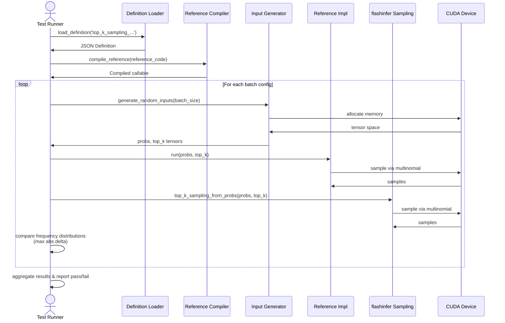

# [PR #391] feat: add top_k_sampling_from_probs_v202048 definition (Llama 4 Scout/Maverick)

source: https://github.com/flashinfer-ai/flashinfer-bench/pull/391
state: closed | updated: 2026-04-14T00:08:36Z
labels: 

## 正文

## Summary

Adds the top-k sampling definition for vocab_size=202048 (Llama 4 Scout/Maverick).

| Field | Value |
|-------|-------|
| Definition | `top_k_sampling_from_probs_v202048` |
| Op type | `sampling` |
| Vocab size | 202048 (Llama 4 specific) |
| Workloads | Synthetic (see note) |

**Note on synthetic workloads**: SGLang always calls `top_k_top_p_sampling_from_probs` (combined) — it never calls the standalone `top_k_sampling_from_probs` directly. Synthetic workloads are generated with varied batch sizes (1–512), temperatures (0.0–1.0), and top_k values (1–200048) to cover the parameter space.

## Changes
- `flashinfer_trace/definitions/sampling/top_k_sampling_from_probs_v202048.json`: kernel definition with PyTorch reference `run()`
- `flashinfer_trace/tests/references/test_top_k_sampling_from_probs_v202048.py`: reference correctness test using frequency-counting validation
- `docs/model_coverage.mdx`: marks definition as 🟡 for Scout and Maverick

## Test plan
- [ ] Run `test_top_k_sampling_from_probs_v202048.py` on CUDA hardware
- [ ] Verify frequency distribution matches expected top-k behavior

## Related
- Paired HuggingFace PR: https://huggingface.co/datasets/flashinfer-ai/flashinfer-trace/discussions/266 (workloads + baseline solution)
- Combined variant: see #392 (`top_k_top_p_sampling_from_probs_v202048`, real workloads)

🤖 Generated with [Claude Code](https://claude.com/claude-code)

<!-- This is an auto-generated comment: release notes by coderabbit.ai -->

## Summary by CodeRabbit

* **New Features**
  * Added top-k sampling operator for probability distributions with fixed vocabulary size of 202,048 tokens.

* **Documentation**
  * Updated model kernel coverage table to reflect availability of the new sampling operator.

<!-- end of auto-generated comment: release notes by coderabbit.ai -->

## 评论 (2)

### coderabbitai[bot] · 2026-04-13

<!-- This is an auto-generated comment: summarize by coderabbit.ai -->
<!-- This is an auto-generated comment: failure by coderabbit.ai -->

> [!CAUTION]
> ## Review failed
> 
> Pull request was closed or merged during review

<!-- end of auto-generated comment: failure by coderabbit.ai -->

<!-- walkthrough_start -->

📝 Walkthrough

## Walkthrough

This PR introduces a fixed-vocab-size top-k sampling operator (`top_k_sampling_from_probs_v202048`) with constant vocab size of 202048. Changes include the operator definition, a Monte Carlo-based reference test with CUDA support, and documentation status update.

## Changes

|Cohort / File(s)|Summary|
|---|---|
|**Documentation**   `docs/model_coverage.mdx`|Updated Llama 4 Scout 17B-16E model coverage status for `top_k_sampling_from_probs_v202048` from `❌` (unsupported) to `🟡` (partial support).|
|**Operator Definition**   `flashinfer_trace/definitions/sampling/top_k_sampling_from_probs_v202048.json`|Added operator definition for fixed-vocab top-k sampling with inputs `probs` (float32[batch_size, 202048]) and `top_k` (int32[batch_size]), outputting `samples` (int64[batch_size]). Includes reference implementation handling boundary cases and multinomial sampling.|
|**Reference Test**   `flashinfer_trace/tests/references/test_top_k_sampling_from_probs_v202048.py`|Added comprehensive test suite with definition loading, reference code compilation, CUDA-based randomized input generation (peaked logits), and Monte Carlo frequency comparison against `flashinfer.sampling.top_k_sampling`. Includes configurable batch sizes, trial counts, and error tolerance thresholding.|

## Sequence Diagram

## Estimated code review effort

🎯 3 (Moderate) | ⏱️ ~20 minutes

## Poem

> 🐰 A new sampler hops into the fold,
> With vocab fixed at two-oh-two-oh-four-eight bold,
> Top-k probabilities dance and renormalize,
> While CUDA brings the randomness, to our surprise,
> Tests verify each multinomial delight! ✨

<!-- walkthrough_end -->

<!-- pre_merge_checks_walkthrough_start -->

🚥 Pre-merge checks | ✅ 3

✅ Passed checks (3 passed)

|     Check name     | Status   | Explanation                                                                                                                                                    |
| :----------------: | :------- | :------------------------------------------------------------------------------------------------------------------------------------------------------------- |
|  Description Check | ✅ Passed | Check skipped - CodeRabbit’s high-level summary is enabled.                                                                                                    |
|     Title check    | ✅ Passed | The title clearly and specifically describes the main change: adding a new top-k sampling kernel definition for Llama 4 Scout/Maverick with vocab_size=202048. |
| Docstring Coverage | ✅ Passed | No functions found in the changed files to evaluate docstring coverage. Skipping docstring coverage check.                                                     |

✏️ Tip: You can configure your own custom pre-merge checks in the settings.

<!-- pre_merge_checks_walkthrough_end -->

<!-- finishing_touch_checkbox_start -->

✨ Finishing Touches

🧪 Generate unit tests (beta)

- [ ] <!-- {"checkboxId": "f47ac10b-58cc-4372-a567-0e02b2c3d479", "radioGroupId": "utg-output-choice-group-unknown_comment_id"} -->   Create PR with unit tests

<!-- finishing_touch_checkbox_end -->

<!-- tips_start -->

---

Thanks for using [CodeRabbit](https://coderabbit.ai?utm_source=oss&utm_medium=github&utm_campaign=flashinfer-ai/flashinfer-bench&utm_content=391)! It's free for OSS, and your support helps us grow. If you like it, consider giving us a shout-out.

❤️ Share

- [X](https://twitter.com/intent/tweet?text=I%20just%20used%20%40coderabbitai%20for%20my%20code%20review%2C%20and%20it%27s%20fantastic%21%20It%27s%20free%20for%20OSS%20and%20offers%20a%20free%20trial%20for%20the%20proprietary%20code.%20Check%20it%20out%3A&url=https%3A//coderabbit.ai)
- [Mastodon](https://mastodon.social/share?text=I%20just%20used%20%40coderabbitai%20for%20my%20code%20review%2C%20and%20it%27s%20fantastic%21%20It%27s%20free%20for%20OSS%20and%20offers%20a%20free%20trial%20for%20the%20proprietary%20code.%20Check%20it%20out%3A%20https%3A%2F%2Fcoderabbit.ai)
- [Reddit](https://www.reddit.com/submit?title=Great%20tool%20for%20code%20review%20-%20CodeRabbit&text=I%20just%20used%20CodeRabbit%20for%20my%20code%20review%2C%20and%20it%27s%20fantastic%21%20It%27s%20free%20for%20OSS%20and%20offers%20a%20free%20trial%20for%20proprietary%20code.%20Check%20it%20out%3A%20https%3A//coderabbit.ai)
- [LinkedIn](https://www.linkedin.com/sharing/share-offsite/?url=https%3A%2F%2Fcoderabbit.ai&mini=true&title=Great%20tool%20for%20code%20review%20-%20CodeRabbit&summary=I%20just%20used%20CodeRabbit%20for%20my%20code%20review%2C%20and%20it%27s%20fantastic%21%20It%27s%20free%20for%20OSS%20and%20offers%20a%20free%20trial%20for%20proprietary%20code)

Comment `@coderabbitai help` to get the list of available commands and usage tips.

<!-- tips_end -->

<!-- internal state start -->

<!-- DwQgtGAEAqAWCWBnSTIEMB26CuAXA9mAOYCmGJATmriQCaQDG+Ats2bgFyQAOFk+AIwBWJBrngA3EsgEBPRvlqU0AgfFwA6NPEgQAfACgjoCEYDEZyAAUASpETZWaCrKPR1AGxJcAZiWpcaLT0BNwA+gDWYYhozNwe8BhEYT4ULGG8gohhEgBMAAwFACwAHJBKPonq8PhYABQAMh6xaJBFkADKTHgA9ACyaFIU8AwRAJSQgCgE1nZmAMwAnACMbgjItujByK2IuJi0aB61JJChYBH2sfGJRJARlOQe5SSVGNW1kD74fBL4DCrReAALxIAF4CsUyo1msxWu0uvhegMhiNxhpIABpEjyHxoMTIVIsU6wE5KRAMYbccS1DgGKAAORIAHdnq93lgMLFvKd8OEojE4gkkik0swMmkBNk8oV8qU6ZAAPLcU6ybjcgXXJLygBqfxU9mB3IhsqhTRabXsaoY8EqDDG8oA6t8IkcgoguB1ZBhcCTxAxIHUOgBxBqYW7/DweZC1DzyH0nJjMNTkEK8yJhUIZSASZzwTC4FBYCj+J4UbAYRAAbmJJ12+0Oxx5fOzufzKGQpHIVBo9EQXvjfsOsftUE93t9I0gTOdrtoyBzLkgAmoDFgBpByDqS0AyAQAViWuTGABpTiQ4spcNhi5v8hp8tulnfj+gMKnmzmPNhpAGdwV8ib7QMAAxeAvG2YI6B6ZhFBteA6FpKAfGaRAEAwPwKAzKgGBIHoKiqakKx6DUhSIHpM35K4SJFdJMklHJjVKDQhEQD5pnuChHlZfCaiwJl1DXKxZGgb5V0gYt0LIbCxPLOoR0+ZDUPQzC8RwmhdkQHpxMoSTpDI6RcAzNMKMFG5qLFWipQYkoNG4eRpi04sMCkpgKGLMRyEQZA1ILbBEBuT5iwARy/JzZDAbpvX8j94AOAj5VoP4NOgpQPDCJghjQUgNGYWgAA8pkgWEKAiLy1i4t4CPQZBAF4NwBD/c+b5Om6At9kgZFKFRNx9J4Zp6gSXY6BPDB8ALWQSALEhctEPA6DGBDIBsctT12Qy+WiSjTMJcyJUsmVGNs/gsAAYQAVQAEQAQUgWBnFoJlnBIHUOp8HEgpChh5FoJBcGGAQ8B4wqVxJZBJqtHsm3OJcSBuiQagoIwbBIZpwaFEr5qsbRi3oAAJbAiCIG4gJU8okAYXy/I+PifSnGd8DdF96GXRAkcSblYFwXBuHdHoelgPGCaSXFsI0JhcOoNBmdwDSkIlxTKDAbQehllDEnQsAfpU3DSfJniNNyAA2fX5UR5G6BmBq+ETZMzYXPNvS4eYFlyANyNWjJ1pM4UtvFLJ6L2kpAL6cagnF+aOkRCgpIEKgnNgXx/FwXCXnV3lzjAYibjAaVIXlaBnFIAto8wVcuFhRJ5QuvBYG+LhZFkeA+bDeUjuLah4MgCF9bAWUwCWOZoCWXcOCWAB2YfdwALXlDo9kvd1+DVDBzEsI6WDYb1kAcJwXCMBVyAUVh2CnCWeDSWGlEZuMSXNtAq5r+U64b7Aw0gVGzfjHhMbN3H8cJ4mvvJDrD4Xw+DTmKrObYr4lwSxZvvFin4CJcHZpzbmvN+Y3CFiQEW+AxZ7EltLBSqt5aK2VnLCg6ssI4QAWTTyusegGyNgYOo9J8D8HjHwYssNmSUAPuvKW/A+DUKAVgXg0gj6JBrKffA58zaJj4YgDQgF9DGHAFAMg9B8A+BwAQYgZALyyLXuwLgvB+DCFEOIKQMh5BMCUFQVQ6gtA6GUSYKAcBUCoEwNowgnZ9H0DkUYsSaAWRbyKvIOQChbEqDUJobQugwCGBUaYAwCUGBJUUEjNK0jlBZRyrlWkAAiQpBgLCQAugASV0V2NuvZHChP4Fo1cYZpBGBOtwWK79r59HSU8LEHEkaQFXhlUgpwVBeEgOwRcIDIAAANXYZy9qKH2dFs4mmmZAcstjIAACotlmlhBaBEeBICjwAEK931gAUR2QFIkdY54zMADLkayCAzLqtM9ELC2EkkES8bitRox8Dub5b8EiP4oXwEyLAX0fBaKZNpRgN0kh0A0EYZepSPA0G7LrHkkilAMGaFi/59Txm5W4N8cGjVuDYAEAkf07BqjNIMCw8gKKDANFZsgRpSLaBcAANRLB6L3IwFzdjwFhODGxJxOFwRZC8EBnA2p0HgI4AwhT8lGAgGAIwpCiEYQ1thJObICIaXmaROZG0Fk0R2n7SETEWIYAKUUkp5TKm+PsLU5w8hNEIqaYgIwV1yAsl5BeRqeEKoAwAFIdAVPST4oETgeIgvQKZsyjIe01Mkb2FkbWrJPIkH6ihsDWiSC+GZaZcCqhIGs710zTXPJugWNUFAQHMC8qnC4prDpSOXGoBIFaSa7F+v9IlTJvknGmb8f4AhAQgjWR4uNU0/H/L2N6ew40cXTKsu8mA18w3sktKIWC35cDTkLFSqWXBpkWTWVTNcKE0BqhmQAbWXLgVcM6SAnknQCPyIIAC6ayT7TKQnTXAcxcjTJPK1VNfIb38XsDdR90yX1Aw/QBqqMz83ge3WUgsYbvyNkRJzPAJ5a2UWkHB6m96kMobfbANDgHkDTPzfrIo264AJqcp+C+YkXjaScgmwUZ52DUABmQEB2EmPfunb+k4oJQQd39pBhQGAhj8KvTtZ5rDgOujAxBk8lQMWUBBniNcaQWThOZl4MQ/kP7TIiGshARBga4DALRFQoF1BxnwPcLAiQvqSYDKOsgMz8iQGAHccL2Y9QycNNM58jlviwgSBuSRhnMVmwAT9eAf0CJQagfGLAxECP7wIL5ngPDmbBR0tmPMhVsAYsSCwPMTxO23t4/EFSfD0RAUaokaKGi+ACERK+T1MyHMtk/N+OoWCiAaFIxcYACn8jVr4PZyAegFPSY/fFvNBZEARHgFzONRnhgltasVgkopJHlnS9peg7ne1ebEhC1laKLqndE0Sl5H88UEq+xWYloNyVm0pdS2l4zIriEZVAC6SbICBoXiGn5RqeKXp1WhSgykDV7uNURC1Zq02mrMks3atrmK1GmQYSAuhFRNuoI1TkbBL3ms9pmxZ2aVmlCpzTqAZ1RAEoMRWFdLVcpIEvdt2TkAFNbup7TspGBz3zw01kXwunwO0ffbJr9MWGOkfIlwLDuRNf0dkwBuXUAFR4HPZey7hvvSsZNwxow7KPI+u5Xy0ogr8jCtFeKgxSheNcNlTC8lXAg5fRVWqjVSSMdKX1apfSGkHI6Q0t5N2xkM0k851ZGyshHXqudRUnx3YzYhLG96rlpA/UGDhzx1oiOU8CeWgWZKDWTgptZ1nrN1quclHY9fbyr86ZzlLcGwlULfnho+FGmNNzmCSOLGSvyBAXCAEwCJjuPdZrK+m5VfsgTyJm4PG0qpIp/sg3+MpMdAeNN+cukpc8hpmTVEHO70rDWgRmaDS8dZYMDKdahLzbmQFOkujACZjNhjgSmYENAewlA8z7XkESCVwDBV0lHiynHg1aDVDQHuFoDACOAJn4W4GoExSwCmVaEqEXRmW1AVCOguhOTCA6DKQnguWrS0Ssh6l8gq3IVfVEigKJBg0iDWQ/C/AUUgFwxrCLHLG2DalqBoAGWcCOGH15AthU0qCICvFGROD4LvUNDT2GEOAUHLClkPxYBILO1uGKwChIGqycjghkHGjhRCw/iP3jXoDvxOCI3PQZhmTj0oA0FNQ0C7yoh7yyG3SAjekkk+htAkgE22GLAPnPVBwwFjCnDHRmQsg22ORIDAH1mU18ls2vlhDF2YEcHQElHwAQROCbRTnK1SFsPek+iRj2HRA4xb1PnzWQFqKYDQngE0In14wcAxUgQ8PGivEBxIM8iVm0CeAgI0V4l9G+UkRKLFXKIaLsI+hJhhX4yklQAECRghVCzvF3G3SummTLgwFkjWR8HLBsw+BfzJjUnq0a3iB0KBnTkNHUP6K0ONV8N4C6NLUyiIGLCIDbndW3lkHRDKS0VAKulQHLEGFmO0JPA/iHwBI3nQGPg4n8lamLEvA4iYyJijCrTaOKMLTGVQEeLwG0Iwx2ApCOwLFhlaGmTCDCEuLZPeVRWKUsA+0xQBzbVxQF2cAFKB1JRB0Gx4HB0nHpWhxr1h3h0RzbzGR01ll1Wx0T3Uk0j40ckkz0hWhCM2g5171z1skozXA/i+EjAhX8ipRpUnC/20PdAtxmVnDCC31qDqCZ3VB+gmHiUgH51R0pxdOmTcK8DCE8LqE8MySUC4EHTGB51p2mSAJoAjP2HSGQLwEQDqF0I/RPCyyHQIlBHyRwLwPyXzJIFhmwmLLJgOHyQTJDPTxcj3w8mzNzNk1BCKCGkcEwha0QFBF3H/HyAbN5xmUuOuJdw5Xd1IB5UgF5WWG9193EH9yXUD2lWZHGVDwoAVWxn6NgFVSKTpHiUSTUSgW9Vvh0RTIMUPntkCWCQ9UXHCUlTsWiUcTiUMBcV4XUDCBimyHXLhVoGiD2G3PfJPMYCWH1l3B8BKDmFoAYDmDoAOKKDQBIFyBeGwiWBIAWFoBHh8ANgWHyBHgEFoAEGwgEAWFAoME/LkW/N/IjMrJlToDCHUVAs/NEXZMoFIDShJFGGyDrBAuUQMAAG85d8kkBbATkjhRg6BV4bzcArB8ABpaB8lfBDhmYjxRKkAFQhhhgIIMAVLPg1LP1RKUlB0bhBlskSAFcyDDgZ424DKhKABfDSmnfJSVGwKJdQB0NIGgKwCgdwXALwAy3EEklyyAfJcFBrWgSSv4CIWwYKoysK/JL6WgRaDAM6P4GeSwxAI6HiiIAyn6L8JKlKtKgKrwXK0QfKrgQq4y1ykq8sfnckSkAiCq0YBK0K0St+WgMpTyMQrKgywpJK5CXAVqiIRGYYqWAyp9OXGnESmnea8K1cSq+kLkAaxqhkqkAGUa8sma+aiK2eXyAqssWqha8K0GXqAHAa0a+wQ7bgNUegKAVeJQDy+xXAS/JzWAAgys/pcvRcKkzkH/WgDQHa068K5KEgAa+6HEpIEG06/Jb4foxIQ4UalatgAaskDagidVBa5y3auauGpa0YVGiGrgfJMqhMPK2Gha/a6gQ66q46sK6m86zAS60m9o8QQKhMLwJQ+QC7K0WCL/ZopqnLY9Yo7QLAKvbkIIL6c7BHDcs4DtAnO4B4fpD08gxqPZOEJqIjfoQYDqUYTA6mSXQ0cEf2YGxmva8GyG5wN4GGi21ytyWoDQq8Emwyjq0G+G4YAWZGvK4mgajmoK3a3Gha/G6mwmiIP20mjK1JbLEtCyqgUgKmvaoFRAI6oq3a1y5mzkLG0mz5W4pyP4r4DZQsSRSW5NE/HFSsw4Z+BQ0y2O8MLJBOrBToW64/EtOuywhQIZCmyq82jO8K68Ko4dfS0m7y9QUkRKeugkRqS0u4v4mA2hEteMBfF5GIcQRAF6UuxuzKE4H0a8auDwIGpO1yq20mqG22ogY+8KhG72jwFG1a0mjum4VOoOuXP9IaiWeSmwda5qnidGtC/WPuIoIoXcXcJQNAIitABYBgGB3EfIBgfIOYXCkihgfWNACCvChgJYbCWgIoOYAQEoF4KC/BtANC3IWgXIBgAQEeBYNAHwWG/JYa2wcmgakeWgXcBgA4QihgXC/WYiw2OYPwDhkofWERnwKhnwQ2HwJYEoWgfWIigQHwOYBgERkoUBooBgBYXcEeBgXIER3IYikecDAQIodVRysC9itgCgLi8O7IFi5xVRLxDIW+ZmICtuNxgS484Sxhz+jGYFWgC6XARGYPGStedQVeEwlS/Icxqixxi8/AZx4FNx1M+x+JIAA= -->

<!-- internal state end -->

### yyihuang · 2026-04-13

**HuggingFace PR2 (workloads + baseline solution):** https://huggingface.co/datasets/flashinfer-ai/flashinfer-trace/discussions/266

## Review (1)

### gemini-code-assist[bot] · 2026-04-13 · COMMENTED

## Code Review

This pull request introduces the `top_k_sampling_from_probs_v202048` operation, updating the model coverage documentation and adding a JSON definition along with a correctness test. Feedback was provided to optimize the reference implementation by replacing `torch.argsort` with `torch.topk` to improve efficiency for large vocabulary sizes.
