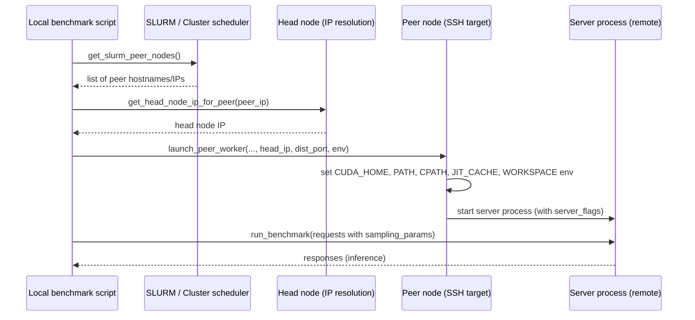

# [PR #394] feat: sampling params + B200 model configs for workload collection; fix sanitize ragged dispatch

source: https://github.com/flashinfer-ai/flashinfer-bench/pull/394
state: closed | updated: 2026-04-13T23:00:50Z
labels: 

## 正文

## Summary

Workflow improvements for Llama 4 Scout/Maverick workload collection on B200.

### bench_sharegpt.py — `--restart-per-batch-size` (key workflow refinement)

When `FLASHINFER_DUMP_MAX_COUNT` is shared across all batch sizes in one server session, a large early batch size (e.g. 64) can exhaust the budget before later ones (e.g. 128) are reached — leaving zero captures and no workloads for those batch sizes.

New flag `--restart-per-batch-size` fixes this:
1. For each batch size: clear `FLASHINFER_DUMP_DIR` → start server → run N batches → stop server
2. Each batch size gets its own fresh dump budget
3. `sanitize_dumps.py` runs independently per batch size (caller's responsibility), guaranteeing representation from every configured batch size

```bash
bench_sharegpt.py --model llama-4-scout-ps64 --model-path /path/to/model \
    --batch-sizes 64 128 --num-batches 4 --disable-cuda-graph \
    --restart-per-batch-size
```

### bench_sharegpt.py — other additions
- **`--temperature`, `--top-k`, `--top-p` args**: pass sampling params per request to force the standalone `top_k_sampling_from_probs` / `top_p_sampling_from_probs` FlashInfer paths
- **CUDA CTK headers from `targets/`**: adds ARM/x86 conda `targets/*/include` to `_NVIDIA_INCLUDES` for FlashInfer TRT-LLM JIT compilation on B200
- **Peer env forwarding**: pass `FLASHINFER_CUBIN_DIR`, `SGLANG_ENABLE_JIT_DEEPGEMM`, `TRITON_CACHE_DIR` to peer SSH worker

### model_configs.json (b200 section)
| Key | Purpose |
|-----|---------|
| `llama-4-scout-ps64` | `--page-size 64` — required to trigger `BatchDecodeWithPagedKVCacheWrapper` for ps64 workload collection |
| `llama-4-scout-tp4` | Single-node TP=4 — collect sampling workloads without peer node |
| `llama-4-scout-moe` | `flashinfer_trtllm_routed` backend for MoE trace collection |
| `minimax-m2-triton` | Triton MoE backend (flashinfer_trtllm crashes on M2 due to `n_group=0`) |
| `minimax-m2-triton-ps64` | ps64 variant for MiniMax M2 paged decode collection |
| `minimax-m2-triton-ragged` | Ragged prefill variant for MiniMax M2 |

### scripts/sanitize_dumps.py
- Fix ragged wrapper function dispatch: register `.run`, `.forward`, `.forward_return_lse` for `*Ragged*` wrappers — recent FlashInfer logs `.run` (via `@flashinfer_api`), older builds use `.forward`

## Test plan
- [ ] `--restart-per-batch-size`: verify two separate server sessions are logged, dump dir cleared between them, both batch sizes produce workloads after sanitize
- [ ] `--top-k 1000` routes to `top_k_sampling_from_probs` in SGLang sampler
- [ ] `--top-p 0.9` routes to `top_p_sampling_from_probs`
- [ ] `llama-4-scout-ps64` config fires `BatchDecodeWithPagedKVCacheWrapper` at varied batch sizes
- [ ] Ragged prefill dumps matched by sanitize with updated dispatch

🤖 Generated with [Claude Code](https://claude.com/claude-code)

<!-- This is an auto-generated comment: release notes by coderabbit.ai -->

## Summary by CodeRabbit

## Release Notes

* **New Features**
  * Added multi-node distributed benchmarking support with peer discovery and remote worker launching.
  * Extended benchmark runs to accept temperature, top_k, and top_p sampling parameters.
  * Added new model configuration variants and MoE runner backend options for various hardware setups.
  * Introduced per-batch-size server restart capability.

* **Chores**
  * Improved internal script utilities for method resolution.

<!-- end of auto-generated comment: release notes by coderabbit.ai -->

## 评论 (1)

### coderabbitai[bot] · 2026-04-13

<!-- This is an auto-generated comment: summarize by coderabbit.ai -->
<!-- This is an auto-generated comment: failure by coderabbit.ai -->

> [!CAUTION]
> ## Review failed
> 
> The pull request is closed.

<!-- end of auto-generated comment: failure by coderabbit.ai -->

<details>
<summary>ℹ️ Recent review info</summary>

<details>
<summary>⚙️ Run configuration</summary>

**Configuration used**: defaults

**Review profile**: CHILL

**Plan**: Pro

**Run ID**: `a247e8d8-c2c1-4912-90e0-238865dee31b`

</details>

<details>
<summary>📥 Commits</summary>

Reviewing files that changed from the base of the PR and between 44ced801f700717d5c5d161bb47dcd4a92e22f5c and b833c1f5ef2aaa1e54df22ab0aa3630ef2afed96.

</details>

<details>
<summary>📒 Files selected for processing (3)</summary>

* `examples/sglang_bench/bench_sharegpt.py`
* `examples/sglang_bench/model_configs.json`
* `scripts/sanitize_dumps.py`

</details>

</details>

---


<!-- walkthrough_start -->

<details>
<summary>📝 Walkthrough</summary>

## Walkthrough

Adds multi-node/SLURM-aware launch and CUDA include discovery to the ShareGPT benchmark, extends run_benchmark to pass sampling params (temperature, top_k, top_p), updates model configuration entries, and refines ragged-wrapper function-name mapping in dump sanitization.

## Changes

|Cohort / File(s)|Summary|
|---|---|
|**Benchmark runner** <br> `examples/sglang_bench/bench_sharegpt.py`|Added CUDA/NVIDIA include discovery; SLURM/IP peer discovery helpers (`get_slurm_peer_nodes`, `get_head_node_ip_for_peer`); SSH multi-node worker launcher (`launch_peer_worker`) that sets CUDA_HOME/PATH/CPATH and per-peer JIT/workspace env; extended CLI flags for distributed runs and sampling; refactored server session lifecycle and optional per-batch restart behavior.|
|**Benchmark API / sampling** <br> `examples/sglang_bench/bench_sharegpt.py`|Changed `run_benchmark()` signature to accept `temperature`, `top_k`, `top_p` and forward them under `extra_request_body["sampling_params"]`, with conditional inclusion of `top_k`/`top_p`.|
|**Model configurations** <br> `examples/sglang_bench/model_configs.json`|Added many `b200` model variants and new root `deepseek-*` entries; expanded per-model `server_flags` (TP/PS/page-size/memory/runner-backend/disable flags) and `_comment` fields.|
|**Dump sanitization** <br> `scripts/sanitize_dumps.py`|Extended `sanitize_dumps()` fi_api tag matching for Ragged wrappers to register both qualified and unqualified `run` and `run`-style mappings and added mappings for `... .run` / `run` alongside existing `forward`-style mappings. |

## Sequence Diagram(s)



## Estimated code review effort

🎯 4 (Complex) | ⏱️ ~50 minutes

## Possibly related PRs

- flashinfer-ai/flashinfer-bench#394: Overlaps the same benchmark runner sampling/SLURM/SSH changes and config edits.
- flashinfer-ai/flashinfer-bench#298: Prior changes to `bench_sharegpt.py` and `model_configs.json` that this PR extends.
- flashinfer-ai/flashinfer-bench#335: Touches related functions in `bench_sharegpt.py` with complementary CLI/arg handling fixes.

## Suggested reviewers

- Ubospica

## Poem

> 🐰  
> New nodes scurry where GPUs gleam,  
> SSH hops launch the distributed dream,  
> Sampling params now leap and play,  
> Configs sprout flags in bright array,  
> A rabbit cheers — benchmarks away! 🥕✨

</details>

<!-- walkthrough_end -->

<!-- pre_merge_checks_walkthrough_start -->

<details>
<summary>🚥 Pre-merge checks | ✅ 3</summary>

<details>
<summary>✅ Passed checks (3 passed)</summary>

|     Check name     | Status   | Explanation                                                                                                                                                    |
| :----------------: | :------- | :------------------------------------------------------------------------------------------------------------------------------------------------------------- |
|     Title check    | ✅ Passed | The title clearly and concisely summarizes the three main changes: sampling parameters support, B200 model configurations, and a sanitize ragged dispatch fix. |
| Docstring Coverage | ✅ Passed | Docstring coverage is 88.89% which is sufficient. The required threshold is 80.00%.                                                                            |
|  Description Check | ✅ Passed | Check skipped - CodeRabbit’s high-level summary is enabled.                                                                                                    |

</details>

<sub>✏️ Tip: You can configure your own custom pre-merge checks in the settings.</sub>

</details>

<!-- pre_merge_checks_walkthrough_end -->

<!-- finishing_touch_checkbox_start -->

<details>
<summary>✨ Finishing Touches</summary>

<details>
<summary>🧪 Generate unit tests (beta)</summary>

- [ ] <!-- {"checkboxId": "f47ac10b-58cc-4372-a567-0e02b2c3d479", "radioGroupId": "utg-output-choice-group-unknown_comment_id"} -->   Create PR with unit tests

</details>

</details>

<!-- finishing_touch_checkbox_end -->

<!-- tips_start -->

---

Thanks for using [CodeRabbit](https://coderabbit.ai?utm_source=oss&utm_medium=github&utm_campaign=flashinfer-ai/flashinfer-bench&utm_content=394)! It's free for OSS, and your support helps us grow. If you like it, consider giving us a shout-out.

<details>
<summary>❤️ Share</summary>

- [X](https://twitter.com/intent/tweet?text=I%20just%20used%20%40coderabbitai%20for%20my%20code%20review%2C%20and%20it%27s%20fantastic%21%20It%27s%20free%20for%20OSS%20and%20offers%20a%20free%20trial%20for%20the%20proprietary%20code.%20Check%20it%20out%3A&url=https%3A//coderabbit.ai)
- [Mastodon](https://mastodon.social/share?text=I%20just%20used%20%40coderabbitai%20for%20my%20code%20review%2C%20and%20it%27s%20fantastic%21%20It%27s%20free%20for%20OSS%20and%20offers%20a%20free%20trial%20for%20the%20proprietary%20code.%20Check%20it%20out%3A%20https%3A%2F%2Fcoderabbit.ai)
- [Reddit](https://www.reddit.com/submit?title=Great%20tool%20for%20code%20review%20-%20CodeRabbit&text=I%20just%20used%20CodeRabbit%20for%20my%20code%20review%2C%20and%20it%27s%20fantastic%21%20It%27s%20free%20for%20OSS%20and%20offers%20a%20free%20trial%20for%20proprietary%20code.%20Check%20it%20out%3A%20https%3A//coderabbit.ai)
- [LinkedIn](https://www.linkedin.com/sharing/share-offsite/?url=https%3A%2F%2Fcoderabbit.ai&mini=true&title=Great%20tool%20for%20code%20review%20-%20CodeRabbit&summary=I%20just%20used%20CodeRabbit%20for%20my%20code%20review%2C%20and%20it%27s%20fantastic%21%20It%27s%20free%20for%20OSS%20and%20offers%20a%20free%20trial%20for%20proprietary%20code)

</details>

<sub>Comment `@coderabbitai help` to get the list of available commands and usage tips.</sub>

<!-- tips_end -->

<!-- internal state start -->


<!-- DwQgtGAEAqAWCWBnSTIEMB26CuAXA9mAOYCmGJATmriQCaQDG+Ats2bgFyQAOFk+AIwBWJBrngA3EsgEBPRvlqU0AgfFwA6NPEgQAfACgjoCEYDEZyAAUASpETZWaCrKPR1AGxJcAZiWpciGjM3B7wGEQ8zsHIANSQAEIATAAMKZDMiiQeChg+8ETIPvh8AO4lANYe+Gj0TB5eYvD4GADckPkAHvaY6vAAXiSQVESk9LRI3NQMsAa2kGZcAMwAnAAsBgCCeLAlXLKy8LDYmEQGCVQYM77+uAD0AmQzYEEhYRFgU1TMiGCYtGABKkUmAmHkCsgwHoMtoMAYAMq4ajYRBcfDcMgGACqNgAMlxYLhcNxUXc7kR1McBBomMw7j4PGhEAg8pQ/vB6YzmeE/BRAU9YHduNgGndVhsAMIUW50LipJIANjAKTWYAAjEtoGqAOwcNYADg4OoAWkZ4Y5mM55PgfIxYKdpBwDFBHldYAB9ZnOEhEbiabiuSC6SCbWi0ZAAAwg0sQSIouE+bIE01gLwGJAjvhKkH8M1y+SI2Gl9GTuDziHTABpGF5nJAIwAxXGbeEACQAkgA5BsAURs7oAIliALJWQftmwR6ux5y4eyUKQUasUbBYTuQUszaTTgjcecURf2fA5tB5zewezp3IONjIdTIfClLCN5ttru9/tD0fu4ebAAa7oSgA8linbQBGG7YLQpBzv8kCHNk4bDCQvDSOw1CSEMtCOCSGgGEGUChkhEq4u26AUIU9YQDQITKLgRYZtWUZgLuYAVFOVEseinwQQQUSIMgryhOEkRfDEPCUMhACO2DSLBGD0MUFAMEMM4KWg1TkPWu7uhUnrBMJETuj4FAsO6vCCIgEF3Np6LmfpbwicZpnMOZpkCFZkANlysDtqyfBTLgsCIHhBEhmGyCbDYw53J0+oKrktBoNpzgwYgdwAFR3OEDAeFBGaQBKWIDpshXQAA0pAsD+EoFDIHxEbup2ABq7YDu2mzul2JHFT28IQUpXk+X5vIwDY0BgLiuLDpAABS7bQAoITwIy4gtPwWDJGkoXBg22YYpJ8JtpA5QUBUlCINWSmlM4SEvi2Hbdn2gFYgkXbjpOTHwgA4s2nbfe6PadpsCS4j27rzdAg49j2VjfT2w7DhxcERtANgLUBnaAZsEqtuD7WTnhUCZEoHjumCBYhUIiDrQAFECaTzk0LQAJT4cGRHICT2Q5hguAUPAjrs2FEYNMEaBgKqiBMHgnyIAqayZpxUykGmgyQArvHHvzBSkHwEYJCmA6iFkADqlJWGgYzlc1EqntVptUNwGIUAN+3y2sJ2VNUtQKA0ohrRgO0i2LlqSy8MsJsSiuBCJXhgBgWQwFYAC8nuDUJ7yRKUlL4HgEmSYnSjB8GouMmHUuR2AmQZlwEYMkyLK8u6/O4A0rmmXgdAQcmDDnQpHTZsO+A9pA/OnkM9SNIHJdQBGzDhPAlqdNXSQsQLBAYBx8+L8vq/r+oLRy5rTELxgS9oCvzBrzrm9gCMYxK9AG/rcPo+9/39ASM48CYLgyC01OhUZwecFJFGzN5RuI1JJowmlNGaSAHDSA2pAYcSQWZE3sAwAWfp0pBHPuIQY7psIhBCgGdmUAGzwE6Mgh+dATpOxdpACYiBApnnkNKCksZKAiXrBoFcW8mIaGurdZGA8IzCJKDdCgtB3TSnohQDA7oPCIAKoNCMGUbBWzGBlCCpRGEXTHsee0CkvDIRUnzIaUD/KQGqJRIK1BGAaRyBIgReiEBmPwB4WqkEVpIRREMCRIiZESLcHJHgjIsC0xMiwawNgWZOigM1HhPh5DMRjHGBMLtAQpjVgVbBMpBIoWiDQfch5VECWaBgS6NZ/B1WYThZh8AAqSXPJeQY1Y4IxhFP/FAWAgE+yQoNZxG4UztOQWgHwNA+D4L6IMTBySBapM4qxCokA1RpBSBBFG1FuJ7hSBoFYEFO6lL4kFIYP1cSnFstwXSDlDJEGcmZCyHlrI3PspnJyMTXIvM8oFYKCyUlpNDhLSuecske14gLUYhiDZGxNkoc2QVLbW1tvbEgjs0DO0oNs7B+ABKjLLBeCsgwQrOkgIs+Ayy6H0FQvkBoDTSHkSGJaIl9C5D1lmYQkgxCcJkNkHoykkBsDcCSjQcYkwUx4QMBYQqLAF5zlvEEUggkLRWkgLTFoHh5BUuFaonwIo2YGE1Qq8VkBAAoBEtBVGRpDKomdKZC2F1KWJzkFMe1U4nMOkNg+AfoqlGv0MYcAUAyD0BtDgAgxAyB0XobSNgfMuC8H4MIAOmEZDyCYLVFQahNDaF0FCAwJgoBwFQKgTAEbCCkHIFQM1cb2BcCoKUewaqXAbgzVkKgqh1BaB0IGoNpgDAkE6AZLweCiCRMea6GYDwBSentJwv0GgAxOgAERrplZYTY7Yo3VuoPQm8lpW3hpmA6RARhCJhnoUVEqdwWptQ6nNBafTcr5SadLfAi55COJnPGEVbalrCnEBEesTVWrtU6hKKwmxoCtgGi5awsggrrQrDQT4p5gEqvrBgCQ8AJhoDuAwbAWUcp5SUNsgeYIkopQoiQf+mVspXFI4xdAA9wj80UNgFS9B4S4hxDFdsVgC58BYUwT9LHuNthyao+gzAenwATknIBklGSrhmLw6qHgXYAIjDBT0eUKA/JIJQd0RdpDb109VWoJmsjul9cZEo5kjOuyYipt0jnjNKddizd137aP1mvZ1VsQFhw9m3lBmDYj6ARkg9B2DGrQgoiEy8DEDAqXwAYI+xaDB0V3CAawievMJDecGtKTIpSLIqQEtITBPZOg0AUvQiMAj3RTtgIeiotMNBdZZlrdADAVJ+m0iQWiNaGLbx0uxTp4idLcHI/QPiwT5vVWYH0hqQ7x5yJIDJOSLXFCyAANors+UZMSPwV0AF0OKUb6C0ZxOrGNQV4RGCb7iyDvLWdCLZ4nn2kaezN17z4ZuQGAOsjQWz2ilY/fQ85PABbZnnQCTNjWaIu2RNKLgX3Hj2hwyUGrnQpgNai5acItMeuFVIidIV5Am0sJ1gILutA7jHaIHcDJs5cjsZUXXCAB0+Smb+GGZznFadgEXlkkouBt4QETtXOTpmpcsWG6jhRzHmKrIV6xWbTEICUYlmQCQkXOJs/jImPk548mhKgDYEgPhTwEGLGU5TVLRCyFypPFonOjwbgFO13hAi7zVNw0Mct4Rq0gea6og8xmKkVhaJ17rhvSjVWfNGOSs5Tc5KJRblARS5zqEgInJtbvnCRibA9d8z0vxjgJj3G3JQhi5gvObklqlbVVOrOcrArmtzIGSiZaQxKFySSYW0lv7R8DnIoDnVRKA5z+/QJeCIZjI/lLb+tU8pkCUjNH+mEKQYjD743SGDw0yMItHqtrD1ShcolKqQ+W0Q7uAS/oftbAAgwgZfYH0aQ56vKqcDpeEQBgGjkMCKmKrKPWM1q1u1vTEyDykWB4IEPzNWBZCEP/FwLiEgLgPtrGBQOdtWOeJ6OmFwGxt5lCLYlgRGOzIAEmEkBq4LWPuzgHWyYqi7oCBSBS4sOLAuCGBWBOB/M+BhKMwRBgwJBfMHeSudEDEvgPsc4KckAByKQHedkFQYhchugaoyhty3AMhNQ6haoYOZB0IYQsYVBF6Sg9A1OPAb+H+dwrEXgUgOQBqVwgcAe9YQ6I60gTO46pwDBboM6bmXoC6/oAqToIsumiA+mhmxmpmiApOug0ImBsY+20AIqXg/BnBuB52l2FC9YFmNU1mSgtmtySk7mFAtMvOxRHBRh9g/MVBIcaAqmHolRnmFRTm7ouwsYHB1Y3MZM/y3RjuFA7oqUqIkASR2BWR1YlmsivqAxtO5kEuahyhSIZMsRSxBeNmlwqhq21Yuu7o+uXAQEfqt2HgGR52NRDgAgFWtqGgVg6IZAVBR+w4vQfgsYXkK0QwmwwB2qgwFARgmB5AyAJ6EQEBsQSQ6wdwYASQSQRgPYsYF8taSc0oOGJATaNuSknAkArYBQswa6K656A6HhbwXhiAPhRkrWdwvR5MLQlMGg1MLQq666sqW6O6Ma9AB66qx6JiKq2Ioqe6UWRJoQJJZJk6AolJWQZMFMEIdJNMW8/6j+/wvCMOEYDMByIK4c76eAEEUphYNaVSgAmASRgr7GYNyFAQS0y1AWGcRsDMBgAmR25VIvBIjiAMAK57wCLnwfDSjbaxhWRTZRYQCIAVC+ovBD58jSKyazYYLhRWmyYn6+pmJWEqnAgQS9G8w6yOj1jqlgqywkiawaqWmRg85WwkAW4swublygoRzgosTcCKwarAmYZq7cDZ58SexwQkb5S94SR8hpmNR1p8wRjlnfZlziwalVw1zmmFnWn4ClkelJjoahodA+Q8jGatztxyLgrdzRlET0J94ig5CqJzjhrJlpAQQ7znx7zXwQTfwCx/zaZnwXxXxJDbyPlXlrx5mKyny7yXz7w0pDkRKJYXlPn7y3wtC6KQC3m/x8w1JsamTYSpbAbMQ1z3yrjVo5J9yho3kaSyTaYNzcj+Qtzxjtw3mRhgVbzDmWk3bfHLlWzzi9JhDnTC5IAqDxxUATArzZZbgRh3DMQsKsWlncCCwqTT6lmEZJTEBOywCG7ZJ9nUmsDsAQTrQw7kUbEYBgBvxOKqIaDH40yrbwWcb0JWH2EkCOEaqmQT7eYRhKAoSqIkAVBgASBLBzb1g2UkhGYOVOUaAvnpkCzIKuoXgRjGlDGmmeQOJ54PZKCoIjys6rjiBsD0VAaUS0zIWzmoUYDoUfxLn4VNxrnEUeDMAAVwTKluV2WeVLDeXHL+CykiR2H5W2mxiyBmKhXtDnIz5WEWUJgOE8zsB+VAmzmdBYHoCaSFBB7uoN6DXwnAbfRWBYjVkYhRalUeVgAQXv74B9wAIkAaBEAaDVirg+KnlbJMSwApnHUbJHX1gLxLBpCdBDk6WQDmCbon50R35GLjVeo356nn78AP747P5hoBQ2Hpbpnf5npQCdjHiP7/VChA0ZZI4g3iDSDtCNn2pDBhAKrQ7HgRiCmjreETp+HTpUk6lUyykQSzTwiYz5gFBFhn5YBgj1aaD/HhDIIo20BcCxBqhqj6iQlqgGB4kElgBGDSw4J0Zcrpi8qkJLqyCMn4nMnbpVpsnNpOBHq2go1np+Sco+q4JM69DcoS24QBiCpBThCcq63i0kIkik4cTKn5DDFCUcC8R0WspqbAZ2LA2DRaIwr0D6JYpMJsBIaWHBDIIpVcjYEpDnYaBIAiouxW0jkrqe1jAroQQm0w6h3zhEDxq4DeY3TIDrahp0A6XthziF7oBhjUV3bIRcLTKRgroADeodAAvvwquCupALQUoD4CZkHS5auDJBpGlo1iugIq3e3Tbl3WwMnc+M4QwOPTygQMQjbn6cNS0KNVFTDkOlgbwpaM7CJOAvrHXY3ZIlPrdEnUxAfUyLgE3YtptgokoioiQKfd9sqSuotknZADZBGC/VIrdDfUWHfaom/b3ScGEPkPQrbg0B/HvhDepQnfQj7dinwCYrQFnMhEiOEPVB6qhDjolljmgDjnwLTH3SA4LFFufbGE3cPT3RgEQwPaQ5Qx0M4pAxtNqhgkYI9cfqfq4W9TDtfoyF9dUj9TmH9fGC/oDe/sDV/ojWDZANA0MLTCjTnqtpQDRQ1GLUQhbXEWTibUFVraLWbeo3ylLXdew88efK8XOFQmYl8RpLIL8UzYCXaA6GzZALEAAKw8183rrOgFqFrBq8xhq2iNGRoK01qxryr1rDBoBNocmtocpI6do5o9r5qGBFpWrqC2bhibYomlB0CeiZLJP9pQBrBrBcb6gpBqg+DahpDag6i0CuMMCuO0BqgKhqiqBrDai0AMC0BrBoArBJAkDQk+D1MFO+MQBpO4AZOIBZOCw5OyJLmBqpNBP4DmSNGsEzg0B5Ps59q10rqh2WwBK0CbC4DW7ZN0ASjyrqDnNxUrocApAN2FMVorMBKbMbPzNQhAA== -->

<!-- internal state end -->

## Review (2)

### gemini-code-assist[bot] · 2026-04-13 · COMMENTED

## Code Review

This pull request introduces multi-node benchmarking capabilities and hardware-aware configurations to the `bench_sharegpt.py` script, along with support for sampling parameters and an expanded set of model configurations. It also updates the dump sanitization script to handle specific FlashInfer wrappers. Review feedback identifies several critical issues: missing imports for the new utility functions, a breaking change in the model configuration JSON structure that disrupts lookup logic, and the fact that the newly added multi-node functions are defined but not yet integrated into the main execution flow. A suggestion was also provided to improve resource management when opening log files for peer workers.

### coderabbitai[bot] · 2026-04-13 · COMMENTED

**Actionable comments posted: 4**

<details>
<summary>🤖 Prompt for all review comments with AI agents</summary>

```
Verify each finding against the current code and only fix it if needed.

Inline comments:
In `@examples/sglang_bench/bench_sharegpt.py`:
- Around line 472-522: The new multi-node CLI flags are never used in main(), so
multi-node startup helper functions (detect_tp_size(), get_slurm_peer_nodes(),
launch_peer_worker(...)) are never invoked; update main() to wire these flags
into the launch logic: after parsing args, if not args.no_multinode and
(args.peer_node_addr or detect_tp_size() indicates TP>local_gpus or
get_slurm_peer_nodes() returns peers), call get_slurm_peer_nodes() when peer
addresses are not provided, compute the full peer list and call
launch_peer_worker(...) for each remote peer (passing args.conda_env and
args.dist_init_port), and invoke popen_launch_server(...) only for the local
node while passing args.dist_init_port and any necessary TP config; ensure
args.dist_init_port and args.conda_env are forwarded to both launch_peer_worker
and popen_launch_server and that peer addresses from args.peer_node_addr are
honored.
- Around line 243-250: The env construction in bench_sharegpt.py currently
hardcodes FLASHINFER_CUBIN_DIR, SGLANG_ENABLE_JIT_DEEPGEMM, and TRITON_CACHE_DIR
when building env_vars, which overrides the head node's JIT/triton settings;
instead read the corresponding values from the current process environment (e.g.
os.environ.get("FLASHINFER_CUBIN_DIR"),
os.environ.get("SGLANG_ENABLE_JIT_DEEPGEMM"),
os.environ.get("TRITON_CACHE_DIR")) and append them into env_vars only if
present (using shlex.quote for safety) so peer workers inherit/forward the head
node settings rather than using fixed defaults; keep the existing CUDA_HOME and
PATH handling unchanged and preserve symbol env_vars as the target to modify.
- Around line 41-60: The module is missing standard-library and typing imports
used at module import-time and elsewhere; add import sys and the other stdlib
modules referenced (subprocess, socket, shlex, shutil) and import the typing
names used (e.g., List and Tuple) near the top of bench_sharegpt.py so symbols
like _NVIDIA_INCLUDES (which uses sys and List[str]) and any later uses of
subprocess, socket, shlex, shutil, Tuple resolve at import time; specifically
add lines to import sys, subprocess, socket, shlex, shutil and from typing
import List, Tuple.

In `@examples/sglang_bench/model_configs.json`:
- Around line 3-182: The model_configs.json was changed to nest models under a
gpu_type key ("b200"), breaking bench_sharegpt.py's expectation that the JSON
maps model_name -> config (it currently does model_config["server_flags"]);
update the loader/CLI to first detect if the requested model (from the --model
flag) exists at root, and if not, search one level deeper across gpu_type keys
(e.g., under "b200") to find model entries and return that model's dict; also
ignore non-model metadata keys like "_comment" when enumerating selectable
models (or add an explicit --gpu-type option to select the gpu bucket) so model
lookup works regardless of flat vs nested config layout.
```

</details>

<details>
<summary>🪄 Autofix (Beta)</summary>

Fix all unresolved CodeRabbit comments on this PR:

- [ ] <!-- {"checkboxId": "4b0d0e0a-96d7-4f10-b296-3a18ea78f0b9"} --> Push a commit to this branch (recommended)
- [ ] <!-- {"checkboxId": "ff5b1114-7d8c-49e6-8ac1-43f82af23a33"} --> Create a new PR with the fixes

</details>

---

<details>
<summary>ℹ️ Review info</summary>

<details>
<summary>⚙️ Run configuration</summary>

**Configuration used**: defaults

**Review profile**: CHILL

**Plan**: Pro

**Run ID**: `1e08f592-7cd7-42bc-88b9-1f8154448f22`

</details>

<details>
<summary>📥 Commits</summary>

Reviewing files that changed from the base of the PR and between 8f8b808874f1bc0da8a099125fc4494f7413761f and 44ced801f700717d5c5d161bb47dcd4a92e22f5c.

</details>

<details>
<summary>📒 Files selected for processing (3)</summary>

* `examples/sglang_bench/bench_sharegpt.py`
* `examples/sglang_bench/model_configs.json`
* `scripts/sanitize_dumps.py`

</details>

</details>

<!-- This is an auto-generated comment by CodeRabbit for review status -->
