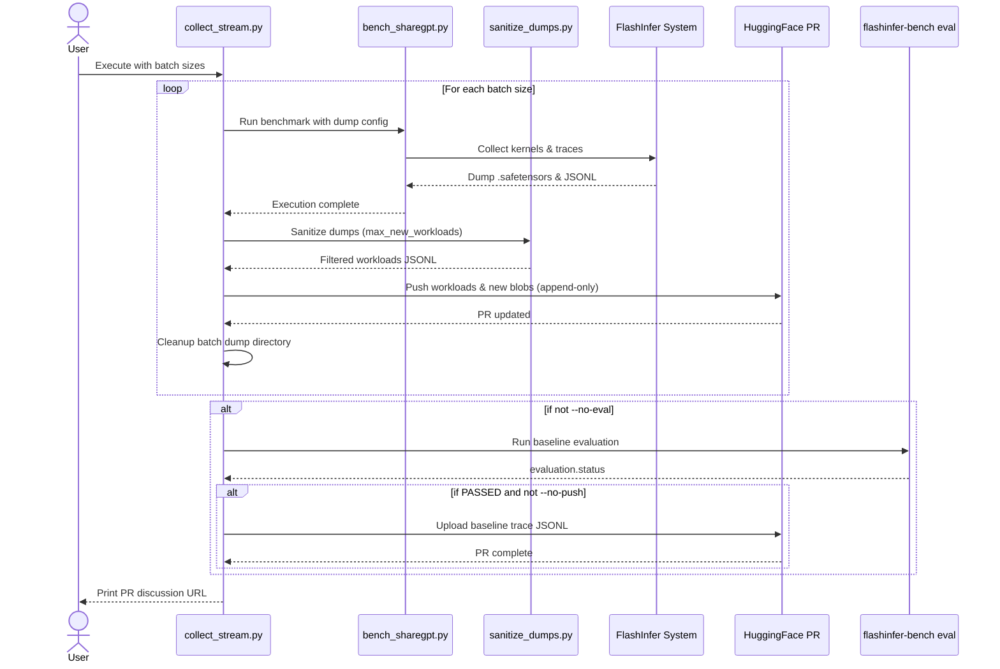

# [PR #395] feat: streaming per-batch-size workload collection with incremental HF push

source: https://github.com/flashinfer-ai/flashinfer-bench/pull/395
state: closed | updated: 2026-04-13T23:04:14Z
labels: 

## 正文

## Summary

- **`bench_sharegpt.py`**: add `--restart-per-batch-size` — restarts the SGLang server between batch sizes so each session has its own fresh `FLASHINFER_DUMP_MAX_COUNT` budget (prevents early batch sizes from starving later ones)
- **`sanitize_dumps.py`**: add `--max-new-workloads N` (default 20) — makes the diversity-selection cap configurable; set to 4 in streaming mode for exactly 4 entries per batch size
- **`scripts/collect_stream.py`**: new end-to-end streaming orchestrator

### Streaming workflow (`collect_stream.py`)

For each batch size:
1. Run `bench_sharegpt.py` with `DUMP_MAX_COUNT=500` (budget typically hit in round 1 of 2)
2. `sanitize_dumps.py --max-new-workloads 4` → append 4 diverse workloads
3. Push updated JSONL + new blobs to HF PR (append-only, no deletes)
4. Clear dump dir

After all batch sizes: `flashinfer-bench run` eval → push trace JSONL → PR2 complete.

### Why per-batch-size restart?

`FLASHINFER_DUMP_MAX_COUNT` is a per-process counter. In a single-server session across multiple batch sizes, the first batch size exhausts the budget and later ones capture nothing. Restarting the server resets the counter.

### Example usage

```bash
tools/gpu-lock --gpus 8 --exec-timeout 10800 -- \
  python3 scripts/collect_stream.py \
    --def-name  gqa_paged_decode_h5_kv1_d128_ps64 \
    --model-key llama-4-scout-ps64 \
    --model-path /path/to/model \
    --batch-sizes 64 128 \
    --pr-num 263 \
    --peer-node-addr nvl72089-T16
```

## Test plan

- [ ] `python3 -c "import ast; ast.parse(open('scripts/collect_stream.py').read())"` passes
- [ ] `bench_sharegpt.py --help` shows `--restart-per-batch-size`
- [ ] `sanitize_dumps.py --help` shows `--max-new-workloads`
- [ ] Single-node dry run: `collect_stream.py ... --no-push --no-eval`

🤖 Generated with [Claude Code](https://claude.com/claude-code)

<!-- This is an auto-generated comment: release notes by coderabbit.ai -->

## Summary by CodeRabbit

## Release Notes

* **New Features**
  * Added streaming workload collection workflow with incremental HuggingFace dataset updates
  * Auto-detection of GPU type and tensor parallelism configuration for benchmarking
  * Multi-node distributed training support with automatic peer node discovery
  * New CLI flags for workload collection control (--restart-per-batch-size, --gpu, --peer-node-addr, and more)
  * Enhanced model configuration system supporting GPU-type-specific model selection

* **Documentation**
  * Updated workload collection guidance and environment setup requirements
  * Simplified advanced usage documentation

<!-- end of auto-generated comment: release notes by coderabbit.ai -->

## 评论 (1)

### coderabbitai[bot] · 2026-04-13

<!-- This is an auto-generated comment: summarize by coderabbit.ai -->
<!-- This is an auto-generated comment: rate limited by coderabbit.ai -->

> [!WARNING]
> ## Rate limit exceeded
> 
> `@yzh119` has exceeded the limit for the number of commits that can be reviewed per hour. Please wait **54 minutes and 9 seconds** before requesting another review.
> 
> Your organization is not enrolled in usage-based pricing. Contact your admin to enable usage-based pricing to continue reviews beyond the rate limit, or try again in **54 minutes and 9 seconds**.
> 
> <details>
> <summary>⌛ How to resolve this issue?</summary>
> 
> After the wait time has elapsed, a review can be triggered using the `@coderabbitai review` command as a PR comment. Alternatively, push new commits to this PR.
> 
> We recommend that you space out your commits to avoid hitting the rate limit.
> 
> </details>
> 
> 
> <details>
> <summary>🚦 How do rate limits work?</summary>
> 
> CodeRabbit enforces hourly rate limits for each developer per organization.
> 
> Our paid plans have higher rate limits than the trial, open-source and free plans. In all cases, we re-allow further reviews after a brief timeout.
> 
> Please see our [FAQ](https://docs.coderabbit.ai/faq) for further information.
> 
> </details>
> 
> <details>
> <summary>ℹ️ Review info</summary>
> 
> <details>
> <summary>⚙️ Run configuration</summary>
> 
> **Configuration used**: defaults
> 
> **Review profile**: CHILL
> 
> **Plan**: Pro
> 
> **Run ID**: `19787d81-985e-4112-936e-5c0fb1cb5379`
> 
> </details>
> 
> <details>
> <summary>📥 Commits</summary>
> 
> Reviewing files that changed from the base of the PR and between ab4cc9cae5aca10e1003dd3439cde016d61a05d9 and 0a56ebe9ebba25f10a2b16d4a1986a60076f8b36.
> 
> </details>
> 
> <details>
> <summary>📒 Files selected for processing (1)</summary>
> 
> * `examples/sglang_bench/bench_sharegpt.py`
> 
> </details>
> 
> </details>

<!-- end of auto-generated comment: rate limited by coderabbit.ai -->

<!-- walkthrough_start -->

<details>
<summary>📝 Walkthrough</summary>

## Walkthrough

This PR replaces the legacy `collect_workloads.py` pipeline with a new streaming workload collection workflow. Changes include a new orchestrator script (`collect_stream.py`), a refactored benchmark script with multi-node distributed support and GPU-aware model selection (`bench_sharegpt.py`), updated utilities (`sanitize_dumps.py`), and revised documentation reflecting the new end-to-end workflow architecture.

## Changes

| Cohort / File(s) | Summary |
|---|---|
| **Workflow Documentation** <br> `.claude/skills/collect-workloads/SKILL.md` | Updated skill documentation to reflect the new streaming-based pipeline using `collect_stream.py`, revised execution modes, environment expectations, flags for ragged/paged prefill, and PR2 format requirements including baseline eval traces and collection logs. |
| **Streaming Orchestration** <br> `scripts/collect_stream.py` | New executable script that coordinates end-to-end workload collection: iterates over batch sizes, invokes `bench_sharegpt.py` with FlashInfer dump configuration, runs `sanitize_dumps.py` for workload selection, incrementally pushes results to HuggingFace PR, and optionally executes baseline evaluation. |
| **Benchmark & Distributed Setup** <br> `examples/sglang_bench/bench_sharegpt.py` | Major refactor introducing two-dimensional model configuration lookup (`model_type` + `gpu_type`), auto-detection of GPU type and TP size, multi-node distributed support with peer node discovery and SSH-based worker launching, server session management, and new CLI flags for distributed and batch-restart modes. |
| **Dump Sanitization Utility** <br> `scripts/sanitize_dumps.py` | Extended wrapper method suffix handling to support `RaggedKVCacheWrapper` (`.run`, `.forward`, `.forward_return_lse`), added parameterizable `max_new_workloads` CLI flag to control per-definition selection bounds. |

## Sequence Diagram(s)



## Estimated code review effort

🎯 4 (Complex) | ⏱️ ~60 minutes

## Possibly related PRs

- flashinfer-ai/flashinfer-bench#236: Modifies the collect-workloads onboarding workflow and introduces changes to the workload collection pipeline in tandem with this PR.
- flashinfer-ai/flashinfer-bench#293: Modifies the workload-collection pipeline with baseline-evaluation gating and trace handling requirements aligned with this streaming workflow.
- flashinfer-ai/flashinfer-bench#234: Directly overlaps in replacing `collect_workloads.py` with `collect_stream.py`, refactoring `bench_sharegpt.py`, and updating `sanitize_dumps.py` signature/behavior.

## Suggested reviewers

- yzh119
- Ubospica
- yongwww

## Poem

> 🐰 A streaming river flows where paths once gathered,  
> New channels carved through GPU depths unfurled,  
> Peer nodes dance across the distant nodes,  
> While workloads bloom, append and gently grow—  
> No deletion, only truth collected bright! ✨

</details>

<!-- walkthrough_end -->

<!-- pre_merge_checks_walkthrough_start -->

<details>
<summary>🚥 Pre-merge checks | ✅ 2 | ❌ 1</summary>

### ❌ Failed checks (1 warning)

|     Check name     | Status     | Explanation                                                                           | Resolution                                                                         |
| :----------------: | :--------- | :------------------------------------------------------------------------------------ | :--------------------------------------------------------------------------------- |
| Docstring Coverage | ⚠️ Warning | Docstring coverage is 72.41% which is insufficient. The required threshold is 80.00%. | Write docstrings for the functions missing them to satisfy the coverage threshold. |

<details>
<summary>✅ Passed checks (2 passed)</summary>

|     Check name    | Status   | Explanation                                                                                                                                                                                                                                                 |
| :---------------: | :------- | :---------------------------------------------------------------------------------------------------------------------------------------------------------------------------------------------------------------------------------------------------------- |
| Description Check | ✅ Passed | Check skipped - CodeRabbit’s high-level summary is enabled.                                                                                                                                                                                                 |
|    Title check    | ✅ Passed | The title clearly and concisely summarizes the main change: introducing streaming per-batch-size workload collection with incremental HuggingFace pushes, which aligns with the PR's core objectives and the substantial changes across all modified files. |

</details>

<sub>✏️ Tip: You can configure your own custom pre-merge checks in the settings.</sub>

</details>

<!-- pre_merge_checks_walkthrough_end -->

<!-- finishing_touch_checkbox_start -->

<details>
<summary>✨ Finishing Touches</summary>

<details>
<summary>🧪 Generate unit tests (beta)</summary>

- [ ] <!-- {"checkboxId": "f47ac10b-58cc-4372-a567-0e02b2c3d479", "radioGroupId": "utg-output-choice-group-unknown_comment_id"} -->   Create PR with unit tests

</details>

</details>

<!-- finishing_touch_checkbox_end -->

<!-- tips_start -->

---

Thanks for using [CodeRabbit](https://coderabbit.ai?utm_source=oss&utm_medium=github&utm_campaign=flashinfer-ai/flashinfer-bench&utm_content=395)! It's free for OSS, and your support helps us grow. If you like it, consider giving us a shout-out.

<details>
<summary>❤️ Share</summary>

- [X](https://twitter.com/intent/tweet?text=I%20just%20used%20%40coderabbitai%20for%20my%20code%20review%2C%20and%20it%27s%20fantastic%21%20It%27s%20free%20for%20OSS%20and%20offers%20a%20free%20trial%20for%20the%20proprietary%20code.%20Check%20it%20out%3A&url=https%3A//coderabbit.ai)
- [Mastodon](https://mastodon.social/share?text=I%20just%20used%20%40coderabbitai%20for%20my%20code%20review%2C%20and%20it%27s%20fantastic%21%20It%27s%20free%20for%20OSS%20and%20offers%20a%20free%20trial%20for%20the%20proprietary%20code.%20Check%20it%20out%3A%20https%3A%2F%2Fcoderabbit.ai)
- [Reddit](https://www.reddit.com/submit?title=Great%20tool%20for%20code%20review%20-%20CodeRabbit&text=I%20just%20used%20CodeRabbit%20for%20my%20code%20review%2C%20and%20it%27s%20fantastic%21%20It%27s%20free%20for%20OSS%20and%20offers%20a%20free%20trial%20for%20proprietary%20code.%20Check%20it%20out%3A%20https%3A//coderabbit.ai)
- [LinkedIn](https://www.linkedin.com/sharing/share-offsite/?url=https%3A%2F%2Fcoderabbit.ai&mini=true&title=Great%20tool%20for%20code%20review%20-%20CodeRabbit&summary=I%20just%20used%20CodeRabbit%20for%20my%20code%20review%2C%20and%20it%27s%20fantastic%21%20It%27s%20free%20for%20OSS%20and%20offers%20a%20free%20trial%20for%20proprietary%20code)

</details>

<sub>Comment `@coderabbitai help` to get the list of available commands and usage tips.</sub>

<!-- tips_end -->

<!-- internal state start -->


<!-- DwQgtGAEAqAWCWBnSTIEMB26CuAXA9mAOYCmGJATmriQCaQDG+Ats2bgFyQAOFk+AIwBWJBrngA3EsgEBPRvlqU0AgfFwA6NPEgQAfACgjoCEYDEZyAAUASpETZWaCrKPR1AGxJcAZiWpciLgU/szwGEQ8lGAC1AywYIjwAF4kkADu+BQA1h74aPRMHl5i8PhY6eqwKBgMIWwYuGgekAASAGI82IjVABS2kGYAzACcAKwAlJCQBgCqiJRcsrLwsNiYkTMAQlS1sL7+uAD0QSFoYRFgRSXi5ZCASYSQzNpYMwDKTbjdXPjcZNNzGwAGS4sFwuG4iA4RyORCq2AEGiYzCOPg8aB64T8FDA2lR6MxGGxMTI8SO3GwxSOozGRgAwrANtJ0Bh6AISIyJGU+L0fGgxMgfBQWJAlIg6vBuLcMBMOAYoOy9gB9HrOEhEKUabiyLgFWjICAhILOXBgP442K4eKJFJpAiQI1NCi4SC4WBpN4AcSBG3slCkfHZuHSJH+lvi9ltyEQ+Eg/gjC0QSTujOQ6mQ+HSWHaQIAgm9WgBJABy7QAojYlQARWYAWSsStruYAGkq6QB5WbF6CQATYWikTTy+yYdS2pW0RyQrU69C0fW6MDPAAeYHI6TAmRyeQKyGLkF6Sj5lJdACYAAxTe3PbJ292iySUJK4WSJEg3MpYBhobgKInwIhsCoAQvAAbnsYJQnCSJmEUNJumZAAWV1Yx/P5WTjZd+VwDx5GQ9gKHgZlzV7OJqiSVINGHcVCKlRAjmuURcBVSDzhnLh1zjVkwAIMAyHoU4oIifgKHiaRgmoLJXUZF0fCk+NqnDcjbTlaYAEYNAdbAMBkUlYBVRkQg1TRtQyKpIBretGxbNtO27ABeMZz3PAAaAxplPTSKG06NR3EVIJynRAZ0XFc1xIDct1yfIF2Q+00P4yBkNoR8KAWDIsmi3c3OmIZNIpHpmWwbhaGoOhIAAKTedtiyBFl6E4kDBGQeK2mwIg4WE9p+TSAZegS7jylwiYcqSzSGC8ZwWvvSdmF/FKQjELJZCo6Zcx8Gg+HUZRxGEpTI1SRAXK0nTIDRDEECJaJFQjEgJGaY6CvdFqqAYNIqpqoFjswQoWG4LwaGmtIFiYDDbCoqAbGoT9mm8SAc3zItSwras6wbJtWw7Lse1QNAohxXh8DepMFG0zbwMdE1oPx0irWU1IeBCKRGmQfwKA8IjAzIg7mSFEUSGXRlul2yI3TSPsBxIF0fog5wuWE9FNv4chguHMssLmrxIG6NBSHq0ikgYV1xJ4dEsHCCb+3K8JrDsMUJSlT8qIMCxIDpFgwhdNgk115kHCcFx6Q99Q5wXMWILOC5Ij8aggLSGWQkV8rzqII6aktlKIjlBU9IMtVjPYzCJLEcqDLwWhMwwFV/UoXophlpV0W0+Jq4oANq6TT868gd0PHNZAZb1crDXEk0zWusibVScDnnCJpwhkflsnSZxfrm6G1A5l8zqk79iifSAMHwF1ump8OU4hkcMDHALZunbVdXnYelzQVd103TKdwXFODyPNAT0gBeCYl8aKSlwPRRiYgWKR0LpxQS5xqZZDEqcSSW1NYkAaCLaSaRzQxG5lFNEmZ9YW3qOwZobROhPWkJfKsRNHBkOlI/JQv195iA/tuGKyA3gAGlCxAiBBoZg9AK4MHoY0M+954FRwyjkQh6R9acRTqreUYBDAGBMFARK+AfA4F4qQcgVAaBr0wVwXg/BhBMUfDIeQTAlDATUJobQi5DAaJgAgNMA8sD/z0WQHa5VkQmIdGgeR/tnguF7DYuC9j1BaB0PoIw6jwBgCMEiJuSgTjZHgMUCB+BWGmiil/eiPC+ECKEXKAARJUl2lhcyFmIL4wx5VQnOHkNoxgjIIjSCMDYEg/0er0HDrwO6ZRuiQEADgEkDmIFM4TOQAuASMHYJQcq3BJTvnCGkXoiAiBmyIEcBaTEnhwTTkpKeaRJmfmwVgJIEQtZPW+hhJQ88vD0AGA4AQYRO53AIXkdIUxKhunQOMqR0F5nfKIW6ag2tEyAs4kM7EIR6AAANQF0QYrkm40DQgzkRZpWYJUyoDPvGC+R9pvJYBIvtCicNVQIsZn9F0iBzj/WgsdO+V8b7QzuDbYFwlYJKAPMivy4477BVMhAMK79pm7kRSNdOpDGjkNaO1TqRBupvVFNQDEUsuiEkiP1bg6FaBHCPqKd8UtpCyrFlgX40pyF3WaEcYu8F/oxX1rYU8Ch0HSk0m8eAmt4A+CIka+o+ApCErSLk4R8BFqmj5fHDCzwMDyC9D6YSc91SGIuWJBg2R6IFHurUcqOs9Yg2lGndICAtYC24D9amAtRB4AuXGzx9AQgAEdsDRuTuiVOO8+BUA6uVCQyAa2kHoHCrJLRehHyaCBeQepqaIogClRlIESBmiIm9SoCwrj9jQMQKg3BYCIr7UEwd9AE4kG2pmvax9qhLrACulQXhd2lQPT+Y9+sH1PrXRu0QEUkDrtEW+ogh7P32jIA4EIkBEVkrrie78Uo47AMgLmWgQhhblTIFyYUGBMFHDyB1amgF4ClULVwBF2A3pGuNKyVetokUIwLCWcslZLLoxsljbsJ7q1MU5adGWc9hSTmozBkexpnTjwtJPKlJ6KLUwWIm8QDBgqQDxaVIx/A8AUlklkZ4LpeNiH4y222HrQY0BZlwd1h8iHVo5gwTw8gLYeCtovBYHNyBxnui0J1yBeiIvtS5/jGhjRfGQPZeykBylWHzG8MsVZyknqINDCI9cMJDNAeyZAAx7a0WlA6EgHau2YOmpC5zVszqUhaIiyZSopX6hClsnZcncAVzwNrVklAYOuxTb6d2eSLlAnwEQHFCTqmoY8JtYzKFsGmoms4abbTq1ZE01JCkIF4BG3YGOLpBhiw1TLEYIE6zkDxCZLQLgABqNSiFzxHDAEMIY54jBliCH6glCh+VMyIvIkgPg5LOi4K0ACsADCVPKUYCAySDACyZV4eiTWNhKhurAI4KO85GU1A/MHVTXa1PqQYj7zTwltLO50xAkPIC1jgi0UGgbAKZruHkfA2RirtPO2dYUzBAXXO2XaX4YAvBSGq3GjwSoXx/BPbeJzWBEWi6VHTgCwUhAxgwCe1qwZCApQaMmDA5D3OWLuHLmn4vZCS8gJdmDGpsCm8l8df51ROK937lbqWSo0D3Syc+kgSpReIF6Nb23JAJgnploiwcvuTeK6IL0eXEuSDHUD/HkPptRmUGFHwb2jLSClYMxgehjT0Ce/RGuyAnorCzFdGb6QRw/eXzQ8wsvFejjQCsPrFdwR4B9k0wsL4v5CObY4hFXRWvzWlDuG08PFIg8nq5HjRFGAuQpX3YgMIiKjiwaJswRIa/jqt4OtTOfMG6SzCrLmJUAA1QsbxCxbCBGWasZYr90jLG8E9vJmgeFiDmmbC+l/wBXzX1lRlhtRhhaGYBPHgDXDgkOX5QrSWSiC6yPjFHQGgxXSYADGTi5xgzeCBFmBsFrCVAqnbC2CVELCrHfykgfT+GiGQPXT1AoBlWOitUQL4CigPjVEgCbj2HKlDS6zeALChUXURwiA0G4JbgWDbkoBPQdzEzXDoPoggDoLAF2GyHu0fSQFNHCHUFxHnEYMvjeBrj4HEOqBrQBRCD5CWlpTnljETF1yeEwF9kCU4kRUbn/mVEkPbjsK7hT3tAkxdBoLYMygPl6HgKwDIG91oDS3DR7n8AEiMPuSRTLla0rlbgDHgxm02guDKlm3dAKHJFDDSgPCP0RUyWKCVEJmJkQHFxCBIFDwwhDRoBg24DKI8BlUvi2D0jCWyFQMAkwVNWPEm1Ow6THS4ERRXgoAgO4CVHbWwHEkQBPUo1Ez5m50RSGHV1jERXPERUSNDjHHKHIUI0JgEBUPfA+0DXfAXE4N7wFSOOFAEBYhNEbjIHsjADUh2JgwIGmLuOaiVHz2YHsm2OOkRQIFvCrlI2qJ+IEHsmLHKDqOAWHCrE1RuJrTSmpnZG/DYEOTQL+0g0fC4DeEMhIHLx7Bq3KADEZTLRPSPnkWeHkHZEqmqn3FOGgkQHAlsXjnBAwTol/xV3KDEM4XV3vEDTShdFBgpP417D+yyDOXdBzUXXKRWPKUgAiyizWETUS3ryfgamHzpCBELDOh7ShDkOtw+IfQiN/UeUoAuE0M2zACxCWULTNIgECOgKUF0NoEYOBOXU0PtOvlNG4BW2dOgKXEgLoODNBjfWw2DMpkk1wROVk0vndkaGFBaDkXZ06XoABxkSyhYQ/HKB+EdgOOq3EydADInjplOWpKIVjPAVm222g162Ek8K636gaPXRMOIkKMQCmCDBDH+AUlpgTFtHAjvUoG3XjkjBuWBiML9E+SuRrVOnDgrVyXFhk1tHsH7O4EvjLEX2jXKH6I6VoA82jikgqkLB7CUENVJCImGI52zMCK4PcOQX1jyIu09R03KkRTpBi2gFaBPVQCGWvPoFkJWW4D9ONH3noGLCvyrELFzHThc35X2SsNvIfHFD4NpW0jsRg0QFkFFQsPgGXA+JlkfIENaE9UTQXBuO/NP3P1aHbFrDLDNN/P/OBJ/NzD/JIowkRSYyRlYyVAAHV2wbBuE3gYsX8lQth8xmKDxDF3Q+AIUsAAcJjM5o4CRLpsRRQpwuIJBIB7o0oET3IZhxtcxJsdpPwWpYxw4lB5tGdToltlxAznReC+B1t7MuJxBxBdsoAG9k5m5GEYMrSoEk9q9u5VEI4ALZdYd0EEdtkkcUc0dc4aV1QsdZBEVhw/KsyArPwxjgrmIIQVRbRwq9BIB2wiy9cPAABtOeAAXSipgxiv+hrxEKIGRz0iSo8KJILm1Ayt8u1Mq1qECvDzd0QBc0mIqMKL+KORKsgGOyCCqugGKi8CqtOGOlOFqvqpqEao1marip2Xar2E6okO6rSr6tQwGp8ByoLNd2YjfOmqUCVElCVAB0mtrkCKeu4ECGCCmAitOAaoC12vhxOHioiEOrJHRxSp6vSsysuuuowDGJMLeooDq2CIoF6A0Ext+tKreUqOkGCisF+DIABqauBtavBtR0htOpMhhqgGpxSguOyqGouSSCID1y+BCDGIj3l2j1jxN3j2+ooGxofDEBPUeBGuYh5vKHpz5qUDFwFojkT2nwVtOGFpSlFu2sBrhxatBrasSqpvzjOthsbyuuZpuolvd2L290jzlv91Cr+EFuFvmtwFWuCC2pti1tipBoOv1uSupuxWNv8rNoRpg2SIrizDSPeuFCqMCARDxqTA0EJvQkeimvjsTC4GdtWrjujvxsTqJowFquFthPIBJqBp1p9o6oNsxxpvOqysGvHxDtcKRpbJRu8PKAxqxt0FKqWuaqzoEDTrzuTrms0L7oHqTrIE2tLu1v2oSsrr9sNprvMEsFrFHD8CCHhiyTSFzEqtkFSAoCOxOwzNGItzGAAHYAAOe7RCRCF7N7fTfxGA77YfP7AHTgNoEHHHCHFRaHFFcBNFPJTFNibHcHUyupfRPxASRwMJVpHRMnHPIwOuvGTietURWdLWX+3Ch2P+2rKRbFaSSFJBZ6CSQGLiWgHiQgRKHlSIerBQAbO4QTWoeVJoFoJVIjCINVNIDTLVF0AYYqDTahNxYGLBgrGMDwKQZAEIQM04xWR8HgagWANOQpQFGho8bQ/LD6fcFYlkTCW04SJ1B8GNZaVlSgKxGDX4GffWefPiljFGdjMg4sPU0/WS7ZQQTnEUGyv7NRz8QATAJkBEVA13cVkOAAAqdXXWA8WQzAfgAMQiflUA8oYAjCFg69MqDMAMArDtcScqSlKMTSdoeSfkRSbmKlFAMUs4EhvGeM7mNlFCggFwdavXSEWAY+VmZcXRyIHFRlPwCzGMNKE9JqAQORt0NOMlPx0m8u2eo6qu1KmusyAFbDfcvDdgfS5wAAtdU7aWgCICamdoDSwsK6PgO+amXocrNS7SuaLgv1dMYhWoJCkgI4AWDOHBagTaHSS1d0LAUZzBvLBHIVW+IKPBvws1MQbWX8e0B9erRAKTPBOmGQz+ThfWeJyq3CArPpYmHMpRoaeQbM8+aNde/afzEeNF9dEUoIdoyAQsF0bzUjVJ/BhlP58qDRuqfAbTdrAWTQkzczF4AeF0SadeuEjFmKZgj5g8bSeHPxpQwgJ6GVUFpRuB5kVqVhlVDh22CJArD0iRNIK64oQV3cRkz6Sx+cRBDAFF9cFF9AzC7JvIQZrp81HSLIPzAaMhrF8CE1OW81HszSdaJWQc/aEOENcR2bGgOaLIFpc5+aLtKwlaVDDaLrT/Ic+maQY6MV/GuQo+PibzD4/1nyGDc6QkYkFHE6RcPIPefprVDzNIQLdYfLO4cOfR2p5aUcq5KjKog8GWFNkmB9dN6VqYEOZahF8OWIdzdZV0V6d6Jkuqe0cORlLEjoVV0iwiFmWbZEZqzTdA7oew/AgRQR+wYRqgQDDMZS7QZ5ewbOomfG5kQeAQFbIGItgNA2NZTzQLM6Y95RJeibKbMtTImaUQdEeyjMHRZbFy+gNbBEDy7bbyinQOnU37ZcBtNBoRvLTylwQMueMY3+nJAB3B3quZ6oefWeDADI02hur9e9pUP484H3JUFUyLcpcjgj8j8pLgAj+DZ2V2Fe6+Nel0doTe1DHeveg+lWI+ugK7MYIYS+sAZ7AwV7cQe+36L7YZZ+/7FbLgWsOgeARwT+yHUwAwDDk4BlwKOaUVHULTvHMBhpInKBsN0nEYnyi6xvFKkCw9XBNgN0RQU9/7IinuH6E8/SgAwFEt8hVwwSmwXMKwKwFGGwLsJUN4WYdodoQsZsV/FUg8cpDQMlcpY6NLlS1eTLqLDQHLigWgGYqWICKuDwBYcpFPdt/FTTdIZzrrRFPpQjlPGtaNamAfI2KdwiQdPgbMzAGB7BdKBwTzuDvzIZLkFlsa1pE1+Qfx5uCjtgJ6quO+DQfiRAB3XoNLjLlPI4XNhbvXNgNb1kDbqoLb9L7SKr9otWZcCzRvfx+AQJ+ADgMJogchx9Tx/0ptNCM+Ww4qZyl0RFKGc9bhC/OkQpkgQShrxgtVoyTQkx29AFDtZoANINfWbSZHjmRm9CswiMQ73mKgi7tXYEgrrIVS7ipFUnigVSkrjm8rhYd/CbkZab5WFFnFMlE9bMzH1H8qerhKTPKWZp/UR6FzW98BwiI2DH9YLHtHxFcpDLznz/b/bIBEqAfZ4IRQKjL8xlL7/5ozjujQY6FcP4iKVGjhXcLgOeFLoBE9VEyjpWUilzZgdkC9Q+XU/Uw08Jh9CVCKdhXMhYmoe0dQCmXpdEUTcOQyWgDkpFDGJUMsbsGwQsV/JUCLtjMsToSLC8GQ8yOXV+E39IM3/3jY3sFl9LaIVRr7u4A3EjpgMmcb77KblFwNODi9M8S8S+dTD7ROD7AJdgeiERMRT4FmzvCIKygrNEA5cOatH6Xn6Hp4QX9zm4/zIn+DDfKn1S1fnFQr4rkIOnxuBYeDKYbMprs2DItrxdogNjmpcy/979zh39hbL9xygH1yroDbLbcRSDynQVXXn3EVOTACOzTjigt+G9AD2npx143w/+ALXqlwBmDTAf+UAwzpCEPBTgJw0aKzPI2MaBpK+VcQNPDi4AcwFqVgeRrVWOh5tNKlAGoj1HQEUBMBboY6JIzD5wxr2uSFLt1Aq7B4u6ItF2mtUuYLV1auASegCGmDi1IB/kaAfrzvi0D6BsAbAV43KAvVN6xpIgS7RIFugyBnvfNlQKdQyDrAWA1FswK4CsCWgkWDgQsCN5591whfQpJb0aDW9Lw3AwQa7QoDHRVBVVQQZPUE7Mh5W75S7NfXuxqQ1It9WTj30fqKdfsynQHFTnU6acQGKiNRK4i0Q6JvEhAcXmENYDsAKMwSU9gHHpKRI7EKgBxLEmcSJIIAlFdQE9X1AlcuQEUOgI8WdClCyhUAFQIhAYAMARg34EgGMH5BoA1I54EgP0PPBDB5wQwRCKMAYBKBzwakAAGy0AZhakNAOeDGC0ARgTQ1xAEkqEQkahP2eoYlHiSuIhkvuSgKQAVxylc0DQl0PEgMAABvYyuUiQC2AtgJbW8LQHdiZDGghNIIHQCY4vtOBo0B4YgHbAxNSMSgDAL8L5D/D7hIiFkhEHdgBhfY6vSgJVQ+BlRfhdw6YNMHKR6ccGrEZgDOHRHGVMRUWAgMw3aDw1EAvwoIaNGJGKkKRglKoLQhUwj9U4vwmYUSMgAABfGkVFggEGcRUBIrgBiOJEkjj4zQckcHUpFcAhgPIrEcRzLQMi3QTI2EayK4CngOR3IjkeUnGYz0wavtLqgvUFGQBhRtI0keKIpFUixgsoqLPKMsqKjYAyolkVKMgBqQhgGo4ypqKxEckoYqgdQFD2PgkArAFAdwDhBIAQjmgFg+4T0BZYeBaAzwomNkFsDhioRWIlKLQBsDaQmRHwC/ogAZCiBsgvw4IHMQBFpiMxGAEMV4DzE5pCx3kBPNCNIxliqw0gLBp+CrEFjfAEYusViI8yvDCwSYOYogGzG/DKkAIgkLgDbE9IHAQxX4VVQ5EmjMR5SbNNkGLCUdhxTY3+hcjbGZcORWI0LN0BrHFidxUWOzI4WlDDi2x9gTJAamHhuw4IPohxL4x7gg5Bcd0d8LkOgYoBWYeuNdLQA0DbiRRUWONMOImLXwIg/4kUeUiyAARwgzQNsSuLYDDjcsYCT8BDmJGejMR84r0ecPglhiuA5SCsbKXzHgTaRe450UWK7EQSTx7NFCXhLgB2hPAZySaOzHnQYRQYDmdzPIGJxRhZsBHYTnYI14iYFMeI6mFU0rIlMaG5yL5OZBIQYIyELDZVNBBVZUJy0CACMCjzZrIBZC4cWwAAHINm0GQQCIFKCBsZY07BELRnEDkJ5WA8OoPgBJjxs+UPPLMsoL/HWj5e0gXJI2nKC/D88xQNyUBLwkgToIxEhcYtE2YM5cJfwyMQBMgk9cYJHgOCauLwleUvAqEzEehOmCYSosS4nCWuKJgqjbxCI0gCFN3GfB9xHYlMZRKcpmx+MeU5kRfwUBFS0gqAU+p5EQhqQAApBkFUnVBUAC8bAJ5wczsBNIdEjJp2lpRugjQzTWMZ+MgDn1zwGgZyB1NclHj3JojLyeCLwlQ9tooofKU6NPTnwKRTwJALzmwTc4/C0MRAD4HkDhwMCygPWJNOkDTTfxJUwCXBGAnOBQJRAV6bFOgmVVEpCEvCTCKdFpTpgnI4ymQPuFjjbA64lsd5LwloALw54EYGpFoA3Yhgp4GYT4FoBDA1Ip9U+ohFPC0BTwPgIYAIDRmnghgPQ78OJ0QhjA1IpMnwETJGAkARgPgHoafTGCIQ0AiEHwGpAEBsyxgWMtADMPAnlJoZNgAicOPpnzS+hp4c+n9nZCn0GAfMhgDMPPqng0ABQHwCrJ8CIR1ZMwlYefVPoDC1IIwIYCbLPq0Bz6/IMYCMHamnhEIOM0+iQHxkjAeZp9CHODOaGMwfcbACgKcKXHVF9hqiH2akIqL/wFgjxGgJcKaE3DxZGIXACQIQi0BcwuAHpLUJDBvDg4440vrgCY7nhvZricOTWgQjRyfcIcvQEAA=== -->

<!-- internal state end -->

## Review (2)

### gemini-code-assist[bot] · 2026-04-13 · COMMENTED

## Code Review

This pull request introduces a streaming workload collection workflow, featuring the new `collect_stream.py` script and major enhancements to `bench_sharegpt.py`. Key improvements include auto-detection for GPU types and TP sizes, multi-node benchmarking support via SSH, and refined handling of ragged prefill kernels in `sanitize_dumps.py`. Feedback identifies a potential parsing error in TP size detection, a file handle leak in worker logging, and fragile indexing of process arguments, while also suggesting the deduplication of wrapper method suffixes for better maintainability.

### coderabbitai[bot] · 2026-04-13 · COMMENTED

**Actionable comments posted: 8**

<details>
<summary>🤖 Prompt for all review comments with AI agents</summary>

````
Verify each finding against the current code and only fix it if needed.

Inline comments:
In @.claude/skills/collect-workloads/SKILL.md:
- Around line 183-186: The fenced code block containing the two path lines
starting with "{flashinfer_trace_dir}/workloads/{op_type}/{def_name}.jsonl" and
"{flashinfer_trace_dir}/blob/workloads/{op_type}/{def_name}/{def_name}_{uuid}.safetensors"
should include a language specifier to satisfy markdownlint MD040; change the
opening fence from ``` to a language token like ```text (or another appropriate
language) in the SKILL.md block so the linter no longer flags it.
- Around line 157-179: Update the PR2 documentation in
.claude/skills/collect-workloads/SKILL.md to reflect the streaming workflow:
change the baseline trace path from traces/{def_name}_baseline.jsonl to the
streaming path traces/{op_type}/{def_name}.jsonl (as produced by
scripts/collect_stream.py), and replace the requirement to paste the stdout of
collect_workloads.py sglang with the stdout/log of scripts/collect_stream.py
(label it e.g. "## Streaming Collection Log"); also update any examples or
commands that reference collect_workloads.py to reference
scripts/collect_stream.py and ensure the PR contents list matches the actual
artifacts uploaded by scripts/collect_stream.py.

In `@examples/sglang_bench/bench_sharegpt.py`:
- Around line 478-487: The current cleanup uses subprocess.run(... pkill -f
'sglang.launch_server'), which will kill all matching processes on the peer;
instead capture and target the specific PID for the server you launched: when
starting the remote server (the command using peer_host and launching
'sglang.launch_server') have the remote shell echo the launched process PID
(e.g., write $! to a temp file or stdout) and store it locally (refer to
peer_host and the subprocess.run that starts the server), then in your shutdown
path use that specific PID with ssh to run kill <pid> (or kill -TERM <pid>)
rather than pkill -f; ensure you handle missing/expired PID files and fall back
safely if the PID is gone.
- Around line 90-117: The detect_gpu_type function should not default to "b200"
on unknown/unsupported hardware; instead, change detect_gpu_type (which
currently scans via nvidia-smi and rocm-smi and uses _GPU_NAME_MAP) to raise a
clear exception (e.g., ValueError or RuntimeError) when no match is found, with
a message instructing the user to pass an explicit --gpu flag; update any
callers that assume a string return to catch this exception and surface a
user-friendly error prompting --gpu rather than silently using "b200".
- Around line 743-757: The merge order in server_env is wrong: currently
SGLANG_* are placed before **os.environ so ambient values win; reorder the dict
unpacking so that **os.environ comes first and your explicit overrides come
after it (i.e., build server_env as {**os.environ, **({"CPATH": _server_cpath}
if _server_cpath else {}), "SGLANG_RECORD_STEP_TIME": "1",
"SGLANG_TEST_REQUEST_TIME_STATS": "1"}), ensuring CPATH (via _server_cpath) is
merged after os.environ so it takes precedence and the SGLANG_* settings
deterministically override any ambient values.

In `@scripts/collect_stream.py`:
- Around line 481-496: The current post-sanitize check only ensures the JSONL is
non-empty but doesn't verify this batch added new workloads; before calling
run_sanitize, record the pre_count by reading jsonl_path (or 0 if it doesn't
exist), then after run_sanitize recompute n_total and assert n_total > pre_count
(i.e., at least one new workload added for this batch). If the count did not
increase, raise a RuntimeError including batch_size and the batch index (i) to
stop processing. Update the logic around jsonl_path, n_total, run_sanitize,
batch_size, args.replace_first, and i to perform this pre/post comparison.
- Around line 457-458: The dump directory naming reuses dump_base_dir /
f"bs{batch_size}" which can mix stale files across runs; update the logic that
computes dump_dir (currently using dump_base_dir, batch_size) to include a
unique run identifier (e.g., UUID or timestamp + run_id) so each invocation gets
its own directory, ensure you create it with mkdir(parents=True, exist_ok=False)
or clear its contents if it already exists, and perform an explicit cleanup or
verification step before starting the sanitize/inference phases to guarantee no
leftover dumps are present (refer to the variables dump_dir, dump_base_dir,
batch_size).

In `@scripts/sanitize_dumps.py`:
- Around line 556-562: The sanitize_dumps function accepts max_new_workloads
which if set to 0 or negative causes downstream selection to be empty; add an
explicit guard at the start of sanitize_dumps to validate max_new_workloads > 0
and raise a ValueError (or similar) with a clear message if not. Reference the
sanitize_dumps function parameter max_new_workloads and ensure any dependent use
of MAX_CANDIDATES_PER_DEF (or where you compute candidates per definition)
assumes a positive integer after this check. This will fail fast and give
callers a clear error instead of silently producing zero workloads.
````

</details>

<details>
<summary>🪄 Autofix (Beta)</summary>

Fix all unresolved CodeRabbit comments on this PR:

- [ ] <!-- {"checkboxId": "4b0d0e0a-96d7-4f10-b296-3a18ea78f0b9"} --> Push a commit to this branch (recommended)
- [ ] <!-- {"checkboxId": "ff5b1114-7d8c-49e6-8ac1-43f82af23a33"} --> Create a new PR with the fixes

</details>

---

<details>
<summary>ℹ️ Review info</summary>

<details>
<summary>⚙️ Run configuration</summary>

**Configuration used**: defaults

**Review profile**: CHILL

**Plan**: Pro

**Run ID**: `ff087375-c726-4644-95dc-873ad32e01f8`

</details>

<details>
<summary>📥 Commits</summary>

Reviewing files that changed from the base of the PR and between 8f8b808874f1bc0da8a099125fc4494f7413761f and ab4cc9cae5aca10e1003dd3439cde016d61a05d9.

</details>

<details>
<summary>📒 Files selected for processing (4)</summary>

* `.claude/skills/collect-workloads/SKILL.md`
* `examples/sglang_bench/bench_sharegpt.py`
* `scripts/collect_stream.py`
* `scripts/sanitize_dumps.py`

</details>

</details>

<!-- This is an auto-generated comment by CodeRabbit for review status -->
