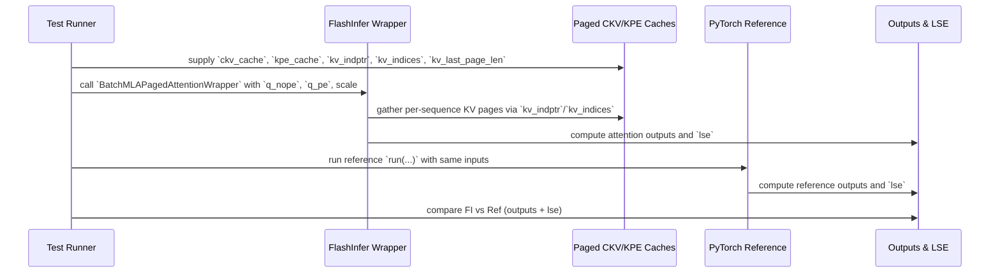

# [PR #405] feat: add mla_paged_decode_h8_ckv512_kpe64_ps64 definition

source: https://github.com/flashinfer-ai/flashinfer-bench/pull/405
state: closed | updated: 2026-04-21T22:06:26Z
labels: 

## 正文

## Summary

Adds the `mla_paged_decode_h8_ckv512_kpe64_ps64` kernel definition for Kimi K2 / Kimi K2.6 at tensor parallel size 8.

This is the `page_size=64` variant of the existing `mla_paged_decode_h8_ckv512_kpe64_ps1` definition. Both Kimi K2 and Kimi K2.6 use DeepSeek V3-style MLA with identical per-layer dimensions (64 attention heads → 8 heads/device at TP=8, `kv_lora_rank=512`, `qk_rope_head_dim=64`); they differ only in vocabulary size (160k vs 163840), which does not affect MLA kernels.

## Kernel details

| Axis | Value |
|---|---|
| `op_type` | `mla_paged` |
| `stage` | decode |
| `num_qo_heads` | 8 (64 / TP=8) |
| `head_dim_ckv` | 512 |
| `head_dim_kpe` | 64 |
| `page_size` | 64 |
| dtype | bfloat16 (Q/KV), float32 (sm_scale/LSE) |
| FlashInfer API | `flashinfer.mla.BatchMLAPagedAttentionWrapper` |
| Models | Kimi K2, Kimi K2.6 |
| TP | 8 |

## Files changed

- `flashinfer_trace/definitions/mla_paged/mla_paged_decode_h8_ckv512_kpe64_ps64.json` — new definition JSON with reference PyTorch implementation (tags: `stage:decode`, `status:reference`, `model:kimi-k2`, `model:kimi-k2.6`, `fi_api:flashinfer.mla.BatchMLAPagedAttentionWrapper`, `tp:8`).
- `flashinfer_trace/tests/references/test_mla_paged_decode_h8_ckv512_kpe64_ps64.py` — pytest comparing reference impl vs `BatchMLAPagedAttentionWrapper` on random inputs.
- `docs/model_coverage.mdx` — Kimi K2 row upgraded from ❌ to 🟡 (→ ✅ once workloads land in PR2).

## Reference test

```
$ pytest flashinfer_trace/tests/references/test_mla_paged_decode_h8_ckv512_kpe64_ps64.py -v

flashinfer_trace/tests/references/test_mla_paged_decode_h8_ckv512_kpe64_ps64.py::test_correctness PASSED

============================================================
Testing MLA paged decode h8 ps64 batch_size=4, max_seq_len=256
============================================================
✓ PASSED (atol=0.01, rtol=0.05)

======================== 1 passed, 1 warning in 28.76s =========================
```

## PR2 (HuggingFace trace)

_Link to be added after PR2 opens._


<!-- This is an auto-generated comment: release notes by coderabbit.ai -->

## Summary by CodeRabbit

* **New Features**
  * Added a new MLA paged-decode operator variant for Kimi K2 (8-head paged decode) to expand model runtime coverage.

* **Tests**
  * Added reference correctness tests validating the new paged-decode operator across multiple batch/sequence scenarios.

* **Documentation**
  * Updated model coverage docs: Kimi K2 coverage updated to 7 / 15, marking the new variant as workload-collected.

<!-- end of auto-generated comment: release notes by coderabbit.ai -->

## 评论 (2)

### coderabbitai[bot] · 2026-04-21

<!-- This is an auto-generated comment: summarize by coderabbit.ai -->
<!-- walkthrough_start -->

<details>
<summary>📝 Walkthrough</summary>

## Walkthrough

Adds a new MLA paged-decode operator variant (`h8_ckv512_kpe64_ps64`) with its JSON operator definition, a pure-PyTorch reference implementation and test, and a docs update reflecting increased coverage for the Kimi K2 section.

## Changes

|Cohort / File(s)|Summary|
|---|---|
|**Documentation** <br> `docs/model_coverage.mdx`|Updated Kimi K2 coverage: `mla_paged_decode_h8_ckv512_kpe64_ps64` marked as workload-collected (`🟡`); coverage count updated from `6 / 15` to `7 / 15` and description adjusted to include `ps=64` case.|
|**Operator Definition** <br> `flashinfer_trace/definitions/mla_paged/mla_paged_decode_h8_ckv512_kpe64_ps64.json`|Added new MLA paged-decode operator JSON registering `mla_paged_decode_h8_ckv512_kpe64_ps64` with fixed constants (H=8, ckv=512, kpe=64, page_size=64), input/output spec, constraints, and an embedded reference-style algorithm for per-sequence paged KV gather, attention logits (content + positional), scaled LSE, softmax, and bfloat16 outputs.|
|**Test & Reference Implementation** <br> `flashinfer_trace/tests/references/test_mla_paged_decode_h8_ckv512_kpe64_ps64.py`|Added PyTorch reference `run`, input generator, and `test_correctness` verifying FlashInfer `BatchMLAPagedAttentionWrapper` outputs and LSE against reference across several (batch, seq_len) configs; test skips without CUDA.|

## Sequence Diagram(s)



## Estimated code review effort

🎯 3 (Moderate) | ⏱️ ~20 minutes

## Possibly related PRs

- flashinfer-ai/flashinfer-bench#346 — Adds a closely related MLA paged-decode operator/test for the same H=8, ckv=512, kpe=64 configuration but with `page_size=1`.
- flashinfer-ai/flashinfer-bench#145 — Adds other MLA paged-decode artifacts and tests for `page_size=64` variants (related head/dim variants).

## Suggested reviewers

- xslingcn
- zanderjiang
- yzh119

## Poem

> 🐰 I gathered pages, heads eight bright,  
> Caches hopping through the night,  
> Tests snug as burrows, outputs true,  
> Coverage grew — one more for the crew! 🥕✨

</details>

<!-- walkthrough_end -->


<!-- pre_merge_checks_walkthrough_start -->

<details>
<summary>🚥 Pre-merge checks | ✅ 4 | ❌ 1</summary>

### ❌ Failed checks (1 warning)

|     Check name     | Status     | Explanation                                                                           | Resolution                                                                         |
| :----------------: | :--------- | :------------------------------------------------------------------------------------ | :--------------------------------------------------------------------------------- |
| Docstring Coverage | ⚠️ Warning | Docstring coverage is 25.00% which is insufficient. The required threshold is 80.00%. | Write docstrings for the functions missing them to satisfy the coverage threshold. |

<details>
<summary>✅ Passed checks (4 passed)</summary>

|         Check name         | Status   | Explanation                                                                                                                                                    |
| :------------------------: | :------- | :------------------------------------------------------------------------------------------------------------------------------------------------------------- |
|      Description Check     | ✅ Passed | Check skipped - CodeRabbit’s high-level summary is enabled.                                                                                                    |
|         Title check        | ✅ Passed | The title clearly and specifically describes the main change: adding a new MLA paged decode kernel definition with fixed parameters (h8, ckv512, kpe64, ps64). |
|     Linked Issues check    | ✅ Passed | Check skipped because no linked issues were found for this pull request.                                                                                       |
| Out of Scope Changes check | ✅ Passed | Check skipped because no linked issues were found for this pull request.                                                                                       |

</details>

<sub>✏️ Tip: You can configure your own custom pre-merge checks in the settings.</sub>

</details>

<!-- pre_merge_checks_walkthrough_end -->

<!-- finishing_touch_checkbox_start -->

<details>
<summary>✨ Finishing Touches</summary>

<details>
<summary>📝 Generate docstrings</summary>

- [ ] <!-- {"checkboxId": "7962f53c-55bc-4827-bfbf-6a18da830691"} --> Create stacked PR
- [ ] <!-- {"checkboxId": "3e1879ae-f29b-4d0d-8e06-d12b7ba33d98"} --> Commit on current branch

</details>
<details>
<summary>🧪 Generate unit tests (beta)</summary>

- [ ] <!-- {"checkboxId": "f47ac10b-58cc-4372-a567-0e02b2c3d479", "radioGroupId": "utg-output-choice-group-unknown_comment_id"} -->   Create PR with unit tests
- [ ] <!-- {"checkboxId": "6ba7b810-9dad-11d1-80b4-00c04fd430c8", "radioGroupId": "utg-output-choice-group-unknown_comment_id"} -->   Commit unit tests in branch `feat/def-mla_paged_decode_h8_ckv512_kpe64_ps64`

</details>

</details>

<!-- finishing_touch_checkbox_end -->

<!-- tips_start -->

---

Thanks for using [CodeRabbit](https://coderabbit.ai?utm_source=oss&utm_medium=github&utm_campaign=flashinfer-ai/flashinfer-bench&utm_content=405)! It's free for OSS, and your support helps us grow. If you like it, consider giving us a shout-out.

<details>
<summary>❤️ Share</summary>

- [X](https://twitter.com/intent/tweet?text=I%20just%20used%20%40coderabbitai%20for%20my%20code%20review%2C%20and%20it%27s%20fantastic%21%20It%27s%20free%20for%20OSS%20and%20offers%20a%20free%20trial%20for%20the%20proprietary%20code.%20Check%20it%20out%3A&url=https%3A//coderabbit.ai)
- [Mastodon](https://mastodon.social/share?text=I%20just%20used%20%40coderabbitai%20for%20my%20code%20review%2C%20and%20it%27s%20fantastic%21%20It%27s%20free%20for%20OSS%20and%20offers%20a%20free%20trial%20for%20the%20proprietary%20code.%20Check%20it%20out%3A%20https%3A%2F%2Fcoderabbit.ai)
- [Reddit](https://www.reddit.com/submit?title=Great%20tool%20for%20code%20review%20-%20CodeRabbit&text=I%20just%20used%20CodeRabbit%20for%20my%20code%20review%2C%20and%20it%27s%20fantastic%21%20It%27s%20free%20for%20OSS%20and%20offers%20a%20free%20trial%20for%20proprietary%20code.%20Check%20it%20out%3A%20https%3A//coderabbit.ai)
- [LinkedIn](https://www.linkedin.com/sharing/share-offsite/?url=https%3A%2F%2Fcoderabbit.ai&mini=true&title=Great%20tool%20for%20code%20review%20-%20CodeRabbit&summary=I%20just%20used%20CodeRabbit%20for%20my%20code%20review%2C%20and%20it%27s%20fantastic%21%20It%27s%20free%20for%20OSS%20and%20offers%20a%20free%20trial%20for%20proprietary%20code)

</details>

<sub>Comment `@coderabbitai help` to get the list of available commands and usage tips.</sub>

<!-- tips_end -->

<!-- internal state start -->


<!-- DwQgtGAEAqAWCWBnSTIEMB26CuAXA9mAOYCmGJATmriQCaQDG+Ats2bgFyQAOFk+AIwBWJBrngA3EsgEBPRvlqU0AgfFwA6NPEgQAfACgjoCEYDEZyAAUASpETZWaCrKPR1AGxJcAZiWpcaLT0zB5oAPrcaKS04UpMSuGwABzhDADWEgCsAIwATOHp3CQAbAAskYjlkAAUtpBmZQAMWQCUkIAoBPb42BQMJJACVBgMsJB+1AD0Sj5goRFRMXGiiiRJqRnZ+YXF5ZXVYHqQzNoYGpAAwhT+NPR5TXklYE1lYHk5g/I+YYgIGH4UMACfCaSAAZVw1GwiC4+GKZyMAEFgsg0MckIh4BgiJAALIAGURPGidEg8VWkHSlHIHjJJB8WPU8HwWB8+D4GEc4QAjvgkv5aIgALzJdAYeiLNaYgBeJCF1Rq3GF5VaABpIJCKKRbuhcJAANLwZg6fV5MX0ZyjdSiXC9NAeDyyMDwJQYcQMe0Go0mvIaEq6jVkRDs4lUB0kDxIZgwKwi8766kR0NoNg0CjIRDFBjwBl0DgGKCc5g8vmwAUwyCimrVag0N3MrBloLISYxkWtAuQJuxWhGtKZLi5M01TLhDzsiLDdIdqDduJ9oreSAK7npcIUOFrOe95gz4mkcIypcKsEAcXxmBxMzQ2A8esQlAkWJxkvs8Fle7h4VwsmKXHmkQkrQnaIJCpBcOSSi1LyY5kJAQqQDke4AGIAJKQIiViob4Px/ACGjzBoABC1CjASmFAYiuB1uILIAOpUNwxQUJ2EJQhWoHsRw1wAmQ/S1FIFA5vApJPmiPGUHxAw0KBADc6AAO7aOI2L2JCtowoJwmkmgPhpuC56Xgo4ZiA2HYGMh8BeKiwR0JMzCKNptD5lA3xoL8WIAt+VD9NM9KMrRGCIPZYSATEIULEBywJFuGyZEOOylBUSrlBoQjBlgXQzAFDb2KMJAnJAADUPC9CQYBWLI0DsqMkASdcIwkBonZuR5/yUN5aC+TJuDBfVUnBT14QAZKPYrIkKT9lsBSLnsKVlBo3DyF0TAUNcYjkIgyA9egRCnKBkDIbhqHtRQgCYBMgJG4GRhJWJR1HsA2DFoExlDNVAtD4AwwUOUoHhpPggkkgRtAAB6dJA2DcLQ1DSF6xoGmaTBA6QdX4Ap4wbtGgAy5Bq+CQIAvBuAIf7tQEIMAxQ0QVBKPQZOAKDkKBYGiYT6dwsDuSQrTNQYNj0pJjWBgd1wOHeFYMlICj/PARB2oFyA1AIpFjEeyA5OqZTqsk6o5CU6oAMxmgp6hjCcoOHiQ3KwVgqUaDkDxlO0URbTpe1YgduBlpACmMcxtT2rSViImCYIAKIACLydQ+AeEKTQaE0at1QQMdxy0XMYZAkYYOk4whmiAAS2BEEQz7IV10k+QM9RGw65PoLZ9As29Rj6MY4BQGQ9D4D4OAEMQZDKDqTCsOwXC8Pwwg2pIcNyAoShUKo6haDorcmFAcCoKgmC94QpDkFQQ8sGwbpcFQGMOE4LifHPyiL5o2i6IcRgGGvRifd99mrP9yPKKQIOg/mAARMAgwFgMKoX7vvWG9AL4nCvt3Rg7NsTSAMCdSAAADd+P0v4AxRk1ZgYN0G5z4B7AYAAqMhhoEamgofYKeLJ1SkIwSNKKkFYpTQSrNZKVQyhEI3BjUYl44bqGQD/KgqNOIaUxiwdEW1ny1HQdjdB7QyYKXZOkccQQwBMBMjqGo6DibKPOHAAYD5TIsgugoPB6AGBMGwPWVSqBVrC24CyXs2JHSQ2htA6+1xuBhGzKpdB/pWw5CyEQo2HsMEAHZIChPCeqTAtNPZiJJHSRADAhLcECpADA6NGa9g9DJDU7M9SjTpDFPEhJIASGcPATAvViEYNgCKIhWIGAeGwFBJh6ClTyl4YwDm3NzCWERHeQeDZtr4yYfEMIB9Jn8B7iQUGriKA6hDNwbAAhIwMEgI9cQKCAByAB5Q5IcjD4ixHDQRyDnLFRyJMMAOQjAh1AkaHxlTrhPhIBjekbI1lcFxHQeAjgDDAMAS3UwBhWp4Q6rgSufkGQYCZCyH6oVRoRTCnQaKqx1gcO2Fw/YC10osiASAsBiIIF70HqSWBzh5AIJuaQRASIG7oFyT8w6x1TpVKJKNMAbD+DMSjnwbKyKcnOHED4LqnBmHotYeNdhmxOG7G4eUdBxjPYACkwSnLpEiuG290EsJiEQziqNMGKqIXCL2xtxjwFBqSJgQVIRunlugosJZ+TNlaeqdB24+ybCFEOdBfqA3FkXP00NGDJSHnfHKdV7Qkk1LqSoLwb5pTyP+YMJW8jk36gAGpgFfFiXs60cn6MVtdWAcbZTRo9VySUiB61eAwOEUt2SKD1s9aOUt8B+jNvTqhe8WZtLIGuNybA8Brj0CxJsxp+jLZ5OKPWy2K6/WbDSF1Ms9bFxbvyruiQ7bxSdsPcewp0gz0/FwFiq29bEDFgyfaEgyjzT8DwPO91PRcDzpbQ+ZR6p/HQklqBKgWJGlkH+YEnE6DW3ns7fBBCVbRi1oGCVHIRDk0NojUevtA7EOUlwye+FABtJ5ABdDQ1pmA1FaBqmAnsCoCDoDTDB/VGptOYP4gq7BqC5QoPY5AzEwAPknVJCpjlVKzz2qQoSqlhOvkLYM/Key3RCThmJDBvbiNdsmOg7TF7m3qmWVEcU8jSHRnA/jYTBAqRYBOPC/tcNoTyP00e69t7W3RuHvOvND16wskzvgEujT3IlNMY4RZGo1FkhBDwDctBsBiHls6mi0jozoKXZudBenN0egPW+1xmJAqeh8FjDBa6X16b3flndao8r2nkbPdBD7Dwei8NG3gigktNY5m8ILRAROODACZhRHh/1JvFN0PSptdQ0VygpEg0tYC9USVN72TIpPfHwNQHWc3HqBe/Z+84w7GYdK6XDfwFBPHLJEU0gq2T5CvmGMyhRsbmM4j0AhWNndX3JuzUoalB9pIgk9LZuCdi3UKPxN+fAdnkDAAQk0ADkBZQblc0dvAmGpsPmoq58bL68YYOdP8Ihs9ry3j1Nmj2+AHyDIfIgYZoDRnjPmaionMzRBzL4+zhBJn2TrL4Js7Z/bVPiAOSyzsyJWPkAxpuA+IYxUotZFZJc6CYWeThQipXctMUYpNditheLlUEtVUStKGUiE1HAwlpLcMmHC52XslZAudJrJzDKjBGAUwDAQoAg3Y0YrG/iqbpKRLAFEOp57dX8BwgvXgDhdysKKAETCMRJW5E7oxCovN+iPtKBEJOExZ8XMLlXNEUgmIXAio5D1gATkeU0F5byHNOopF8kSvyfD/NlUC3soLwWQrAEYDXp1OrdWkL1SY7GB2TCGgHnFE04rTUSnNHhi1ZBkohRSqlA9gcwMcHAhlPcmUoNQWp7r+G0Sy65Unk6AI6p8wavxZxNpNrbUn8cbr6bs3oKujdCibPfzQKZ6V6LtSGTEVSNEBkR1egciOhW0bgWoUUMTK+bsRAdUC4JTbsMkI0SAIcdUfUKwEOLsAUXA6McoQDNJI8ZcB2TVAYX6W8AYIIQUdlTZa4CqKqGqMYdBATDASPexcxLAD2agdUbNfwWqZDMYCMHjN0dUdaVFeFJLRpB3SgETC2bAcTcHLAKkWQSYWpTpBg6gISfDMrGRcpWraSIMdkZATTNzeDeFM9PDS9NbegewjzWNLzRhMsLAHzPAOGJ9LwC0YA3KccELVEZAdBGobkLAAAAQNAYA0GgHaBKmiKQPiP1G4CSLozfXnmnhkBBDGExz1CkDEBsIUWDBmzQFBnQTAEW2Wx1Avii3QX1AYD+ym3xFDhTUMPdTCIvhM2tUEgayCIGxEXVGdUEh1BcyCTCJqDyDoyHT1HtGDHi0BhdDhnQSB1hnXCSRYGPU/SITJkyRuAGGdUxFAnYDql2OjFQPkDrGDHTCoJiEuELUmCIJIMsIwLfSYQnSnRnQKWnXoSZjWjQFkGQGzX8UwGRVUn0QM1PT9QMycyMy03c3chvU8LICvTIDjzWlXT5A7UcKTXHFUkiTGDRD8J1Ba0fXaxfXoIwSGlfw2mkGbXGEEJyUQHSHgCVC9h8MuAAFUw4iRUB7E0BakrI00SB5JCjKAjY6d1BIAtjik508AviKS4YZ8BhhZKcvj/YvpYZURM5nBUY1EKB0hMxy5BhsBu9KBAMwggpwtb9fh79KAvZ88+BST7VYDjgSBIQYZIQFEPRoR7QhQy4CdOsNwnxWM+1y1cpnAqAwT1RuxJhXwdwgxJl1QBBttdt/RaAfxihEB6s+DtpPZvYXpfYPTeCfTeg20CchRoABMX1XDEFRAzTBhCjH9eJGowAJBEAwA0J30f08A30NTuzez+zOiSDpiYMCA+hYAtAHQOladCcPTnUGQZYF501k5lBGpGdIBTteBwMhN3JgppUrI31ZsVBgxOkaBcDu9kBAtTzOlrhvC4JjzKBGlGTcB39zgiRjVTg+Fv0rk6pBMHSdouoNwtpjhKcuT00oipDUN1RTZzZLZW0cjVzpZZYFlk0Dyodt5AZlBa4nYMxD96VzhIBn5mcMJWced7SyZOcOlnAaL7ylkXc1lSQNktknd9kRJJcoBpdSQb8CBuAwAvApBaQfA2TcpeD7Fojwhl0SB1RKtxjRxLD1Qatt0FLCMHCKA1KiNDNdKxw0TPMyB1RWtAjOZ0Epc2VBK4QRKSAxLWSRgclNi99tjhhPpixlTeoFYlYELjhqjkKrZ1RPUYJ0CRREyBR5xiwg0CDSCggorEp+knipR40kq6Qnx+ghRAEGAuk0BAE6MrKZdOUhK7KHKJKnKpKGT2Ry138fLq1UMhQNZ/KzZRMrYhQ8gshdZdRo4hQchyo8h5Dk5g1+qCq+LrLirbLRKkxyqhDmFThaNLKxrWNGD012Ar5XFwMuB0EcxIBwg5Kfc9qCNAE9qTgsQ9rAF/x5qCqDBLlNpEEhE7kio8h7hG9m9xBW96BPl7LO89lu8BdAVgUB8QECwn4X525VMu4e4bw+5FS28R4T4rjz4SKr5Z4YoF41B74V4n414FBWB1B21BR1xvqflsVOI1lH5DAwaIBGAGBolcgGBmNkhaAsgmgBA9ZmgSgcgGAshokGAShdIshRAGamasg8g9ZkgshVABhV5wayg2bok9Y0A9YsgsgGBkha9VbdI9ZMySA8gBBaA68cg69okfA68mgShok68upHg9Y9YKa25qbh5jQb0XREAibvlFtYhO57acbeA1g2AtQ1h8oMg3aya9RW4DAABvAwSASAQBJAWwIiccDIOgC4I+dgKwWnW4C68YZYhSmOuOpAY5QSISWyDAHO6VAnVUAuwBLBRzbENOvBE6NMb3DwNiGgHO6O2O2OwBUfLyeFcuOfSfPqJ/AaIe0CYaeVJYI3SaE3GaM3eaDfTugu7uuOggSEDwZCSS1FHOjWFe7u3u7eoKOiY2MOL6UDZ8RAHO55VegAXwLtvurp7pihsBUAxoYhBBICsAoHcFwC8Arrzqfrjt+B6A8FoCTq+nSFsAAarprt7FoBsHsTPoYAhDkyIEQAuDLAyBzqUPzp7vgcQYwF/q8EwZbJwYbKAdrpdEIbDmkEyS5MClIewd8EAZrqzipFoFQi2k0MQFQZzuAUoevSYfSF5hFl6hzpI33q7tXrjuDvSEOR934doYySyRyWEcASAdXsAUkWhHIc0M0YPpMztJov4eEfsE5NenoCgDTqUFfrvksQQCIFgFKqTDpSvlQDIAlNoA0A0f3p7t+hIH4aUgoGhKIF8ZkbjvZGlixHtGEYUbYH4aUBUYYYbAhTvoMeka0bkficCa4EAWIdOKwfSHCZke0fUl0a4FwYMZ7qMcwBMbyZMQ1E8FOK8GcE8WTUzFEGEna08SSfoeY2LKMKxHuuQUCGCDzQ5QxngPKUFSpBCaTB1wWztRgNJCiCoFTEoHlhSGUumjUtVUAx4S5hKa0eFmjjwFSa4E5AdGqbjoCaCecFCeOYPoUKlnXNydztgYicASiZLlbricUbyfF3/v3sfqkb8dkaKZyaUfPvrpxEbt/kCZubKfYhgYfCRdqe90Cmhe+lhasQRZQGQA6vjiaAAFIeT+0xhN4gorSGRsx2A6TfjATklhZYBo5Z1kBkhU5SWfGkXTnryLm46GJrRYscW0HwSQwmEZq5ZZFICcQLMidEA+NEAfA7iUl8LxFpJYAWW2WeXwX/dVh7mQnnwnme6fmYmPB/mEm8m66xW0nu7QXV7MmD7smAW47bqOG9zuHrkimTXgHymr7KmKG9WMX6m46zGOSuTih6BmNAy6c8lM4sQPWMQeGvZJJc57F6Ao9UBNla5fjJ9dWvm7m8ngnHmkWzW/nIXXXAF2G6AuGHBpBERnYtpj5cA7XY6HXu6nXn7K2rW47jkhyEEwQmBihLhK9vWyGkWdGA2NQg2vmQ2sW8nw2LGo3yZY2Bh42a32X63kBFtrh02pss2hNbxaQ83QIC3Smi246S3jWy2hJfnYme33nvm8BjkfAh3NxMGhFEBG2GcH12A23IB77Y7yNBG0TbBlH6HskBXAEDY0A69+hBafAWgYY9YmgJaBA8gSASAyhokMONa68BACPda9Z+holaA8gFafADbaBVAshaAGA8haA9YSgSgBAmgGA7Zok0OSnq2wObACn+G9YfAyhaAyghOgg696QygSgGAfBtaSgJbol8gkOVAshUO68yg8gGa0BWacgYYmg0ASB2bUOmg68fAMOmbyholda8hkg8qDB76qaoA/bhpKADw5G3bvaZbqboa+QohoQpR1JAvJV7ao7ePQI7oAvaAqJeYPbU6j51A077FW2OAmhHOcbfPAIAvDwgvwgvPDggA -->

<!-- internal state end -->

### flashinfer-bot · 2026-04-21

Closing: collection with Kimi-K2.6 revealed that SGLang's MLA backend does not naturally produce page_size=64 workloads (the KV cache is stored with page_size=1 internally even when --page-size 64 is passed to the engine, since the engine page_size only affects the radix tree, not MLA's internal KV layout). Reopening would require either a different framework configuration or manual workload construction. Superseded by a new PR targeting the `ps1` variant, which is what Kimi-K2.6 / SGLang actually runs.

## Review (3)

### gemini-code-assist[bot] · 2026-04-21 · COMMENTED

## Code Review

This pull request introduces a new trace definition and a corresponding reference test for the `mla_paged_decode_h8_ckv512_kpe64_ps64` operation, used in Kimi K2 and K2.6 models. The documentation in `model_coverage.mdx` was also updated to reflect this addition. Feedback indicates that the coverage count and summary text in the documentation are inconsistent with the status table and should be corrected to accurately represent the current state of model support.

### coderabbitai[bot] · 2026-04-21 · COMMENTED


<details>
<summary>🧹 Nitpick comments (2)</summary><blockquote>

<details>
<summary>flashinfer_trace/tests/references/test_mla_paged_decode_h8_ckv512_kpe64_ps64.py (2)</summary><blockquote>

`41-53`: **Dead branches given how inputs are generated.**

`generate_random_inputs` guarantees `seq_lens >= 1`, so `page_beg >= page_end` and `L_tokens <= 0` cannot occur for generated inputs. These branches are fine as defensive code for a shared reference but note that `lse[b]` remains `-inf` in those paths while the wrapper may return a different sentinel — something to keep in mind if the reference is reused on more adversarial inputs.

<details>
<summary>🤖 Prompt for AI Agents</summary>

```
Verify each finding against the current code and only fix it if needed.

In
`@flashinfer_trace/tests/references/test_mla_paged_decode_h8_ckv512_kpe64_ps64.py`
around lines 41 - 53, The branches checking "if page_beg >= page_end" and "if
L_tokens <= 0" are dead for test inputs generated by generate_random_inputs
(which ensures seq_lens >= 1) and leave lse[b] as -inf; update the code that
handles these defensive branches (the block around page_beg/page_end, page_ids,
num_full_pages, L_tokens, output[b].zero_(), and lse[b]) to explicitly set a
consistent sentinel for lse[b] (matching the wrapper's sentinel) or
document/assert that these branches are unreachable for generate_random_inputs;
choose one: either remove the dead branches or add an explicit assignment to
lse[b] in those branches to avoid inconsistent sentinel values.
```

</details>

---

`136-144`: **Prefer `pytest.skip` (or a pytest skipif marker) over silent return.**

When pytest collects `test_correctness`, returning `None` on CPU-only environments reports the test as passed rather than skipped. Using `pytest.skip("CUDA not available")` (or `@pytest.mark.skipif(not torch.cuda.is_available(), ...)`) gives accurate CI signal. Low priority since this mirrors the convention used by the sibling `h16` test, but worth aligning repo-wide eventually.

<details>
<summary>🤖 Prompt for AI Agents</summary>

```
Verify each finding against the current code and only fix it if needed.

In
`@flashinfer_trace/tests/references/test_mla_paged_decode_h8_ckv512_kpe64_ps64.py`
around lines 136 - 144, The test_correctness function currently returns None to
exit when CUDA isn't available, which marks the test as passed; change this to
call pytest.skip("CUDA not available") (or alternatively add a
`@pytest.mark.skipif`(not torch.cuda.is_available(), reason="CUDA not available")
to the test) and ensure pytest is imported at top; specifically replace the
conditional that checks torch.cuda.is_available() / device == "cpu" and the
return None with pytest.skip(...) so the test is reported as skipped on CPU-only
environments.
```

</details>

</blockquote></details>

</blockquote></details>

<details>
<summary>🤖 Prompt for all review comments with AI agents</summary>

```
Verify each finding against the current code and only fix it if needed.

Nitpick comments:
In
`@flashinfer_trace/tests/references/test_mla_paged_decode_h8_ckv512_kpe64_ps64.py`:
- Around line 41-53: The branches checking "if page_beg >= page_end" and "if
L_tokens <= 0" are dead for test inputs generated by generate_random_inputs
(which ensures seq_lens >= 1) and leave lse[b] as -inf; update the code that
handles these defensive branches (the block around page_beg/page_end, page_ids,
num_full_pages, L_tokens, output[b].zero_(), and lse[b]) to explicitly set a
consistent sentinel for lse[b] (matching the wrapper's sentinel) or
document/assert that these branches are unreachable for generate_random_inputs;
choose one: either remove the dead branches or add an explicit assignment to
lse[b] in those branches to avoid inconsistent sentinel values.
- Around line 136-144: The test_correctness function currently returns None to
exit when CUDA isn't available, which marks the test as passed; change this to
call pytest.skip("CUDA not available") (or alternatively add a
`@pytest.mark.skipif`(not torch.cuda.is_available(), reason="CUDA not available")
to the test) and ensure pytest is imported at top; specifically replace the
conditional that checks torch.cuda.is_available() / device == "cpu" and the
return None with pytest.skip(...) so the test is reported as skipped on CPU-only
environments.
```

</details>

---

<details>
<summary>ℹ️ Review info</summary>

<details>
<summary>⚙️ Run configuration</summary>

**Configuration used**: defaults

**Review profile**: CHILL

**Plan**: Pro

**Run ID**: `2a7a4876-9f75-416c-8181-5a46ebac4d10`

</details>

<details>
<summary>📥 Commits</summary>

Reviewing files that changed from the base of the PR and between e489a246533cd6ba98236e438aaaad018e8d0786 and cc751cbe8d50b34061c57c6af5eccb8d52385bbe.

</details>

<details>
<summary>📒 Files selected for processing (3)</summary>

* `docs/model_coverage.mdx`
* `flashinfer_trace/definitions/mla_paged/mla_paged_decode_h8_ckv512_kpe64_ps64.json`
* `flashinfer_trace/tests/references/test_mla_paged_decode_h8_ckv512_kpe64_ps64.py`

</details>

</details>

<!-- This is an auto-generated comment by CodeRabbit for review status -->

### coderabbitai[bot] · 2026-04-21 · COMMENTED


> [!CAUTION]
> Some comments are outside the diff and can’t be posted inline due to platform limitations.
> 
> 
> 
> <details>
> <summary>⚠️ Outside diff range comments (1)</summary><blockquote>
> 
> <details>
> <summary>docs/model_coverage.mdx (1)</summary><blockquote>
> 
> `487-496`: _⚠️ Potential issue_ | _🟡 Minor_
> 
> **Update the Kimi K2 coverage summary to match the new status.**
> 
> Line 487 now marks `mla_paged_decode_h8_ckv512_kpe64_ps64` as present, but Line 496 still says `6 / 15` and claims all MLA defs require new `h=8` variants. The table now has 10 present rows (`✅`/`🟡`) and 5 missing rows.
> 
> 
> 
> <details>
> <summary>📝 Proposed documentation fix</summary>
> 
> ```diff
> -**Coverage**: 6 / 15 definitions present. RMSNorm definitions are shared with DeepSeek V3 (same hidden=7168 and sub-module dims). MoE EP=1 and EP=8 definitions added. All MLA defs require new h=8 variants; MoE EP=4 variant (e=96) and sampling (v=160000) still missing.
> +**Coverage**: 10 / 15 definitions present. RMSNorm definitions are shared with DeepSeek V3 (same hidden=7168 and sub-module dims). MLA h=8 variants are partially covered, including paged decode ps1 and ps64. Missing: MLA paged prefill ps64, MoE EP=4 variant (e=96), and sampling (v=160000).
> ```
> 
> </details>
> 
> As per coding guidelines, Model coverage tracking should be maintained in docs/model_coverage.mdx with kernel support status.
> 
> <details>
> <summary>🤖 Prompt for AI Agents</summary>
> 
> ```
> Verify each finding against the current code and only fix it if needed.
> 
> In `@docs/model_coverage.mdx` around lines 487 - 496, Update the coverage summary
> to reflect the new table state: change the "6 / 15 definitions present" line to
> "10 / 15 definitions present" and update the explanatory sentence that currently
> reads "All MLA defs require new h=8 variants" to indicate that only some MLA
> defs still require h=8 variants (e.g., "Some MLA defs require new h=8 variants;
> others have h=8 variants added"). Keep the existing notes about RMSNorm sharing
> with DeepSeek V3 and the MoE (EP=4) and sampling (v=160000) entries still
> missing.
> ```
> 
> </details>
> 
> </blockquote></details>
> 
> </blockquote></details>

<details>
<summary>🤖 Prompt for all review comments with AI agents</summary>

```
Verify each finding against the current code and only fix it if needed.

Outside diff comments:
In `@docs/model_coverage.mdx`:
- Around line 487-496: Update the coverage summary to reflect the new table
state: change the "6 / 15 definitions present" line to "10 / 15 definitions
present" and update the explanatory sentence that currently reads "All MLA defs
require new h=8 variants" to indicate that only some MLA defs still require h=8
variants (e.g., "Some MLA defs require new h=8 variants; others have h=8
variants added"). Keep the existing notes about RMSNorm sharing with DeepSeek V3
and the MoE (EP=4) and sampling (v=160000) entries still missing.
```

</details>

---

<details>
<summary>ℹ️ Review info</summary>

<details>
<summary>⚙️ Run configuration</summary>

**Configuration used**: defaults

**Review profile**: CHILL

**Plan**: Pro

**Run ID**: `b31079b8-4eb5-4c4f-9c3c-3e3554a7c1f6`

</details>

<details>
<summary>📥 Commits</summary>

Reviewing files that changed from the base of the PR and between cc751cbe8d50b34061c57c6af5eccb8d52385bbe and 4b373a355c8135caf3bfe2bd9197f90679ac2633.

</details>

<details>
<summary>📒 Files selected for processing (3)</summary>

* `docs/model_coverage.mdx`
* `flashinfer_trace/definitions/mla_paged/mla_paged_decode_h8_ckv512_kpe64_ps64.json`
* `flashinfer_trace/tests/references/test_mla_paged_decode_h8_ckv512_kpe64_ps64.py`

</details>

<details>
<summary>🚧 Files skipped from review as they are similar to previous changes (2)</summary>

* flashinfer_trace/definitions/mla_paged/mla_paged_decode_h8_ckv512_kpe64_ps64.json
* flashinfer_trace/tests/references/test_mla_paged_decode_h8_ckv512_kpe64_ps64.py

</details>

</details>

<!-- This is an auto-generated comment by CodeRabbit for review status -->
