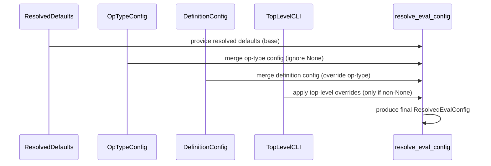

# [PR #411] fix: respect CLI overrides over YAML layers in resolve_eval_config

source: https://github.com/flashinfer-ai/flashinfer-bench/pull/411
state: closed | updated: 2026-04-23T21:01:36Z
labels: 

## 正文

  ## Summary

  - `BenchmarkConfig.resolve_eval_config` merged `op_type_config` and    `definition_config` **after** top-level fields, so any CLI flag whose    field also had a YAML entry was silently overridden.

  ## Fix

  - Change top-level eval fields (`warmup_runs`, `iterations`, `num_trials`,  `rtol`, `atol`) to `Optional[...] = None`. `required_matched_ratio` was    already `Optional`.
  - Rewrite `resolve_eval_config` so the merge order is now  `ResolvedEvalConfig` defaults → `op_type_config` → `definition_config`     → top-level / CLI overrides (highest priority).
  - Hardcoded fallbacks (10 / 50 / 3 / 1e-2 / 1e-2) come from `ResolvedEvalConfig` alone; YAML layers still stack by specificity.


<!-- This is an auto-generated comment: release notes by coderabbit.ai -->
## Summary by CodeRabbit

* **Refactor**
  * Evaluation parameters are now treated as optional and resolved using layered precedence: resolved defaults → per-operation-type → per-definition → top-level/CLI overrides.

* **Tests**
  * Strengthened regression tests to validate layered override and deprecated sampling override precedence.

* **Style**
  * Minor formatting and import ordering cleanups; a small test invocation was reformatted for readability.
<!-- end of auto-generated comment: release notes by coderabbit.ai -->

## 评论 (1)

### coderabbitai[bot] · 2026-04-22

<!-- This is an auto-generated comment: summarize by coderabbit.ai -->
<!-- walkthrough_start -->

<details>
<summary>📝 Walkthrough</summary>

## Walkthrough

BenchmarkConfig’s numeric evaluation fields (warmup_runs, iterations, num_trials, rtol, atol, and deprecated sampling fields) are changed from concrete defaults to Optional[...]=None. resolve_eval_config is restructured to merge in order: Resolved defaults < op_type_config < definition_config < top-level/CLI overrides, applying top-level values only when non-None. Tests updated accordingly.

## Changes

|Cohort / File(s)|Summary|
|---|---|
|**Configuration Schema** <br> `flashinfer_bench/bench/config.py`|Converted evaluation fields (`warmup_runs`, `iterations`, `num_trials`, `rtol`, `atol`, `sampling_validation_trials`, `sampling_tvd_threshold`) to `Optional[...] = None`. Refactored `resolve_eval_config` to merge layers with priority: Resolved defaults < op_type_config < definition_config < top-level/CLI (top-level applied only if non-None).|
|**Configuration Tests** <br> `tests/bench/test_benchmark_config.py`|Updated tests to expect top-level BenchmarkConfig fields to default to `None`; added/strengthened tests verifying cross-layer precedence for `rtol`, `required_matched_ratio`, and deprecated sampling overrides between CLI and YAML `extra` fields.|
|**Trace Test Formatting** <br> `flashinfer_trace/tests/references/test_gqa_paged_prefill_causal_h5_kv1_d128_ps64.py`|Minor formatting change collapsing a multiline `wrapper.run(...)` invocation to a single line; no behavioral change.|
|**Scripts / Formatting** <br> `scripts/collect_stream.py`|Whitespace/reformatting and minor import reorderings; equivalent logic retained across CLI arg parsing, command construction, and push/commit message assembly. No API/behavioral changes.|

## Sequence Diagram(s)


## Estimated code review effort

🎯 3 (Moderate) | ⏱️ ~20 minutes

## Possibly related PRs

- flashinfer-ai/flashinfer-bench#388: Modifies `BenchmarkConfig` and `resolve_eval_config` merge behavior in the same files and addresses optional/override handling.
- flashinfer-ai/flashinfer-bench#67: Related changes touching `BenchmarkConfig` usage/import locations and downstream call sites.

## Poem

> 🐰 Defaults loosened, fields set free,
> Layers stack up like leaves on a tree.
> CLI whispers, YAML replies,
> Resolver listens, merges wise.
> Hop, test, and ship — configuration glee! ✨

</details>

<!-- walkthrough_end -->


<!-- pre_merge_checks_walkthrough_start -->

<details>
<summary>🚥 Pre-merge checks | ✅ 4 | ❌ 1</summary>

### ❌ Failed checks (1 warning)

|     Check name     | Status     | Explanation                                                                           | Resolution                                                                         |
| :----------------: | :--------- | :------------------------------------------------------------------------------------ | :--------------------------------------------------------------------------------- |
| Docstring Coverage | ⚠️ Warning | Docstring coverage is 61.90% which is insufficient. The required threshold is 80.00%. | Write docstrings for the functions missing them to satisfy the coverage threshold. |

<details>
<summary>✅ Passed checks (4 passed)</summary>

|         Check name         | Status   | Explanation                                                                                                                                         |
| :------------------------: | :------- | :-------------------------------------------------------------------------------------------------------------------------------------------------- |
|      Description Check     | ✅ Passed | Check skipped - CodeRabbit’s high-level summary is enabled.                                                                                         |
|         Title check        | ✅ Passed | The title clearly and concisely summarizes the main change: fixing CLI override precedence in resolve_eval_config to be respected over YAML layers. |
|     Linked Issues check    | ✅ Passed | Check skipped because no linked issues were found for this pull request.                                                                            |
| Out of Scope Changes check | ✅ Passed | Check skipped because no linked issues were found for this pull request.                                                                            |

</details>

<sub>✏️ Tip: You can configure your own custom pre-merge checks in the settings.</sub>

</details>

<!-- pre_merge_checks_walkthrough_end -->

<!-- finishing_touch_checkbox_start -->

<details>
<summary>✨ Finishing Touches</summary>

<details>
<summary>🧪 Generate unit tests (beta)</summary>

- [ ] <!-- {"checkboxId": "f47ac10b-58cc-4372-a567-0e02b2c3d479", "radioGroupId": "utg-output-choice-group-unknown_comment_id"} -->   Create PR with unit tests

</details>

</details>

<!-- finishing_touch_checkbox_end -->

<!-- tips_start -->

---

Thanks for using [CodeRabbit](https://coderabbit.ai?utm_source=oss&utm_medium=github&utm_campaign=flashinfer-ai/flashinfer-bench&utm_content=411)! It's free for OSS, and your support helps us grow. If you like it, consider giving us a shout-out.

<details>
<summary>❤️ Share</summary>

- [X](https://twitter.com/intent/tweet?text=I%20just%20used%20%40coderabbitai%20for%20my%20code%20review%2C%20and%20it%27s%20fantastic%21%20It%27s%20free%20for%20OSS%20and%20offers%20a%20free%20trial%20for%20the%20proprietary%20code.%20Check%20it%20out%3A&url=https%3A//coderabbit.ai)
- [Mastodon](https://mastodon.social/share?text=I%20just%20used%20%40coderabbitai%20for%20my%20code%20review%2C%20and%20it%27s%20fantastic%21%20It%27s%20free%20for%20OSS%20and%20offers%20a%20free%20trial%20for%20the%20proprietary%20code.%20Check%20it%20out%3A%20https%3A%2F%2Fcoderabbit.ai)
- [Reddit](https://www.reddit.com/submit?title=Great%20tool%20for%20code%20review%20-%20CodeRabbit&text=I%20just%20used%20CodeRabbit%20for%20my%20code%20review%2C%20and%20it%27s%20fantastic%21%20It%27s%20free%20for%20OSS%20and%20offers%20a%20free%20trial%20for%20proprietary%20code.%20Check%20it%20out%3A%20https%3A//coderabbit.ai)
- [LinkedIn](https://www.linkedin.com/sharing/share-offsite/?url=https%3A%2F%2Fcoderabbit.ai&mini=true&title=Great%20tool%20for%20code%20review%20-%20CodeRabbit&summary=I%20just%20used%20CodeRabbit%20for%20my%20code%20review%2C%20and%20it%27s%20fantastic%21%20It%27s%20free%20for%20OSS%20and%20offers%20a%20free%20trial%20for%20proprietary%20code)

</details>

<sub>Comment `@coderabbitai help` to get the list of available commands and usage tips.</sub>

<!-- tips_end -->

<!-- internal state start -->


<!-- DwQgtGAEAqAWCWBnSTIEMB26CuAXA9mAOYCmGJATmriQCaQDG+Ats2bgFyQAOFk+AIwBWJBrngA3EsgEBPRvlqU0AgfFwA6NPEgQAfACgjoCEYDEZyAAUASpETZWaCrKPR1AGxJcAZvAAeXBTS3KK4kADCADIAkvxSFBTwSsj4CZAAmgCCALJRkB5ospTI8FjBiPgeUgD6JBJoHjVMGH5EkAAUtpBmACwAjP0AlJCQBll4sPgUXLL4GEQA7suQgCgEkADK+NgUDN6MHvBgaZRJSpCASYQwzqSckMzaWOsbuNTYiFz4oU+RwdR0XAATAAGQEANjAwN6YEBgOggIAzBxYRx+oCAFqjAwAVRsUS4sFwuG4HwA9KSiOpYNgBBomMxST5CogEK1KGBtIzmayfOyBGQGLBSdxsB4PKSBv03AhkN0/P5pOgsNMlEkFpABNh2mVIAAhAWwB4UADWEXmbQ0FSqtXqjWa5vg7VwsGojDQ7zokVikCZaCIyAIGpI9ngXgwuA88hOiWSSiwckyuXy7CS0g0MFgwd49Xg22QbAopH4FFVCmYanI9C+NVwslC9tajqV9CUfgw6lzGAbbXQPhofAI3DAXikHh98BIHloiAANOgxfhFmV2tk8pBA69jVngns43t4pQvTENEYIi6FtIOAYoFYKIIvMwuNE4r7/ZBFlNEMG/JPp/PKpAJD+EgND0Dqq75IslDBtGZxxpAtDYMGgYFkWKqUCeUAAGITlO651sGgqYKQHzrl8w71JOgENGOP5TsgizOMw2DcDUFDYBgs4oP21CdlxGCODWSSNFxFAEB4c7UFUjDnqQ9CBgA8tw4jzI0ADaGiaQAupAAC8kAAHLzMGHTBAAjtg8DBLQNQPLggp0GxvH4O+aDII0fy0PISkqRgjRDJhkBWtUJB1DR3ZNsEixJDQXCoTBJaHqgGCLpANjSNadAAKI0WajbtK27oeLgyBXNWtb1i0PZXK2ZQdvMEXtFcg4UaOkCkkeB4xiknQAc+pItSOVEulIkAIEQmaIOEvC5jFsgBdekAABLOLQTBKPQPiNB4AhoAwxrIB0/TAu1kAAKwnR1CKnf0JAwjdd2AiMzjbmkySegm6WVCFtA5Y0eU9vMkYANyJmuhTFBQyBTaGY5TXtxoavIiChAw8B+GjtYnteYCGAYJhQGQVY+DgBDEGQyigWWbDhlwvD8MIYSSIqCbrcoqjqFoOj6Pj4BQHAqCoJgpOEKQ5BUFT9I03cVCLPYjhGvIrOKOzaiaNoui40YvOmAYvosmUvIUDU/IYIKpKm+bVWOho3CyFeABETsGBYkBZDE5Pi/89AOE4Lj8CTREXogBgAAb6mbhrOKaDpEKHgCYBMgtoeNgzlYNwzhoGw/YBi603BBIubvJGY1oPQjSMbIiDHFgLQMMENAISQW2iiVnSh4xFDMax7GcaHc6h+olN8f3kChwJzBCfAImj6HYlVLPUkeKP3Ap8gSjZgw3tj4gWer8uNQ0ckadTzPzY73vhwLDWEg2c6FRTFOofPcECgYAkVOBqHPmdo0ofjr+dezciriHVF/Iy5BR5kBUFfJ0mZmBkSDOuP4VM3KQEADgEKVwhfnCK6Z0qAIYYUALgEY9go2nCtbOOKBkAsVoNvACzpgx1XEI0e4lA5JvzaDsNOkAUoFHmKQPgHEWi0Hqn5MU8huBfFFP8XO+Avy8McJQeADAAH0R9HeBB4cDRGhjvlUOoN1C8NSvFVIQ4KrBkwC2ZuzDOwFCKCUccUNwgdA/KGJhRAUpqnaKHCBJB/40SQogIYc5GFYDQNwfeipBqUXFM+LqZxFRA3kD4aYai/wfnkchciQ0xyBMVC9YxGAwC+OMqPMoDAU6iPVBvHc9DL7LgSe9ZAhc0BjyArgKgod0w5HYduWa6h5CoGbryMQzMS4Gz7J6AgXAvqZWsS3YqyBgD8HMQRThTYVm1XbL5DZ7QVkxNHKSeJsFmnY3MJYLIxVh7zADC5RhTdKmZ18qkEmQEpFiU9GkkUAhDiqPYB2aQi1tGR10QDR0/86LyQIqSRAjo/K4B2MGWhsiUBYFDvrHklATYGgtriyhttZChyvKMKAHcmIsTYhxUiZRcD/yuOSrulLe6kR/qpDwalaVaX/h0Qqrcx7HXpWPPxz8DCkrHkPCWfEuC0qFYPHiLyuBsvEZy8M3LOh8uKmPC6cqRVDDFboMeE9T4eBpeGOVxrOnT1NUq5Sv8OVcp5Zq8IocES6rKfq8Vc9xK+A8Pgagcr54eFtb5dSTJ/W4HVby4B/LQ63RhO6yBnrDWhyXr6iNcq02QGVWGv11Ao3OoFY9RN/jk1kt3swfe18j50N8ias1dLLgX0rbAw+jRj51qtSJEN9rVWRqdTGrVcbgTAhLaKr1Faq1EBvnfWAD8qi0HTQGptodJ2ttwLfGsc7pCP0Xdmu17K1LhvzQOxZLrgQaEBGO/VBgohlEVEHOSXAADUvQzqkjAAiQERgsowzsp6NmQUcwkDliM6YdwlqOlgAYJ2DsjAQDAEYGgU1EB4sjgNaQuAcWgujo1Qljtnau3dp7SmnpfaKwDjJYiQK4DIUw+5V+KLP73JQWPCOgowWx3/ocqiUL3LIAEmKGBwZnxgCmrILwTSUhcBBRx6O4KiAdCGP/FKctnXIEZd3KlfcB6SrTogWelrhKmtnkG0eVix5L24y5UpkC5xLmdG/euJBG41sgPkpO/hUZU2Sb2fspCMohTCnaShHRNIaGU0Fal6ZaNsMLHdGa0xBnrkw9Q+wnSyBEDCWR+5OTYnHNiGAXgb0NqkPEv/U5PUILDgcXwDzGiWAanwI50O5UCKNX/hZ0O2yxEdfswgSTfGCjwC3AFiyVlHJ2QcjZKV+BIXbQ1AjRBrXWIWI6++TMWAsE8DvIXUreDMxkW4AUWJ59NPMupf/YIDwyjuSA99KQCyQEbbIJAalLn0xZFoKI0NY5ghEAqHC+YKWUPoFfmXUrgYEjo3kPXeR1dCF8E3nQAU340lzxION6ytlqDTacipHl8T+TUA021yqXGB5k9CpQzrkTDiKg/K9vhJyEiJMAsBFDkkMD0G6zYnZnZ1vE7bitms7WafPW54gmt/wduiBR2bYM/IRqzR9Gk2poh6ktsaSz04zSuA8bHKuhp18ABUFXWfNLBvkUOHSqAaDN3OCC7T/CdLQPb2nUSGKbeMUd1qVFKvBiAiBLiXXbdoCuyQG7nE3ucRcy9rbJAqSHniV4q3O2SuKjXY0nBoD/TnJdpc65s3o8bkO0oJ5xfXns4+T5pHNI/mAXDICkOUAjLV/A3QYU9eVGN/ELWR5hRK/vmglRi89AOj4OQH4STvmWivFuyD8IPhhEvIWgXyAORMDo1SzhSTWRxGyAAF6UG1swMo0wahMaBbe+9yBH0AkgM+gAHICD9YIf1/u3oBguE5QM+FSWJFwL0qIo4DBs7DjIhnrNyIbNiq7nsBhihqSMEEbKjqhshlhkQGZGgDUBnHJDgcgbDM0O6LvE0LAGdDUMaBIP0DULQGiE/jgYgGCL0PhmAXBkRh7GLKRj7ArM4FGIHLJDRodvfvwBgCXMgdMHZLnMGBitAWyBQP/NFBEqEHwGUBIPgFvLsjqKHOgfaIkGEOQIgAZvrodh3FQJEhhL3P/FvGKOuHnDwG5F+BpmUCKCVGpA7GZA7NygPB0M4XgIgG4caEQQ5J4XOL4a4Q7BIEEZmJ4cplzjzg3DsF2KaiQLpNAOxP4mlkwEJiSJ6D4JougPcK3KGPeqrl3GioGG0nCgsJJlfCQOmG3n6pSAwHOBnFQNnCUHOHPneLRH6osHOGkgkRQMUvkqXNzrAmlswIoOjBOLQPnkRkXvpogg8uXoPosfgG8l5h3lWHXr8j3gCuIECq3sZNjHegYaPk+o/v0B+giB/uIP+vQN/sBn/gAXcFEIuKwfBrrIgPXPAMpKhlkV4GIDUFNH8MwCwbBuvsRpwRLGRjwf7OsecYcWlM3BISToUcVL8ZJl+GMrcpRquj8X8aSACWEMCRllnISjysvmbLsj1i8pJIWEouGMNpzp1KmoWK0V+P/LSXxHEWPAwMwLQJ1okEUMEkjGil+GJMuEgZHm9OqLURqH8AdOfG4shhnPuA5lMHgOcY0g8hxKqJGI0tYaai0ZnO0XVo0EEv0XwF0dJOGosIFF9kIO8G3PAJWuBulv8NLMWKqI0gAWPGaKwOoEpDchgF9oKWdktD4FkNwPAP/FoSKCyDWPgPgZ1pLqHAmbAEJHtBkZqOEFuCQCSLYcGBWkwm6Z8j7LIOWFUIgIFAGdmIYUknwMEGAO8lYtDKjNMaoiCdnn8o0h0NoX6GpGGB0A7H4DUBEvABwA7CMBwNyhLjzrviQEZLgFhNsNzllIkNMP/GwIYX6IRLcp0tgDiRgC0RUJQIXGAodiWYBJudafMD9nxIFOlNFEPBplLOoLZNILvKQP/JqKGNUtqOihmUmSmYgsLJjpZDROwD6GJlauqO8oDnYhqQhOjCgUyXXP8Aip2LCmqcuHMYXgqnxEsWXqIKsS8pRu8lscWDwN3v8k3gcS3oZMcZ0FcmOPfgxkwuGJQOIoggAXZLnufK6TXqSOhBQKSPKYoZEo0giUHjDOqFSceaRKHI0bPLcDQXzmIqpS5jUFTlpVhhUlUqFBnESNxaZhxDUDAcEArmZV2LvPzsfrPMBQQCmQPL3MFsvAPE5VQHsLPFHt0jeqcQ+gIXus+oMFcWAAAOzAi3Gulf4qxAaFwgaAT/7gZcBvGLAfE4x4wEyN7EwiwkYwkPEsDSxBBoByzka8FilsxUAczqzcxaw5Xvn6XThsRPGOTwxiSazZV8yQAACcTBAgT+vQT+CIZ0Z0vQtAgIT+DAL+wIdAAgvVgIEVw1SgZ0KOZ0CIAgDAvQvVtAvVXVOsUAb6EV/+CIEVvVAgYIwIaIJA4IvVewJAZ0vVPg91T+JAz1vQEVV1CIo1EVCIDA10PMh11MH5yQiArViVUENkRMB1OV2Yn58WzQmY+04NHV4QQNAA3gag7EgLYLqH6vtHQAGdLFYPIqBA7L4CJCQDONjUgApBbt9mQBTT6FTTTaMA7LQOod2QsGaAkHuTEFxUMY0C8P8MzVjaMOzZipZdhubJbEKASnbGLQahLZAA7AQK8B4FhCvnxMzYCGzSrarQpS8gAOpUgAAiXNcF/outytkAAAvvrezegahnLQgVhnLbonhorVwOLQbWrc1o0FrdSTrVwE/o7RLaOdrbcqbc6BbQwNzdbVwO/irQ7bbaObIUbFmfAc7dKWhXsGgZhjUJgdgbgY5NmNPk0FvO8HaGQRQVQTQXQQwUwYSkrQbarerYHVHZxMzf0OHZLV3YgDHbAHHQnYgMzdFSneHQ7N8UkIScSUCSCSQOSd7ZAL7Srf7RrUHYpT3cCH3YbQPUPSPVbWPVwGdLbXbQaqnezWzDYCoGrMbXeDQLeO4BGCQMzVtMkfrdPZqVOPjeocaLYO/azdjaIrQDYBxHHS8N4ogGeKIMaMzYedTSA8kOAxgC/V4LA/tAg+kV/aA6g2bdIASb5Jg/A5TZ/djVfFuLQDEIYUElA8zU7F/cyLgCQ19K3CfZAGpLbWvRHQ5PtAZFnG/VwA7AQzPb8bsiQw7HvdPa8Iihw4g9I+8oUFhfMAwyQ/YMaL8aEPQFAGaEoLfbVYnGNFBn7nDHCUMknH5L8nQBoFI7bezZMUoAw53O2AsHY23Q7ElpSOIiQwI2wAwykEQ52HBpPdw/Y6rXw8aH40I6reg4RMjfA9I/DHI9g0hIo15so2nAw7Fn3pJpUkvRQCXBZnXEgJOMjHCfAMflIfcI8Iib4AENrt6AHrLruKjmivdplO5Y1IgvyPdt5l8ukE7ojjWe437Y4zEw7C48uKM+vTuLHEikA+Qx4142UP9Ak9Eww7k2/efeHTw9fes4Iww0fd4pENGHuTMxHck+8Is1+Ok6vJgFk8I8c4aWc0WKgGCP0BoL1cCAAKQbYqKwBpa3bYD/4qITjhgxaHbmSWTWS2Hzp4SoBP4Xojo/O2PSPBR4DBPCMP1DwISW3QOlFFk+gD33BIBVFwKR6IK7ziCIA+DyAPJMB81Fj3w7oLpovhMOzjPOPOCuNEAXPs0rM+MHP+PCOc3x3H0hMS1X0S17MRPCsTOnFUOQA0MOBBVwP8uq1XPyM4MctKMPO+RqMJMaNaMfQa4eg+6UOehktBLD6vypJ6mEuT40U2HQuYbsseNcvCNTNuPSOCtrNwMbPCOWvUO0PSBZANmGHSySujDSujCysOyROBuq0KRakIkbBMChCRACF34JMasyNvDatpO6sZP6tYuq3qOICaPmH0D8hV0KJ8LBvUKqsMQj72uS5+lOsigusQVut5ueuq3et8u+tJDeP+v8OHPCPbC4AKQ+DptfAkBnjUaIDhuOGIBRvn0GpaRMNuS4C2CiNBOqPCMCDDVfq0ACDAi7T9AMD9ACCAhnQA29DNwCDnVvpghbXHRbRghKD9AvXXtgiAhoD3trS9BghnS8j9VgjfNoAggCC0AIijMOzMO2BxMBM+BQjQdoAIjAijUDDAgMAMBnQv5giPVbxP5vvfMMCwdYc+BrQIivW3tnRoC9X9BoAkA7UzURVbxoAnXMd7URVwYX3A3w3xRI1wPg0w08w5XujOUZweikn/DyedWY2Ic7tWDEF0BZC4DpSQ1E3FXqBmgcS4AU3AiCdSd4DJmydfjyc0B1CS76BAA= -->

<!-- internal state end -->

## Review (4)

### coderabbitai[bot] · 2026-04-22 · COMMENTED


> [!CAUTION]
> Some comments are outside the diff and can’t be posted inline due to platform limitations.
> 
> 
> 
> <details>
> <summary>⚠️ Outside diff range comments (1)</summary><blockquote>
> 
> <details>
> <summary>tests/bench/test_benchmark_config.py (1)</summary><blockquote>
> 
> `1-128`: _⚠️ Potential issue_ | _🟡 Minor_
> 
> **Run `black` to fix the linting pipeline failure.**
> 
> The `linting.yaml` workflow reports that the `black` pre-commit hook reformatted this file, which will fail CI. Please run `pre-commit run --all-files` (or `black tests/bench/test_benchmark_config.py`) locally and commit the resulting formatting changes.
> 
> <details>
> <summary>🤖 Prompt for AI Agents</summary>
> 
> ```
> Verify each finding against the current code and only fix it if needed.
> 
> In `@tests/bench/test_benchmark_config.py` around lines 1 - 128, The file
> containing tests like test_benchmark_config_defaults_valid and
> test_resolve_merge_priority was reformatted by black and failing the lint
> pre-commit check; run the formatter and commit the result by running either
> "pre-commit run --all-files" or "black" (e.g., black on the test file) locally,
> then add and commit the reformatted file so CI's linting step passes.
> ```
> 
> </details>
> 
> </blockquote></details>
> 
> </blockquote></details>

<details>
<summary>🤖 Prompt for all review comments with AI agents</summary>

```
Verify each finding against the current code and only fix it if needed.

Outside diff comments:
In `@tests/bench/test_benchmark_config.py`:
- Around line 1-128: The file containing tests like
test_benchmark_config_defaults_valid and test_resolve_merge_priority was
reformatted by black and failing the lint pre-commit check; run the formatter
and commit the result by running either "pre-commit run --all-files" or "black"
(e.g., black on the test file) locally, then add and commit the reformatted file
so CI's linting step passes.
```

</details>

---

<details>
<summary>ℹ️ Review info</summary>

<details>
<summary>⚙️ Run configuration</summary>

**Configuration used**: defaults

**Review profile**: CHILL

**Plan**: Pro

**Run ID**: `6052f6c2-2240-4e84-8f3f-71e2a751af35`

</details>

<details>
<summary>📥 Commits</summary>

Reviewing files that changed from the base of the PR and between e489a246533cd6ba98236e438aaaad018e8d0786 and 964b8483554d28c820edb92748de5ede53bc49d9.

</details>

<details>
<summary>📒 Files selected for processing (2)</summary>

* `flashinfer_bench/bench/config.py`
* `tests/bench/test_benchmark_config.py`

</details>

</details>

<!-- This is an auto-generated comment by CodeRabbit for review status -->

### gemini-code-assist[bot] · 2026-04-22 · COMMENTED

## Code Review

This pull request modifies the `BenchmarkConfig` to treat top-level fields as optional CLI overrides, ensuring they take precedence over YAML-based configurations during the evaluation resolution process. The resolution logic was updated to merge defaults, operation-type configs, and definition-specific configs before finally applying any non-None top-level overrides. While most fields were updated, feedback indicates that `sampling_validation_trials` and `sampling_tvd_threshold` are still being shadowed by YAML layers because they were not converted to optional fields with the same override priority logic.

### yongwww · 2026-04-23 · COMMENTED

(no text)

### coderabbitai[bot] · 2026-04-23 · COMMENTED


<details>
<summary>🧹 Nitpick comments (2)</summary><blockquote>

<details>
<summary>scripts/collect_stream.py (1)</summary><blockquote>

`385-387`: **Consider using a more secure temporary directory location.**

The static analysis tool flags the use of `/tmp/fi_stream_dump` as a potentially insecure default because predictable paths in `/tmp` can be exploited via symlink attacks. While this is a pre-existing default (not introduced by this PR) and the script runs in a controlled environment where the risk is low, consider using `tempfile.mkdtemp()` or a user-specific location like `~/.cache/flashinfer/` for improved security posture.


<details>
<summary>🔒 Optional: use a safer default temporary directory</summary>

```diff
+import tempfile
+
+# Near the top of main():
+_DEFAULT_DUMP_DIR = Path(tempfile.gettempdir()) / "flashinfer_stream_dump" / f"run_{os.getpid()}"
```

Then update the argument:

```diff
 parser.add_argument(
     "--dump-base-dir",
-    default="/tmp/fi_stream_dump",
+    default=str(_DEFAULT_DUMP_DIR),
     help="Base dir for per-batch-size dump dirs (default: /tmp/fi_stream_dump)",
 )
```

Alternatively, use a user-specific cache directory to avoid shared `/tmp` entirely.
</details>

<details>
<summary>🤖 Prompt for AI Agents</summary>

```
Verify each finding against the current code and only fix it if needed.

In `@scripts/collect_stream.py` around lines 385 - 387, The default for the CLI
option "--dump-base-dir" currently points to a predictable /tmp path; change the
default to a safer, per-user or ephemeral location by updating the argument
handling around the "--dump-base-dir" option in collect_stream.py (where the
default is set) to either (a) use a user cache like
os.path.expanduser("~/.cache/flashinfer/") or (b) create a unique temp dir via
tempfile.mkdtemp() at startup and set that as the default, ensuring any
downstream uses of the dump_base_dir variable still work and directories are
created with secure permissions.
```

</details>

</blockquote></details>
<details>
<summary>flashinfer_bench/bench/config.py (1)</summary><blockquote>

`88-94`: **Consider emitting a DeprecationWarning for top-level `sampling_*` fields, mirroring `log_dir`.**

The docstrings mark `sampling_validation_trials` and `sampling_tvd_threshold` as deprecated CLI overrides, and the suggested replacement is `op_type_config`/`definition_config` `extra`. However, unlike `log_dir` (which warns in `_validate_fields`), setting these top-level fields silently succeeds, so users have no signal to migrate.

<details>
<summary>♻️ Suggested addition to `_validate_fields`</summary>

```diff
     `@model_validator`(mode="after")
     def _validate_fields(self) -> BenchmarkConfig:
         if self.log_dir is not None:
             warnings.warn(
                 "log_dir is deprecated and ignored; logs are embedded in trace evaluations",
                 DeprecationWarning,
                 stacklevel=2,
             )
+        if self.sampling_validation_trials is not None or self.sampling_tvd_threshold is not None:
+            warnings.warn(
+                "Top-level sampling_validation_trials/sampling_tvd_threshold are deprecated; "
+                "use op_type_config/definition_config extra instead.",
+                DeprecationWarning,
+                stacklevel=2,
+            )
         return self
```
</details>

<details>
<summary>🤖 Prompt for AI Agents</summary>

```
Verify each finding against the current code and only fix it if needed.

In `@flashinfer_bench/bench/config.py` around lines 88 - 94, The top-level fields
sampling_validation_trials and sampling_tvd_threshold are marked deprecated but
don't warn; update the model validation in _validate_fields (the same place
log_dir emits a warning) to check if sampling_validation_trials or
sampling_tvd_threshold are not None and, if so, emit a DeprecationWarning (or
use warnings.warn(..., DeprecationWarning)) that instructs users to migrate to
op_type_config/definition_config extra; keep the Field definitions as-is but add
these checks adjacent to the existing log_dir warning so users receive the same
migration signal.
```

</details>

</blockquote></details>

</blockquote></details>

<details>
<summary>🤖 Prompt for all review comments with AI agents</summary>

```
Verify each finding against the current code and only fix it if needed.

Nitpick comments:
In `@flashinfer_bench/bench/config.py`:
- Around line 88-94: The top-level fields sampling_validation_trials and
sampling_tvd_threshold are marked deprecated but don't warn; update the model
validation in _validate_fields (the same place log_dir emits a warning) to check
if sampling_validation_trials or sampling_tvd_threshold are not None and, if so,
emit a DeprecationWarning (or use warnings.warn(..., DeprecationWarning)) that
instructs users to migrate to op_type_config/definition_config extra; keep the
Field definitions as-is but add these checks adjacent to the existing log_dir
warning so users receive the same migration signal.

In `@scripts/collect_stream.py`:
- Around line 385-387: The default for the CLI option "--dump-base-dir"
currently points to a predictable /tmp path; change the default to a safer,
per-user or ephemeral location by updating the argument handling around the
"--dump-base-dir" option in collect_stream.py (where the default is set) to
either (a) use a user cache like os.path.expanduser("~/.cache/flashinfer/") or
(b) create a unique temp dir via tempfile.mkdtemp() at startup and set that as
the default, ensuring any downstream uses of the dump_base_dir variable still
work and directories are created with secure permissions.
```

</details>

---

<details>
<summary>ℹ️ Review info</summary>

<details>
<summary>⚙️ Run configuration</summary>

**Configuration used**: defaults

**Review profile**: CHILL

**Plan**: Pro

**Run ID**: `0824b664-ee6c-49c3-9868-c9d9e4e81fb0`

</details>

<details>
<summary>📥 Commits</summary>

Reviewing files that changed from the base of the PR and between 964b8483554d28c820edb92748de5ede53bc49d9 and 457ff379b6012e269cee59f9c8e9f476033573c3.

</details>

<details>
<summary>📒 Files selected for processing (4)</summary>

* `flashinfer_bench/bench/config.py`
* `flashinfer_trace/tests/references/test_gqa_paged_prefill_causal_h5_kv1_d128_ps64.py`
* `scripts/collect_stream.py`
* `tests/bench/test_benchmark_config.py`

</details>

<details>
<summary>✅ Files skipped from review due to trivial changes (1)</summary>

* flashinfer_trace/tests/references/test_gqa_paged_prefill_causal_h5_kv1_d128_ps64.py

</details>

</details>

<!-- This is an auto-generated comment by CodeRabbit for review status -->
