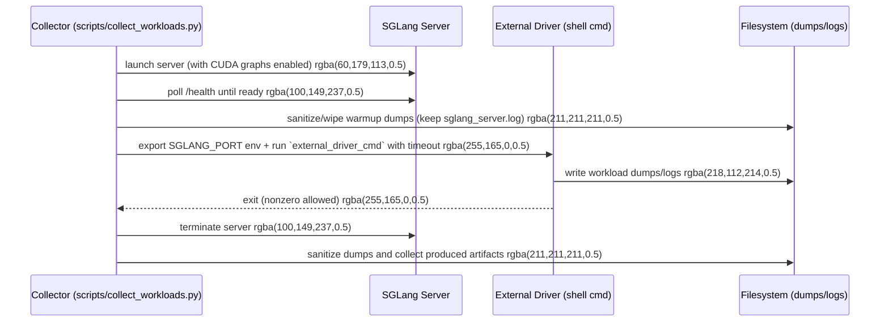

# [PR #417] update skills/script on workload collection

source: https://github.com/flashinfer-ai/flashinfer-bench/pull/417
state: closed | updated: 2026-04-30T18:14:01Z
labels: 

## 正文


<!-- This is an auto-generated comment: release notes by coderabbit.ai -->
## Summary by CodeRabbit

* **New Features**
  * External driver mode to run custom workload generators
  * New post-processing tool to extract, deduplicate, and export plan dumps as reusable workload blobs

* **Improvements**
  * Automatic baseline detection to avoid redundant regeneration
  * Baseline evaluations gated so all workload checks must pass before progressing
  * Workflow optimized to skip unnecessary baseline creation and evaluation
<!-- end of auto-generated comment: release notes by coderabbit.ai -->

## 评论 (1)

### coderabbitai[bot] · 2026-04-25

<!-- This is an auto-generated comment: summarize by coderabbit.ai -->
<!-- walkthrough_start -->

<details>
<summary>📝 Walkthrough</summary>

## Walkthrough

The PR adds baseline-existence checks to onboarding and bench workflows to skip regenerating/evaluating baselines when artifacts already exist, adds an external-driver mode to the workload-collection script (runs a user-provided shell command against a launched SGLang server), and introduces a postprocessing tool to extract/deduplicate plan dump tensors into workload JSONL + safetensors blobs.

## Changes

|Cohort / File(s)|Summary|
|---|---|
|**Onboarding Baseline Flow** <br> `\.claude/skills/onboard-model/SKILL.md`|Docs updated to document baseline detection and "only create when missing" behavior for PR2 and Phase 4b.|
|**Workload Collection — External Driver** <br> `scripts/collect_workloads.py`|Adds `external_driver_cmd` and `external_driver_timeout` to `run_sglang_mode()` and CLI; when set, forces HTTP server path, waits for `/health`, exports `SGLANG_PORT`, runs external shell command with timeout, preserves existing log/dump sanitization, and treats nonzero exit as non-fatal. Removes explicit `--disable-cuda-graph` from server args and wires new CLI flags.|
|**Onboarding Agent — Baseline Check** <br> `scripts/onboard_definition_agent.py`|`check_workloads` now reports `baseline_solution_exists` and baseline filenames; agent prompt and phase logic updated to skip writing/evaluating baseline when existing artifacts are found.|
|**Plan Dump Postprocessing Tool** <br> `scripts/postprocess_plan_dumps.py`|New CLI tool: scans dump dirs for `.plan_` subdirs, loads safetensors (skips failures), extracts `kv_indptr`/`kv_indices`, deduplicates by (batch_size, num_kv_indices) up to `--max-per-shape`, writes safetensors blobs and JSONL workload entries referencing them, and prints summary counts.|

## Sequence Diagram(s)



## Estimated code review effort

🎯 4 (Complex) | ⏱️ ~45 minutes

## Possibly related PRs

- flashinfer-ai/flashinfer-bench#355: Implements the same baseline-exists gating and reuse of existing baseline solution JSONs—strong overlap in baseline-check logic and docs.
- flashinfer-ai/flashinfer-bench#293: Related changes to baseline-evaluation gating and onboarding/collect_workloads flows; touches the same onboarding logic.
- flashinfer-ai/flashinfer-bench#234: Prior changes to `collect_workloads.py` that introduced server-run behavior; this PR extends that script with external-driver support.

## Suggested reviewers

- yzh119
- yongwww
- Ubospica

## Poem

> 🐰 A rabbit checks for baselines near and far,  
> If found, it spares the work and leaves the jar.  
> It launches servers, sends commands with cheer,  
> Gathers dumps and blobs that we hold dear,  
> Hops off singing: "Reuse, don't redo!" 🥕

</details>

<!-- walkthrough_end -->


<!-- pre_merge_checks_walkthrough_start -->

<details>
<summary>🚥 Pre-merge checks | ✅ 3 | ❌ 2</summary>

### ❌ Failed checks (1 warning, 1 inconclusive)

|     Check name     | Status         | Explanation                                                                                                                                                                                                                                                                                                                                                                                                         | Resolution                                                                                                                                                                                                                |
| :----------------: | :------------- | :------------------------------------------------------------------------------------------------------------------------------------------------------------------------------------------------------------------------------------------------------------------------------------------------------------------------------------------------------------------------------------------------------------------ | :------------------------------------------------------------------------------------------------------------------------------------------------------------------------------------------------------------------------ |
| Docstring Coverage | ⚠️ Warning     | Docstring coverage is 25.00% which is insufficient. The required threshold is 80.00%.                                                                                                                                                                                                                                                                                                                               | Write docstrings for the functions missing them to satisfy the coverage threshold.                                                                                                                                        |
|     Title check    | ❓ Inconclusive | The title 'update skills/script on workload collection' is partially related to the changeset but is vague and overly broad. It mentions updating skills/scripts and workload collection, which are components of the changes, but fails to capture the main substantive changes: skipping baseline evaluation when baselines exist, supporting external driver commands, and introducing plan dump postprocessing. | Provide a more specific title that highlights the key behavioral change, such as 'Skip baseline evaluation when existing solution found' or 'Add external driver support and baseline detection for workload collection'. |

<details>
<summary>✅ Passed checks (3 passed)</summary>

|         Check name         | Status   | Explanation                                                              |
| :------------------------: | :------- | :----------------------------------------------------------------------- |
|      Description Check     | ✅ Passed | Check skipped - CodeRabbit’s high-level summary is enabled.              |
|     Linked Issues check    | ✅ Passed | Check skipped because no linked issues were found for this pull request. |
| Out of Scope Changes check | ✅ Passed | Check skipped because no linked issues were found for this pull request. |

</details>

<sub>✏️ Tip: You can configure your own custom pre-merge checks in the settings.</sub>

</details>

<!-- pre_merge_checks_walkthrough_end -->

<!-- finishing_touch_checkbox_start -->

<details>
<summary>✨ Finishing Touches</summary>

<details>
<summary>🧪 Generate unit tests (beta)</summary>

- [ ] <!-- {"checkboxId": "f47ac10b-58cc-4372-a567-0e02b2c3d479", "radioGroupId": "utg-output-choice-group-unknown_comment_id"} -->   Create PR with unit tests

</details>

</details>

<!-- finishing_touch_checkbox_end -->

<!-- tips_start -->

---

Thanks for using [CodeRabbit](https://coderabbit.ai?utm_source=oss&utm_medium=github&utm_campaign=flashinfer-ai/flashinfer-bench&utm_content=417)! It's free for OSS, and your support helps us grow. If you like it, consider giving us a shout-out.

<details>
<summary>❤️ Share</summary>

- [X](https://twitter.com/intent/tweet?text=I%20just%20used%20%40coderabbitai%20for%20my%20code%20review%2C%20and%20it%27s%20fantastic%21%20It%27s%20free%20for%20OSS%20and%20offers%20a%20free%20trial%20for%20the%20proprietary%20code.%20Check%20it%20out%3A&url=https%3A//coderabbit.ai)
- [Mastodon](https://mastodon.social/share?text=I%20just%20used%20%40coderabbitai%20for%20my%20code%20review%2C%20and%20it%27s%20fantastic%21%20It%27s%20free%20for%20OSS%20and%20offers%20a%20free%20trial%20for%20the%20proprietary%20code.%20Check%20it%20out%3A%20https%3A%2F%2Fcoderabbit.ai)
- [Reddit](https://www.reddit.com/submit?title=Great%20tool%20for%20code%20review%20-%20CodeRabbit&text=I%20just%20used%20CodeRabbit%20for%20my%20code%20review%2C%20and%20it%27s%20fantastic%21%20It%27s%20free%20for%20OSS%20and%20offers%20a%20free%20trial%20for%20proprietary%20code.%20Check%20it%20out%3A%20https%3A//coderabbit.ai)
- [LinkedIn](https://www.linkedin.com/sharing/share-offsite/?url=https%3A%2F%2Fcoderabbit.ai&mini=true&title=Great%20tool%20for%20code%20review%20-%20CodeRabbit&summary=I%20just%20used%20CodeRabbit%20for%20my%20code%20review%2C%20and%20it%27s%20fantastic%21%20It%27s%20free%20for%20OSS%20and%20offers%20a%20free%20trial%20for%20proprietary%20code)

</details>

<sub>Comment `@coderabbitai help` to get the list of available commands and usage tips.</sub>

<!-- tips_end -->

<!-- internal state start -->


<!-- DwQgtGAEAqAWCWBnSTIEMB26CuAXA9mAOYCmGJATmriQCaQDG+Ats2bgFyQAOFk+AIwBWJBrngA3EsgEBPRvlqU0AgfFwA6NPEgQAfACgjoCEejqANiS7ZutaiUiIA1vAsXEAekQMK8brj8WADu+BTOFvho9EzuouL4GAYActjMApRcACwAjADsBgCqAEoAMlywuLjciByenkTqsNgCGkzMngBmFmiICBidlGDaXT198ANDGRgMsJ7c2O6euQWFiJmQsrLwzZhEBgDK+NgUDI4CVDOwXJ3wAB7ertxgJBJoFmDBsGRgAr0kFgmJBedyQuEQBmgaAopECF0wsy4zG0SQOuGo2Fq/G4ZAMxVe8BIwUoWIMpRUANJAGEKCQHPRqFwAEwABiZADYwCysmAmQBWaBMgDMHD5AA4ODl2QAtIz6YzgKBkej4To4AjEMjKGgxFhsDCcHh8QQiMSSaSQOQKJRUVTqLQ6eUmKBwVCoTDqwikchUHUKVjsLhUYJONLIijyK1MG0qNSabS6MCGBWmAxtHrYJSPNweTyJARRCi0MDMRQAzwHADSAElSqUNMxaBwDAAiNsGADEHcgAEFq5qffTQ6xofJVYxYHtpEYAArFJmQAAUAAlsERGhgiAAxNBnSDdXr9QYUMC4KhnACU+8iIdQtnsfoI+/gFEQgSUNDE6CwJFBb4mRCWv8gLkE4+AWHg8CJJA2AYDakAAAa4Mw3CjIeEzHqe54kN44GQYkXh/OsIE4QA3vg3AAPq4LIOIAL6eKRSi3Bg6hQRglEYGgbAMQhGiQNWapEQCQKQAAUgcADyyTPlYyDvLS0TyL+YIADSQLg3xGvgZyIMgGD4CGLj+Mg3ragB6CQOQIbCSRYEQQkWCYPQxk1JAFCwaxm6IQe4yTCe0yzAhkCvO82DUOx6lfG4jjtMw6jiN5mmOCp/7eYgeGObJFq9GAboGvgGlaXO/GCVZhW2aJGUOexIV/uC6nqNpZx0MgT6+HSNCeLSZm+o4yVAcRonOe5sE+WMR5TGQswhW8FgIep0S0BZaAKBgb5UBMgSadQ6DuJAoThJE0SzWFEUEZAzCYnCjgITOPYHAcACiAAiwUZJ0YSOBRZAWXOTL8XAjgzpO6yQFkAhOPEtXuh4hW/twzl0AdTRFagiDcY4gA4BLMojOM+r6BJ4QQWPIHUOAd3xYPFekAYAuASjVYGhGKUQLILMU5NpAADUOQsp4YA5EYT3/sifrRo4tISISIYkJ0n0UIaACydDwGkrbtgYEBgEYPh+AEXixFYYiUYdERRLQiAaNwsjNm2Ladt2fYDtqyOIGGo78GqHObtOCEeRxiBED0m6UaWSjBQZIa7mcBuIb+NAUFxFiUbQfhSBQlEMI2wUjQhCeUMnqfp5Q1HwGwxy4At370OoyDrBQGclmWdWiPhWDwlc0hcF8ZDx3cidF2n5qZ9ntDBagvD4NLSi14ECu6UVjjLtA0AzlDjeUDw1CwEuy0YwIIGAaq3RAnm8skWAiOkCqATsYgF5Rdo4L7mE7l0st5B6ZA0urQNqWJUAghTw3x3iaWCtwcCR91LJRCP4C0ACLLBGhFdbgkBaBpDQewPwFpFy/gYBBT+QCg4hyIJRBuGcNCRCIAhR+dVIGKzalpYi8Q3aUAzjwMI21CoDVmG4egv9EIHAAOKlB7MkYRlEZySWKNAauI0A5MMcFPGebtvj7TiiNYIqNVqTiLBpcuJBK78WSIkAAXpQeGA9C7vHQSXPgKlAgS2QLQQqBlAgqC4QAbiXtaZRFAdIkFahpQqFCt6J3ilxLKI0MEoScJgNiZjzoYFKmqfO1ik7vGLiPLOOcUD6XwIEdYuBGqBF4NIdhFoBq8CgnwDIk5pZvyjO8I+vito2IsIhSiAdyHBz2JRDClBpokGCpECigMtIiPJOlSpfAMxXHQDCeStJ0C0CENdZGVpaSlmlt5BCEB94qCsGABgmY0DECoNwWAuc4KrKIf6fUL9egN0AZAKkhQXo9kgEQS5sB66wGOBYeg2yUQhS4ofOgEzHBUlKNWb5KJkD7JBIPd4YBh5NzHjc+gSKC6ZI+OioY4gK54Hkbc6ERA0jsBRn4byiM9JVO+MwFABVEI9JIf08OIzmZGEdr2CwidkltR4VpJQBDoSCq9vQrhyM34LEPvABgYLxDiGnFALcsEzTQUQPAIgUSTiOHvPSLg/tYK9NIWHMsi4NDWovBPLACE9b+HBJ4I28RTZhHNtEK2NsEIGEgLoXstBZ7byoGwROWJ0kopTgS0ejYuAbUgAAH0gKY0CABeFNiQRnqUjR07JGcy7EsNFtSAGa8ishZL6qAMK4XtIoJ0XcBq7BGsQsiCYi5bWQEAEmEiF2WbmCu7AQmjbkTF7b4J1hsoFurNsdS21tZC+v9VAHsQbkbkspQaCNEBcXJzRfYk5Occ3boybumNp5DGV19WSNmE5OZcF5vkAWYphaiyHBLd+0siQhXllwrgy4dWwA1g7LWqZHUGzzBgAs0JaCpzlhMNiiRKJoG9JoG2dt2xdl7P2XqQ53YjgjJKn2pAIRAwOh62dJzvgMHxgQcC5VbzrRxGIJRGlsLv0gdqggBGFZ1TBBZSqoFqrt3ElJGS0JxANuYzXdjXCZCFN3qtAs4E6RYEXAhATJByGZXYpRABiBaHSYGsUyVGnspcTYFbGAWl8yFnuYgWQb4SBMqnihDxtzaOdKUGB6JKzDV+gykVXapnQoQWSfk+FOouAg3+JAdkloSAbhkGTFpFkEK42o+6o6Ft9OLVub3Jyg0RKCe09BBSH9lL1UQDArSyGqWuWQMEPwrzVrWUK3ZEa9XRoYC8kAnpGndNzQQj40zQmsqNbYt5EaIXwpZR0qc40GBSaUz7gZXjaVAKmdQJ9WCtB+KQB5byns/LzIXSfANUVPRfT30lQjaVKo+BysBIq9gbFVWZqlYrOg8wWhPaVeoeQF3xWOXZpOX2tcsCaVQMteW3LMNKwSYMN8kAtwxV7MnWQFiKAsxvURug96chZAFuyF9RK30tyljLb9Ctlaq3VvbOUoHx3gY49UAJulECUW4CHVOmDvW2yA4d7DWo+ouQ9gR8cuOITVgNAEjBi8EIs6nuzzn3PYk1HnfIpw6I4LvCzQ85yYA7IecC4EWk1UpDyVY42xCzF4PA88AAKgd54YAtvWKOT0BoIQGUMDBSfB+SgkTboUWorRbNS8sA+EwIig5mC0UvmCjx5atIxBhEJOzRI6J4N7OttzviyO350hmmr9BL54hhHkNozSlp5OtpIOiB8aAvc+/mtJhCEwFjgg0BjQYNB1phByygQIs765oF72QDKr4lyuW4CtW5TADQTGwBZaCs6QoUACa+OhCdzwvwQs4CQAy4IBAoFixCB+j/LV0ongJTK++T8gM4EgDnELksokyM/CE39Cmru0TvFp1NqBZhyF4ALEb8WBz9D8JhaAT9RkyAiBNJct6AbRzREUMA0hKIL9oCFVpBP8rAOJoDYDSp3w6BbAnsHBkBsF09LQKtdxAgEJFw/hcBgDtULF1J0DmBMCoC4IcCH5gpbAQlEIIBkQ7gr4hg+g0AcR88txC9dxd4n8AgnBJwcRSkDomscp4lx9+8p9D5BA1os8etIDL9YC28sCeDr9BD1NIgBBPAZ1ssXdB1k89AXcQ8aIcRnDXc4N3d2JnDrUNB+C4It5VocM/RChChqwXpfh/h6Bbh8DMZqs+4F8NpsApNVoJJpIyMssTpsF5Adoil6965cZkRnwARLYlwEI3cENfcopyMLZX87hcDmUCFMxUsmCWDQDw8VF4Bg0EIODOdatB8EJ8DjCzxq5eiMCzCr9cC6FwxnBkBLtSANIJ8B9yiABHTiH6MY9YqQnNajQ/BgOQ8PffHELOQ4gzXoVlZyFgUlYFOWIZGYBlRwcbKoPuHvevZYnQ6wn+eAVaffbgmA0YzwP4y/Xg4KB1Mfd47Q/TZlTvfgYQeISzFHZOUmVQ54nKfaGONIRYIcKgqpYVb6PAWE9I5IUobeavEaGpTdBQWCF+ccKPbrZGZPKrNQhKPuXE5kkaBQopZQxwN8agK2A7TDI7AVYHQQ87UQS7CVccW7T7e7HgH7BVP7FVCEKAFWTSRQO5PHVtFEDtXQPQTNcgO1MdfWZ1RXNnaQDnLnTAHnFCPnK9OHBHaQQIFHKwNHd4DHSgbHL+W9MHfHdkdkAWFkEncuMnJQD9SnOWanLgFWZaOnTWeUAwZ0MFFUNUNAPAL0YXMnAMA0IMNAIyMXSMMmMsW0OMB0RMQwJMuKdQAZS2bpAkIkOgchdERWcslMKAJkBgPIAATloDyCyCyCZDFDQD5CFE6ByC7JyDFCyDFCCToCyAYHZByCFBIC7JZBZE6FoAECZAhhZFbKTJyD5BZDFDHI3L5FoCFDFDyAEGXL5CyBIAEC7I5ByCZC7IvLZAECUAvOfNvMhgTMrL1GrO6I5wpwbJg2VD3MVCNE0zYBhE03SzmKbPE1bIMFIj9UgBbCQDnAACFIhqM6AqQ9R2AZx8BHNaAWwbh3h1hVI0KMLEBJIM4/BV0MByL9xKKSBqL/UWxXEGANoAICKM5atpco00QHAWLUL/VOLvMvAbNoNYMWIqikMUN50xK0KJL0KCB0QLB1UZhgcWKcgOK1L0LOgNVgcAB1JoF6HSXizcRAFioMtSuiAyySpnZ1V1E2Owr1ZSrgcSwylsDS94bSzVdaFipkJyiSlsYynS++cyzSSynis8ACWyrgIWBysKlsKS+YEi1nQJPSFXa0tXPnFSwy9SwpAKky++PSsKziyKoKxAGK2AOK6yogJKyAeyiSuiNCxymiiWYoWMdQUygJGgGcCgcwXAKwFihtDwdimivoQFWgHCnSZwOcCatigyri7o4oWCOKtEGlZqqkKjZwFis8bAaazi5aWgTajAUaqwfavGI6jyU69C86y6l6aQFy9iW66jFaqatakCJ/WgasPSE6xAHalitsX63oXAT65wfEd2flFqgAbVUsgB8rUpbHguSExjBteu81qmhpbCqvQr5NwExHupOsJpbARhDmSTBuhqcCeBxHoGrTLF6rtFwEAEwCZABAIgWAQ3V4AEYccMeQVAMgI5SFAm5GzizlMG5BJOACCW4qlsNPDcd4aGzGtgMGrzd6xIB2VK5G1G8KjGrGrgFsa62KA6hW3y4m0miin6yW9CqmzAGmk20jZVV0gAcj815NcHcC8G8yCEyM9V1DiCCvdvC0RkVh+PcHkFpB6EfHxJ9OI3r0tDwHCzeApUcBGmnkoCWwuAtmIMuhewuj8wsmMl9u8Bcvkjy1qJOjcsciigQBmmhFihYEgXICpPHF4VB2I3UgEFTobTcCFUYEkJJpWQGjbUjxaD5MXykETu7npv8Fn28mCzmhm1qnyzaxvQAXUndm4AYVeR3VsRjX1zgg5JHRl0UBSIsitKwBLzNJyu1U3A0EtrRrNxK2YpNuGunm6Mzsui+icCY3gFuEVTdv6knECG5tgEBB5pfgGif0jBIAaVqVsVxx3pSIU2QHdoOCeE3tAmmzCw3sQXSnftfh2zDrfndpXXoEPs83sVDD3q4Wk1MwDyCtfj4A8uDuNkcndufopulpNtlp6xfvCpT0SFuApVpDJserRuVomFVoOvVpIDBtAd1varCoNs4qNo1pNsaoSu8n4uUFIGEckvRBJpasmqovtspruBvudvQt0d2oUAEsWNQH5A0DXIAFJKYFVd58p3Z5YFVCQDQoV35Vjl9aR6BNIzcAUgVwsxQWR3GWQPHeGrG36aodaTaBr1BHBuKmrkAeMBoarRSaZH7AJko79QkIpEBOhcitImBnGwHonwJdtjH0L+H0LBH5aKbZHk41bjanqrK9HmrVH/Uuq1KNH0KtGlGTbWYMB/qBIgaLR4LWn0rTGbbWNyarHHaol2JaaDqF697NlRA0ywZVs/rkYkB3YLRiQVlttbkCmEBkAFh9paQwmnSUnFb2mWxOnNwVmen5G8ZFGwbzmAbFnEAex6U9JHkRnIAxmJKJn0aFH+mWxJJU7xwDgmAcQ3lu6lmLaKbraWrjrpHwrtm7GWw6aZ8jmDjMRHAzmJh5nLngaDohlSH7m35IcnnFhOlXngbNAVmvmfmiA/m/AVaLA+ntH0LK5JJOgMWfp9qpxwXIXEBoXkaOr/UABdCGt8OcM2sGugIUYczoFkPkBgMcsUAQMclkXcAQdkMfa8y8nIWgKcnIEgPkV81kNAIUA8rcnIToJkZ8oUPIctIUdkAQPka8/kMUdkEgPIB2DqxMyC8pMOSgUgLOA6jncCp0SCtMggfomlxCmgRClshM0iFsMYXAGcE5ugHsXAfET9YkWgAi1gdQAimk8ilkeNpMnN/APN9YAtzTTNpMIAA=== -->

<!-- internal state end -->

## Review (3)

### gemini-code-assist[bot] · 2026-04-25 · COMMENTED

## Code Review

This pull request introduces the capability to use an external driver for workload collection in SGLang mode, allowing for the capture of real-world workload shapes. It also optimizes the onboarding process by implementing checks for existing baseline solutions to avoid redundant work. Key technical updates include the enablement of CUDA graphs for improved collection performance and a directory purge mechanism to clear warmup data before external driver execution. Feedback was provided regarding the purge logic in scripts/collect_workloads.py, specifically pointing out an unused variable and suggesting the relocation of a local import for better code quality.

### coderabbitai[bot] · 2026-04-26 · COMMENTED

**Actionable comments posted: 4**

<details>
<summary>🧹 Nitpick comments (2)</summary><blockquote>

<details>
<summary>.claude/skills/onboard-model/SKILL.md (1)</summary><blockquote>

`686-692`: **Cross-check: PR Review Checklist still requires the eval trace.**

Item 4 ("Eval trace ... every entry has `evaluation.status == "PASSED"`") still applies even when the baseline solution is reused as-is, since you're not regenerating it in the new flow. Worth a one-line clarification that an existing baseline directory must already ship its `traces/{op_type}/{name}.jsonl` (i.e., the skip path assumes both artifacts are present), so reviewers don't accept PR2 with a stale solution but missing trace.

<details>
<summary>🤖 Prompt for AI Agents</summary>

```
Verify each finding against the current code and only fix it if needed.

In @.claude/skills/onboard-model/SKILL.md around lines 686 - 692, Add a one-line
clarification to the checklist near item 4 stating that when reusing an existing
baseline solution (solutions/baseline/{op_type}/{name}), the corresponding eval
trace file traces/{op_type}/{name}.jsonl must already be present and contain
only entries with evaluation.status == "PASSED"; update the SKILL.md text around
the bullet list so the "skip path" explicitly requires both the baseline
solution and its matching trace to avoid accepting a baseline without a trace.
```

</details>

</blockquote></details>
<details>
<summary>scripts/collect_workloads.py (1)</summary><blockquote>

`845-861`: **Purge silently leaves a lot of state behind on errors; consider logging what was kept.**

The current loop wipes everything in `dump_dir` except `sglang_server.log`, swallowing `OSError` per-file. That's fine for the happy path, but if a stale lock or permission error skips a directory, the dumps will silently mix warmup + driver tensors and Phase 4 will sanitize a confused superset. Two small hardening tweaks:

1. Also report `_kept` (currently incremented but never printed) and any per-entry failure.
2. Catch directory-removal failures (`_shutil.rmtree(... ignore_errors=True)` already swallows them — surface them).

Not a blocker; just makes Phase 4 anomalies easier to diagnose when an external-driver run produces unexpected sanitized output.

<details>
<summary>🤖 Prompt for AI Agents</summary>

```
Verify each finding against the current code and only fix it if needed.

In `@scripts/collect_workloads.py` around lines 845 - 861, The purge loop in
collect_workloads.py silently swallows failures and never reports kept entries:
when iterating dump_dir you should log the count of kept entries (_kept) and
surface per-entry failures instead of ignoring them; change the _shutil.rmtree
call to not use ignore_errors=True and catch exceptions to log the error
(include the directory path and exception), and wrap child.unlink in an except
that logs the filename and exception rather than silently passing; ensure the
final print includes both Purged {_purged} and Kept {_kept} counts so failures
are visible for dump_dir and sglang_server.log handling.
```

</details>

</blockquote></details>

</blockquote></details>

<details>
<summary>🤖 Prompt for all review comments with AI agents</summary>

```
Verify each finding against the current code and only fix it if needed.

Inline comments:
In `@scripts/collect_workloads.py`:
- Line 764: In the comment containing "collection takes 20-50× longer in eager
mode." replace the ambiguous MULTIPLICATION SIGN (×) with a plain lowercase
letter x so it reads "collection takes 20-50x longer in eager mode." This fixes
the RUF003 lint warning; update that exact comment text in the
scripts/collect_workloads.py snippet where the string "20-50×" appears.
- Around line 1426-1438: The help text for the "--external-driver-cmd" argument
(added via sglang_p.add_argument) must warn users that the provided string is
executed by the shell — it is passed directly to subprocess.run(..., shell=True)
— and therefore untrusted input can lead to remote code execution; update the
help string near the sglang_p.add_argument call to include a concise warning
that the value is interpreted by the shell and should not be sourced from
untrusted CI/job manifests or templates.
- Around line 622-630: The docstring for the SGLang inference collection
function contradicts the code: when external_driver_cmd is set the
implementation unconditionally switches to the HTTP server path (see the flags
use_offline = False and use_offline_paged_prefill = False around the block that
handles external_driver_cmd), so remove or update the parenthetical about
"paged-decode-only collections still use the offline path" and reword the
docstring to state that providing external_driver_cmd causes all collections
(including paged-decode-only) to use the HTTP server path and that SGLANG_PORT
is exported to the child.
- Around line 867-869: The external driver call in run_sglang_mode uses
subprocess.run(..., timeout=external_driver_timeout) which raises
subprocess.TimeoutExpired on timeout and bypasses the warning/sanitization
branch; update the code around the subprocess.run invocation that uses
external_driver_cmd/external_driver_timeout to catch subprocess.TimeoutExpired
(and optionally other subprocess exceptions), log a timeout-specific warning
(preserving the existing "proceeding to sanitize" message), set rc to a non-zero
sentinel so downstream logic treats it as failure, and ensure Phase 4
sanitization still runs in the finally/cleanup path so captured dumps are
sanitized even when the driver times out.

---

Nitpick comments:
In @.claude/skills/onboard-model/SKILL.md:
- Around line 686-692: Add a one-line clarification to the checklist near item 4
stating that when reusing an existing baseline solution
(solutions/baseline/{op_type}/{name}), the corresponding eval trace file
traces/{op_type}/{name}.jsonl must already be present and contain only entries
with evaluation.status == "PASSED"; update the SKILL.md text around the bullet
list so the "skip path" explicitly requires both the baseline solution and its
matching trace to avoid accepting a baseline without a trace.

In `@scripts/collect_workloads.py`:
- Around line 845-861: The purge loop in collect_workloads.py silently swallows
failures and never reports kept entries: when iterating dump_dir you should log
the count of kept entries (_kept) and surface per-entry failures instead of
ignoring them; change the _shutil.rmtree call to not use ignore_errors=True and
catch exceptions to log the error (include the directory path and exception),
and wrap child.unlink in an except that logs the filename and exception rather
than silently passing; ensure the final print includes both Purged {_purged} and
Kept {_kept} counts so failures are visible for dump_dir and sglang_server.log
handling.
```

</details>

<details>
<summary>🪄 Autofix (Beta)</summary>

Fix all unresolved CodeRabbit comments on this PR:

- [ ] <!-- {"checkboxId": "4b0d0e0a-96d7-4f10-b296-3a18ea78f0b9"} --> Push a commit to this branch (recommended)
- [ ] <!-- {"checkboxId": "ff5b1114-7d8c-49e6-8ac1-43f82af23a33"} --> Create a new PR with the fixes

</details>

---

<details>
<summary>ℹ️ Review info</summary>

<details>
<summary>⚙️ Run configuration</summary>

**Configuration used**: defaults

**Review profile**: CHILL

**Plan**: Pro

**Run ID**: `1c3a6766-9f51-46f9-ba41-9f679850c86e`

</details>

<details>
<summary>📥 Commits</summary>

Reviewing files that changed from the base of the PR and between ecafa9c2c62007667838226068b21ca9ff1c9183 and 2c79d74428a53f191848eeed4c613e900fdb24b0.

</details>

<details>
<summary>📒 Files selected for processing (3)</summary>

* `.claude/skills/onboard-model/SKILL.md`
* `scripts/collect_workloads.py`
* `scripts/onboard_definition_agent.py`

</details>

</details>

<!-- This is an auto-generated comment by CodeRabbit for review status -->

### coderabbitai[bot] · 2026-04-26 · COMMENTED

**Actionable comments posted: 2**

<details>
<summary>🧹 Nitpick comments (3)</summary><blockquote>

<details>
<summary>scripts/postprocess_plan_dumps.py (3)</summary><blockquote>

`161-162`: **Redundant `min` in the summary line.**

`shape_count[sig]` is already capped at `args.max_per_shape` by the early-continue at line 107, so `min(c, args.max_per_shape) == c`. Just print `c`.

<details>
<summary>🤖 Prompt for AI Agents</summary>

```
Verify each finding against the current code and only fix it if needed.

In `@scripts/postprocess_plan_dumps.py` around lines 161 - 162, The summary print
uses an unnecessary min() because shape_count entries are already capped by the
early continue; in the loop over sorted(shape_count.items()) replace print(f" 
batch={bs} num_kv_indices={nki}: kept {min(c, args.max_per_shape)}") with a
direct print of c (e.g. print(f"  batch={bs} num_kv_indices={nki}: kept {c}")),
referencing the same variables (bs, nki, c, args.max_per_shape) and removing the
redundant min call.
```

</details>

---

`75-75`: **`iterdir()` will raise if `--dump-dir` is missing or not a directory.**

A typo'd path currently produces an unhelpful `FileNotFoundError`/`NotADirectoryError` traceback. Adding an explicit check with a `SystemExit` (matching the style at line 63) gives a friendlier error.

<details>
<summary>♻️ Suggested guard</summary>

```diff
+    if not args.dump_dir.is_dir():
+        raise SystemExit(f"dump-dir is not a directory: {args.dump_dir}")
     plan_dirs = sorted(p for p in args.dump_dir.iterdir() if p.is_dir() and ".plan_" in p.name)
```
</details>

<details>
<summary>🤖 Prompt for AI Agents</summary>

```
Verify each finding against the current code and only fix it if needed.

In `@scripts/postprocess_plan_dumps.py` at line 75, The code uses
args.dump_dir.iterdir() to build plan_dirs which will raise
FileNotFoundError/NotADirectoryError for a missing or non-directory path; add an
explicit guard before that line to check args.dump_dir.exists() and
args.dump_dir.is_dir() (same style as the existing check at line 63) and call
SystemExit with a clear message if the check fails so the script exits with a
friendlier error instead of a traceback.
```

</details>

---

`88-92`: **Narrow the bare `except Exception`.**

Per ruff `BLE001`, catching bare `Exception` here can also swallow programmer errors unrelated to file I/O. Narrow to the expected failure modes (e.g. `(OSError, RuntimeError, safetensors.SafetensorError)`), or at least re-raise after logging for unexpected types.

<details>
<summary>🤖 Prompt for AI Agents</summary>

```
Verify each finding against the current code and only fix it if needed.

In `@scripts/postprocess_plan_dumps.py` around lines 88 - 92, The except block
around load_file(str(st_path)) is too broad; narrow it to only the expected
errors (for example: except (OSError, RuntimeError, safetensors.SafetensorError)
as exc:) so we only swallow known file/format errors and still log with print(f"
skip {d.name}: {exc}"), and for any other unexpected exception re-raise it (or
use "except Exception as exc: print(...); raise" if you must log before
re-raising) so that programmer errors aren't silently ignored; update the
handler near load_file / st_path / d.name accordingly.
```

</details>

</blockquote></details>

</blockquote></details>

<details>
<summary>🤖 Prompt for all review comments with AI agents</summary>

```
Verify each finding against the current code and only fix it if needed.

Inline comments:
In `@scripts/postprocess_plan_dumps.py`:
- Line 65: The script currently loads the JSON definition into defn but ignores
it and hardcodes MLA-specific input names and sm_scale (e.g., sm_scale =
0.08838834764831843), which makes --definition misleading; update the script so
that the axes and inputs are derived from defn (use the definition's inputs/axes
to populate axes/inputs) and/or add an explicit assertion/guard that the op_type
is the expected MLA paged-decode variant, and expose sm_scale as a CLI flag
(e.g., --sm-scale) used when constructing workloads; ensure codepaths that
currently reference hardcoded names (q_nope, q_pe, ckv_cache, kpe_cache,
sm_scale) instead consult defn or fail fast with a clear error if the definition
is incompatible.
- Around line 67-71: The script currently always overwrites out_jsonl and reuses
out_blob_dir, which leads to orphaned blobs; update the logic around out_jsonl
and out_blob_dir so they stay in sync: either (A) detect if out_jsonl.exists()
and raise/exit unless a new --force flag on args is set (add parsing for
--force) before opening with mode "w", or (B) remove the existing out_blob_dir
contents with shutil.rmtree(out_blob_dir) (shutil is already imported) and then
recreate the directory with mkdir(parents=True, exist_ok=True) so old
.safetensors are cleared; apply the same change at the second occurrence
referenced in the comment (the code block around lines 154-157) and ensure
references to out_jsonl, out_blob_dir, and args are used to locate the fixes.

---

Nitpick comments:
In `@scripts/postprocess_plan_dumps.py`:
- Around line 161-162: The summary print uses an unnecessary min() because
shape_count entries are already capped by the early continue; in the loop over
sorted(shape_count.items()) replace print(f"  batch={bs} num_kv_indices={nki}:
kept {min(c, args.max_per_shape)}") with a direct print of c (e.g. print(f" 
batch={bs} num_kv_indices={nki}: kept {c}")), referencing the same variables
(bs, nki, c, args.max_per_shape) and removing the redundant min call.
- Line 75: The code uses args.dump_dir.iterdir() to build plan_dirs which will
raise FileNotFoundError/NotADirectoryError for a missing or non-directory path;
add an explicit guard before that line to check args.dump_dir.exists() and
args.dump_dir.is_dir() (same style as the existing check at line 63) and call
SystemExit with a clear message if the check fails so the script exits with a
friendlier error instead of a traceback.
- Around line 88-92: The except block around load_file(str(st_path)) is too
broad; narrow it to only the expected errors (for example: except (OSError,
RuntimeError, safetensors.SafetensorError) as exc:) so we only swallow known
file/format errors and still log with print(f"  skip {d.name}: {exc}"), and for
any other unexpected exception re-raise it (or use "except Exception as exc:
print(...); raise" if you must log before re-raising) so that programmer errors
aren't silently ignored; update the handler near load_file / st_path / d.name
accordingly.
```

</details>

<details>
<summary>🪄 Autofix (Beta)</summary>

Fix all unresolved CodeRabbit comments on this PR:

- [ ] <!-- {"checkboxId": "4b0d0e0a-96d7-4f10-b296-3a18ea78f0b9"} --> Push a commit to this branch (recommended)
- [ ] <!-- {"checkboxId": "ff5b1114-7d8c-49e6-8ac1-43f82af23a33"} --> Create a new PR with the fixes

</details>

---

<details>
<summary>ℹ️ Review info</summary>

<details>
<summary>⚙️ Run configuration</summary>

**Configuration used**: defaults

**Review profile**: CHILL

**Plan**: Pro

**Run ID**: `b19ee8ff-6154-40be-a4ed-dbb35889997e`

</details>

<details>
<summary>📥 Commits</summary>

Reviewing files that changed from the base of the PR and between 2c79d74428a53f191848eeed4c613e900fdb24b0 and 1508f1fd5d387b3e54eb9261293802bde381254b.

</details>

<details>
<summary>📒 Files selected for processing (2)</summary>

* `scripts/collect_workloads.py`
* `scripts/postprocess_plan_dumps.py`

</details>

</details>

<!-- This is an auto-generated comment by CodeRabbit for review status -->
