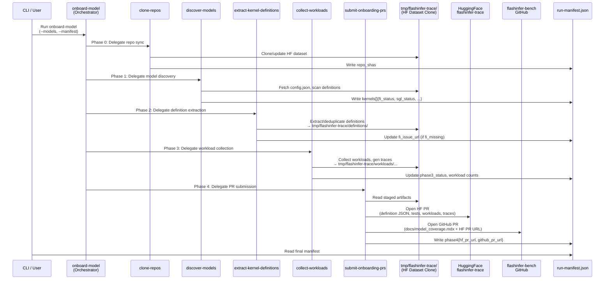

# [PR #422] docs(skills): split onboard-model into per-phase skills + PR checklist fix-ups

source: https://github.com/flashinfer-ai/flashinfer-bench/pull/422
state: closed | updated: 2026-04-28T20:03:28Z
labels: 

## 正文

## Summary

Promote the two inline phases of `/onboard-model` into their own skills so each phase
can be invoked, debugged, and resumed independently. The orchestrator becomes a thin
contract that chains the phase skills via a shared run manifest. Also adds an explicit
fix-up table for when an open PR fails the PR Review Checklist.

> Stacks on top of #421 (HF-only trace dataset alignment). The diff against `main`
> includes both that PR's commits and this one — please merge #421 first; this PR will
> rebase cleanly afterward.

## What changed

- **New skill `discover-models`** (Phase 1): candidate-model discovery + kernel
  inventory + `fi_supported`/`fi_missing` and `sgl_integrated`/`sgl_missing`
  classification. Writes the `kernels[]` array of the run manifest.
- **New skill `submit-onboarding-prs`** (Phase 4): per-definition worktrees + agent
  fan-out + PR 2 → HuggingFace flashinfer-trace + PR 1 → flashinfer-bench coverage doc,
  plus the PR Review Checklist and the Agent TASK.md template.
- **Slimmed `onboard-model`** (930 → 398 lines): now a thin orchestrator that chains
  `/clone-repos` → `/discover-models` → `/extract-kernel-definitions` (+ inline
  `gh issue create` for `fi_missing`) → `/collect-workloads` (+ inline SGLang PR for
  `sgl_missing`) → `/submit-onboarding-prs`. The run manifest at
  `tmp/onboard_{slug}_{date}.json` is the contract that flows state between skills.
- **Redundancy cuts**:
  - Removed the agent-prompt template that re-stated Phase 4a/4b verbatim
    (~50 lines).
  - Trimmed the agent TASK.md template (no longer re-lists checklist items).
  - Dropped the Decision tree section (overlapped the phase overview table).
  - Dropped "Running sub-phases in isolation" (each phase already shows the
    standalone command at its heading).
- **New: "Fixing PR checklist failures"** in `submit-onboarding-prs/SKILL.md` — a
  two-table reference (PR 1 + PR 2) mapping every checklist item to its remediation.
  Calls out the rules: never close-and-reopen for a fixable item, never bypass
  `pre-commit`, never force-push someone else's reviewed PR without coordinating.

## Phase contract (run manifest)

```json
{
  "model_slug": "...",
  "hf_repo_id": "...",
  "repo_shas": { "sglang": "...", "flashinfer": "...", ... },
  "kernels": [
    {
      "definition_name": "...",
      "phase1_status": "new|existing",
      "fi_status": "fi_supported|fi_missing",
      "sgl_status": "sgl_integrated|sgl_missing|n/a",
      "phase2_status": "done|...",
      "phase3_status": "done|skipped (fi_missing)",
      "fi_issue_url": "..."
    }
  ],
  "phase4": { "{name}": { "flashinfer_trace_pr": "...", "flashinfer_bench_pr": "..." } }
}
```

`/discover-models` writes the kernels array; `/submit-onboarding-prs` writes `phase4`;
intermediate skills update their per-phase status fields.

## Test plan

- [ ] Walk through onboard-model overview → confirm each phase points at the right
      sub-skill and the table matches the body.
- [ ] Open `submit-onboarding-prs/SKILL.md` and verify each PR Review Checklist item
      has a corresponding row in the fix-up table.
- [ ] Sanity-check the `discover-models` output schema matches what `onboard-model`
      claims to consume (`phase1_status`, `fi_status`, `sgl_status`).
- [ ] Re-read the slim onboard-model — is the inline content (Phase 2a issue body,
      Phase 3b SGLang PR template) still substantive enough to act on, or should
      either of those also move into a dedicated skill?

🤖 Generated with [Claude Code](https://claude.com/claude-code)

<!-- This is an auto-generated comment: release notes by coderabbit.ai -->

## Summary by CodeRabbit

## Release Notes

* **Documentation**
  * Reorganized model onboarding workflow into dedicated skills for each phase
  * Added new model discovery skill for identifying candidate LLMs
  * Introduced PR submission skill for streamlined model onboarding
  * Updated workflow prerequisites and manifest structure for clarity

<!-- end of auto-generated comment: release notes by coderabbit.ai -->

## 评论 (1)

### coderabbitai[bot] · 2026-04-28

<!-- This is an auto-generated comment: summarize by coderabbit.ai -->
<!-- walkthrough_start -->

<details>
<summary>📝 Walkthrough</summary>

## Walkthrough

This PR restructures the flashinfer onboarding workflow by establishing the HuggingFace `flashinfer-ai/flashinfer-trace` dataset clone (`tmp/flashinfer-trace/`) as the canonical home for kernel definitions, reference tests, and artifacts, replacing the prior in-repo `flashinfer_trace/` layer. It introduces two new dedicated skills (`discover-models`, `submit-onboarding-prs`) and converts `onboard-model` from an embedded procedure into a thin orchestrator that delegates each phase to specialized skills via a shared run-manifest contract.

## Changes

|Cohort / File(s)|Summary|
|---|---|
|**Dataset Path Migrations** <br> `.claude/skills/add-reference-tests/SKILL.md`, `.claude/skills/clone-repos/SKILL.md`, `.claude/skills/extract-kernel-definitions/SKILL.md`, `.claude/skills/track-models/SKILL.md`, `CLAUDE.md`|Updated all user-facing paths, definition discovery logic, and artifact output locations from `flashinfer_trace/` to `tmp/flashinfer-trace/`. Removed internal trace-layer generation and reinforced HuggingFace dataset as canonical source.|
|**New Skill: Model Discovery** <br> `.claude/skills/discover-models/SKILL.md`|Added Phase-1 onboarding skill that fetches HuggingFace `config.json`, computes expected kernel definition names, and classifies each as `existing`/`new`, `fi_supported`/`fi_missing`, and `sgl_integrated`/`sgl_missing`. Outputs classification report via `--manifest`.|
|**New Skill: PR Submission** <br> `.claude/skills/submit-onboarding-prs/SKILL.md`|Added dedicated skill for Phase-4 that creates atomic PR pairs: HuggingFace dataset PR (with definition JSON, tests, workloads, traces) followed by flashinfer-bench PR (docs-only). Includes worktree management, review checklists, and failure-recovery procedures.|
|**Orchestration Restructure** <br> `.claude/skills/onboard-model/SKILL.md`|Converted from detailed embedded procedure (Phases 0–4) into thin orchestrator delegating to specialized skills. Phase overview now maps phases to skill names; manifest contract specifies `repo_shas`, `kernels[]` with status fields, and keyed `phase4` per-definition map.|
|**Definition Extraction Update** <br> `.claude/skills/extract-kernel-definitions/SKILL.md`|Removed inline PR submission logic and GitHub worktree procedures. Now stages definitions only under `tmp/flashinfer-trace/definitions/`, with explicit prohibition against adding JSONs under in-repo `flashinfer_trace/...` paths; delegates PR creation to `submit-onboarding-prs`.|

## Sequence Diagram(s)



## Estimated code review effort

🎯 3 (Moderate) | ⏱️ ~22 minutes

## Possibly related PRs

- **#224** — Modifies the same core skill files (CLAUDE.md, onboard-model, extract-kernel-definitions) to relocate the canonical trace dataset to HuggingFace and update the onboarding workflow to use `tmp/flashinfer-trace` paths.
- **#234** — Updates skill documentation around workload collection and the clone-repos flow, shifting paths to `tmp/flashinfer-trace` and introducing/refining the dedicated collect-workloads skill that complements this PR's orchestration restructure.
- **#136** — Modifies the same skill documentation files (add-reference-tests, clone-repos, extract-kernel-definitions, CLAUDE.md) to update dataset paths and outputs to use the `tmp/flashinfer-trace` HuggingFace clone.

## Suggested reviewers

- yzh119
- Ubospica

## Poem

> 🐰 *Hops with glee through reorganized burrows:*
>
> The warren once nested in hidden `flashinfer_trace/`,  
> Now blooms at HuggingFace, that grand open space!  
> Skills dance in sequence—discover, extract, submit with flair,  
> Each phase knows its task, none stepping elsewhere. ✨  
> *Phase-based harmony replaces tangled prose!*

</details>

<!-- walkthrough_end -->


<!-- pre_merge_checks_walkthrough_start -->

<details>
<summary>🚥 Pre-merge checks | ✅ 5</summary>

<details>
<summary>✅ Passed checks (5 passed)</summary>

|         Check name         | Status   | Explanation                                                                                                                                                                                                                                                          |
| :------------------------: | :------- | :------------------------------------------------------------------------------------------------------------------------------------------------------------------------------------------------------------------------------------------------------------------- |
|      Description Check     | ✅ Passed | Check skipped - CodeRabbit’s high-level summary is enabled.                                                                                                                                                                                                          |
|         Title check        | ✅ Passed | The PR title clearly summarizes the main changes: splitting the onboard-model skill into per-phase skills and adding PR checklist fix-ups. It accurately reflects the primary objectives of extracting phases into separate skills and improving PR review guidance. |
|     Docstring Coverage     | ✅ Passed | No functions found in the changed files to evaluate docstring coverage. Skipping docstring coverage check.                                                                                                                                                           |
|     Linked Issues check    | ✅ Passed | Check skipped because no linked issues were found for this pull request.                                                                                                                                                                                             |
| Out of Scope Changes check | ✅ Passed | Check skipped because no linked issues were found for this pull request.                                                                                                                                                                                             |

</details>

<sub>✏️ Tip: You can configure your own custom pre-merge checks in the settings.</sub>

</details>

<!-- pre_merge_checks_walkthrough_end -->

<!-- finishing_touch_checkbox_start -->

<details>
<summary>✨ Finishing Touches</summary>

<details>
<summary>🧪 Generate unit tests (beta)</summary>

- [ ] <!-- {"checkboxId": "f47ac10b-58cc-4372-a567-0e02b2c3d479", "radioGroupId": "utg-output-choice-group-unknown_comment_id"} -->   Create PR with unit tests

</details>

</details>

<!-- finishing_touch_checkbox_end -->

<!-- tips_start -->

---

Thanks for using [CodeRabbit](https://coderabbit.ai?utm_source=oss&utm_medium=github&utm_campaign=flashinfer-ai/flashinfer-bench&utm_content=422)! It's free for OSS, and your support helps us grow. If you like it, consider giving us a shout-out.

<details>
<summary>❤️ Share</summary>

- [X](https://twitter.com/intent/tweet?text=I%20just%20used%20%40coderabbitai%20for%20my%20code%20review%2C%20and%20it%27s%20fantastic%21%20It%27s%20free%20for%20OSS%20and%20offers%20a%20free%20trial%20for%20the%20proprietary%20code.%20Check%20it%20out%3A&url=https%3A//coderabbit.ai)
- [Mastodon](https://mastodon.social/share?text=I%20just%20used%20%40coderabbitai%20for%20my%20code%20review%2C%20and%20it%27s%20fantastic%21%20It%27s%20free%20for%20OSS%20and%20offers%20a%20free%20trial%20for%20the%20proprietary%20code.%20Check%20it%20out%3A%20https%3A%2F%2Fcoderabbit.ai)
- [Reddit](https://www.reddit.com/submit?title=Great%20tool%20for%20code%20review%20-%20CodeRabbit&text=I%20just%20used%20CodeRabbit%20for%20my%20code%20review%2C%20and%20it%27s%20fantastic%21%20It%27s%20free%20for%20OSS%20and%20offers%20a%20free%20trial%20for%20proprietary%20code.%20Check%20it%20out%3A%20https%3A//coderabbit.ai)
- [LinkedIn](https://www.linkedin.com/sharing/share-offsite/?url=https%3A%2F%2Fcoderabbit.ai&mini=true&title=Great%20tool%20for%20code%20review%20-%20CodeRabbit&summary=I%20just%20used%20CodeRabbit%20for%20my%20code%20review%2C%20and%20it%27s%20fantastic%21%20It%27s%20free%20for%20OSS%20and%20offers%20a%20free%20trial%20for%20proprietary%20code)

</details>

<sub>Comment `@coderabbitai help` to get the list of available commands and usage tips.</sub>

<!-- tips_end -->

<!-- internal state start -->


<!-- DwQgtGAEAqAWCWBnSTIEMB26CuAXA9mAOYCmGJATmriQCaQDG+Ats2bgFyQAOFk+AIwBWJBrngA3EsgEBPRvlqU0AgfFwA6NPEgQAfACgjoCEYDEZyAAUASpETZWaCrKPR1AGxJda+BogAKRABreA8PRABKLkRuD3V+DAF8Z1owZkUSDxQMAh5KMG5YNEQSe1Dw5ABqazsGWFFg+MRcSAAzeAAPMGxuRAMAOUcBSi4AFgAmCYMAVRsAGS5YXFw+jgB6daJ1WGwBDSZmdbaPEoQMNoLtY9PEc8uKMBGMevXubHD1yemZ0oouWSyeC7TBEAwAZXw2AoDDKAioL1gMQqHgA+rF4rhUfgkikKLR4BgwdBnKRWvDMPUuMxtBgIbhqNhEFx8NwyAYAMIUEjUOjoTiQCYABgmADYwEKxmAJgAOaAijhCmUcACsAE4AFpuBDIWyQEidXBUMTIXANHLxcg8YqlZD4NqQdY45KpdKZbKEvKlbjOXnlMIRez4fVoerWkplBiYSAjHISfDBOgAGkgSgE2CIpFoKcw9G5DjY9EJSjZGCUuQ8sg0kAAkq1PRRFNhYaaAO7B8it/2VHxIJhSR4ZJSBgJWG1lACMkUgeTZFDa+AozEYufgtF5buHqb7+AHshTiYo5A9GCkuUX+/QZfa8HWiCI2QYt0Q8A6UfEOKv9DyrYo6jKZplBQ2BYDSGCvtIuAAOTIIex6IAA2gAuugFBULIADcX72HszDqGAzp4gSRKFBQyCjuOkBjNOeQMNyfpzmASgdOBH5YO2FDBEaJDSCmbTRlCrRoKQuSICmrJkLUgqQAEAASGbbESABioZlCcZyEg8YBGqp065lJE4yepdyaQUzxhv2yikKmfiRDm16Ek+2BKOgUk2CQEjwCQXYcg0DBNEgrRxEyV6QAAgiJrTQGF4IANIaMw34kMwcS8tWhGukOWQoMgiDxKwfJ5GgM7nPwMINC0VAEHw9S0oSRCOk+OIkGA3LcPgyCAEmEjoEoglmDu6XWOgaOliGAcFZExJAseo8A4uRrY7BahJlEgDiRvRbHtIuN6onhiAvkS07desTDhKIuBgBxTQpLQC1LYSlplOCADi8yglJC58PeaL7YdRDHY6DgCHhl0Zfi9WkYgWGAZAwGgZgEEtPyM4pU6uKpKiADeeUZgAvtj640HjGhCIgn6oLDRQRgouTGpoMDmnqaARMG3K0M20hw3QIHrrkNkMI47DUHNWABLwLDcK0NApacNAphzcTwO+fJKAwSCizO3IkCmbU8jQ9D1I0zTSyNenXmgtB3a5ABESldPVUlG/5JvtNoHjQtINszu22kqF43MPGQsI5DhIP4eDxFEFD6xxTW8zzAl37FK0NJ9IwfkBcj/7MKabPJXQ8Ai5+wFeMg+lRpU/B4Dw+DxOrXMBCQGhEBoCsdvgrRNaUYC5q1JASVgX03p0/urTLYk2ZAGCdzGsg+gdPDcmAhyg+30+z19sKFEysD8IBZFQdznneXytjIItZqCQoi7EcXGCRNWcCRsURJlC0obBHaWAENw/AOnqMwkxDJySUgRDAlYtaqVTNQCMQl4hEAwGwXI5s8wkAAI7YEgqaFOkAgETEMrGNgFAsw3jIpocwlgOQsFBpANgB1hJcwLDSFwRgoDUNYAkQyvQiZc18P4O8KJy7Xg5PMMKMwAAiABRJOM584nAuiVMoskwE4kgaNMoRM4GQFOLIa+ARuQZCkDkfu7V2i3HuJQVEGieDUFgCmBkJCSDSzRsZSxjwNHrHsvQGkiYpITEgAAXkgComBDJSi4BTHqQywTzJ736owgWj8DDsJoQkAJ8BZYF1Eko7s2QMTqC4Jba2vV+qbiyMI+gwNQbgJdBDEivBJ76Typk7+dS0hZRPEVLAi4jaVWoDtM01BIBMi5rDeGdDEaXGRrOEouUGQ0A0CkyAHDaEAGZuZGL4b0euvJ6CMP5hLFKuB1gy1SjQSZNA/wswcX+XOMAYrxUSt49AVscFlFsCvTOrsOjdF6DOMelTuZyz5EQbAa5KTNzYWAQwBgTBQDIPQe0OACDEDIMoA2CgCq5C4LwfgwgLqSC5nIBQSgqCqHUFoHQ+g4XgCgHAVAqBoxoDwIQESGK+Sr3YFwKgXZmHOHkCSpgZKVBqE0NoXQMKjC0tMAYA4pxnIkEEQGRA6xin9yDi8FqNAWiqrjgnJOHADA2xNQYCw4UaxovIFVPk/KXD/wzqCaQBhn4CyFrkQAmATIG5Jqls25uRiAvPYZKmBxD+FQu/BAbRMVtEbMuWGhJTHBgAAZuNMhQaxxolXJp0WgPRNc8iw3kpmeqKkQ5aIiYwDwzUUbJtwK4ix6btJZvWMm6sYVwgjL+GAfi6siS2LNMgYezFCSzU/KU3clBLwGkCpDHVrQ+qYHAkSBxkEbwB0Eu8SJ/qLpBrovrUWLzuCyHnfqToog8CawCI5D2Ucz1oCyUC0RNZIDXROPgPl4FuBslwFECNIzuC8O/MGdqno5GQDrQ2jSFwCieI0PBttjMyi8EoBg8FL4dXBrEJrVA3JPKlGA/YBZAFcFFqUlWmtlNzRqPkLAFgakdojtYqLIFPrUNapnNg3WJBUp9oalTP8O05mOClprIZrRU2NpgxmzxOb4hSGQISXJbUOrqAvEsgwkBKHhQ8Fc++edclq1OFVFjDqDTtQoJina7wBD131LkWazqoADAAPIDCkdpgAslMtd9sA5hQwCzWQAAvSgRh5grWQLVN+tAuBVAnDKdYYAEtGCkS0TJezSVAQ8l5Ls00voCk84XRwxrTUpNlfKllShlWVFOtW8gSa9WxXjonRKRqTU2zNZYMKlr2U2qqY4Fh8hkXRdIP0V1IQAxuuQQszWJlo3vLPWyMQfJN14CHTtCa2QmNjowKx6a7GQ7zqHXG1y1bK4QbTdJzNqlW2vsXKEftBIA3VXkLzSgl2pNaTiXdwt5omrkHoJB7gNxoNaVk2E7RKmMPqdrPA8m3NeNjPNEoPqf4RhA/rSDq74OW05qYLkdgRHgJiE9jy5Ku5HYCbmnwXR+j+GTy0esTpk9WTiBpB4FeOIOhEEnjYKRYUJGeakagnIRomx8dchkbkkAiAIg+M4cS3BtLzxaouLyhP6DPd3faxcRBEbBfvgoAcjstupmmqOraAApcEbnJ7HtPWx7kHHjspgEBGJ6QYPZsUnogRG4hQv0GutWy2kAbdufmJPYPt17BoEuDQPbi4ZDVoEE068jFo+h48izKBLZqw1kJ3Lo3pRsOfh9IO/9PDMuhiYPUh88g8g0lwGGWGnZq6rBrud/TGntMdr0z78DsMjO+gH8i8zi4rN8Bs3Z9gjn+jObcx5gwEXyBRdflmOLE4JxJbWROVL6Wm+csyMfXL+o2gFa4EVgkJWOvQrAEYSriqasRHWBOgc5SX/6ta7F0rnXzU9atQ5QGycF1wdFG2dTCjeVcjb2TTfwKBZxzUm07X4XdWllwViFEFfC8nLmsHHGS0SHaUdjfWrS7DyDXFnzaHkCjDLAhQuQTk80nnjzDGLUUiIDLTKGTQJx51JnJgwGTRTEOC3TKHMwuj5DNx2y2kC3oUgE8mKjrWNGCA/0QBzS+mYAVzT0NmfFfHkB5DDAkM1hKAgxnXSyJBzQkGQGTU7EQyUh2ksO8hzX0PmhTASGdi/kgCUgsQLweBQCyRmyNzQAkHdhUDCHUHkCUwwPVjfAgyx1BxMmkzuy7wHwCArkXHzHahoP7WOxomDCfDmW0PQAsI6HRF6AswNhzVsKKL+nqn4KUSHmhAPgzkaGQFenen7UWj/H7WHlTXgGKO/QnzoAcIt2Y3mnA1yIOnyMMOTR+lRE9BICLzKJkIsOmKqNMJkgiXEH7UsLVRUIqJ6JWKIGTUfjh3NxYi5mfS7UYVB15xzG5kwXgHZiXlQzuIwy5lcJNhuL9yyURwn22iXGoBeVhnDwGEmXAmmQXSNhpFfT/BWDIHWCr0xVkIgwgDAiRlwBqJvWckdmIWslKDAjDSBRQz+ECK2mRRBUeGplKBvCyDuh7y6x0371Mz+00VEGM30zM06FKNWynz2Bnwc3ECc0gFc3cxkjbxQL8K2g6C8CwhniyzeB5OVnCisBfWHxMxGPANoEiC8x82Rj8zKACyC1CwoHC0i0dRiziwmDWQmCSyFH33Z0y2FWyxPjy3Pwny4HmA/V/zvwf1yKfyQJfxGnpnGkoGPCmhmh91jmawNTa09P/163RX6xwhAOGzAPX2dVdTFKJxnlINJGcUWxYNLWgUkzByuFvBx1gyzQcNgUrQBzKACGB1iPcWbVu0OIKNyXJgDjozYF+MgHEKGN232xBX2Us1fFDF/WrAkR5iVnfAMOvDWyCjsXLhl3hL5Br1vnqkgQCFjRYE+2LJkxbUcL23WHgw0BzTyHrLLI8X3L7PDOPMOKfiZjsGqTWhwz2yNGbAH2HkYgPMgBenUHkgEFqHIgxLvWum4handwI1sSoHOmyD1H3X8OvHTDLEtAaiBNOWwVfz8D/WcGyy2X2WvDalOFhCDyWmKlfl8HPy4DNFQD9MSEgV/H/GQG/KBLF2DFhi72yFCQrWcQo3IBTFbAQADnPm2nCA/VyWoJxGVhz1wF9j1HfS7FRzongAx1DmTUjg/xzVHDsACTyHzOUmgQ6HISiTsEMjPIvKeGDlgB2L4H4QA14W/krCOLrHQFZleWtmjHM3rgSAlgQDFQMP10JGRmKUdmYttwGGQHez4CLLiIeBu1hCPIQwHVgEUz23IJ3JirMksrbWlTpL7wxUZLYpRxZJH1MzHw5P6KRW5NswVNn35Pn0FMXy1NBN8zCD1MC0rENONNX1NI30gCqAISSwAHY1lbSMtMUHST9vIz8L9IAr94Ab8ysIB785UfTqs/TVV1LOkIyWtDUYzus4zrVMs7VkyernUDB3IGLMM21VqlV1r0Z2kP9tqozaAVDTtiolAGRWrswTFJTVpfDhYSSAFxxkAhRABkAjGFYtcmop6XKkgiqkXDvGWxKmGWHDmN5GQF0L3gpIAmDCUAJBViqSEWrDHBpknQoCdJylpgHBjTeunmcBM2MUABwCF6FIDwdYCkREeqQAXAIsMtoipwwe5UVaKGRbMdZsIfQqA2Arl7s69KaXxZYsC6A1VaAhAmRMUAgZ4RbIFk0IA4CKB8dJYRY1BMR5B9IdawBJtldM8XrW0IAnzLpGlBi0d4BRN5ojjXVfqN48sUobR4BQscC7gcK8wQJ0htSu4cRRoBQSbKShRzcvB9dMMVN7BZAXhHZ9JLquZk0VN0QbRTzCqygUSwSsJo7Jw460bMNOltw+oybZA6s8i3wjdPQU0ttEIkIc12A/xG5k1saJx0QFkmQajui+7GRlCUwpiHxh7cAB7Ihi7KIAk+tG7vVppJaVzGxeYIN1gAzRygyjxJoDzR6iNhIQrrzTNIroioMMrLzbt97W0XkA01zNiii1osFURoQPBrLLs9jnzTDZ6aYNlraFBzpS8sBUBUaE7CoU1To64vAxpraD7L495x7fpv6DjIByKvB6BETHoVpIAWiPp2j6oqhbAXlC611lyNsorsa1lJ6B71gAGmAQJf1f7KSIa9QnzxiKYmKshy6IGN77bakiJIZHbX0EAwx2p3gQVkBSHkZu7xwxgc1DDiovyT7PxBARAxBqx3onEYxzs3DkVeAad9RmAMc8al4/AeZ8xAAUAlAu1jVUih0XwG2AYGMtpgTxOTeMCkZ0wJfE/DApeQOWlhKGCE41ll5EsZws2UnXwrQSR3oBJVA0JzIkH3+1SOkHSLvSmNwgjgxjryhgUdnIaOxryWm3YEQHvILrDvsAhOKgNAfTiFWgisA0yzyB9RgaCgKDNyQZoeUOwmKkTFkD5FkYjHkcmW4DvpanhnWHzCFhjBIGKE8h2lAekCUpUqUyuXuWRUtu4DTo8HoloFkDAFgOahzRzhStyWkYoWlX/103ypGKZPN1yNVL23ZM5Mqp4HlIYHs3EDqrYUFJrQCAzNyHvnAUgXAKiA03NW82ap1NavCnapCzC2XxNPVM3yFDVCS1FCFBVFGsP0NmPzw1P3y1dJCXgCIFgE9PK2WsfzWqETvCybBhyajhji/12tv1jMAITOOodTBaMAL3Fw5j9WKhgOpdutpf4cjiEbIieu/0QJRGRu3WHkxsgEZr2dkB5sroPIEM2i5mZQIDwk+Z9HuIdVKEwVnxz3Pi4EMuRkHhwL0rYOgW4taD1AQZcuyG5DuIeMddQnEF7V/RklCrc2419QAkgjdw9xwd/DQG/Q+3bMvRxH4oexD3oCBPmBTD93jzIHJiSds0EA0OsBinBCkQkRBZ0MCOyA0SiBTCZEdmMI2IaggqyBwdjYHwEskkJPYBhgaB6VLBwPMriR/L/L2CknEzoUUEVocvkCOYEU6VRASVICTk6HyaLBeFvWRzUg+GyDmHmAdSLQUgLJDj1DWfNGSH2fKZKf5giPHagpZi8GyBsZ4kYE2k1mHmSDNG+KaXsZGHmcMeaQZFYKSsnifB5AwH+Tj2luEsHn8ZBNRIg2xpGZzf8jsr9FUOGXvtltfb3j1C3bKeOJZgRwlk8lR1cj1AJamo8eRhfc7kw5sCBQ8o5K8sCdFodV+TMeIs9iApXcxP7XeDiIagXFEtbB6D/lXnUG9TsQ+yGSwAfURUdlI9bCP04V/Tsh4A9mQDBQhQ42Hn4jCE9iqbIGcDmnIjAmwHNbqCfc/H4nCHd38nt2XhE9aG049hl3QfqlF1hmuoVWq2ijiiTlPOSnOUjAjvYFpOuYZLufzoedZNHwdHH0sy5Peeqs+dquwN+YGCms9uKToC4A86q1FZVTpfDgZcIIaSlZZcSk0plIdLlMS8VJrFOVV3oFqvkBVP001LpKhZg91LhYNMRZX1eNTNiz6rWUGqFGtJxftPxZyymqJcs0v2K2YApaWu9M87y9q1GkUJZ2ldZdNXZYXsxS5ZG1TPGxRz8FQK9UePdfQ0YuwhLsgA2UZu/NreDhIB5tcMXLKGXMI1GXPuxy+3LOvpUcPJOdfJ5CRQdGivcTiqVRvsQ1dUCrfOAYobhhAmXQamTTq2akawUZl3M1zF4eArKETB4yp3NDtfYNzxai9ZrMYGhGdwZg7TdYO2d2Is/rLANqcDLCBUAFByZnFB0My3TWDiO9CJlmUlwHZJsoUUwHsPMKhx6c+NnIJyO9WGB76Xz2qQtO4x0l8FXANVx9jqRAL5RoIjHjEL7rG5p5gzIfYqy3l5iqsqBL3k75lLhfdzJqzr2F/Ujq3r5FgbuLRLMAUUcb8aybimmbgUd01sRb2VURcRaRbbv/fajlo6wbAVblo77UModTlyVAT78DQxSddKyHiHRRkBjAJNSHStXRD7fSeH0Hk4nBsnws8y64cyjRBRxbCS8CC7GxR1/PesOmCXTOmItvvHVs9ivwHPankd9a+wOjD4NBS2Tegkbdch3JGxeIS4BgWQIDmW4IeS0Y9gD7QuP13x0n8jL1pO4KHAwQxGT8CHptOJHNPUEdmjJDq6hnZnd0WdsmxhBdmo/SAXwUy5IDGO0RmrMSPDSUs0uaAZhQB5p7dRYd4FOp83h4k4fc/fFygjjX6AtZsn4S0ME0cRkgke1vMMnNmqYyQp2qqUfgD1IE4h/+ouCSE8xnCq4qmDQSEnWU/6sgVcbIVVIcXGb4YuYjNahHTGUqXp+0aXLsC5jnBG5oAquRADzRaA8YgUZyEFHLzZKrk68lYM9ozVXifh9okVD+BkSIAKDCUn4OZJQDrZF900UPO7IIS8AJ5pAimLhvYLoAaYtMuVC3myXuYtdouS2e3tZg+ZfM58qXRqu10qZdcveCLI0ki26ooshuYwHfEHwMBpY7SIfFyHJ2mrEs5qC1TrOVlhTwp7MYPFFGynjITdsUAoXlImSGxzwss5KMVFSklSGACh9nGYndFRByc6Aw9SzI0OMB0pIAKoMYOfjaBosZQKoNZOqBlCygBAQoCcAIDaADDaAE4WgAIEGrLCSAQoNZKKEGoMABAlpQaiqB6EyooALQtcIgHaFTd5OtAVEIih6EFCUMe0SgKQFnaZwzhH8boTSgMBYxNMkAG2EgFsAAAhXRnQFWTsArAHUA2DbEtZ4cdY3w34YgBcwDg/wVsMgJCLdgRAYRkAH4QziND1RqEA4RhHy2DIsxwQxGVEVjDxhJhYRDpGwKKnUAAB1RsDQCsAUB3AuALwKiMs6lBKRmIm2HcChAeBaAgIvwMEFsAcjoR3IrEWuBsAgQJEfgEkR0V5y+RGgqIt8hiMlG0BpRGAVkV4CVH+QVRwENUTbAJAaiZRyzP8K7QwC6jggYo9ERKJtj4C6ANYA6FgkQDyjURJqO0bcFwBWj3IDgXTIgFREIRvhmIr4ZiLDE/DXCAwaTu6InLO0LRKyTODbAlHhjeR/dAMVRQNHJiwxNsTypgHvjuirR/oaNvQFSRKAaRFKXAOdwQBkswAXgKQPklT72pUA+nUWrQA0BJjgx2YrKO6NbDOBUeHY8MTyPVyKQWYVoqMWwHdGKVzRbETrOGIpGdjQxg4m2JGOjFcAbY2ol+MqKzE8iP4U9dMVrCwTbifhuYwLDOLXGuoX+ngSMF4GcCQI7UftNdpMiUxgsYgSsFYCTzKCbV3QxTJuvkHJKURZ++kYKv2jgrfJAoI8ITjh2co15oQvISBK0wuiLYDG1QtRoSmAFlVI6jsbGilS9A8YR878IRNhEyQEdHYJHC4bLnBR8xYQ7Yo8TbG7FrjexR4eqAOKXH30Lg2vbkDaK5Gdihxf4EcR4DHGrifh3zdkZ2PnHhjFxKYlcROLXGyj/AOI/tHiKsgkAWJKY3cUyH1GHieJx4+jnmLPE/CBgwYNoCBER7bR16R7F+E6noC/UDM2eD2H6GxEKjjcyk6sOCFCDfoQqWFBSQ1Dnabj/INE7STbHzB1w42GAd0QyP/ACxKo9UYgeaGMkvAB8+xJRPGmDB+5xAiASguJV/7WQzQ+YOjAKICmDifh9En4YxP7G0ThxhIUcZnHHEqS1xjkmKbOLDHiSwxkk7MdJLqk/CV8iYegE6PWhr4txgU9SfuNVG0STx+YtcYWK2Z8gRgUYb7jKQdFFhnRXMeTjLgXDr1h41FZABI0Z6msWghUpcSVJthlTmJFUviVVIEk1ShJ9owkD1L6kuiwoB0RwTNiamYiWpIYwKR1PdEuYa4yKcEEwDZAJinUA0vUbROGmaS1RKY8afpJthTT3JbIOJqIBZSUkFpt0vkM/RWmoYzJ14TaTqHeadpLukEA6SmKOknSiQqk7MZVPaqCSZJPwwSC5jaD/SJIvkYGY9NtCIAXpYk74UhE9ElBcAtgWMUpQtHui1Qg1NUGgDWQMBaA+wtoGqBlAMBJhwoFYSqFoCTClhbQBgJsNFBrIxgE4HkDKAEDLCVAYwWgAwDaATgVQg1UUAwCFAjcsWsshgKKAmAmy0AE4FifaL5m2ANx7omUBLImCOynZYwKMG0FoBYtRQAgFUG0FFBqgpgPEHWfMJVmWySAE4f2YNUGp6y48MoIULQAISigU5osniAwAnBtABAWwoUG0EGqdY8YvQiAI8QeFOJnhTRa4deBpQFCWUBAVED6FGST0SAXQ1oB8KxgeyWgVgZGXQDCi4B3ITpYEWkm9FQhcgkIoUNXKOHFDO5o8nuc3JLEwogAA=== -->

<!-- internal state end -->

## Review (3)

### gemini-code-assist[bot] · 2026-04-28 · COMMENTED

## Code Review

This pull request refactors the trace dataset management by moving all kernel definitions, reference tests, and workloads from the local repository to the flashinfer-ai/flashinfer-trace HuggingFace dataset. It updates the onboarding pipeline to a five-phase orchestrator model using a shared manifest and introduces new skills for model discovery and PR submission. The review feedback focuses on improving the robustness of the shell commands within the new submit-onboarding-prs skill, specifically by ensuring directory existence before copy operations and correctly managing file synchronization between the main dataset clone and git worktrees.

### coderabbitai[bot] · 2026-04-28 · COMMENTED

**Actionable comments posted: 7**

> [!CAUTION]
> Some comments are outside the diff and can’t be posted inline due to platform limitations.
> 
> 
> 
> <details>
> <summary>⚠️ Outside diff range comments (1)</summary><blockquote>
> 
> <details>
> <summary>.claude/skills/extract-kernel-definitions/SKILL.md (1)</summary><blockquote>
> 
> `535-555`: _⚠️ Potential issue_ | _🟡 Minor_
> 
> **Align the report section with the new handoff model.**
> 
> Line 554 still asks to “List PR URLs opened,” but Line 535–548 now says this skill stops before PR creation. That contradiction will mislead runs/resume logic.
> 
> 
> <details>
> <summary>✏️ Proposed doc fix</summary>
> 
> ```diff
>  9. **Report results**:
>     - List new definitions created (grouped by TP/EP config)
>     - List existing definitions skipped (deduplication)
>     - List kernels shared across models
> -   - List PR URLs opened
> +   - List kernels ready for `/submit-onboarding-prs` (PR URLs are created in Phase 4)
> ```
> </details>
> 
> <details>
> <summary>🤖 Prompt for AI Agents</summary>
> 
> ```
> Verify each finding against the current code and only fix it if needed.
> 
> In @.claude/skills/extract-kernel-definitions/SKILL.md around lines 535 - 555,
> Update the "Report results" section to match the new handoff model described in
> "Hand off to PR submission": remove or replace the "List PR URLs opened" item
> and instead report that PR creation is handled by the onboard-model skill (or
> include a placeholder like "PRs to be opened by onboarding flow" and reference
> the PRs that should be opened by that flow). Edit the "Report results" bullet
> list in SKILL.md (the "Report results" section that follows "Hand off to PR
> submission") so it reflects that this skill stops before PR creation and only
> lists artifacts produced locally (new definitions created, existing definitions
> skipped, shared kernels, and expected PRs or checklist to open downstream).
> ```
> 
> </details>
> 
> </blockquote></details>
> 
> </blockquote></details>

<details>
<summary>🤖 Prompt for all review comments with AI agents</summary>

````
Verify each finding against the current code and only fix it if needed.

Inline comments:
In @.claude/skills/discover-models/SKILL.md:
- Around line 166-182: The fenced code block that begins with "Model:
Qwen3-235B-A22B" is missing a language tag which triggers markdownlint MD040;
update the opening triple-backtick to include a language (e.g., ```text) so the
block is explicitly tagged (adjust the fence that wraps the "Model:
Qwen3-235B-A22B" / "HF repo: Qwen/Qwen3-235B-A22B" block).

In @.claude/skills/onboard-model/SKILL.md:
- Around line 50-51: Update the SKILL.md text where `--submit-prs` is documented
to explicitly state how it alters execution: mention that Phase 4 (PR
submission) runs only when `--submit-prs=true` and is skipped entirely when
`--submit-prs=false` (include a short sentence like "If `--submit-prs=false`,
Phase 4 is skipped and no PRs are created or submitted"). Apply this
clarification at the current `--submit-prs` entry around Line 50 and repeat the
same explicit skip behavior wording in the Phase 4 description block around
Lines 275-285 so both places clearly describe the conditional execution.
- Around line 79-80: The manifest docs use two different tokens for "not
applicable" (`n-a` on Line 79 vs `n/a` elsewhere) which can break status-based
branching; update the contract to use one canonical token `n/a` for both
fi_status and sgl_status and replace all occurrences of `n-a` with `n/a` in the
SKILL.md and any related phase docs, and audit any code that parses fi_status or
sgl_status to ensure it expects `n/a` (or accepts both temporarily) so
downstream branching remains consistent.
- Around line 171-173: The fenced code block containing the JSON fragment with
the "description" property is missing a language tag; update that
triple-backtick fence to include a language identifier (e.g., change ``` to
```json) so the block is recognized as JSON (look for the block that contains
"description": "... See flashinfer-ai/flashinfer#<issue_number> for kernel
implementation request.").

In @.claude/skills/submit-onboarding-prs/SKILL.md:
- Around line 83-92: The markdown code fence containing the worktree layout (the
block starting with "flashinfer-bench/") is missing a language tag and triggers
MD040; update the opening fence to include a language (e.g., change the leading
"```" to "```text") so the block is annotated, keeping the same closing "```"
and leaving the inner content unchanged.
- Around line 112-118: The instructions for Phase 4a mix a working-directory
note "Inside tmp/worktrees/trace-{definition_name}/" with root-prefixed commands
(e.g., cp tmp/flashinfer-trace/definitions/{op_type}/{definition_name}.json and
later commands in the same block), causing path resolution errors; either change
the cp/mv commands to be relative to the worktree (use
../../flashinfer-trace/... for sources) or remove the “Inside …” note and
prepend a cd into the worktree before running commands (ensure consistency for
the block that references tmp/worktrees/trace-{definition_name} and the commands
that touch tmp/flashinfer-trace/definitions/{op_type}/{definition_name}.json and
the later block around lines 138-144 so all paths resolve correctly).
- Around line 123-144: Update the PR2 flow to treat fi_missing as an explicit
conditional branch: modify the "Baseline solution", "Copy workload JSONL and
safetensors blobs" and "Copy eval traces" steps so the copy commands (cp
tmp/flashinfer-trace/workloads/{op_type}/{definition_name}.jsonl ..., cp
tmp/flashinfer-trace/blob/... and cp
tmp/flashinfer-trace/traces/{op_type}/{definition_name}.jsonl ...) and the git
add entries for workloads/, blob/workloads/ and traces/ are executed only when
the run is NOT an fi_missing flow; mirror the same conditional in the checklist
items that currently require those artifacts unconditionally so fi_missing skips
copying and git add of workloads/ blob/workloads/ and traces/ while still
creating or noting the baseline solution as appropriate.

---

Outside diff comments:
In @.claude/skills/extract-kernel-definitions/SKILL.md:
- Around line 535-555: Update the "Report results" section to match the new
handoff model described in "Hand off to PR submission": remove or replace the
"List PR URLs opened" item and instead report that PR creation is handled by the
onboard-model skill (or include a placeholder like "PRs to be opened by
onboarding flow" and reference the PRs that should be opened by that flow). Edit
the "Report results" bullet list in SKILL.md (the "Report results" section that
follows "Hand off to PR submission") so it reflects that this skill stops before
PR creation and only lists artifacts produced locally (new definitions created,
existing definitions skipped, shared kernels, and expected PRs or checklist to
open downstream).
````

</details>

<details>
<summary>🪄 Autofix (Beta)</summary>

Fix all unresolved CodeRabbit comments on this PR:

- [ ] <!-- {"checkboxId": "4b0d0e0a-96d7-4f10-b296-3a18ea78f0b9"} --> Push a commit to this branch (recommended)
- [ ] <!-- {"checkboxId": "ff5b1114-7d8c-49e6-8ac1-43f82af23a33"} --> Create a new PR with the fixes

</details>

---

<details>
<summary>ℹ️ Review info</summary>

<details>
<summary>⚙️ Run configuration</summary>

**Configuration used**: defaults

**Review profile**: CHILL

**Plan**: Pro

**Run ID**: `2ef19f22-9d43-40f1-8a6b-e029f6af938b`

</details>

<details>
<summary>📥 Commits</summary>

Reviewing files that changed from the base of the PR and between 91cdf0ab40e3c1a8ea3785825a7c760b5e95463c and 54fff0985359828b01bf54d1db7dbe0367cb3275.

</details>

<details>
<summary>📒 Files selected for processing (8)</summary>

* `.claude/skills/add-reference-tests/SKILL.md`
* `.claude/skills/clone-repos/SKILL.md`
* `.claude/skills/discover-models/SKILL.md`
* `.claude/skills/extract-kernel-definitions/SKILL.md`
* `.claude/skills/onboard-model/SKILL.md`
* `.claude/skills/submit-onboarding-prs/SKILL.md`
* `.claude/skills/track-models/SKILL.md`
* `CLAUDE.md`

</details>

</details>

<!-- This is an auto-generated comment by CodeRabbit for review status -->

### yzh119 · 2026-04-28 · APPROVED

(no text)
