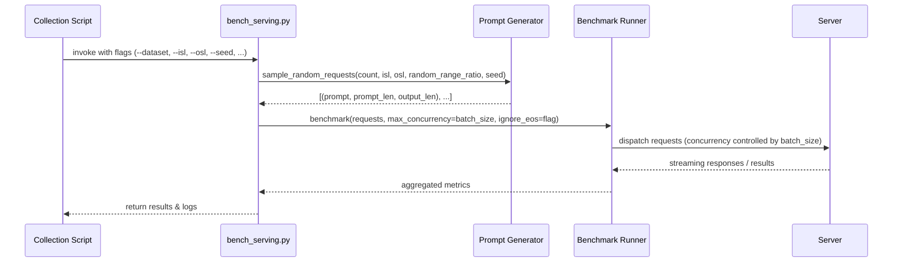

# [PR #423] feat: add synthetic random dataset ported from InferenceX benchmark 

source: https://github.com/flashinfer-ai/flashinfer-bench/pull/423
state: closed | updated: 2026-04-30T22:47:37Z
labels: 

## 正文

## Summary 
- Add random dataset ported from InferenceX for collect-workloads 
   - Generates random, synthetic dataset with ISL / OSL specified 
   - --isl / --osl defaults to (1024, 1024)*
   - --random-range-ratio` jitters lengths uniformly in [ratio*len, len]
- Add sustained inflight dispatch, matching InferenceX 
   - Instead of sending multiple waves of requests, fill to specified concurrency whenever earlier request completes
   - No idle gaps between waves and new prefills overlap with ongoing decodes 
- Rename bench_sharegpt.py to bench_serving.py 

## Notes 
- Although OSL defaults to 1024 (to match InferenceX), in practice workload dumps are often capped early due to `FLASHINFER_DUMP_MAX_COUNT`, which defaults to 500 currently
- For typical models (e.g., 16 layers), this limit is reached after ~30 decode steps (500 / 16 ~= 30), making long OSL less effective for data collection
- I plan to follow up with a dump deduplication PR, but we may consider lowering the default OSL (e.g., 128) to improve collection efficiency

<!-- This is an auto-generated comment: release notes by coderabbit.ai -->
## Summary by CodeRabbit

* **New Features**
  * Added dataset selector (default: random synthetic) with reproducible seed control
  * Configurable input/output lengths with optional length variation and EOS behavior toggle
  * Benchmark dispatch now uses sustained concurrency bounded by batch size for more realistic overlap

* **Documentation**
  * Updated workload collection and example commands to reflect the new benchmark launcher, dataset options, and runtime guidance
<!-- end of auto-generated comment: release notes by coderabbit.ai -->

## 评论 (2)

### coderabbitai[bot] · 2026-04-28

<!-- This is an auto-generated comment: summarize by coderabbit.ai -->
<!-- This is an auto-generated comment: rate limited by coderabbit.ai -->

> [!WARNING]
> ## Rate limit exceeded
> 
> `@yyihuang` has exceeded the limit for the number of commits that can be reviewed per hour. Please wait **5 minutes and 2 seconds** before requesting another review.
> 
> To keep reviews running without waiting, you can enable usage-based add-on for your organization. This allows additional reviews beyond the hourly cap. Account admins can enable it under [billing](https://app.coderabbit.ai/settings/subscription?tab=usage).
> 
> <details>
> <summary>⌛ How to resolve this issue?</summary>
> 
> After the wait time has elapsed, a review can be triggered using the `@coderabbitai review` command as a PR comment. Alternatively, push new commits to this PR.
> 
> We recommend that you space out your commits to avoid hitting the rate limit.
> 
> </details>
> 
> 
> <details>
> <summary>🚦 How do rate limits work?</summary>
> 
> CodeRabbit enforces hourly rate limits for each developer per organization.
> 
> Our paid plans have higher rate limits than the trial, open-source and free plans. In all cases, we re-allow further reviews after a brief timeout.
> 
> Please see our [FAQ](https://docs.coderabbit.ai/faq) for further information.
> 
> </details>
> 
> <details>
> <summary>ℹ️ Review info</summary>
> 
> <details>
> <summary>⚙️ Run configuration</summary>
> 
> **Configuration used**: defaults
> 
> **Review profile**: CHILL
> 
> **Plan**: Pro
> 
> **Run ID**: `bfd92194-0a4f-467c-a565-197755bbc48d`
> 
> </details>
> 
> <details>
> <summary>📥 Commits</summary>
> 
> Reviewing files that changed from the base of the PR and between a5cc361d009fd19cb6e7db213d29499211b4dd66 and 4db6dad16ebce42423bf061db669aa8f859a959a.
> 
> </details>
> 
> <details>
> <summary>📒 Files selected for processing (1)</summary>
> 
> * `CLAUDE.md`
> 
> </details>
> 
> </details>

<!-- end of auto-generated comment: rate limited by coderabbit.ai -->

<!-- walkthrough_start -->

<details>
<summary>📝 Walkthrough</summary>

## Walkthrough

This PR replaces ShareGPT-only benchmarking with a dataset-selector workflow using `bench_serving.py`, adds synthetic random prompt generation (configurable lengths, jitter, seed), plumbs EOS handling flags, and updates collection scripts and docs to invoke and document the new CLI and runtime behavior.

## Changes

|Cohort / File(s)|Summary|
|---|---|
|**Documentation** <br> ` .claude/skills/collect-workloads-bench/SKILL.md`, `.claude/skills/collect-workloads/SKILL.md`, `CLAUDE.md`|Replace `bench_sharegpt.py` references with `bench_serving.py`; document dataset-selector (`--dataset random|sharegpt`), random prompt generation, `--isl/--osl` semantics, `--random-range-ratio`, seed, and updated run examples.|
|**Benchmark Script** <br> `examples/sglang_bench/bench_serving.py`|Add `--dataset` flag (default `random`), implement `sample_random_requests` producing `(prompt, prompt_len, output_len)`, remove per-batch splitting in favor of single `benchmark()` call with `max_concurrency=batch_size`, add `--disable-ignore-eos`, update help/examples.|
|**Collection Orchestration** <br> `scripts/collect_stream.py`|Extend `run_inference(...)` signature with `dataset, isl, osl, random_range_ratio, disable_ignore_eos, seed`; forward dataset and random controls to `bench_serving.py`; update CLI and per-batch invocation wiring. |

## Sequence Diagram(s)



## Estimated code review effort

🎯 3 (Moderate) | ⏱️ ~22 minutes

## Possibly related PRs

- **flashinfer-ai/flashinfer-bench#298** — Refactors the original bench_sharegpt workflow and introduces the dataset-selector/bench_serving replacement used here.  
- **flashinfer-ai/flashinfer-bench#395** — Modifies the streaming collect_stream orchestration that this PR updates to forward dataset/isl/osl and restart-per-batch semantics.  
- **flashinfer-ai/flashinfer-bench#293** — Edits the same collect-workloads SKILL docs; overlaps in documentation changes.

## Suggested reviewers

- YiyanZhai  
- Ubospica

## Poem

> 🐰 I sampled prompts beneath the moonlit log,  
> Tokens hopped in pairs from isl to osl,  
> A seed, a jitter, concurrency to jog,  
> bench_serving hums while collectors tell the tale,  
> Hooray — benchmarks bloom along the trail!

</details>

<!-- walkthrough_end -->

<!-- pre_merge_checks_walkthrough_start -->

<details>
<summary>🚥 Pre-merge checks | ✅ 4 | ❌ 1</summary>

### ❌ Failed checks (1 warning)

|     Check name     | Status     | Explanation                                                                           | Resolution                                                                         |
| :----------------: | :--------- | :------------------------------------------------------------------------------------ | :--------------------------------------------------------------------------------- |
| Docstring Coverage | ⚠️ Warning | Docstring coverage is 58.33% which is insufficient. The required threshold is 80.00%. | Write docstrings for the functions missing them to satisfy the coverage threshold. |

<details>
<summary>✅ Passed checks (4 passed)</summary>

|         Check name         | Status   | Explanation                                                                                                                                                                                                                                                                                                              |
| :------------------------: | :------- | :----------------------------------------------------------------------------------------------------------------------------------------------------------------------------------------------------------------------------------------------------------------------------------------------------------------------- |
|      Description Check     | ✅ Passed | Check skipped - CodeRabbit’s high-level summary is enabled.                                                                                                                                                                                                                                                              |
|         Title check        | ✅ Passed | The title accurately reflects the main change: adding a synthetic random dataset ported from InferenceX, which is demonstrated across multiple files (bench_serving.py, scripts/collect_stream.py, documentation updates) that implement random prompt generation, dataset selection, and related configuration options. |
|     Linked Issues check    | ✅ Passed | Check skipped because no linked issues were found for this pull request.                                                                                                                                                                                                                                                 |
| Out of Scope Changes check | ✅ Passed | Check skipped because no linked issues were found for this pull request.                                                                                                                                                                                                                                                 |

</details>

<sub>✏️ Tip: You can configure your own custom pre-merge checks in the settings.</sub>

</details>

<!-- pre_merge_checks_walkthrough_end -->

<!-- finishing_touch_checkbox_start -->

<details>
<summary>✨ Finishing Touches</summary>

<details>
<summary>🧪 Generate unit tests (beta)</summary>

- [ ] <!-- {"checkboxId": "f47ac10b-58cc-4372-a567-0e02b2c3d479", "radioGroupId": "utg-output-choice-group-unknown_comment_id"} -->   Create PR with unit tests

</details>

</details>

<!-- finishing_touch_checkbox_end -->

<!-- tips_start -->

---

Thanks for using [CodeRabbit](https://coderabbit.ai?utm_source=oss&utm_medium=github&utm_campaign=flashinfer-ai/flashinfer-bench&utm_content=423)! It's free for OSS, and your support helps us grow. If you like it, consider giving us a shout-out.

<details>
<summary>❤️ Share</summary>

- [X](https://twitter.com/intent/tweet?text=I%20just%20used%20%40coderabbitai%20for%20my%20code%20review%2C%20and%20it%27s%20fantastic%21%20It%27s%20free%20for%20OSS%20and%20offers%20a%20free%20trial%20for%20the%20proprietary%20code.%20Check%20it%20out%3A&url=https%3A//coderabbit.ai)
- [Mastodon](https://mastodon.social/share?text=I%20just%20used%20%40coderabbitai%20for%20my%20code%20review%2C%20and%20it%27s%20fantastic%21%20It%27s%20free%20for%20OSS%20and%20offers%20a%20free%20trial%20for%20the%20proprietary%20code.%20Check%20it%20out%3A%20https%3A%2F%2Fcoderabbit.ai)
- [Reddit](https://www.reddit.com/submit?title=Great%20tool%20for%20code%20review%20-%20CodeRabbit&text=I%20just%20used%20CodeRabbit%20for%20my%20code%20review%2C%20and%20it%27s%20fantastic%21%20It%27s%20free%20for%20OSS%20and%20offers%20a%20free%20trial%20for%20proprietary%20code.%20Check%20it%20out%3A%20https%3A//coderabbit.ai)
- [LinkedIn](https://www.linkedin.com/sharing/share-offsite/?url=https%3A%2F%2Fcoderabbit.ai&mini=true&title=Great%20tool%20for%20code%20review%20-%20CodeRabbit&summary=I%20just%20used%20CodeRabbit%20for%20my%20code%20review%2C%20and%20it%27s%20fantastic%21%20It%27s%20free%20for%20OSS%20and%20offers%20a%20free%20trial%20for%20proprietary%20code)

</details>
<!-- review_rate_limit_status_start -->
<sub>Review rate limit: 0/1 reviews remaining, refill in 5 minutes and 2 seconds.</sub>
<!-- review_rate_limit_status_end -->

<sub>Comment `@coderabbitai help` to get the list of available commands and usage tips.</sub>

<!-- tips_end -->

<!-- internal state start -->


<!-- DwQgtGAEAqAWCWBnSTIEMB26CuAXA9mAOYCmGJATmriQCaQDG+Ats2bgFyQAOFk+AIwBWJBrngA3EsgEBPRvlqU0AgfFwA6NPEgQAfACgjoCEYDEZyAAUASpETZWaCrKPR1AGxJcAZiWpcaLT0iLIYuLAk4gyQVBi0LJC01GiIUTz4FDT0PhSJAJIYfhRkDCQAGpACpbDMzgDWkJAGAHKO1RRcACwATADMTQYAqjYAMlywuLjciBwA9HNE6rDYAhpMzHM+HqkIRZRg2ls7iHvFYNUYDLBz3NgeHnO9A81DaZ2QQvgYRLCy2FdYPgSIMAMr4bAUMpVOLXXz+XBzIK0MDwfYlK4kAAeYGSuFS6UASYQwZykXAwzBwyB1NFg/G4bCzfjcMiDADCJWodHQnEgPQADD0AGxgfldMA9AAc0H5AFYOF0uhwAIx9ABaRgAItIGBR4NxxN8OAYoABBYLINCxTAJZj2MIRKLwGJ4gnk7iZbKQXIFdGlCrezIKB6iXBgADumXqHnwQVmBiaUAA4mRlDRkHFbUkUmlyeHlpB8qDRnMAPLF+wshjwHzwOgAbl0qMQHkgcyb+BbSRIPjQ93JBEgAAplYKugAaSCjnpdACUGgTuibmZYYDipDX1Hg+E+6hoFGQXh+EWQAJrmWYHnktIA2lRDZAAFSQI+To8AXQXUHyzG4XjY4TIA4iD4mi3Jots8C/OStBINw1DXNSCF7EQhZ+pi5TGomkAANIkCQMyVqINZ1vQTBXJCGIMPItYhvQchJHByFoqh5DhrEJAAI7YNIuCWsg/gUB4dZ8N80gKL+Xg0MOGA7vAtBeJARBoDMjZsTwJS0R4yD4FIQkqfwPz4Cx3ZMEoiDziakA2GQaBsDINQAPqnM4JBEAaGjcPIg6XNczmUBILGebIX6QC0+DplhS7lqM3a9v2yCDtOXSQIOdS4IhhTFP65STgIeCQAAYqMpqggAEvkLSFQAojYjmakMACyViOY1prlI5bKlkMLTQMOSjxR45Kyvy/KzvwPg0FgDAqcgkYUNGsb0LQjiEYJV4LthhVBrgsjcM6aCtswigkNpw4AH7KkKL5oLIlAWalkRJKtL7wMw6goBm/jXNyaCTZQkDnX0/KmSd9g0IRQ4jSD7ZXZAgASRJAwOzpOJQrdWPyQD2fhiJIqaIDpPgvt8qExZtS6mngQJ8H+mCWoGDz4OGYDYNw1h2D4QYrb+3YrX+B2GlgNr2NgRCkCByDkYg8mUCZMbhrLmMDX2Q2QDFw4kBoRAaJOSVSuNg5vbwukgkwIa498WM+LW1alCFRj6MY4BQGQ9D4ETfYEMQqb3tyGwAbyvD8MIoZ4zI8hmcoqjqFoOiOyYUBwKgqCYDgXukOQvtkSwAdcFQ7EOE4LhVBHJ1UNHmjaE2hhO6YBjrDs2BKHMiD1PADyIHMZteGIEZRjGcYXDUcygjh+SjKMGjMLQxoAETzwYFiQKa+Te5nXIhI4dTF+7jCwJg4sGJq+AMI47BbpbqCs3i3Ku2AXuu6lO64Jy5IAAbYnZf7SC3RA7D8jlfI3CAf5CggUfjBTfugRKT0gHb0aO8PSN0AQ/T4GiEC/g3ZEzfiAlyJR3KaC8m/ScaIGAeCbixLgjpYgAgknUeIiBJzMH7PAMAsklAiwEGkC2WAMB2RYpOFkBx5r1ABmQQKeQMAB0gPNWCPwmGYGwIdHg+EKBgBNhQPUHC0QSBPhfDAb58CoVoiCPh715EaRPtISWXhFFszftwNuDwoH4goGSScwtbA9DoeoOYMYiBgA9CBEyNAsSaELOSQ6iAdzXAPuJahxtfzkmiZCDGqEiDYHkpSEEg5lb9iftaeIiREkGmQEON+EBXS5kKbaN+418wREgBU5sHg35zGaZ2VpChwh5G0pOcMCBFIlFAhgEJT1EB2RBIVE4sAsoA25mzAA1E0iZozxAAC8SCOQWYgSBMiozbCZugeIWMMASO+NItEkQ9T4kxJAWS6YZJHOoC/eA+UvSDhwU5RBQUiGWSMIvSwpohppm3BgRKz8npKDIc4fRhMsZYg9FkbkQY7gCGEjEdg6g6yICsi0UsLRqpGFGGBSW+8fh0C4Is5UXQ5hgBpUYaqwT0p+zBiUQKJB2LY09FwRqdB4COAMPPWeDs64Nz7M3Vu7dtJd3wObMMIiB60E7qPcek9p5zwXkvFea80zckLtveQu9YkUtxQYOAIIEinwDvovecSYEglBEmUYB8UDoWhNwfeaRvR5DtFaUE+8ShJisNAMAnNT5pBCFEVmw4GmwG9IdDwAg0AMEaIOUI4RIjRBkZELAAI0ASG0DsdFJADY7itFUqIYA0g9wIHwY6SgPBcDyarDNjps0rjtCUvikBApWmaZW8knaoF/kZMchF/Nqzv0qTmdIeC3IGigfgA0YLAx8E5K2btuyInoAtN2UCZ1OZ8CBOxTtHFuK8UtCUJSPsN7DgIKIjAqJ6BbpkQWN+EzJJbM7Y5EoF6JZ1MnCe0GHCjxEEaagJQ+5zHcnKVBWSJRHIkE7AAXmgBQHiUC6ht0xt9eNf6eIgRAyCI9CKU24CvE0iAnTAPHPoMB5pnbNwUs3IaYhPByFfX9q7bkzSkCPGoy2Ed2gDweOtqGF8ZBwPxqYHpNApANA7qiTua+XIHU0KfeINgjFEDwQyvG8yup9SCwKcBEZ4EijCWgt00+mi7ZVBIPvQKQYBAQniNyBiODkLOXgJs9jf0cbiExrwHs0rFnQrBhonYbNhZohfmgC4yFcIADUwBgcaYWvUUQQpFTRIm2QJCh0ER2GUdTIFOTmNQiIw54ZACYBA5QEbrdEzRMz6O0XzATOUDQuwhsgXE7g635H5ECiGTlU486hSA5W2oyVku5g54IEyo2uXizgwwsjUcm/T1bfMkH6003BAVfl9Y8Sc8b8Txm3OSBQbOTgTmfy/XR3dyqlKZOSHc0jqdl2C2Udw74L7UiWhOQG1ywa+o6L0YLBcALtUgvvGCiFj1LWiB2PD748LsRIq9Ki1YGLTniHENIB2YUCVEsBZARqmAay8Vy4pU0fCrybIoMS0ldqKUz0gNS2UdLZSMuZXeyOHEOVcutjyin/LBXCtFWAIwbISpDE1NVKeM8hVaqBavDOerN5FyNUTE1h8LVJBPmfcItr9cXZBLp4itZuSKqWmAbuodLaICMwaNdSOmmO97nbweQCoHyfYPYJxrY2sHe+d1ghezPmHbAcd9jAz24glEQRMZIIShEd3tQwzepqg5Hlh7z9IIhykPIXI1CKSoQmQbadatVYSIxEQQDcitYMlo/BT6xIb9q8eEcs3qCuyhDRIwHU6H5ggVw7hQUrPKPYWCwx4iz0KKaa4+dPj7FROoDhXIP1Y3NrBbqIwJR83/yl6U9GX4IjhVE/LwZ7IJnLPyBkriRz6ldLlR860wLtlJBhdWyPbyUYJmVXEVE0OuB7b+TuRAP+A+QBYeGPcBbWLyTVEVbVDXW9L0A1ZwXXNnQ+KAGyWmUrSAEHINENA/SjbtEyONdAewU6UMFQRSbtewCEKEIvAdWdIdG0FgAAH3nQIVoxbSC1QnTQdCzVXzPS3VCnNBe3EN9Td01zb0emoCQn03EgI14gszuERAhGmAKgfVZHS1gDKT4xbDpXUSE3qQLG+zBWUQMN3CmABnKQgCY3XBIFY23DqSexKGNnRjeUUjSH5UxkcOrXwloFo2GUhFGUxjfiHG7UEVkNwEclfH4DwE0MSLIFnCgTUKIwZAgNCjZHJXFgc0BHgXPUI3JHynbjLwKSljPiaRiPiLiJYANDSIMWSJ0ISKPAyMYhKDECvFRhIGOgQI914G3BpgOC20Ql02EimBMli3BRoCCB0z02uFmIeFKMvTdWoOlh+EUkG1qAaCHC6JmjWITyGVOlkBMkti7zQCxF72+FsyolkBQwmNgB8z83d3IgePs3IhfjlVCkKF+PRnEn7UqSQHoNcPg0yFcOQ0QCgW2Hkw43aG5AiDyFFnjRwUyQ8FoFgM61JFhKezfgwwwBxOuHgX8xOSPXDGcCUHoDix3DgQaCa0hwRyYJoLAXmVEEUBMmqCc1GOUJ+nUz71b25GqnLDmEhJKDAFFNBEgHJQUiCisiGG4BvmQDl3yFlNOjZlCUiXuyxC/kUn9mFjMXElDz2K61ckjyIQKTNOG0QJOye2RGQEHVr2t1X0ZADzIy/WQFpGoQbXuEtRPnKwVJh3H33En0HGnxhTb3nyxyXx4BX0xXCHX1xU3zEmHETRwOBOvUHBjGOO9BQTnyezVLfT1ExjjR9PGVd1wDUh3Ex0X1oFuATOpEUH9LSx/1OmXisHVOliID4QZHT3QGvTizyCBLdnrS5Jt3ohIFkH+zdX3AZw1I8A2wsmh1Pypwv3JCvzp1v3vwMBJUf0zJfwFAAE46UhRjyP83ov8OF2U6wRd/9eUJdmBgDpcjAXc9RSlZV5VnIX5/BmBgpkDycdV5C71MCd49cCiidDd3zjN7kjlXEyRkAbSjsRs+tTkUQH4Tli8rhS9U86FhY9NYAgNNTUpsRcBJwrUgzMZNJKB/RGEntKA8h61rEA95wmkiTHIIJaLMQoFUAyKeN6BBwU0yg3du1q1mDoRhYZCmiwwXIWQeBYU2B9x6LKTqSkKZ18Rcx9tqEGSFp8L4hJxyJYIfsHh5BHSalVw0gL07kfjekjCIB+N2MOkhNJxGNODmBmMNw0d2MrDvhlFml/DQj6lc0mlB1eKkLh1Ts3YV0/LTL0BuAWQGFltYIJkS1UReyoSwAYS35FNDdiy+LEUbRfoGAmAbsWI+intqF1JfL29XISyLMIynoNtEtttpZNk3Vso7kIcWswVodBggKJ9CzGrkcozJ9d46zkUxz4z0VV8sVCcUyioCzV0ey+zIQQRzsOdCSAROL3USAhwNADqujaQP0qzO4vcEjys/y9liRzL4IqAlL7pQr2CuBysSEWwuA4tJxOkPrwhUZ3Lf04kAbDRfAB5yKdNwTOKMrEMYSuBXM5VJxAquBSwYqGcbw4t3wcqx8Kd1yactyQR6dDo79KAH9xJzcX8AB2cms8y8llbOG8n/O8v/MXPlWCSXBeUAmuBOdCiaNOQgECr0bjcIPONAAuLeLAkuBQJQcuNQSuOOMAQwLm/2dQTi5VX9BmzlOgH8tbauWuKAYUSUZUfCEgRUHwPocm5UHwIUM2/kPoLoEgcm48+2nwWgHoAQWUZUV2yUSUPoY82UY8gQHWrmtAWUEqvoIUZUWgUaY8525UY8hgAQIUe22gAQHoVUF248roY8481O5UAQLoYIIUa6R2AwRWnOZW+SRANW4XTWx+eOZ2DSLZNgNxLZH6VNSukCbW4ugAb0XFniQFsAACFczRFaA2Qc52ArBOxshZ5fAokSBxxe6kBSw9ItElAMAZ6E1tJ57e7KLXkfgx65NSAATKAGdQR6QSAN6e6mgmhZ4YLPzzqfyKtgpL7Fxr7IBZ4CB8QPBColr0cN6egF636b6fBf7wUAB1ZYY+BgKiogRADe9/N+gAX0AevtnnAK8EgOgIASATmHgOOxfqAffs/sOh/quDn3gf5BQbftnhAbIYRwgYiCgZgbga4CFFfsgEQcXGQd7sjhsBUBlrAbyBoCsAoHcAowvtnq3pQdvqBHuFoCHpPnqFsA3t7CkZ3vkhsABCgbPtLNgfyNEHqA3pfh4mkdgloE0YwDEa8H0dTSMYw23pvrMYse1DvsFhscMckbSGkeEgwBHvyAJkIx0Y3vnm8dSFwHcZsgcCGhYcgBvHYavqAdnlbvqBaEmWCZcarNXXcdniodQY7oZBieMYccScx3/n0WCfcaD31BZHoCgDHqUD4Yrnq1lKglgDbKkFbDAuvAEj4RLVoA0ByfYZvur2CapIoEiKIEGcIdnkyCgjyw8HcdSbYGCez2MzBRFSQdyYSeoeSaWYkffqsdNkiFsdyZvvycZDsZMaGfftKcwHKa4FnkNwJ0UmEshC5Eo00lrXUxpGmkgsCGCFmPtEzSdBiDPUHQyEmo7ztDmSogqH6QQEQkgwGPR3iy9BTTyCW2YSGn1EUhMTKTwdQoRtOq/NrUfquq8got33PhM3OwegiCUKNn/ED2kqSRvXXkFgovYJoNrTBSio4h2AFu+BbzeZMxqt2SmcSZGYebGYmYleoZ6KFagjWpUbntOfftmaWAZ0WbSYeeeYvvYe4bfu2dQd2Z1ffqYb3tQgPuUFIDlbyfpAuc8eKeodub7PWYeYtd0YUEPpBFQFlElA0D6D6AAFIc1nR41k5wVsBrZnQ6xwhcqnoCN4A0ZHp08gQsTPpIBJR+QNBRpg2Bm1XZ5085U8B3X37BH1AAzoHLXkBSNqFaGeFkB3oCZU87R00txEAfBvInpZMbWclYA025V+m7XhmTpRnnBZXC2NX5ntXlmHnd7dG4GDWtnrmknjmUmzXZ59yR7CwAnSb12R337znCn7HC3XX7n37KmpUEqPNRA+xvVZJXpfHwI925paLAwAQcgdoEBkA7g1isjNBD3Z4pX36ZWWIgPp2tX129ngmfG/HX3TQCZrEA4Nnr7DXr7jWb7TW5337SwCpd5QQmB5L8j7U94DGgPj3LnnXUHz3BYKn12qmb2pyZpGRTEdw4OX2HBxIFZr1OZP33cIhUA/3WwAOC3V2QPZ4wOfgIO9RNXDpZ39mZm8BSwfBCPl0SASPTVEO0gCYUODXFx3xQmQJbAMmPy6OHnja0ALaBAbbaAhQegehya7OuhJR8Jk0SB+Rqg+gfAGBlRZRyaGBU7exY6ugfB+QVASBJR/WhRk6lBlQSqSA/OXa+hPaJXZ4ThcBbBDngmGA/b+R47JQ0BBRZRXb4vC7Iv+R4vaBcvjz+Rk7ZREufbaAov/bJQrbjy/pXbnbjzvOhRyb+QhQGBgZvPlRzaRVOGS766QtHIm7SBe913K7a75bJuIBebHJ4JWOtaaAtasgdaDAu70uwmrB726BTRcAbJq7R6y7wm3NcAZ7+QJug68B8B1uTututklu9AgA=== -->

<!-- internal state end -->

### Ubospica · 2026-04-30

@jonghyunchoe Thanks!

## Review (3)

### gemini-code-assist[bot] · 2026-04-28 · COMMENTED

## Code Review

This pull request renames `bench_sharegpt.py` to `bench_serving.py` and expands its functionality to support synthetic random prompts alongside the existing ShareGPT dataset. Key additions include the `sample_random_requests` function for generating controlled workloads and new CLI parameters for sequence lengths and EOS handling. Review feedback suggests adhering to PEP 8 by moving imports to the top level, using local random number generators for better isolation, and optimizing timestamp assignment during request creation.

### coderabbitai[bot] · 2026-04-28 · COMMENTED

**Actionable comments posted: 1**

> [!CAUTION]
> Some comments are outside the diff and can’t be posted inline due to platform limitations.
> 
> 
> 
> <details>
> <summary>⚠️ Outside diff range comments (3)</summary><blockquote>
> 
> <details>
> <summary>examples/sglang_bench/bench_serving.py (2)</summary><blockquote>
> 
> `810-811`: _⚠️ Potential issue_ | _🟠 Major_
> 
> **Validate random dataset arguments before sampling.**
> 
> There is no guard for invalid values (`isl/osl <= 0` or `random_range_ratio <= 0 or > 1`). This can cause runtime errors or invalid request lengths when Line 831 calls `sample_random_requests`.
> 
> 
> 
> <details>
> <summary>Proposed fix</summary>
> 
> ```diff
>      args = parser.parse_args()
> +
> +    if args.dataset == "random":
> +        if args.isl <= 0 or args.osl <= 0:
> +            parser.error("--isl and --osl must be positive integers.")
> +        if not (0.0 < args.random_range_ratio <= 1.0):
> +            parser.error("--random-range-ratio must be in (0, 1].")
> ```
> </details>
> 
> 
> Also applies to: 825-838
> 
> <details>
> <summary>🤖 Prompt for AI Agents</summary>
> 
> ```
> Verify each finding against the current code and only fix it if needed.
> 
> In `@examples/sglang_bench/bench_serving.py` around lines 810 - 811, After parsing
> CLI args (parser.parse_args()), validate numeric arguments used by
> sample_random_requests: ensure isl and osl are integers > 0 and
> random_range_ratio is > 0 and <= 1 (and any similar length/range args in the
> same block). If any check fails, call parser.error (or raise SystemExit with a
> clear message) so execution stops before sample_random_requests is called;
> update the code around parser.parse_args(), sample_random_requests, and the
> variables isl, osl, random_range_ratio to include these guards.
> ```
> 
> </details>
> 
> ---
> 
> `365-402`: _⚠️ Potential issue_ | _🟠 Major_
> 
> **ShareGPT requests are built with zero decode budget.**
> 
> Line 401 returns `(prompt, 0, 0)`, and those values are passed straight into `TestRequest` on Lines 531-539. In `--dataset sharegpt` mode, this makes `output_len=0`, so the benchmark does not exercise decode as intended.
> 
> 
> 
> <details>
> <summary>Proposed fix</summary>
> 
> ```diff
> -def load_prompts_from_sharegpt(n: int) -> List[Tuple[str, int, int]]:
> +def load_prompts_from_sharegpt(
> +    model_path: str, n: int, default_output_len: int
> +) -> List[Tuple[str, int, int]]:
> @@
> -    return [(p, 0, 0) for p in prompts]
> +    tokenizer = AutoTokenizer.from_pretrained(model_path, trust_remote_code=True)
> +    return [
> +        (
> +            p,
> +            len(tokenizer.encode(p, add_special_tokens=False)),
> +            default_output_len,
> +        )
> +        for p in prompts
> +    ]
> ```
> 
> ```diff
> -        prompts = load_prompts_from_sharegpt(num_prompts)
> +        prompts = load_prompts_from_sharegpt(
> +            model_path=args.model_path,
> +            n=num_prompts,
> +            default_output_len=args.osl,
> +        )
> ```
> </details>
> 
> 
> Also applies to: 531-540, 839-840
> 
> <details>
> <summary>🤖 Prompt for AI Agents</summary>
> 
> ```
> Verify each finding against the current code and only fix it if needed.
> 
> In `@examples/sglang_bench/bench_serving.py` around lines 365 - 402, The ShareGPT
> loader returns tuples like (prompt, 0, 0) which set TestRequest(output_len=0)
> and disables decoding; update load_prompts_from_sharegpt to return a non-zero
> decode budget for the third element (output_len) instead of 0—use the same
> default decode length used elsewhere (e.g., the project's
> DEFAULT_DECODE_TOKENS/DEFAULT_OUTPUT_TOKENS or the CLI arg parsed for decode
> length) so TestRequest receives a meaningful output_len; reference
> load_prompts_from_sharegpt and the TestRequest usage where the tuple is consumed
> to ensure the third value maps to output_len and is non-zero.
> ```
> 
> </details>
> 
> </blockquote></details>
> <details>
> <summary>.claude/skills/collect-workloads-bench/SKILL.md (1)</summary><blockquote>
> 
> `3-8`: _⚠️ Potential issue_ | _🟡 Minor_
> 
> **Update prompt-source wording to match `bench_serving.py` behavior.**
> 
> Line 7 still reads as ShareGPT-only, but this workflow now supports both `random` (default) and `sharegpt`. Keeping ShareGPT-only wording here can mislead collection setup.
> 
> 
> 
> <details>
> <summary>Proposed wording tweak</summary>
> 
> ```diff
> -- Uses ShareGPT prompts with batch sweeps for diverse (batch_size, kv_len) coverage
> +- Uses configurable prompt sources (`--dataset random|sharegpt`) with batch sweeps for diverse
> +  (batch_size, kv_len) coverage
> ```
> </details>
> 
> <details>
> <summary>🤖 Prompt for AI Agents</summary>
> 
> ```
> Verify each finding against the current code and only fix it if needed.
> 
> In @.claude/skills/collect-workloads-bench/SKILL.md around lines 3 - 8, Update
> the prompt-source wording in SKILL.md to reflect bench_serving.py's supported
> prompt sources: change the ShareGPT-only phrasing to state that the workflow
> supports both "random" (default) and "sharegpt" prompt sources (matching
> examples/sglang_bench/bench_serving.py), and ensure the sentence that compares
> this to collect_workloads.py sglang mentions the new default and the option,
> while leaving references to model_configs.json and the server lifecycle helpers
> (popen_launch_server / kill_process_tree) unchanged.
> ```
> 
> </details>
> 
> </blockquote></details>
> 
> </blockquote></details>

<details>
<summary>🤖 Prompt for all review comments with AI agents</summary>

```
Verify each finding against the current code and only fix it if needed.

Inline comments:
In @.claude/skills/collect-workloads/SKILL.md:
- Around line 113-119: Update the downstream PR-log guidance to reference the
new dataset options declared under the "Inference source" section (specifically
`--dataset random` and `--dataset sharegpt`) so it doesn't read as
ShareGPT-only; change any ShareGPT-specific wording in the PR submission
guidance (the later guidance that currently assumes ShareGPT) to state that
operators must choose the dataset via `--dataset` (default `random`) and call
out recommended flag pairs like `--isl`/`--osl` and `--random-range-ratio` where
relevant, and ensure examples mention both `random` and `sharegpt` usage paths
rather than implying ShareGPT is the only source.

---

Outside diff comments:
In @.claude/skills/collect-workloads-bench/SKILL.md:
- Around line 3-8: Update the prompt-source wording in SKILL.md to reflect
bench_serving.py's supported prompt sources: change the ShareGPT-only phrasing
to state that the workflow supports both "random" (default) and "sharegpt"
prompt sources (matching examples/sglang_bench/bench_serving.py), and ensure the
sentence that compares this to collect_workloads.py sglang mentions the new
default and the option, while leaving references to model_configs.json and the
server lifecycle helpers (popen_launch_server / kill_process_tree) unchanged.

In `@examples/sglang_bench/bench_serving.py`:
- Around line 810-811: After parsing CLI args (parser.parse_args()), validate
numeric arguments used by sample_random_requests: ensure isl and osl are
integers > 0 and random_range_ratio is > 0 and <= 1 (and any similar
length/range args in the same block). If any check fails, call parser.error (or
raise SystemExit with a clear message) so execution stops before
sample_random_requests is called; update the code around parser.parse_args(),
sample_random_requests, and the variables isl, osl, random_range_ratio to
include these guards.
- Around line 365-402: The ShareGPT loader returns tuples like (prompt, 0, 0)
which set TestRequest(output_len=0) and disables decoding; update
load_prompts_from_sharegpt to return a non-zero decode budget for the third
element (output_len) instead of 0—use the same default decode length used
elsewhere (e.g., the project's DEFAULT_DECODE_TOKENS/DEFAULT_OUTPUT_TOKENS or
the CLI arg parsed for decode length) so TestRequest receives a meaningful
output_len; reference load_prompts_from_sharegpt and the TestRequest usage where
the tuple is consumed to ensure the third value maps to output_len and is
non-zero.
```

</details>

<details>
<summary>🪄 Autofix (Beta)</summary>

Fix all unresolved CodeRabbit comments on this PR:

- [ ] <!-- {"checkboxId": "4b0d0e0a-96d7-4f10-b296-3a18ea78f0b9"} --> Push a commit to this branch (recommended)
- [ ] <!-- {"checkboxId": "ff5b1114-7d8c-49e6-8ac1-43f82af23a33"} --> Create a new PR with the fixes

</details>

---

<details>
<summary>ℹ️ Review info</summary>

<details>
<summary>⚙️ Run configuration</summary>

**Configuration used**: defaults

**Review profile**: CHILL

**Plan**: Pro

**Run ID**: `12c3cc62-aab3-460f-afb6-268a4d389b88`

</details>

<details>
<summary>📥 Commits</summary>

Reviewing files that changed from the base of the PR and between 91cdf0ab40e3c1a8ea3785825a7c760b5e95463c and 2681eee44f371f637034e79e7fd2b512b883959b.

</details>

<details>
<summary>📒 Files selected for processing (5)</summary>

* `.claude/skills/collect-workloads-bench/SKILL.md`
* `.claude/skills/collect-workloads/SKILL.md`
* `CLAUDE.md`
* `examples/sglang_bench/bench_serving.py`
* `scripts/collect_stream.py`

</details>

</details>

<!-- This is an auto-generated comment by CodeRabbit for review status -->

### Ubospica · 2026-04-30 · APPROVED

(no text)
