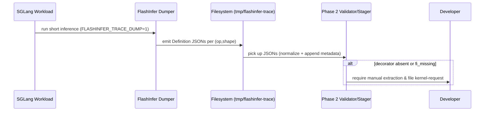

# [PR #424] docs(skills): teach Phase 2 to harvest definitions via FlashInfer trace dump

source: https://github.com/flashinfer-ai/flashinfer-bench/pull/424
state: closed | updated: 2026-05-01T00:34:11Z
labels: 

## 正文

## Summary

Update the onboarding skills to use FlashInfer's new `@flashinfer_api(trace=...)`
trace dumper ([flashinfer-ai/flashinfer#2931](https://github.com/flashinfer-ai/flashinfer/pull/2931))
as the primary way to produce Definition JSONs. The dumper writes a per-(op, shape)
JSON to `FLASHINFER_TRACE_DUMP_DIR` before each decorated kernel runs (crash-safe,
deduplicated), so a single short SGLang inference pass replaces most of the manual
SGLang-source parsing the agent used to do.

## What changed

- **`extract-kernel-definitions`** rewritten as a two-path skill (file: 885 → ~330 lines):
  - **Path A (primary)** — run a short SGLang `Engine.generate(...)` with
    `FLASHINFER_TRACE_DUMP=1`, `FLASHINFER_TRACE_DUMP_DIR=<dir>`, and
    `attention_backend=\"flashinfer\"`. Stage the resulting JSONs into
    `tmp/flashinfer-trace/definitions/{op_type}/`. Tags `fi_api:*` and
    `status:verified` plus the `reference` implementation are emitted by the
    dumper; `tp:*`/`ep:*`/`model:*` get appended in a small post-step.
  - **Path B (fallback)** — manual SGLang-source extraction for `fi_missing`
    kernels or APIs not yet decorated. Condensed from the old 885-line walkthrough
    to a per-op-type formula table + a small JSON-writing recipe.
  - Includes the FlashInfer trace coverage table (lifted from
    [`docs/fi_trace.rst`](https://github.com/flashinfer-ai/flashinfer/blob/main/docs/fi_trace.rst))
    and pitfalls (env-var-before-import ordering, disable CUDA graphs, page-size
    runs, MoE routing variants).
- **`collect-workloads`** gains a \"Phase 2b: piggyback definition trace dump\"
  section — setting the trace env vars alongside the existing
  `FLASHINFER_DUMP_*` logging vars produces workloads **and** definitions from
  one SGLang run, useful when a shape was missed during Phase 2.
- **`discover-models`** Phase 1e now grep-checks for the `@flashinfer_api(trace=...)`
  decorator and records `fi_trace_template` (true/false) on each manifest entry.
  Phase 2 reads this to decide between Path A and Path B.
- **`onboard-model`** Phase 2 description + manifest schema updated to reflect
  the new path. Manifest entries gain `fi_trace_template` and `phase2_method`
  fields.

## Why

- Eliminates manual axis derivation, name generation, and `reference`-impl
  writing for ~95% of kernels (anything in the FlashInfer trace registry).
- Aligns flashinfer-bench with the canonical schema produced by FlashInfer
  itself — no more drift between hand-written definitions and the templates
  in `flashinfer/trace/templates/*.py`.
- Lets workload collection double as definition collection at zero extra cost.

## Test plan

- [ ] Spot-check the trace dumper on a small model (e.g. `Llama-3.2-3B`) using
      the snippet in Path A2; confirm the dump dir contains the expected
      definitions and that staging into `tmp/flashinfer-trace/definitions/`
      produces a clean `flashinfer-bench validate` pass.
- [ ] Walk the onboard-model overview table → confirm Phase 2 description
      matches the rewritten extract-kernel-definitions content.
- [ ] Sanity-check the discover-models output schema (`fi_trace_template`)
      matches what onboard-model + extract-kernel-definitions claim to read.

## References

- Feature PR: [flashinfer-ai/flashinfer#2931](https://github.com/flashinfer-ai/flashinfer/pull/2931)
- Schema docs: [`flashinfer/docs/fi_trace.rst`](https://github.com/flashinfer-ai/flashinfer/blob/main/docs/fi_trace.rst)
- SGLang harness reference: [`flashinfer/tests/trace/example_sglang.py`](https://github.com/flashinfer-ai/flashinfer/blob/main/tests/trace/example_sglang.py)

🤖 Generated with [Claude Code](https://claude.com/claude-code)

<!-- This is an auto-generated comment: release notes by coderabbit.ai -->
## Summary by CodeRabbit

* **Documentation**
  * Added an optional trace-dump phase to emit per-kernel Definition JSONs during workload collection and instructions to stage them into datasets.
  * Added decorator-based readiness detection and a new manifest field fi_trace_template to select automated (trace) vs manual extraction.
  * Rewrote extraction guidance to prioritize a trace-driven path with a clear manual fallback; updated onboarding, phase2_method notes, CLI guidance, and examples.
<!-- end of auto-generated comment: release notes by coderabbit.ai -->

## 评论 (1)

### coderabbitai[bot] · 2026-04-30

<!-- This is an auto-generated comment: summarize by coderabbit.ai -->
<!-- walkthrough_start -->

<details>
<summary>📝 Walkthrough</summary>

## Walkthrough

Adds a trace-driven kernel Definition JSON harvesting path using FlashInfer's trace dumper, introduces `fi_trace_template` manifest field and `FLASHINFER_TRACE_DUMP`/`FLASHINFER_TRACE_DUMP_DIR` usage, and rewrites Phase 2 to prefer automated trace-dump extraction with a manual fallback.

## Changes

|Cohort / File(s)|Summary|
|---|---|
|**Trace-dump enablement & Phase flow** <br> `​.claude/skills/collect-workloads/SKILL.md`, `​.claude/skills/discover-models/SKILL.md`, `​.claude/skills/onboard-model/SKILL.md`|Document `FLASHINFER_TRACE_DUMP` and `FLASHINFER_TRACE_DUMP_DIR`; add `fi_trace_template` manifest field; update Phase1→Phase2 contract, examples, and record `phase2_method`; describe conditional auto-dump vs manual extraction.|
|**Kernel extraction workflow rewrite** <br> `​.claude/skills/extract-kernel-definitions/SKILL.md`|Replace prior manual extraction with two-path approach: Path A = trace-dump harvesting of Definition JSONs (primary) with staging/normalization (`tmp/flashinfer-trace/definitions/...`) and validation steps; Path B = manual extraction and kernel-request fallback for `fi_missing` or missing decorator; remove/condense older long-form guidance and update CLI/docs.|

## Sequence Diagram(s)



## Estimated code review effort

🎯 3 (Moderate) | ⏱️ ~20 minutes

## Possibly related PRs

- flashinfer-ai/flashinfer-bench#158 — Overlapping SKILL.md updates (extract-kernel-definitions, onboard-model, collect-workloads) touching the same trace-dump and manifest docs.  
- flashinfer-ai/flashinfer-bench#136 — Prior work on extract-kernel-definitions workflow; strongly related to the new Path A trace-dump approach.  
- flashinfer-ai/flashinfer-bench#224 — Related documentation revisions aligning trace-driven extraction and manifest fields.

## Suggested reviewers

- yzh119  
- Ubospica

## Poem

> 🐰 I hopped through traces, left JSON crumbs,  
> > Dumper hummed softly, kernels beat their drums.  
> > Tiny files in tmp, neat rows in a line,  
> > Phase Two tidies metadata — definitions shine.

</details>

<!-- walkthrough_end -->

<!-- pre_merge_checks_walkthrough_start -->

<details>
<summary>🚥 Pre-merge checks | ✅ 5</summary>

<details>
<summary>✅ Passed checks (5 passed)</summary>

|         Check name         | Status   | Explanation                                                                                                                                                                          |
| :------------------------: | :------- | :----------------------------------------------------------------------------------------------------------------------------------------------------------------------------------- |
|      Description Check     | ✅ Passed | Check skipped - CodeRabbit’s high-level summary is enabled.                                                                                                                          |
|         Title check        | ✅ Passed | The title clearly and concisely summarizes the main change: teaching Phase 2 to harvest definitions via FlashInfer trace dump, which is the primary focus across all updated skills. |
|     Docstring Coverage     | ✅ Passed | No functions found in the changed files to evaluate docstring coverage. Skipping docstring coverage check.                                                                           |
|     Linked Issues check    | ✅ Passed | Check skipped because no linked issues were found for this pull request.                                                                                                             |
| Out of Scope Changes check | ✅ Passed | Check skipped because no linked issues were found for this pull request.                                                                                                             |

</details>

<sub>✏️ Tip: You can configure your own custom pre-merge checks in the settings.</sub>

</details>

<!-- pre_merge_checks_walkthrough_end -->

<!-- finishing_touch_checkbox_start -->

<details>
<summary>✨ Finishing Touches</summary>

<details>
<summary>🧪 Generate unit tests (beta)</summary>

- [ ] <!-- {"checkboxId": "f47ac10b-58cc-4372-a567-0e02b2c3d479", "radioGroupId": "utg-output-choice-group-unknown_comment_id"} -->   Create PR with unit tests

</details>

</details>

<!-- finishing_touch_checkbox_end -->

<!-- tips_start -->

---

Thanks for using [CodeRabbit](https://coderabbit.ai?utm_source=oss&utm_medium=github&utm_campaign=flashinfer-ai/flashinfer-bench&utm_content=424)! It's free for OSS, and your support helps us grow. If you like it, consider giving us a shout-out.

<details>
<summary>❤️ Share</summary>

- [X](https://twitter.com/intent/tweet?text=I%20just%20used%20%40coderabbitai%20for%20my%20code%20review%2C%20and%20it%27s%20fantastic%21%20It%27s%20free%20for%20OSS%20and%20offers%20a%20free%20trial%20for%20the%20proprietary%20code.%20Check%20it%20out%3A&url=https%3A//coderabbit.ai)
- [Mastodon](https://mastodon.social/share?text=I%20just%20used%20%40coderabbitai%20for%20my%20code%20review%2C%20and%20it%27s%20fantastic%21%20It%27s%20free%20for%20OSS%20and%20offers%20a%20free%20trial%20for%20the%20proprietary%20code.%20Check%20it%20out%3A%20https%3A%2F%2Fcoderabbit.ai)
- [Reddit](https://www.reddit.com/submit?title=Great%20tool%20for%20code%20review%20-%20CodeRabbit&text=I%20just%20used%20CodeRabbit%20for%20my%20code%20review%2C%20and%20it%27s%20fantastic%21%20It%27s%20free%20for%20OSS%20and%20offers%20a%20free%20trial%20for%20proprietary%20code.%20Check%20it%20out%3A%20https%3A//coderabbit.ai)
- [LinkedIn](https://www.linkedin.com/sharing/share-offsite/?url=https%3A%2F%2Fcoderabbit.ai&mini=true&title=Great%20tool%20for%20code%20review%20-%20CodeRabbit&summary=I%20just%20used%20CodeRabbit%20for%20my%20code%20review%2C%20and%20it%27s%20fantastic%21%20It%27s%20free%20for%20OSS%20and%20offers%20a%20free%20trial%20for%20proprietary%20code)

</details>
<!-- review_rate_limit_status_start -->
<sub>Review rate limit: 0/1 reviews remaining, refill in 60 minutes.</sub>
<!-- review_rate_limit_status_end -->

<sub>Comment `@coderabbitai help` to get the list of available commands and usage tips.</sub>

<!-- tips_end -->

<!-- internal state start -->


<!-- DwQgtGAEAqAWCWBnSTIEMB26CuAXA9mAOYCmGJATmriQCaQDG+Ats2bgFyQAOFk+AIwBWJBrngA3EsgEBPRvlqU0AgfFwA6NPEgQAfACgjoCEYDEZyAAUASpETZWaCrKPR1AGxJda+BogAKRABreA8PRABKLho0BlhrWDREEkgAJkgCSCSKKURcSCUAM3gMdXh8DGQJeDRIADEPZNgASQwiykyqBlTaR25IANtIMwAWNNHItwRkYexuWmppfgwBfGdaUqJ7UPDkLOwUhqbEVvbKAHJkcgB3SAABIpOEc4oAfTRueADcbpIAXg0QMiXTivX6nQCT2apQ6FDA2gA9NDTrDKGY0gBOADMAEYQclMrBUrx4MxnPIbmh5FleIpsD1IAAREglMriSqQABSAGUAPIAOUQGhgxMKEL4Nwo6mW3EoYAC+G4ABpTp8SCDeYL9vgGgAZACCPIAEi0BfUAKI2N7QGwGgDCFreTIAqgBZKzOlp2ASs/AUVIkOIJJRMKg0ejBSjkDyQCjYKqDBhUU5gRBoDrKwp0eYeeAMJa0SIigDSJHk8UwpEQHAMUBIAA9fnFcGAoxQY2BiqVypVkAGpeoaFhCXVcDdCNxqAkQmFY1CwqkA30evQihQWJAAH4ADh3AFZIIAkwm32OxAAZIHnyFFa5BdNZp5ADYNSeSXNE4wn0PZYP6CjyADiepVpAFoYEQpQkBopDkOGJABECGggjc6gJPUhommalrWraDpOq6Hr/LiWYYUaprmlaNp2o6zrup6TLevYJC4FmmD0NQw4chgbwCHEUYYLQ/wAEQoi8cLCQA3PYuBoKQcbSNgHjiBB3L8kKKAYFkuDMNwyLPGi8LNj0iLduyFRVIiADeSpvLgshygAvoiIpwOCumdCQzDqMgJQfF8HAAFToIJMnUIcHBSNKJR0CFHEKXCZCMmS3BeGwWnUBZ0l1Ig5LhDw+D5GmNADJ8cqCfs3BBYiJBVYFiLMIoJAeEFmRycKBj3lAVhPgAQoMRRoOEfEMMEn7khg2BDZAQEgRBab4NgFCMo2xncZART+ht8BvN5iCIFskDtjGyBbQaVgtNc+AFLILHZmGhbSUwglkCk9BZHUcrwkqYD2XKG3+swSljioXg8B4hw/lqApgIOKnbAGDDwHKGidQ+TJ+I47CZZyaC0Js3E1sczRtHCoKMkwUVyakskCGD7E8Oog17IMZASGAEjOGAvqbQGYApf+/AUEo0oQVmmzpnTqT2i6TIvkQVDcLAiBZlOpBpvAABeS4JirkBuvgFpxot8OQJz0qYLgUSo1ATDhKIrYThQwQeOstBE3j7uQMJVhJEcaQCFwXxEEQsgjcE2Zsr2WDGe53DCfYuopLgpux5AbNm84yBDZURAHUo6cNkgptkVhlHWoRnrBa7IeHebyB0iuyxOy7bvZ6FZnR75G7MCsqSzaB8YYDbhRIJT8qNUoERcL7ySpLiqQYPgdwK7VvlbY8BmvP53yx4CwJxQpYZe35sd2V5qVLIMvzYCQyJDSkIKckG8SQBN8AdPk6daS40mz/7Ck8b7BmJkXU8R8CFVSD1XACQXwSFmH1EelQ1gbDAJPZqM8/apAyEoRAyZkbrQZu/T+BQ8HEnJJAeYiwIzSWIdIAo7BpTLCINoLAp8/jn10k0Ggh8lZzzSLtFif41zwGau7VGBhoD0PBpgFANBmBE0QNwa6YB4iiAjmnPoHk+C43sHlWM6CPBZiih/eQ+Q5KHQZpzPM1CLJZmeiUCgvd/7YMKH4ZA5JcCvwHNKFOZAFBaXYGxUK6Z2SyFUcSUao88H4CimgpqER+B4G4HgewajyQSIsJAe0LBvIFDYPtamyAHBOBcEYA0+Ns4FSKuYyCqkl5OKGlrHGWB8i1UGAabEAgQS80fDA58oCeDUFfrHLsEJ6DQ2KbqGB5Yhn7Q2lvOE3MkoJGsfAWxlRXJigaXlZphD8YBn2ssGBAZUhIAcMsQQKRcixU5HqJo5IwDYg0GkJ5vUuABkShgRkRQExiAspADAaA2BvyQJ41+AQpxeOJO9XUQ8AiREiKrJoGBfpkjOS9BsmRXr+mQKhfptA/oAmEgmYIS8bgYATgufKYZEYFEJQ5aQSLD6lDAJfRkSpkChiaKLbY6z2D5mmkCgpmlNIpKtofE24rkABADMKmmuo0ASHwOszONjqBbQDCIf5lRizPi6SgfsrJKBJViuuTcdsvBiFhv6VuQDEhz3SAIAGfAZmMxDmHfijBHUM1QKUYcSgOJVPkcoqgLghnQsoVpMI9gyRhGcNtBsywUX0HmPkAMwLRWNBJq8CR+hjDgHrKFfARQcAEGIGQZQEYFCsHYEHHRwgHaSGWHIBQIsVBqE0NoXQYBDAmCgHAP17cy2EFglW2KTBa1aQ+WgO4JT3zyFbUwdtqh1BaB0PmgtpgDAaAYE0bAShESzj2IiS1DsbXO1dkAxEPISwtD1HqDQzBaC1mEm+gwWSDQtArXBQs9hHALv4KWysEFpBGDaL8ekPRh1Km4tNFxTq3EMCxhldaLcnjLyJNQZiEqAAGpcKI4WovhOiHpcOH3w5hQjVE8K0Url6Gw5GshjvgjweUuHFQql/OqSI5GWRR3WpMl15NYq4c3jCbenxd5/H3shcjBYWZ9F5USQMRd8iHRrnUogXZpRSCwAPVSZ6dVYCHiKCpXtSjpoZITQZtSaZikOUpU2Qn/XTLFNQueBRDiHVwzVJs3RWzHWal2VkPZCbkegbA7Eh8ZlYB2U07WKne69LWRsrA3nVKdOdQEUoe6D2HTdeQWKtJhkJDdVor6gBMAmQLh4okA3gNka28T5JrvkkHIwzWrRKuAkowGS5elLcN6p5LJGgwDsNus0f0Q1mklDlSUFpIDKnsVVC2ppw650WhZj9oCkgRA8yQSlvwKKxI8bBPoAWLAvorysgYUCqW9BGw9G4AUG4xIsCdxs84VIQ0M20DMbTLwEjzCWANMpKtFkdTLe5c4Fpp1S2NlDdWraKS6b5m/uIcQYG6yQAFIKI2ARfDIfSqNiyYBKgeArEkUDUwP2WDdJgD+0j6iLmfECyn2sKBGD1FBZAIHSAvsgAAajSPuREYBzwGDfcJIwEAwBGF3fuw9x6IimTHrEieCTEA3rvQ+p9L6pfvs/d+ljf750UiW/z7HbkkOAsw57KpoZ/QavhHxN6gDNg3mKfAIg7PhNKBoE4nsqk3tCM6AhjIl2R2eMFeEeQpueFBdjPxsLALoZm1qMt7NpxSadFGRViNsARQtFIXKJGMUqm4dXtwcjdJVxLQVdmGgYhIBibEoZHePwZNIV4+dzSkGm5VNuG/RnJDtpiNb+wsEnDL40CY3C0Q/p6Ch5ma69zi/wxbUbMXYUkAS8qZMyQGoKRgGpFw35Bw3Akd0F8+fnae0DoQXkycA6JQCzrVwfgl7FkuB37eJf6/WgcjVAclEfK/YrXUCPSAfFBIZ6AmCyaaFIK1daX0ccEgfxfPabIhTAKaWMVaALAFN3W5LAP/M+ENbhdrPvP/B/LYYAjxMqCAh1ABGAkfSaaafAlsAFc1XuAzbYVKSGOoJPMAAMAAR1vi/nOVvhFBZ3Z0pyzHUEoQWCWFPzUkFDSXITqEbGBVSkb1OEw1II4XIKWHI16TqD/wAP/BvyOmjGamBzp2fHB3DEh0GXK1EB5ThyW0R0sPoBR2wDRwYAx3KGxygAFEqFSEJ0xhJxaUYGp3kgp1kGkiXjbTvi8IoGrX9UoEGmgzfkUA/lESLEyXp1H2Z1ZwNHZ1kE52515xiKrDoC4BF1xHFzSCMAtHU08QnSagUhqBIDuFZF5k4H1joHgEcENxlzrG3UVzQAPTvhV21w4OtSEM+0hx13vUfWfVfSN1BxN0rXgnoHN3DRLRqNA0QGmFQBV2q2gNtQwzuDOL8PMWjSGkpwUjhmHC4Es1iB8NLQmlwKePmNNiT27k3F4JyKnmSMPgTy2CPVSiHEOiWL7HQGTEKmQGgCsERAtCsGgLQmzD6GhPfzsTkX7w3EHx/DfAt0iwGRgWwxyDyAlRT3Mk5CE02DpSeO4OJhz1eAuKm20XFGUxyj/DSJmmAlAkMlNS/GHj3wKAdwCWTBYlSFqQ03wEggCNc1bx0j0nb1eF+j+FMlC3pMshsm4DskZWclw2RQELt0aTzE1miLaQGCyHJCjHFA8gmXUj5xYChXgCOxYPP0WXlF9G+VWSaWoXa0GDlWBR8xazlR6BML+RsyyFq1ZDFNNJdSRlUkvlRXEBBVKCUCxWHEQFxUq0KCJT1gZgDEahqFUg1woCaCv0OlKHFURClVSXlWtmfCKEDzCi03kNL1EDyOOSSFeyuNdjuDYFkg8zajzkGEMURFwD0lqkRDEMtj2QshBCBi/muwYJenoF9ALEOHszjk6F8GkAwEqwYTySSzM12zuGZg8HDj6QSH6mp1oC8Bqz8hoKf0PkABwCJ3TfeEFhbgQAXAJvUT9IBW1RDsB4BlMnzYZfFhxVCNIMttg6hLtKhY91CvI6hIzTU+9ekfyXdiBPhBgk8eBDl2BQLUk04jCeF3yiAQQFCpTZFEc8wkYChAJ1BjQ/DDULlGAM11pbT0AWF3i2Szg4Qsw3tWdqDzlaCFJyRLNMh8jBlt91NKzVh1hhY6z9pb4Fll4RR7Q9QWghkqBRzKB256AicUNSdOQrMxAG90AAxFDgyOIGBj4tg5DD4eV5JSQtoUhjNTosAgZlJ4A2UsFC41p8TVpXpm1WDcD0LyQZy5IwpBINgSzQpnB4gZQbK+Zy1iLyRazVIiAILFg2s7KlwvINcfC+A4DXpYoVTCsejMgJw2UnwyoNxgw7DP1HCPDtJ1891YcbNDjUjkc+BUdmLAiscTicdQjyBBhzKojuJycMAnirdBlcNJjpij1dhVc/i2wbCPAQsBNljb1Vj9chsqibwjiBd6jxgxcwAdxzxcRRjZcJjer1rZjGzVLUFpyjq9d1jHrjcf1x09iAMLdDircJqENcRWCmcv4yEMKZtEd2I6jrCOxmoMcmErobjvkIYC4DDp8qKQyc4IJ85VNi4fM+EUhcR/9RtDhkzzDqbEBkzOtEB9sqbwoGaRQoDZrsZ1pUAqE/0sglFeyigaQBzI5U8GTXSSqR0xlnSM8zCCNsIaMaICJ6JiJyN4joD3tJ8doyCL4KD/gb52tpJrpiQKBUIjg4TExvtoDYL/FvjHjZA+8oDQDEYl8atyaSABFRzhFgCY4xQ6F8gtkoEQqA4SK/Acx7LUAfEhx/FWTPy/iNoe5hLc8KAgKPoAl4DKhED+SAIhTVJMDdJtK7haBdN/FW029fT3gpMu8wRZNe9sw8FpQ1AQ8EBX5Lbx8PAvZysJQCoUkKDTLNb/EFCbyZAvV7ScD2D/NODNkmDsE6hUA8YhBDhq0BbRt9yRMZaBgoUQx8Blgl5JSr8WStpJL9paCsx8zlssLirUAE9Yoag6h7bYxgTOYyhwg6heYqRhZBhyTeoQQeZ/RUgShrxtg3Vs8RLOghDwLpFJDoIGhSgHasw3Uh40Fiiv4tCuEzlkA+aIw/MA1GDctsaz8p8egZ8KDaaPavahFFBGbUrmI4DkaYxC5tCwYlBGoqhmxU4xRcNH7a9px2rQdOq4y3Neg3C+rnCBqGxAChYeA/DRqBVxrZdccwiZrIjuaycNawaXCHNvwA7SF0k6hP9pRv9cZQp0GdD4LiwQd9ZUGCgWcwYyihoKjKAzrlgrdBchcLxxdcQHqDBWjMy/1l1Srujeiih+iuA3QhiRjpcnrDADB+1v5Pjpbb6Ltck604xZ1/1SlF0KwmoqBV0u0N1e04nC0a08k3h1lEBmsj9REbg6BWaBTN14nsRaAAB2XEHcTEXEVQHcbEFpzENIFpncNAEgfcNACYPEfcX0AQc8UYHcBgbEUYUYNAMZgANnoHzXifmYYB6aGdoHaaKHPAYExCKFoGcrSBWfusWBIGxExHQP3BaYYBaexBWf3BWb4lGB7T7RKduecr2b2dmYYFGAEFoHPCKDee2dacxB3BGdoADi6TSB3CKD6aUGGc+a3VtlyXUHKfdiqeCbqbIHWaKfid4BIEEQoFIDeDUVGkqfMQaaKYMCsjRmEiQFsF6ldlGjoBySnVwCsEKgjGEi4GZhSGVCZaQD5CimlHxjIAFY2gfhIBFfvGEiJ3TS2BySplIAg2jCGhGyWBlaskcgVe9kCZsA7XUAAHUNwaArAKB3BcAvAZWhX5WmW9ClJaA2W/BghbAHW5XDWlX1kbAEwMYGARteVEB7RIlggZXDbfXNhaAA2MBbWvBw31Eo34wnXFXY342WRG6CELJk3RpvWIh03vZrwoxaBLoLlEAQ2ZW31fWThcB83ggbBFJlJEAZWABtNGe8Rl+8Xto1iNgUYFEgGt7Nr/daRt4SQ1vt4ScxXAQ4VN2+Kd3t4SJizAFpGtxtnYZGOUdZ7JJqE1/Ji4hAIgWAMALwKQWMfY+QVAMgUGOgDQSdrt5d9BGtz+soCCR9vtxV/0H3eBjwRtwdtgGtwx3NyoGXPtg1p9ntr94SKl4IQD4dnrRN1IODz9mD2d+dmINNpdxV1doFbiGtm3THMGPdIMas+QBmZ6JGJAsxYG6UbWFQ2SrAK3GIF+F4bYKArIak6RS26oTPMBlOkTJ0rjcS1+VAN1Uk8NTaZDbORE+ZR4hys3Ta4UND6dw5fACGAjrgSacIHD72F9nrN9rYVT5d129oH3BvQt4Vp9796UOpIaADodmt4j4dp9yDvt6D6duDhDkd9xX4Q6NV5QUgEzxVjDttrDxdmz72PD9dnrUIjaWM5wzaBMegUoZbNx7aF8xS6xKaHhZV/zwzKs6mEUHkUIPK7YfL5TceKgeSODh9vT4SdTzTiyGti1mUJDFVom4TN1X5b5GzGipLWzTKRAYW9Lor+SE5aQP8Tu+rqL4SAz72Izj9hrn9+z/9gdpznrSrrYNttzpdzz5d7zzb72HnPrWKCt8QmIlNhrsLhd4t6dmLrT72Td2ccA7c0QKYo4JI0tmqzS5uE1AGFL7rkBPu2MKBwOkL/TpqV95wd9ogSH4SVbv9xzoDnrH78tv7xAA0I5faEncD3t9z3tg7xVo71H72PkVJQ4nkJgf6cN2ovnCNhH27iL+75dx7lrnrF7srnd0Cj7vcu3K8UoMtriy72p+y5L0KXpGBVAUHhSMQ+hWbr9qHpQGHjsYzlbuz5HjbsnxHvAPkIoanpUEgOn447Hk/XKdgfH+8RyNGAAXTreSB5ZsFHaMae+ElGFoEWf3FCdoDmecu956ZaZWYYA6FafPExExD6YEExBD49/6YEERd99GCKDSALBab4lxC6W2dxCeZ3FxFGExB3LQ+EnrdsGQ+A5UFxHPHQLz6KEedxFhYEH3DSFxFedoH3Ahf3H3ExGGZ6FGH3BIDWZ3CWbPCKB3BWdxDQG8bQG7675IC6Y6BOaDBlxt+KYgBItJbYHJdJbg8qYJbRfiamIIDeCnD3NZpoHqYKE3SshL8d56j3NoANFwGbbxdoC5byRyQTFwAFfPFX8P7wHwAn9PupLWdqS3376AgAA== -->

<!-- internal state end -->

## Review (6)

### gemini-code-assist[bot] · 2026-04-30 · COMMENTED

## Code Review

This pull request updates the model onboarding workflow to leverage the new FlashInfer trace-dump feature, which allows for the automatic generation of kernel definition JSONs during a short SGLang inference pass. Key changes include updating the discovery process to detect trace-instrumented APIs, a major overhaul of the kernel extraction skill to support both the automated trace-dump path and a manual fallback, and integrating these updates into the master onboarding manifest. Feedback from the review highlights the need to include expert parallelism and quantization parameters in the SGLang engine setup to ensure MoE and quantized kernels are correctly exercised, as well as a fix for a shell variable expansion issue in the staging script.

### coderabbitai[bot] · 2026-04-30 · COMMENTED

**Actionable comments posted: 1**

<details>
<summary>🧹 Nitpick comments (1)</summary><blockquote>

<details>
<summary>.claude/skills/onboard-model/SKILL.md (1)</summary><blockquote>

`99-129`: _⚡ Quick win_

**Reorder Phase 2 subsections to `2a` then `2b` for execution clarity.**

Right now the flow reads `2b` before `2a`, which makes the runbook harder to scan during execution. Swapping the labels/order will reduce operator confusion without changing content.

<details>
<summary>🤖 Prompt for AI Agents</summary>

```
Verify each finding against the current code and only fix it if needed.

In @.claude/skills/onboard-model/SKILL.md around lines 99 - 129, The Phase 2
subsections are out of logical order; swap the two blocks so the section
currently titled "2a: fi_missing → manual SGLang-sourced reference + file
kernel-request issue" appears before "2b: fi_supported → trace-dump from a short
SGLang pass (or manual fallback)". Concretely, in SKILL.md move the entire "2a:
fi_missing ..." block to precede the "2b: fi_supported ..." block, update the
headings so they read "2a: fi_missing ..." then "2b: fi_supported ...", and scan
the file for any inline references to "2a"/"2b" to adjust them to the new
ordering (use the headings "fi_missing" and "fi_supported" to locate the
blocks).
```

</details>

</blockquote></details>

</blockquote></details>

<details>
<summary>🤖 Prompt for all review comments with AI agents</summary>

```
Verify each finding against the current code and only fix it if needed.

Inline comments:
In @.claude/skills/extract-kernel-definitions/SKILL.md:
- Around line 319-340: The docs and the Definition model disagree: add an
"optional: bool" field to the TensorSpec dataclass (TensorSpec) in the
Definition model so inputs can be marked optional, and change
Definition.reference to be Optional (allow None) and enforce the rule in
validation logic (e.g., where Definition is validated/constructed) that
reference must be present when tags include "status:verified"; update type hints
and defaults accordingly and add tests to cover optional inputs and the
verified-reference validation.

---

Nitpick comments:
In @.claude/skills/onboard-model/SKILL.md:
- Around line 99-129: The Phase 2 subsections are out of logical order; swap the
two blocks so the section currently titled "2a: fi_missing → manual
SGLang-sourced reference + file kernel-request issue" appears before "2b:
fi_supported → trace-dump from a short SGLang pass (or manual fallback)".
Concretely, in SKILL.md move the entire "2a: fi_missing ..." block to precede
the "2b: fi_supported ..." block, update the headings so they read "2a:
fi_missing ..." then "2b: fi_supported ...", and scan the file for any inline
references to "2a"/"2b" to adjust them to the new ordering (use the headings
"fi_missing" and "fi_supported" to locate the blocks).
```

</details>

<details>
<summary>🪄 Autofix (Beta)</summary>

Fix all unresolved CodeRabbit comments on this PR:

- [ ] <!-- {"checkboxId": "4b0d0e0a-96d7-4f10-b296-3a18ea78f0b9"} --> Push a commit to this branch (recommended)
- [ ] <!-- {"checkboxId": "ff5b1114-7d8c-49e6-8ac1-43f82af23a33"} --> Create a new PR with the fixes

</details>

---

<details>
<summary>ℹ️ Review info</summary>

<details>
<summary>⚙️ Run configuration</summary>

**Configuration used**: defaults

**Review profile**: CHILL

**Plan**: Pro

**Run ID**: `abd275dc-8322-4ca0-b895-e23edcae9852`

</details>

<details>
<summary>📥 Commits</summary>

Reviewing files that changed from the base of the PR and between c8d3e8210faa071a442294646eb3b65fecd62255 and 3d71891bb8379278ae5a24315beb048c344aa26d.

</details>

<details>
<summary>📒 Files selected for processing (4)</summary>

* `.claude/skills/collect-workloads/SKILL.md`
* `.claude/skills/discover-models/SKILL.md`
* `.claude/skills/extract-kernel-definitions/SKILL.md`
* `.claude/skills/onboard-model/SKILL.md`

</details>

</details>

<!-- This is an auto-generated comment by CodeRabbit for review status -->

### coderabbitai[bot] · 2026-04-30 · COMMENTED

**Actionable comments posted: 1**

<details>
<summary>♻️ Duplicate comments (1)</summary><blockquote>

<details>
<summary>.claude/skills/extract-kernel-definitions/SKILL.md (1)</summary><blockquote>

`390-396`: _⚠️ Potential issue_ | _🟠 Major_ | _⚡ Quick win_

**Schema rules here still appear inconsistent with the current Definition model contract.**

This block documents `inputs.*.optional` and says `reference` is required only for `status:verified`; that guidance can lead to invalid Definition JSONs if the model contract still requires `reference` unconditionally and does not define `optional` on `TensorSpec`.

   

```shell
#!/bin/bash
set -euo pipefail

def_file="$(fd -a '^definition\.py$' | head -n1)"
echo "Definition model file: ${def_file:-<not found>}"
test -n "${def_file}" || exit 1

rg -n -C2 "class TensorSpec|class Definition|reference:|optional|dtype_from" "$def_file"
```

<details>
<summary>🤖 Prompt for AI Agents</summary>

```
Verify each finding against the current code and only fix it if needed.

In @.claude/skills/extract-kernel-definitions/SKILL.md around lines 390 - 396,
The documentation block is inconsistent with the Definition model: update the
SKILL.md wording to match the actual Definition contract by either (A) stating
that `reference` is required unconditionally if the `Definition` class declares
`reference` as mandatory, or (B) if `reference` is optional in the model,
clarify that `status:verified` must include it but the JSON schema allows
omission; likewise ensure `inputs.*.optional` is only documented if `TensorSpec`
actually exposes an `optional` field—otherwise remove that mention and instead
document the real field on `TensorSpec` (or add `optional` to `TensorSpec` in
the model). Also align the note about `"dtype_from": "{input_name}"` with the
`Definition`/dumper behavior. Refer to the classes/fields `TensorSpec`,
`Definition`, `reference`, `optional`, and `dtype_from` when making the changes.
```

</details>

</blockquote></details>

</blockquote></details>

<details>
<summary>🧹 Nitpick comments (1)</summary><blockquote>

<details>
<summary>.claude/skills/onboard-model/SKILL.md (1)</summary><blockquote>

`18-18`: _⚡ Quick win_

**Phase 2 output row should also mention `fi_trace_template_request_url` for decorator-gap manual cases.**

The same file’s manifest example (Line 332) includes this field, and Path B4 in `extract-kernel-definitions` requires it; adding it here keeps the phase contract unambiguous.

<details>
<summary>🤖 Prompt for AI Agents</summary>

```
Verify each finding against the current code and only fix it if needed.

In @.claude/skills/onboard-model/SKILL.md at line 18, Update the Phase 2 output
row description to include the manifest field fi_trace_template_request_url for
decorator-gap manual cases: in the row entry that currently lists definition
JSONs and manifest fields (`phase2_status=done` and `fi_issue_url`), add
`fi_trace_template_request_url` so the Phase 2 contract matches the manifest
example and satisfies Path B4 in extract-kernel-definitions; ensure the phrasing
makes it clear this field is present for decorator-gap/manual trace-template
requests.
```

</details>

</blockquote></details>

</blockquote></details>

<details>
<summary>🤖 Prompt for all review comments with AI agents</summary>

```
Verify each finding against the current code and only fix it if needed.

Inline comments:
In @.claude/skills/extract-kernel-definitions/SKILL.md:
- Around line 157-160: The heredoc for the second embedded Python block uses a
quoted delimiter ("<<'EOF'") which prevents shell variable expansion so
"$DUMP_DIR" is passed literally; change the heredoc delimiter for that python
invocation (the line starting with python - <<'EOF') to an unquoted form (<<EOF)
so the shell expands $DUMP_DIR before the Python script (the block that defines
src = Path("$DUMP_DIR")) runs.

---

Duplicate comments:
In @.claude/skills/extract-kernel-definitions/SKILL.md:
- Around line 390-396: The documentation block is inconsistent with the
Definition model: update the SKILL.md wording to match the actual Definition
contract by either (A) stating that `reference` is required unconditionally if
the `Definition` class declares `reference` as mandatory, or (B) if `reference`
is optional in the model, clarify that `status:verified` must include it but the
JSON schema allows omission; likewise ensure `inputs.*.optional` is only
documented if `TensorSpec` actually exposes an `optional` field—otherwise remove
that mention and instead document the real field on `TensorSpec` (or add
`optional` to `TensorSpec` in the model). Also align the note about
`"dtype_from": "{input_name}"` with the `Definition`/dumper behavior. Refer to
the classes/fields `TensorSpec`, `Definition`, `reference`, `optional`, and
`dtype_from` when making the changes.

---

Nitpick comments:
In @.claude/skills/onboard-model/SKILL.md:
- Line 18: Update the Phase 2 output row description to include the manifest
field fi_trace_template_request_url for decorator-gap manual cases: in the row
entry that currently lists definition JSONs and manifest fields
(`phase2_status=done` and `fi_issue_url`), add `fi_trace_template_request_url`
so the Phase 2 contract matches the manifest example and satisfies Path B4 in
extract-kernel-definitions; ensure the phrasing makes it clear this field is
present for decorator-gap/manual trace-template requests.
```

</details>

<details>
<summary>🪄 Autofix (Beta)</summary>

Fix all unresolved CodeRabbit comments on this PR:

- [ ] <!-- {"checkboxId": "4b0d0e0a-96d7-4f10-b296-3a18ea78f0b9"} --> Push a commit to this branch (recommended)
- [ ] <!-- {"checkboxId": "ff5b1114-7d8c-49e6-8ac1-43f82af23a33"} --> Create a new PR with the fixes

</details>

---

<details>
<summary>ℹ️ Review info</summary>

<details>
<summary>⚙️ Run configuration</summary>

**Configuration used**: defaults

**Review profile**: CHILL

**Plan**: Pro

**Run ID**: `b094bbc0-8842-4e0e-8356-8142344c1334`

</details>

<details>
<summary>📥 Commits</summary>

Reviewing files that changed from the base of the PR and between 3d71891bb8379278ae5a24315beb048c344aa26d and c3c838ad18f0c9fdcc2601dae39ee57c73656ba4.

</details>

<details>
<summary>📒 Files selected for processing (2)</summary>

* `.claude/skills/extract-kernel-definitions/SKILL.md`
* `.claude/skills/onboard-model/SKILL.md`

</details>

</details>

<!-- This is an auto-generated comment by CodeRabbit for review status -->

### coderabbitai[bot] · 2026-04-30 · COMMENTED


<details>
<summary>♻️ Duplicate comments (2)</summary><blockquote>

<details>
<summary>.claude/skills/extract-kernel-definitions/SKILL.md (2)</summary><blockquote>

`157-160`: _⚠️ Potential issue_ | _🟠 Major_ | _⚡ Quick win_

**Fix quoted heredoc in A3 staging script (`$DUMP_DIR` won’t expand).**

Line 157 uses `<<'EOF'`, so Line 160 gets a literal `"$DUMP_DIR"` path and staging can fail on a non-existent directory.

<details>
<summary>Suggested fix</summary>

```diff
-python - <<'EOF'
+python - <<EOF
 import json, shutil
 from pathlib import Path
 src = Path("$DUMP_DIR")
```
</details>

   

```shell
#!/bin/bash
set -euo pipefail
nl -ba .claude/skills/extract-kernel-definitions/SKILL.md | sed -n '152,162p'
```

<details>
<summary>🤖 Prompt for AI Agents</summary>

```
Verify each finding against the current code and only fix it if needed.

In @.claude/skills/extract-kernel-definitions/SKILL.md around lines 157 - 160,
The heredoc is quoted so shell variables like $DUMP_DIR are not expanded; change
the heredoc opener from <<'EOF' to <<EOF (or otherwise remove the single quotes)
so the shell expands $DUMP_DIR before the embedded Python runs, leaving the
embedded line src = Path("$DUMP_DIR") as-is (or optionally replace it with a
direct environment fetch in Python). Update the occurrence of "python - <<'EOF'"
in SKILL.md accordingly to ensure Path("$DUMP_DIR") receives the expanded path.
```

</details>

---

`450-456`: _⚠️ Potential issue_ | _🟠 Major_ | _⚡ Quick win_

**Schema guidance still permits invalid Definition JSONs for Path B.**

This section still documents `optional` inputs and says `reference` is required only for `status:verified`; that can lead to manual JSONs that fail the current Definition contract.

<details>
<summary>Suggested doc correction</summary>

```diff
 - **`inputs` / `outputs`** — each entry has `shape` (list of axis names) and `dtype`.
-  Optional inputs: `"optional": true`. Output dtype may be inherited from an input via
-  `"dtype_from": "{input_name}"` in trace templates (the dumper resolves it before
-  writing).
-- **`reference`** — pure-PyTorch `run()` for correctness checking. Required for
-  `status:verified`. Path A emits this when the trace template includes one; Path B writes
-  it by hand.
+- **`reference`** — pure-PyTorch `run()` for correctness checking. Required for all
+  definitions in the dataset schema.
```
</details>

   

```shell
#!/bin/bash
set -euo pipefail
fd -i 'definition.py' | xargs -I{} sh -c '
  echo "== {} ==";
  rg -n -C2 "class TensorSpec|class Definition|optional|reference" "{}"
'
```

Based on learnings: "All Definition JSON files must follow the standard structure with required fields: name, description, op_type, tags, axes, constraints, inputs, outputs, and reference" and "Reference implementations in Definition JSON must be plain PyTorch code with a `run()` function serving as ground truth".

<details>
<summary>🤖 Prompt for AI Agents</summary>

```
Verify each finding against the current code and only fix it if needed.

In @.claude/skills/extract-kernel-definitions/SKILL.md around lines 450 - 456,
The docs currently allow creating invalid Definition JSONs for Path B by
treating "optional" and "reference" permissively; update the SKILL.md text
around the inputs/outputs block so that Definition JSONs must include the
required top-level fields (name, description, op_type, tags, axes, constraints,
inputs, outputs, reference), make "optional" explicit as a per-input boolean
that must be present if an input is optional, and require a plain-PyTorch
"reference" field containing a run() function for all published Definition JSONs
(not only those with status:verified); edit the lines describing **`inputs` /
`outputs`**, **`reference`**, and the status:verified note to reflect these
strict requirements and to state that trace-template dtype inheritance
(`"dtype_from"`) is resolved before writing.
```

</details>

</blockquote></details>

</blockquote></details>

<details>
<summary>🤖 Prompt for all review comments with AI agents</summary>

```
Verify each finding against the current code and only fix it if needed.

Duplicate comments:
In @.claude/skills/extract-kernel-definitions/SKILL.md:
- Around line 157-160: The heredoc is quoted so shell variables like $DUMP_DIR
are not expanded; change the heredoc opener from <<'EOF' to <<EOF (or otherwise
remove the single quotes) so the shell expands $DUMP_DIR before the embedded
Python runs, leaving the embedded line src = Path("$DUMP_DIR") as-is (or
optionally replace it with a direct environment fetch in Python). Update the
occurrence of "python - <<'EOF'" in SKILL.md accordingly to ensure
Path("$DUMP_DIR") receives the expanded path.
- Around line 450-456: The docs currently allow creating invalid Definition
JSONs for Path B by treating "optional" and "reference" permissively; update the
SKILL.md text around the inputs/outputs block so that Definition JSONs must
include the required top-level fields (name, description, op_type, tags, axes,
constraints, inputs, outputs, reference), make "optional" explicit as a
per-input boolean that must be present if an input is optional, and require a
plain-PyTorch "reference" field containing a run() function for all published
Definition JSONs (not only those with status:verified); edit the lines
describing **`inputs` / `outputs`**, **`reference`**, and the status:verified
note to reflect these strict requirements and to state that trace-template dtype
inheritance (`"dtype_from"`) is resolved before writing.
```

</details>

---

<details>
<summary>ℹ️ Review info</summary>

<details>
<summary>⚙️ Run configuration</summary>

**Configuration used**: defaults

**Review profile**: CHILL

**Plan**: Pro

**Run ID**: `5459e097-68ae-4361-87a8-867c9c78e613`

</details>

<details>
<summary>📥 Commits</summary>

Reviewing files that changed from the base of the PR and between c3c838ad18f0c9fdcc2601dae39ee57c73656ba4 and 9eccd1d148c4bd0f6bc8d798e5d2b3b28f79deae.

</details>

<details>
<summary>📒 Files selected for processing (2)</summary>

* `.claude/skills/collect-workloads/SKILL.md`
* `.claude/skills/extract-kernel-definitions/SKILL.md`

</details>

<details>
<summary>🚧 Files skipped from review as they are similar to previous changes (1)</summary>

* .claude/skills/collect-workloads/SKILL.md

</details>

</details>

<!-- This is an auto-generated comment by CodeRabbit for review status -->

### yongwww · 2026-04-30 · APPROVED

(no text)

### yzh119 · 2026-05-01 · APPROVED

(no text)
