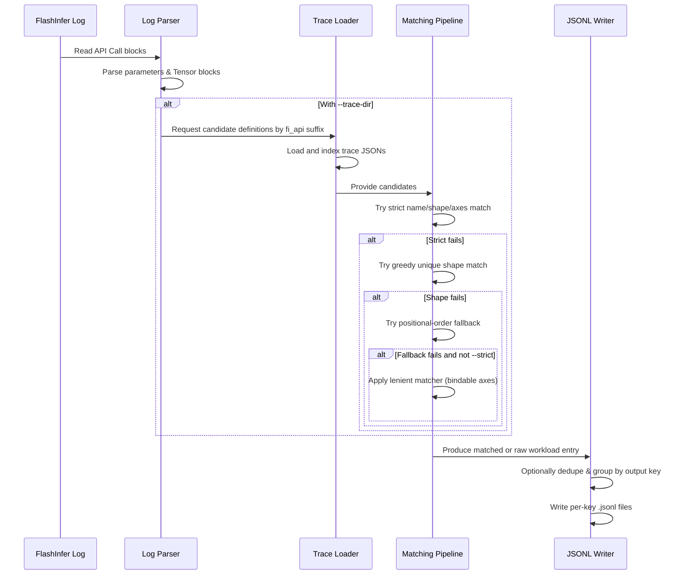

# [PR #425] feat(scripts): sanitize FlashInfer level-3 logs into workload JSONL

source: https://github.com/flashinfer-ai/flashinfer-bench/pull/425
state: open | updated: 2026-05-04T01:32:55Z
labels: 

## 正文

## Summary

Adds `scripts/sanitize_fi_log.py` and a companion `.claude/skills/sanitize-fi-log/` skill for converting FlashInfer level-3 API logs (`FLASHINFER_LOGLEVEL=3`+) into per-API workload JSONL files.

- **Lightweight alternative to `collect-workloads`**: no tensor dumps, no safetensors blobs — every tensor input becomes `{"type": "random"}` with shape/dtype derived from the log. Useful for workload distribution capture and template auditing; not for correctness eval.
- **Trace-aware alignment**: when paired with FlashInfer trace-dumped definition JSONs (from `@flashinfer_api(trace=...)` + `FLASHINFER_TRACE_DUMP=1`), each log call is matched to a definition — workload entries carry the definition name, named inputs, and resolved var axes. Calls with no template (or a mismatched one) fall back to a raw `arg_N` / `kwarg_NAME` form with shape/dtype embedded inline.

## Matching pipeline

For each log call, candidates are looked up by suffix-match on every `fi_api:` tag in `--trace-dir`. Then:
1. **Strict** — name match on kwargs.
2. **Strict** — unique-shape match (rank, dtype, const-axis consistent; binds vars).
3. **Strict** — positional fallback for symmetric-input templates (e.g. `fused_add_rmsnorm`'s two interchangeable `[batch, hidden]` tensors).
4. **Lenient** — name-based with relaxed rank/const checks (skipped under `--strict`). Catches schema/runtime discrepancies like MLA rank-collapsed K tensors so they still align to their definition.

Validated end-to-end on three real DSR1+SGLang B200 logs (~64K calls each); the skill's triage matrix documents how to read raw entries (template missing / rank mismatch / `workspace_buffer` aliasing / dim-order flip) and which patterns to grep for in `flashinfer/trace/templates/`.

## Skill

`.claude/skills/sanitize-fi-log/SKILL.md` covers:
- When to use this vs `collect-workloads` / `collect-workloads-bench`.
- The matching pipeline and what each pass tolerates.
- A triage matrix for raw entries under `--strict`.
- A worked example on a DSR1 B200 log (36,549/64,673 calls strict-matched after companion FlashInfer template fixes).

## Test plan

- [x] `python3 -m py_compile scripts/sanitize_fi_log.py`
- [x] `pre-commit run --files scripts/sanitize_fi_log.py .claude/skills/sanitize-fi-log/SKILL.md` — black, isort, end-of-files, etc. all pass
- [x] End-to-end run on synthetic log + 2 trace JSONs (rmsnorm, gqa_ragged): correct definition matching, axes resolved
- [x] End-to-end run on real DSR1 logs at `/home/averyh/fi_log_runs/level3/good/2026-05-01T{1933,1955,2027,2113}/`: produces 3–11 JSONL files per log with correct counts

## Companion FlashInfer changes (separate repo)

While iterating on this script we found three FlashInfer trace templates whose schemas didn't match runtime calls (MLA k_rope rank-3 vs rank-2, `workspace_buffer` aliasing `num_pages`/`num_q_tokens`, DeepSeek V's `head_dim_v` modeled as the same const as `head_dim_qk`). Fixes to those templates land in a separate flashinfer PR; this PR is self-contained and works against any trace dir.

🤖 Generated with [Claude Code](https://claude.com/claude-code)

<!-- This is an auto-generated comment: release notes by coderabbit.ai -->
## Summary by CodeRabbit

* **New Features**
  * Added a CLI tool to convert FlashInfer API logs and tensor dumps into structured workload JSONL and per-definition artifacts.
* **Documentation**
  * New guidance for log-to-workload sanitization, template alignment, output naming, deduping, and troubleshooting.
  * Expanded workflows and operational notes for workload collection, multi-node benching, streaming collection, and dump-based sanitization.
<!-- end of auto-generated comment: release notes by coderabbit.ai -->

## 评论 (1)

### coderabbitai[bot] · 2026-05-01

<!-- This is an auto-generated comment: summarize by coderabbit.ai -->
<!-- walkthrough_start -->

<details>
<summary>📝 Walkthrough</summary>

## Walkthrough

A new CLI tool and several skill documents are added to support converting FlashInfer logs and tensor dumps into per-API JSONL workload entries. The CLI parses level-3+ logs, optionally loads trace definition JSONs, runs a multi-pass matching pipeline (strict → shape → positional → lenient), and writes deduplicated per-key JSONL outputs; docs describe level-3 and level-10 workflows, pairing rules, and troubleshooting.

## Changes

**Sanitize & Collection Pipeline**

|Layer / File(s)|Summary|
|---|---|
|**Parser / Input Shape** <br> `scripts/sanitize_fi_log.py`|Parses FlashInfer level-3+ log API call blocks into parameter descriptors: tensors → `{type:"random", shape, dtype}` or literal repr, non-tensors → `scalar`/`enum`/`literal`.|
|**Trace Loading / Indexing** <br> `scripts/sanitize_fi_log.py`, `--trace-dir` JSONs (trace dumps)|Loads trace-dumped definition JSONs, indexes by `fi_api:` dotted-name suffixes for candidate discovery.|
|**Matching Pipeline (Core)** <br> `scripts/sanitize_fi_log.py`|Multi-pass matching: strict name + dtype/shape + var-axis binding; greedy unique shape match; positional-order fallback; optional lenient matcher (bindable const axes, tolerate rank mismatches) when not `--strict`.|
|**Output Construction & Dedupe** <br> `scripts/sanitize_fi_log.py`|Emit matched workloads (definition name, axes, named inputs) or raw workloads; optional `--include-defaults`, `--dedupe`; group by output key and write one `.jsonl` per key. Prints parse/match/write summary.|
|**Documentation / Usage** <br> `.claude/skills/sanitize-fi-log/SKILL.md`|New skill doc describing log sanitization, trace alignment options, matching behavior, output JSONL schema, naming conventions, and troubleshooting with a worked example.|
|**Level-10 Dump Sanitization Doc** <br> `.claude/skills/sanitize-fi-dumps/SKILL.md`|New/expanded doc describing dump→definition mapping, plan()/run() pairing, safetensors policy for structural ints, float→random mapping, kv_indices trimming, dedupe, CLI flags and streaming batch workflow.|
|**Collection Orchestration Docs** <br> `.claude/skills/collect-workloads/SKILL.md`, `.claude/skills/collect-workloads-bench/SKILL.md`|Updated docs describing level-3 default (sanitize-fi-log) and opt-in level-10 (sanitize-fi-dumps) flows, multi-node behavior, dump include patterns, SSH / NFS environment guidance, streaming collection (`collect_stream.py`) behavior, error handling, and PR/verification requirements.|

## Sequence Diagram



## Estimated code review effort

🎯 4 (Complex) | ⏱️ ~45 minutes

## Possibly related PRs

- flashinfer-ai/flashinfer-bench#234: Adds complementary FlashInfer log/dump sanitization tooling and overlaps on definition indexing and matching logic.

## Suggested reviewers

- Ubospica  
- yzh119  
- yongwww

## Poem

> 🐰 I hopped through logs by moonlit code,  
> Found API calls on the dusty road,  
> Matched traces, bound axes tight,  
> Turned messy dumps to JSON bright,  
> Now workloads dance in tidy rows — behold! ✨

</details>

<!-- walkthrough_end -->

<!-- pre_merge_checks_walkthrough_start -->

<details>
<summary>🚥 Pre-merge checks | ✅ 4 | ❌ 1</summary>

### ❌ Failed checks (1 warning)

|     Check name     | Status     | Explanation                                                                           | Resolution                                                                         |
| :----------------: | :--------- | :------------------------------------------------------------------------------------ | :--------------------------------------------------------------------------------- |
| Docstring Coverage | ⚠️ Warning | Docstring coverage is 45.00% which is insufficient. The required threshold is 80.00%. | Write docstrings for the functions missing them to satisfy the coverage threshold. |

<details>
<summary>✅ Passed checks (4 passed)</summary>

|         Check name         | Status   | Explanation                                                                                                                                  |
| :------------------------: | :------- | :------------------------------------------------------------------------------------------------------------------------------------------- |
|      Description Check     | ✅ Passed | Check skipped - CodeRabbit’s high-level summary is enabled.                                                                                  |
|         Title check        | ✅ Passed | The title clearly and accurately summarizes the main change: adding a script to sanitize FlashInfer level-3 logs into workload JSONL format. |
|     Linked Issues check    | ✅ Passed | Check skipped because no linked issues were found for this pull request.                                                                     |
| Out of Scope Changes check | ✅ Passed | Check skipped because no linked issues were found for this pull request.                                                                     |

</details>

<sub>✏️ Tip: You can configure your own custom pre-merge checks in the settings.</sub>

</details>

<!-- pre_merge_checks_walkthrough_end -->

<!-- finishing_touch_checkbox_start -->

<details>
<summary>✨ Finishing Touches</summary>

<details>
<summary>🧪 Generate unit tests (beta)</summary>

- [ ] <!-- {"checkboxId": "f47ac10b-58cc-4372-a567-0e02b2c3d479", "radioGroupId": "utg-output-choice-group-unknown_comment_id"} -->   Create PR with unit tests

</details>

</details>

<!-- finishing_touch_checkbox_end -->

<!-- tips_start -->

---

Thanks for using [CodeRabbit](https://coderabbit.ai?utm_source=oss&utm_medium=github&utm_campaign=flashinfer-ai/flashinfer-bench&utm_content=425)! It's free for OSS, and your support helps us grow. If you like it, consider giving us a shout-out.

<details>
<summary>❤️ Share</summary>

- [X](https://twitter.com/intent/tweet?text=I%20just%20used%20%40coderabbitai%20for%20my%20code%20review%2C%20and%20it%27s%20fantastic%21%20It%27s%20free%20for%20OSS%20and%20offers%20a%20free%20trial%20for%20the%20proprietary%20code.%20Check%20it%20out%3A&url=https%3A//coderabbit.ai)
- [Mastodon](https://mastodon.social/share?text=I%20just%20used%20%40coderabbitai%20for%20my%20code%20review%2C%20and%20it%27s%20fantastic%21%20It%27s%20free%20for%20OSS%20and%20offers%20a%20free%20trial%20for%20the%20proprietary%20code.%20Check%20it%20out%3A%20https%3A%2F%2Fcoderabbit.ai)
- [Reddit](https://www.reddit.com/submit?title=Great%20tool%20for%20code%20review%20-%20CodeRabbit&text=I%20just%20used%20CodeRabbit%20for%20my%20code%20review%2C%20and%20it%27s%20fantastic%21%20It%27s%20free%20for%20OSS%20and%20offers%20a%20free%20trial%20for%20proprietary%20code.%20Check%20it%20out%3A%20https%3A//coderabbit.ai)
- [LinkedIn](https://www.linkedin.com/sharing/share-offsite/?url=https%3A%2F%2Fcoderabbit.ai&mini=true&title=Great%20tool%20for%20code%20review%20-%20CodeRabbit&summary=I%20just%20used%20CodeRabbit%20for%20my%20code%20review%2C%20and%20it%27s%20fantastic%21%20It%27s%20free%20for%20OSS%20and%20offers%20a%20free%20trial%20for%20proprietary%20code)

</details>
<!-- review_rate_limit_status_start -->
<sub>Review rate limit: 0/1 reviews remaining, refill in 60 minutes.</sub>
<!-- review_rate_limit_status_end -->

<sub>Comment `@coderabbitai help` to get the list of available commands and usage tips.</sub>

<!-- tips_end -->

<!-- internal state start -->


<!-- DwQgtGAEAqAWCWBnSTIEMB26CuAXA9mAOYCmGJATmriQCaQDG+Ats2bgFyQAOFk+AIwBWJBrngA3EsgEBPRvlqU0AgfFwA6NPEgQAfACgjoCEYDEZyAAUASpETZWaCrKPR1AGxJcAZiWoAFIgMFPDcuIgAlFyImOrwAF4kkABiHmiIsACSGH58XlIeYADMkB74RMjwGASQAO74FADW5Wj0AFIAygDyAHIAMpABZgAsAEwArJFuCMi26LS0yMGh4YgA9LEY8UkA+j7wu+VEGtzymPRoCszccfhYGgzp2EqbTfAeHhtbOyRgB2Bjut7O9PpBakwMFIKLhUulMjk8mUSIUSgBqSAAQSsWTKFWQARS/UxnQAElleikAKI2Xb9boAcX6VIAalT+noALzFSIoGr4HiUMDY3ENZqtDo9AaQA5eRAaSBZWG8fASeBKZBXDzwIiwXB1Eg6vXoDw0CgYaiSZIQ/CfUS4MBilr4NqILgYAU0DCIRqQWiObjIX2xPxen0UGTlASIADckBRlHkYd91W4eBQyAoJF40nYdHQyAA3gAiXCybgkYtcYtUDC0FjFgC+9XUsHssDQFfWtDLFb9lCt9B8FBY4NgyWOQ2qXqUQ99TolfqQuFCAjw8HujE7uGwWfQdfBJBu6RoOFo8QwRAANJAPbCmBQs2JyIhkCi0B5sJb7pENEYAOrjlgRBWlgVwQCuaAMH8558PgPhwhk2S5JQ4JUNBYD+jc+ZKAc2ziJuXR9IgN7+AwbaTgwH4eBmkDMNQ5H5rUVy4dU8SbtgiDVEQ6B0dgprwGAtyvjwYQkNq5AcAYACMCqdCu8BiLeaBsHRDFtpuTR1M4lR/mMckKUp2DbAAjtgfyZJ2yT0bg5FDLWTQ3j25YkDekKIA6aAAB6oO5y5kAwshxmodbIBIzhRH+xQGaESncPgXEERaNE+NRAhQU0MrBrIrAkIZYCpumNDHtQ0h/iMCr9GQ8DsMpbBgOliD5jZdl1K2kBZukXn5g56zufe44ME0BKIO83C3AIXiQGq4FgB5sW4LytQdnWU3BOO9HrBQxniKp54rNmmAMDV8pGAAqhgLXjvQVGfMgqVgulQ3ggKVB1OgFBELsvSQMCWk6d9mIALJUvGNShNILa4G2R4CHQs7tlZ3a9iQCpwMko0fDR1RPC8kP1gwjjsN+WBMNC3H1EBL2QJx1qzNNyBMHaYiOo0zquje0PWepFPcGJEmubxCloKQakKV5WV8G9YMKdIN4XLxTr5iQXkqdwXho9IERcGcuxMDcHzJArOZgPrzDqDwGRNbQcZkLQYAEGAdvTR+6ok/wWCILINTjuIDD7vQWYfpAAAinQ2NJeKVDwI7+tB9AqxWYj5vgeBphECoAMIsLc2ybgc3XILUaRIYiqGQdBh4lTQmp7hXTT5tUvFNbcVCnlm8VxtDqDzKgTUeD4pv3Lg2jkLQf4GBYkDZ6wFtsK+IuQw4TguEYIf4AwyAGnu2DcLQpX0LU9EN2OE4JkUpQ/OICTu7c0On36G9EzUOEkKl/Gwj4vpM14LMLi6SwA4KGZg6f+roGoBVgPLA8tQVYV1hFzZEqJpIAAZ7L+CKMmCgvI75tmnAKK4LdnClUgI8Z4rxMZ3U2HEa+fwARYUDOsToABpLI/R+gaGYOPGA45rB2CzMOFSkMnQ+HKHUTURcGh0UUJDAIuE0AfyQeJEo014CEJoYkOhgljhxnwOEAqWACjKNQao9R+FNH/EEgwqIQDd77xrh1cSB8QRY0fpvIBABNYGgxhzDxsmaCe+hjDgCgM7eCOBHakHIG3fMZt2A6zgsIe0VoZDyCYEoKgqh1BaB0EEkwUA4CoFQJgCJhAonKBoDdFgbAahcGlsveiLhIByAUBklQahNDaF0GAQwwTTAGDIQoihoIvjUPMUkSxgIKhMNYewzhtApLFiWZPSwmIsjEDIBU/MDTnDyHCeRTApBEAGByCuRQ2BoKalvCQd6AADK+FiATHFuS4sEBNn4jySmOag8YvLq1HsgWA+B3o2ihJQWEJcEQoXyOfdEWIcRRyqPyQUFBhQIqItKMBCdwYnShm2e5tp1z3FuesW575PwkxeV4HwsIMD8Q8GjXhBN7BJ3gAcSGeikrBwrn8Yq/zTyuyIJdWqM1IC3IguhGC8AKC3JvDjT855Lz2GwD4AuDUMixIuG7U8+0yaJiAVcZgH9BLCWQFdXm/NqjJCCIZWlQjNgdi7PFRKG5koyjShlG86tOLIm2LVC0ql6LjQpnUKmd4+RiogPNRSuBbm/kVLCViL4OpoHeg9DwT1Mpww7GqX0AR5UvAppCc8SVkDGQyZGuatq403lTrgdOMpDZ1SLfcKQNRXX3V9FdfMEgy2XXUpqu6N4MX1DZouSyFZO18AEPge+3bLgHmluwCGJEgFEGwG7DAlcv58HPCLD0XElVm03Hyk81kkDduQN6zUWA7YO0IM7JWCdVbHlRkYcwqzTQVI7dTRBSgnjENLfwBCidGiVP4HwNMk1FIy3iNIAwUBej3Gte8mpnzXVgHuB4c4ix2IYDjB6VpJB1gin7ABtuP6DmXjoL+Iw/QrWMxWqQBZkA0TSQAGwAHZ1hgBQUYKkHl4A2ViTIxxaobnxlVWBrg/RgUGCWcWIwEAwBGBWGECIYzfj7EOMcU4shFnLKnmsjZ0TnE7Kafspj8HTmxwuZDQhI86wfmQ9PfouICC2m+bCbiWsrmQuQkiScARE72nzLcokJJySUhpHSRkzI2Qcm5HGoBcD0IRHjFBNsgAcAn82XPgpHM7UUALgEzTyjPXwfYFcFydxZnoIVRN0gQjqcaKky2EZeYJTwx+dYDdZBiloN2N+CjTT2GSfcG9VSwUwgprc6AZBwwBA0EtyILzJob2GnyWotzCwo2rLWeszBiw3gnYLZyFZGwvICL6LU6hlA0Q7nwUNZBEZ9lQObV83FeShqbQFRQFMPQYAdvN304VPz2eQPc26zhZVirII4GHvpbnajNB+W5CosgIXFQ7SVmFpUvNQCqNUs45WwglEXHHDDX54Tw5ADFq7qhKELqfZgzT5C3IOLsTs8AOAvJHjxBwqr4CF2gZcXAfL0vMW1EKjLdljjMa3GCZiW46zauSEmmnoqAjSV5AG7mtkEBKravfM7xGTvXDvvANQyPzgHnCqi7yqAQqKuvKfLAAQxi8iIFmOg8hjLwDMhjR1evyLcU5lTAIPIeCda5UURoFb02Zslo4+ibElXOq6zRHSsYab9v1yncIrrg5ZjMtKugL4Js55neWl2fBvKQyorTRxIgxCuojdGpSgrhU1AVIBZ7WP2+xtouGpquAScLBLYXz45xxrans76mqNQxaMT4NDH5TuZAM5UFNfq6AmcKwIF4GJmZMCZXe5eymTbBNgizM38QR7h5UHPGIRoaTxuwjr/KBN8ZzbpfnaO8UACW87U6uXyuuN4WYPoHgUglwwuQCuugcFwLAmwUOfA9Wq6vo0sWKyAvW+YLSpGuueKfIAsL2xGJu6wKM/Yam4QLWjKGMTW4Q/ABe9w1E8gBaGo/Y78I2rcKkBIWObBMEQ2H8iAyWCsVEWAs4u8yQy6uKAQWOEhFYyWLS+srcFMIBrq6waB6wH+CoKQ1QLBY+XuqcgYjiD4gCLSdaDavWN4dQoQDiLmaOQgPoGAHgLyFYfAvWm2AoWOFheAuOMqIuMc04VyrcTU6wV06wNht2yqK8sgE8H6WIX6FG42v6TKog6QSR3owGvy8UMIKckG2A0G/s7AcGxyUAmIiw+Y5A70UG2oRR4M5Y+A04XAtyKeGAAQvIPSm2+OWAkOqwGmDyewHOumZwtyCGWIFR9AVRrmuIVBsIzA5yU0RubYBA3AgI58YqbKkAuwuwuu2xkAnInIkAxY2xrR2xVY9gsg8oKs6gAQrR7RK28RQMcQfgHkqQTamIyUsgSQFAdGDGjAVmLGaInGkwPGfGBgAmu0zi6SyQWY4m70b8O6nAkApIRo8myyCG/SgyeMbwWMGwP89orMAB4CcMW6sAMybCHCXCBmimRm6y5SMS9A5meyCEVGRyMwGMIybiHy7sqAicFw+YCsEBVWYgu4TEAoGoTWcMYq+Jf8Y6gBECpJLyGQvEs4ikzinQTIhyZQCipJ5cHY94ra4KQYaceASKtQWKtOUogwoqXE0GSqAxHJuJ1h7U2aaAuau6bKeQxRziLS4WxIZIFI1ItI9ITIrI7Il2RiF8NMTUEODpkyzySe+2o4WC2ekZYAJinKZpXhcZ9CAYwhiZGCh43ovo1i8a6M/+TQoiwKo2LeyRzgyQdizitQiArKPg8gRqAkYAHoSgpSmEeUY2YEB4VRfU6RbKNU9Aei36zB92JAJeWYaGU6fEnZ3ZyQnQZIvyogRKbu0grKLBkAlInQc0HYtWjAn4HklAUQcqW6CqFMZAaoI4XesIduaik0kM5AdA+YO6goqE7QWQ0A5uHw7sohmWyQSAtoJMtBXJaG4+eJo57KjMb+VAQRSeB5YAUElytpU0WO8xSgRQuCMO1Q801WgK1ZtQ20WAOM85xMNE6U+uc0mieIeiQB0Mda/A0IkRd+PEvAG4j2cpHMQC4guoYYD8fpkWgZMWIcZ0QMVguwFImc/QZ0IcVILy66m6lcku2klxfIuMPZ5qSqty/yGAAAVEqQeLcuRSZUWeGIuQ+E+ImgGJbNKtxAqOURPtOWhKnK+ZkPgLOhTKpfvFuqBUik1LkXOHwP1GhT5PdNoJ+BAZTH3g6bsNYnpi8h3GBsgN8QKFgVeTpRTFcJCCEP2cnnQGol8oxENNqK8YKX8ORZVtmJ/roclNhmHskOTAcFRF8grI1OJFak7KDn1NUhbIRcKUBvWY4sONINdAEYgkhg4k1LWaTHBbikoGaObNsIJv7NUF6YFTKOkNHArHedKvcNBdUOOLYUdMkK6e6TKCOCzrciSeRLsCFWqJeClXESsgkSjkBrUH+mkYBj+uEqBqFRBjwAUbUbBuIPBmMb0H0KDHIk/GhiTJhs4WklZhGmjgBtiZQqMjKaAnxUsAqeROSXMlwnGu+lPE8dsC8RCu8Z8d8b8cmqyXQFwGxgABzsY8acYTD8aCbCZVI9mwk1TwlSYwhcBAwlWOBomKYYkqYDKY3DK4kDUgKEnsxLDE2UkLJS0fXGb0lmaOCNLMn/GHJQ1nR7zOIY3kKm4jJ4m2i/x41Elq0sIUnzK87ikI21RXAiJiKMB5gnmbi5bQpRwgSXjugSbyKKJpmlC42t4BBLFio5naIVAiEHglKcoGJKJFAmK4JDBx33IaITK5k3DCFlm8JpkmJZbzT+BrU8TR33AlbzVfLaSZg3K2FejUwSmrjJC3K41PUrhV0pUFgPyNCMTzTUB5puHqp0VcRJB+gOVri0CkCcXHb53uy50QD0ReRdk3Iq1k6QAjAEVbpUU1DBykgpCg2ZBOQBh+Gnn+B0rcCRDywTHZG1EWxZYeGiIiyIAlYKxqH3AOwiy9krUDnNIkA5o8VDC3L1ocC9Aw4GWLxPWaJxqQVZZe3Ar13ANN2OKNBEBxBJB1bIp0rMBwwnncAdgxmEF8l1ivwjwfCLm/2eziQDk3gB1IgMLaUKrEZ3lgB24KC5A6i7gkxXnbWVw+i7iXJAK0Uh5KpgUniuoBEqyblJRgA4XEZNZ+xF4izy45iygpR7Wf5zbFm7oOUDFAUHg+GfyND+IUwN0/rbyB5gabKHzilvzlzZn51aKYR5kw7fZTS2BjDKoCDvZcSbjF4bpH3pZ2PghGhej5jBa5DD1d3kpfhJQaAeTUA+oHFHFWAkidBUghzFgw4tmiBsryB+O8NegRABGhOl7sOFpKo+D0qQAan9Bam12ey4D1jpjeVtRKpBw0SdDHkkAMhWD/nkWRRNMJhUA0S2gVqoN1DrCUAjioorS0ASREDrDmP/CWNr5lYbaRPzmqh5G8NKDeh0DvVGaJEkxFyeipHkZXNZFA3ga+g1EwbFGQ3HLQ2w1DCobExKNYao3G3Z6EaPN0DrAvP+zQkQ0nS0aPHPFaxvFTQfEfhfGUAM314Aks1jBjDFA8bSRjCcY82QngaQuC0SYInSaQDi3niS0KZKaYny1W2K0J2eNF3q3zLUna10mbIMnREG1ZFM0fOFLLCck/OL5tCAJ3qOzOzDXbQLU2WGnTZKosOoRl1oJYKz03BLh2WNC4oVbs7wgG55DY5QQkDirKGWivkVmLgYqDDSH2YHgT30P2BoChjA4RilaCAIXH2p784jUCPYwvykAr5uuf5KgsrFPwUPxBp8xKrhLWLt1vxsRAairs6HBc4vL1hi75j4FCJL4G4u63DSoQ6GXtGmX0DmXGSlsavGEtI4ghwbMUAZIUy1CCA0PtOys1bcohsBGdjqy4oOaNCLxR61FJj6kopcQeQQ7TjFBjAkq3LTjsb72VYdv+tWUtbUwhj9mGNbwIBTQPa5jtr1OtDv4t7hSjUQ4lgoxVg1iIGHYXZALBAfgRSD3balguTXuPvpFHbFig7mRVhLYaAXbo6Jru01BXoJQOgqgYXWM0DGFsHNuhCzz6VNASC7AM6KTSCu1ioodod1jhAUAADa6ZAAujDvIbUZaIbvjdc83PRGCCPiirvvXiwCFII0AnWgLM3XOcrFCEdY+TXi+XKEnqq005qUqmw205BbKEbF8M43hJDPJbiB/dHF+ZCGcp8KoYm+YuNhs6sRQf3Ew2xZQBxa1ZqONHbPLFFabINFmuWFbAERaVRIGF6medkaFhOSacqNQLAKuuoq+paX0IMLcLIOOn61mG5NUvnDFaKdIhqAEUCu9JXSpC2iAjHd3bbfaL3UHMwClbyB3P4JUths6+Mva/QGmJkJDJI9dFa4ASAzujCcZNsEqt1cQUkxBe+trZc99Tc2rn9RkUGCBn8g4xOfkYUVC1DYhgKCCwNuC0RuN1vJQMkEzTbGOEUsgKK+hn/f8xA1iQrVQsy9Ymy6TTCx9ZTWyvC7oYi3TaiwYPRozRi6xhxiMKCYS0JlCaJqS8LYiWLRLcwFrRib0vkmDBOQhAopEty+97lLUimol/rbsqzkRpkh0jkt0oYED0K7RCUmD2UhD8S9UvEv2DQ14PzZdbs7y/D0oTIkj9kl0kEn0rLbt4y1QrjTvfKQ9WSU7STZrbS1PHdzVcbUbdRoTzFR88pgYGMCUCMFJKbfYpDIgisWsYUJQfQV8rUEmnTI6Z8IAJgEkihApDGqFZVZiXfbsIAQzTWpzwpJFMvaNXbQvD0IwTGAD9MFvE5roQTh4IW+yQX5k4kZFeDpryXwEDEWAZ0WwZcWYZ/QSWDMYqnIqCNaQCWYJnRcvCWWveWAtQtMJWajA4VwZFb8dtlsWjAiWMN40AVg6wVIVgbW1EPViALOoqKjNEkIBwlQARHZ4gXZom2PfZNAC1f4YvMtBgIwEwYAAAnBMFJFSH8hcCn8kFliHIISNkb5AIACgEGdkApQAQUueoBo0TkQ6DC1hBLEeUMVPH9sUrB4ZsCsTUAegVbkS1S8jDR/4ShC3Ee7J+UcSeJjSU8jfy6QhFSAAl0AYBgmIkqALr0FrjJAG4DBAgIvTOqEFjgi5QtqEHE67hrGK9FJkPyH5j92M6ZYoNJCkg2AbkbMOfpACyzdB9ETcFfuv0jKQATEAQPpmuwjAH8ayqvKbjcDIYMVKKR4aihuUJhfIrs5AZpOpHsAMUfkefITCQGd7isrkqpDqs1BkRFAW+OoRxNx2go2N84iOJvnrHuCt95QjhYlAEWnC2ZxG5GMcs1GNRd8eyPfIBgtXWA7ptIjbCmFdXAZfk2Gd5GvASG27jg7eK5FNBgEyhoJrEcYJWO63rC3hZ01bWjIPzF4cYx+6ZTjIQIMCuUb0z9RSENW9AjVW8q+WED/1byoBaqWWQjBAA7jpBoI9dLKtRxuqjgcwuaH1FVzEFJAoBjiNtnQGdL3wrgd4ZIPFGnDNsBQhlLaMZEcqoCeIrgxoAP36RxCx+KCMAGMA4xSRUhW0FurdmQBZYrAJAVCGEKabrlDqD5NDCVg27uwvyqFSyCeVxjnkIwOVG8iHUtgfYlUWPaMISlPD3JLiGgBRgIK94w4f6p/D4DNkziKVMQuwUkN0BBiwNsm0AUkLA0zgQioRARUSqHyDK7B/w3QGwMwk6DZNM4VIXYAACESQylNQWE14Fgc4wH4H0KeWcAWCd2bOO8vjjLTWw+Q55O3uEmqDEFbkzCKkB4k5AshMQClAkU3GggwhR47YcSEH2NjR4f0WOYtGgCdhQglSVyBPBlEmGy0xeWLBIWMBGCcYiB2YcoXL14T+AKAs+cKvcBOYMiO+gkfwf+iQA5C4Ex/aRHuETgv1YQWWaAFIgZzZg7YtUK0Y7y/rNIg4TQesHUAwBcAtcvIcvrRBHgNwsAviFnCoJ4ibEcwTURfHHUIyHNHw6oUPEMA9yRCeyTAHaLRCbbQFTE0pQ0B4ACBxjdg9aX6HiFui7AiA5XFbEAnNHWDkg23BSEQCDY7tns75WcMqLpYqZJgnGOYZxjH6LDFgQYNwiTGDj9QkKYHIBGwxQEUxtocoZouvSUFCRvOLyI1K8SlLoVpAmFVsWBDBArkCQB5B1PWXoApBOgzvcwZG3KB6JHE/yaCNBXGF8ArsP+StGUJNZYde2dsOMI3m275wi2sIWqpsTSaKseIE1TIDIIPBFNjokbBEVFiRGSVpKslXoPJUUoEi74ZoTIrUH4LNJZ0+KQypZQVgVtjKl2OOhkQ/DWhxy1MPOiVySp5kB6i4y8ANSyGRVfINnSKNgNVFj9igJQMYCgin5eQZwZAiKg7nJyeU5QQKXyvaWAYtJCK4KPKsVT3RlUbOlVU3gXF4YeQOJYUD8OZHAJkBc29DCIvjQ+jiBUoYgVdI2XbguMswO1K2EaSciMNTwMzDgkmw7Q3gbJGMS3GswE6YBKmifSgMMPolaZkqIxL7FTHyGbhZANUDwIAkyq29AEcdcSVFXqDOAmuukHiaYGKATBZhxQdjKzWl5m0HEiCLLG1XkAw1/yXsH2HlBgzAgWuVqeMKDlYzXAf839IOHaIEQQFquZsdQGC04hthr+sE2cuZB2oVZT6fCcahXlkH7lZ09eOCrFPE79kKAa1ZcDBi2qLcdqynHgLqOgq3ElB8dSgNCH2B6MXkiOdnk9WOnOURiH0SoLyH3xjt7qkCK6RQBeonBbppqSGLciMpGUEo7w3jg+QPpnULwPEaiGKhD5ISYsllZ8l71azPVUIUHfcWDHvLHV2AfY2ltgMZ44lmeGXWUg7Q2Cc8NaHLXnr1VrCiwmawvWhv2PF5gApeBgFIA+VwD+JUItyDuupldQvJvJTjSrCQkQTY1eyuNLeNUNFTKt8gFQYOi7nDoCQlUtQSOkHQpgYhQptCeMknQ6FthU6VAwxLCizredWpysx5FYi8Z9ih+rNfidJAmBjBtRT4piLwjqEbgfUInCun3WS6XgSsMrarB2mQJ9EKYaYuEnaKmLpcQEWXfuiMS2aEwGRjozAO7HCTACROw9ccKPQcQT0qu9FGegwkzFjN467jRiUXT0zdIN6W9OoKz1dB70YcbhHdMwCRSFVEaNESaeV0TkBFcK/Zdbg5Vgj2gdWlXPKAaGeyNDp6ZUcYgjCuBZZmEJAeQMp19EaSIGEABhEPB2iwMIAWBISEKCq4LyuyjgSeiPTXkeg+qqOG8Fjh3kNy15X4jCAcAjCxoHpB4DbgKTwCEA7BXyGMe5O04Z9P6EDKBjA33m3BSACDJIC8h3wSSYhUw0wE93TJj9khrlUFpQwRhWAyGyQaSOsH8b+ULqXAJ1gZyP4Tzp5fZanKWjXl6IHYLkNedRAT7ADU2nOPmBwGACZtKkWgPmBoF1x6Becr82gKECkAQz/SUM2kChJkpyUFKSlQpruRogrM/JX5Gwr+IoDrAbAmjfMKIvM7hVwZ2EygN6Gmq8IGO4SOXNxDACdRnEngu3F61b6ikwqG/VBAqGn65wEYiCTlJPnIF8wOxsgRPE6x5TVtDhjWH2ZuAVihofkFsFUHHDKjZSBxKCUfoJKKkGBM4j/Q+GOyMl2keIiE8SrSGgA2BMQWI3YFwrpF8glAFYKhovnCSIJ1FSqEUI/UATkAiAUuXya2OhC+DaAARMQs6z8BFcpS1KWEFoOnSESM6KiBWCJ1wSnRYhpgQSeqOKCjjwSM/KhvQBgUG9Sgm0+yZXCOFJQUFLiy3N9KTLMAXkNve5IM3rGD4VQNwPIanAoCXJnJnBWEK+MXKLLCRvmb5qIFEzz1F6N4KkN0E6BACLgazZ3k+Hx7DKxU+aRAB4FrSfLGxKAivF4EvD3whA6gM0JmNTn9yygy4Y7JxDaH4NRE0TJcC2VEFNR6I7aTeMop6G7hnUrYhCCnPUhpygq4FL5Cm1KFaxnAkHFefiv7lo4/F4vEYNJDmETBgl5RIQDCsgUiTPR4S+fmkycyNtgEdtAoVCA3gkwSsSChySnSfolJHRGQvIRcrrAbiRILyqHvYlbxfltGWMMAL4IkCv5oQQ7WQhACQA0RWa0kMfv4wgAJQaIqCDUQn2vS8RuhSeAZvWWGb/lOIequQtQA1R5C1l4QF5EsVYp8FPlPGTDJ8qQa0qxghU4cexm1E2F5pD8LLGozVL3YpFZXEvmCAnmH92BvM08LkMrT7QvepsF4DKK9ydhYAqSwiiqnaoL5R8z9YUcAPN6XgdeokUQDciQDJAARIcTEJAGLWkNJY4jW5LTF2BUAOxdATkCkDJGmsm5oHBBE9JnlIB81fMZtW1CagFr94xAKgKQ1SXVMTyX5IdfLlgTegYu/gINmKhxHqQrAqajwP+FbCSLh1tAZhCyEKyMR/w66twi8g+Fbk4wWYW7EfkiGwhOIM2CAJEq8C99KAa0jagYmEamtEyyak2aqM4xDj8WAygZg4zHjWBYFe9IYC6LdahwHKnQTAa6iKxLQpu//GVUVxWbAYEIW2A7l4yTyIJqgEgYVb/12mYAhhWAFiS7g8iDtRY8UEdk3LoCSEOo/EWRAc3ekPx7ZqcT5awWcJWp6AK1M/oyXw2bhzygYQBSqJ6VgKSgKCYJe4CEqOM0NGqZABMEADIBOxkJGl4FyXARqcILa5fJtxsIHNDJxoh2sIcNm11Kk0+QZNDixYbJmuTyYFMhghGeYA4ECZIBHeHsfcOPOi4QFL5IymwP4zU7sAWh0q46LgCK5w42ADJUkRMWWGwreIx5QOKNPM21Qc1iCeYOzKYIUVryeMGUI03rU108ZXyDyJ0z/VUM+AtyKeHVungNbW8smIgAfSfyUceITAx1VmGdV8hINxY88A7y7oBAquP8wWDhwBVEBoYjYtuAgNXyexvYXMP2FEwwDyB71W4EerBpykWySgTK4qbL3oBZYqQj4X0KSEeXcRRVG6AKpXDjpwSxy/sAuJDC/JBMZs5FKtk5xqyCxd1+YWKeJGdyQBEpWBKcFVoh1ANVpbEcDRMoCimcm10EJdX8EB0xcG8MZG8W/gCm6S6IF6UQVBBHAiRy+N4X7fpQ5zpsWwowgIvLP7zVoid9fAdJ/hl7OIcw1TRKHLw4H68IV3dcoOQE0XZgEosDVLFBAdANxzQyiehsISqaNcZsStO2iXKWDfChy80rla0tKDZ1qlmMbgGKhHLIYRdzqfHAhCQGtTHFdOE0EHFoDyBriHkY7SplylDjcpwS4gfMWgJsTTRtsnoYLQk1FdExtUCgZ51SDbNcAGamOirDVhTQbWy7arKKRi37h+A8U1CFAuVi3blmD21iZs0rk7N1sXmSIXiGoy15zOz7JuIgjwjBwNu6AGlHqT92LcS8PO5AN0IxnolB+2M7Gt8HcaTJDuRM9llrVJnC7yZS3NGnJuplD8GVHGYoFJBsznJxGXQiTALOmWt4v5vXNTCFB4g5KdZaCLLH0yByGN66imtjZakkjVt70WCjyZuD0o8RZCNOvmIwvumfz0gbRFbKSn+2/LtA9O5gZVi409DbQikeQDahXZTNNskAQAEmENSrdtZRvBVkfkkBk5TbKBSp6rh9gFAsgEgOftnALsMHJeWw6od0OlyXnIh2rrWEzJ5HNUkxq3X5gROnWvYWjMXywyvKN4RTm1IuAOC9GtaUPXnvfwHho9/nOPetCPBoAIurATcIsxawYrl2VdGbD3SS45dbpVXENGzCN5t7padPIHmElB63yTMWyKpFDyRLj7iec3NbM9CZII9oS1PTpLkh6QGAgefU3AGhyWCDqUQQtOgL3XJWo96ekAQSWgBGAT8tN0keDSQFZoTAqIEwMfrQFZokAkhEwaSAwGKCs0BAtAdjGMFoC4DWamRiI14aB7sYfA0kF1hMHShjBWaGokgBEfYwoJCpI/YoGgBQQCB/DtAaSEoDH6cYGAqCFo7NEB4hI2p6gJw4gBcNwl3DzsPJD0ZzC7AMt388qsNA8MwgvDBgQsAYEgBHEkAtgHEbszoAzw0MVgCDnQHOIPQmoV4JYyscQDdBoQoQCohgH2Pjqjjyx4sATGjSXhs4uq0gKckUUfh5IpUc4oseWN3HZi3ehiUMQqB6Zvjxx340cQIAjwPAKQYyHK3OKCTbj4Jo4g0y3Slor10MdeJvAUiXhEA5xMfmCcgCNhjjjYRE8WGhKSKskuAZ9fNPPXuBUtlYXwDceOPFhvK/EWgOsfWy2BrjXwVyMyfPC0AbAxkTE/JFGGIBM4Nnc4lVl5N3H+TgpjAHSa8DinRATQSU9tGlNHFZTQpuZRVqVNDRuThx5kxJAbi0Asgr4cyIgBFPnElkpJ+ELgF1NNBiBDgU0Lia4AEcCTPxpE2SZs69AhEVpxfrMVbz2mjsBJv4x5pdNoQDJIZo4lHItBJQrT9plxOZ3oBQBs4SgCkx0kbUIBdQivcSOTyaS8kLQr5ceMGaRNHEVGVppwZlJLOemdWwdD8PaZ9NsArT5WuMwSZJPumozXp5U42YZNHEFTo+5U9WfBMsmwzqpyM6WeLAxmSYVp8suIHpM31nARXBWOhQEY0Aiu5mTRGQNaKC9SAXAcVspNmIbt3GiEKFIFlhSlALdFWC0nHp4MaAhzvx4sOWerCVnuI95u4y8r4brosw+p9U8OdrN6EPADZ309WDnNeBFM4J9s+CY9PDnpjPZv0xvEeM8RnjygUgG+aOJpMdw4Zg47+YfNTm4z1YTE4hYUAvGgqe9CYBoBQQoIAApBfjshFID1guY6OjJ4QwlCtJ5aGD1LcmoBWaKCCi9RbvOInhzEBZ4a6itPPqoiDx7Eyp19CV7YTQGKnVvo2hHnxAiANsg/D1RDq6YnF+KQJc7NPmjiL5y8GheLD/nkoQFps9WEkuinwLvxyC78egsPnYLwFo4nd2NOKgzT6LQc4JYfMYXOIY5nC3cbwuiXqwCZ/XRWHoBwwcdyQQjEacbgeWFue4L+NXi/Ldwr0jTUJlrF0sTn9LxYQy0QGMumX6z3p5y8WFismn4rmIV8PuLQw2Xljdl5Yw5buNOWLLRxboOmHCSdAmAfYcU4C3+JeXOzvl8M1Ke8uBX/+0c/C0cVCtjRwrIDKK0XrKsZgHAwiRbllGSsyX6YaYa/KNMyvGWcreVgq6EDrOAXirLVky3gG6A+BOrk5Hq9RkQCVWYy9fdgLVcJPHHiONpjILgFsD+mVewVo4gwE4w8XOMtAfwygmkgCBigdAdKBkZGD/WfAEwNAC6zAV+A2j0kYoLQHaMoI0A7GaCCP3YzsZ0jaATjJUekhg38bgk9G2MB8DVnSrH12wP2atPhqx+YCvFgkbH6s0x+AgHwAwBSNoA0bAgDmyMHYwkABAkwdjBPx8BtHWabQTjAVNZojA0AlssI2MDQAlGSAIwHwOxgVscYuM+NxTESbsNjGswExygFMa4m7ARjthoHtj12C3AB1GFkgLMdhB08SwtpqwAomtiYhcAxAoY7QC2PqBs4O0KsCgn1tW3b5Nt92w7ftvm2Dw+gIAA= -->

<!-- internal state end -->

## Review (4)

### gemini-code-assist[bot] · 2026-05-01 · COMMENTED

## Code Review

This pull request introduces the `sanitize-fi-log` skill and a Python script to convert FlashInfer level-3 API logs into per-API workload JSONL files. The script includes logic for parsing log blocks and aligning them with trace definitions. The review feedback highlights several opportunities to improve memory efficiency when processing large log files by adopting a streaming approach for both reading the input and writing the output. There is also a suggestion to remove a redundant helper function to simplify the code.

### coderabbitai[bot] · 2026-05-01 · COMMENTED


<details>
<summary>🧹 Nitpick comments (3)</summary><blockquote>

<details>
<summary>.claude/skills/sanitize-fi-log/SKILL.md (1)</summary><blockquote>

`103-122`: _💤 Low value_

**Minor documentation clarity on pipeline ordering.**

The phrase "For each candidate the matcher tries, in order: 1,2,3,4" suggests all four passes are attempted per candidate sequentially. The actual implementation (per `_select_match` in the script) exhausts strict passes 1-3 on **all** candidates first, then falls back to lenient pass 4 on all candidates. The end result is the same (strict matches are preferred), but this wording could confuse readers investigating multi-candidate behavior.

Consider rewording to something like:
> The matcher first attempts strict alignment (passes 1-3) against each candidate. If no candidate strictly matches, it falls back to lenient alignment (pass 4) against each candidate.

<details>
<summary>🤖 Prompt for AI Agents</summary>

```
Verify each finding against the current code and only fix it if needed.

In @.claude/skills/sanitize-fi-log/SKILL.md around lines 103 - 122, Update the
documentation in SKILL.md to clarify that the matcher performs strict alignment
(passes 1–3) across all candidates first and only if no strict match is found
does it run the lenient pass (4) across all candidates; reference the
implementation in _select_match and reword the "For each candidate the matcher
tries, in order:" paragraph to something like "The matcher first attempts strict
alignment (passes 1–3) against each candidate; if no candidate strictly matches,
it falls back to lenient alignment (pass 4) across the candidates."
```

</details>

</blockquote></details>
<details>
<summary>scripts/sanitize_fi_log.py (2)</summary><blockquote>

`452-481`: _💤 Low value_

**Inconsistent `null_value()` vs `None` usage.**

`_build_raw_workload` uses `null_value()` (lines 457-458) while `_build_matched_workload` uses `None` directly (lines 478-479). Since `json.dumps(None)` already renders as `null`, the helper is unnecessary. Consider using `None` consistently throughout.


<details>
<summary>♻️ Suggested fix</summary>

Remove the helper and use `None` directly:

```diff
-def null_value() -> Any:
-    # Tiny helper so the JSON output renders ``null`` rather than ``"null"``.
-    return None
-
-
 def _build_raw_workload(func_name: str, log_inputs: dict[str, Any]) -> tuple[str, dict[str, Any]]:
     """Build a raw (unmatched) workload entry keyed by api name."""
     record = {
         "definition": None,
         "workload": {"uuid": str(uuid.uuid4()), "api": func_name, "inputs": log_inputs},
-        "solution": null_value(),
-        "evaluation": null_value(),
+        "solution": None,
+        "evaluation": None,
     }
     return func_name, record
```
</details>

<details>
<summary>🤖 Prompt for AI Agents</summary>

```
Verify each finding against the current code and only fix it if needed.

In `@scripts/sanitize_fi_log.py` around lines 452 - 481, The code mixes a custom
null_value() helper with direct None usage; remove the unnecessary null_value()
function and replace its uses in _build_raw_workload (and anywhere else) with
None so both _build_raw_workload and _build_matched_workload consistently set
"solution" and "evaluation" to None; also delete the null_value() definition to
avoid dead code.
```

</details>

---

`426-429`: _💤 Low value_

**Unused loop variable `log_key`.**

Static analysis correctly identifies that `log_key` is not used in this loop. Consider using `mapping.values()` for clarity.


<details>
<summary>♻️ Suggested fix</summary>

```diff
-    for log_key, def_name in mapping.items():
+    for def_name in mapping.values():
         named_inputs[def_name] = {"type": "random"}
```
</details>

<details>
<summary>🤖 Prompt for AI Agents</summary>

```
Verify each finding against the current code and only fix it if needed.

In `@scripts/sanitize_fi_log.py` around lines 426 - 429, The loop creating
named_inputs uses an unused loop variable log_key; change the iteration to use
mapping values directly so it's clear and avoids the unused variable (e.g.,
iterate over mapping.values() and assign named_inputs[def_name] = {"type":
"random"}). Update the loop around named_inputs, mapping, and def_name in
sanitize_fi_log.py accordingly.
```

</details>

</blockquote></details>

</blockquote></details>

<details>
<summary>🤖 Prompt for all review comments with AI agents</summary>

```
Verify each finding against the current code and only fix it if needed.

Nitpick comments:
In @.claude/skills/sanitize-fi-log/SKILL.md:
- Around line 103-122: Update the documentation in SKILL.md to clarify that the
matcher performs strict alignment (passes 1–3) across all candidates first and
only if no strict match is found does it run the lenient pass (4) across all
candidates; reference the implementation in _select_match and reword the "For
each candidate the matcher tries, in order:" paragraph to something like "The
matcher first attempts strict alignment (passes 1–3) against each candidate; if
no candidate strictly matches, it falls back to lenient alignment (pass 4)
across the candidates."

In `@scripts/sanitize_fi_log.py`:
- Around line 452-481: The code mixes a custom null_value() helper with direct
None usage; remove the unnecessary null_value() function and replace its uses in
_build_raw_workload (and anywhere else) with None so both _build_raw_workload
and _build_matched_workload consistently set "solution" and "evaluation" to
None; also delete the null_value() definition to avoid dead code.
- Around line 426-429: The loop creating named_inputs uses an unused loop
variable log_key; change the iteration to use mapping values directly so it's
clear and avoids the unused variable (e.g., iterate over mapping.values() and
assign named_inputs[def_name] = {"type": "random"}). Update the loop around
named_inputs, mapping, and def_name in sanitize_fi_log.py accordingly.
```

</details>

---

<details>
<summary>ℹ️ Review info</summary>

<details>
<summary>⚙️ Run configuration</summary>

**Configuration used**: defaults

**Review profile**: CHILL

**Plan**: Pro

**Run ID**: `2a87f07f-f725-4d40-9b19-17468f43d559`

</details>

<details>
<summary>📥 Commits</summary>

Reviewing files that changed from the base of the PR and between 40e6ca7844b514eb4b1c7edba6d6a7377df57870 and 20a49508177e85ca59d8e7151c38bd62d9688859.

</details>

<details>
<summary>📒 Files selected for processing (2)</summary>

* `.claude/skills/sanitize-fi-log/SKILL.md`
* `scripts/sanitize_fi_log.py`

</details>

</details>

<!-- This is an auto-generated comment by CodeRabbit for review status -->

### yzh119 · 2026-05-01 · APPROVED

(no text)

### coderabbitai[bot] · 2026-05-04 · COMMENTED

**Actionable comments posted: 3**

<details>
<summary>🤖 Prompt for all review comments with AI agents</summary>

````
Verify each finding against the current code and only fix it if needed.

Inline comments:
In @.claude/skills/collect-workloads-bench/SKILL.md:
- Around line 123-125: The incremental-sanitize examples call sanitize_dumps.py
without limiting appended workloads, so they contradict the text that each pass
should collect 2–3 workloads; update the example command invocations of
sanitize_dumps.py (the examples around the paragraph and the other occurrence at
lines ~171-174) to include the --max-new-workloads flag set to 2 or 3 (e.g.,
--max-new-workloads 3) and briefly note the value matches the “2–3 workloads per
pass” guidance so runs don’t over-append between batch-size iterations.

In @.claude/skills/collect-workloads/SKILL.md:
- Around line 309-313: Update the PR artifact requirement to reference the new
entrypoints: replace the instruction to include stdout from
`collect_workloads.py sglang` with stdout from the current workflow (e.g.,
`collect_stream.py sglang` or the `bench_serving.py` run that drives collection)
under the `## SGLang Collection Log` section; ensure the text explicitly
requires real ShareGPT inference logs that show diverse `(batch_size,
kv_length)` pairs (and call out that uniform tiny KV caches like
`batch_size=4096` with 1-page contexts are synthetic and unacceptable). Locate
and edit the sentence(s) mentioning `collect_workloads.py` and update example
commands and expectations to match `collect_stream.py`/`bench_serving.py` so
contributors run the correct tool and include the correct stdout artifact.

In @.claude/skills/sanitize-fi-dumps/SKILL.md:
- Around line 113-116: The fenced code block that shows the two path lines
containing {flashinfer_trace_dir}/workloads/{op_type}/{def_name}.jsonl and
{flashinfer_trace_dir}/blob/workloads/{op_type}/{def_name}/{def_name}_{uuid}.safetensors
is missing a language tag; update that Markdown fence to include a language
identifier (e.g., change the opening ``` to ```text) so the block reads as a
labeled text code fence for better linting and editor rendering.
````

</details>

<details>
<summary>🪄 Autofix (Beta)</summary>

Fix all unresolved CodeRabbit comments on this PR:

- [ ] <!-- {"checkboxId": "4b0d0e0a-96d7-4f10-b296-3a18ea78f0b9"} --> Push a commit to this branch (recommended)
- [ ] <!-- {"checkboxId": "ff5b1114-7d8c-49e6-8ac1-43f82af23a33"} --> Create a new PR with the fixes

</details>

---

<details>
<summary>ℹ️ Review info</summary>

<details>
<summary>⚙️ Run configuration</summary>

**Configuration used**: defaults

**Review profile**: CHILL

**Plan**: Pro

**Run ID**: `72f618aa-8757-4eb7-b60b-a7c4eeedf351`

</details>

<details>
<summary>📥 Commits</summary>

Reviewing files that changed from the base of the PR and between 20a49508177e85ca59d8e7151c38bd62d9688859 and 6f1af5ba2824e596068453a0b49d1de97c10de9a.

</details>

<details>
<summary>📒 Files selected for processing (3)</summary>

* `.claude/skills/collect-workloads-bench/SKILL.md`
* `.claude/skills/collect-workloads/SKILL.md`
* `.claude/skills/sanitize-fi-dumps/SKILL.md`

</details>

</details>

<!-- This is an auto-generated comment by CodeRabbit for review status -->
