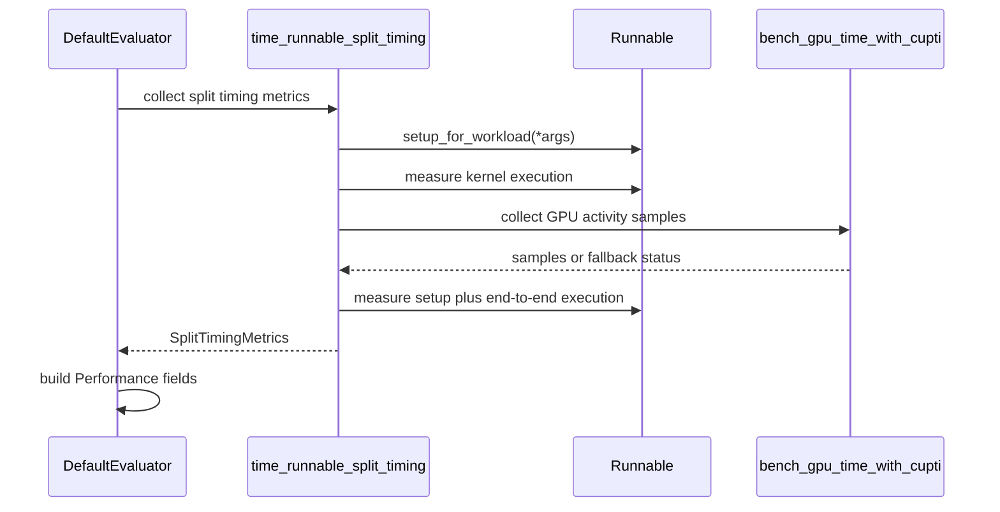

# [PR #427] Add setup-aware kernel-only timing for benchmark workloads

source: https://github.com/flashinfer-ai/flashinfer-bench/pull/427
state: open | updated: 2026-07-28T14:04:25Z
labels: 

## 正文

## Summary

This PR adds an opt-in, kernel-agnostic split-timing path to FlashInfer Bench.

It lets a benchmark solution separate one-time per-workload preparation from the hot `run()` path while preserving the existing single-metric behavior by default. This is useful when a Python entry point includes layout construction, workspace or plan setup, scale canonicalization, JIT/cache initialization, or wrapper-side dispatch preparation.

## Co-author

Core split-timing proposal and initial implementation: @yunyang1999.

## What Changed

### 1. Optional solution `setup()` hook

Python solutions may export a top-level `setup(...)` function next to `run(...)`.

- `setup()` receives the workload arguments used by `run()`.
- It may return a dictionary of derived state.
- The state is cached on the `Runnable` and passed to `run()` as keyword arguments.
- Existing solutions without `setup()` continue to work unchanged.

This keeps solution-specific preprocessing local to the solution rather than adding backend-specific branches to FlashInfer Bench core.

### 2. Opt-in split timing

The DefaultEvaluator can report three timing scopes:

- `e2e_ms` (`performance.latency_ms`): clone tensor arguments, execute `setup()`, then execute `run()` inside the measured eager CUDA Event region.
- `kernel_ms`: execute `setup()` once outside timing, then measure eager `run()` with CUDA Events.
- `kernel_gpu_ms`: execute `setup()` once outside timing, then measure eager `run()` with CUPTI activity timing when available.

The order is `kernel_ms -> kernel_gpu_ms -> e2e_ms`, with synchronization and a short cool-down between phases. If CUPTI is unavailable or FlashInfer falls back internally to CUDA Events, `kernel_gpu_ms_status` exposes that explicitly.

CUDA Graph is intentionally not used by this first split-timing interface. Keeping `kernel_ms` eager makes it directly comparable with owning-library eager CUDA Event benchmarks and also supports kernels that cannot be captured.

### 3. Explicit L2 cache policy

All three split-timing metrics receive the same cache policy:

- cold L2 is the default, matching FlashInfer's benchmark helper defaults;
- warm L2 is available explicitly;
- `performance.l2_cache_mode` records `cold` or `warm` in the result.

For `e2e_ms`, cold L2 means the cache is flushed before the complete `clone + setup + run` invocation. It does not claim that the internal `run()` boundary remains cold after clone/setup work.

### 4. CLI and config

Split timing remains disabled by default.

```yaml
split_timing: true
cold_l2_cache: true
```

```bash
# Cold L2 (default when split timing is enabled)
flashinfer-bench run --local <trace> --split-timing --cold-l2-cache

# Warm L2
flashinfer-bench run --local <trace> --split-timing --warm-l2-cache
```

Without `--split-timing`, the existing benchmark path and output remain unchanged.

## Backward Compatibility

- The feature is opt-in.
- Existing traces continue to load because the additional performance fields are optional.
- Solutions without `setup()` use a no-op setup path.
- Specialized evaluators not wired to split timing retain their existing behavior.

## Scope

This PR contains only the FlashInfer Bench mechanism:

- setup hook support in the Python builder / `Runnable` path;
- split-timing engine;
- config and CLI plumbing;
- performance serialization;
- focused tests.

It does not add model-specific FlashInfer Trace definitions, Group GEMM solutions, or benchmark reports.

## Validation

- `git diff --check`
- `ruff check` on modified source and tests
- `python3 -m compileall -q` on modified source and tests
- B200: 55/55 focused tests passed for split timing, configuration resolution, and result schema

The B200 suite includes real CUDA execution for E2E, eager CUDA Event, and CUPTI paths, plus unit coverage that verifies both cold and warm L2 values are propagated to every timing backend.


<!-- This is an auto-generated comment: release notes by coderabbit.ai -->
## Summary by CodeRabbit

* **New Features**
  * Added split-timing support with optional end-to-end, kernel, and kernel-GPU timing metrics, per-metric status reporting, and L2 cache mode (cold/warm).
  * Added a per-workload setup hook that runs once per workload before execution.
  * Extended CLI with `--split-timing/--no-split-timing` and `--cold-l2-cache/--warm-l2-cache` overrides.
* **Bug Fixes**
  * Improved correctness validation and aligned timing windows so setup and execution are measured consistently; added protections against setup-data reuse.
* **Tests**
  * Expanded unit and CUDA-gated coverage for split-timing aggregation, setup-hook behavior, device timing behavior, and trace serialization.
<!-- end of auto-generated comment: release notes by coderabbit.ai -->

## 评论 (3)

### coderabbitai[bot] · 2026-07-01

<!-- This is an auto-generated comment: summarize by coderabbit.ai -->
<!-- review_stack_entry_start -->

[](https://app.coderabbit.ai/change-stack/flashinfer-ai/flashinfer-bench/pull/427?utm_source=github_walkthrough&utm_medium=github&utm_campaign=change_stack)

<!-- review_stack_entry_end -->
<!-- This is an auto-generated comment: review paused by coderabbit.ai -->

> [!NOTE]
> ## Reviews paused
> 
> It looks like this branch is under active development. To avoid overwhelming you with review comments due to an influx of new commits, CodeRabbit has automatically paused this review. You can configure this behavior by changing the `reviews.auto_review.auto_pause_after_reviewed_commits` setting.
> 
> Use the following commands to manage reviews:
> - `@coderabbitai resume` to resume automatic reviews.
> - `@coderabbitai review` to trigger a single review.
> 
> Use the checkboxes below for quick actions:
> - [ ] <!-- {"checkboxId": "7f6cc2e2-2e4e-497a-8c31-c9e4573e93d1"} --> ▶️ Resume reviews
> - [ ] <!-- {"checkboxId": "e9bb8d72-00e8-4f67-9cb2-caf3b22574fe"} --> 🔍 Trigger review

<!-- end of auto-generated comment: review paused by coderabbit.ai -->
<!-- walkthrough_start -->

<details>
<summary>📝 Walkthrough</summary>

## Walkthrough

This PR adds per-workload setup hooks to compiled runnables, introduces split timing with end-to-end, kernel, and CUPTI metrics, wires split-timing and L2-cache settings through configuration and CLI layers, and extends evaluator outputs and tests.

### Changes

**Setup hook and split timing engine**

|Layer / File(s)|Summary|
|---|---|
|**Runnable setup hook core** <br> `flashinfer_bench/compile/...`, `tests/compile/...`|`Runnable` caches setup state and injects it into execution paths; builders discover setup hooks and validate keyword-only state parameters; tests cover setup, validation, and DPS behavior.|
|**Config and CLI fields for split timing** <br> `flashinfer_bench/bench/config.py`, `flashinfer_bench/cli/main.py`, `tests/bench/test_benchmark_config.py`|Adds split-timing and L2-cache fields, merge precedence, CLI flags, and executable CLI wiring.|
|**Split timing engine implementation** <br> `flashinfer_bench/bench/timing/*`, `tests/bench/test_split_timing.py`|Adds split timing metrics and orchestration for CUDA-event, CUPTI, and end-to-end measurements, with locking, cooldowns, cloning, L2 flushing, fallback statuses, phase rotation, and tests.|
|**Evaluator integration and Performance schema** <br> `flashinfer_bench/bench/evaluators/default.py`, `flashinfer_bench/data/trace.py`, `tests/data/test_trace.py`|Default evaluation invokes setup hooks, checks setup payload independence, and collects split timing results; `Performance` stores and serializes split timing fields and statuses.|
|**Evaluator configuration and behavior tests** <br> `tests/bench/test_evaluator.py`|Evaluator tests use `ResolvedEvalConfig` and verify setup-hook invocation, payload independence, split-timing aggregation, and configuration precedence.|

**Estimated code review effort:** 4 (Complex) | ~60 minutes

### Sequence Diagram(s)



**Suggested reviewers:** `ubospica`

</details>

<!-- walkthrough_end -->
<!-- pre_merge_checks_walkthrough_start -->

<details>
<summary>🚥 Pre-merge checks | ✅ 4 | ❌ 1</summary>

### ❌ Failed checks (1 warning)

|     Check name     | Status     | Explanation                                                                           | Resolution                                                                         |
| :----------------: | :--------- | :------------------------------------------------------------------------------------ | :--------------------------------------------------------------------------------- |
| Docstring Coverage | ⚠️ Warning | Docstring coverage is 38.16% which is insufficient. The required threshold is 80.00%. | Write docstrings for the functions missing them to satisfy the coverage threshold. |

<details>
<summary>✅ Passed checks (4 passed)</summary>

|         Check name         | Status   | Explanation                                                                                                                       |
| :------------------------: | :------- | :-------------------------------------------------------------------------------------------------------------------------------- |
|      Description Check     | ✅ Passed | Check skipped - CodeRabbit’s high-level summary is enabled.                                                                       |
|         Title check        | ✅ Passed | The title is related to the new setup-aware split-timing feature, though it understates the broader e2e and GPU timing additions. |
|     Linked Issues check    | ✅ Passed | Check skipped because no linked issues were found for this pull request.                                                          |
| Out of Scope Changes check | ✅ Passed | Check skipped because no linked issues were found for this pull request.                                                          |

</details>

</details>

<!-- pre_merge_checks_walkthrough_end -->
<!-- finishing_touch_checkbox_start -->

<details>
<summary>✨ Finishing Touches</summary>

<details>
<summary>🧪 Generate unit tests (beta)</summary>

- [ ] <!-- {"checkboxId": "f47ac10b-58cc-4372-a567-0e02b2c3d479", "radioGroupId": "utg-output-choice-group-unknown_comment_id"} -->   Create PR with unit tests

</details>

</details>

<!-- finishing_touch_checkbox_end -->
<!-- tips_start -->

---

Thanks for using [CodeRabbit](https://coderabbit.ai?utm_source=oss&utm_medium=github&utm_campaign=flashinfer-ai/flashinfer-bench&utm_content=427)! It's free for OSS, and your support helps us grow. If you like it, consider giving us a shout-out.

<details>
<summary>❤️ Share</summary>

- [X](https://twitter.com/intent/tweet?text=I%20just%20used%20%40coderabbitai%20for%20my%20code%20review%2C%20and%20it%27s%20fantastic%21%20It%27s%20free%20for%20OSS%20and%20offers%20a%20free%20trial%20for%20the%20proprietary%20code.%20Check%20it%20out%3A&url=https%3A//coderabbit.ai)
- [Mastodon](https://mastodon.social/share?text=I%20just%20used%20%40coderabbitai%20for%20my%20code%20review%2C%20and%20it%27s%20fantastic%21%20It%27s%20free%20for%20OSS%20and%20offers%20a%20free%20trial%20for%20the%20proprietary%20code.%20Check%20it%20out%3A%20https%3A%2F%2Fcoderabbit.ai)
- [Reddit](https://www.reddit.com/submit?title=Great%20tool%20for%20code%20review%20-%20CodeRabbit&text=I%20just%20used%20CodeRabbit%20for%20my%20code%20review%2C%20and%20it%27s%20fantastic%21%20It%27s%20free%20for%20OSS%20and%20offers%20a%20free%20trial%20for%20proprietary%20code.%20Check%20it%20out%3A%20https%3A//coderabbit.ai)
- [LinkedIn](https://www.linkedin.com/sharing/share-offsite/?url=https%3A%2F%2Fcoderabbit.ai&mini=true&title=Great%20tool%20for%20code%20review%20-%20CodeRabbit&summary=I%20just%20used%20CodeRabbit%20for%20my%20code%20review%2C%20and%20it%27s%20fantastic%21%20It%27s%20free%20for%20OSS%20and%20offers%20a%20free%20trial%20for%20proprietary%20code)

</details>


<sub>Comment `@coderabbitai help` to get the list of available commands.</sub>

<!-- tips_end -->

### yongwww · 2026-07-14

/gemini review


### yunyang1999 · 2026-07-28

> Thanks for the PR— I have a few comments:
> 
> 1. **`setup()` can move computation outside the timed region.**
>    `setup()` receives the real input tensors, and its returned state is passed to `run()`. A solution could compute the full result during `setup()` and make `run()` only copy the cached output. Correctness would still pass, while both `kernel_ms` and the default `latency_ms` exclude that work.
>    Since these traces may feed leaderboards, could we define and enforce what work is allowed in `setup()`? Possible approaches include exposing only metadata, validating against fresh inputs, or clearly limiting these measurements to trusted solutions.
> 2. **`e2e_ms` does not reliably capture CPU-side setup cost.**
>    `bench_gpu_time_with_cuda_event` measures CUDA-stream elapsed time. Because iterations can pipeline and synchronization happens only after the loop, CPU-side Python setup may overlap with GPU work from the previous iteration and only become visible when it stalls the GPU.
>    As implemented, `e2e_ms` is closer to CUDA elapsed time for `clone + setup + run` than full wrapper latency. Could we either use synchronized host wall-clock timing for E2E, or narrow the documentation and PR description?
> 3. **The default timing path is not fully unchanged.**
>    Without `--split-timing`, the evaluator now calls `setup_for_workload()` before `time_runnable()`. For any solution that defines `setup()`, the default `latency_ms` therefore excludes setup work.
>    This changes the timing semantics, affects comparability with existing traces, and extends the concern in item 1 to the default path.
> 4. **`speedup_factor` compares different timing scopes in split mode.**
>    In split mode, `latency_ms` becomes `clone + setup + run`, while `reference_latency_ms` is still measured using the legacy run-only path. The resulting ratio is not apples-to-apples and systematically penalizes the solution.
>    Could we measure the reference with the same scope, preserve the original `latency_ms` semantics and report E2E separately, or leave `speedup_factor` unset in split mode?
> 5. **`kernel_gpu_ms` should not combine different measurement mechanisms.**
>    The current aggregation can mix true CUPTI measurements, CUDA-event fallback measurements, and `0.0` sentinels for unavailable CUPTI data.
>    The unavailable sentinels should be represented as `None` or excluded. CUDA-event fallback values are valid, but they should be reported separately rather than averaged together with CUPTI activity sums.

Thanks for the review — all five points were valid. Fixed point by point:

**1. `setup()` can move computation outside the timed region.** Agreed, it was exploitable. We now define and enforce a contract:

> State returned by `setup()` may depend on input **metadata** — shapes, dtypes,
> integer/bool tensors (lengths, indptr, indices, page tables) and scalars — but
> must **not** depend on the values of payload tensors: floating-point tensors
> with ndim ≥ 2, including packed-quantized weights stored in integer dtypes.
> Anything value-dependent belongs in `run()`.

`DefaultEvaluator._check_setup_payload_independence` enforces it on every evaluation: re-randomize the float payload in place (metadata untouched, so legitimate plans stay valid), recompute the reference, re-run `run()` with the now-stale state — a payload-dependent `setup()` fails `INCORRECT_NUMERICAL`. `c7f539a` additionally makes `Runnable` raise if a hook solution is invoked before `setup_for_workload()`, closing the `check_correctness`-override side door. Residual limitation, shared with hookless solutions: memoization *inside* `run()` across iterations is out of scope for this check.

**2. `e2e_ms` does not reliably capture CPU-side setup cost.** Confirmed — with events recorded per iteration and a single sync after the loop, CPU work pipelines under the previous iteration's kernels and disappears. `_measure_e2e`
is now serialized host wall-clock: per iteration, clone (moved **outside** the timed window — harness overhead, not wrapper cost), L2 flush, sync, `t0` → `setup + run` → sync → `t1`. Docs updated on all surfaces.

**3. The default timing path is not fully unchanged.** Correct. The fix is not to skip setup but to move it **inside** the timed callable, so the default path times `setup + run` together on every invocation — the same boundary as a
solution that plans inline — and hookless solutions take a bit-identical path. `d74c95c` also tightens the opt-in boundary: a coincidental top-level `setup` whose signature doesn't match `run`'s is ignored with a warning, and trace JSON stays byte-identical to pre-PR output when split timing is off (the six new fields are dropped when `None`).

**4. `speedup_factor` compares different timing scopes.** Took your second option: `latency_ms` keeps its original semantics under split timing — produced by the same `time_runnable` call as `reference_latency_ms`, full call with setup inside — so the ratio is same-scope again. `e2e_ms` is its own Optional field.

**5. `kernel_gpu_ms` should not combine mechanisms.** Unavailable is now `None`, never `0.0`. Aggregation never mixes: real-CUPTI trials are averaged alone (`ok`, or `ok_partial:k/n`); otherwise CUDA-event fallback trials are averaged separately (`cupti_fallback:cuda_events`); if nothing was measurable it is `None` with the first error status. Unit tests cover every branch.

**Also — measurement order (`b015ecc`).** Since the official latency phase now shares a trial with three new phases, we treated "does the schedule perturb `latency_ms`?" as something to measure rather than assume. The three split
phases now rotate by trial index, so at the default `num_trials=3` each metric occupies each slot once and the cross-trial mean is position-unbiased; the rotation is a pure function of the index, so runs stay reproducible. `latency_ms` stays out of the rotation and is still measured last.

**Also — CLI flag (`ddc2c83`, `c405cce`).** Per the bot review, `--split-timing` was `store_true`, so a config-enabled setting could not be turned off. It now uses `argparse.BooleanOptionalAction` (as `--save-results` already does): `True` / `False` / `None`-inherits-from-config.

## Validation

H100 NVL, real CUPTI, MLA paged prefill, 50 iters × 3 trials.

- **Annotation invariance** — a line-for-line faithful setup/run split of a
  monolithic solution conserves total cost: `e2e_ms` **−1.2%** on MLA and
  **+0.8%** on FA3 GQA prefill (second kernel, second library); on the FA3 case,
  which has no private cache, official `latency_ms` is conserved too (**+0.3%**).
- **Order invariance** — `latency_ms` with split timing off vs on, interleaved:
  **+0.21%** and **−0.08%** across two subjects, inside the within-mode spread.
- **Tests** — `test_split_timing.py` 36/36. Full suite as a controlled A/B
  against the unmodified branch on the same container: **303 → 310 passed with
  an identical failure set** (25 pre-existing — CUPTI is unavailable inside the
  subprocess-runner tests); the +7 is exactly the new rotation cases.
- **No-opt-in audit** — for solutions without a setup hook and runs without
  `--split-timing`, evaluator behavior, timing mechanism, config resolution and
  written trace bytes are unchanged from main.

<details>
<summary>Further order-invariance detail</summary>

- *Position sweep* — each metric measured in slot 0/1/2, three repeats:
  `kernel_ms` and `kernel_gpu_ms` are flat to 0.02–0.15 µs against a
  0.08–0.17 µs repeat-noise floor. Least flat is `e2e_ms` at 1.54 µs on ~155 µs
  (1.0%), roughly 2× repeat noise, with no direction consistent across
  subjects — inside e2e's own jitter band, and now averaged over all three slots.
- *Schedule A/B* — rotation on vs legacy fixed order, full `evaluate()`,
  interleaved: every metric within noise, |Δ| ≤ 0.40%, `latency_ms` ≤ 0.04%.
- One incidental data point: in a single evaluation the monolithic subject
  reports `e2e_ms` 155.8 µs against `latency_ms` 21.0 µs. That 7.4× is its
  `data_ptr`-keyed plan cache — a hit under buffer reuse, a miss under e2e's
  fresh-clone convention. It also confirms the state-carryover path is real and
  that it cannot reach a timed iteration, since every phase re-warms.

## Review (7)

### gemini-code-assist[bot] · 2026-07-01 · COMMENTED

## Code Review

This pull request introduces a two-mode timing engine to measure end-to-end latency, pure kernel time via CUDA graphs, and hardware-level GPU execution time via CUPTI. It also adds support for an optional per-workload setup hook to cache static state and inject it as keyword arguments into the run function. A critical issue was identified in the CUDA graph timing logic, where the replay is timed on the default stream instead of the capture stream, resulting in inaccurate measurements of CPU launch overhead rather than actual GPU execution.

> [!IMPORTANT]
> The [consumer version of Gemini Code Assist on GitHub](https://developers.google.com/gemini-code-assist/docs/review-repo-code) is being sunset. Starting **June 18, 2026**, new organization installations will be blocked, and all code review activity will officially cease on **July 17, 2026**.
> For more details on the timeline and next steps, please review the [Help Documentation](https://developers.google.com/gemini-code-assist/docs/deprecations/consumer-code-review).

### coderabbitai[bot] · 2026-07-01 · COMMENTED

**Actionable comments posted: 5**

<details>
<summary>🧹 Nitpick comments (1)</summary><blockquote>

<details>
<summary>tests/bench/test_evaluator.py (1)</summary><blockquote>

`86-150`: _📐 Maintainability & Code Quality_ | _🔵 Trivial_ | _⚡ Quick win_

**Add one evaluator-level split-timing regression test.**

These new tests only exercise the legacy `time_runnable` path. `DefaultEvaluator.eval_performance()` now has separate `split_timing` wiring that populates `Performance.kernel_ms`, `kernel_gpu_ms`, and the status fields via `time_runnable_split_timing`; a small monkeypatched test here would lock that contract down.

<details>
<summary>🤖 Prompt for AI Agents</summary>

```
Verify each finding against current code. Fix only still-valid issues, skip the
rest with a brief reason, keep changes minimal, and validate.

In `@tests/bench/test_evaluator.py` around lines 86 - 150, The new tests cover
only the legacy timing path, so add an evaluator-level regression test for
DefaultEvaluator.eval_performance() with split_timing enabled. Use a
monkeypatched time_runnable_split_timing path to verify the returned Performance
object populates kernel_ms, kernel_gpu_ms, and the expected status fields, and
locate the test alongside TestDefaultEvaluatorSetupHook /
DefaultEvaluator.evaluate-based tests.
```

</details>

<!-- cr-comment:v1:710e80cf16cfd1fa56dc12af -->

</blockquote></details>

</blockquote></details>

<details>
<summary>🤖 Prompt for all review comments with AI agents</summary>

```
Verify each finding against current code. Fix only still-valid issues, skip the
rest with a brief reason, keep changes minimal, and validate.

Inline comments:
In `@flashinfer_bench/bench/evaluators/default.py`:
- Around line 233-255: The aggregation in the metrics summary is averaging
split-timing fallback sentinels into the persisted kernel values, which can
produce misleading non-zero kernel metrics alongside a fallback status. Update
the summary logic in the block that builds Performance so kernel_ms and
kernel_gpu_ms exclude trials whose SplitTimingMetrics fields used fallback
values, while still keeping the existing first-non-ok status selection for
kernel_ms_status and kernel_gpu_ms_status. Use the trial_metrics collection and
the Performance constructor as the main anchors when locating the change.

In `@flashinfer_bench/cli/main.py`:
- Around line 510-518: The split_timing CLI flag in run_parser currently only
supports turning the option on, so a YAML config value cannot be overridden back
off from the command line. Update the argument definition in
flashinfer_bench/cli/main.py for --split-timing to use
argparse.BooleanOptionalAction or add a matching --no-split-timing flag, and
make sure the parsed value for split_timing can represent both True and False so
CLI input always wins over config.

In `@flashinfer_bench/compile/builder.py`:
- Around line 161-172: The validation in builder.py’s signature.bind path is
currently allowing required keyword-only parameters even when no workload setup
can supply them, so tighten the check around the callable signature used by the
builder. Update the logic in the validation block that builds sample_args and
kw_only_sample to reject keyword-only parameters unless they have defaults or
the builder can confirm Runnable.setup_for_workload will inject them via setup()
output, so Runnable.__call__ does not pass unsatisfied kwargs.

In `@flashinfer_bench/compile/builders/python_builder.py`:
- Around line 145-147: The Runnable setup hook is only checked for callability
in python_builder.py, so an incompatible setup() signature can still be wired in
and fail later in Runnable.setup_for_workload(). Update the builder logic around
setup_fn extraction to validate the setup callable’s signature against the
workload’s positional arguments before constructing the Runnable, rejecting
hooks with the wrong arity or required keyword-only parameters.

In `@flashinfer_bench/data/trace.py`:
- Around line 45-50: The trace JSON serialization path is still emitting unset
optional fields as null, which changes the saved shape for workload-only and
pre-split-timing traces. Update save_jsonl_file() and append_jsonl_file() in
trace.py to omit None-valued fields (for example by using exclude_none=True or
equivalent) so optional keys like solution, evaluation, kernel_ms, and
kernel_gpu_ms are not written when unset. Keep the behavior aligned with the
round-trip guarantee described near the trace model and JSON helpers.

---

Nitpick comments:
In `@tests/bench/test_evaluator.py`:
- Around line 86-150: The new tests cover only the legacy timing path, so add an
evaluator-level regression test for DefaultEvaluator.eval_performance() with
split_timing enabled. Use a monkeypatched time_runnable_split_timing path to
verify the returned Performance object populates kernel_ms, kernel_gpu_ms, and
the expected status fields, and locate the test alongside
TestDefaultEvaluatorSetupHook / DefaultEvaluator.evaluate-based tests.
```

</details>

<details>
<summary>🪄 Autofix (Beta)</summary>

Fix all unresolved CodeRabbit comments on this PR:

- [ ] <!-- {"checkboxId": "4b0d0e0a-96d7-4f10-b296-3a18ea78f0b9"} --> Push a commit to this branch (recommended)
- [ ] <!-- {"checkboxId": "ff5b1114-7d8c-49e6-8ac1-43f82af23a33"} --> Create a new PR with the fixes

</details>

---

<details>
<summary>ℹ️ Review info</summary>

<details>
<summary>⚙️ Run configuration</summary>

**Configuration used**: defaults

**Review profile**: CHILL

**Plan**: Pro

**Run ID**: `3a5ac474-c33d-478c-8fce-10bea1e6bfcf`

</details>

<details>
<summary>📥 Commits</summary>

Reviewing files that changed from the base of the PR and between 40e6ca7844b514eb4b1c7edba6d6a7377df57870 and b4abe70b84ee5fd94497c3f2d9df764260b8d3b0.

</details>

<details>
<summary>📒 Files selected for processing (15)</summary>

* `flashinfer_bench/bench/config.py`
* `flashinfer_bench/bench/evaluators/default.py`
* `flashinfer_bench/bench/timing/__init__.py`
* `flashinfer_bench/bench/timing/_common.py`
* `flashinfer_bench/bench/timing/split_timing.py`
* `flashinfer_bench/cli/main.py`
* `flashinfer_bench/compile/builder.py`
* `flashinfer_bench/compile/builders/python_builder.py`
* `flashinfer_bench/compile/runnable.py`
* `flashinfer_bench/data/trace.py`
* `tests/bench/test_evaluator.py`
* `tests/bench/test_split_timing.py`
* `tests/compile/test_builder.py`
* `tests/compile/test_python_builder.py`
* `tests/compile/test_runnable.py`

</details>

</details>

<!-- This is an auto-generated comment by CodeRabbit for review status -->

### coderabbitai[bot] · 2026-07-13 · COMMENTED


<details>
<summary>♻️ Duplicate comments (1)</summary><blockquote>

<details>
<summary>flashinfer_bench/cli/main.py (1)</summary><blockquote>

`510-518`: _🎯 Functional Correctness_ | _🟠 Major_ | _⚡ Quick win_

**`--split-timing` cannot override YAML `true` back to `false` from CLI.**

`store_true` with `default=None` only produces `None` (inherit) or `True` (enable). If a YAML config sets `split_timing: true`, there is no CLI flag to turn it off, violating the documented CLI-overrides-YAML precedence. The `--cold-l2-cache`/`--warm-l2-cache` pair handles this correctly for `cold_l2_cache`.

Switch to `argparse.BooleanOptionalAction` (auto-creates `--no-split-timing`) or add an explicit `--no-split-timing` flag.


<details>
<summary>🔧 Proposed fix using BooleanOptionalAction</summary>

```diff
     run_parser.add_argument(
         "--split-timing",
         dest="split_timing",
-        action="store_true",
+        action=argparse.BooleanOptionalAction,
         default=None,
         help="Enable split timing: Performance gains e2e_ms (latency_ms) + kernel_ms "
         "(eager CUDA Event) + kernel_gpu_ms (CUPTI activity sum). "
         "Default: off (single-metric latency_ms only).",
     )
```
</details>

<details>
<summary>🤖 Prompt for AI Agents</summary>

```
Verify each finding against current code. Fix only still-valid issues, skip the
rest with a brief reason, keep changes minimal, and validate.

In `@flashinfer_bench/cli/main.py` around lines 510 - 518, Update the split_timing
argument in the run_parser configuration to use argparse.BooleanOptionalAction,
preserving default=None so omitted CLI input inherits YAML while --split-timing
enables and --no-split-timing disables the setting. Keep the existing
destination and help behavior intact.
```

</details>

<!-- cr-comment:v1:c545484c207e3b8cb77e2ed4 -->

</blockquote></details>

</blockquote></details>

<details>
<summary>🤖 Prompt for all review comments with AI agents</summary>

```
Verify each finding against current code. Fix only still-valid issues, skip the
rest with a brief reason, keep changes minimal, and validate.

Duplicate comments:
In `@flashinfer_bench/cli/main.py`:
- Around line 510-518: Update the split_timing argument in the run_parser
configuration to use argparse.BooleanOptionalAction, preserving default=None so
omitted CLI input inherits YAML while --split-timing enables and
--no-split-timing disables the setting. Keep the existing destination and help
behavior intact.
```

</details>

---

<details>
<summary>ℹ️ Review info</summary>

<details>
<summary>⚙️ Run configuration</summary>

**Configuration used**: defaults

**Review profile**: CHILL

**Plan**: Pro

**Run ID**: `670a38b0-4895-44f9-8b58-9498dd5f5e80`

</details>

<details>
<summary>📥 Commits</summary>

Reviewing files that changed from the base of the PR and between b4abe70b84ee5fd94497c3f2d9df764260b8d3b0 and b424a3f7cd301d921d43501fd5d720e9feef53bf.

</details>

<details>
<summary>📒 Files selected for processing (7)</summary>

* `flashinfer_bench/bench/config.py`
* `flashinfer_bench/bench/evaluators/default.py`
* `flashinfer_bench/bench/timing/split_timing.py`
* `flashinfer_bench/cli/main.py`
* `flashinfer_bench/data/trace.py`
* `tests/bench/test_benchmark_config.py`
* `tests/bench/test_split_timing.py`

</details>

<details>
<summary>🚧 Files skipped from review as they are similar to previous changes (2)</summary>

* flashinfer_bench/data/trace.py
* flashinfer_bench/bench/evaluators/default.py

</details>

</details>

<!-- This is an auto-generated comment by CodeRabbit for review status -->

### gemini-code-assist[bot] · 2026-07-14 · COMMENTED

## Code Review

This pull request introduces a kernel-agnostic split timing engine to measure end-to-end latency, eager kernel latency, and hardware execution time via CUPTI, alongside an optional per-workload setup hook to run static setup operations once outside the timed region. Feedback recommends pre-initializing multiprocessing locks for CUDA devices to ensure true multiprocess safety across spawned or forked processes, and recursively cloning nested structures in `_maybe_clone` to prevent tensor mutations from leaking across iterations.

> [!IMPORTANT]
> The [consumer version of Gemini Code Assist on GitHub](https://developers.google.com/gemini-code-assist/docs/review-repo-code) is being sunset. Starting **June 18, 2026**, new organization installations will be blocked, and all code review activity will officially cease on **July 17, 2026**.
> For more details on the timeline and next steps, please review the [Help Documentation](https://developers.google.com/gemini-code-assist/docs/deprecations/consumer-code-review).

### yongwww · 2026-07-14 · COMMENTED

Thanks for the PR— I have a few comments:

1. **`setup()` can move computation outside the timed region.**
   `setup()` receives the real input tensors, and its returned state is passed to `run()`. A solution could compute the full result during `setup()` and make `run()` only copy the cached output. Correctness would still pass, while both `kernel_ms` and the default `latency_ms` exclude that work.
   Since these traces may feed leaderboards, could we define and enforce what work is allowed in `setup()`? Possible approaches include exposing only metadata, validating against fresh inputs, or clearly limiting these measurements to trusted solutions.

2. **`e2e_ms` does not reliably capture CPU-side setup cost.**
   `bench_gpu_time_with_cuda_event` measures CUDA-stream elapsed time. Because iterations can pipeline and synchronization happens only after the loop, CPU-side Python setup may overlap with GPU work from the previous iteration and only become visible when it stalls the GPU.
   As implemented, `e2e_ms` is closer to CUDA elapsed time for `clone + setup + run` than full wrapper latency. Could we either use synchronized host wall-clock timing for E2E, or narrow the documentation and PR description?

3. **The default timing path is not fully unchanged.**
   Without `--split-timing`, the evaluator now calls `setup_for_workload()` before `time_runnable()`. For any solution that defines `setup()`, the default `latency_ms` therefore excludes setup work.
   This changes the timing semantics, affects comparability with existing traces, and extends the concern in item 1 to the default path.

4. **`speedup_factor` compares different timing scopes in split mode.**
   In split mode, `latency_ms` becomes `clone + setup + run`, while `reference_latency_ms` is still measured using the legacy run-only path. The resulting ratio is not apples-to-apples and systematically penalizes the solution.
   Could we measure the reference with the same scope, preserve the original `latency_ms` semantics and report E2E separately, or leave `speedup_factor` unset in split mode?

5. **`kernel_gpu_ms` should not combine different measurement mechanisms.**
   The current aggregation can mix true CUPTI measurements, CUDA-event fallback measurements, and `0.0` sentinels for unavailable CUPTI data.
   The unavailable sentinels should be represented as `None` or excluded. CUDA-event fallback values are valid, but they should be reported separately rather than averaged together with CUPTI activity sums.

### coderabbitai[bot] · 2026-07-22 · COMMENTED

**Actionable comments posted: 2**

<details>
<summary>🧹 Nitpick comments (1)</summary><blockquote>

<details>
<summary>flashinfer_bench/compile/builders/python_builder.py (1)</summary><blockquote>

`189-208`: _📐 Maintainability & Code Quality_ | _🔵 Trivial_ | _⚡ Quick win_

**Duplicate `expected_nparam` formula — extract a shared helper.**

The positional-arity formula (`len(definition.inputs) + len(definition.outputs) if dps else len(definition.inputs)`) is duplicated verbatim between `_setup_signature_matches` here and `Builder._try_validate_signature` in `flashinfer_bench/compile/builder.py`. If the definition/DPS contract ever changes (e.g. new arg kinds), the two copies can silently diverge.

<details>
<summary>♻️ Suggested refactor: hoist the shared computation</summary>

```diff
-    `@staticmethod`
-    def _setup_signature_matches(
-        setup_fn: Callable[..., Any], definition: Definition, solution: Solution
-    ) -> bool:
-        ...
-        dps = solution.spec.destination_passing_style
-        expected_nparam = (
-            len(definition.inputs) + len(definition.outputs) if dps else len(definition.inputs)
-        )
+    `@staticmethod`
+    def _setup_signature_matches(
+        setup_fn: Callable[..., Any], definition: Definition, solution: Solution
+    ) -> bool:
+        ...
+        expected_nparam = Builder._expected_positional_nparam(definition, solution)
```
Add `_expected_positional_nparam` as a `staticmethod`/module function on `Builder` (or a shared util) and reuse it from both call sites.
</details>

<details>
<summary>🤖 Prompt for AI Agents</summary>

```
Verify each finding against current code. Fix only still-valid issues, skip the
rest with a brief reason, keep changes minimal, and validate.

In `@flashinfer_bench/compile/builders/python_builder.py` around lines 189 - 208,
Extract the duplicated positional-arity calculation into a shared helper,
preferably Builder._expected_positional_nparam, and update both
_setup_signature_matches and Builder._try_validate_signature to call it.
Preserve the existing destination-passing-style behavior while ensuring both
signature checks use the same computation.
```

</details>

<!-- cr-comment:v1:b798cc725f7b55ed6936a2b5 -->

</blockquote></details>

</blockquote></details>

<details>
<summary>🤖 Prompt for all review comments with AI agents</summary>

```
Verify each finding against current code. Fix only still-valid issues, skip the
rest with a brief reason, keep changes minimal, and validate.

Inline comments:
In `@flashinfer_bench/bench/timing/__init__.py`:
- Line 16: Sort the names in the module-level __all__ export list alphabetically
to satisfy Ruff rule RUF022, preserving all existing exports.

In `@flashinfer_bench/compile/builder.py`:
- Around line 129-134: Rename the _try_validate_signature parameter callable to
fn and update its inspect.signature(...) usage and any other references within
the method, preserving the existing validation behavior.

---

Nitpick comments:
In `@flashinfer_bench/compile/builders/python_builder.py`:
- Around line 189-208: Extract the duplicated positional-arity calculation into
a shared helper, preferably Builder._expected_positional_nparam, and update both
_setup_signature_matches and Builder._try_validate_signature to call it.
Preserve the existing destination-passing-style behavior while ensuring both
signature checks use the same computation.
```

</details>

<details>
<summary>🪄 Autofix (Beta)</summary>

Fix all unresolved CodeRabbit comments on this PR:

- [ ] <!-- {"checkboxId": "4b0d0e0a-96d7-4f10-b296-3a18ea78f0b9"} --> Push a commit to this branch (recommended)
- [ ] <!-- {"checkboxId": "ff5b1114-7d8c-49e6-8ac1-43f82af23a33"} --> Create a new PR with the fixes

</details>

---

<details>
<summary>ℹ️ Review info</summary>

<details>
<summary>⚙️ Run configuration</summary>

**Configuration used**: defaults

**Review profile**: CHILL

**Plan**: Pro

**Run ID**: `8d863571-2f6b-4953-bcf4-dd3190803d66`

</details>

<details>
<summary>📥 Commits</summary>

Reviewing files that changed from the base of the PR and between b424a3f7cd301d921d43501fd5d720e9feef53bf and d74c95c209c823468ef4cdc9e637cc978fbb6742.

</details>

<details>
<summary>📒 Files selected for processing (16)</summary>

* `flashinfer_bench/bench/config.py`
* `flashinfer_bench/bench/evaluators/default.py`
* `flashinfer_bench/bench/timing/__init__.py`
* `flashinfer_bench/bench/timing/split_timing.py`
* `flashinfer_bench/cli/main.py`
* `flashinfer_bench/compile/builder.py`
* `flashinfer_bench/compile/builders/python_builder.py`
* `flashinfer_bench/compile/runnable.py`
* `flashinfer_bench/data/trace.py`
* `tests/bench/test_benchmark_config.py`
* `tests/bench/test_evaluator.py`
* `tests/bench/test_split_timing.py`
* `tests/compile/test_builder.py`
* `tests/compile/test_python_builder.py`
* `tests/compile/test_runnable.py`
* `tests/data/test_trace.py`

</details>

<details>
<summary>🚧 Files skipped from review as they are similar to previous changes (7)</summary>

* tests/bench/test_benchmark_config.py
* flashinfer_bench/cli/main.py
* flashinfer_bench/bench/config.py
* flashinfer_bench/compile/runnable.py
* tests/compile/test_runnable.py
* tests/bench/test_split_timing.py
* tests/compile/test_builder.py

</details>

</details>

<!-- This is an auto-generated comment by CodeRabbit for review status -->

### coderabbitai[bot] · 2026-07-28 · COMMENTED

**Actionable comments posted: 1**

<details>
<summary>🧹 Nitpick comments (1)</summary><blockquote>

<details>
<summary>flashinfer_bench/bench/timing/split_timing.py (1)</summary><blockquote>

`162-177`: _📐 Maintainability & Code Quality_ | _🔵 Trivial_ | _💤 Low value_

**Make the `e2e` branch explicit.**

The `else` catch-all silently routes any future phase name into `_measure_e2e`, which would record a wrong metric rather than fail loudly.

<details>
<summary>♻️ Proposed change</summary>

```diff
-                else:
+                elif phase == "e2e":
                     e2e_ms = _measure_e2e(runnable, args, warmup, iters, device, cold_l2_cache)
+                else:  # pragma: no cover - guards future phase additions
+                    raise ValueError(f"Unknown split-timing phase: {phase}")
```
</details>

<details>
<summary>🤖 Prompt for AI Agents</summary>

```
Verify each finding against current code. Fix only still-valid issues, skip the
rest with a brief reason, keep changes minimal, and validate.

In `@flashinfer_bench/bench/timing/split_timing.py` around lines 162 - 177, Update
the phase dispatch loop around `_measure_e2e` to handle `phase == "e2e"`
explicitly instead of using a catch-all `else`; preserve the existing
measurements for `"kernel"` and `"kernel_gpu"`, and make unknown phase names
fail loudly rather than recording an e2e metric.
```

</details>

<!-- cr-comment:v1:02ec720d4c3ec23722a48780 -->

</blockquote></details>

</blockquote></details>

<details>
<summary>🤖 Prompt for all review comments with AI agents</summary>

```
Verify each finding against current code. Fix only still-valid issues, skip the
rest with a brief reason, keep changes minimal, and validate.

Inline comments:
In `@flashinfer_bench/bench/config.py`:
- Around line 68-74: Expose split_phase_rotation in both EvalConfig and
BenchmarkConfig as optional configuration fields, and add it to the top_level
merge mapping so YAML/CLI overrides reach the runtime configuration. Preserve
the existing evaluator wiring and default behavior.

---

Nitpick comments:
In `@flashinfer_bench/bench/timing/split_timing.py`:
- Around line 162-177: Update the phase dispatch loop around `_measure_e2e` to
handle `phase == "e2e"` explicitly instead of using a catch-all `else`; preserve
the existing measurements for `"kernel"` and `"kernel_gpu"`, and make unknown
phase names fail loudly rather than recording an e2e metric.
```

</details>

<details>
<summary>🪄 Autofix (Beta)</summary>

Fix all unresolved CodeRabbit comments on this PR:

- [ ] <!-- {"checkboxId": "4b0d0e0a-96d7-4f10-b296-3a18ea78f0b9"} --> Push a commit to this branch (recommended)
- [ ] <!-- {"checkboxId": "ff5b1114-7d8c-49e6-8ac1-43f82af23a33"} --> Create a new PR with the fixes

</details>

---

<details>
<summary>ℹ️ Review info</summary>

<details>
<summary>⚙️ Run configuration</summary>

**Configuration used**: defaults

**Review profile**: CHILL

**Plan**: Pro Plus

**Run ID**: `f3528903-480f-4afe-bcce-1dce154a13b7`

</details>

<details>
<summary>📥 Commits</summary>

Reviewing files that changed from the base of the PR and between d74c95c209c823468ef4cdc9e637cc978fbb6742 and b015ecce282b77a0af8d604f105a99dee206a2b7.

</details>

<details>
<summary>📒 Files selected for processing (4)</summary>

* `flashinfer_bench/bench/config.py`
* `flashinfer_bench/bench/evaluators/default.py`
* `flashinfer_bench/bench/timing/split_timing.py`
* `tests/bench/test_split_timing.py`

</details>

<details>
<summary>🚧 Files skipped from review as they are similar to previous changes (1)</summary>

* flashinfer_bench/bench/evaluators/default.py

</details>

</details>

<!-- This is an auto-generated comment by CodeRabbit for review status -->
